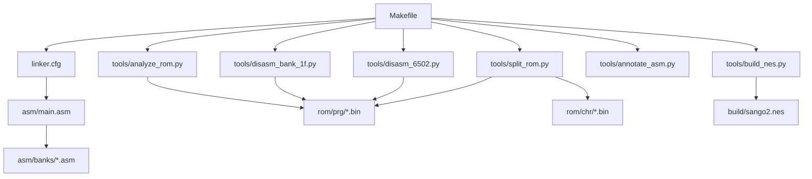
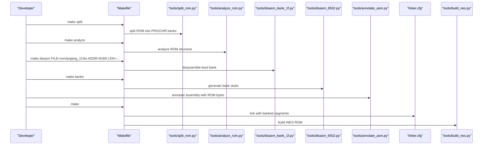
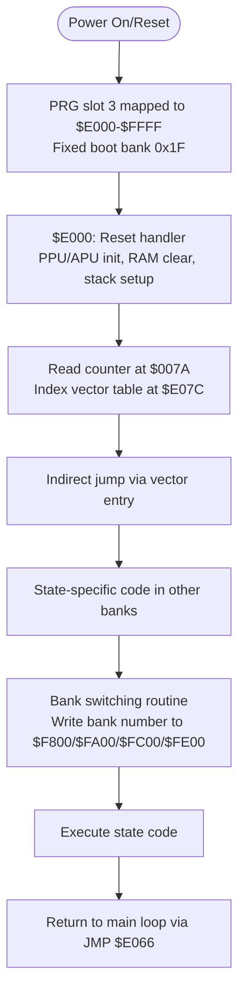
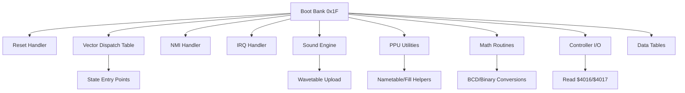
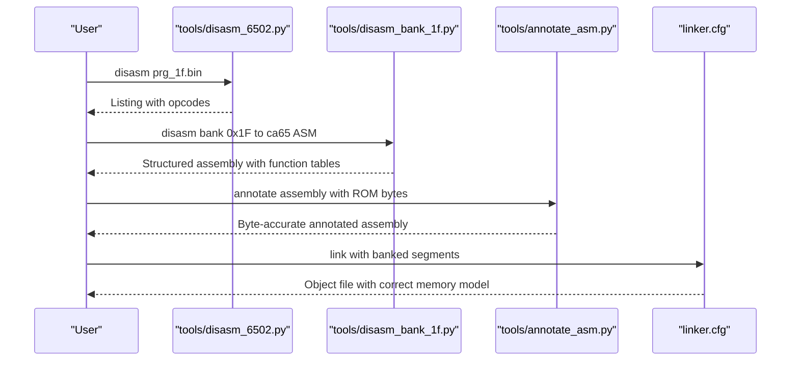
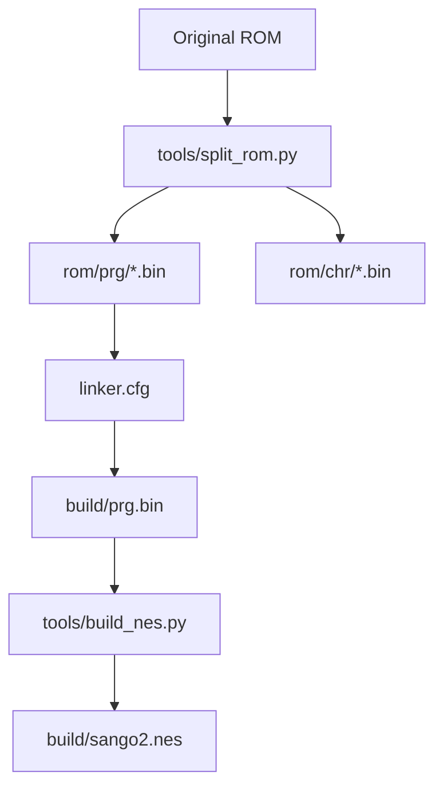
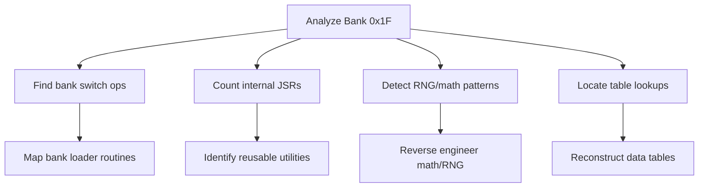
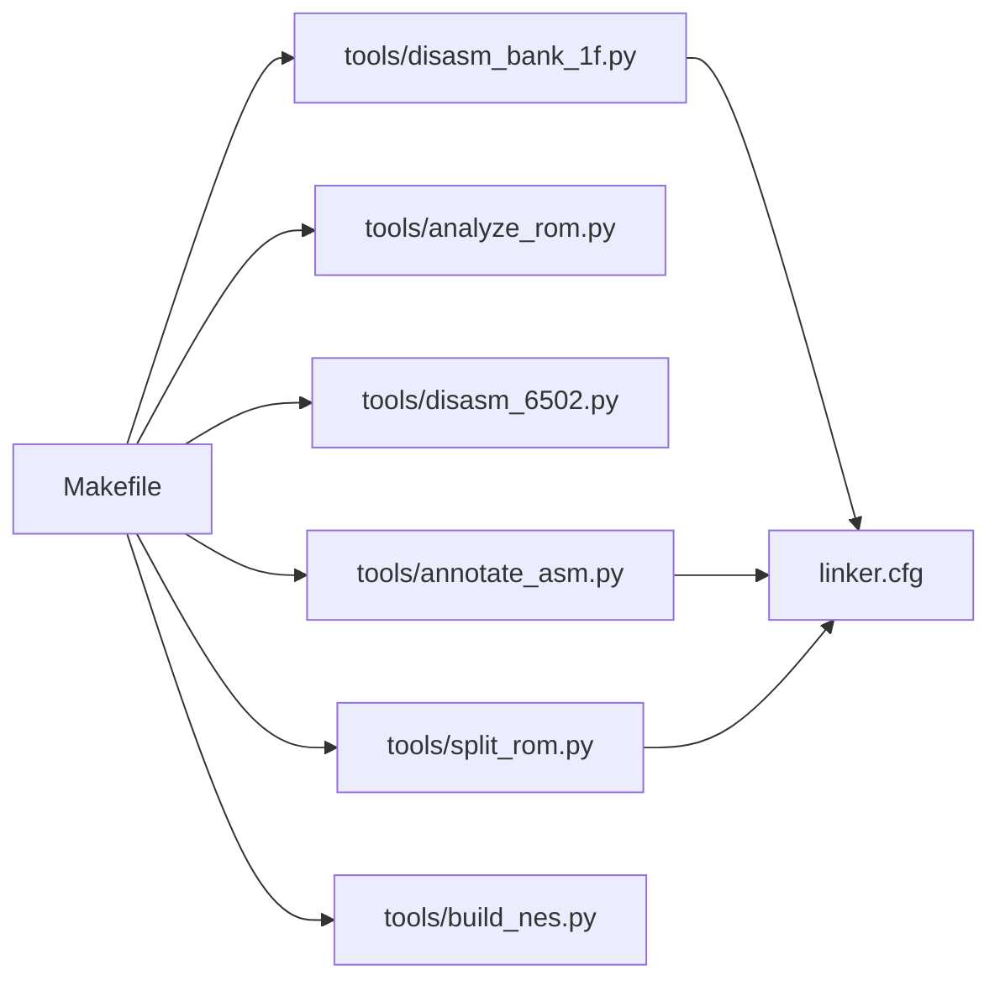

# Advanced Topics

<cite>
**Referenced Files in This Document**
- [PROJECT.md](file://PROJECT.md)
- [Makefile](file://Makefile)
- [linker.cfg](file://linker.cfg)
- [include/namco163.h](file://include/namco163.h)
- [tools/build_nes.py](file://tools/build_nes.py)
- [tools/disasm_6502.py](file://tools/disasm_6502.py)
- [tools/disasm_bank_1f.py](file://tools/disasm_bank_1f.py)
- [tools/analyze_bank_1f.py](file://tools/analyze_bank_1f.py)
- [tools/analyze_bank_1f_full.py](file://tools/analyze_bank_1f_full.py)
- [tools/analyze_rom.py](file://tools/analyze_rom.py)
- [tools/generate_bank_stubs.py](file://tools/generate_bank_stubs.py)
- [tools/split_rom.py](file://tools/split_rom.py)
- [tools/annotate_asm.py](file://tools/annotate_asm.py)
- [tools/katakana_identify.py](file://tools/katakana_identify.py)
- [tools/katakana_match.py](file://tools/katakana_match.py)
</cite>

## Table of Contents
1. [Introduction](#introduction)
2. [Project Structure](#project-structure)
3. [Core Components](#core-components)
4. [Architecture Overview](#architecture-overview)
5. [Detailed Component Analysis](#detailed-component-analysis)
6. [Dependency Analysis](#dependency-analysis)
7. [Performance Considerations](#performance-considerations)
8. [Troubleshooting Guide](#troubleshooting-guide)
9. [Conclusion](#conclusion)
10. [Appendices](#appendices)

## Introduction
This document presents advanced topics for the disassembly project of Sangokushi 2 - Haou no Tairiku (J), focusing on the Namco-163 mapper’s unique bank switching behavior, the fixed boot bank concept, and how these differ from other mappers. It also covers performance optimization strategies used in the original code, cross-platform considerations for the disassembly tools, advanced analysis techniques for code reuse and workflow optimization, and future enhancements such as automated pattern recognition and modern tooling integration. Guidance for contributing to the project and maintaining code quality is included.

## Project Structure
The project is organized around a Make-driven workflow, a cc65 toolchain, and a suite of Python tools for ROM splitting, analysis, disassembly, and annotation. The ROM is split into 32 PRG banks (8KB each) and 32 CHR banks (8KB each) for mapper 19 (Namco-163). The linker configuration defines four 8KB PRG slots ($8000–$FFFF) and supports banked code segments.

**Diagram sources**
- [Makefile:1-102](file://Makefile#L1-L102)
- [linker.cfg:1-55](file://linker.cfg#L1-L55)
- [tools/split_rom.py:1-140](file://tools/split_rom.py#L1-L140)
- [tools/disasm_6502.py:1-363](file://tools/disasm_6502.py#L1-L363)
- [tools/disasm_bank_1f.py:1-561](file://tools/disasm_bank_1f.py#L1-L561)
- [tools/analyze_rom.py:1-135](file://tools/analyze_rom.py#L1-L135)
- [tools/build_nes.py:1-58](file://tools/build_nes.py#L1-L58)
- [tools/annotate_asm.py:1-481](file://tools/annotate_asm.py#L1-L481)

**Section sources**
- [PROJECT.md:14-47](file://PROJECT.md#L14-L47)
- [Makefile:1-102](file://Makefile#L1-L102)
- [linker.cfg:1-55](file://linker.cfg#L1-L55)

## Core Components
- Namco-163 mapper definitions and bank-switch macros for 8KB PRG slots.
- ROM splitting and header parsing for mapper 19.
- Disassemblers for 6502 code and for the boot bank with function tables.
- ROM analysis tools to identify code regions, vectors, and bank characteristics.
- Assembly annotation pipeline to reconcile assembly with ROM bytes.
- Build pipeline to produce an iNES ROM with correct mapper and header.
- Tools for font identification and katakana glyph analysis.

**Section sources**
- [include/namco163.h:1-87](file://include/namco163.h#L1-L87)
- [tools/split_rom.py:1-140](file://tools/split_rom.py#L1-L140)
- [tools/disasm_6502.py:1-363](file://tools/disasm_6502.py#L1-L363)
- [tools/disasm_bank_1f.py:1-561](file://tools/disasm_bank_1f.py#L1-L561)
- [tools/analyze_rom.py:1-135](file://tools/analyze_rom.py#L1-L135)
- [tools/annotate_asm.py:1-481](file://tools/annotate_asm.py#L1-L481)
- [tools/build_nes.py:1-58](file://tools/build_nes.py#L1-L58)
- [tools/katakana_identify.py:1-299](file://tools/katakana_identify.py#L1-L299)
- [tools/katakana_match.py:1-217](file://tools/katakana_match.py#L1-L217)

## Architecture Overview
The architecture centers on a deterministic ROM split and analysis phase, followed by targeted disassembly of the boot bank and incremental disassembly of other banks. The linker configuration models the four 8KB PRG slots used by the mapper, and the annotation pipeline ensures assembly remains byte-accurate with the ROM.

**Diagram sources**
- [Makefile:1-102](file://Makefile#L1-L102)
- [tools/split_rom.py:1-140](file://tools/split_rom.py#L1-L140)
- [tools/analyze_rom.py:1-135](file://tools/analyze_rom.py#L1-L135)
- [tools/disasm_bank_1f.py:1-561](file://tools/disasm_bank_1f.py#L1-L561)
- [tools/disasm_6502.py:1-363](file://tools/disasm_6502.py#L1-L363)
- [tools/annotate_asm.py:1-481](file://tools/annotate_asm.py#L1-L481)
- [linker.cfg:1-55](file://linker.cfg#L1-L55)
- [tools/build_nes.py:1-58](file://tools/build_nes.py#L1-L58)

## Detailed Component Analysis

### Namco-163 Mapper: Bank Switching Behavior and Fixed Boot Bank
- Mapper 19 (Namco-163) uses 8KB PRG bank switching via write-only addresses $F800–$FFFF, controlling four 8KB slots in $8000–$FFFF.
- The fixed boot bank is mapped to PRG slot 3 ($E000–$FFFF) at power-on/reset, not $8000–$9FFF. This is critical for locating the reset handler and dispatch logic.
- Bank-switch macros simplify loading specific banks into each slot, enabling dynamic code loading during runtime.

**Diagram sources**
- [PROJECT.md:84-117](file://PROJECT.md#L84-L117)
- [include/namco163.h:10-14](file://include/namco163.h#L10-L14)
- [include/namco163.h:68-86](file://include/namco163.h#L68-L86)

**Section sources**
- [PROJECT.md:84-117](file://PROJECT.md#L84-L117)
- [include/namco163.h:10-14](file://include/namco163.h#L10-L14)
- [include/namco163.h:68-86](file://include/namco163.h#L68-L86)

### Bank 0x1F Analysis: Dispatch, Handlers, and Utilities
- The boot bank contains the reset handler, a vector dispatch table, NMI/IRQ handlers, sound engine, PPU utilities, math routines, controller I/O, and data tables.
- Analysis tools identify internal JSR targets, bank switching patterns, RNG helpers, math routines, and table references to accelerate disassembly.

**Diagram sources**
- [tools/analyze_bank_1f.py:1-157](file://tools/analyze_bank_1f.py#L1-L157)
- [tools/analyze_bank_1f_full.py:1-154](file://tools/analyze_bank_1f_full.py#L1-L154)
- [tools/disasm_bank_1f.py:136-324](file://tools/disasm_bank_1f.py#L136-L324)

**Section sources**
- [tools/analyze_bank_1f.py:1-157](file://tools/analyze_bank_1f.py#L1-L157)
- [tools/analyze_bank_1f_full.py:1-154](file://tools/analyze_bank_1f_full.py#L1-L154)
- [tools/disasm_bank_1f.py:136-324](file://tools/disasm_bank_1f.py#L136-L324)

### Disassemblers and Annotation Pipeline
- A lightweight 6502 disassembler produces listing-style output for quick exploration.
- A specialized disassembler for bank 0x1F generates a complete ca65-compatible assembly with named functions, tables, and vectors.
- An annotation tool reconciles assembly with ROM bytes, estimates instruction sizes, and resynchronizes on address hints to maintain byte accuracy.

**Diagram sources**
- [tools/disasm_6502.py:1-363](file://tools/disasm_6502.py#L1-L363)
- [tools/disasm_bank_1f.py:1-561](file://tools/disasm_bank_1f.py#L1-L561)
- [tools/annotate_asm.py:1-481](file://tools/annotate_asm.py#L1-L481)
- [linker.cfg:18-55](file://linker.cfg#L18-L55)

**Section sources**
- [tools/disasm_6502.py:1-363](file://tools/disasm_6502.py#L1-L363)
- [tools/disasm_bank_1f.py:1-561](file://tools/disasm_bank_1f.py#L1-L561)
- [tools/annotate_asm.py:1-481](file://tools/annotate_asm.py#L1-L481)
- [linker.cfg:18-55](file://linker.cfg#L18-L55)

### ROM Splitting, Linking, and Building
- ROM splitting parses the iNES header, separates PRG/CHR banks, and generates a combined PRG for analysis.
- The linker configuration models the four PRG slots and banked segments, aligning with mapper 19 behavior.
- The build script adds an iNES header, pads PRG to 16KB pages, and creates a ROM with mapper 19 metadata.

**Diagram sources**
- [tools/split_rom.py:38-122](file://tools/split_rom.py#L38-L122)
- [linker.cfg:18-55](file://linker.cfg#L18-L55)
- [tools/build_nes.py:10-51](file://tools/build_nes.py#L10-L51)

**Section sources**
- [tools/split_rom.py:38-122](file://tools/split_rom.py#L38-L122)
- [linker.cfg:18-55](file://linker.cfg#L18-L55)
- [tools/build_nes.py:10-51](file://tools/build_nes.py#L10-L51)

### Advanced Analysis Techniques: Code Reuse and Optimization
- Bank switching pattern detection identifies STA $F800/$FA00/$FC00/$FE00 sequences and surrounding LDA immediate instructions to locate bank loaders.
- Internal JSR analysis within bank 0x1F reveals reusable utility functions and hotspots for graphics/sound logic.
- RNG and math routine detection accelerates understanding of core systems.
- Table lookup patterns (e.g., LDA abs,Y) indicate data-driven behavior and aid in reconstructing function semantics.

**Diagram sources**
- [tools/analyze_bank_1f.py:44-154](file://tools/analyze_bank_1f.py#L44-L154)
- [tools/analyze_bank_1f_full.py:46-151](file://tools/analyze_bank_1f_full.py#L46-L151)

**Section sources**
- [tools/analyze_bank_1f.py:44-154](file://tools/analyze_bank_1f.py#L44-L154)
- [tools/analyze_bank_1f_full.py:46-151](file://tools/analyze_bank_1f_full.py#L46-L151)

### Cross-Platform Considerations
- The project relies on a POSIX shell and Python 3 scripts, with cc65 tools invoked via absolute paths in the Makefile.
- To support diverse environments, consider:
  - Using environment variables for tool paths and adding a cross-platform launcher script.
  - Ensuring Python scripts handle path separators and line endings consistently.
  - Verifying ca65/ld65 availability and version compatibility across platforms.

[No sources needed since this section provides general guidance]

### Future Enhancement Possibilities
- Automated code pattern recognition:
  - Extend analysis tools to detect recurring instruction sequences, ISR entry/exit patterns, and banked call trampolines.
- Enhanced debugging capabilities:
  - Integrate with a 6502 debugger or emulator to step through disassembly and visualize bank switching.
- Modern tooling integration:
  - Adopt structured logging, unit tests for analysis scripts, and CI pipelines to validate byte-exactness.
  - Provide a web-based viewer for annotated assembly and ROM maps.

[No sources needed since this section provides general guidance]

## Dependency Analysis
The project exhibits a clean separation of concerns: Make orchestrates Python tools, which operate on ROM binaries and produce assembly artifacts consumed by the linker. The linker configuration enforces the mapper’s memory model.

**Diagram sources**
- [Makefile:1-102](file://Makefile#L1-L102)
- [tools/split_rom.py:1-140](file://tools/split_rom.py#L1-L140)
- [tools/analyze_rom.py:1-135](file://tools/analyze_rom.py#L1-L135)
- [tools/disasm_6502.py:1-363](file://tools/disasm_6502.py#L1-L363)
- [tools/disasm_bank_1f.py:1-561](file://tools/disasm_bank_1f.py#L1-L561)
- [tools/annotate_asm.py:1-481](file://tools/annotate_asm.py#L1-L481)
- [tools/build_nes.py:1-58](file://tools/build_nes.py#L1-L58)
- [linker.cfg:1-55](file://linker.cfg#L1-L55)

**Section sources**
- [Makefile:1-102](file://Makefile#L1-L102)
- [linker.cfg:18-55](file://linker.cfg#L18-L55)

## Performance Considerations
- Memory access patterns:
  - Bank switching occurs via writes to $F800–$FFFF; minimize redundant switches by grouping related work within a single bank context.
  - Use macros to centralize bank selection and reduce branching overhead.
- Interrupt handling efficiency:
  - Keep NMI/IRQ handlers concise; defer heavy work to state machines or callbacks.
  - Use indexed table lookups for dispatch to reduce branching costs.
- Graphics rendering optimizations:
  - Batch PPU updates and tile writes; precompute scroll and attribute updates.
  - Reuse CHR data where possible and avoid frequent bank switches during rendering.

[No sources needed since this section provides general guidance]

## Troubleshooting Guide
- Byte-accuracy verification:
  - Use the annotation tool to reconcile assembly with ROM bytes and detect mismatches early.
- ROM rebuild validation:
  - Compare the rebuilt ROM with the original using the verification script to catch discrepancies.
- Bank stub generation:
  - Ensure bank stubs are regenerated after ROM splitting and that linker segments reflect the current bank layout.

**Section sources**
- [tools/annotate_asm.py:315-481](file://tools/annotate_asm.py#L315-L481)
- [tools/build_nes.py:10-51](file://tools/build_nes.py#L10-L51)
- [tools/generate_bank_stubs.py:12-53](file://tools/generate_bank_stubs.py#L12-L53)

## Conclusion
This advanced topics guide highlights the unique aspects of the Namco-163 mapper, the fixed boot bank concept, and practical optimization strategies present in the original code. It outlines robust analysis techniques, cross-platform considerations, and pathways for future enhancements. By leveraging the provided tools and methodologies, contributors can efficiently extend the disassembly, maintain accuracy, and integrate modern development practices.

## Appendices
- Contributing guidelines:
  - Follow the established Make targets and tooling; keep ROM analysis and disassembly synchronized.
  - Maintain strict byte accuracy using the annotation pipeline and verification steps.
  - Document discovered patterns and extend analysis scripts to automate reuse detection.

[No sources needed since this section provides general guidance]