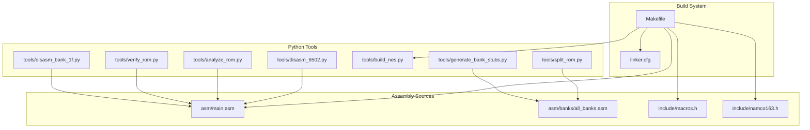
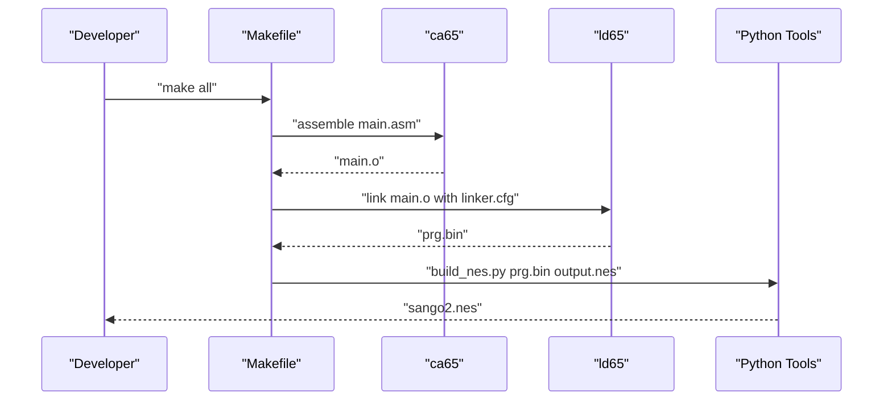
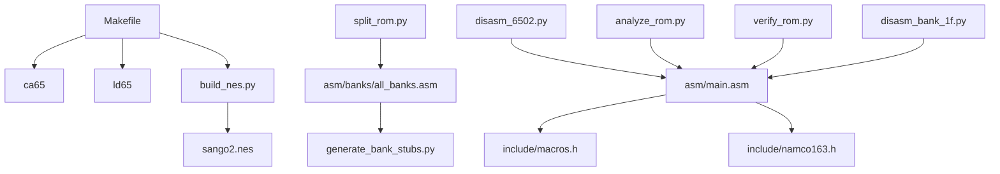

# Cross-Platform Considerations

<cite>
**Referenced Files in This Document**
- [Makefile](file://Makefile)
- [PROJECT.md](file://PROJECT.md)
- [linker.cfg](file://linker.cfg)
- [tools/build_nes.py](file://tools/build_nes.py)
- [tools/generate_bank_stubs.py](file://tools/generate_bank_stubs.py)
- [tools/split_rom.py](file://tools/split_rom.py)
- [tools/disasm_6502.py](file://tools/disasm_6502.py)
- [tools/analyze_rom.py](file://tools/analyze_rom.py)
- [tools/verify_rom.py](file://tools/verify_rom.py)
- [tools/disasm_bank_1f.py](file://tools/disasm_bank_1f.py)
- [asm/main.asm](file://asm/main.asm)
- [include/macros.h](file://include/macros.h)
- [include/namco163.h](file://include/namco163.h)
- [asm/banks/all_banks.asm](file://asm/banks/all_banks.asm)
</cite>

## Table of Contents
1. [Introduction](#introduction)
2. [Project Structure](#project-structure)
3. [Core Components](#core-components)
4. [Architecture Overview](#architecture-overview)
5. [Detailed Component Analysis](#detailed-component-analysis)
6. [Dependency Analysis](#dependency-analysis)
7. [Performance Considerations](#performance-considerations)
8. [Troubleshooting Guide](#troubleshooting-guide)
9. [Conclusion](#conclusion)
10. [Appendices](#appendices)

## Introduction
This document provides comprehensive cross-platform considerations for the project’s compatibility across different operating systems and development environments. It focuses on:
- Python script compatibility across Windows, macOS, and Linux (path separators, case sensitivity, executable permissions)
- Makefile portability and build system behavior on POSIX-like systems
- Toolchain compatibility for cc65 (ca65, ld65) versions and installation approaches
- File encoding and line ending handling for assembly source files
- Platform-specific troubleshooting, dependency resolution, environment setup, and emulator/hardware testing considerations

## Project Structure
The project combines a Makefile-driven build pipeline with Python-based tooling for ROM splitting, disassembly, analysis, and verification. Assembly sources use ca65 syntax and include platform-agnostic constructs, but the build system and tooling require attention to cross-platform differences.

**Diagram sources**
- [Makefile:1-102](file://Makefile#L1-L102)
- [linker.cfg:1-55](file://linker.cfg#L1-L55)
- [asm/main.asm:1-141](file://asm/main.asm#L1-L141)
- [asm/banks/all_banks.asm:1-38](file://asm/banks/all_banks.asm#L1-L38)
- [include/macros.h:1-72](file://include/macros.h#L1-L72)
- [include/namco163.h:1-87](file://include/namco163.h#L1-L87)
- [tools/split_rom.py:1-140](file://tools/split_rom.py#L1-L140)
- [tools/disasm_6502.py:1-363](file://tools/disasm_6502.py#L1-L363)
- [tools/analyze_rom.py:1-135](file://tools/analyze_rom.py#L1-L135)
- [tools/verify_rom.py:1-73](file://tools/verify_rom.py#L1-L73)
- [tools/build_nes.py:1-58](file://tools/build_nes.py#L1-L58)
- [tools/generate_bank_stubs.py:1-53](file://tools/generate_bank_stubs.py#L1-L53)
- [tools/disasm_bank_1f.py:1-561](file://tools/disasm_bank_1f.py#L1-L561)

**Section sources**
- [Makefile:1-102](file://Makefile#L1-L102)
- [PROJECT.md:1-181](file://PROJECT.md#L1-L181)

## Core Components
- Build system: Makefile orchestrates assembling, linking, and ROM creation using ca65/ld65 and Python tools.
- Linker configuration: linker.cfg defines memory regions and segments for the Namco-163 mapper.
- Assembly sources: asm/main.asm and include/* define the entry point, interrupts, and mapper macros.
- Python tools: ROM splitting, disassembly, analysis, verification, and ROM packaging.

Key cross-platform considerations:
- Makefile uses POSIX shell commands and absolute paths; requires adjustments for Windows.
- Python scripts rely on binary file I/O and OS-specific path handling; generally portable but must avoid implicit assumptions.
- Assembly includes and segment names are case-sensitive and must remain consistent across platforms.

**Section sources**
- [Makefile:1-102](file://Makefile#L1-L102)
- [linker.cfg:1-55](file://linker.cfg#L1-L55)
- [asm/main.asm:1-141](file://asm/main.asm#L1-L141)
- [include/macros.h:1-72](file://include/macros.h#L1-L72)
- [include/namco163.h:1-87](file://include/namco163.h#L1-L87)

## Architecture Overview
The build pipeline integrates assembly, linking, and Python post-processing to produce a byte-identical ROM.

**Diagram sources**
- [Makefile:31-48](file://Makefile#L31-L48)
- [tools/build_nes.py:10-51](file://tools/build_nes.py#L10-L51)

## Detailed Component Analysis

### Python Script Compatibility Across Platforms
- Path separators: Scripts construct paths using os.path.join and string formatting; ensure consistent use of forward slashes or os.path.join for portability.
- Case sensitivity: Include filenames and .include directives must match case exactly on case-sensitive filesystems (Linux/macOS).
- Executable permissions: On POSIX systems, ensure scripts have execute permission; on Windows, rely on shebang invocation via python3 or equivalent.
- File I/O: All scripts use binary mode for ROM-related operations; text mode is avoided for robustness.

Recommendations:
- Use os.path.join for constructing paths in Python scripts to avoid hard-coded separators.
- Normalize filenames to lowercase in .include statements to reduce case sensitivity issues.
- Add explicit checks for file existence and handle FileNotFoundError gracefully.
- Prefer universal newlines or specify newline handling when writing text files.

**Section sources**
- [tools/split_rom.py:64-67](file://tools/split_rom.py#L64-L67)
- [tools/split_rom.py:79-82](file://tools/split_rom.py#L79-L82)
- [tools/split_rom.py:94-97](file://tools/split_rom.py#L94-L97)
- [tools/split_rom.py:100-114](file://tools/split_rom.py#L100-L114)
- [tools/generate_bank_stubs.py:14-34](file://tools/generate_bank_stubs.py#L14-L34)
- [tools/generate_bank_stubs.py:42-44](file://tools/generate_bank_stubs.py#L42-L44)
- [tools/disasm_6502.py:350-351](file://tools/disasm_6502.py#L350-L351)
- [tools/analyze_rom.py:12-13](file://tools/analyze_rom.py#L12-L13)
- [tools/verify_rom.py:12-16](file://tools/verify_rom.py#L12-L16)

### Makefile Portability Challenges and Solutions
Observed issues:
- Hardcoded absolute path for CC65_HOME and tool locations.
- Uses POSIX shell features (mkdir -p, echo, ls, xxd) and shell redirection.
- Targets assume Unix-like behavior for file operations.

Solutions:
- Parameterize toolchain paths and directories via environment variables or Make variables.
- Replace hardcoded paths with $(CC65_HOME)/bin/ca65 and $(CC65_HOME)/bin/ld65.
- Use $(shell ...) to detect tool availability and adjust flags accordingly.
- Replace shell-specific commands with portable alternatives or guard with OS detection.
- Normalize target names and dependency paths to avoid case sensitivity pitfalls.

Example adjustments:
- Define CC65_HOME via environment variable or Make argument.
- Use $(shell command) to probe for ca65 and ld65 presence.
- Replace echo/ls/xxd with portable equivalents or guard with OS checks.

**Section sources**
- [Makefile:5-10](file://Makefile#L5-L10)
- [Makefile:39-43](file://Makefile#L39-L43)
- [Makefile:83-100](file://Makefile#L83-L100)

### Toolchain Compatibility: cc65 Versions and Installation
- The project expects ca65 and ld65 from cc65 V2.19.
- Installation location is configured via CC65_HOME; ensure PATH includes the cc65 binaries.

Recommendations:
- Pin toolchain versions in CI or developer notes.
- Provide installation steps for each platform (Homebrew on macOS, package managers on Linux, manual install on Windows).
- Validate tool versions during build with a pre-check target.

**Section sources**
- [PROJECT.md:51-56](file://PROJECT.md#L51-L56)
- [Makefile:5-10](file://Makefile#L5-L10)

### File Encoding and Line Endings in Assembly Sources
- Assembly files are text-based and use ASCII identifiers and numeric literals.
- No explicit encoding declarations are present; default UTF-8 is recommended for cross-platform consistency.
- Line endings should be LF (Unix-style) to maintain compatibility with ca65 and POSIX tooling.

Recommendations:
- Enforce LF line endings in version control and CI.
- Avoid non-ASCII characters in source comments and labels.
- Keep include filenames lowercase to prevent case-sensitivity issues.

**Section sources**
- [asm/main.asm:1-141](file://asm/main.asm#L1-L141)
- [include/macros.h:1-72](file://include/macros.h#L1-L72)
- [include/namco163.h:1-87](file://include/namco163.h#L1-L87)
- [asm/banks/all_banks.asm:1-38](file://asm/banks/all_banks.asm#L1-L38)

### Platform-Specific Build Targets and Behavior
- Default target builds the ROM and prints metadata using ls and xxd; these are POSIX-specific.
- clean and distclean remove files using rm; ensure wildcard expansion is handled consistently.
- disasm target accepts positional arguments via make; ensure shell compatibility.

Recommendations:
- Add a pre-check to verify ca65/ld65 presence and version.
- Provide a Windows-friendly batch or PowerShell wrapper if needed.
- Consider adding a CI matrix with Linux, macOS, and Windows runners.

**Section sources**
- [Makefile:31-36](file://Makefile#L31-L36)
- [Makefile:72-80](file://Makefile#L72-L80)
- [Makefile:64-66](file://Makefile#L64-L66)

### Assembly Source Portability
- Segment names and macro definitions are case-sensitive; ensure consistency across platforms.
- .include directives reference lowercase filenames; maintain this convention.
- Interrupt vectors and register definitions are constant and portable.

Recommendations:
- Keep all include filenames lowercase.
- Avoid platform-specific directives in assembly.
- Use ca65’s .assert and .error for early validation of constants.

**Section sources**
- [asm/main.asm:25-141](file://asm/main.asm#L25-L141)
- [include/macros.h:60-71](file://include/macros.h#L60-L71)
- [include/namco163.h:68-86](file://include/namco163.h#L68-L86)
- [asm/banks/all_banks.asm:5-36](file://asm/banks/all_banks.asm#L5-L36)

### Python Tooling Portability
- All tools open files in binary mode for ROM operations and text mode for informational outputs.
- Path construction uses os.path.join and string formatting; ensure consistent casing.
- Argument parsing relies on sys.argv; add validation for missing or invalid arguments.

Recommendations:
- Add explicit argument validation and helpful error messages.
- Use pathlib.Path for modern path handling if desired.
- Ensure scripts are invoked with python3 explicitly on POSIX systems.

**Section sources**
- [tools/build_nes.py:12-13](file://tools/build_nes.py#L12-L13)
- [tools/build_nes.py:40-43](file://tools/build_nes.py#L40-L43)
- [tools/split_rom.py:124-136](file://tools/split_rom.py#L124-L136)
- [tools/disasm_6502.py:336-362](file://tools/disasm_6502.py#L336-L362)
- [tools/analyze_rom.py:129-134](file://tools/analyze_rom.py#L129-L134)
- [tools/verify_rom.py:53-69](file://tools/verify_rom.py#L53-L69)
- [tools/generate_bank_stubs.py:48-52](file://tools/generate_bank_stubs.py#L48-L52)

## Dependency Analysis
The build depends on ca65/ld65 and Python 3. Assembly sources depend on include files. Python tools depend on standard libraries and operate independently of external packages.

**Diagram sources**
- [Makefile:31-48](file://Makefile#L31-L48)
- [tools/build_nes.py:10-51](file://tools/build_nes.py#L10-L51)
- [asm/main.asm:6-7](file://asm/main.asm#L6-L7)
- [include/macros.h:1-72](file://include/macros.h#L1-L72)
- [include/namco163.h:1-87](file://include/namco163.h#L1-L87)
- [asm/banks/all_banks.asm:1-38](file://asm/banks/all_banks.asm#L1-L38)
- [tools/generate_bank_stubs.py:12-34](file://tools/generate_bank_stubs.py#L12-L34)
- [tools/split_rom.py:38-122](file://tools/split_rom.py#L38-L122)
- [tools/disasm_6502.py:286-334](file://tools/disasm_6502.py#L286-L334)
- [tools/analyze_rom.py:10-128](file://tools/analyze_rom.py#L10-L128)
- [tools/verify_rom.py:10-51](file://tools/verify_rom.py#L10-L51)
- [tools/disasm_bank_1f.py:361-433](file://tools/disasm_bank_1f.py#L361-L433)

**Section sources**
- [Makefile:1-102](file://Makefile#L1-L102)
- [linker.cfg:1-55](file://linker.cfg#L1-L55)

## Performance Considerations
- ROM splitting and disassembly are I/O bound; ensure fast storage for large ROMs.
- Byte-for-byte verification compares entire ROMs; consider checksums for quick checks.
- Assembly listings and maps can be large; disable listing generation in production builds if unnecessary.

[No sources needed since this section provides general guidance]

## Troubleshooting Guide

Common build issues and resolutions:
- Toolchain not found
  - Ensure ca65 and ld65 are installed and on PATH.
  - Set CC65_HOME to the installation directory and re-run make.
- Path separator errors on Windows
  - Use forward slashes or os.path.join in scripts; avoid backslashes.
- Case sensitivity errors
  - Ensure include filenames match exactly (lowercase).
- Missing Python dependencies
  - All tools use standard library modules; ensure Python 3 is available.
- Verification failures
  - Confirm original ROM path and rebuilt ROM path.
  - Check ROM sizes and mapper compatibility.

Environment setup variations:
- Linux/macOS
  - Install cc65 via package manager or compile from source.
  - Add CC65_HOME/bin to PATH.
- Windows
  - Use MSYS2/MinGW or WSL to run make and Python.
  - Alternatively, use a cross-platform build wrapper.

Testing across emulators and hardware:
- Emulators: Test with Mesen, Nestopia, and other widely used emulators.
- Hardware: Validate on compatible flash carts or FCEUX with accurate timing if applicable.

**Section sources**
- [PROJECT.md:49-68](file://PROJECT.md#L49-L68)
- [Makefile:5-10](file://Makefile#L5-L10)
- [tools/verify_rom.py:10-51](file://tools/verify_rom.py#L10-L51)

## Conclusion
The project’s build pipeline is primarily POSIX-centric but can be adapted for cross-platform use with minimal changes. By parameterizing toolchain paths, enforcing LF line endings, normalizing case sensitivity, and validating environment prerequisites, the project can reliably build on Windows, macOS, and Linux while maintaining byte-identical ROM outputs.

[No sources needed since this section summarizes without analyzing specific files]

## Appendices

### Appendix A: Makefile Targets and Cross-Platform Notes
- all: Builds the ROM; ensure POSIX shell commands are available.
- split: Requires an original ROM file; ensure path correctness.
- banks: Generates assembly stubs; ensure output directory exists.
- disasm/analyze/verify: Accept arguments via make; ensure shell compatibility.
- clean/distclean: Remove build artifacts; confirm wildcard behavior.

**Section sources**
- [Makefile:31-100](file://Makefile#L31-L100)

### Appendix B: Assembly Source Case Sensitivity Checklist
- All .include filenames must be lowercase.
- Segment names and macro names must match exactly.
- Avoid uppercase filenames in .include directives.

**Section sources**
- [asm/banks/all_banks.asm:5-36](file://asm/banks/all_banks.asm#L5-L36)
- [include/macros.h:60-71](file://include/macros.h#L60-L71)
- [include/namco163.h:68-86](file://include/namco163.h#L68-L86)