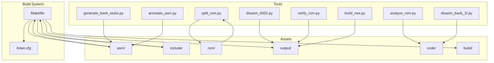
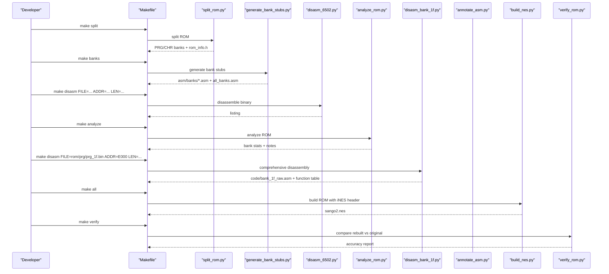
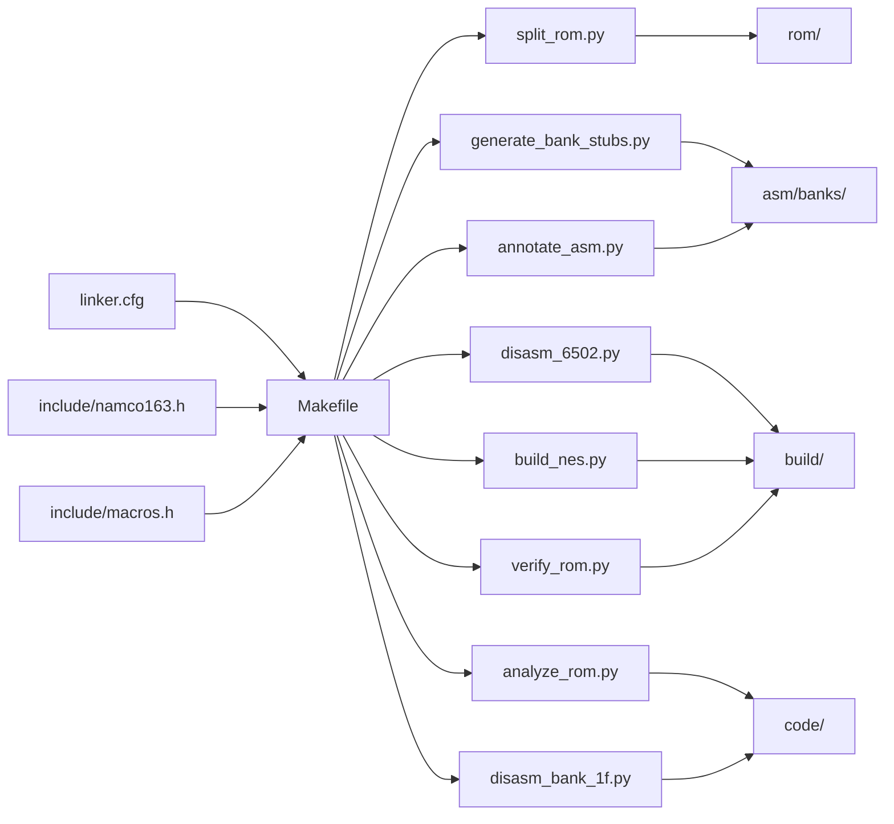

# Future Enhancements and Extensions

<cite>
**Referenced Files in This Document**
- [PROJECT.md](file://PROJECT.md)
- [Makefile](file://Makefile)
- [linker.cfg](file://linker.cfg)
- [tools/disasm_6502.py](file://tools/disasm_6502.py)
- [tools/analyze_rom.py](file://tools/analyze_rom.py)
- [tools/generate_bank_stubs.py](file://tools/generate_bank_stubs.py)
- [tools/verify_rom.py](file://tools/verify_rom.py)
- [tools/build_nes.py](file://tools/build_nes.py)
- [tools/split_rom.py](file://tools/split_rom.py)
- [tools/disasm_bank_1f.py](file://tools/disasm_bank_1f.py)
- [tools/annotate_asm.py](file://tools/annotate_asm.py)
- [include/namco163.h](file://include/namco163.h)
- [include/macros.h](file://include/macros.h)
- [code/bank_1f_analysis.md](file://code/bank_1f_analysis.md)
- [code/bank_1f_function_table.md](file://code/bank_1f_function_table.md)
</cite>

## Table of Contents
1. [Introduction](#introduction)
2. [Project Structure](#project-structure)
3. [Core Components](#core-components)
4. [Architecture Overview](#architecture-overview)
5. [Detailed Component Analysis](#detailed-component-analysis)
6. [Dependency Analysis](#dependency-analysis)
7. [Performance Considerations](#performance-considerations)
8. [Troubleshooting Guide](#troubleshooting-guide)
9. [Conclusion](#conclusion)
10. [Appendices](#appendices)

## Introduction
This document outlines future enhancements and extensions for the disassembly project, focusing on:
- Automated code pattern recognition and machine learning-driven identification of common game engine patterns
- Enhanced debugging capabilities for 6502 assembly, including integrated breakpoints, variable tracking, and step-through debugging
- Integrations with modern development tools (IDE plugins, syntax highlighting, automated ROM verification)
- Extension opportunities for similar games using the same mapper (template creation)
- Contributions to retro gaming preservation (standardized formats, collaborative platforms)
- Scalability improvements for larger ROMs and more complex mappers

## Project Structure
The project is organized around a cc65 toolchain, a Makefile-driven workflow, and a set of Python-based utilities for ROM splitting, disassembly, analysis, and verification. The structure supports incremental disassembly of 32 PRG banks and a fixed boot bank (0x1F) mapped to $E000-$FFFF.

**Diagram sources**
- [Makefile:1-102](file://Makefile#L1-L102)
- [linker.cfg:1-55](file://linker.cfg#L1-L55)
- [tools/split_rom.py:1-140](file://tools/split_rom.py#L1-L140)
- [tools/disasm_6502.py:1-363](file://tools/disasm_6502.py#L1-L363)
- [tools/analyze_rom.py:1-135](file://tools/analyze_rom.py#L1-L135)
- [tools/generate_bank_stubs.py:1-53](file://tools/generate_bank_stubs.py#L1-L53)
- [tools/verify_rom.py:1-73](file://tools/verify_rom.py#L1-L73)
- [tools/build_nes.py:1-58](file://tools/build_nes.py#L1-L58)
- [tools/disasm_bank_1f.py:1-561](file://tools/disasm_bank_1f.py#L1-L561)
- [tools/annotate_asm.py:1-481](file://tools/annotate_asm.py#L1-L481)

**Section sources**
- [PROJECT.md:14-47](file://PROJECT.md#L14-L47)
- [Makefile:1-102](file://Makefile#L1-L102)
- [linker.cfg:1-55](file://linker.cfg#L1-L55)

## Core Components
- ROM splitting and header parsing: splits iNES ROMs into PRG/CHR banks and generates ROM metadata and combined PRG for disassembly.
- Disassemblers: basic listing disassembler for quick exploration and a comprehensive bank-specific disassembler for Bank 0x1F.
- Analysis utilities: ROM structure analyzer and bank stub generator for 32 PRG banks.
- Verification pipeline: byte-accurate rebuild verification against the original ROM.
- Build pipeline: adds iNES header and produces a final ROM artifact.

Key capabilities:
- Bank 0x1F fixed mapping to $E000-$FFFF
- 8KB bank switching via mapper registers
- Interrupt vectors at $FFFA-$FFFF
- SRAM at $6000-$7FFF

**Section sources**
- [PROJECT.md:70-181](file://PROJECT.md#L70-L181)
- [tools/split_rom.py:38-122](file://tools/split_rom.py#L38-L122)
- [tools/disasm_6502.py:11-363](file://tools/disasm_6502.py#L11-L363)
- [tools/disasm_bank_1f.py:136-324](file://tools/disasm_bank_1f.py#L136-L324)
- [tools/analyze_rom.py:10-128](file://tools/analyze_rom.py#L10-L128)
- [tools/generate_bank_stubs.py:12-47](file://tools/generate_bank_stubs.py#L12-L47)
- [tools/verify_rom.py:10-51](file://tools/verify_rom.py#L10-L51)
- [tools/build_nes.py:10-51](file://tools/build_nes.py#L10-L51)
- [include/namco163.h:10-87](file://include/namco163.h#L10-L87)
- [include/macros.h:8-72](file://include/macros.h#L8-L72)

## Architecture Overview
The workflow integrates ROM processing, disassembly, analysis, and verification. The Makefile orchestrates targets for splitting, generating bank stubs, disassembling, analyzing, building, and verifying.

**Diagram sources**
- [Makefile:54-75](file://Makefile#L54-L75)
- [tools/split_rom.py:124-139](file://tools/split_rom.py#L124-L139)
- [tools/generate_bank_stubs.py:48-52](file://tools/generate_bank_stubs.py#L48-L52)
- [tools/disasm_6502.py:336-363](file://tools/disasm_6502.py#L336-L363)
- [tools/analyze_rom.py:129-135](file://tools/analyze_rom.py#L129-L135)
- [tools/disasm_bank_1f.py:545-561](file://tools/disasm_bank_1f.py#L545-L561)
- [tools/build_nes.py:52-58](file://tools/build_nes.py#L52-L58)
- [tools/verify_rom.py:53-70](file://tools/verify_rom.py#L53-L70)

## Detailed Component Analysis

### Automated Code Pattern Recognition and ML Approaches
Current state:
- The ROM analyzer identifies banks by JSR/RTI counts and interrupt vector candidates.
- Bank 0x1F disassembler provides a structured function table and raw listing for deeper analysis.

Enhancement opportunities:
- Train supervised classifiers on opcode sequences and control-flow patterns to:
  - Detect reset handlers, interrupt handlers, and dispatch tables automatically
  - Identify bank switching routines and mapper-specific sequences
  - Recognize common subsystems (sound, PPU, menu, math) based on instruction fingerprints
- Use clustering on byte-level histograms and entropy to discover data/code boundaries and string tables
- Integrate static analysis features (call graph extraction, global variable candidates) to bootstrap symbol naming

Implementation considerations:
- Feature engineering from disassembly listings and cross-references
- Training datasets from verified disassembly outputs (e.g., Bank 0x1F)
- Model deployment as a post-processing step in the analysis pipeline

[No sources needed since this section proposes enhancements not yet implemented]

### Enhanced Debugging Capabilities for 6502 Assembly
Current state:
- The project focuses on static disassembly and verification.
- No integrated debugger exists for 6502 assembly.

Proposed enhancements:
- Integrated breakpoints and step-through debugging:
  - Extend the disassembler to emit debug metadata (source line numbers, symbol tables)
  - Provide a lightweight 6502 emulator frontend with breakpoint support and single-stepping
- Variable tracking:
  - Track zero-page and RAM locations across function calls
  - Maintain a watch list for registers and memory-mapped hardware (PPU/APU)
- Interactive exploration:
  - Allow stepping across bank boundaries with automatic bank switching simulation
  - Visualize call stacks and return addresses during debugging sessions

Integration points:
- Leverage the annotated assembly pipeline to enrich disassembly with address and byte-level comments
- Use ROM metadata and bank switching macros to simulate mapper behavior during debugging

[No sources needed since this section proposes enhancements not yet implemented]

### Modern Development Tool Integrations
Current state:
- Assembly files are plain text with comments and directives.
- No IDE plugin or syntax highlighting is present.

Proposed integrations:
- IDE plugins:
  - VS Code extension with syntax highlighting, snippets for 6502 mnemonics, and a “Disassemble” command invoking the Python tools
  - Integration with cc65 toolchain for assembling and linking directly from the editor
- Syntax highlighting:
  - Define grammar rules for 6502 assembly, labels, directives, and comments
  - Support for ca65-specific constructs (segments, zp, bss)
- Automated ROM verification:
  - CI/CD pipeline to rebuild ROMs and compare checksums or byte-by-byte differences
  - Pre-commit hooks to verify accuracy before committing changes

[No sources needed since this section proposes integrations not yet implemented]

### Extension Opportunities for Similar Games Using the Same Mapper
Current state:
- The project demonstrates a complete workflow for a game using Mapper 19 (Namco-163) with 32 PRG banks.
- Bank stub generation automates the creation of 32 bank files.

Template creation:
- Provide a project template with:
  - A configurable linker.cfg for 4 PRG slots and mapper-specific memory regions
  - A Makefile target for splitting, stub generation, and disassembly
  - A bank-specific disassembler script pattern (similar to disasm_bank_1f.py)
  - A verification workflow using verify_rom.py
- Include mapper-specific include files (e.g., namco163.h) and macros (e.g., macros.h) for bank switching and PPU/APU helpers

[No sources needed since this section proposes templates not yet implemented]

### Contributions to Retro Gaming Preservation
Current state:
- The project emphasizes byte-accurate reconstruction and documentation.

Contributions:
- Standardized disassembly formats:
  - Publish a canonical format for annotated listings and function tables
  - Encourage consistent labeling of interrupt handlers, bank switching routines, and data tables
- Collaborative development platforms:
  - Host shared repositories for verified disassembly outputs
  - Establish review processes for accuracy and consistency
- Community guidelines:
  - Document naming conventions for labels and symbols
  - Provide templates for new projects and mapper families

[No sources needed since this section proposes community efforts not yet implemented]

### Scalability Improvements for Larger ROMs and Complex Mappers
Current state:
- The project handles 32 PRG banks (256KB) and a fixed boot bank.
- Linker configuration defines 4 PRG slots.

Scalability enhancements:
- Dynamic linker configuration:
  - Automatically generate MEMORY and SEGMENTS blocks based on ROM metadata
  - Support variable bank counts and mapper-specific slot layouts
- Parallel processing:
  - Multi-threaded disassembly of multiple banks
  - Concurrent analysis of opcode distributions and control-flow graphs
- Advanced analysis:
  - Cross-reference resolution across banks to identify global symbols and function pointers
  - Heuristics for detecting banked call trampolines and indirect jumps

[No sources needed since this section proposes scalability improvements not yet implemented]

## Dependency Analysis
The project’s dependencies are primarily Python scripts and the cc65 toolchain. The Makefile coordinates these tools, while linker configuration defines memory layout and segments.

**Diagram sources**
- [Makefile:1-102](file://Makefile#L1-L102)
- [linker.cfg:1-55](file://linker.cfg#L1-L55)
- [include/namco163.h:1-87](file://include/namco163.h#L1-L87)
- [include/macros.h:1-72](file://include/macros.h#L1-L72)

**Section sources**
- [Makefile:1-102](file://Makefile#L1-L102)
- [linker.cfg:1-55](file://linker.cfg#L1-L55)

## Performance Considerations
- Disassembly throughput:
  - Batch disassembly of multiple banks to reduce overhead
  - Use of efficient opcode tables and minimal branching in disassemblers
- Analysis speed:
  - Optimize ROM analysis by limiting scanning windows and caching results
  - Parallelize bank analysis where safe
- Verification:
  - Early exit on first mismatch for faster feedback
  - Use mmap for large ROM comparisons

[No sources needed since this section provides general guidance]

## Troubleshooting Guide
Common issues and resolutions:
- ROM size mismatch:
  - Ensure PRG padding to 16KB multiples and correct header flags
- Bank switching errors:
  - Verify mapper register writes and bank indices align with Namco-163 expectations
- Interrupt vector mismatches:
  - Confirm vector table layout and addresses in Bank 0x1F
- Assembly failures after annotation:
  - Use the verification option in the annotation tool to catch regressions

**Section sources**
- [tools/build_nes.py:15-51](file://tools/build_nes.py#L15-L51)
- [include/namco163.h:10-87](file://include/namco163.h#L10-L87)
- [tools/annotate_asm.py:462-478](file://tools/annotate_asm.py#L462-L478)

## Conclusion
The project establishes a robust foundation for disassembling and verifying a Namco-163 ROM. Future enhancements can automate pattern recognition, integrate modern debugging workflows, and scale to larger and more complex ROMs. Templates and community standards will accelerate porting to similar games and preserve these classic titles for future generations.

## Appendices
- Bank 0x1F analysis and function table are available for reference and can guide automated recognition of state machines and subsystems.

**Section sources**
- [code/bank_1f_analysis.md:1-800](file://code/bank_1f_analysis.md#L1-L800)
- [code/bank_1f_function_table.md:435-544](file://code/bank_1f_function_table.md#L435-L544)