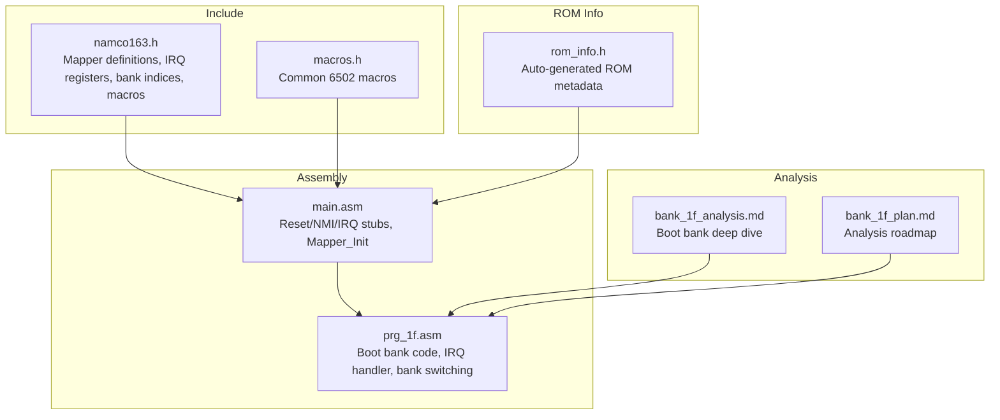
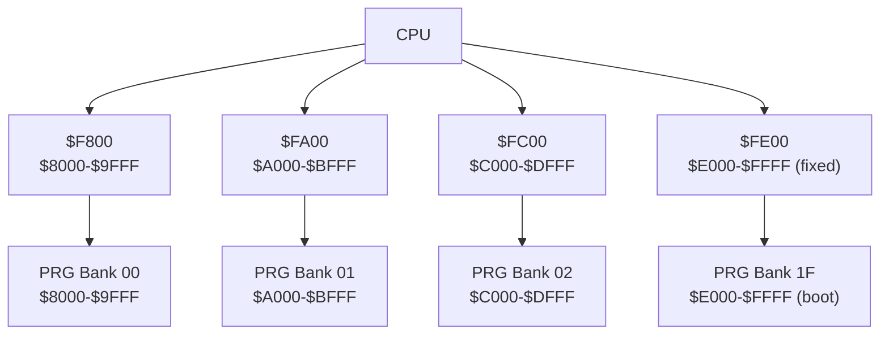
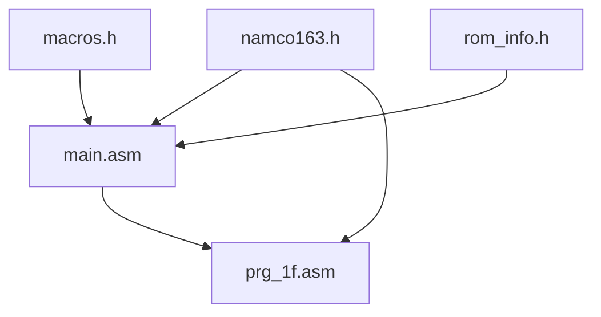

# Namco-163 Mapper Specifications

<cite>
**Referenced Files in This Document**
- [namco163.h](file://include/namco163.h)
- [macros.h](file://include/macros.h)
- [main.asm](file://asm/main.asm)
- [PROJECT.md](file://PROJECT.md)
- [bank_1f_analysis.md](file://code/bank_1f_analysis.md)
- [bank_1f_plan.md](file://code/bank_1f_plan.md)
- [prg_1f.asm](file://asm/banks/prg_1f.asm)
- [rom_info.h](file://rom/rom_info.h)
</cite>

## Table of Contents
1. [Introduction](#introduction)
2. [Project Structure](#project-structure)
3. [Core Components](#core-components)
4. [Architecture Overview](#architecture-overview)
5. [Detailed Component Analysis](#detailed-component-analysis)
6. [Dependency Analysis](#dependency-analysis)
7. [Performance Considerations](#performance-considerations)
8. [Troubleshooting Guide](#troubleshooting-guide)
9. [Conclusion](#conclusion)

## Introduction
This document provides comprehensive specifications for the Namco-163 mapper used by the game Sangokushi 2 - Haou no Tairiku (三國志II 覇王の大陸). The mapper enables 256 KB of PRG ROM through 32 banks of 8 KB each, with dedicated write-only registers for bank switching across four 8 KB PRG slots. A critical aspect of the mapper is the fixed boot bank concept, where the highest bank ($1F) is mapped to $E000-$FFFF at reset and cannot be switched, serving as the foundation for system initialization and runtime control.

## Project Structure
The project organizes mapper definitions, macros, and bank analysis around the Namco-163 implementation. Key elements include:
- Mapper definitions and bank indices in the include directory
- Bank switching macros for convenient usage
- Main assembly entry points and mapper initialization
- Detailed analysis of the boot bank ($1F) and its roles
- ROM metadata indicating mapper type and bank counts

**Diagram sources**
- [namco163.h:1-87](file://include/namco163.h#L1-L87)
- [macros.h:1-72](file://include/macros.h#L1-L72)
- [main.asm:1-141](file://asm/main.asm#L1-L141)
- [bank_1f_analysis.md:1-120](file://code/bank_1f_analysis.md#L1-L120)
- [bank_1f_plan.md:1-60](file://code/bank_1f_plan.md#L1-L60)
- [rom_info.h:1-9](file://rom/rom_info.h#L1-L9)

**Section sources**
- [PROJECT.md:14-47](file://PROJECT.md#L14-L47)
- [PROJECT.md:84-117](file://PROJECT.md#L84-L117)

## Core Components
- Mapper register addresses for PRG bank switching at $8000-$FFFF
- IRQ counter and latch registers for timing and interrupts
- Bank indices and predefined constants for all 32 PRG banks
- Bank switching macros for each PRG slot
- Fixed boot bank concept for $E000-$FFFF

Key definitions and capabilities:
- PRG configuration: 32 banks × 8 KB = 256 KB
- Bank switching registers (write-only): $F800, $FA00, $FC00, $FE00
- IRQ registers: $4800 (counter), $5000 (latch)
- Fixed boot bank: Bank $1F mapped to $E000-$FFFF at reset

**Section sources**
- [namco163.h:6-28](file://include/namco163.h#L6-L28)
- [namco163.h:10-14](file://include/namco163.h#L10-L14)
- [namco163.h:19-25](file://include/namco163.h#L19-L25)
- [PROJECT.md:84-117](file://PROJECT.md#L84-L117)

## Architecture Overview
The Namco-163 mapper exposes four write-only registers to control PRG bank mapping across four 8 KB slots:
- $8000-$9FFF controlled by $F800
- $A000-$BFFF controlled by $FA00
- $C000-$DFFF controlled by $FC00
- $E000-$FFFF controlled by $FE00

At reset, the highest bank ($1F) is fixed in the $E000-$FFFF slot and cannot be changed. This boot bank contains the reset handler, state dispatch, NMI/IRQ handlers, sound engine, PPU utilities, math routines, controller I/O, and data tables.

**Diagram sources**
- [namco163.h:10-14](file://include/namco163.h#L10-L14)
- [PROJECT.md:84-117](file://PROJECT.md#L84-L117)

**Section sources**
- [PROJECT.md:84-117](file://PROJECT.md#L84-L117)

## Detailed Component Analysis

### PRG Bank Switching Registers
- $F800 controls $8000-$9FFF
- $FA00 controls $A000-$BFFF
- $FC00 controls $C000-$DFFF
- $FE00 controls $E000-$FFFF (fixed boot bank)

Bank switching is performed by writing the desired bank number to the corresponding register. The fixed boot bank ($1F) is loaded at reset and remains immutable in the $E000-$FFFF slot.

**Section sources**
- [namco163.h:10-14](file://include/namco163.h#L10-L14)
- [PROJECT.md:84-117](file://PROJECT.md#L84-L117)

### Fixed Boot Bank Concept
- Bank $1F is mapped to $E000-$FFFF at reset
- Cannot be switched via $FE00 during normal operation
- Contains reset handler, state dispatch, NMI/IRQ handlers, sound engine, PPU utilities, math routines, controller I/O, and data tables
- Interrupt vectors are located at $FFFA-$FFFF in this bank

Practical implications:
- The boot bank serves as the central runtime for system initialization and control flow
- Bank switching macros should not target $FE00 for bank $1F during normal gameplay
- Bank switching routines must account for the fixed nature of this slot

**Section sources**
- [bank_1f_analysis.md:1-10](file://code/bank_1f_analysis.md#L1-L10)
- [bank_1f_analysis.md:209-210](file://code/bank_1f_analysis.md#L209-L210)
- [PROJECT.md:101-117](file://PROJECT.md#L101-L117)

### IRQ Counter and Latch Registers
- IRQ counter: $4800
- IRQ latch: $5000
- These registers are used for timing and interrupts, particularly in conjunction with the IRQ handler

Usage patterns:
- Initialize the IRQ counter during mapper initialization
- Configure the latch value for desired timing behavior
- The IRQ handler performs dispatch based on internal state and handles acknowledge logic

**Section sources**
- [namco163.h:19-25](file://include/namco163.h#L19-L25)
- [main.asm:115-121](file://asm/main.asm#L115-L121)
- [bank_1f_analysis.md:180-198](file://code/bank_1f_analysis.md#L180-L198)

### Bank Switching Macros and Usage Patterns
The project provides both explicit macros for each slot and a generalized macro that selects the appropriate register based on the target slot.

- Explicit macros:
  - switch_bank_8000(bank)
  - switch_bank_A000(bank)
  - switch_bank_C000(bank)
  - switch_bank_E000(bank)

- Generalized macro:
  - switch_prg_bank(slot, bank) selects the register based on the provided slot address

Usage patterns observed in the codebase:
- Mapper initialization writes known bank numbers to $F800, $FA00, $FC00
- Bank switching helper routines load configurations from tables and write to mapper registers
- Bank switching is used extensively to access banked display and data functions

**Section sources**
- [namco163.h:67-86](file://include/namco163.h#L67-L86)
- [macros.h:58-71](file://include/macros.h#L58-L71)
- [main.asm:115-121](file://asm/main.asm#L115-L121)
- [bank_1f_analysis.md:499-533](file://code/bank_1f_analysis.md#L499-L533)

### Bank Switching Helper Routine
The bank switching routine demonstrates the typical pattern:
- Compute table offset from the selected configuration index
- Load 8-byte configuration from a table
- Write the first four bytes to mapper registers $C000, $C800, $D000, $D800
- Store the last four bytes in RAM for later restoration

This routine is invoked by various game states to change the active banks for display and data access.

**Section sources**
- [bank_1f_analysis.md:499-533](file://code/bank_1f_analysis.md#L499-L533)
- [prg_1f.asm:781-818](file://asm/banks/prg_1f.asm#L781-L818)

### IRQ Handler and Mid-Frame Effects
The IRQ handler manages mid-frame raster effects and dispatches to sub-states based on internal state. It acknowledges IRQ sources and coordinates CHR bank changes and timing-sensitive operations.

Key aspects:
- Dispatch table based on internal state ($0060)
- CHR bank setup sequences with precise timing
- Acknowledgment of IRQ source via $5800

**Section sources**
- [bank_1f_analysis.md:180-198](file://code/bank_1f_analysis.md#L180-L198)
- [prg_1f.asm:2729-2826](file://asm/banks/prg_1f.asm#L2729-L2826)

### Practical Examples of Bank Switching Macros
- Using explicit macros to switch banks in specific slots
- Using the generalized macro to switch banks based on a variable slot address
- Initializing mapper registers during startup

These patterns ensure predictable bank mapping and facilitate modular code organization.

**Section sources**
- [namco163.h:67-86](file://include/namco163.h#L67-L86)
- [macros.h:58-71](file://include/macros.h#L58-L71)
- [main.asm:115-121](file://asm/main.asm#L115-L121)

### Comparison with Other Mappers (MMC1, SA-1)
- MMC1: Uses a serial shift register for control and typically provides configurable mirroring and PRG/CHR banking modes. Bank switching is achieved through register writes with specific bit layouts.
- SA-1: Adds a secondary CPU and extensive banking/feature control registers, enabling more complex banking schemes and additional functionality beyond standard PRG/CHR switching.

Unique aspects of Namco-163 relevant to disassembly and development:
- Four dedicated write-only registers for 8 KB PRG bank switching
- Fixed boot bank concept at $E000-$FFFF that cannot be switched
- Dedicated IRQ counter/latch registers for timing and interrupts
- Extensive use of banked display and data functions requiring careful bank management

These characteristics influence how disassembly proceeds, requiring attention to the fixed boot bank and the bank switching helper routines.

**Section sources**
- [PROJECT.md:84-117](file://PROJECT.md#L84-L117)
- [bank_1f_analysis.md:499-533](file://code/bank_1f_analysis.md#L499-L533)

## Dependency Analysis
The mapper implementation depends on several components:
- Mapper definitions and macros in include files
- Main assembly entry points for reset/NMI/IRQ
- Bank switching helper routines in the boot bank
- ROM metadata indicating mapper type and bank counts

**Diagram sources**
- [namco163.h:1-87](file://include/namco163.h#L1-L87)
- [macros.h:1-72](file://include/macros.h#L1-L72)
- [main.asm:1-141](file://asm/main.asm#L1-L141)
- [rom_info.h:1-9](file://rom/rom_info.h#L1-L9)

**Section sources**
- [PROJECT.md:14-47](file://PROJECT.md#L14-L47)

## Performance Considerations
- Bank switching overhead: Frequent bank switches can impact performance due to pipeline stalls and cache-like behavior in 6502 code. Minimize unnecessary switches and group related operations within the same bank.
- IRQ timing: Proper acknowledgment and timing of IRQ sources are crucial for maintaining smooth raster effects and audio synchronization.
- Fixed boot bank: Utilize the fixed boot bank for critical initialization and control routines to avoid dependency on external bank switching during early boot.

## Troubleshooting Guide
Common issues and resolutions:
- Unexpected bank content at $E000-$FFFF: Verify that the fixed boot bank ($1F) is not being overwritten by writes to $FE00. Ensure bank switching macros are not targeting the fixed slot.
- IRQ not firing as expected: Confirm that the IRQ counter and latch registers are properly initialized and acknowledged in the IRQ handler.
- Bank switching not taking effect: Ensure the correct register is written and that the bank number is valid (0–31). Check for proper sequencing in bank switching helper routines.

**Section sources**
- [namco163.h:19-25](file://include/namco163.h#L19-L25)
- [main.asm:115-121](file://asm/main.asm#L115-L121)
- [bank_1f_analysis.md:499-533](file://code/bank_1f_analysis.md#L499-L533)

## Conclusion
The Namco-163 mapper in Sangokushi 2 provides a robust 256 KB PRG ROM configuration with four dedicated write-only registers for 8 KB bank switching. The fixed boot bank concept at $E000-$FFFF is central to system initialization and runtime control, while the IRQ counter and latch registers enable precise timing and interrupts. Bank switching macros and helper routines streamline development workflows, allowing organized access to banked code and data. Understanding these characteristics is essential for accurate disassembly and reliable development of the game’s codebase.