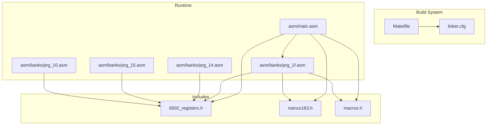
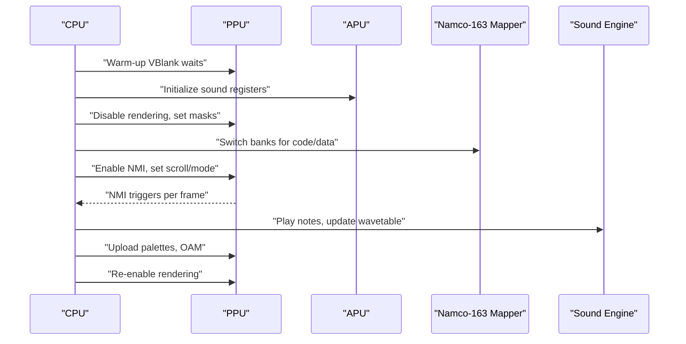
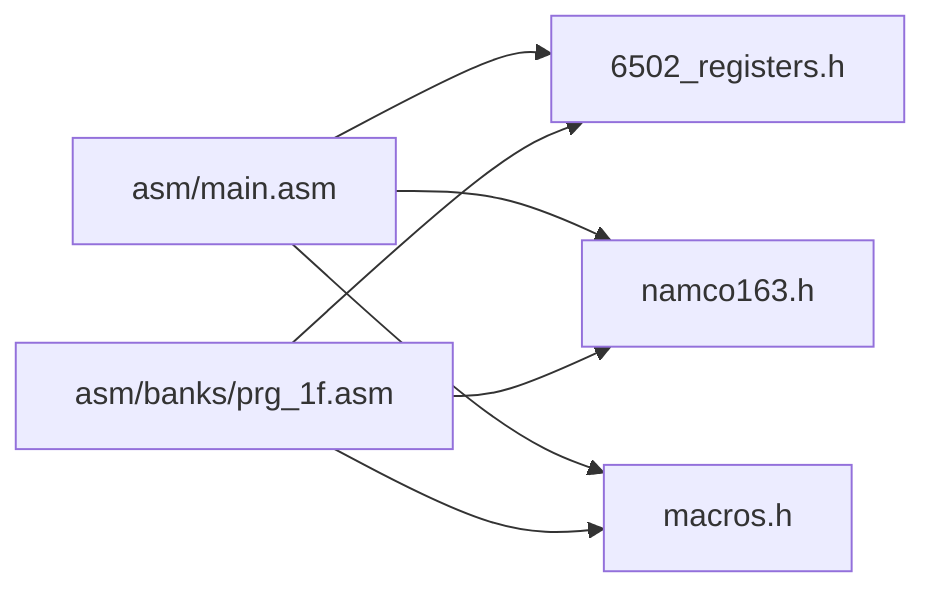

# Performance Optimization Techniques

<cite>
**Referenced Files in This Document**
- [PROJECT.md](file://PROJECT.md)
- [Makefile](file://Makefile)
- [linker.cfg](file://linker.cfg)
- [include/6502_registers.h](file://include/6502_registers.h)
- [include/namco163.h](file://include/namco163.h)
- [include/macros.h](file://include/macros.h)
- [asm/main.asm](file://asm/main.asm)
- [asm/banks/prg_1f.asm](file://asm/banks/prg_1f.asm)
- [asm/banks/prg_14.asm](file://asm/banks/prg_14.asm)
- [asm/banks/prg_15.asm](file://asm/banks/prg_15.asm)
- [asm/banks/prg_10.asm](file://asm/banks/prg_10.asm)
</cite>

## Table of Contents
1. [Introduction](#introduction)
2. [Project Structure](#project-structure)
3. [Core Components](#core-components)
4. [Architecture Overview](#architecture-overview)
5. [Detailed Component Analysis](#detailed-component-analysis)
6. [Dependency Analysis](#dependency-analysis)
7. [Performance Considerations](#performance-considerations)
8. [Troubleshooting Guide](#troubleshooting-guide)
9. [Conclusion](#conclusion)

## Introduction
This document presents performance optimization techniques observed in the disassembly project for Sangokushi 2 - Haou no Tairiku (J) on the NES using the Namco-163 mapper. It focuses on memory access patterns, interrupt handling efficiency, graphics rendering optimizations, memory management strategies, and practical examples of loop unrolling, lookup table usage, and branch prediction optimization. The goal is to translate low-level assembly practices into accessible guidance for optimizing 6502-based applications.

## Project Structure
The project is organized around:
- A central linker configuration defining 4 PRG slots and memory regions
- An include set of register and macro definitions for PPU/APU/Namco-163
- A main entry point with reset/NMI/IRQ stubs
- Banked code segments for performance-critical routines

**Diagram sources**
- [Makefile:1-102](file://Makefile#L1-L102)
- [linker.cfg:1-55](file://linker.cfg#L1-L55)
- [include/6502_registers.h:1-88](file://include/6502_registers.h#L1-L88)
- [include/namco163.h:1-87](file://include/namco163.h#L1-L87)
- [include/macros.h:1-72](file://include/macros.h#L1-L72)
- [asm/main.asm:1-141](file://asm/main.asm#L1-L141)
- [asm/banks/prg_1f.asm:1-2870](file://asm/banks/prg_1f.asm#L1-L2870)
- [asm/banks/prg_14.asm:1-13](file://asm/banks/prg_14.asm#L1-L13)
- [asm/banks/prg_15.asm:1-13](file://asm/banks/prg_15.asm#L1-L13)
- [asm/banks/prg_10.asm:1-13](file://asm/banks/prg_10.asm#L1-L13)

**Section sources**
- [PROJECT.md:14-47](file://PROJECT.md#L14-L47)
- [Makefile:1-102](file://Makefile#L1-L102)
- [linker.cfg:18-55](file://linker.cfg#L18-L55)

## Core Components
- Reset handler and warm-up sequences to stabilize PPU/APU before enabling rendering
- Interrupt vectors for NMI and IRQ with placeholders for per-frame and audio tasks
- PPU initialization helpers and scroll/mask control routines
- Bank switching macros and runtime bank switching routines for Namco-163
- Sound subsystem initialization and wavetable upload routines
- Controller polling with edge detection for responsive input handling
- Palette upload routine for efficient color palette transfer
- RNG using lookup tables for fast random byte generation

These components collectively demonstrate:
- Efficient PPU register access patterns
- Optimized sprite-related buffers and initialization
- Effective bank switching timing around VBlank
- Interrupt handling efficiency with minimal overhead
- Graphics rendering helpers for scrolling and attribute updates
- Memory management strategies for game state and working RAM

**Section sources**
- [asm/main.asm:30-121](file://asm/main.asm#L30-L121)
- [asm/banks/prg_1f.asm:74-148](file://asm/banks/prg_1f.asm#L74-L148)
- [asm/banks/prg_1f.asm:832-840](file://asm/banks/prg_1f.asm#L832-L840)
- [asm/banks/prg_1f.asm:1071-1085](file://asm/banks/prg_1f.asm#L1071-L1085)
- [asm/banks/prg_1f.asm:1118-1131](file://asm/banks/prg_1f.asm#L1118-L1131)
- [asm/banks/prg_1f.asm:1137-1159](file://asm/banks/prg_1f.asm#L1137-L1159)
- [asm/banks/prg_1f.asm:1164-1169](file://asm/banks/prg_1f.asm#L1164-L1169)
- [asm/banks/prg_1f.asm:1175-1183](file://asm/banks/prg_1f.asm#L1175-L1183)
- [asm/banks/prg_1f.asm:1250-1260](file://asm/banks/prg_1f.asm#L1250-L1260)
- [include/namco163.h:68-87](file://include/namco163.h#L68-L87)
- [include/macros.h:8-12](file://include/macros.h#L8-L12)
- [include/macros.h:17-30](file://include/macros.h#L17-L30)
- [include/macros.h:37-47](file://include/macros.h#L37-L47)
- [include/macros.h:52-55](file://include/macros.h#L52-L55)

## Architecture Overview
The runtime architecture centers on:
- Reset warm-up and initialization of PPU/APU
- NMI-driven per-frame tasks and IRQ handling for audio
- Bank switching to access graphics and sound data
- PPU control helpers for enabling NMI and setting scroll/mode
- Palette and OAM updates coordinated with VBlank

**Diagram sources**
- [asm/main.asm:30-60](file://asm/main.asm#L30-L60)
- [asm/banks/prg_1f.asm:846-907](file://asm/banks/prg_1f.asm#L846-L907)
- [asm/banks/prg_1f.asm:1090-1113](file://asm/banks/prg_1f.asm#L1090-L1113)
- [asm/banks/prg_1f.asm:1118-1131](file://asm/banks/prg_1f.asm#L1118-L1131)
- [include/namco163.h:68-87](file://include/namco163.h#L68-L87)

## Detailed Component Analysis

### Efficient PPU Register Access Patterns
- Warm-up and disable-rendering sequences before RAM clearing and initialization
- Use of macros to set PPU address and write single bytes efficiently
- Dedicated helpers to upload palettes and manage scroll registers
- Control register updates synchronized with NMI enablement

Practical examples:
- PPU warm-up and clear loops: [asm/main.asm:36-57](file://asm/main.asm#L36-L57)
- PPU address and data write macros: [include/macros.h:17-30](file://include/macros.h#L17-L30)
- Palette upload routine: [asm/banks/prg_1f.asm:1071-1085](file://asm/banks/prg_1f.asm#L1071-L1085)
- Scroll set helper: [asm/banks/prg_1f.asm:1565-1571](file://asm/banks/prg_1f.asm#L1565-L1571)
- PPU control/NMI helpers: [asm/banks/prg_1f.asm:1100-1113](file://asm/banks/prg_1f.asm#L1100-L1113)

Optimization notes:
- Minimize PPU register transactions by grouping writes and using helper routines
- Reset latch state before PPU address writes to avoid sticky behavior
- Coalesce palette writes to reduce instruction count per frame

**Section sources**
- [asm/main.asm:36-60](file://asm/main.asm#L36-L60)
- [include/macros.h:17-30](file://include/macros.h#L17-L30)
- [asm/banks/prg_1f.asm:1071-1085](file://asm/banks/prg_1f.asm#L1071-L1085)
- [asm/banks/prg_1f.asm:1565-1571](file://asm/banks/prg_1f.asm#L1565-L1571)
- [asm/banks/prg_1f.asm:1100-1113](file://asm/banks/prg_1f.asm#L1100-L1113)

### Optimized Sprite Rendering Loops and Buffer Management
- Off-screen sprite sentinel values to avoid unnecessary OAM writes
- Pre-initialized sprite buffers to minimize per-frame work
- Palette upload helpers to quickly refresh color palettes

Practical examples:
- Sprite buffer initialization: [asm/banks/prg_1f.asm:1175-1183](file://asm/banks/prg_1f.asm#L1175-L1183)
- Palette upload routine: [asm/banks/prg_1f.asm:1071-1085](file://asm/banks/prg_1f.asm#L1071-L1085)

Optimization notes:
- Use constant-time initialization for sprite buffers to zero out unused entries
- Batch palette writes to PPU to reduce instruction overhead

**Section sources**
- [asm/banks/prg_1f.asm:1175-1183](file://asm/banks/prg_1f.asm#L1175-L1183)
- [asm/banks/prg_1f.asm:1071-1085](file://asm/banks/prg_1f.asm#L1071-L1085)

### Effective Bank Switching Timing
- Bank switching macros for each PRG slot
- Runtime bank switching routine that updates mapper registers and caches
- Bank switching coordinated with safe periods (e.g., after PPU warm-up)

Practical examples:
- Bank switching macros: [include/namco163.h:68-87](file://include/namco163.h#L68-L87)
- Bank switching routine: [asm/banks/prg_1f.asm:785-817](file://asm/banks/prg_1f.asm#L785-L817)
- Mapper initialization: [asm/main.asm:115-121](file://asm/main.asm#L115-L121)

Optimization notes:
- Group bank updates to minimize repeated register writes
- Use cached bank register copies to avoid redundant loads
- Switch banks during VBlank-safe sections to prevent glitches

**Section sources**
- [include/namco163.h:68-87](file://include/namco163.h#L68-L87)
- [asm/banks/prg_1f.asm:785-817](file://asm/banks/prg_1f.asm#L785-L817)
- [asm/main.asm:115-121](file://asm/main.asm#L115-L121)

### Interrupt Handling Efficiency (NMI/IRQ)
- Minimal overhead push/pop/save/restore in interrupt stubs
- NMI placeholder for per-frame tasks; IRQ placeholder for audio
- PPU status read and NMI enablement helpers

Practical examples:
- NMI/IRQ stubs: [asm/main.asm:65-99](file://asm/main.asm#L65-L99)
- PPU status read and VBlank wait: [asm/banks/prg_1f.asm:1118-1131](file://asm/banks/prg_1f.asm#L1118-L1131)
- PPU control/NMI helpers: [asm/banks/prg_1f.asm:1100-1113](file://asm/banks/prg_1f.asm#L1100-L1113)

Optimization notes:
- Keep interrupt handlers short and deterministic
- Use PPU status checks to gate expensive operations
- Enable NMI only when rendering is active to reduce overhead

**Section sources**
- [asm/main.asm:65-99](file://asm/main.asm#L65-L99)
- [asm/banks/prg_1f.asm:1118-1131](file://asm/banks/prg_1f.asm#L1118-L1131)
- [asm/banks/prg_1f.asm:1100-1113](file://asm/banks/prg_1f.asm#L1100-L1113)

### Graphics Rendering Optimizations
- Background scrolling helpers and control register updates
- Nametable fill routines for quick background setup
- Attribute table manipulation via control register updates

Practical examples:
- Scroll set helper: [asm/banks/prg_1f.asm:1565-1571](file://asm/banks/prg_1f.asm#L1565-L1571)
- PPU control/Nametable update: [asm/banks/prg_1f.asm:1576-1583](file://asm/banks/prg_1f.asm#L1576-L1583)
- Nametable fill modes: [asm/banks/prg_1f.asm:1137-1159](file://asm/banks/prg_1f.asm#L1137-L1159), [asm/banks/prg_1f.asm:1164-1169](file://asm/banks/prg_1f.asm#L1164-L1169)

Optimization notes:
- Use control register updates to change nametable selections atomically
- Precompute scroll values and write in pairs to avoid flicker
- Minimize attribute table writes by caching control register state

**Section sources**
- [asm/banks/prg_1f.asm:1565-1571](file://asm/banks/prg_1f.asm#L1565-L1571)
- [asm/banks/prg_1f.asm:1576-1583](file://asm/banks/prg_1f.asm#L1576-L1583)
- [asm/banks/prg_1f.asm:1137-1159](file://asm/banks/prg_1f.asm#L1137-L1159)
- [asm/banks/prg_1f.asm:1164-1169](file://asm/banks/prg_1f.asm#L1164-L1169)

### Memory Management Strategies
- Zero page usage for temporary variables and pointers
- BSS segment for uninitialized RAM
- Banked code segments to maximize usable address space
- RAM layout for game state, controller inputs, and working buffers

Practical examples:
- Zero page and BSS segments: [asm/main.asm:13-20](file://asm/main.asm#L13-L20)
- Linker segments for banked code: [linker.cfg:32-54](file://linker.cfg#L32-L54)
- RAM addresses for game state and PPU copies: [asm/banks/prg_1f.asm:21-70](file://asm/banks/prg_1f.asm#L21-L70)

Optimization notes:
- Favor zero page for hot-loop counters and small temporaries
- Use BSS for large working buffers to avoid costly initialization
- Keep frequently accessed data close to zero page to reduce addressing overhead

**Section sources**
- [asm/main.asm:13-20](file://asm/main.asm#L13-L20)
- [linker.cfg:32-54](file://linker.cfg#L32-L54)
- [asm/banks/prg_1f.asm:21-70](file://asm/banks/prg_1f.asm#L21-L70)

### Practical Examples: Loop Unrolling, Lookup Tables, Branch Prediction
- Loop unrolling in PPU copy macro to reduce loop overhead
- Lookup table for random byte generation to replace slow arithmetic
- Branchless or branch-predictable patterns in controller edge detection

Practical examples:
- PPU copy macro with unrolled loop: [include/macros.h:37-47](file://include/macros.h#L37-L47)
- Random byte via lookup table: [asm/banks/prg_1f.asm:1250-1260](file://asm/banks/prg_1f.asm#L1250-L1260)
- Controller edge detection using XOR/AND: [asm/banks/prg_1f.asm:1058-1063](file://asm/banks/prg_1f.asm#L1058-L1063)

Optimization notes:
- Unroll tight loops that write to PPU or OAM to reduce branch overhead
- Use lookup tables for expensive operations like randomization
- Favor predictable branches and simple conditionals to improve CPU pipeline behavior

**Section sources**
- [include/macros.h:37-47](file://include/macros.h#L37-L47)
- [asm/banks/prg_1f.asm:1250-1260](file://asm/banks/prg_1f.asm#L1250-L1260)
- [asm/banks/prg_1f.asm:1058-1063](file://asm/banks/prg_1f.asm#L1058-L1063)

### Performance Measurement Techniques and Common Bottlenecks
- Measure frame time by counting VBlank occurrences and timing critical sections
- Profile PPU write bandwidth by monitoring total bytes written per frame
- Track bank switching overhead by isolating mapper register writes
- Identify bottlenecks by instrumenting NMI/IRQ handlers and sound routines

Common bottlenecks:
- Excessive PPU writes outside VBlank
- Frequent bank switches mid-frame
- Unoptimized random number generation
- Overly complex interrupt handlers

Measurement tips:
- Use VBlank wait helpers to bracket frame work
- Count instructions in hot loops to estimate CPU cycles
- Profile sound engine updates to ensure they fit within audio budget

**Section sources**
- [include/macros.h:8-12](file://include/macros.h#L8-L12)
- [asm/banks/prg_1f.asm:1118-1131](file://asm/banks/prg_1f.asm#L1118-L1131)
- [asm/banks/prg_1f.asm:846-907](file://asm/banks/prg_1f.asm#L846-L907)

## Dependency Analysis
The runtime depends on:
- Register definitions for PPU/APU/Namco-163
- Macros for common operations (VBlank wait, PPU address/data write, DMA)
- Bank switching macros and runtime routines
- Banked code segments for graphics, sound, and gameplay logic

**Diagram sources**
- [include/6502_registers.h:1-88](file://include/6502_registers.h#L1-L88)
- [include/namco163.h:1-87](file://include/namco163.h#L1-L87)
- [include/macros.h:1-72](file://include/macros.h#L1-L72)
- [asm/main.asm:6-8](file://asm/main.asm#L6-L8)
- [asm/banks/prg_1f.asm:10-11](file://asm/banks/prg_1f.asm#L10-L11)

**Section sources**
- [include/6502_registers.h:1-88](file://include/6502_registers.h#L1-L88)
- [include/namco163.h:1-87](file://include/namco163.h#L1-L87)
- [include/macros.h:1-72](file://include/macros.h#L1-L72)
- [asm/main.asm:6-8](file://asm/main.asm#L6-L8)
- [asm/banks/prg_1f.asm:10-11](file://asm/banks/prg_1f.asm#L10-L11)

## Performance Considerations
- Prefer zero page and small immediate addressing modes to reduce instruction size and cycles
- Coalesce PPU writes and minimize register transitions
- Use lookup tables for randomization and math-heavy operations
- Keep interrupt handlers minimal and deterministic
- Schedule bank switches during VBlank-safe windows
- Optimize sprite buffer initialization and palette uploads to reduce per-frame work

[No sources needed since this section provides general guidance]

## Troubleshooting Guide
- If PPU glitches occur after bank switching, verify mapper register writes and control register updates
- If audio stutters, profile sound engine updates and ensure they complete before next frame
- If input feels sluggish, confirm controller strobe and read sequences are not blocked by long routines
- If frame timing varies, measure VBlank duration and adjust rendering workload accordingly

**Section sources**
- [asm/banks/prg_1f.asm:785-817](file://asm/banks/prg_1f.asm#L785-L817)
- [asm/banks/prg_1f.asm:1090-1113](file://asm/banks/prg_1f.asm#L1090-L1113)
- [asm/banks/prg_1f.asm:1040-1065](file://asm/banks/prg_1f.asm#L1040-L1065)

## Conclusion
The disassembly demonstrates several performance-critical patterns that are essential for NES development:
- Efficient PPU register access and batching
- Minimal interrupt overhead with NMI/IRQ stubs
- Strategic bank switching timing and caching
- Graphics helpers for scrolling and attribute updates
- Memory management using zero page and BSS
- Practical techniques like loop unrolling, lookup tables, and branch-friendly logic

Adopting these patterns yields predictable frame timing, reduced CPU usage, and smoother audio/video output on the NES platform.