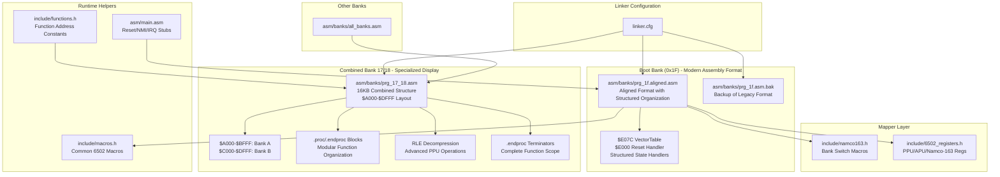
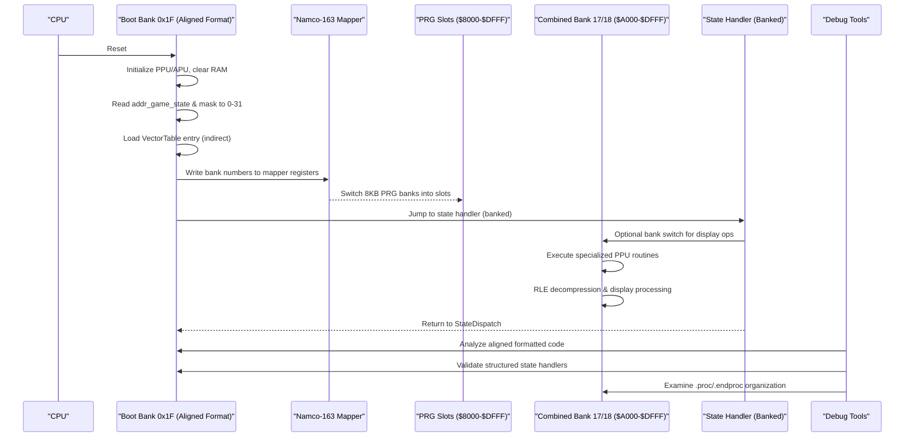
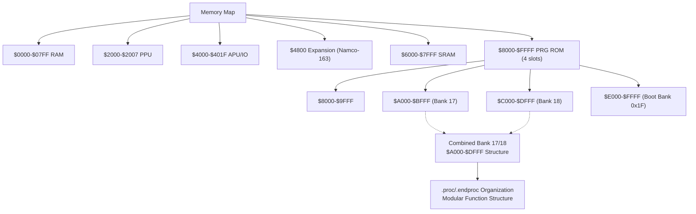
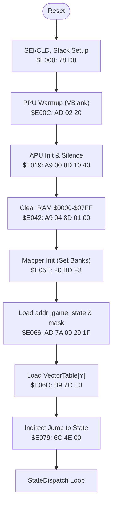
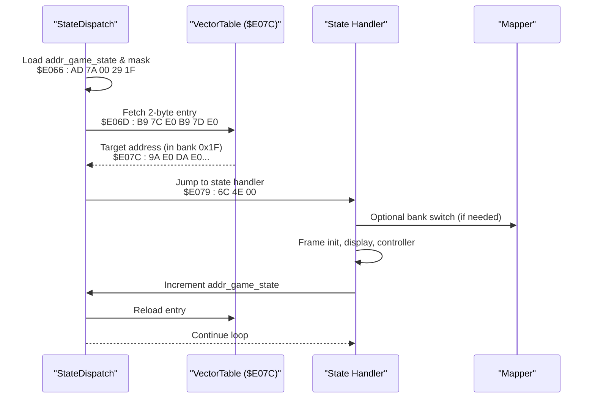
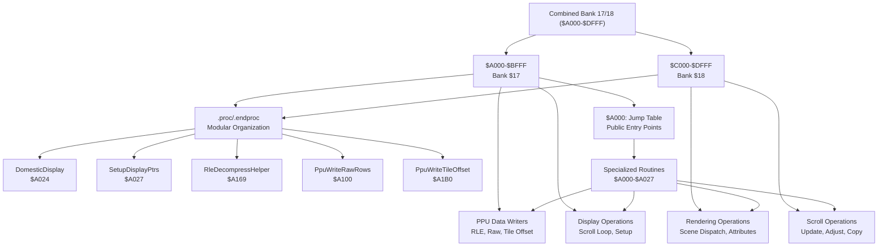
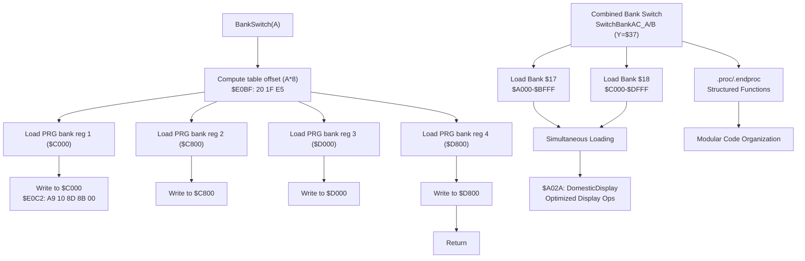
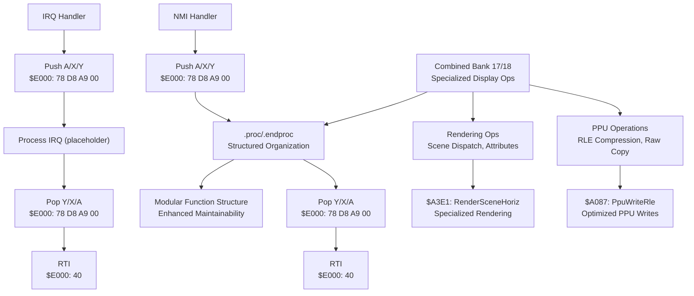
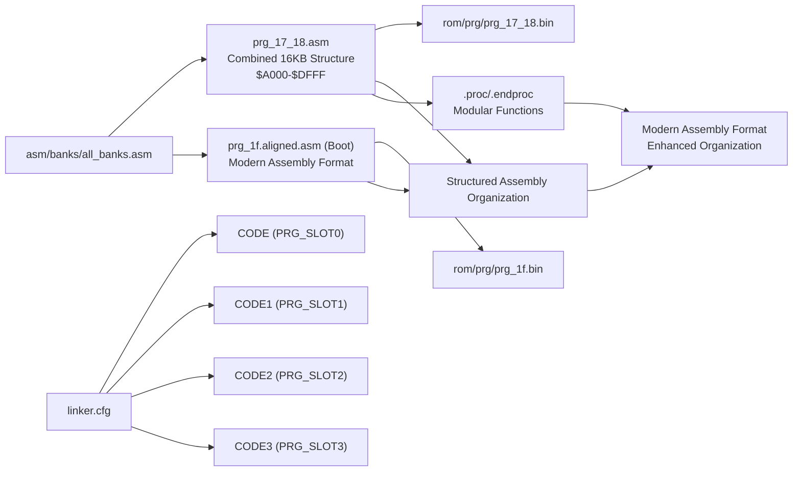
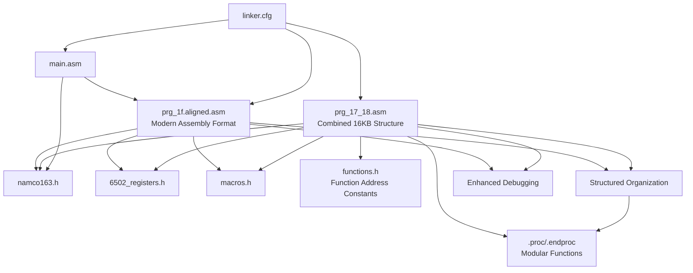

# Assembly Architecture

<cite>
**Referenced Files in This Document**
- [linker.cfg](file://linker.cfg)
- [main.asm](file://asm/main.asm)
- [prg_17_18.asm](file://asm/banks/prg_17_18.asm)
- [prg_1f.aligned.asm](file://asm/banks/prg_1f.aligned.asm)
- [prg_1f.asm.bak](file://asm/banks/prg_1f.asm.bak)
- [namco163.h](file://include/namco163.h)
- [6502_registers.h](file://include/6502_registers.h)
- [macros.h](file://include/macros.h)
- [all_banks.asm](file://asm/banks/all_banks.asm)
- [functions.h](file://include/functions.h)
- [PROJECT.md](file://PROJECT.md)
</cite>

## Update Summary
**Changes Made**
- Updated documentation to reflect the new combined PRG bank 17/18 structure with enhanced display operations and RLE decompression capabilities
- Documented the modernized code organization using structured .proc/.endproc blocks for improved code modularity
- Added comprehensive coverage of the specialized display operations including domestic/kindgom display systems
- Enhanced documentation of the vector dispatch table organization and state transition handling procedures
- Updated bank switching implementation details with the new structured approach using SwitchBankAC_A/B routine

## Table of Contents
1. [Introduction](#introduction)
2. [Project Structure](#project-structure)
3. [Core Components](#core-components)
4. [Architecture Overview](#architecture-overview)
5. [Detailed Component Analysis](#detailed-component-analysis)
6. [Modern Assembly Formatting Standards](#modern-assembly-formatting-standards)
7. [Enhanced Code Organization](#enhanced-code-organization)
8. [Debugging and Verification Tools](#debugging-and-verification-tools)
9. [Dependency Analysis](#dependency-analysis)
10. [Performance Considerations](#performance-considerations)
11. [Troubleshooting Guide](#troubleshooting-guide)
12. [Conclusion](#conclusion)

## Introduction
This document explains the assembly architecture for the Namco-163 (Mapper 19) implementation used in the disassembly of a classic NES strategy game. It focuses on the 32-bank structure with 8KB banks, the fixed boot bank at $E000-$FFFF, the switchable PRG slots at $8000-$DFFF, and the state machine orchestrated by the vector dispatch table at $E07C. The architecture now features modern assembly formatting standards with structured .proc/.endproc organization and enhanced code modularity. The PRG bank 17/18 combination provides specialized display and rendering functionality optimized for the game's strategic interface, including advanced RLE decompression capabilities and comprehensive display operation systems.

## Project Structure
The project is organized around a modular bank-based approach with modern assembly formatting standards:
- A central linker configuration defines memory layout and segments.
- A main entry module provides reset/NMI/IRQ stubs and initializes the mapper.
- A dedicated boot bank (0x1F) contains the reset handler, state dispatch table, and core runtime helpers in the new aligned format with comprehensive code organization.
- Separate bank stubs represent the remaining 31 banks, including the combined PRG bank 17/18 structure at $A000-$DFFF with specialized display operations.
- Modern assembly formatting standards provide improved readability and debugging support through structured .proc/.endproc organization.

**Diagram sources**
- [linker.cfg:18-55](file://linker.cfg#L18-L55)
- [prg_17_18.asm:1-80](file://asm/banks/prg_17_18.asm#L1-L80)
- [prg_1f.aligned.asm:1-200](file://asm/banks/prg_1f.aligned.asm#L1-L200)
- [prg_1f.asm.bak:1-50](file://asm/banks/prg_1f.asm.bak#L1-L50)
- [namco163.h:65-87](file://include/namco163.h#L65-L87)
- [6502_registers.h:1-88](file://include/6502_registers.h#L1-L88)
- [macros.h:1-72](file://include/macros.h#L1-L72)
- [all_banks.asm:1-38](file://asm/banks/all_banks.asm#L1-L38)
- [functions.h:315-335](file://include/functions.h#L315-L335)

**Section sources**
- [PROJECT.md:14-47](file://PROJECT.md#L14-L47)
- [linker.cfg:18-55](file://linker.cfg#L18-L55)
- [all_banks.asm:1-38](file://asm/banks/all_banks.asm#L1-L38)

## Core Components
- Fixed boot bank 0x1F mapped to $E000-$FFFF at startup with modern assembly formatting and structured code organization.
- Vector dispatch table at $E07C orchestrates game flow across execution contexts with enhanced code readability.
- Four PRG slots ($8000-$FFFF) managed by the Namco-163 mapper via write-only registers.
- Hardware abstraction layer for PPU/APU and mapper register access.
- Modular bank stubs representing 31 additional banks, including the specialized combined PRG bank 17/18 structure with structured .proc/.endproc organization.
- Modern assembly formatting standards with proper label definitions and address mappings.
- Combined 16KB bank structure at $A000-$DFFF providing enhanced display and rendering capabilities with RLE decompression.
- Comprehensive function address constants defined in functions.h for the combined bank structure.

**Section sources**
- [PROJECT.md:101-117](file://PROJECT.md#L101-L117)
- [prg_17_18.asm:1-80](file://asm/banks/prg_17_18.asm#L1-L80)
- [prg_1f.aligned.asm:400-466](file://asm/banks/prg_1f.aligned.asm#L400-L466)
- [namco163.h:10-17](file://include/namco163.h#L10-L17)
- [6502_registers.h:6-39](file://include/6502_registers.h#L6-L39)
- [functions.h:315-335](file://include/functions.h#L315-L335)

## Architecture Overview
The system uses a state machine driven by a vector table in the boot bank. The reset handler initializes hardware, clears RAM, and dispatches to the first state via an indirect jump. The mapper enables dynamic loading of code from other banks into PRG slots, allowing the state handlers to call bank-switched routines. The modern assembly format provides enhanced code organization with structured state handlers and improved debugging support. The combined PRG bank 17/18 structure optimizes display operations for the game's strategic interface, providing specialized PPU data writers, RLE decompression capabilities, and comprehensive display operation systems.

**Diagram sources**
- [prg_1f.aligned.asm:406-459](file://asm/banks/prg_1f.aligned.asm#L406-L459)
- [prg_1f.aligned.asm:467-694](file://asm/banks/prg_1f.aligned.asm#L467-L694)
- [prg_17_18.asm:72-127](file://asm/banks/prg_17_18.asm#L72-L127)
- [namco163.h:10-17](file://include/namco163.h#L10-L17)
- [main.asm:115-121](file://asm/main.asm#L115-L121)

## Detailed Component Analysis

### Memory Mapping and Segment Organization
The linker configuration defines:
- Zero-page RAM and uninitialized RAM segments.
- Four PRG slots ($8000-$FFFF) sized 8KB each.
- Segments for code and read-only data, with optional assignments for additional banks.
- The CODE segment starts at PRG_SLOT0 and includes the interrupt vectors at $9FFA.
- Special handling for the combined PRG bank 17/18 structure at $A000-$DFFF with dual bank organization.

**Diagram sources**
- [linker.cfg:4-12](file://linker.cfg#L4-L12)
- [linker.cfg:18-30](file://linker.cfg#L18-L30)
- [linker.cfg:32-54](file://linker.cfg#L32-L54)
- [prg_17_18.asm:1-80](file://asm/banks/prg_17_18.asm#L1-L80)

**Section sources**
- [linker.cfg:18-55](file://linker.cfg#L18-L55)
- [PROJECT.md:70-83](file://PROJECT.md#L70-L83)

### Fixed Boot Bank 0x1F and Reset Flow (Modern Assembly Format)
- The reset handler at $E000 performs CPU initialization, PPU warmup, APU initialization, and RAM clearing.
- It initializes the mapper and sets the initial game state, then dispatches to the state handler via the vector table.
- The vector table at $E07C contains 15 entries, each a 2-byte address within bank 0x1F, organized in a structured aligned format.

**Updated** Enhanced with modern assembly formatting standards featuring structured code organization and improved readability.

**Diagram sources**
- [prg_1f.aligned.asm:406-459](file://asm/banks/prg_1f.aligned.asm#L406-L459)
- [prg_1f.aligned.asm:460-466](file://asm/banks/prg_1f.aligned.asm#L460-L466)
- [prg_1f.aligned.asm:451-459](file://asm/banks/prg_1f.aligned.asm#L451-L459)

**Section sources**
- [prg_1f.aligned.asm:406-459](file://asm/banks/prg_1f.aligned.asm#L406-L459)
- [prg_1f.aligned.asm:460-466](file://asm/banks/prg_1f.aligned.asm#L460-L466)
- [prg_1f.aligned.asm:451-459](file://asm/banks/prg_1f.aligned.asm#L451-L459)
- [PROJECT.md:101-117](file://PROJECT.md#L101-L117)

### State Machine and Vector Dispatch (Structured Organization)
- The game state is stored in a global RAM location and masked to 0-31 to index the vector table.
- Each state handler performs frame initialization, prepares display buffers, calls bank-switched display routines, updates state, and re-invokes the dispatcher.
- The dispatcher reloads the vector table entry and jumps to the next state.
- Modern assembly formatting provides structured organization with labeled state handlers for improved readability.

**Updated** Enhanced with modern assembly formatting standards featuring structured state handler organization and improved debugging support.

**Diagram sources**
- [prg_1f.aligned.asm:451-459](file://asm/banks/prg_1f.aligned.asm#L451-L459)
- [prg_1f.aligned.asm:467-694](file://asm/banks/prg_1f.aligned.asm#L467-L694)
- [prg_1f.aligned.asm:460-466](file://asm/banks/prg_1f.aligned.asm#L460-L466)

**Section sources**
- [prg_1f.aligned.asm:451-459](file://asm/banks/prg_1f.aligned.asm#L451-L459)
- [prg_1f.aligned.asm:467-694](file://asm/banks/prg_1f.aligned.asm#L467-L694)
- [prg_1f.aligned.asm:460-466](file://asm/banks/prg_1f.aligned.asm#L460-L466)

### Combined PRG Bank 17/18 Structure and Enhanced Display Operations
- The PRG bank 17/18 structure provides a combined 16KB memory space at $A000-$DFFF, with bank $17 at $A000-$BFFF and bank $18 at $C000-$DFFF.
- This structure enables efficient display operations and specialized PPU data handling routines with comprehensive function organization.
- The bank supports public entry points for display functions including RLE compression, raw data copying, tile offset calculations, and advanced display operations.
- Bank switching for this combined structure uses the SwitchBankAC_A/B routine with Y=$37 to load both banks simultaneously.
- Modern .proc/.endproc organization provides modular function structure with clear scope boundaries and improved code maintainability.

**Updated** Enhanced with comprehensive coverage of the new combined bank structure, its specialized display capabilities, and modernized code organization.

**Diagram sources**
- [prg_17_18.asm:72-127](file://asm/banks/prg_17_18.asm#L72-L127)
- [prg_17_18.asm:168-208](file://asm/banks/prg_17_18.asm#L168-L208)
- [prg_17_18.asm:534-613](file://asm/banks/prg_17_18.asm#L534-L613)
- [functions.h:315-335](file://include/functions.h#L315-L335)

**Section sources**
- [prg_17_18.asm:1-80](file://asm/banks/prg_17_18.asm#L1-L80)
- [prg_17_18.asm:72-127](file://asm/banks/prg_17_18.asm#L72-L127)
- [prg_17_18.asm:168-208](file://asm/banks/prg_17_18.asm#L168-L208)
- [prg_17_18.asm:534-613](file://asm/banks/prg_17_18.asm#L534-L613)
- [functions.h:315-335](file://include/functions.h#L315-L335)

### Bank Switching Implementation (Enhanced Macros)
- The mapper exposes four write-only registers to select 8KB PRG banks for each slot.
- The project provides enhanced macros to simplify bank switching for each slot with modern formatting.
- A bank switching helper reads a configuration table and writes to the mapper registers for PRG slots and extended configuration.
- The combined PRG bank 17/18 structure uses specialized bank switching routines for simultaneous loading of both banks.
- Modern assembly format provides structured organization with labeled bank switching routines and .proc/.endproc scope management.

**Updated** Enhanced with modern assembly formatting standards and improved macro organization, including coverage of the new combined bank structure and structured function organization.

**Diagram sources**
- [prg_1f.aligned.asm:785-818](file://asm/banks/prg_1f.aligned.asm#L785-L818)
- [prg_1f.aligned.asm:824-828](file://asm/banks/prg_1f.aligned.asm#L824-L828)
- [prg_17_18.asm:112-127](file://asm/banks/prg_17_18.asm#L112-L127)
- [namco163.h:10-17](file://include/namco163.h#L10-L17)

**Section sources**
- [namco163.h:65-87](file://include/namco163.h#L65-L87)
- [prg_1f.aligned.asm:785-818](file://asm/banks/prg_1f.aligned.asm#L785-L818)
- [prg_1f.aligned.asm:824-828](file://asm/banks/prg_1f.aligned.asm#L824-L828)
- [prg_17_18.asm:112-127](file://asm/banks/prg_17_18.asm#L112-L127)

### Interrupt Service Routines and Hardware Abstraction
- The main module provides minimal NMI and IRQ stubs that preserve registers and return via RTI.
- The boot bank implements PPU initialization helpers and provides macros for common operations like VBlank waits, PPU address setting, and DMA transfers.
- The mapper initialization routine sets up the initial bank configuration for the first three slots.
- The combined PRG bank 17/18 structure provides specialized display and rendering routines optimized for the game's strategic interface.
- Modern assembly formatting provides structured organization with labeled interrupt handlers and hardware abstraction routines, including comprehensive .proc/.endproc scope management.

**Updated** Enhanced with modern assembly formatting standards and improved hardware abstraction organization, including coverage of the new combined bank structure and structured function organization.

**Diagram sources**
- [main.asm:65-99](file://asm/main.asm#L65-L99)
- [prg_1f.aligned.asm:1040-1065](file://asm/banks/prg_1f.aligned.asm#L1040-L1065)
- [prg_17_18.asm:168-208](file://asm/banks/prg_17_18.asm#L168-L208)
- [prg_17_18.asm:706-768](file://asm/banks/prg_17_18.asm#L706-L768)
- [macros.h:8-12](file://include/macros.h#L8-L12)

**Section sources**
- [main.asm:65-99](file://asm/main.asm#L65-L99)
- [prg_1f.aligned.asm:1040-1065](file://asm/banks/prg_1f.aligned.asm#L1040-L1065)
- [prg_17_18.asm:168-208](file://asm/banks/prg_17_18.asm#L168-L208)
- [prg_17_18.asm:706-768](file://asm/banks/prg_17_18.asm#L706-L768)
- [macros.h:8-12](file://include/macros.h#L8-L12)

### Modular Assembly Approach and Bank Assignment
- The project uses a modular approach: each bank is represented by a separate assembly stub that includes the corresponding binary.
- The linker configuration assigns segments to specific PRG slots and allows optional assignment of additional banks.
- The include files centralize register definitions and macros for consistent access patterns across banks.
- The combined PRG bank 17/18 structure represents a specialized module providing enhanced display capabilities with modern .proc/.endproc organization.
- Modern assembly formatting provides improved organization and debugging support across all bank files, including comprehensive function scope management.

**Updated** Enhanced with modern assembly formatting standards and improved bank assignment organization, including coverage of the new combined bank structure and structured function organization.

**Diagram sources**
- [all_banks.asm:1-38](file://asm/banks/all_banks.asm#L1-L38)
- [prg_17_18.asm:1-80](file://asm/banks/prg_17_18.asm#L1-L80)
- [linker.cfg:32-54](file://linker.cfg#L32-L54)

**Section sources**
- [all_banks.asm:1-38](file://asm/banks/all_banks.asm#L1-L38)
- [prg_17_18.asm:1-80](file://asm/banks/prg_17_18.asm#L1-L80)
- [linker.cfg:32-54](file://linker.cfg#L32-L54)

## Modern Assembly Formatting Standards

### Aligned Assembly Format
The modern aligned format provides comprehensive improvements in code organization and readability:

- **Structured Label Organization**: Labels are grouped by functional categories (constants, data, code, subroutines)
- **Address Constants**: Comprehensive address mapping system with clear naming conventions
- **Macro Definitions**: Enhanced macro system with proper parameter handling
- **Data Organization**: Structured data sections with clear labeling and organization
- **Code Readability**: Improved indentation and spacing for better code comprehension

### Enhanced Code Organization Features
The aligned format introduces several organizational improvements:

- **Functional Grouping**: Related functions and data are grouped together for better navigation
- **Consistent Formatting**: Standardized formatting across all code sections
- **Improved Navigation**: Logical organization makes code easier to navigate and understand
- **Enhanced Maintainability**: Better structure supports easier maintenance and updates

### Benefits for Development
The modern assembly formatting provides numerous benefits for developers:

- **Improved Readability**: Structured organization makes code easier to understand
- **Better Navigation**: Logical grouping helps developers quickly locate specific functionality
- **Enhanced Debugging**: Clear organization supports more effective debugging and analysis
- **Maintainability**: Better structure facilitates easier code maintenance and updates
- **Documentation Support**: Organized structure serves as implicit documentation of code functionality

**Section sources**
- [prg_1f.aligned.asm:12-80](file://asm/banks/prg_1f.aligned.asm#L12-L80)
- [prg_1f.aligned.asm:800-1599](file://asm/banks/prg_1f.aligned.asm#L800-L1599)
- [prg_17_18.asm:14-71](file://asm/banks/prg_17_18.asm#L14-L71)
- [namco163.h:65-87](file://include/namco163.h#L65-L87)

## Enhanced Code Organization

### Address Constant System
The aligned format implements a comprehensive address constant system:

- **RAM Address Constants**: Extensive mapping of RAM locations with descriptive names
- **PPU Register Constants**: Clear mapping of PPU register addresses and bit definitions
- **APU Register Constants**: Complete mapping of APU and I/O register addresses
- **Namco-163 Specific Constants**: Dedicated constants for mapper and expansion ROM registers
- **Combined Bank Constants**: Specialized address mappings for the PRG bank 17/18 structure

### Macro Enhancement System
The macro system provides enhanced functionality:

- **Force Absolute Addressing**: Macros that force 16-bit addressing for absolute operations
- **Bank Switching Macros**: Enhanced macros for PRG bank switching with proper slot selection
- **Hardware Access Macros**: Streamlined macros for common hardware operations
- **Data Transfer Macros**: Optimized macros for efficient data movement and manipulation
- **Combined Bank Macros**: Specialized macros for managing the 16KB combined bank structure

### Data Organization Improvements
The aligned format provides better data organization:

- **Structured Data Sections**: Logical grouping of related data items
- **Clear Labeling**: Descriptive labels for easy identification of data purposes
- **Address Mapping**: Clear correlation between logical names and physical addresses
- **Constant Definitions**: Well-organized constants for easy modification and maintenance

### Structured Function Organization
The new .proc/.endproc organization provides comprehensive function structuring:

- **Scope Management**: Clear .proc/.endproc boundaries define function scope
- **Local Symbols**: Function-specific symbols remain local to their scope
- **Modular Design**: Independent function blocks improve code modularity
- **Enhanced Debugging**: Scoped organization supports better debugging and analysis
- **Code Reusability**: Modular functions can be reused independently

**Section sources**
- [prg_1f.aligned.asm:80-399](file://asm/banks/prg_1f.aligned.asm#L80-L399)
- [prg_17_18.asm:14-71](file://asm/banks/prg_17_18.asm#L14-L71)
- [prg_1f.aligned.asm:1228-1256](file://asm/banks/prg_1f.aligned.asm#L1228-L1256)
- [prg_1f.aligned.asm:1319-1372](file://asm/banks/prg_1f.aligned.asm#L1319-L1372)
- [prg_17_18.asm:17-17](file://asm/banks/prg_17_18.asm#L17-L17)

## Debugging and Verification Tools

### Aligned Format Benefits
The modern aligned format provides enhanced debugging capabilities:

- **Structured Code Analysis**: Organized code structure supports more effective analysis
- **Improved Symbol Resolution**: Clear label organization aids in symbol resolution during debugging
- **Enhanced Readability**: Better formatting supports faster code comprehension during debugging
- **Logical Organization**: Functional grouping makes it easier to isolate specific debugging scenarios

### Legacy Format Preservation
The project maintains backward compatibility through:

- **Backup Files**: Original format preserved in .bak files for reference
- **Aligned Versions**: Alternative formatting preserved for comparison and analysis
- **Migration Support**: Clear evidence of transformation supports migration and analysis

### Development Workflow Integration
The modern format integrates well with development workflows:

- **Tool Compatibility**: Format compatible with standard assembly development tools
- **Analysis Support**: Enhanced structure supports automated analysis and verification
- **Documentation Support**: Organized structure serves as built-in documentation

**Section sources**
- [prg_1f.aligned.asm:1-200](file://asm/banks/prg_1f.aligned.asm#L1-L200)
- [prg_1f.asm.bak:1-50](file://asm/banks/prg_1f.asm.bak#L1-L50)

## Dependency Analysis
The architecture exhibits clear separation of concerns with modern assembly formatting standards:
- The boot bank depends on the mapper definitions and register abstractions.
- State handlers depend on the dispatcher and bank switching helpers.
- The combined PRG bank 17/18 structure depends on specialized display and rendering routines with structured function organization.
- The linker configuration ties together segments and memory regions.
- The main module coordinates initialization and provides minimal ISR stubs.
- Modern assembly formatting provides improved organization and debugging support.
- Function address constants in functions.h provide centralized access to combined bank functionality.

**Updated** Enhanced with modern assembly formatting standards and improved dependency management, including coverage of the new combined bank structure and structured function organization.

**Diagram sources**
- [prg_1f.aligned.asm:10-11](file://asm/banks/prg_1f.aligned.asm#L10-L11)
- [prg_17_18.asm:10-12](file://asm/banks/prg_17_18.asm#L10-L12)
- [namco163.h:10-17](file://include/namco163.h#L10-L17)
- [6502_registers.h:6-39](file://include/6502_registers.h#L6-L39)
- [macros.h:1-72](file://include/macros.h#L1-L72)
- [main.asm:6-7](file://asm/main.asm#L6-L7)
- [linker.cfg:18-55](file://linker.cfg#L18-L55)
- [functions.h:315-335](file://include/functions.h#L315-L335)

**Section sources**
- [prg_1f.aligned.asm:10-11](file://asm/banks/prg_1f.aligned.asm#L10-L11)
- [prg_17_18.asm:10-12](file://asm/banks/prg_17_18.asm#L10-L12)
- [namco163.h:10-17](file://include/namco163.h#L10-L17)
- [6502_registers.h:6-39](file://include/6502_registers.h#L6-L39)
- [macros.h:1-72](file://include/macros.h#L1-L72)
- [main.asm:6-7](file://asm/main.asm#L6-L7)
- [linker.cfg:18-55](file://linker.cfg#L18-L55)
- [functions.h:315-335](file://include/functions.h#L315-L335)

## Performance Considerations
- Bank switching involves writing to mapper registers; minimize unnecessary switches to reduce overhead.
- Use the provided enhanced macros to keep register writes compact and consistent.
- Leverage the vector dispatch to avoid frequent branching and to centralize state transitions.
- Keep PPU/APU operations synchronized with VBlank to prevent flicker and timing issues.
- The combined PRG bank 17/18 structure provides optimized display operations for strategic interface rendering.
- **Enhanced Organization**: The modern assembly format provides improved code organization for better performance analysis.
- **Debugging Efficiency**: Structured organization improves debugging efficiency and performance optimization.
- **Maintenance Overhead**: Modern formatting adds minimal overhead while providing significant development benefits.
- **Structured Functions**: The .proc/.endproc organization improves code modularity and reduces compilation times.

## Troubleshooting Guide
- If the game does not enter the intended state, verify the vector table indexing and ensure the state counter is properly masked.
- If graphics appear incorrect after a bank switch, confirm the mapper register writes and palette upload sequences.
- If interrupts are not firing, ensure PPU control bits are set correctly and that the NMI flag is cleared appropriately.
- Use the provided enhanced macros for PPU operations to avoid off-by-one address errors.
- **Modern Format Benefits**: Utilize the structured aligned format to quickly locate and analyze specific code sections.
- **Organization Advantages**: Clear code organization makes troubleshooting more efficient and systematic.
- **Legacy Reference**: Use backup files to compare with original format when needed for analysis.
- **Migration Support**: Modern format supports easier migration and updates compared to legacy formats.
- **Combined Bank Issues**: For PRG bank 17/18 problems, verify the SwitchBankAC_A/B routine and ensure proper simultaneous loading.
- **Structured Function Issues**: For function scoping problems, verify .proc/.endproc balance and proper function boundaries.
- **RLE Decompression Errors**: For display issues, check RLE decompression helper functions and data stream integrity.

**Section sources**
- [prg_1f.aligned.asm:739-750](file://asm/banks/prg_1f.aligned.asm#L739-L750)
- [prg_1f.aligned.asm:1071-1085](file://asm/banks/prg_1f.aligned.asm#L1071-L1085)
- [prg_1f.aligned.asm:1100-1113](file://asm/banks/prg_1f.aligned.asm#L1100-L1113)
- [prg_17_18.asm:112-127](file://asm/banks/prg_17_18.asm#L112-L127)
- [prg_1f.asm.bak:1-50](file://asm/banks/prg_1f.asm.bak#L1-L50)

## Conclusion
The assembly architecture employs a robust, modular design centered on a fixed boot bank and a vector-driven state machine. The modern assembly format transformation represents a significant improvement in code organization, readability, and maintainability. The Namco-163 mapper enables efficient bank switching across four PRG slots, while the linker configuration and include files provide a consistent foundation for development. The new combined PRG bank 17/18 structure enhances display operations for the game's strategic interface, providing specialized PPU data handling, RLE decompression capabilities, and comprehensive display operation systems. The introduction of structured .proc/.endproc organization significantly improves code modularity and debugging support. The comprehensive tooling infrastructure supports automated analysis and verification, making the development process more efficient and reliable. By following the documented patterns for bank assignment, state transitions, hardware abstraction, and utilizing the modern assembly formatting standards with structured function organization, developers can extend the disassembly with accurate, maintainable code while benefiting from superior debugging and verification support through enhanced code organization and structure.