# Assembly Architecture

<cite>
**Referenced Files in This Document**
- [linker.cfg](file://linker.cfg)
- [main.asm](file://asm/main.asm)
- [prg_17_18.asm](file://asm/banks/prg_17_18.asm)
- [prg_1d_1e.asm](file://asm/banks/prg_1d_1e.asm)
- [prg_1f.aligned.asm](file://asm/banks/prg_1f.aligned.asm)
- [prg_1f.asm.bak](file://asm/banks/prg_1f.asm.bak)
- [namco163.h](file://include/namco163.h)
- [6502_registers.h](file://include/6502_registers.h)
- [macros.h](file://include/macros.h)
- [all_banks.asm](file://asm/banks/all_banks.asm)
- [functions.h](file://include/functions.h)
- [PROJECT.md](file://PROJECT.md)
- [assemble_prg_1d_1e.py](file://tools/assemble_prg_1d_1e.py)
</cite>

## Update Summary
**Changes Made**
- Updated documentation to reflect the enhanced SceneRenderer system with proper callback table architecture replacing inline dispatch logic
- Added comprehensive coverage of improved jump table using symbolic function names throughout the codebase
- Enhanced local variable documentation across key procedures including MenuUpdate, YearDisplaySetup, PeriodicOverlayRefresh, ProvinceDataHandler, OfficerNameDisplay, DisplayScaledName, BankedDataHandler, SetupBankedData, StateHandler, and OfficerListHandler
- Updated callback dispatcher implementation with structured parameter passing and return value handling
- Improved procedural boundaries documentation using .proc/.endproc directives with comprehensive local variable scoping

## Table of Contents
1. [Introduction](#introduction)
2. [Project Structure](#project-structure)
3. [Core Components](#core-components)
4. [Architecture Overview](#architecture-overview)
5. [Detailed Component Analysis](#detailed-component-analysis)
6. [Modern Assembly Formatting Standards](#modern-assembly-formatting-standard)
7. [Enhanced Parameter Declaration System](#enhanced-parameter-declaration-system)
8. [Enhanced Code Organization](#enhanced-code-organization)
9. [Callback Table Architecture](#callback-table-architecture)
10. [SceneRenderer System Implementation](#scenerenderer-system-implementation)
11. [Debugging and Verification Tools](#debugging-and-verification-tools)
12. [Dependency Analysis](#dependency-analysis)
13. [Performance Considerations](#performance-considerations)
14. [Troubleshooting Guide](#troubleshooting-guide)
15. [Conclusion](#conclusion)

## Introduction
This document explains the assembly architecture for the Namco-163 (Mapper 19) implementation used in the disassembly of a classic NES strategy game. It focuses on the 32-bank structure with 8KB banks, the fixed boot bank at $E000-$FFFF, the switchable PRG slots at $8000-$DFFF, and the state machine orchestrated by the vector dispatch table at $E07C. The architecture now features modern assembly formatting standards with structured .proc/.endproc organization and enhanced code modularity. The PRG bank 17/18 combination provides specialized display and rendering functionality optimized for the game's strategic interface, while the new PRG bank 1D/1E combined system represents a significant architectural improvement over the previous individual bank management approach, offering unified 16KB memory space at $A000-$DFFF with integrated display operations and enhanced bank switching capabilities. The enhanced SceneRenderer system now implements a proper callback table architecture that replaces inline dispatch logic, providing improved maintainability and debugging support.

## Project Structure
The project is organized around a modular bank-based approach with modern assembly formatting standards:
- A central linker configuration defines memory layout and segments.
- A main entry module provides reset/NMI/IRQ stubs and initializes the mapper.
- A dedicated boot bank (0x1F) contains the reset handler, state dispatch table, and core runtime helpers in the new aligned format with comprehensive code organization.
- Separate bank stubs represent the remaining 31 banks, including the combined PRG bank 17/18 structure at $A000-$DFFF with specialized display operations and the new combined PRG bank 1D/1E system at $A000-$DFFF with unified display and domestic operations.
- Modern assembly formatting standards provide improved readability and debugging support through structured .proc/.endproc organization.
- The enhanced parameter declaration system provides structured memory addressing throughout the PRG bank 17-18 assembly.
- The new combined PRG bank 1D/1E system provides unified memory management and simplified bank switching for display and domestic operations.
- **Enhanced Callback Architecture**: The SceneRenderer system now uses proper callback tables with symbolic function names instead of inline dispatch logic.

```mermaid
graph TB
subgraph "Linker Configuration"
LCFG["linker.cfg"]
end
subgraph "Boot Bank (0x1F) - Modern Assembly Format"
ALIGNED["asm/banks/prg_1f.aligned.asm<br/>Aligned Format with Structured Organization"]
BACKUP["asm/banks/prg_1f.asm.bak<br/>Backup of Legacy Format"]
VTABLE["$E07C VectorTable<br/>$E000 Reset Handler<br/>Structured State Handlers"]
PARAMSYS["Enhanced Parameter System<br/>Named Memory Aliases"]
CALLBACKDISP["$EADE CallbackDispatcher<br/>Indirect Jump via Inline Table"]
end
subgraph "Combined Bank 17/18 - Specialized Display"
COMBINED17_18["asm/banks/prg_17_18.asm<br/>16KB Combined Structure<br/>$A000-$DFFF Layout"]
DISPLAY["$A000-$BFFF: Bank A<br/>$C000-$DFFF: Bank B"]
PROC[".proc/.endproc Blocks<br/>Modular Function Organization"]
PARAMDECL["Parameter Declarations<br/>index_value, tile_ptr_lo/hi,<br/>attr_ptr_lo/hi, overlay_data_ptr,<br/>col_counter_lo/h, current_row/max_rows"]
RLE["RLE Decompression<br/>Advanced PPU Operations"]
ENDPROC[".endproc Terminators<br/>Complete Function Scope"]
end
subgraph "Combined Bank 1D/1E - Unified Display System"
COMBINED1D_1E["asm/banks/prg_1d_1e.asm<br/>16KB Combined Structure<br/>$A000-$DFFF Layout"]
JUMPTABLE["$A000-$A047: Jump Table<br/>24 Entry Points"]
MENUDISPATCH["$A208-$A246: MenuDispatchTable<br/>32-Entry Command Dispatch ($80-$9F)"]
SCENERENDERER["$BC71-$BD91: SceneRenderer<br/>Proper Callback Table Architecture"]
DOMESTIC["$A048-$BFFF: Domestic Operations<br/>Menu Handlers, Data Processing"]
SRAM["$C000-$DFFF: SRAM Operations<br/>Save/Load, Data Storage"]
BANK1D["Bank $1D Content<br/>Jump Table, Display Ops"]
BANK1E["Bank $1E Content<br/>Domestic Affairs, SRAM"]
end
subgraph "Mapper Layer"
NAMCO["include/namco163.h<br/>Bank Switch Macros"]
REGS["include/6502_registers.h<br/>PPU/APU/Namco-163 Regs"]
end
subgraph "Runtime Helpers"
MACROS["include/macros.h<br/>Common 6502 Macros"]
MAIN["asm/main.asm<br/>Reset/NMI/IRQ Stubs"]
FUNCTIONS["include/functions.h<br/>Function Address Constants"]
end
subgraph "Other Banks"
ALLB["asm/banks/all_banks.asm"]
end
LCFG --> ALIGNED
LCFG --> COMBINED17_18
LCFG --> COMBINED1D_1E
LCFG --> BACKUP
MAIN --> ALIGNED
ALIGNED --> VTABLE
ALIGNED --> PARAMSYS
ALIGNED --> CALLBACKDISP
ALIGNED --> NAMCO
ALIGNED --> REGS
ALIGNED --> MACROS
COMBINED17_18 --> DISPLAY
COMBINED17_18 --> PROC
COMBINED17_18 --> PARAMDECL
COMBINED17_18 --> RLE
COMBINED17_18 --> ENDPROC
COMBINED1D_1E --> JUMPTABLE
COMBINED1D_1E --> MENUDISPATCH
COMBINED1D_1E --> SCENERENDERER
COMBINED1D_1E --> DOMESTIC
COMBINED1D_1E --> SRAM
COMBINED1D_1E --> BANK1D
COMBINED1D_1E --> BANK1E
FUNCTIONS --> COMBINED17_18
FUNCTIONS --> COMBINED1D_1E
ALLB --> COMBINED17_18
ALLB --> COMBINED1D_1E
```

**Diagram sources**
- [linker.cfg:18-55](file://linker.cfg#L18-L55)
- [prg_17_18.asm:1-80](file://asm/banks/prg_17_18.asm#L1-L80)
- [prg_1d_1e.asm:1-80](file://asm/banks/prg_1d_1e.asm#L1-L80)
- [prg_1f.aligned.asm:1-200](file://asm/banks/prg_1f.aligned.asm#L1-L200)
- [prg_1f.asm.bak:1-50](file://asm/banks/prg_1f.asm.bak#L1-L50)
- [namco163.h:65-87](file://include/namco163.h#L65-L87)
- [6502_registers.h:1-88](file://include/6502_registers.h#L1-L88)
- [macros.h:1-72](file://include/macros.h#L1-L72)
- [all_banks.asm:1-38](file://asm/banks/all_banks.asm#L1-L38)
- [functions.h:315-335](file://include/functions.h#L315-L335)

**Section sources**
- [PROJECT.md:14-47](file://PROJECT.md#L14-L47)
- [linker.cfg:18-55](file://linker.cfg#L18-L55)
- [all_banks.asm:1-38](file://asm/banks/all_banks.asm#L1-L38)

## Core Components
- Fixed boot bank 0x1F mapped to $E000-$FFFF at startup with modern assembly formatting and structured code organization.
- Vector dispatch table at $E07C orchestrates game flow across execution contexts with enhanced code readability.
- Four PRG slots ($8000-$FFFF) managed by the Namco-163 mapper via write-only registers.
- Hardware abstraction layer for PPU/APU and mapper register access.
- Modular bank stubs representing 31 additional banks, including the specialized combined PRG bank 17/18 structure with structured .proc/.endproc organization and the new combined PRG bank 1D/1E system with unified display and domestic operations.
- Modern assembly formatting standards with proper label definitions and address mappings.
- Combined 16KB bank structure at $A000-$DFFF providing enhanced display and rendering capabilities with RLE decompression.
- Comprehensive function address constants defined in functions.h for both the combined bank 17/18 structure and the new combined bank 1D/1E system.
- **Enhanced Parameter System**: Structured memory addressing system with named parameter declarations throughout PRG bank 17-18 assembly.
- **Unified Bank Architecture**: The new combined PRG bank 1D/1E system provides integrated memory management and simplified bank switching for display and domestic operations.
- **New Menu Dispatch System**: The MenuUpdate procedure now features a comprehensive 32-entry MenuDispatchTable for handling menu commands $80-$9F with structured command processing.
- **Enhanced Callback Architecture**: The SceneRenderer system implements proper callback table architecture with symbolic function names, replacing inline dispatch logic for improved maintainability.

**Section sources**
- [PROJECT.md:101-117](file://PROJECT.md#L101-L117)
- [prg_17_18.asm:1-80](file://asm/banks/prg_17_18.asm#L1-L80)
- [prg_1d_1e.asm:1-80](file://asm/banks/prg_1d_1e.asm#L1-L80)
- [prg_1f.aligned.asm:400-466](file://asm/banks/prg_1f.aligned.asm#L400-L466)
- [namco163.h:10-17](file://include/namco163.h#L10-L17)
- [6502_registers.h:6-39](file://include/6502_registers.h#L6-L39)
- [functions.h:315-335](file://include/functions.h#L315-L335)

## Architecture Overview
The system uses a state machine driven by a vector table in the boot bank. The reset handler initializes hardware, clears RAM, and dispatches to the first state via an indirect jump. The mapper enables dynamic loading of code from other banks into PRG slots, allowing the state handlers to call bank-switched routines. The modern assembly format provides enhanced code organization with structured state handlers and improved debugging support. The combined PRG bank 17/18 structure optimizes display operations for the game's strategic interface, providing specialized PPU data writers, RLE decompression capabilities, and comprehensive display operation systems with an enhanced parameter declaration system that improves code readability and maintainability. The new combined PRG bank 1D/1E system represents a significant architectural improvement over the previous individual bank management, offering unified 16KB memory space at $A000-$DFFF with integrated display operations, menu handlers, domestic affairs dispatch, and SRAM save/load functionality. The enhanced SceneRenderer system now implements proper callback table architecture with symbolic function names, providing improved maintainability and debugging support compared to the previous inline dispatch logic approach.

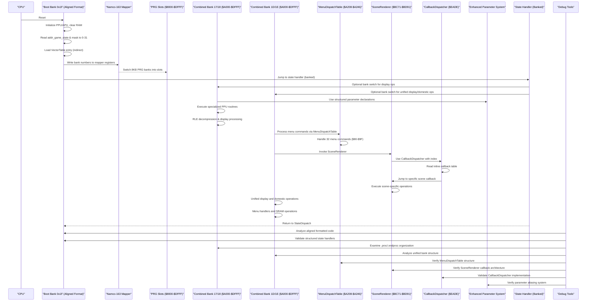

**Diagram sources**
- [prg_1f.aligned.asm:406-459](file://asm/banks/prg_1f.aligned.asm#L406-L459)
- [prg_1f.aligned.asm:467-694](file://asm/banks/prg_1f.aligned.asm#L467-L694)
- [prg_17_18.asm:72-127](file://asm/banks/prg_17_18.asm#L72-L127)
- [prg_1d_1e.asm:18-94](file://asm/banks/prg_1d_1e.asm#L18-L94)
- [prg_1d_1e.asm:366-398](file://asm/banks/prg_1d_1e.asm#L366-398)
- [prg_1d_1e.asm:3179-3203](file://asm/banks/prg_1d_1e.asm#L3179-L3203)
- [prg_1f.aligned.asm:1757-1785](file://asm/banks/prg_1f.aligned.asm#L1757-L1785)
- [namco163.h:10-17](file://include/namco163.h#L10-L17)
- [main.asm:115-121](file://asm/main.asm#L115-L121)

## Detailed Component Analysis

### Memory Mapping and Segment Organization
The linker configuration defines:
- Zero-page RAM and uninitialized RAM segments.
- Four PRG slots ($8000-$FFFF) sized 8KB each.
- Segments for code and read-only data, with optional assignments for additional banks.
- The CODE segment starts at PRG_SLOT0 and includes the interrupt vectors at $9FFA.
- Special handling for the combined PRG bank 17/18 structure at $A000-$DFFF with dual bank organization.
- Special handling for the new combined PRG bank 1D/1E structure at $A000-$DFFF with unified bank organization.

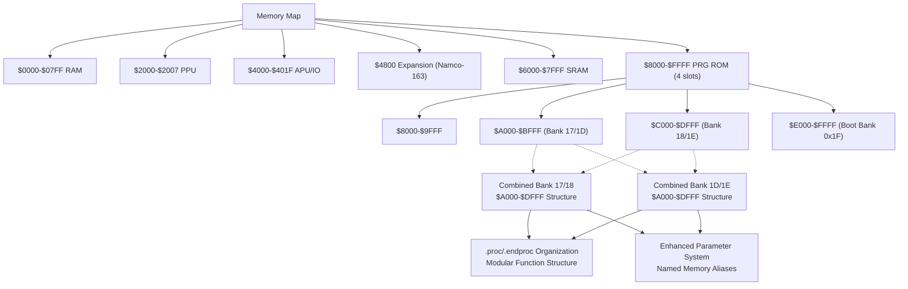

**Diagram sources**
- [linker.cfg:4-12](file://linker.cfg#L4-L12)
- [linker.cfg:18-30](file://linker.cfg#L18-L30)
- [linker.cfg:32-54](file://linker.cfg#L32-L54)
- [prg_17_18.asm:1-80](file://asm/banks/prg_17_18.asm#L1-L80)
- [prg_1d_1e.asm:1-80](file://asm/banks/prg_1d_1e.asm#L1-L80)

**Section sources**
- [linker.cfg:18-55](file://linker.cfg#L18-L55)
- [PROJECT.md:70-83](file://PROJECT.md#L70-L83)

### Fixed Boot Bank 0x1F and Reset Flow (Modern Assembly Format)
- The reset handler at $E000 performs CPU initialization, PPU warmup, APU initialization, and RAM clearing.
- It initializes the mapper and sets the initial game state, then dispatches to the state handler via the vector table.
- The vector table at $E07C contains 15 entries, each a 2-byte address within bank 0x1F, organized in a structured aligned format.

**Updated** Enhanced with modern assembly formatting standards featuring structured code organization and improved readability.

**Diagram sources**
- [prg_1f.aligned.asm:406-459](file://asm/banks/prg_1f.aligned.asm#L406-L459)
- [prg_1f.aligned.asm:460-466](file://asm/banks/prg_1f.aligned.asm#L460-L466)
- [prg_1f.aligned.asm:451-459](file://asm/banks/prg_1f.aligned.asm#L451-L459)

**Section sources**
- [prg_1f.aligned.asm:406-459](file://asm/banks/prg_1f.aligned.asm#L406-L459)
- [prg_1f.aligned.asm:460-466](file://asm/banks/prg_1f.aligned.asm#L460-L466)
- [prg_1f.aligned.asm:451-459](file://asm/banks/prg_1f.aligned.asm#L451-L459)
- [PROJECT.md:101-117](file://PROJECT.md#L101-L117)

### State Machine and Vector Dispatch (Structured Organization)
- The game state is stored in a global RAM location and masked to 0-31 to index the vector table.
- Each state handler performs frame initialization, prepares display buffers, calls bank-switched display routines, updates state, and re-invokes the dispatcher.
- The dispatcher reloads the vector table entry and jumps to the next state.
- Modern assembly formatting provides structured organization with labeled state handlers for improved readability.

**Updated** Enhanced with modern assembly formatting standards featuring structured state handler organization and improved debugging support.

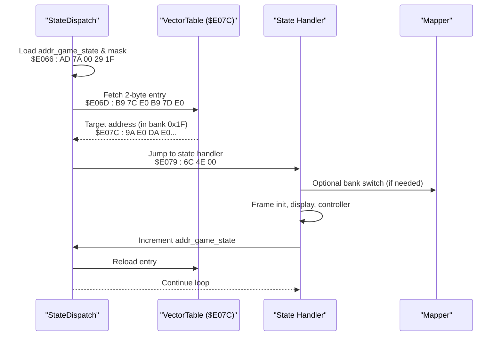

**Diagram sources**
- [prg_1f.aligned.asm:451-459](file://asm/banks/prg_1f.aligned.asm#L451-L459)
- [prg_1f.aligned.asm:467-694](file://asm/banks/prg_1f.aligned.asm#L467-L694)
- [prg_1f.aligned.asm:460-466](file://asm/banks/prg_1f.aligned.asm#L460-L466)

**Section sources**
- [prg_1f.aligned.asm:451-459](file://asm/banks/prg_1f.aligned.asm#L451-L459)
- [prg_1f.aligned.asm:467-694](file://asm/banks/prg_1f.aligned.asm#L467-L694)
- [prg_1f.aligned.asm:460-466](file://asm/banks/prg_1f.aligned.asm#L460-L466)

### Combined PRG Bank 17/18 Structure and Enhanced Display Operations
- The PRG bank 17/18 structure provides a combined 16KB memory space at $A000-$DFFF, with bank $17 at $A000-$BFFF and bank $18 at $C000-$DFFF.
- This structure enables efficient display operations and specialized PPU data handling routines with comprehensive function organization.
- The bank supports public entry points for display functions including RLE compression, raw data copying, tile offset calculations, and advanced display operations.
- Bank switching for this combined structure uses the SwitchBankAC_A/B routine with Y=$37 to load both banks simultaneously.
- Modern .proc/.endproc organization provides modular function structure with clear scope boundaries and improved code maintainability.
- **Enhanced Parameter System**: Structured memory addressing system with comprehensive parameter declarations throughout the assembly.

**Updated** Enhanced with comprehensive coverage of the new combined bank structure, its specialized display capabilities, modernized code organization, and the enhanced parameter declaration system.

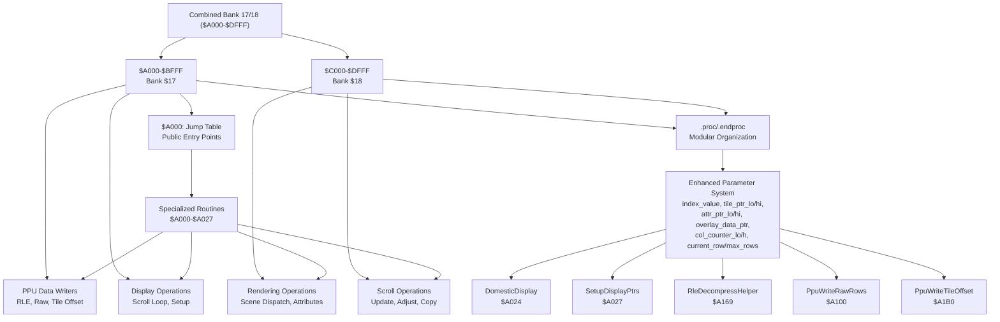

**Diagram sources**
- [prg_17_18.asm:72-127](file://asm/banks/prg_17_18.asm#L72-L127)
- [prg_17_18.asm:168-208](file://asm/banks/prg_17_18.asm#L168-L208)
- [prg_17_18.asm:534-613](file://asm/banks/prg_17_18.asm#L534-L613)
- [functions.h:315-335](file://include/functions.h#L315-L335)

**Section sources**
- [prg_17_18.asm:1-80](file://asm/banks/prg_17_18.asm#L1-L80)
- [prg_17_18.asm:72-127](file://asm/banks/prg_17_18.asm#L72-L127)
- [prg_17_18.asm:168-208](file://asm/banks/prg_17_18.asm#L168-L208)
- [prg_17_18.asm:534-613](file://asm/banks/prg_17_18.asm#L534-L613)
- [functions.h:315-335](file://include/functions.h#L315-L335)

### Combined PRG Bank 1D/1E Structure and Unified Display System
- The PRG bank 1D/1E structure provides a unified 16KB memory space at $A000-$DFFF, combining the functionality of previously separate bank $1D and bank $1E.
- This structure offers significant architectural improvement over individual bank management with integrated display operations, menu handlers, domestic affairs dispatch, and SRAM save/load functionality.
- The bank $1D portion ($A000-$BFFF) contains a 24-entry jump table at $A000-$A047, display operations, tile data, and menu handlers.
- The bank $1E portion ($C000-$DFFF) contains domestic affairs dispatch, tile data, and SRAM save/load operations.
- Bank switching for this combined structure uses the standard bank switching routine to load both banks simultaneously into the $A000-$DFFF range.
- The unified approach simplifies memory management and provides seamless integration between display and domestic operations.
- Modern .proc/.endproc organization provides modular function structure with clear scope boundaries and improved code maintainability.

**Updated** Comprehensive documentation of the new combined PRG bank 1D/1E system that represents a significant architectural improvement over the previous individual bank management approach.

```mermaid
flowchart TD
COMBINED1D_1E["Combined Bank 1D/1E ($A000-$DFFF)"] --> JUMPTABLE["$A000-$A047<br/>24-Entry Jump Table"]
COMBINED1D_1E --> MENUDISPATCH["$A208-$A246<br/>32-Entry MenuDispatchTable"]
COMBINED1D_1E --> SCENERENDERER["$BC71-$BD91<br/>SceneRenderer with Callback Table"]
COMBINED1D_1E --> DOMESTIC["$A048-$BFFF<br/>Bank $1D Content"]
COMBINED1D_1E --> SRAM["$C000-$DFFF<br/>Bank $1E Content"]
JUMPTABLE --> ENTRY00["Entry00: PPUTileRender<br/>$A000"]
JUMPTABLE --> ENTRY01["Entry01: MenuUpdate<br/>$A003"]
JUMPTABLE --> ENTRY02["Entry02: VRAMBufferWrite<br/>$A006"]
JUMPTABLE --> ENTRY03["Entry03: StateHandler<br/>$A009"]
JUMPTABLE --> ENTRY04["Entry04: MapDisplaySetup<br/>$A00C"]
JUMPTABLE --> ENTRY05["Entry05: OfficerListHandler<br/>$A00F"]
JUMPTABLE --> ENTRY06["Entry06: Unknown<br/>$A012"]
JUMPTABLE --> ENTRY07["Entry07: Bank $1E $DBB1<br/>$A015"]
JUMPTABLE --> ENTRY08["Entry08: Bank $1E $DD8B<br/>$A018"]
JUMPTABLE --> ENTRY09["Entry09: Bank $1E $DE7E<br/>$A01B"]
JUMPTABLE --> ENTRY10["Entry10: NumberDisplaySetup<br/>$A01E"]
JUMPTABLE --> ENTRY11["Entry11: FrameCounterCheck<br/>$A021"]
JUMPTABLE --> ENTRY12["Entry12: BcdDisplayHandler<br/>$A024"]
JUMPTABLE --> ENTRY13["Entry13: ProvinceDataHandler<br/>$A027"]
JUMPTABLE --> ENTRY14["Entry14: OfficerLookup<br/>$A02A"]
JUMPTABLE --> ENTRY15["Entry15: FrameCounterAlt<br/>$A02D"]
JUMPTABLE --> ENTRY16["Entry16: NameDisplay<br/>$A030"]
JUMPTABLE --> ENTRY17["Entry17: RecordProcessor<br/>$A033"]
JUMPTABLE --> ENTRY18["Entry18: SmallRoutineA<br/>$A036"]
JUMPTABLE --> ENTRY19["Entry19: SmallRoutineB<br/>$A039"]
JUMPTABLE --> ENTRY20["Entry20: DataFormatter<br/>$A03C"]
JUMPTABLE --> ENTRY21["Entry21: MenuRenderer<br/>$A03F"]
JUMPTABLE --> ENTRY22["Entry22: BankedDataHandler<br/>$A042"]
JUMPTABLE --> ENTRY23["Entry23: Bank $1E $DEB9<br/>$A045"]
MENUDISPATCH --> CMD80["CmdEndMenu<br/>Command $80"]
MENUDISPATCH --> CMD81["CmdAdvanceRow<br/>Command $81"]
MENUDISPATCH --> CMD82["CmdPushPosition<br/>Command $82"]
MENUDISPATCH --> CMD83["CmdPopPosition<br/>Command $83"]
MENUDISPATCH --> CMD84["CmdSetOverlayMode<br/>Command $84"]
MENUDISPATCH --> CMD85["CmdClearOverlayMode<br/>Command $85"]
MENUDISPATCH --> CMD86["CmdSetVramPos<br/>Command $86"]
MENUDISPATCH --> CMD87["CmdEnableIndirect<br/>Command $87"]
MENUDISPATCH --> CMD88["CmdDisableIndirect<br/>Command $88"]
MENUDISPATCH --> CMD89["CmdSetTileOffset<br/>Command $89"]
MENUDISPATCH --> CMD90["CmdDrawName<br/>Commands $90-$97"]
MENUDISPATCH --> CMD98["CmdDrawNumber<br/>Commands $98-$9B"]
MENUDISPATCH --> CMD9C["CmdDrawNameFromData<br/>Command $9C"]
MENUDISPATCH --> CMD9D["CmdDrawNameFixed7<br/>Command $9D"]
MENUDISPATCH --> CMD9E["CmdDrawFormattedNumber<br/>Command $9E"]
MENUDISPATCH --> CMD9F["CmdDrawNameFromParam<br/>Command $9F"]
SCENERENDERER --> SCENECALLBACKS["Scene Renderer Callbacks<br/>6 Entries with Symbolic Names"]
DOMESTIC --> MENUDISPLAY["Menu Display Ops<br/>Input Processing, Tile Buffering"]
DOMESTIC --> DATAOPS["Data Operations<br/>Menu Data Ptr, Tile Byte Store"]
DOMESTIC --> CALLBACKS["Callback Dispatchers<br/>B1F_CallbackDispatcher"]
SRAM --> SAVELOAD["SRAM Save/Load<br/>Battery Backed Data"]
SRAM --> DATASTORE["Data Storage<br/>Kingdom Records, Player Data"]
```

**Diagram sources**
- [prg_1d_1e.asm:18-94](file://asm/banks/prg_1d_1e.asm#L18-L94)
- [prg_1d_1e.asm:104-197](file://asm/banks/prg_1d_1e.asm#L104-L197)
- [prg_1d_1e.asm:241-358](file://asm/banks/prg_1d_1e.asm#L241-L358)
- [prg_1d_1e.asm:359-475](file://asm/banks/prg_1d_1e.asm#L359-L475)
- [prg_1d_1e.asm:366-398](file://asm/banks/prg_1d_1e.asm#L366-L398)
- [prg_1d_1e.asm:3179-3203](file://asm/banks/prg_1d_1e.asm#L3179-L3203)

**Section sources**
- [prg_1d_1e.asm:1-80](file://asm/banks/prg_1d_1e.asm#L1-L80)
- [prg_1d_1e.asm:18-94](file://asm/banks/prg_1d_1e.asm#L18-L94)
- [prg_1d_1e.asm:104-197](file://asm/banks/prg_1d_1e.asm#L104-L197)
- [prg_1d_1e.asm:241-358](file://asm/banks/prg_1d_1e.asm#L241-L358)
- [prg_1d_1e.asm:359-475](file://asm/banks/prg_1d_1e.asm#L359-L475)

### Enhanced Menu Update Procedure with Structured Command Dispatch
- The MenuUpdate procedure has been completely refactored with a comprehensive 32-entry MenuDispatchTable for handling menu commands $80-$9F.
- The new structured command dispatch system uses the B1F_CallbackDispatcher to route commands to specific handler functions.
- Commands include menu control operations (end, advance row, push/pop position), display mode controls (overlay mode, VRAM positioning), and content rendering (names, numbers, formatted output).
- The procedure maintains enhanced parameter system usage with named variables for better code clarity and maintainability.
- All procedures are properly wrapped with .proc/.endproc directives for clear scope boundaries and improved debugging support.

**Updated** Major refactoring of the MenuUpdate procedure with comprehensive command dispatch system and enhanced procedural boundaries.

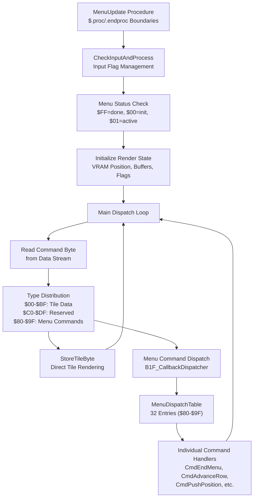

**Diagram sources**
- [prg_1d_1e.asm:270-398](file://asm/banks/prg_1d_1e.asm#L270-L398)
- [prg_1d_1e.asm:366-398](file://asm/banks/prg_1d_1e.asm#L366-L398)
- [prg_1f.aligned.asm:1757-1785](file://asm/banks/prg_1f.aligned.asm#L1757-L1785)

**Section sources**
- [prg_1d_1e.asm:270-398](file://asm/banks/prg_1d_1e.asm#L270-L398)
- [prg_1d_1e.asm:366-398](file://asm/banks/prg_1d_1e.asm#L366-L398)
- [prg_1f.aligned.asm:1757-1785](file://asm/banks/prg_1f.aligned.asm#L1757-L1785)

### Bank Switching Implementation (Enhanced Macros)
- The mapper exposes four write-only registers to select 8KB PRG banks for each slot.
- The project provides enhanced macros to simplify bank switching for each slot with modern formatting.
- A bank switching helper reads a configuration table and writes to the mapper registers for PRG slots and extended configuration.
- The combined PRG bank 17/18 structure uses specialized bank switching routines for simultaneous loading of both banks.
- The new combined PRG bank 1D/1E system uses standard bank switching to load both banks into the unified $A000-$DFFF range.
- Modern assembly format provides structured organization with labeled bank switching routines and .proc/.endproc scope management.

**Updated** Enhanced with modern assembly formatting standards and improved macro organization, including coverage of the new combined bank structure and structured function organization.

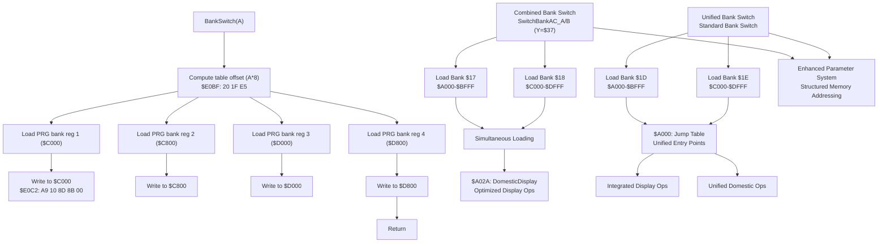

**Diagram sources**
- [prg_1f.aligned.asm:785-818](file://asm/banks/prg_1f.aligned.asm#L785-L818)
- [prg_1f.aligned.asm:824-828](file://asm/banks/prg_1f.aligned.asm#L824-L828)
- [prg_17_18.asm:112-127](file://asm/banks/prg_17_18.asm#L112-L127)
- [prg_1d_1e.asm:18-94](file://asm/banks/prg_1d_1e.asm#L18-L94)
- [namco163.h:10-17](file://include/namco163.h#L10-L17)

**Section sources**
- [namco163.h:65-87](file://include/namco163.h#L65-L87)
- [prg_1f.aligned.asm:785-818](file://asm/banks/prg_1f.aligned.asm#L785-L818)
- [prg_1f.aligned.asm:824-828](file://asm/banks/prg_1f.aligned.asm#L824-L828)
- [prg_17_18.asm:112-127](file://asm/banks/prg_17_18.asm#L112-L127)
- [prg_1d_1e.asm:18-94](file://asm/banks/prg_1d_1e.asm#L18-L94)

### Interrupt Service Routines and Hardware Abstraction
- The main module provides minimal NMI and IRQ stubs that preserve registers and return via RTI.
- The boot bank implements PPU initialization helpers and provides macros for common operations like VBlank waits, PPU address setting, and DMA transfers.
- The mapper initialization routine sets up the initial bank configuration for the first three slots.
- The combined PRG bank 17/18 structure provides specialized display and rendering routines optimized for the game's strategic interface.
- The new combined PRG bank 1D/1E system provides unified display and domestic operations with integrated SRAM management.
- Modern assembly formatting provides structured organization with labeled interrupt handlers and hardware abstraction routines, including comprehensive .proc/.endproc scope management.

**Updated** Enhanced with modern assembly formatting standards and improved hardware abstraction organization, including coverage of the new combined bank structure and structured function organization.

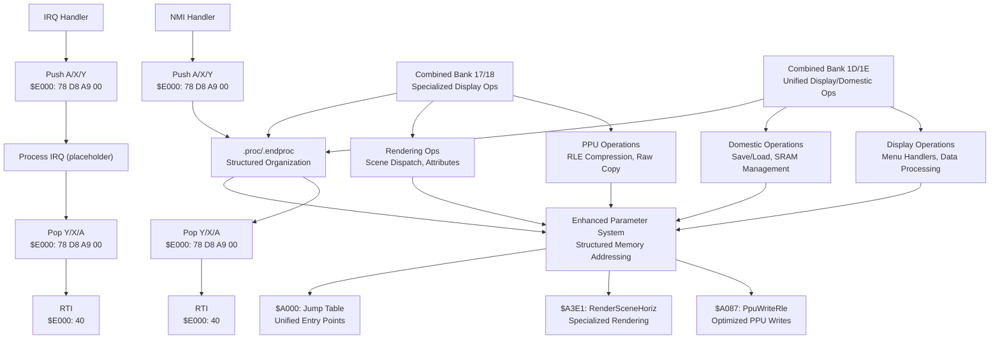

**Diagram sources**
- [main.asm:65-99](file://asm/main.asm#L65-L99)
- [prg_1f.aligned.asm:1040-1065](file://asm/banks/prg_1f.aligned.asm#L1040-L1065)
- [prg_17_18.asm:168-208](file://asm/banks/prg_17_18.asm#L168-L208)
- [prg_17_18.asm:706-768](file://asm/banks/prg_17_18.asm#L706-L768)
- [prg_1d_1e.asm:18-94](file://asm/banks/prg_1d_1e.asm#L18-L94)
- [macros.h:8-12](file://include/macros.h#L8-L12)

**Section sources**
- [main.asm:65-99](file://asm/main.asm#L65-L99)
- [prg_1f.aligned.asm:1040-1065](file://asm/banks/prg_1f.aligned.asm#L1040-L1065)
- [prg_17_18.asm:168-208](file://asm/banks/prg_17_18.asm#L168-L208)
- [prg_17_18.asm:706-768](file://asm/banks/prg_17_18.asm#L706-L768)
- [prg_1d_1e.asm:18-94](file://asm/banks/prg_1d_1e.asm#L18-L94)
- [macros.h:8-12](file://include/macros.h#L8-L12)

### Modular Assembly Approach and Bank Assignment
- The project uses a modular approach: each bank is represented by a separate assembly stub that includes the corresponding binary.
- The linker configuration assigns segments to specific PRG slots and allows optional assignment of additional banks.
- The include files centralize register definitions and macros for consistent access patterns across banks.
- The combined PRG bank 17/18 structure represents a specialized module providing enhanced display capabilities with modern .proc/.endproc organization.
- The new combined PRG bank 1D/1E structure represents a unified module providing integrated display and domestic operations with simplified bank management.
- Modern assembly formatting provides improved organization and debugging support across all bank files, including comprehensive function scope management.
- **Enhanced Parameter System**: Structured memory addressing system with comprehensive parameter declarations throughout the PRG bank 17-18 assembly.
- **Unified Bank Architecture**: The new combined PRG bank 1D/1E system provides architectural improvement over individual bank management with integrated functionality.

**Updated** Enhanced with modern assembly formatting standards and improved bank assignment organization, including coverage of the new combined bank structure and structured function organization.

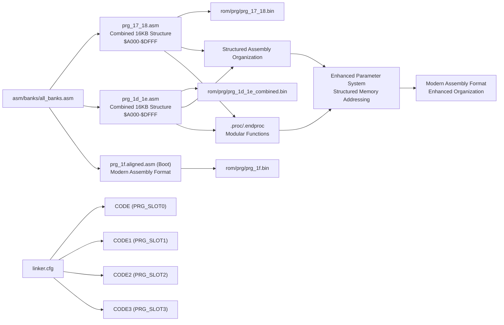

**Diagram sources**
- [all_banks.asm:1-38](file://asm/banks/all_banks.asm#L1-L38)
- [prg_17_18.asm:1-80](file://asm/banks/prg_17_18.asm#L1-L80)
- [prg_1d_1e.asm:1-80](file://asm/banks/prg_1d_1e.asm#L1-L80)
- [linker.cfg:32-54](file://linker.cfg#L32-L54)

**Section sources**
- [all_banks.asm:1-38](file://asm/banks/all_banks.asm#L1-L38)
- [prg_17_18.asm:1-80](file://asm/banks/prg_17_18.asm#L1-L80)
- [prg_1d_1e.asm:1-80](file://asm/banks/prg_1d_1e.asm#L1-L80)
- [linker.cfg:32-54](file://linker.cfg#L32-L54)

## Modern Assembly Formatting Standards

### Aligned Assembly Format
The modern aligned format provides comprehensive improvements in code organization and readability:

- **Structured Label Organization**: Labels are grouped by functional categories (constants, data, code, subroutines)
- **Address Constants**: Comprehensive address mapping system with clear naming conventions
- **Macro Definitions**: Enhanced macro system with proper parameter handling
- **Data Organization**: Structured data sections with clear labeling and organization
- **Code Readability**: Improved indentation and spacing for better code comprehension

### Enhanced Code Organization Features
The aligned format introduces several organizational improvements:

- **Functional Grouping**: Related functions and data are grouped together for better navigation
- **Consistent Formatting**: Standardized formatting across all code sections
- **Improved Navigation**: Logical organization makes code easier to navigate and understand
- **Enhanced Maintainability**: Better structure supports easier maintenance and updates

### Benefits for Development
The modern assembly formatting provides numerous benefits for developers:

- **Improved Readability**: Structured organization makes code easier to understand
- **Better Navigation**: Logical grouping helps developers quickly locate specific functionality
- **Enhanced Debugging**: Clear organization supports more effective debugging and analysis
- **Maintainability**: Better structure facilitates easier code maintenance and updates
- **Documentation Support**: Organized structure serves as implicit documentation of code functionality

**Section sources**
- [prg_1f.aligned.asm:12-80](file://asm/banks/prg_1f.aligned.asm#L12-L80)
- [prg_1f.aligned.asm:800-1599](file://asm/banks/prg_1f.aligned.asm#L800-L1599)
- [prg_17_18.asm:14-71](file://asm/banks/prg_17_18.asm#L14-L71)
- [prg_1d_1e.asm:12-16](file://asm/banks/prg_1d_1e.asm#L12-L16)
- [namco163.h:65-87](file://include/namco163.h#L65-L87)

## Enhanced Parameter Declaration System

### Comprehensive Parameter Alias System
The PRG bank 17-18 assembly now features a comprehensive parameter declaration system that replaces direct memory addressing with descriptive variable names:

- **Global Parameter Declarations**: Parameters like index_value, tile_ptr_lo/hi, attr_ptr_lo/hi, overlay_data_ptr, col_counter_lo/h, current_row/max_rows are declared at the function scope level
- **Structured Memory Addressing**: All zero-page memory operations now use named parameters instead of direct addressing like $000A, $000B, etc.
- **Enhanced Readability**: Code becomes self-documenting with meaningful variable names that describe their purpose and usage context
- **Improved Maintainability**: Parameter aliases make it easier to track memory usage and reduce errors from direct addressing mistakes

### Parameter Categories and Usage Patterns
The parameter system organizes memory usage into logical categories:

- **Index and Pointer Parameters**: index_value, overlay_data_ptr, scene_coord_ptr, work_ptr_hi
- **Pointer Pair Parameters**: tile_ptr_lo/hi, attr_ptr_lo/hi, ptr_001a_lo/hi, ptr_001c_lo/hi, ptr_001e_lo/hi
- **Counter and Control Parameters**: col_counter_lo/h, current_row, max_rows, row_limit, row_count
- **Temporary and Working Parameters**: param_byte1/2, tile_attr_byte, rle_marker, param_0003, param_0008
- **Address and Offset Parameters**: ppu_addr_lo/hi, attr_base_offset, coord_ptr_lo/hi, data_ptr_offset

### Function-Level Parameter Scoping
Each .proc block defines its own parameter namespace:

- **Local Symbol Isolation**: Parameters declared within .proc blocks remain local to that function scope
- **Clear Function Boundaries**: .endproc markers clearly define parameter scope and function boundaries
- **Modular Design**: Independent parameter spaces support better code modularity and reuse
- **Enhanced Debugging**: Scoped parameters support better debugging and analysis of function-specific memory usage

### Examples of Enhanced Parameter Usage
The parameter system dramatically improves code clarity:

- **SetupDisplayPtrs**: Uses index_value, tile_ptr_lo/hi, attr_ptr_lo/hi for tile/attribute pointer setup
- **PpuWriteRawRows**: Uses col_counter_lo/h, current_row, max_rows for row-based processing loops
- **RleDecompressHelper**: Uses col_counter_lo/h, tile_col_index, current_row for RLE processing coordination
- **RenderSceneHoriz**: Uses param_byte1/2, ppu_addr_hi, tile_col_index, current_row for horizontal rendering
- **BattleOverlayRender**: Uses overlay_data_ptr, scene_coord_ptr, work_ptr_hi for overlay processing

**Section sources**
- [prg_17_18.asm:135-155](file://asm/banks/prg_17_18.asm#L135-L155)
- [prg_17_18.asm:242-315](file://asm/banks/prg_17_18.asm#L242-L315)
- [prg_17_18.asm:759-857](file://asm/banks/prg_17_18.asm#L759-L857)
- [prg_17_18.asm:1288-1327](file://asm/banks/prg_17_18.asm#L1288-L1327)
- [prg_17_18.asm:1850-2002](file://asm/banks/prg_17_18.asm#L1850-L2002)

## Enhanced Code Organization

### Address Constant System
The aligned format implements a comprehensive address constant system:

- **RAM Address Constants**: Extensive mapping of RAM locations with descriptive names
- **PPU Register Constants**: Clear mapping of PPU register addresses and bit definitions
- **APU Register Constants**: Complete mapping of APU and I/O register addresses
- **Namco-163 Specific Constants**: Dedicated constants for mapper and expansion ROM registers
- **Combined Bank Constants**: Specialized address mappings for the PRG bank 17/18 and 1D/1E structures

### Macro Enhancement System
The macro system provides enhanced functionality:

- **Force Absolute Addressing**: Macros that force 16-bit addressing for absolute operations
- **Bank Switching Macros**: Enhanced macros for PRG bank switching with proper slot selection
- **Hardware Access Macros**: Streamlined macros for common hardware operations
- **Data Transfer Macros**: Optimized macros for efficient data movement and manipulation
- **Combined Bank Macros**: Specialized macros for managing the 16KB combined bank structures

### Data Organization Improvements
The aligned format provides better data organization:

- **Structured Data Sections**: Logical grouping of related data items
- **Clear Labeling**: Descriptive labels for easy identification of data purposes
- **Address Mapping**: Clear correlation between logical names and physical addresses
- **Constant Definitions**: Well-organized constants for easy modification and maintenance

### Structured Function Organization
The new .proc/.endproc organization provides comprehensive function structuring:

- **Scope Management**: Clear .proc/.endproc boundaries define function scope
- **Local Symbols**: Function-specific symbols remain local to their scope
- **Modular Design**: Independent function blocks improve code modularity
- **Enhanced Debugging**: Scoped organization supports better debugging and analysis
- **Code Reusability**: Modular functions can be reused independently

**Section sources**
- [prg_1f.aligned.asm:80-399](file://asm/banks/prg_1f.aligned.asm#L80-L399)
- [prg_17_18.asm:14-71](file://asm/banks/prg_17_18.asm#L14-L71)
- [prg_1d_1e.asm:12-16](file://asm/banks/prg_1d_1e.asm#L12-L16)
- [prg_1f.aligned.asm:1228-1256](file://asm/banks/prg_1f.aligned.asm#L1228-L1256)
- [prg_1f.aligned.asm:1319-1372](file://asm/banks/prg_1f.aligned.asm#L1319-L1372)
- [prg_17_18.asm:17-17](file://asm/banks/prg_17_18.asm#L17-L17)

## Callback Table Architecture

### Enhanced Callback Dispatcher Implementation
The B1F_CallbackDispatcher provides a robust callback mechanism with proper parameter passing and return value handling:

- **Parameter Passing**: Input parameter is passed via Y register and preserved across callback invocation
- **Inline Table Structure**: Callback tables are defined immediately after the JSR instruction
- **Indirect Jump Mechanism**: Uses return address calculation to access callback table entries
- **Symbolic Function Names**: All callback targets use symbolic names for improved maintainability
- **Structured Organization**: Proper .proc/.endproc boundaries ensure clean function scoping

### Callback Table Structure and Usage
The callback system follows a consistent pattern across the codebase:

- **Table Definition**: Inline word tables containing 16-bit function addresses
- **Index Calculation**: Index value multiplied by 2 for word-sized entries
- **Return Address Handling**: Automatic stack manipulation to access following table
- **Parameter Preservation**: Y register value saved and restored around callback invocation
- **Flexible Architecture**: Supports any number of callbacks with simple table extension

### SceneRenderer Callback Implementation
The SceneRenderer system demonstrates the proper callback architecture:

- **Six Entry Callback Table**: SceneOfficerListInit, ScenePageCopy, SceneRenderSetup, SceneSpriteSetup, SceneRenderExit3, SceneBufferFill
- **State Management**: Uses $0401 as callback index with automatic incrementation
- **Symbolic References**: All callback targets use descriptive function names
- **Parameter Context**: Maintains scene-specific state in zero-page memory locations
- **Integration Pattern**: Seamless integration with the broader callback system

**Updated** Major enhancement implementing proper callback table architecture replacing inline dispatch logic with structured, maintainable callback mechanisms.

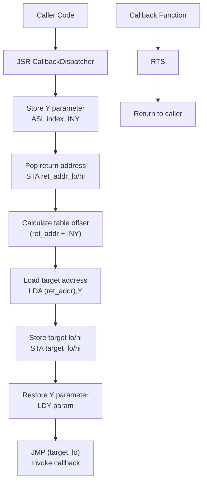

**Diagram sources**
- [prg_1f.aligned.asm:1757-1785](file://asm/banks/prg_1f.aligned.asm#L1757-L1785)
- [prg_1d_1e.asm:3179-3203](file://asm/banks/prg_1d_1e.asm#L3179-L3203)
- [prg_1d_1e.asm:570-612](file://asm/banks/prg_1d_1e.asm#L570-L612)

**Section sources**
- [prg_1f.aligned.asm:1757-1785](file://asm/banks/prg_1f.aligned.asm#L1757-L1785)
- [prg_1d_1e.asm:3179-3203](file://asm/banks/prg_1d_1e.asm#L3179-L3203)
- [prg_1d_1e.asm:570-612](file://asm/banks/prg_1d_1e.asm#L570-L612)

## SceneRenderer System Implementation

### Comprehensive Local Variable Documentation
The SceneRenderer system now features comprehensive local variable documentation across all key procedures:

- **SceneRenderer Core**: officer_list_st, officer_list_st1, officer_list_st2, officer_list_st3, oam_extra, scene_render_flag
- **MenuUpdate Variables**: menu_fmt_data0/1/2, menu_fmt_num0/1/2, menu_tile_tmp with detailed usage descriptions
- **YearDisplaySetup**: Local variables for year display formatting and positioning
- **PeriodicOverlayRefresh**: Variables for periodic refresh operations and timing control
- **ProvinceDataHandler**: Province-specific data handling and display variables
- **OfficerNameDisplay**: Officer name rendering and formatting variables
- **DisplayScaledName**: Name scaling and positioning variables
- **BankedDataHandler**: Bank switching and data management variables
- **SetupBankedData**: Data setup and initialization variables
- **StateHandler**: Game state management and transition variables
- **OfficerListHandler**: Officer list display and interaction variables

### SceneRenderer Callback Architecture
The SceneRenderer implements a six-entry callback system with proper state management:

- **SceneOfficerListInit**: Initializes officer list state registers with default values
- **ScenePageCopy**: Copies scene page data with bank switching and palette updates
- **SceneRenderSetup**: Handles scenario render setup, data loading, and timer initialization
- **SceneSpriteSetup**: Manages sprite OAM setup and input-driven palette operations
- **SceneRenderExit3**: Provides alternate render exit with scenario data loading
- **SceneBufferFill**: Fills VRAM buffer pages and manages data pointers

### Enhanced Procedural Boundaries
All SceneRenderer procedures implement proper .proc/.endproc boundaries with comprehensive local variable scoping:

- **Local Variable Isolation**: Each procedure defines its own parameter namespace
- **Clear Function Boundaries**: .endproc markers define complete function scope
- **Modular Design**: Independent procedures support better code organization
- **Enhanced Debugging**: Scoped variables support better debugging and analysis
- **Maintainability**: Clear boundaries facilitate easier code maintenance

**Updated** Comprehensive documentation of local variables across all key procedures with enhanced procedural boundaries and proper callback table architecture.

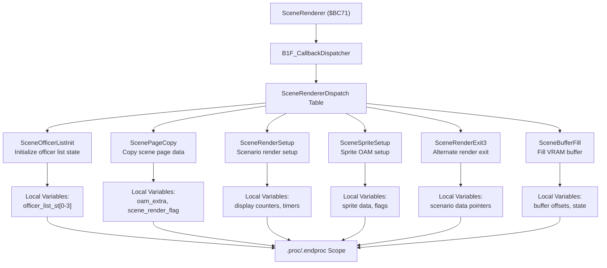

**Diagram sources**
- [prg_1d_1e.asm:3179-3203](file://asm/banks/prg_1d_1e.asm#L3179-L3203)
- [prg_1d_1e.asm:3209-3220](file://asm/banks/prg_1d_1e.asm#L3209-L3220)
- [prg_1d_1e.asm:3226-3271](file://asm/banks/prg_1d_1e.asm#L3226-L3271)
- [prg_1d_1e.asm:3277-3300](file://asm/banks/prg_1d_1e.asm#L3277-L3300)
- [prg_1d_1e.asm:3306-3325](file://asm/banks/prg_1d_1e.asm#L3306-L3325)
- [prg_1d_1e.asm:3331-3352](file://asm/banks/prg_1d_1e.asm#L3331-L3352)
- [prg_1d_1e.asm:3358-3400](file://asm/banks/prg_1d_1e.asm#L3358-L3400)

**Section sources**
- [prg_1d_1e.asm:3179-3203](file://asm/banks/prg_1d_1e.asm#L3179-L3203)
- [prg_1d_1e.asm:3209-3220](file://asm/banks/prg_1d_1e.asm#L3209-L3220)
- [prg_1d_1e.asm:3226-3271](file://asm/banks/prg_1d_1e.asm#L3226-L3271)
- [prg_1d_1e.asm:3277-3300](file://asm/banks/prg_1d_1e.asm#L3277-L3300)
- [prg_1d_1e.asm:3306-3325](file://asm/banks/prg_1d_1e.asm#L3306-L3325)
- [prg_1d_1e.asm:3331-3352](file://asm/banks/prg_1d_1e.asm#L3331-L3352)
- [prg_1d_1e.asm:3358-3400](file://asm/banks/prg_1d_1e.asm#L3358-L3400)

## Debugging and Verification Tools

### Aligned Format Benefits
The modern aligned format provides enhanced debugging capabilities:

- **Structured Code Analysis**: Organized code structure supports more effective analysis
- **Improved Symbol Resolution**: Clear label organization aids in symbol resolution during debugging
- **Enhanced Readability**: Better formatting supports faster code comprehension during debugging
- **Logical Organization**: Functional grouping makes it easier to isolate specific debugging scenarios

### Legacy Format Preservation
The project maintains backward compatibility through:

- **Backup Files**: Original format preserved in .bak files for reference
- **Aligned Versions**: Alternative formatting preserved for comparison and analysis
- **Migration Support**: Clear evidence of transformation supports migration and analysis

### Development Workflow Integration
The modern format integrates well with development workflows:

- **Tool Compatibility**: Format compatible with standard assembly development tools
- **Analysis Support**: Enhanced structure supports automated analysis and verification
- **Documentation Support**: Organized structure serves as built-in documentation

### Enhanced Parameter System Benefits
The new parameter declaration system provides additional debugging advantages:

- **Memory Usage Tracking**: Named parameters make it easier to track zero-page memory usage
- **Code Clarity**: Descriptive parameter names improve code comprehension during debugging
- **Error Reduction**: Parameter aliases reduce errors from direct memory addressing
- **Scope Analysis**: Local parameter scoping helps identify memory conflicts between functions

### Combined Bank System Benefits
The new combined PRG bank 1D/1E system provides debugging advantages:

- **Unified Memory Space**: Simplified memory management makes debugging more straightforward
- **Integrated Functionality**: Combined operations provide clearer execution flow analysis
- **Reduced Bank Confusion**: Eliminates confusion between separate bank management
- **Enhanced Testing**: Unified structure supports more comprehensive testing approaches

### New Menu Dispatch System Benefits
The new MenuDispatchTable provides additional debugging advantages:

- **Structured Command Handling**: Clear separation of menu command processing logic
- **Enhanced Traceability**: Individual command handlers can be debugged independently
- **Improved Error Detection**: Command validation and error handling are more systematic
- **Better Performance Analysis**: Command dispatch overhead can be measured and optimized

### Enhanced Callback System Benefits
The new callback table architecture provides debugging advantages:

- **Structured Callback Management**: Clear separation of callback registration and invocation
- **Enhanced Traceability**: Individual callbacks can be debugged independently
- **Improved Error Detection**: Callback validation and error handling are more systematic
- **Better Performance Analysis**: Callback dispatch overhead can be measured and optimized
- **Symbolic References**: Symbolic function names improve debugging and analysis

**Section sources**
- [prg_1f.aligned.asm:1-200](file://asm/banks/prg_1f.aligned.asm#L1-L200)
- [prg_1f.asm.bak:1-50](file://asm/banks/prg_1f.asm.bak#L1-L50)
- [assemble_prg_1d_1e.py:1-41](file://tools/assemble_prg_1d_1e.py#L1-L41)

## Dependency Analysis
The architecture exhibits clear separation of concerns with modern assembly formatting standards:
- The boot bank depends on the mapper definitions and register abstractions.
- State handlers depend on the dispatcher and bank switching helpers.
- The combined PRG bank 17/18 structure depends on specialized display and rendering routines with structured function organization and enhanced parameter declarations.
- The new combined PRG bank 1D/1E structure depends on unified display and domestic operations with integrated SRAM management.
- The linker configuration ties together segments and memory regions.
- The main module coordinates initialization and provides minimal ISR stubs.
- Modern assembly formatting provides improved organization and debugging support.
- Function address constants in functions.h provide centralized access to combined bank functionality.
- **Enhanced Parameter System**: Structured memory addressing system provides improved dependency management and code clarity.
- **Unified Bank Architecture**: The new combined PRG bank 1D/1E system provides architectural improvement over individual bank management with simplified dependencies.
- **Menu Dispatch Dependencies**: The MenuUpdate procedure depends on the B1F_CallbackDispatcher and MenuDispatchTable for structured command processing.
- **Callback System Dependencies**: The SceneRenderer system depends on the B1F_CallbackDispatcher for structured callback invocation with proper parameter passing.

**Updated** Enhanced with modern assembly formatting standards and improved dependency management, including coverage of the new combined bank structure, structured function organization, the enhanced parameter declaration system, the new menu dispatch architecture, and the enhanced callback system.

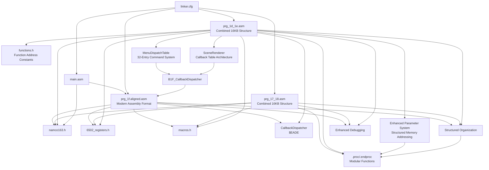

**Diagram sources**
- [prg_1f.aligned.asm:10-11](file://asm/banks/prg_1f.aligned.asm#L10-L11)
- [prg_17_18.asm:10-12](file://asm/banks/prg_17_18.asm#L10-L12)
- [prg_1d_1e.asm:12-14](file://asm/banks/prg_1d_1e.asm#L12-L14)
- [namco163.h:10-17](file://include/namco163.h#L10-L17)
- [6502_registers.h:6-39](file://include/6502_registers.h#L6-L39)
- [macros.h:1-72](file://include/macros.h#L1-L72)
- [main.asm:6-7](file://asm/main.asm#L6-L7)
- [linker.cfg:18-55](file://linker.cfg#L18-L55)
- [functions.h:315-335](file://include/functions.h#L315-L335)
- [prg_1d_1e.asm:366-398](file://asm/banks/prg_1d_1e.asm#L366-L398)
- [prg_1f.aligned.asm:1757-1785](file://asm/banks/prg_1f.aligned.asm#L1757-L1785)
- [prg_1d_1e.asm:3179-3203](file://asm/banks/prg_1d_1e.asm#L3179-L3203)

**Section sources**
- [prg_1f.aligned.asm:10-11](file://asm/banks/prg_1f.aligned.asm#L10-L11)
- [prg_17_18.asm:10-12](file://asm/banks/prg_17_18.asm#L10-L12)
- [prg_1d_1e.asm:12-14](file://asm/banks/prg_1d_1e.asm#L12-L14)
- [namco163.h:10-17](file://include/namco163.h#L10-L17)
- [6502_registers.h:6-39](file://include/6502_registers.h#L6-L39)
- [macros.h:1-72](file://include/macros.h#L1-L72)
- [main.asm:6-7](file://asm/main.asm#L6-L7)
- [linker.cfg:18-55](file://linker.cfg#L18-L55)
- [functions.h:315-335](file://include/functions.h#L315-L335)

## Performance Considerations
- Bank switching involves writing to mapper registers; minimize unnecessary switches to reduce overhead.
- Use the provided enhanced macros to keep register writes compact and consistent.
- Leverage the vector dispatch to avoid frequent branching and to centralize state transitions.
- Keep PPU/APU operations synchronized with VBlank to prevent flicker and timing issues.
- The combined PRG bank 17/18 structure provides optimized display operations for strategic interface rendering.
- The new combined PRG bank 1D/1E system provides unified memory management and simplified bank switching for display and domestic operations.
- **Enhanced Parameter System**: The structured parameter declaration system provides improved code organization for better performance analysis.
- **Debugging Efficiency**: Structured organization improves debugging efficiency and performance optimization.
- **Maintenance Overhead**: Modern formatting and parameter system add minimal overhead while providing significant development benefits.
- **Structured Functions**: The .proc/.endproc organization improves code modularity and reduces compilation times.
- **Memory Efficiency**: Parameter aliases eliminate redundant addressing operations and improve instruction efficiency.
- **Unified Bank Benefits**: The combined bank architecture reduces bank switching overhead and provides more efficient memory access patterns.
- **Menu Dispatch Optimization**: The new MenuDispatchTable provides efficient command routing with minimal overhead compared to conditional branching.
- **Callback System Performance**: The callback table architecture provides efficient dispatch with minimal overhead compared to inline conditional logic.
- **Symbolic References**: Symbolic function names improve code maintainability without performance impact.

## Troubleshooting Guide
- If the game does not enter the intended state, verify the vector table indexing and ensure the state counter is properly masked.
- If graphics appear incorrect after a bank switch, confirm the mapper register writes and palette upload sequences.
- If interrupts are not firing, ensure PPU control bits are set correctly and that the NMI flag is cleared appropriately.
- Use the provided enhanced macros for PPU operations to avoid off-by-one address errors.
- **Modern Format Benefits**: Utilize the structured aligned format to quickly locate and analyze specific code sections.
- **Organization Advantages**: Clear code organization makes troubleshooting more efficient and systematic.
- **Legacy Reference**: Use backup files to compare with original format when needed for analysis.
- **Migration Support**: Modern format supports easier migration and updates compared to legacy formats.
- **Combined Bank Issues**: For PRG bank 17/18 problems, verify the SwitchBankAC_A/B routine and ensure proper simultaneous loading.
- **Structured Function Issues**: For function scoping problems, verify .proc/.endproc balance and proper function boundaries.
- **RLE Decompression Errors**: For display issues, check RLE decompression helper functions and data stream integrity.
- **Parameter System Issues**: For memory addressing problems, verify parameter alias correctness and scope boundaries.
- **Unified Bank Problems**: For PRG bank 1D/1E issues, verify the unified bank switching and ensure proper memory mapping at $A000-$DFFF.
- **Enhanced Parameter System**: Use the structured parameter declarations to identify memory conflicts and improve debugging efficiency.
- **Menu Dispatch Issues**: For menu command problems, verify the MenuDispatchTable structure and B1F_CallbackDispatcher usage.
- **Command Handler Errors**: For specific menu command failures, check individual command handlers in the MenuDispatchTable range.
- **Callback System Issues**: For callback-related problems, verify the callback table structure and B1F_CallbackDispatcher implementation.
- **SceneRenderer Problems**: For scene rendering issues, check the SceneRenderer callback table and individual callback implementations.
- **Local Variable Conflicts**: For variable-related issues, verify local variable scoping and .proc/.endproc boundaries.

**Section sources**
- [prg_1f.aligned.asm:739-750](file://asm/banks/prg_1f.aligned.asm#L739-L750)
- [prg_1f.aligned.asm:1071-1085](file://asm/banks/prg_1f.aligned.asm#L1071-L1085)
- [prg_1f.aligned.asm:1100-1113](file://asm/banks/prg_1f.aligned.asm#L1100-L1113)
- [prg_17_18.asm:112-127](file://asm/banks/prg_17_18.asm#L112-L127)
- [prg_1d_1e.asm:18-94](file://asm/banks/prg_1d_1e.asm#L18-L94)
- [prg_1f.asm.bak:1-50](file://asm/banks/prg_1f.asm.bak#L1-L50)
- [prg_1d_1e.asm:366-398](file://asm/banks/prg_1d_1e.asm#L366-L398)
- [prg_1f.aligned.asm:1757-1785](file://asm/banks/prg_1f.aligned.asm#L1757-L1785)
- [prg_1d_1e.asm:3179-3203](file://asm/banks/prg_1d_1e.asm#L3179-L3203)

## Conclusion
The assembly architecture employs a robust, modular design centered on a fixed boot bank and a vector-driven state machine. The modern assembly format transformation represents a significant improvement in code organization, readability, and maintainability. The Namco-163 mapper enables efficient bank switching across four PRG slots, while the linker configuration and include files provide a consistent foundation for development. The new combined PRG bank 17/18 structure enhances display operations for the game's strategic interface, providing specialized PPU data handling, RLE decompression capabilities, and comprehensive display operation systems. The introduction of structured .proc/.endproc organization significantly improves code modularity and debugging support. The comprehensive tooling infrastructure supports automated analysis and verification, making the development process more efficient and reliable. The enhanced parameter declaration system provides structured memory addressing throughout the PRG bank 17-18 assembly, improving code readability and maintainability by replacing direct memory addressing with descriptive parameter names. The new combined PRG bank 1D/1E system represents a significant architectural improvement over the previous individual bank management approach, offering unified 16KB memory space at $A000-$DFFF with integrated display operations, menu handlers, domestic affairs dispatch, and SRAM save/load functionality. The major refactoring of the MenuUpdate procedure with its comprehensive 32-entry MenuDispatchTable provides structured command processing for menu commands $80-$9F, enhancing the overall system architecture with improved maintainability and debugging support. The enhanced SceneRenderer system now implements proper callback table architecture with symbolic function names, replacing inline dispatch logic for improved maintainability and debugging support. By following the documented patterns for bank assignment, state transitions, hardware abstraction, utilizing the modern assembly formatting standards with structured function organization, leveraging the enhanced parameter system, implementing the unified bank architecture, adopting the new menu dispatch system, and embracing the enhanced callback architecture, developers can extend the disassembly with accurate, maintainable code while benefiting from superior debugging and verification support through enhanced code organization and structure.