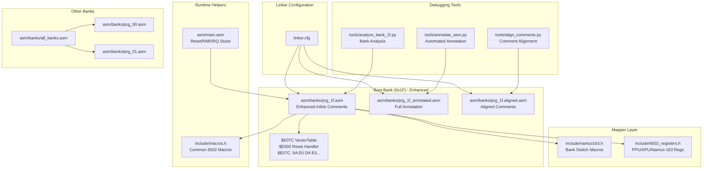
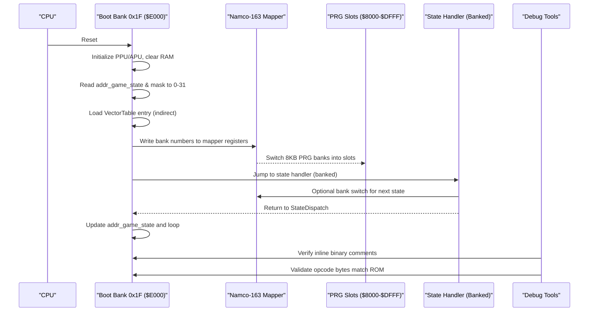
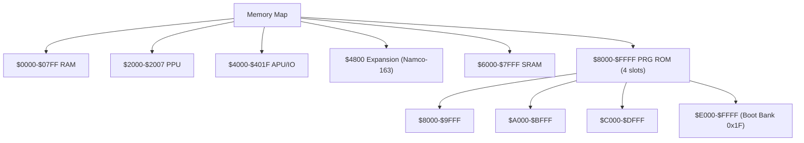
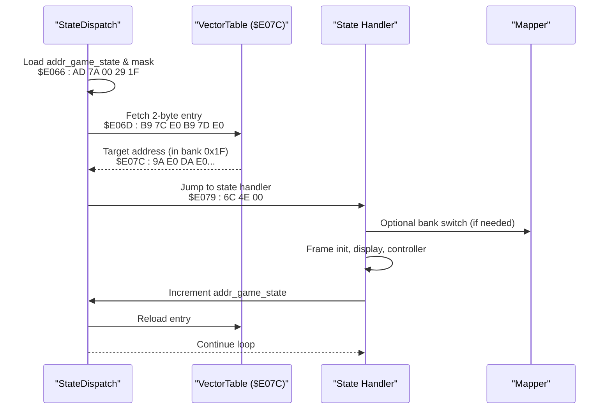
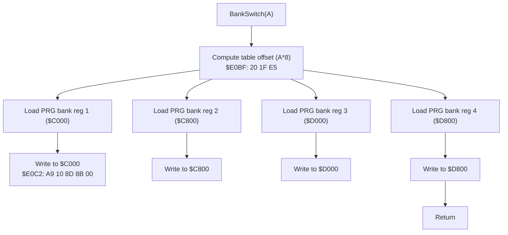
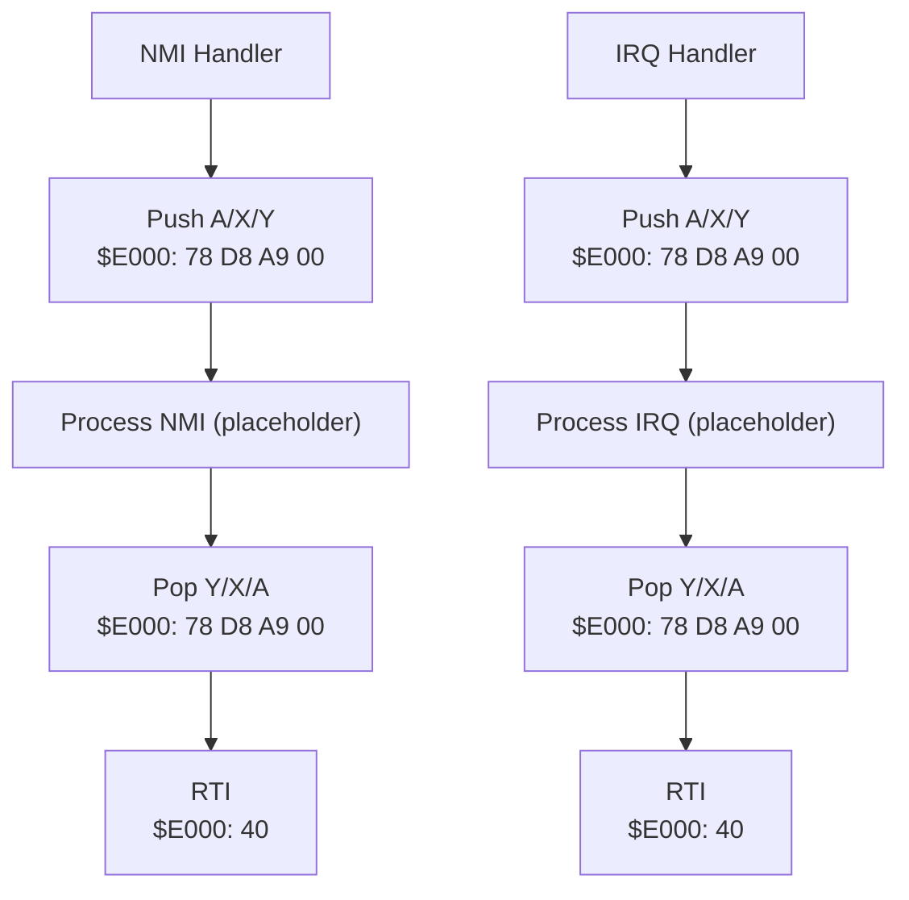
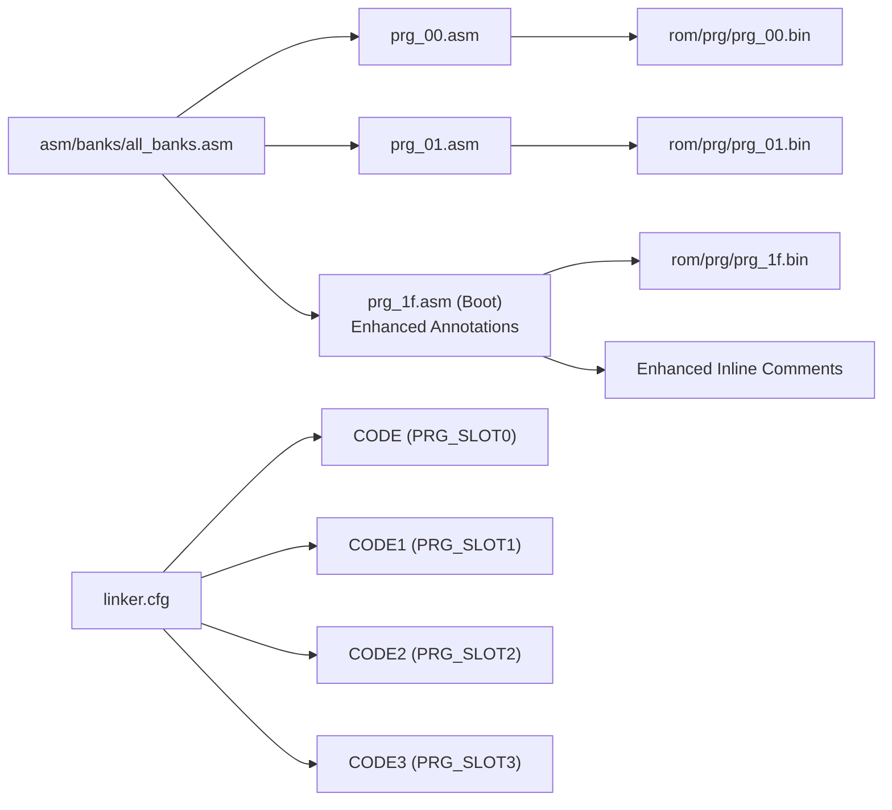
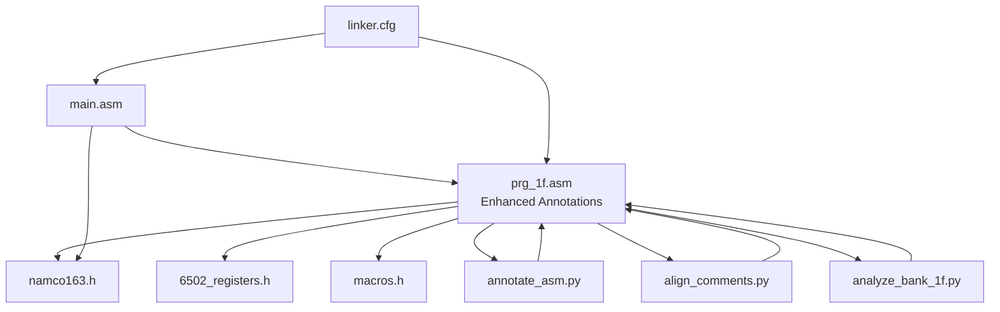

# Assembly Architecture

<cite>
**Referenced Files in This Document**
- [linker.cfg](file://linker.cfg)
- [main.asm](file://asm/main.asm)
- [prg_1f.asm](file://asm/banks/prg_1f.asm)
- [prg_1f_annotated.asm](file://asm/banks/prg_1f_annotated.asm)
- [prg_1f.aligned.asm](file://asm/banks/prg_1f.aligned.asm)
- [prg_1f.asm.bak](file://asm/banks/prg_1f.asm.bak)
- [namco163.h](file://include/namco163.h)
- [6502_registers.h](file://include/6502_registers.h)
- [macros.h](file://include/macros.h)
- [all_banks.asm](file://asm/banks/all_banks.asm)
- [prg_00.asm](file://asm/banks/prg_00.asm)
- [prg_01.asm](file://asm/banks/prg_01.asm)
- [PROJECT.md](file://PROJECT.md)
- [annotate_asm.py](file://tools/annotate_asm.py)
- [align_comments.py](file://tools/align_comments.py)
- [analyze_bank_1f.py](file://tools/analyze_bank_1f.py)
</cite>

## Update Summary
**Changes Made**
- Enhanced assembly output format with detailed inline binary code comments for improved debugging and verification
- Added comprehensive tooling for automated annotation and alignment of assembly comments
- Updated documentation to reflect the new enhanced debugging capabilities
- Documented the annotation pipeline and its benefits for ROM verification and development

## Table of Contents
1. [Introduction](#introduction)
2. [Project Structure](#project-structure)
3. [Core Components](#core-components)
4. [Architecture Overview](#architecture-overview)
5. [Detailed Component Analysis](#detailed-component-analysis)
6. [Enhanced Assembly Output Format](#enhanced-assembly-output-format)
7. [Debugging and Verification Tools](#debugging-and-verification-tools)
8. [Dependency Analysis](#dependency-analysis)
9. [Performance Considerations](#performance-considerations)
10. [Troubleshooting Guide](#troubleshooting-guide)
11. [Conclusion](#conclusion)

## Introduction
This document explains the assembly architecture for the Namco-163 (Mapper 19) implementation used in the disassembly of a classic NES strategy game. It focuses on the 32-bank structure with 8KB banks, the fixed boot bank at $E000-$FFFF, the switchable PRG slots at $8000-$DFFF, and the state machine orchestrated by the vector dispatch table at $E07C. The architecture now includes enhanced assembly output formatting with detailed inline binary code comments for superior debugging and verification support.

## Project Structure
The project is organized around a modular bank-based approach with enhanced debugging capabilities:
- A central linker configuration defines memory layout and segments.
- A main entry module provides reset/NMI/IRQ stubs and initializes the mapper.
- A dedicated boot bank (0x1F) contains the reset handler, state dispatch table, and core runtime helpers with comprehensive inline binary annotations.
- Separate bank stubs represent the remaining 31 banks, each mapped to a specific PRG slot.
- Advanced tooling provides automated annotation and verification of assembly output.

**Diagram sources**
- [linker.cfg:18-55](file://linker.cfg#L18-L55)
- [prg_1f.asm:13-148](file://asm/banks/prg_1f.asm#L13-L148)
- [prg_1f_annotated.asm:1-200](file://asm/banks/prg_1f_annotated.asm#L1-L200)
- [prg_1f.aligned.asm:1-200](file://asm/banks/prg_1f.aligned.asm#L1-L200)
- [namco163.h:65-87](file://include/namco163.h#L65-L87)
- [6502_registers.h:1-88](file://include/6502_registers.h#L1-L88)
- [macros.h:1-72](file://include/macros.h#L1-L72)
- [all_banks.asm:1-38](file://asm/banks/all_banks.asm#L1-L38)
- [prg_00.asm:1-13](file://asm/banks/prg_00.asm#L1-L13)
- [prg_01.asm:1-13](file://asm/banks/prg_01.asm#L1-L13)
- [annotate_asm.py:1-599](file://tools/annotate_asm.py#L1-L599)
- [align_comments.py:1-48](file://tools/align_comments.py#L1-L48)
- [analyze_bank_1f.py:1-157](file://tools/analyze_bank_1f.py#L1-L157)

**Section sources**
- [PROJECT.md:14-47](file://PROJECT.md#L14-L47)
- [linker.cfg:18-55](file://linker.cfg#L18-L55)
- [all_banks.asm:1-38](file://asm/banks/all_banks.asm#L1-L38)

## Core Components
- Fixed boot bank 0x1F mapped to $E000-$FFFF at startup with comprehensive inline binary annotations.
- Vector dispatch table at $E07C orchestrates game flow across execution contexts with detailed opcode verification.
- Four PRG slots ($8000-$FFFF) managed by the Namco-163 mapper via write-only registers.
- Hardware abstraction layer for PPU/APU and mapper register access.
- Modular bank stubs representing 31 additional banks.
- Enhanced debugging infrastructure with automated annotation and verification tools.

**Section sources**
- [PROJECT.md:101-117](file://PROJECT.md#L101-L117)
- [prg_1f.asm:153-169](file://asm/banks/prg_1f.asm#L153-L169)
- [prg_1f_annotated.asm:74-148](file://asm/banks/prg_1f_annotated.asm#L74-L148)
- [namco163.h:10-17](file://include/namco163.h#L10-L17)
- [6502_registers.h:6-39](file://include/6502_registers.h#L6-L39)

## Architecture Overview
The system uses a state machine driven by a vector table in the boot bank. The reset handler initializes hardware, clears RAM, and dispatches to the first state via an indirect jump. The mapper enables dynamic loading of code from other banks into PRG slots, allowing the state handlers to call bank-switched routines. The enhanced assembly output provides detailed inline binary comments for superior debugging and verification.

**Diagram sources**
- [prg_1f.asm:74-148](file://asm/banks/prg_1f.asm#L74-L148)
- [prg_1f_annotated.asm:74-148](file://asm/banks/prg_1f_annotated.asm#L74-L148)
- [prg_1f.asm:739-750](file://asm/banks/prg_1f.asm#L739-L750)
- [namco163.h:10-17](file://include/namco163.h#L10-L17)
- [main.asm:115-121](file://asm/main.asm#L115-L121)

## Detailed Component Analysis

### Memory Mapping and Segment Organization
The linker configuration defines:
- Zero-page RAM and uninitialized RAM segments.
- Four PRG slots ($8000-$FFFF) sized 8KB each.
- Segments for code and read-only data, with optional assignments for additional banks.
- The CODE segment starts at PRG_SLOT0 and includes the interrupt vectors at $9FFA.

**Diagram sources**
- [linker.cfg:4-12](file://linker.cfg#L4-L12)
- [linker.cfg:18-30](file://linker.cfg#L18-L30)
- [linker.cfg:32-54](file://linker.cfg#L32-L54)

**Section sources**
- [linker.cfg:18-55](file://linker.cfg#L18-L55)
- [PROJECT.md:70-83](file://PROJECT.md#L70-L83)

### Fixed Boot Bank 0x1F and Reset Flow
- The reset handler at $E000 performs CPU initialization, PPU warmup, APU initialization, and RAM clearing.
- It initializes the mapper and sets the initial game state, then dispatches to the state handler via the vector table.
- The vector table at $E07C contains 15 entries, each a 2-byte address within bank 0x1F, with comprehensive inline binary annotations.

**Updated** Enhanced with detailed inline binary code comments showing ROM addresses and actual opcode bytes for verification.

**Diagram sources**
- [prg_1f.asm:74-148](file://asm/banks/prg_1f.asm#L74-L148)
- [prg_1f_annotated.asm:74-148](file://asm/banks/prg_1f_annotated.asm#L74-L148)
- [prg_1f.asm:153-169](file://asm/banks/prg_1f.asm#L153-L169)
- [prg_1f.asm:739-750](file://asm/banks/prg_1f.asm#L739-L750)

**Section sources**
- [prg_1f.asm:74-148](file://asm/banks/prg_1f.asm#L74-L148)
- [prg_1f_annotated.asm:74-148](file://asm/banks/prg_1f_annotated.asm#L74-L148)
- [prg_1f.asm:153-169](file://asm/banks/prg_1f.asm#L153-L169)
- [PROJECT.md:101-117](file://PROJECT.md#L101-L117)

### State Machine and Vector Dispatch
- The game state is stored in a global RAM location and masked to 0-31 to index the vector table.
- Each state handler performs frame initialization, prepares display buffers, calls bank-switched display routines, updates state, and re-invokes the dispatcher.
- The dispatcher reloads the vector table entry and jumps to the next state.
- Enhanced inline comments provide detailed verification of opcode bytes and ROM addresses.

**Updated** Enhanced with comprehensive inline binary annotations for superior debugging and verification.

**Diagram sources**
- [prg_1f.asm:739-750](file://asm/banks/prg_1f.asm#L739-L750)
- [prg_1f_annotated.asm:739-750](file://asm/banks/prg_1f_annotated.asm#L739-L750)
- [prg_1f.asm:153-169](file://asm/banks/prg_1f.asm#L153-L169)

**Section sources**
- [prg_1f.asm:739-750](file://asm/banks/prg_1f.asm#L739-L750)
- [prg_1f_annotated.asm:739-750](file://asm/banks/prg_1f_annotated.asm#L739-L750)
- [prg_1f.asm:153-169](file://asm/banks/prg_1f.asm#L153-L169)

### Bank Switching Implementation
- The mapper exposes four write-only registers to select 8KB PRG banks for each slot.
- The project provides macros to simplify bank switching for each slot.
- A bank switching helper reads a configuration table and writes to the mapper registers for PRG slots and extended configuration.
- Enhanced inline comments provide detailed verification of bank switching operations.

**Updated** Enhanced with comprehensive inline binary annotations for bank switching verification.

**Diagram sources**
- [prg_1f.asm:785-818](file://asm/banks/prg_1f.asm#L785-L818)
- [prg_1f_annotated.asm:785-818](file://asm/banks/prg_1f_annotated.asm#L785-L818)
- [prg_1f.asm:824-828](file://asm/banks/prg_1f.asm#L824-L828)
- [namco163.h:10-17](file://include/namco163.h#L10-L17)

**Section sources**
- [namco163.h:65-87](file://include/namco163.h#L65-L87)
- [prg_1f.asm:785-818](file://asm/banks/prg_1f.asm#L785-L818)
- [prg_1f_annotated.asm:785-818](file://asm/banks/prg_1f_annotated.asm#L785-L818)
- [prg_1f.asm:824-828](file://asm/banks/prg_1f.asm#L824-L828)

### Interrupt Service Routines and Hardware Abstraction
- The main module provides minimal NMI and IRQ stubs that preserve registers and return via RTI.
- The boot bank implements PPU initialization helpers and provides macros for common operations like VBlank waits, PPU address setting, and DMA transfers.
- The mapper initialization routine sets up the initial bank configuration for the first three slots.
- Enhanced inline comments provide detailed verification of interrupt handling and hardware operations.

**Updated** Enhanced with comprehensive inline binary annotations for interrupt and hardware verification.

**Diagram sources**
- [main.asm:65-99](file://asm/main.asm#L65-L99)
- [prg_1f_annotated.asm:1040-1065](file://asm/banks/prg_1f_annotated.asm#L1040-L1065)
- [macros.h:8-12](file://include/macros.h#L8-L12)

**Section sources**
- [main.asm:65-99](file://asm/main.asm#L65-L99)
- [prg_1f_annotated.asm:1040-1065](file://asm/banks/prg_1f_annotated.asm#L1040-L1065)
- [macros.h:8-12](file://include/macros.h#L8-L12)

### Modular Assembly Approach and Bank Assignment
- The project uses a modular approach: each bank is represented by a separate assembly stub that includes the corresponding binary.
- The linker configuration assigns segments to specific PRG slots and allows optional assignment of additional banks.
- The include files centralize register definitions and macros for consistent access patterns across banks.
- Enhanced tooling provides automated annotation and verification of all bank files.

**Updated** Enhanced with comprehensive tooling for automated annotation and verification across all bank files.

**Diagram sources**
- [all_banks.asm:1-38](file://asm/banks/all_banks.asm#L1-L38)
- [prg_00.asm:1-13](file://asm/banks/prg_00.asm#L1-L13)
- [prg_01.asm:1-13](file://asm/banks/prg_01.asm#L1-L13)
- [linker.cfg:32-54](file://linker.cfg#L32-L54)

**Section sources**
- [all_banks.asm:1-38](file://asm/banks/all_banks.asm#L1-L38)
- [prg_00.asm:1-13](file://asm/banks/prg_00.asm#L1-L13)
- [prg_01.asm:1-13](file://asm/banks/prg_01.asm#L1-L13)
- [linker.cfg:32-54](file://linker.cfg#L32-L54)

## Enhanced Assembly Output Format

### Inline Binary Code Comments
The enhanced assembly output format provides comprehensive inline binary code comments that significantly improve debugging and verification capabilities:

- **ROM Address Information**: Each instruction includes its exact ROM address in the format `$XXXX`
- **Actual Opcode Bytes**: Shows the precise opcode bytes that will be executed in the final ROM
- **Verification Support**: Enables direct comparison between assembly source and compiled binary
- **Debugging Aid**: Provides immediate visibility into the actual machine code being generated

### Annotation Pipeline
The annotation pipeline consists of several sophisticated tools working together:

1. **Automatic Detection**: Tools automatically detect instruction boundaries and opcode bytes
2. **Address Verification**: Confirms that instruction addresses match the expected ROM locations
3. **Opcode Byte Matching**: Validates that generated opcode bytes correspond to the intended instructions
4. **Comment Alignment**: Ensures consistent formatting for optimal readability

### Benefits for Development
The enhanced assembly output format provides numerous benefits for developers:

- **ROM Verification**: Direct comparison between assembly and ROM binaries
- **Debugging Efficiency**: Immediate identification of instruction locations and opcodes
- **Code Analysis**: Easy examination of generated machine code for optimization
- **Educational Value**: Clear demonstration of assembly-to-machine code translation
- **Quality Assurance**: Automated validation of assembly correctness

**Section sources**
- [prg_1f_annotated.asm:74-148](file://asm/banks/prg_1f_annotated.asm#L74-L148)
- [prg_1f_annotated.asm:153-169](file://asm/banks/prg_1f_annotated.asm#L153-L169)
- [annotate_asm.py:1-599](file://tools/annotate_asm.py#L1-L599)
- [align_comments.py:1-48](file://tools/align_comments.py#L1-L48)

## Debugging and Verification Tools

### Automated Annotation Tool
The `annotate_asm.py` tool provides comprehensive automatic annotation of assembly files:

- **Binary Disassembly**: Pre-disassembles ROM binaries to identify instruction boundaries
- **Address Tracking**: Maintains accurate ROM address tracking through the entire assembly
- **Opcode Verification**: Validates that generated opcodes match expected instruction bytes
- **Section Header Resync**: Correctly handles section headers and address hints
- **Fallback Handling**: Provides address-only annotations when instruction matching fails

### Comment Alignment Tool
The `align_comments.py` tool ensures consistent formatting of inline comments:

- **Column Alignment**: Aligns comments to a consistent column (48) for optimal readability
- **Preserves Context**: Maintains original comment content while improving formatting
- **Selective Processing**: Only processes instruction lines, leaving data lines unchanged
- **Change Tracking**: Reports the number of lines processed and aligned

### Bank Analysis Tool
The `analyze_bank_1f.py` tool provides comprehensive analysis of the boot bank:

- **Vector Table Analysis**: Detailed examination of the state dispatch table
- **Bank Switching Patterns**: Identification of bank switching operations and patterns
- **Function Discovery**: Automatic detection of function boundaries and entry points
- **Utility Pattern Recognition**: Identification of common utility patterns and routines
- **Data Table Analysis**: Examination of lookup tables and data structures

### Backup and Version Control
The enhanced system maintains proper version control through:

- **Backup Generation**: Automatic creation of `.bak` files before overwriting originals
- **In-Place Editing**: Option to edit files directly with automatic backup creation
- **Verification Mode**: Optional verification that annotated assembly still assembles correctly
- **Non-Destructive Processing**: Multiple output formats for different use cases

**Section sources**
- [annotate_asm.py:1-599](file://tools/annotate_asm.py#L1-L599)
- [align_comments.py:1-48](file://tools/align_comments.py#L1-L48)
- [analyze_bank_1f.py:1-157](file://tools/analyze_bank_1f.py#L1-L157)
- [prg_1f.asm.bak:1-50](file://asm/banks/prg_1f.asm.bak#L1-L50)

## Dependency Analysis
The architecture exhibits clear separation of concerns with enhanced debugging infrastructure:
- The boot bank depends on the mapper definitions and register abstractions.
- State handlers depend on the dispatcher and bank switching helpers.
- The linker configuration ties together segments and memory regions.
- The main module coordinates initialization and provides minimal ISR stubs.
- Enhanced tooling provides automated annotation, verification, and analysis capabilities.

**Updated** Enhanced with comprehensive debugging and verification tool dependencies.

**Diagram sources**
- [prg_1f.asm:10-11](file://asm/banks/prg_1f.asm#L10-L11)
- [prg_1f_annotated.asm:10-11](file://asm/banks/prg_1f_annotated.asm#L10-L11)
- [namco163.h:10-17](file://include/namco163.h#L10-L17)
- [6502_registers.h:6-39](file://include/6502_registers.h#L6-L39)
- [macros.h:1-72](file://include/macros.h#L1-L72)
- [main.asm:6-7](file://asm/main.asm#L6-L7)
- [linker.cfg:18-55](file://linker.cfg#L18-L55)
- [annotate_asm.py:1-599](file://tools/annotate_asm.py#L1-L599)
- [align_comments.py:1-48](file://tools/align_comments.py#L1-L48)
- [analyze_bank_1f.py:1-157](file://tools/analyze_bank_1f.py#L1-L157)

**Section sources**
- [prg_1f.asm:10-11](file://asm/banks/prg_1f.asm#L10-L11)
- [prg_1f_annotated.asm:10-11](file://asm/banks/prg_1f_annotated.asm#L10-L11)
- [namco163.h:10-17](file://include/namco163.h#L10-L17)
- [6502_registers.h:6-39](file://include/6502_registers.h#L6-L39)
- [macros.h:1-72](file://include/macros.h#L1-L72)
- [main.asm:6-7](file://asm/main.asm#L6-L7)
- [linker.cfg:18-55](file://linker.cfg#L18-L55)
- [annotate_asm.py:1-599](file://tools/annotate_asm.py#L1-L599)
- [align_comments.py:1-48](file://tools/align_comments.py#L1-L48)
- [analyze_bank_1f.py:1-157](file://tools/analyze_bank_1f.py#L1-L157)

## Performance Considerations
- Bank switching involves writing to mapper registers; minimize unnecessary switches to reduce overhead.
- Use the provided macros to keep register writes compact and consistent.
- Leverage the vector dispatch to avoid frequent branching and to centralize state transitions.
- Keep PPU/APU operations synchronized with VBlank to prevent flicker and timing issues.
- **Enhanced Debugging**: The inline binary comments provide immediate visibility into performance-critical code paths.
- **Verification Overhead**: Automated annotation tools add processing time but provide significant debugging benefits.
- **Memory Usage**: Enhanced comments increase file sizes but improve development efficiency.

## Troubleshooting Guide
- If the game does not enter the intended state, verify the vector table indexing and ensure the state counter is properly masked.
- If graphics appear incorrect after a bank switch, confirm the mapper register writes and palette upload sequences.
- If interrupts are not firing, ensure PPU control bits are set correctly and that the NMI flag is cleared appropriately.
- Use the provided macros for PPU operations to avoid off-by-one address errors.
- **Enhanced Debugging**: Utilize inline binary comments to verify that instructions are located at expected ROM addresses.
- **Verification**: Use the annotation tools to validate that generated opcode bytes match expected instruction bytes.
- **Comparison**: Compare annotated assembly output with ROM binaries to identify discrepancies.
- **Backup Restoration**: Use the `.bak` files to restore original unannotated versions when needed.

**Section sources**
- [prg_1f_annotated.asm:739-750](file://asm/banks/prg_1f_annotated.asm#L739-L750)
- [prg_1f_annotated.asm:1071-1085](file://asm/banks/prg_1f_annotated.asm#L1071-L1085)
- [prg_1f_annotated.asm:1100-1113](file://asm/banks/prg_1f_annotated.asm#L1100-L1113)
- [prg_1f.asm.bak:1-50](file://asm/banks/prg_1f.asm.bak#L1-L50)

## Conclusion
The assembly architecture employs a robust, modular design centered on a fixed boot bank and a vector-driven state machine. The Namco-163 mapper enables efficient bank switching across four PRG slots, while the linker configuration and include files provide a consistent foundation for development. The enhanced assembly output format with detailed inline binary code comments significantly improves debugging and verification capabilities, providing developers with immediate visibility into ROM addresses and actual opcode bytes. The comprehensive tooling infrastructure supports automated annotation, verification, and analysis, making the development process more efficient and reliable. By following the documented patterns for bank assignment, state transitions, hardware abstraction, and utilizing the enhanced debugging tools, developers can extend the disassembly with accurate, maintainable code while benefiting from superior debugging and verification support.