# Assembly Architecture

<cite>
**Referenced Files in This Document**
- [linker.cfg](file://linker.cfg)
- [main.asm](file://asm/main.asm)
- [prg_17_18.asm](file://asm/banks/prg_17_18.asm)
- [prg_1d_1e.asm](file://asm/banks/prg_1d_1e.asm)
- [prg_0a_0b.asm](file://asm/banks/prg_0a_0b.asm)
- [prg_1f.aligned.asm](file://asm/banks/prg_1f.aligned.asm)
- [prg_1f.asm.bak](file://asm/banks/prg_1f.asm.bak)
- [namco163.h](file://include/namco163.h)
- [6502_registers.h](file://include/6502_registers.h)
- [macros.h](file://include/macros.h)
- [all_banks.asm](file://asm/banks/all_banks.asm)
- [functions.h](file://include/functions.h)
- [PROJECT.md](file://PROJECT.md)
- [assemble_prg_1d_1e.py](file://tools/assemble_prg_1d_1e.py)
- [verify_0a_0b.py](file://tools/verify_0a_0b.py)
- [analyze_b49c.py](file://tools/analyze_b49c.py)
</cite>

## Update Summary
**Changes Made**
- Major AI turn processing system refactoring with new modular functions including FindBestOfficerAssign, ProcessAllOfficers, ApplyScenarioDeductions, and bracket-based deduction systems
- Enhanced officer management algorithms with comprehensive evaluation and assignment logic
- New bracket-based resource deduction system for scenario difficulty scaling
- Improved code organization with well-documented modular functions and clear algorithm separation
- Enhanced AI pipeline with structured recruitment, transfer, and evaluation phases

## Table of Contents
1. [Introduction](#introduction)
2. [Project Structure](#project-structure)
3. [Core Components](#core-components)
4. [Architecture Overview](#architecture-overview)
5. [Detailed Component Analysis](#detailed-component-analysis)
6. [Modern Assembly Formatting Standards](#modern-assembly-formatting-standard)
7. [Enhanced Parameter Declaration System](#enhanced-parameter-declaration-system)
8. [Enhanced Code Organization](#enhanced-code-organization)
9. [Callback Table Architecture](#callback-table-architecture)
10. [SceneRenderer System Implementation](#scenerenderer-system-implementation)
11. [AI Subsystem Architecture](#ai-subsystem-architecture)
12. [Battle System Logic Enhancement](#battle-system-logic-enhancement)
13. [Debugging and Verification Tools](#debugging-and-verification-tools)
14. [Dependency Analysis](#dependency-analysis)
15. [Performance Considerations](#performance-considerations)
16. [Troubleshooting Guide](#troubleshooting-guide)
17. [Conclusion](#conclusion)

## Introduction
This document explains the assembly architecture for the Namco-163 (Mapper 19) implementation used in the disassembly of a classic NES strategy game. It focuses on the 32-bank structure with 8KB banks, the fixed boot bank at $E000-$FFFF, the switchable PRG slots at $8000-$DFFF, and the state machine orchestrated by the vector dispatch table at $E07C. The architecture now features modern assembly formatting standards with structured .proc/.endproc organization and enhanced code modularity. The PRG bank 17/18 combination provides specialized display and rendering functionality optimized for the game's strategic interface, while the new PRG bank 1D/1E combined system represents a significant architectural improvement over the previous individual bank management approach, offering unified 16KB memory space at $A000-$DFFF with integrated display operations and enhanced bank switching capabilities. The enhanced SceneRenderer system now implements a proper callback table architecture that replaces inline dispatch logic, providing improved maintainability and debugging support. **Updated** The system now features comprehensive descriptive entry point naming conventions across all combined bank systems, with meaningful names like CheckGameStart_Entry, PpuWriteRle_Entry, and PPUTileRender_Entry replacing generic EntryXX patterns, significantly improving code organization, debugging capabilities, and long-term maintainability through the adoption of a standardized naming convention system. The major refactoring of PRG bank $0A+$0B has been completed, transforming cryptic function names like B0A_CheckGameStart into descriptive names like CheckGameStart, establishing a consistent naming pattern across the entire codebase. **Major Enhancement** The AI subsystem has undergone comprehensive reorganization with consistent Ai* prefix naming pattern, improved internal control flow with labeled targets replacing raw address jumps, better loop structure with properly named loop bodies for enhanced readability and maintainability. **Latest Update** The AI turn dispatch system has been completely refactored with new modular functions including FindBestOfficerAssign, ProcessAllOfficers, ApplyScenarioDeductions, and bracket-based deduction systems, implementing enhanced officer management algorithms and improved code organization.

## Project Structure
The project is organized around a modular bank-based approach with modern assembly formatting standards:
- A central linker configuration defines memory layout and segments.
- A main entry module provides reset/NMI/IRQ stubs and initializes the mapper.
- A dedicated boot bank (0x1F) contains the reset handler, state dispatch table, and core runtime helpers in the new aligned format with comprehensive code organization.
- Separate bank stubs represent the remaining 31 banks, including the combined PRG bank 17/18 structure at $A000-$DFFF with specialized display operations and the new combined PRG bank 1D/1E system at $A000-$DFFF with unified display and domestic operations.
- Modern assembly formatting standards provide improved readability and debugging support through structured .proc/.endproc organization.
- The enhanced parameter declaration system provides structured memory addressing throughout the PRG bank 17-18 assembly.
- The new combined PRG bank 1D/1E system provides unified memory management and simplified bank switching for display and domestic operations.
- **Enhanced Callback Architecture**: The SceneRenderer system now uses proper callback tables with symbolic function names instead of inline dispatch logic.
- **Comprehensive Descriptive Entry Points**: All combined bank systems now use meaningful entry point names following the standardized naming convention, replacing generic EntryXX patterns for improved code organization and debugging support.
- **Completed Major Refactoring**: PRG bank $0A+$0B has been successfully refactored with descriptive function naming, eliminating cryptic prefixed formats.
- **Enhanced AI Subsystem**: Comprehensive function reorganization with consistent Ai* prefix pattern and improved control flow structure.
- **Latest AI Refactoring**: Complete modularization of AI turn processing system with new functions FindBestOfficerAssign, ProcessAllOfficers, ApplyScenarioDeductions, and bracket-based deduction systems.

```mermaid
graph TB
subgraph "Linker Configuration"
LCFG["linker.cfg"]
end
subgraph "Boot Bank (0x1F) - Modern Assembly Format"
ALIGNED["asm/banks/prg_1f.aligned.asm<br/>Aligned Format with Structured Organization"]
BACKUP["asm/banks/prg_1f.asm.bak<br/>Backup of Legacy Format"]
VTABLE["$E07C VectorTable<br/>$E000 Reset Handler<br/>Structured State Handlers"]
PARAMSYS["Enhanced Parameter System<br/>Named Memory Aliases"]
CALLBACKDISP["$EADE CallbackDispatcher<br/>Indirect Jump via Inline Table"]
end
subgraph "Combined Bank 0A/0B - Fully Refactored with Descriptive Names & Enhanced AI"
COMBINED0A_0B["asm/banks/prg_0a_0b.asm<br/>16KB Combined Structure<br/>$A000-$DFFF Layout"]
ENTRYPOINTS["Fully Descriptive Entry Points<br/>CheckGameStart_Entry, SubStateDispatch_Entry,<br/>ArmyValueCalc_Entry, DataRecordLookup_Entry,<br/>DistanceClamp_Entry"]
PROC[".proc/.endproc Blocks<br/>Modular Function Organization"]
JUMPTABLE["$A000-$A00E: Jump Table<br/>5 Descriptive Entry Points"]
ENDPROC[".endproc Terminators<br/>Complete Function Scope"]
REFAC["Major Refactoring Complete<br/>B0A_* → CheckGameStart, etc."]
VERIFY["verify_0a_0b.py<br/>ROM Validation Tool"]
AI_SUBSYSTEM["Enhanced AI Subsystem<br/>Ai* Prefix Pattern<br/>Improved Control Flow<br/>New Modular Functions"]
AI_FIND_OFFICER["FindBestOfficerAssign ($C50E)<br/>Best Officer Assignment Algorithm"]
AI_PROCESS_ALL["ProcessAllOfficers ($C5B9)<br/>Officer Processing Pipeline"]
AI_SCENARIO_DEDUCTIONS["ApplyScenarioDeductions ($CD68)<br/>Scenario Difficulty Scaling"]
AI_BRACKET_DEDUCT["BracketDeductGold/Army<br/>Table-Based Resource Deduction"]
AI_SEARCH_EVALUATE["OfficerSearchAndEvaluate ($C79A)<br/>Officer Recruitment Pipeline"]
AI_CATEGORY_FIND["FindBestOfficerByCategory ($C98F)<br/>Category-Based Officer Selection"]
end
subgraph "Combined Bank 17/18 - Specialized Display"
COMBINED17_18["asm/banks/prg_17_18.asm<br/>16KB Combined Structure<br/>$A000-$DFFF Layout"]
DISPLAY["$A000-$BFFF: Bank A<br/>$C000-$DFFF: Bank B"]
PPUENTRIES["Descriptive PPU Entry Points<br/>PpuWriteRle_Entry, PpuCopyRaw_Entry,<br/>PpuWriteTileOffset_Entry, DisplayScrollLoop_Entry,<br/>DisplayAndChrSetup_Entry, BattleEffects_Entry,<br/>BattleDispatch_Entry, OverlayWindow_Entry,<br/>SetupAdvisorTiles_Entry, MainGameDispatch_Entry,<br/>DomesticActionDispatch_Entry, AnimationDispatch_Entry,<br/>DomesticDisplay_Entry, DataRecordLoader_Entry"]
PROC[".proc/.endproc Blocks<br/>Modular Function Organization"]
PARAMDECL["Parameter Declarations<br/>index_value, tile_ptr_lo/hi,<br/>attr_ptr_lo/hi, overlay_data_ptr,<br/>col_counter_lo/h, current_row/max_rows"]
RLE["RLE Decompression<br/>Advanced PPU Operations"]
ENDPROC[".endproc Terminators<br/>Complete Function Scope"]
end
subgraph "Combined Bank 1D/1E - Unified Display System"
COMBINED1D_1E["asm/banks/prg_1d_1e.asm<br/>16KB Combined Structure<br/>$A000-$DFFF Layout"]
JUMPTABLE["$A000-$A047: Jump Table<br/>24 Fully Descriptive Entry Points"]
MENUENTRIES["Menu & Display Entries<br/>PPUTileRender_Entry, MenuUpdate_Entry,<br/>VRAMBufferWrite_Entry, StateHandler_Entry,<br/>MapDisplaySetup_Entry, OfficerListHandler_Entry,<br/>FlushTileBuffer_Entry, LoadScenarioData_Entry,<br/>SramInit_Entry, OfficerParamDisp_Entry,<br/>YearDisplaySetup_Entry, SlowPeriodic_Entry,<br/>ImmediateOverlay_Entry, ProvinceDataHandler_Entry,<br/>OfficerDisplay_Lookup_Entry, FastPeriodic_Entry,<br/>OfficerDisplay_Render_Entry, OfficerNameDisplay_Entry,<br/>ClearWorkBuffer_Entry, SceneRenderer_Entry,<br/>DataFormatter_Entry, MenuRenderer_Entry,<br/>BankedDataHandler_Entry, OfficerRecLookup_Entry"]
MENUDISPATCH["$A208-$A246: MenuDispatchTable<br/>32-Entry Command Dispatch ($80-$9F)"]
SCENERENDERER["$BC71-$BD91: SceneRenderer<br/>Proper Callback Table Architecture"]
DOMESTIC["$A048-$BFFF: Domestic Operations<br/>Menu Handlers, Data Processing"]
SRAM["$C000-$DFFF: SRAM Operations<br/>Save/Load, Data Storage"]
BANK1D["Bank $1D Content<br/>Jump Table, Display Ops"]
BANK1E["Bank $1E Content<br/>Domestic Affairs, SRAM"]
end
subgraph "Mapper Layer"
NAMCO["include/namco163.h<br/>Bank Switch Macros"]
REGS["include/6502_registers.h<br/>PPU/APU/Namco-163 Regs"]
end
subgraph "Runtime Helpers"
MACROS["include/macros.h<br/>Common 6502 Macros"]
MAIN["asm/main.asm<br/>Reset/NMI/IRQ Stubs"]
FUNCTIONS["include/functions.h<br/>Function Address Constants"]
end
subgraph "Other Banks"
ALLB["asm/banks/all_banks.asm"]
end
LCFG --> ALIGNED
LCFG --> COMBINED0A_0B
LCFG --> COMBINED17_18
LCFG --> COMBINED1D_1E
LCFG --> BACKUP
MAIN --> ALIGNED
ALIGNED --> VTABLE
ALIGNED --> PARAMSYS
ALIGNED --> CALLBACKDISP
ALIGNED --> NAMCO
ALIGNED --> REGS
ALIGNED --> MACROS
COMBINED0A_0B --> ENTRYPOINTS
COMBINED0A_0B --> PROC
COMBINED0A_0B --> JUMPTABLE
COMBINED0A_0B --> ENDPROC
COMBINED0A_0B --> REFAC
COMBINED0A_0B --> VERIFY
COMBINED0A_0B --> AI_SUBSYSTEM
AI_SUBSYSTEM --> AI_FIND_OFFICER
AI_SUBSYSTEM --> AI_PROCESS_ALL
AI_SUBSYSTEM --> AI_SCENARIO_DEDUCTIONS
AI_SUBSYSTEM --> AI_BRACKET_DEDUCT
AI_SUBSYSTEM --> AI_SEARCH_EVALUATE
AI_SUBSYSTEM --> AI_CATEGORY_FIND
COMBINED17_18 --> DISPLAY
COMBINED17_18 --> PPUENTRIES
COMBINED17_18 --> PROC
COMBINED17_18 --> PARAMDECL
COMBINED17_18 --> RLE
COMBINED17_18 --> ENDPROC
COMBINED1D_1E --> JUMPTABLE
COMBINED1D_1E --> MENUENTRIES
COMBINED1D_1E --> MENUDISPATCH
COMBINED1D_1E --> SCENERENDERER
COMBINED1D_1E --> DOMESTIC
COMBINED1D_1E --> SRAM
COMBINED1D_1E --> BANK1D
COMBINED1D_1E --> BANK1E
FUNCTIONS --> COMBINED0A_0B
FUNCTIONS --> COMBINED17_18
FUNCTIONS --> COMBINED1D_1E
ALLB --> COMBINED0A_0B
ALLB --> COMBINED17_18
ALLB --> COMBINED1D_1E
```

**Diagram sources**
- [linker.cfg:18-55](file://linker.cfg#L18-L55)
- [prg_0a_0b.asm:491-501](file://asm/banks/prg_0a_0b.asm#L491-L501)
- [prg_17_18.asm:192-235](file://asm/banks/prg_17_18.asm#L192-L235)
- [prg_1d_1e.asm:264-335](file://asm/banks/prg_1d_1e.asm#L264-L335)
- [prg_1f.aligned.asm:1-200](file://asm/banks/prg_1f.aligned.asm#L1-L200)
- [prg_1f.asm.bak:1-50](file://asm/banks/prg_1f.asm.bak#L1-L50)
- [namco163.h:65-87](file://include/namco163.h#L65-87)
- [6502_registers.h:1-88](file://include/6502_registers.h#L1-L88)
- [macros.h:1-72](file://include/macros.h#L1-L72)
- [all_banks.asm:1-38](file://asm/banks/all_banks.asm#L1-L38)
- [functions.h:315-335](file://include/functions.h#L315-L335)
- [functions.h:574-597](file://include/functions.h#L574-L597)
- [functions.h:739-745](file://include/functions.h#L739-L745)
- [verify_0a_0b.py:1-28](file://tools/verify_0a_0b.py#L1-L28)

**Section sources**
- [PROJECT.md:14-47](file://PROJECT.md#L14-L47)
- [linker.cfg:18-55](file://linker.cfg#L18-L55)
- [all_banks.asm:1-38](file://asm/banks/all_banks.asm#L1-L38)

## Core Components
- Fixed boot bank 0x1F mapped to $E000-$FFFF at startup with modern assembly formatting and structured code organization.
- Vector dispatch table at $E07C orchestrates game flow across execution contexts with enhanced code readability.
- Four PRG slots ($8000-$FFFF) managed by the Namco-163 mapper via write-only registers.
- Hardware abstraction layer for PPU/APU and mapper register access.
- Modular bank stubs representing 31 additional banks, including the specialized combined PRG bank 17/18 structure with structured .proc/.endproc organization and the new combined PRG bank 1D/1E system with unified display and domestic operations.
- Modern assembly formatting standards with proper label definitions and address mappings.
- Combined 16KB bank structure at $A000-$DFFF providing enhanced display and rendering capabilities with RLE decompression.
- Comprehensive function address constants defined in functions.h for both the combined bank 17/18 structure and the new combined bank 1D/1E system.
- **Enhanced Parameter System**: Structured memory addressing system with named parameter declarations throughout PRG bank 17-18 assembly.
- **Unified Bank Architecture**: The new combined PRG bank 1D/1E system provides integrated memory management and simplified bank switching for display and domestic operations.
- **New Menu Dispatch System**: The MenuUpdate procedure now features a comprehensive 32-entry MenuDispatchTable for handling menu commands $80-$9F with structured command processing.
- **Enhanced Callback Architecture**: The SceneRenderer system implements proper callback table architecture with symbolic function names, replacing inline dispatch logic for improved maintainability.
- **Comprehensive Descriptive Entry Points**: All combined bank systems now feature fully descriptive entry points following the standardized naming convention, replacing generic EntryXX patterns for superior code organization and debugging support.
- **Completed Major Refactoring**: PRG bank $0A+$0B has been successfully refactored with descriptive function naming, eliminating cryptic prefixed formats like B0A_* and B0B_*.
- **Enhanced AI Subsystem**: Comprehensive function reorganization with consistent Ai* prefix pattern, improved internal control flow with labeled targets replacing raw address jumps, better loop structure with properly named loop bodies, and enhanced battle system logic with specialized functions for army and enemy management.
- **Latest AI Refactoring**: Complete modularization with new functions FindBestOfficerAssign ($C50E), ProcessAllOfficers ($C5B9), ApplyScenarioDeductions ($CD68), BracketDeductGold/Army ($CE67/$CEDD), OfficerSearchAndEvaluate ($C79A), and FindBestOfficerByCategory ($C98F).

**Section sources**
- [PROJECT.md:101-117](file://PROJECT.md#L101-L117)
- [prg_0a_0b.asm:491-501](file://asm/banks/prg_0a_0b.asm#L491-L501)
- [prg_17_18.asm:192-235](file://asm/banks/prg_17_18.asm#L192-L235)
- [prg_1d_1e.asm:264-335](file://asm/banks/prg_1d_1e.asm#L264-L335)
- [prg_1f.aligned.asm:400-466](file://asm/banks/prg_1f.aligned.asm#L400-L466)
- [namco163.h:10-17](file://include/namco163.h#L10-L17)
- [6502_registers.h:6-39](file://include/6502_registers.h#L6-L39)
- [functions.h:315-335](file://include/functions.h#L315-L335)
- [functions.h:574-597](file://include/functions.h#L574-L597)
- [functions.h:739-745](file://include/functions.h#L739-L745)

## Architecture Overview
The system uses a state machine driven by a vector table in the boot bank. The reset handler initializes hardware, clears RAM, and dispatches to the first state via an indirect jump. The mapper enables dynamic loading of code from other banks into PRG slots, allowing the state handlers to call bank-switched routines. The modern assembly format provides enhanced code organization with structured state handlers and improved debugging support. The combined PRG bank 17/18 structure optimizes display operations for the game's strategic interface, providing specialized PPU data writers, RLE decompression capabilities, and comprehensive display operation systems with an enhanced parameter declaration system that improves code readability and maintainability. The new combined PRG bank 1D/1E system represents a significant architectural improvement over the previous individual bank management, offering unified 16KB memory space at $A000-$DFFF with integrated display operations, menu handlers, domestic affairs dispatch, and SRAM save/load functionality. The enhanced SceneRenderer system now implements proper callback table architecture with symbolic function names, providing improved maintainability and debugging support compared to the previous inline dispatch logic approach. **Updated** All combined bank systems now feature comprehensive descriptive entry point naming following the standardized naming convention with meaningful names like CheckGameStart_Entry, PpuWriteRle_Entry, and PPUTileRender_Entry replacing generic EntryXX patterns, significantly improving code organization, debugging capabilities, and long-term maintainability across the entire codebase through consistent symbolic reference patterns. The major refactoring of PRG bank $0A+$0B has been completed, establishing a consistent naming pattern where cryptic prefixed formats like B0A_CheckGameStart have been transformed into descriptive names like CheckGameStart. **Major Enhancement** The AI subsystem has undergone comprehensive reorganization with consistent Ai* prefix naming pattern (AiTurnDispatch, AiSearchPhase1, AiSearchPhase2, AiActionSelect), improved internal control flow with labeled targets replacing raw address jumps, better loop structure with properly named loop bodies (@ScanOwnedProvinces, @ScanEnemyProvinces, @InnerLoop, @FindBestLoop), and enhanced battle system logic with specialized functions for army and enemy management (@PlaceNewArmies, @PlaceNewEnemies, @InsertBattleSlot, @InsertEnemySlot). **Latest Update** The AI turn processing system has been completely refactored with new modular functions including FindBestOfficerAssign ($C50E) for best officer assignment, ProcessAllOfficers ($C5B9) for officer processing pipeline, ApplyScenarioDeductions ($CD68) for scenario difficulty scaling, and bracket-based deduction systems for resource management.

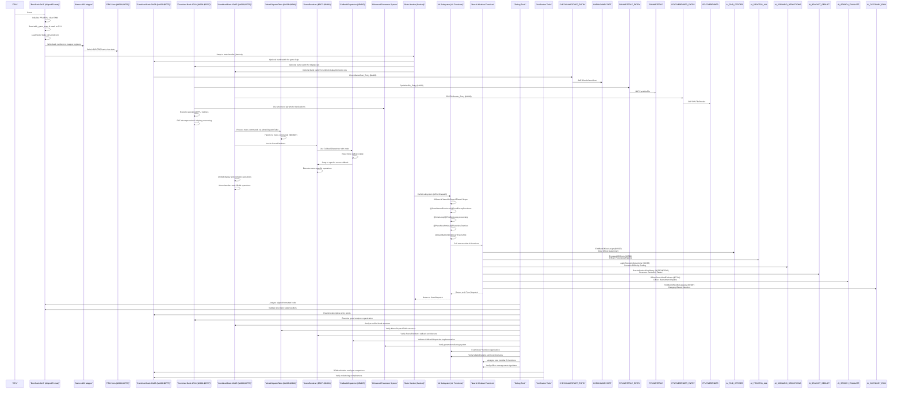

**Diagram sources**
- [prg_1f.aligned.asm:406-459](file://asm/banks/prg_1f.aligned.asm#L406-L459)
- [prg_1f.aligned.asm:467-694](file://asm/banks/prg_1f.aligned.asm#L467-L694)
- [prg_0a_0b.asm:491-501](file://asm/banks/prg_0a_0b.asm#L491-L501)
- [prg_17_18.asm:192-235](file://asm/banks/prg_17_18.asm#L192-L235)
- [prg_1d_1e.asm:264-335](file://asm/banks/prg_1d_1e.asm#L264-L335)
- [prg_1d_1e.asm:366-398](file://asm/banks/prg_1d_1e.asm#L366-L398)
- [prg_1d_1e.asm:3179-3203](file://asm/banks/prg_1d_1e.asm#L3179-L3203)
- [prg_1f.aligned.asm:1757-1785](file://asm/banks/prg_1f.aligned.asm#L1757-L1785)
- [namco163.h:10-17](file://include/namco163.h#L10-L17)
- [main.asm:115-121](file://asm/main.asm#L115-L121)
- [verify_0a_0b.py:1-28](file://tools/verify_0a_0b.py#L1-L28)

## Detailed Component Analysis

### Memory Mapping and Segment Organization
The linker configuration defines:
- Zero-page RAM and uninitialized RAM segments.
- Four PRG slots ($8000-$FFFF) sized 8KB each.
- Segments for code and read-only data, with optional assignments for additional banks.
- The CODE segment starts at PRG_SLOT0 and includes the interrupt vectors at $9FFA.
- Special handling for the combined PRG bank 17/18 structure at $A000-$DFFF with dual bank organization.
- Special handling for the new combined PRG bank 1D/1E structure at $A000-$DFFF with unified bank organization.
- Special handling for the combined PRG bank 0A/0B structure at $A000-$DFFF with enhanced entry points.

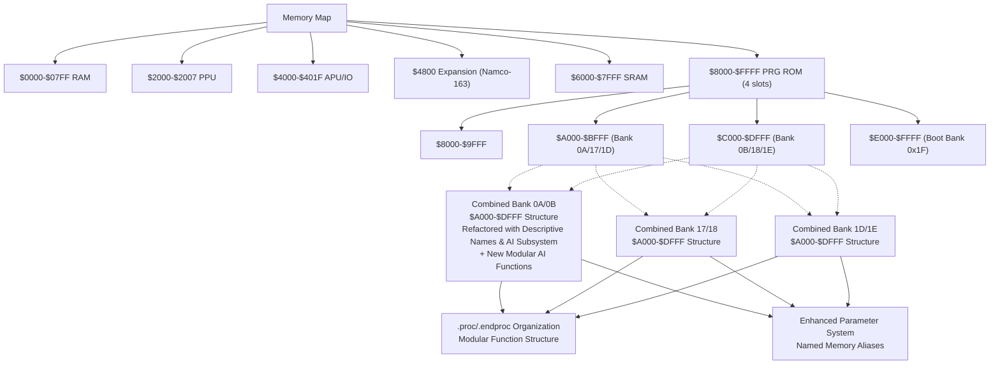

**Diagram sources**
- [linker.cfg:4-12](file://linker.cfg#L4-L12)
- [linker.cfg:18-30](file://linker.cfg#L18-L30)
- [linker.cfg:32-54](file://linker.cfg#L32-L54)
- [prg_0a_0b.asm:1-80](file://asm/banks/prg_0a_0b.asm#L1-L80)
- [prg_17_18.asm:1-80](file://asm/banks/prg_17_18.asm#L1-L80)
- [prg_1d_1e.asm:1-80](file://asm/banks/prg_1d_1e.asm#L1-L80)

**Section sources**
- [linker.cfg:18-55](file://linker.cfg#L18-55)
- [PROJECT.md:70-83](file://PROJECT.md#L70-L83)

### Fixed Boot Bank 0x1F and Reset Flow (Modern Assembly Format)
- The reset handler at $E000 performs CPU initialization, PPU warmup, APU initialization, and RAM clearing.
- It initializes the mapper and sets the initial game state, then dispatches to the state handler via the vector table.
- The vector table at $E07C contains 15 entries, each a 2-byte address within bank 0x1F, organized in a structured aligned format.

**Updated** Enhanced with modern assembly formatting standards featuring structured code organization and improved readability.

**Diagram sources**
- [prg_1f.aligned.asm:406-459](file://asm/banks/prg_1f.aligned.asm#L406-L459)
- [prg_1f.aligned.asm:460-466](file://asm/banks/prg_1f.aligned.asm#L460-L466)
- [prg_1f.aligned.asm:451-459](file://asm/banks/prg_1f.aligned.asm#L451-L459)

**Section sources**
- [prg_1f.aligned.asm:406-459](file://asm/banks/prg_1f.aligned.asm#L406-L459)
- [prg_1f.aligned.asm:460-466](file://asm/banks/prg_1f.aligned.asm#L460-L466)
- [prg_1f.aligned.asm:451-459](file://asm/banks/prg_1f.aligned.asm#L451-L459)
- [PROJECT.md:101-117](file://PROJECT.md#L101-L117)

### State Machine and Vector Dispatch (Structured Organization)
- The game state is stored in a global RAM location and masked to 0-31 to index the vector table.
- Each state handler performs frame initialization, prepares display buffers, calls bank-switched display routines, updates state, and re-invokes the dispatcher.
- The dispatcher reloads the vector table entry and jumps to the next state.
- Modern assembly formatting provides structured organization with labeled state handlers for improved readability.

**Updated** Enhanced with modern assembly formatting standards featuring structured state handler organization and improved debugging support.

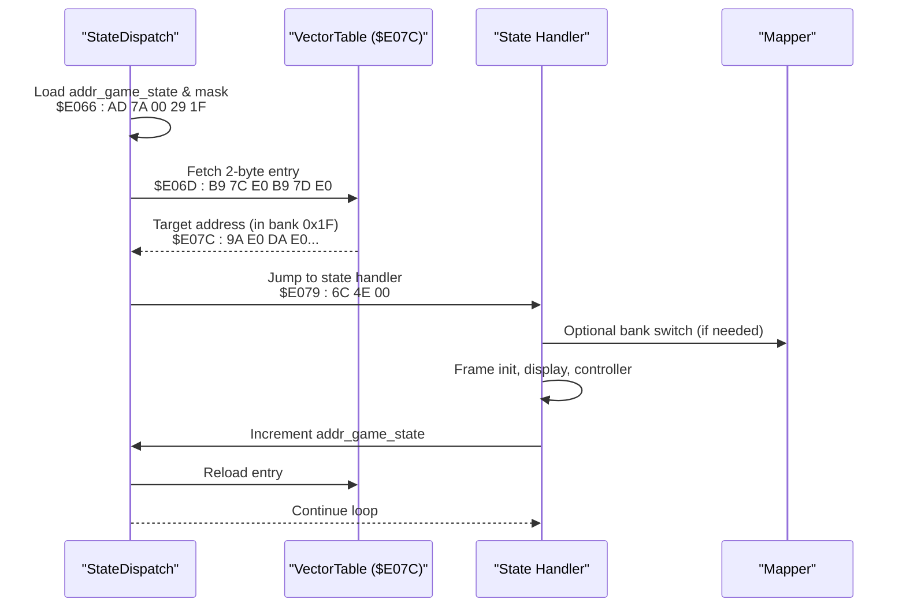

**Diagram sources**
- [prg_1f.aligned.asm:451-459](file://asm/banks/prg_1f.aligned.asm#L451-L459)
- [prg_1f.aligned.asm:467-694](file://asm/banks/prg_1f.aligned.asm#L467-L694)
- [prg_1f.aligned.asm:460-466](file://asm/banks/prg_1f.aligned.asm#L460-L466)

**Section sources**
- [prg_1f.aligned.asm:451-459](file://asm/banks/prg_1f.aligned.asm#L451-L459)
- [prg_1f.aligned.asm:467-694](file://asm/banks/prg_1f.aligned.asm#L467-L694)
- [prg_1f.aligned.asm:460-466](file://asm/banks/prg_1f.aligned.asm#L460-L466)

### Combined PRG Bank 0A/0B Structure with Fully Refactored Descriptive Entry Points and Enhanced AI Subsystem
- The PRG bank 0A/0B structure provides a combined 16KB memory space at $A000-$DFFF, with bank $0A at $A000-$BFFF and bank $0B at $C000-$DFFF.
- **Major Refactoring Completed**: Successfully transformed from cryptic prefixed format (B0A_CheckGameStart, B0B_SubStateDispatch) to descriptive names (CheckGameStart, SubStateDispatch).
- **Comprehensive Descriptive Entry Points**: Features fully descriptive entry points following the standardized naming convention like CheckGameStart_Entry, SubStateDispatch_Entry, ArmyValueCalc_Entry, DataRecordLookup_Entry, and DistanceClamp_Entry replacing generic EntryXX patterns.
- The bank supports public entry points for game logic functions including game start checking, sub-state dispatch, army value calculations, data record lookups, and distance clamping.
- **Enhanced AI Subsystem**: Comprehensive function reorganization with consistent Ai* prefix pattern (AiTurnDispatch, AiSearchPhase1, AiSearchPhase2, AiActionSelect, AiFindStrongestAdjacent, AiCountActiveKingdoms, AiSwapProvinceOwner, AiFindProvinceByOwner, AiDomesticAction, AiRandomCheck, AiEndTurn, AiScanMaxResource, AiRecruitAction, AiFindBestProvince, AiTurnLoop, AiEvaluateProvince, AiIncrementTurn, AiApplyDomesticChanges).
- **Improved Internal Control Flow**: Labeled targets replacing raw address jumps throughout the AI subsystem (@exit_to_turn, @end_turn_process, @apply_domestic_b, @check_kingdom_count).
- **Better Loop Structure**: Properly named loop bodies (@ScanOwnedProvinces, @ScanEnemyProvinces, @InnerLoop, @FindBestLoop, @FindBestSlot, @CountOwnedLoop, @FindStrongestLoop, @FindBestSubCharacter).
- **Enhanced Battle System Logic**: Specialized functions for army and enemy management (@PlaceNewArmies, @PlaceNewEnemies, @InsertBattleSlot, @InsertEnemySlot, @FindBestTarget).
- **Latest AI Refactoring**: Complete modularization with new functions including FindBestOfficerAssign ($C50E) for best officer assignment, ProcessAllOfficers ($C5B9) for officer processing pipeline, ApplyScenarioDeductions ($CD68) for scenario difficulty scaling, BracketDeductGold/Army ($CE67/$CEDD) for table-based resource deduction, OfficerSearchAndEvaluate ($C79A) for officer recruitment pipeline, and FindBestOfficerByCategory ($C98F) for category-based officer selection.
- Bank switching for this combined structure uses standard bank switching routines to load both banks simultaneously.
- Modern .proc/.endproc organization provides modular function structure with clear scope boundaries and improved code maintainability.
- **Enhanced Parameter System**: Structured memory addressing system with comprehensive parameter declarations throughout the assembly.
- **Verification Tool Integration**: New verify_0a_0b.py tool ensures byte-for-byte accuracy against original ROM.

**Updated** Major enhancement with completed refactoring from cryptic prefixed format to descriptive names, fully descriptive entry points following the standardized naming convention replacing generic EntryXX patterns, comprehensive AI subsystem reorganization with Ai* prefix pattern, improved control flow with labeled targets, better loop structure with named loop bodies, enhanced battle system logic with specialized army/enemy management functions, latest AI refactoring with new modular functions including officer management algorithms and bracket-based deduction systems, and verification tool integration for maintaining ROM accuracy.

```mermaid
flowchart TD
COMBINED0A_0B["Combined Bank 0A/0B ($A000-$DFFF)<br/>Major Refactoring Complete + Enhanced AI Subsystem<br/>+ Latest AI Modular Functions"] --> BANKA["$A000-$BFFF<br/>Bank $0A"]
COMBINED0A_0B --> BANKB["$C000-$DFFF<br/>Bank $0B"]
BANKA --> REFACTORED["Refactored Functions<br/>CheckGameStart, SubStateDispatch,<br/>ArmyValueCalc, DataRecordLookup,<br/>DistanceClamp"]
BANKA --> ENHANCEDENTRIES["Descriptive Entry Points<br/>CheckGameStart_Entry, SubStateDispatch_Entry,<br/>ArmyValueCalc_Entry, DataRecordLookup_Entry,<br/>DistanceClamp_Entry"]
BANKA --> GAMELOGIC["Game Logic Functions<br/>Province Search, Sum Compare,<br/>Tile Render, Army Value Calc"]
BANKB --> DATAOPS["Data Operations<br/>Record Lookup, Distance Clamp,<br/>Stack Management"]
BANKA --> AI_SUBSYSTEM["Enhanced AI Subsystem<br/>Ai* Prefix Pattern<br/>Improved Control Flow<br/>+ New Modular Functions"]
AI_SUBSYSTEM --> AI_TURN["AiTurnDispatch<br/>Main AI Turn Entry"]
AI_SUBSYSTEM --> AI_SEARCH1["AiSearchPhase1<br/>Province Search Phase 1"]
AI_SUBSYSTEM --> AI_SEARCH2["AiSearchPhase2<br/>Province Search Phase 2"]
AI_SUBSYSTEM --> AI_ACTION["AiActionSelect<br/>Action Selection Logic"]
AI_SUBSYSTEM --> AI_FIND_STRONGEST["AiFindStrongestAdjacent<br/>Find Strongest Adjacent Province"]
AI_SUBSYSTEM --> AI_COUNT_KINGDOMS["AiCountActiveKingdoms<br/>Count Active Kingdoms"]
AI_SUBSYSTEM --> AI_SWAP_OWNER["AiSwapProvinceOwner<br/>Swap Province Ownership"]
AI_SUBSYSTEM --> AI_FIND_PROVINCE["AiFindProvinceByOwner<br/>Find Province by Owner"]
AI_SUBSYSTEM --> AI_DOMESTIC["AiDomesticAction<br/>Three-Phase Domestic Action System"]
AI_SUBSYSTEM --> AI_RANDOM_CHECK["AiRandomCheck<br/>Random Number Generation"]
AI_SUBSYSTEM --> AI_END_TURN["AiEndTurn<br/>End Turn Processing"]
AI_SUBSYSTEM --> AI_SCAN_RESOURCE["AiScanMaxResource<br/>Scan Maximum Resources"]
AI_SUBSYSTEM --> AI_RECRUIT["AiRecruitAction<br/>Recruitment Action"]
AI_SUBSYSTEM --> AI_FIND_BEST["AiFindBestProvince<br/>Find Best Province"]
AI_SUBSYSTEM --> AI_TURN_LOOP["AiTurnLoop<br/>Main Turn Loop"]
AI_SUBSYSTEM --> AI_EVALUATE["AiEvaluateProvince<br/>Evaluate Province Value"]
AI_SUBSYSTEM --> AI_INCREMENT["AiIncrementTurn<br/>Increment Turn Counter"]
AI_SUBSYSTEM --> AI_APPLY["AiApplyDomesticChanges<br/>Apply Domestic Changes"]
AI_SUBSYSTEM --> AI_FIND_OFFICER["FindBestOfficerAssign ($C50E)<br/>Best Officer Assignment Algorithm"]
AI_SUBSYSTEM --> AI_PROCESS_ALL["ProcessAllOfficers ($C5B9)<br/>Officer Processing Pipeline"]
AI_SUBSYSTEM --> AI_SCENARIO_DEDUCTIONS["ApplyScenarioDeductions ($CD68)<br/>Scenario Difficulty Scaling"]
AI_SUBSYSTEM --> AI_BRACKET_DEDUCT["BracketDeductGold/Army ($CE67/$CEDD)<br/>Table-Based Resource Deduction"]
AI_SUBSYSTEM --> AI_SEARCH_EVALUATE["OfficerSearchAndEvaluate ($C79A)<br/>Officer Recruitment Pipeline"]
AI_SUBSYSTEM --> AI_CATEGORY_FIND["FindBestOfficerByCategory ($C98F)<br/>Category-Based Officer Selection"]
BANKA --> PROC[".proc/.endproc<br/>Modular Organization"]
BANKB --> PROC
PARAMSYS["Enhanced Parameter System<br/>Structured Memory Addressing"]
PROC --> PARAMSYS
PARAMSYS --> CHECKGAMESTART["CheckGameStart<br/>$A00F"]
PARAMSYS --> SUBSTATEDISPATCH["SubStateDispatch<br/>$A017"]
PARAMSYS --> ARMYVALUECALC["ArmyValueCalc<br/>$A03F"]
PARAMSYS --> DATARECORDLOOKUP["DataRecordLookup<br/>$A07C"]
PARAMSYS --> DISTANCECLAMP["DistanceClamp<br/>$A00C"]
ENHANCEDENTRIES --> ROUTINES["Descriptive Entry Points<br/>$A000-$A00E"]
ROUTINES --> GAMELOGIC
ROUTINES --> DATAOPS
ROUTINES --> AI_SUBSYSTEM
AI_SUBSYSTEM --> LABELED_TARGETS["Labeled Targets<br/>@exit_to_turn, @end_turn_process,<br/>@apply_domestic_b, @check_kingdom_count"]
AI_SUBSYSTEM --> NAMED_LOOPS["@ScanOwnedProvinces, @ScanEnemyProvinces,<br/>@InnerLoop, @FindBestLoop,<br/>@FindBestSlot, @CountOwnedLoop,<br/>@FindStrongestLoop, @FindBestSubCharacter"]
AI_SUBSYSTEM --> BATTLE_FUNCTIONS["@PlaceNewArmies, @PlaceNewEnemies,<br/>@InsertBattleSlot, @InsertEnemySlot,<br/>@FindBestTarget"]
AI_FIND_OFFICER --> OFFICER_ASSIGNMENT["Officer Assignment:<br/>Entity scanning, scoring,<br/>source/target list management"]
AI_PROCESS_ALL --> OFFICER_PIPELINE["Officer Pipeline:<br/>Per-entity evaluation,<br/>kingdom assignment attempts"]
AI_SCENARIO_DEDUCTIONS --> DIFFICULTY_SCALING["Difficulty Scaling:<br/>Multiplier calculation,<br/>resource field adjustments"]
AI_BRACKET_DEDUCT --> TABLE_BASED_DEDUCTION["Table-Based Deduction:<br/>Threshold bracket lookup,<br/>multiplied result subtraction"]
AI_SEARCH_EVALUATE --> RECRUITMENT_PIPELINE["Recruitment Pipeline:<br/>Entity scanning, eligibility checks,<br/>slot filling and validation"]
AI_CATEGORY_FIND --> CATEGORY_SELECTION["Category Selection:<br/>Officer scanning, score evaluation,<br/>priority slot swapping"]
VERIFY["verify_0a_0b.py<br/>ROM Validation"] --> COMBINED0A_0B
REFAC["B0A_* → CheckGameStart<br/>B0B_* → SubStateDispatch"] --> REFACTORED
```

**Diagram sources**
- [prg_0a_0b.asm:491-501](file://asm/banks/prg_0a_0b.asm#L491-L501)
- [prg_0a_0b.asm:506-532](file://asm/banks/prg_0a_0b.asm#L506-L532)
- [prg_0a_0b.asm:537-624](file://asm/banks/prg_0a_0b.asm#L537-L624)
- [prg_0a_0b.asm:3494-3700](file://asm/banks/prg_0a_0b.asm#L3494-L3700)
- [prg_0a_0b.asm:2050-2249](file://asm/banks/prg_0a_0b.asm#L2050-L2249)
- [prg_0a_0b.asm:4158-4357](file://asm/banks/prg_0a_0b.asm#L4158-L4357)
- [prg_0a_0b.asm:4472-4671](file://asm/banks/prg_0a_0b.asm#L4472-L4671)
- [prg_0a_0b.asm:4726-4925](file://asm/banks/prg_0a_0b.asm#L4726-L4925)
- [prg_0a_0b.asm:3972-4171](file://asm/banks/prg_0a_0b.asm#L3972-L4171)
- [prg_0a_0b.asm:5830-6029](file://asm/banks/prg_0a_0b.asm#L5830-L6029)
- [prg_0a_0b.asm:6228-6500](file://asm/banks/prg_0a_0b.asm#L6228-L6500)
- [prg_0a_0b.asm:6643-6842](file://asm/banks/prg_0a_0b.asm#L6643-L6842)
- [prg_0a_0b.asm:7165-7400](file://asm/banks/prg_0a_0b.asm#L7165-L7400)
- [prg_0a_0b.asm:7398-7597](file://asm/banks/prg_0a_0b.asm#L7398-L7597)
- [functions.h:739-745](file://include/functions.h#L739-L745)
- [verify_0a_0b.py:1-28](file://tools/verify_0a_0b.py#L1-L28)
- [analyze_b49c.py:19-37](file://tools/analyze_b49c.py#L19-37)

**Section sources**
- [prg_0a_0b.asm:1-80](file://asm/banks/prg_0a_0b.asm#L1-L80)
- [prg_0a_0b.asm:491-501](file://asm/banks/prg_0a_0b.asm#L491-L501)
- [prg_0a_0b.asm:506-532](file://asm/banks/prg_0a_0b.asm#L506-L532)
- [prg_0a_0b.asm:537-624](file://asm/banks/prg_0a_0b.asm#L537-L624)
- [prg_0a_0b.asm:3494-3700](file://asm/banks/prg_0a_0b.asm#L3494-L3700)
- [prg_0a_0b.asm:2050-2249](file://asm/banks/prg_0a_0b.asm#L2050-L2249)
- [prg_0a_0b.asm:4158-4357](file://asm/banks/prg_0a_0b.asm#L4158-L4357)
- [prg_0a_0b.asm:4472-4671](file://asm/banks/prg_0a_0b.asm#L4472-L4671)
- [prg_0a_0b.asm:4726-4925](file://asm/banks/prg_0a_0b.asm#L4726-L4925)
- [prg_0a_0b.asm:3972-4171](file://asm/banks/prg_0a_0b.asm#L3972-L4171)
- [prg_0a_0b.asm:5830-6029](file://asm/banks/prg_0a_0b.asm#L5830-L6029)
- [prg_0a_0b.asm:6228-6500](file://asm/banks/prg_0a_0b.asm#L6228-L6500)
- [prg_0a_0b.asm:6643-6842](file://asm/banks/prg_0a_0b.asm#L6643-L6842)
- [prg_0a_0b.asm:7165-7400](file://asm/banks/prg_0a_0b.asm#L7165-L7400)
- [prg_0a_0b.asm:7398-7597](file://asm/banks/prg_0a_0b.asm#L7398-L7597)
- [functions.h:739-745](file://include/functions.h#L739-L745)
- [verify_0a_0b.py:1-28](file://tools/verify_0a_0b.py#L1-L28)
- [analyze_b49c.py:19-37](file://tools/analyze_b49c.py#L19-37)

### Combined PRG Bank 17/18 Structure and Enhanced Display Operations
- The PRG bank 17/18 structure provides a combined 16KB memory space at $A000-$DFFF, with bank $17 at $A000-$BFFF and bank $18 at $C000-$DFFF.
- **Comprehensive Descriptive Entry Points**: Features fully descriptive entry points following the standardized naming convention like PpuWriteRle_Entry, PpuCopyRaw_Entry, PpuWriteTileOffset_Entry, DisplayScrollLoop_Entry, DisplayAndChrSetup_Entry, BattleEffects_Entry, BattleDispatch_Entry, OverlayWindow_Entry, SetupAdvisorTiles_Entry, MainGameDispatch_Entry, DomesticActionDispatch_Entry, AnimationDispatch_Entry, DomesticDisplay_Entry, and DataRecordLoader_Entry replacing generic EntryXX patterns.
- This structure enables efficient display operations and specialized PPU data handling routines with comprehensive function organization.
- The bank supports public entry points for display functions including RLE compression, raw data copying, tile offset calculations, and advanced display operations.
- Bank switching for this combined structure uses the SwitchBankAC_A/B routine with Y=$37 to load both banks simultaneously.
- Modern .proc/.endproc organization provides modular function structure with clear scope boundaries and improved code maintainability.
- **Enhanced Parameter System**: Structured memory addressing system with comprehensive parameter declarations throughout the assembly.

**Updated** Enhanced with comprehensive coverage of the new combined bank structure, its specialized display capabilities, modernized code organization, fully descriptive entry points following the standardized naming convention replacing generic EntryXX patterns, and the enhanced parameter declaration system.

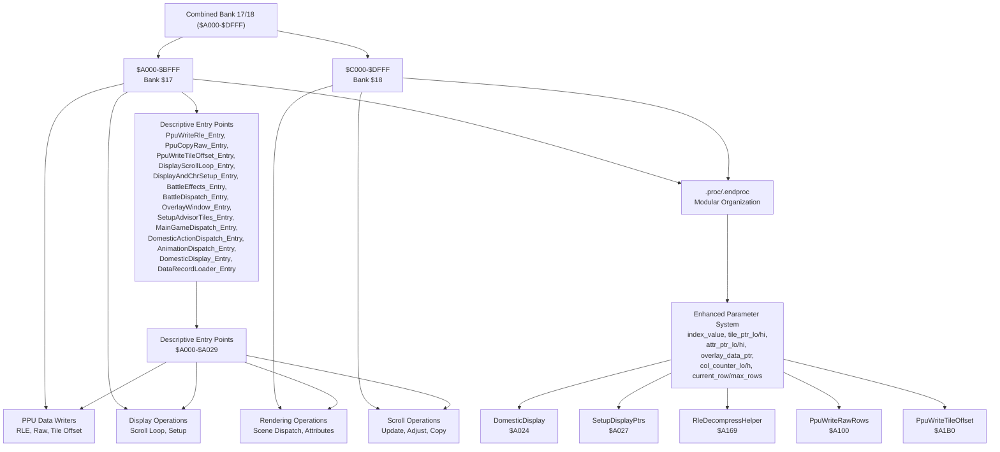

**Diagram sources**
- [prg_17_18.asm:192-235](file://asm/banks/prg_17_18.asm#L192-L235)
- [prg_17_18.asm:240-257](file://asm/banks/prg_17_18.asm#L240-L257)
- [prg_17_18.asm:263-288](file://asm/banks/prg_17_18.asm#L263-L288)
- [prg_17_18.asm:296-336](file://asm/banks/prg_17_18.asm#L296-L336)
- [prg_17_18.asm:359-432](file://asm/banks/prg_17_18.asm#L359-L432)
- [prg_17_18.asm:596-675](file://asm/banks/prg_17_18.asm#L596-L675)
- [functions.h:322-335](file://include/functions.h#L322-L335)

**Section sources**
- [prg_17_18.asm:1-80](file://asm/banks/prg_17_18.asm#L1-L80)
- [prg_17_18.asm:192-235](file://asm/banks/prg_17_18.asm#L192-L235)
- [prg_17_18.asm:240-257](file://asm/banks/prg_17_18.asm#L240-L257)
- [prg_17_18.asm:263-288](file://asm/banks/prg_17_18.asm#L263-L288)
- [prg_17_18.asm:296-336](file://asm/banks/prg_17_18.asm#L296-L336)
- [prg_17_18.asm:359-432](file://asm/banks/prg_17_18.asm#L359-L432)
- [prg_17_18.asm:596-675](file://asm/banks/prg_17_18.asm#L596-L675)
- [functions.h:322-335](file://include/functions.h#L322-L335)

### Combined PRG Bank 1D/1E Structure and Unified Display System
- The PRG bank 1D/1E structure provides a unified 16KB memory space at $A000-$DFFF, combining the functionality of previously separate bank $1D and bank $1E.
- **Comprehensive Descriptive Entry Points**: Features fully descriptive entry points following the standardized naming convention including PPUTileRender_Entry, MenuUpdate_Entry, VRAMBufferWrite_Entry, StateHandler_Entry, MapDisplaySetup_Entry, OfficerListHandler_Entry, FlushTileBuffer_Entry, LoadScenarioData_Entry, SramInit_Entry, OfficerParamDisp_Entry, YearDisplaySetup_Entry, SlowPeriodic_Entry, ImmediateOverlay_Entry, ProvinceDataHandler_Entry, OfficerDisplay_Lookup_Entry, FastPeriodic_Entry, OfficerDisplay_Render_Entry, OfficerNameDisplay_Entry, ClearWorkBuffer_Entry, SceneRenderer_Entry, DataFormatter_Entry, MenuRenderer_Entry, BankedDataHandler_Entry, and OfficerRecLookup_Entry replacing generic EntryXX patterns.
- This structure offers significant architectural improvement over individual bank management with integrated display operations, menu handlers, domestic affairs dispatch, and SRAM save/load functionality.
- The bank $1D portion ($A000-$BFFF) contains a 24-entry jump table at $A000-$A047, display operations, tile data, and menu handlers.
- The bank $1E portion ($C000-$DFFF) contains domestic affairs dispatch, tile data, and SRAM save/load operations.
- Bank switching for this combined structure uses the standard bank switching routine to load both banks simultaneously into the $A000-$DFFF range.
- The unified approach simplifies memory management and provides seamless integration between display and domestic operations.
- Modern .proc/.endproc organization provides modular function structure with clear scope boundaries and improved code maintainability.

**Updated** Comprehensive documentation of the new combined PRG bank 1D/1E system that represents a significant architectural improvement over the previous individual bank management approach, featuring fully descriptive entry points following the standardized naming convention replacing generic EntryXX patterns throughout.

```mermaid
flowchart TD
COMBINED1D_1E["Combined Bank 1D/1E ($A000-$DFFF)"] --> ENHANCEDENTRIES["Descriptive Entry Points<br/>PPUTileRender_Entry, MenuUpdate_Entry,<br/>VRAMBufferWrite_Entry, StateHandler_Entry,<br/>MapDisplaySetup_Entry, OfficerListHandler_Entry,<br/>FlushTileBuffer_Entry, LoadScenarioData_Entry,<br/>SramInit_Entry, OfficerParamDisp_Entry,<br/>YearDisplaySetup_Entry, SlowPeriodic_Entry,<br/>ImmediateOverlay_Entry, ProvinceDataHandler_Entry,<br/>OfficerDisplay_Lookup_Entry, FastPeriodic_Entry,<br/>OfficerDisplay_Render_Entry, OfficerNameDisplay_Entry,<br/>ClearWorkBuffer_Entry, SceneRenderer_Entry,<br/>DataFormatter_Entry, MenuRenderer_Entry,<br/>BankedDataHandler_Entry, OfficerRecLookup_Entry"]
COMBINED1D_1E --> JUMPTABLE["$A000-$A047<br/>24-Entry Jump Table"]
COMBINED1D_1E --> MENUDISPATCH["$A208-$A246<br/>32-Entry MenuDispatchTable"]
COMBINED1D_1E --> SCENERENDERER["$BC71-$BD91<br/>SceneRenderer with Callback Table"]
COMBINED1D_1E --> DOMESTIC["$A048-$BFFF<br/>Bank $1D Content"]
COMBINED1D_1E --> SRAM["$C000-$DFFF<br/>Bank $1E Content"]
ENHANCEDENTRIES --> ENTRY00["Entry00: PPUTileRender<br/>$A000"]
ENHANCEDENTRIES --> ENTRY01["Entry01: MenuUpdate<br/>$A003"]
ENHANCEDENTRIES --> ENTRY02["Entry02: VRAMBufferWrite<br/>$A006"]
ENHANCEDENTRIES --> ENTRY03["Entry03: StateHandler<br/>$A009"]
ENHANCEDENTRIES --> ENTRY04["Entry04: MapDisplaySetup<br/>$A00C"]
ENHANCEDENTRIES --> ENTRY05["Entry05: OfficerListHandler<br/>$A00F"]
ENHANCEDENTRIES --> ENTRY06["Entry06: FlushTileBuffer<br/>$A012"]
ENHANCEDENTRIES --> ENTRY07["Entry07: LoadScenarioData<br/>$A015"]
ENHANCEDENTRIES --> ENTRY08["Entry08: SramInit<br/>$A018"]
ENHANCEDENTRIES --> ENTRY09["Entry09: OfficerParamDisp<br/>$A01B"]
ENHANCEDENTRIES --> ENTRY10["Entry10: YearDisplaySetup<br/>$A01E"]
ENHANCEDENTRIES --> ENTRY11["Entry11: SlowPeriodic<br/>$A021"]
ENHANCEDENTRIES --> ENTRY12["Entry12: ImmediateOverlay<br/>$A024"]
ENHANCEDENTRIES --> ENTRY13["Entry13: ProvinceDataHandler<br/>$A027"]
ENHANCEDENTRIES --> ENTRY14["Entry14: OfficerDisplay_Lookup<br/>$A02A"]
ENHANCEDENTRIES --> ENTRY15["Entry15: FastPeriodic<br/>$A02D"]
ENHANCEDENTRIES --> ENTRY16["Entry16: OfficerDisplay_Render<br/>$A030"]
ENHANCEDENTRIES --> ENTRY17["Entry17: OfficerNameDisplay<br/>$A033"]
ENHANCEDENTRIES --> ENTRY18["Entry18: ClearWorkBuffer<br/>$A036"]
ENHANCEDENTRIES --> ENTRY19["Entry19: SceneRenderer<br/>$A039"]
ENHANCEDENTRIES --> ENTRY20["Entry20: DataFormatter<br/>$A03C"]
ENHANCEDENTRIES --> ENTRY21["Entry21: MenuRenderer<br/>$A03F"]
ENHANCEDENTRIES --> ENTRY22["Entry22: BankedDataHandler<br/>$A042"]
ENHANCEDENTRIES --> ENTRY23["Entry23: OfficerRecLookup<br/>$A045"]
MENUDISPATCH --> CMD80["CmdEndMenu<br/>Command $80"]
MENUDISPATCH --> CMD81["CmdAdvanceRow<br/>Command $81"]
MENUDISPATCH --> CMD82["CmdPushPosition<br/>Command $82"]
MENUDISPATCH --> CMD83["CmdPopPosition<br/>Command $83"]
MENUDISPATCH --> CMD84["CmdSetOverlayMode<br/>Command $84"]
MENUDISPATCH --> CMD85["CmdClearOverlayMode<br/>Command $85"]
MENUDISPATCH --> CMD86["CmdSetVramPos<br/>Command $86"]
MENUDISPATCH --> CMD87["CmdEnableIndirect<br/>Command $87"]
MENUDISPATCH --> CMD88["CmdDisableIndirect<br/>Command $88"]
MENUDISPATCH --> CMD89["CmdSetTileOffset<br/>Command $89"]
MENUDISPATCH --> CMD90["CmdDrawName<br/>Commands $90-$97"]
MENUDISPATCH --> CMD98["CmdDrawNumber<br/>Commands $98-$9B"]
MENUDISPATCH --> CMD9C["CmdDrawNameFromData<br/>Command $9C"]
MENUDISPATCH --> CMD9D["CmdDrawNameFixed7<br/>Command $9D"]
MENUDISPATCH --> CMD9E["CmdDrawFormattedNumber<br/>Command $9E"]
MENUDISPATCH --> CMD9F["CmdDrawNameFromParam<br/>Command $9F"]
SCENERENDERER --> SCENECALLBACKS["Scene Renderer Callbacks<br/>6 Entries with Symbolic Names"]
DOMESTIC --> MENUDISPLAY["Menu Display Ops<br/>Input Processing, Tile Buffering"]
DOMESTIC --> DATAOPS["Data Operations<br/>Menu Data Ptr, Tile Byte Store"]
DOMESTIC --> CALLBACKS["Callback Dispatchers<br/>B1F_CallbackDispatcher"]
SRAM --> SAVELOAD["SRAM Save/Load<br/>Battery Backed Data"]
SRAM --> DATASTORE["Data Storage<br/>Kingdom Records, Player Data"]
```

**Diagram sources**
- [prg_1d_1e.asm:264-335](file://asm/banks/prg_1d_1e.asm#L264-335)
- [prg_1d_1e.asm:342-438](file://asm/banks/prg_1d_1e.asm#L342-L438)
- [prg_1d_1e.asm:475-612](file://asm/banks/prg_1d_1e.asm#L475-L612)
- [prg_1d_1e.asm:366-398](file://asm/banks/prg_1d_1e.asm#L366-L398)
- [prg_1d_1e.asm:3179-3203](file://asm/banks/prg_1d_1e.asm#L3179-L3203)
- [functions.h:574-597](file://include/functions.h#L574-L597)

**Section sources**
- [prg_1d_1e.asm:1-80](file://asm/banks/prg_1d_1e.asm#L1-L80)
- [prg_1d_1e.asm:264-335](file://asm/banks/prg_1d_1e.asm#L264-L335)
- [prg_1d_1e.asm:342-438](file://asm/banks/prg_1d_1e.asm#L342-L438)
- [prg_1d_1e.asm:475-612](file://asm/banks/prg_1d_1e.asm#L475-L612)
- [prg_1d_1e.asm:366-398](file://asm/banks/prg_1d_1e.asm#L366-L398)
- [prg_1d_1e.asm:3179-3203](file://asm/banks/prg_1d_1e.asm#L3179-L3203)
- [functions.h:574-597](file://include/functions.h#L574-L597)

### Enhanced Menu Update Procedure with Structured Command Dispatch
- The MenuUpdate procedure has been completely refactored with a comprehensive 32-entry MenuDispatchTable for handling menu commands $80-$9F.
- The new structured command dispatch system uses the B1F_CallbackDispatcher to route commands to specific handler functions.
- Commands include menu control operations (end, advance row, push/pop position), display mode controls (overlay mode, VRAM positioning), and content rendering (names, numbers, formatted output).
- The procedure maintains enhanced parameter system usage with named variables for better code clarity and maintainability.
- All procedures are properly wrapped with .proc/.endproc directives for clear scope boundaries and improved debugging support.

**Updated** Major refactoring of the MenuUpdate procedure with comprehensive command dispatch system and enhanced procedural boundaries.

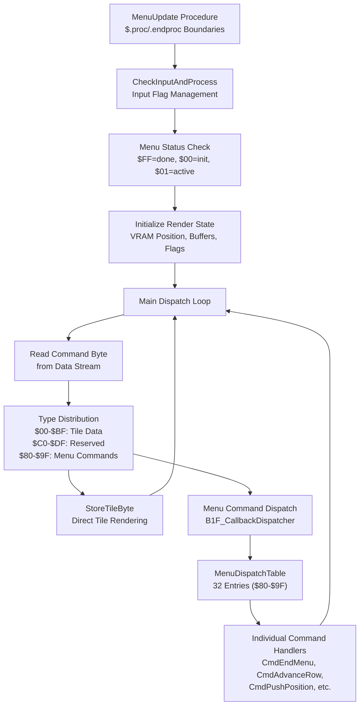

**Diagram sources**
- [prg_1d_1e.asm:475-612](file://asm/banks/prg_1d_1e.asm#L475-L612)
- [prg_1d_1e.asm:366-398](file://asm/banks/prg_1d_1e.asm#L366-L398)
- [prg_1f.aligned.asm:1757-1785](file://asm/banks/prg_1f.aligned.asm#L1757-L1785)

**Section sources**
- [prg_1d_1e.asm:475-612](file://asm/banks/prg_1d_1e.asm#L475-L612)
- [prg_1d_1e.asm:366-398](file://asm/banks/prg_1d_1e.asm#L366-L398)
- [prg_1f.aligned.asm:1757-1785](file://asm/banks/prg_1f.aligned.asm#L1757-L1785)

### Bank Switching Implementation (Enhanced Macros)
- The mapper exposes four write-only registers to select 8KB PRG banks for each slot.
- The project provides enhanced macros to simplify bank switching for each slot with modern formatting.
- A bank switching helper reads a configuration table and writes to the mapper registers for PRG slots and extended configuration.
- The combined PRG bank 17/18 structure uses specialized bank switching routines for simultaneous loading of both banks.
- The new combined PRG bank 1D/1E system uses standard bank switching to load both banks into the unified $A000-$DFFF range.
- The combined PRG bank 0A/0B structure uses standard bank switching for unified access.
- Modern assembly format provides structured organization with labeled bank switching routines and .proc/.endproc scope management.

**Updated** Enhanced with modern assembly formatting standards and improved macro organization, including coverage of the new combined bank structure and structured function organization.

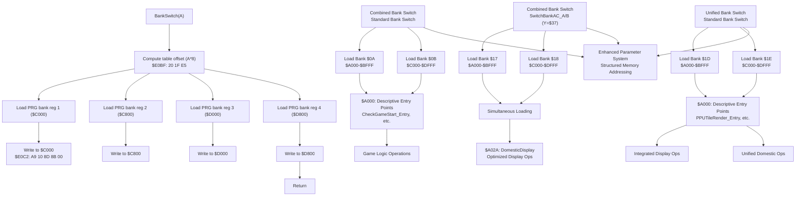

**Diagram sources**
- [prg_1f.aligned.asm:785-818](file://asm/banks/prg_1f.aligned.asm#L785-L818)
- [prg_1f.aligned.asm:824-828](file://asm/banks/prg_1f.aligned.asm#L824-L828)
- [prg_0a_0b.asm:491-501](file://asm/banks/prg_0a_0b.asm#L491-L501)
- [prg_17_18.asm:192-235](file://asm/banks/prg_17_18.asm#L192-L235)
- [prg_1d_1e.asm:264-335](file://asm/banks/prg_1d_1e.asm#L264-L335)
- [namco163.h:10-17](file://include/namco163.h#L10-L17)

**Section sources**
- [namco163.h:65-87](file://include/namco163.h#L65-L87)
- [prg_1f.aligned.asm:785-818](file://asm/banks/prg_1f.aligned.asm#L785-L818)
- [prg_1f.aligned.asm:824-828](file://asm/banks/prg_1f.aligned.asm#L824-L828)
- [prg_0a_0b.asm:491-501](file://asm/banks/prg_0a_0b.asm#L491-L501)
- [prg_17_18.asm:192-235](file://asm/banks/prg_17_18.asm#L192-L235)
- [prg_1d_1e.asm:264-335](file://asm/banks/prg_1d_1e.asm#L264-L335)

### Interrupt Service Routines and Hardware Abstraction
- The main module provides minimal NMI and IRQ stubs that preserve registers and return via RTI.
- The boot bank implements PPU initialization helpers and provides macros for common operations like VBlank waits, PPU address setting, and DMA transfers.
- The mapper initialization routine sets up the initial bank configuration for the first three slots.
- The combined PRG bank 17/18 structure provides specialized display and rendering routines optimized for the game's strategic interface.
- The new combined PRG bank 1D/1E system provides unified display and domestic operations with integrated SRAM management.
- The combined PRG bank 0A/0B structure provides game logic and data processing routines with descriptive entry points.
- Modern assembly formatting provides structured organization with labeled interrupt handlers and hardware abstraction routines, including comprehensive .proc/.endproc scope management.

**Updated** Enhanced with modern assembly formatting standards and improved hardware abstraction organization, including coverage of the new combined bank structure and structured function organization.

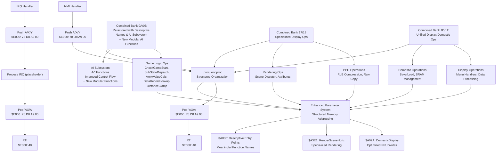

**Diagram sources**
- [main.asm:65-99](file://asm/main.asm#L65-L99)
- [prg_1f.aligned.asm:1040-1065](file://asm/banks/prg_1f.aligned.asm#L1040-L1065)
- [prg_0a_0b.asm:491-501](file://asm/banks/prg_0a_0b.asm#L491-L501)
- [prg_17_18.asm:192-235](file://asm/banks/prg_17_18.asm#L192-L235)
- [prg_17_18.asm:706-768](file://asm/banks/prg_17_18.asm#L706-L768)
- [prg_1d_1e.asm:264-335](file://asm/banks/prg_1d_1e.asm#L264-L335)
- [macros.h:8-12](file://include/macros.h#L8-L12)

**Section sources**
- [main.asm:65-99](file://asm/main.asm#L65-L99)
- [prg_1f.aligned.asm:1040-1065](file://asm/banks/prg_1f.aligned.asm#L1040-L1065)
- [prg_0a_0b.asm:491-501](file://asm/banks/prg_0a_0b.asm#L491-L501)
- [prg_17_18.asm:192-235](file://asm/banks/prg_17_18.asm#L192-L235)
- [prg_17_18.asm:706-768](file://asm/banks/prg_17_18.asm#L706-L768)
- [prg_1d_1e.asm:264-335](file://asm/banks/prg_1d_1e.asm#L264-L335)
- [macros.h:8-12](file://include/macros.h#L8-L12)

### Modular Assembly Approach and Bank Assignment
- The project uses a modular approach: each bank is represented by a separate assembly stub that includes the corresponding binary.
- The linker configuration assigns segments to specific PRG slots and allows optional assignment of additional banks.
- The include files centralize register definitions and macros for consistent access patterns across banks.
- The combined PRG bank 17/18 structure represents a specialized module providing enhanced display capabilities with modern .proc/.endproc organization.
- The new combined PRG bank 1D/1E structure represents a unified module providing integrated display and domestic operations with simplified bank management.
- The combined PRG bank 0A/0B structure represents a game logic module with descriptive entry points and structured function organization.
- Modern assembly formatting provides improved organization and debugging support across all bank files, including comprehensive function scope management.
- **Enhanced Parameter System**: Structured memory addressing system with comprehensive parameter declarations throughout the PRG bank 17-18 assembly.
- **Unified Bank Architecture**: The new combined PRG bank 1D/1E system provides architectural improvement over individual bank management with integrated functionality.
- **Comprehensive Descriptive Entry Points**: All combined bank systems now feature fully descriptive entry points following the standardized naming convention replacing generic EntryXX patterns for superior code organization.
- **Completed Major Refactoring**: PRG bank $0A+$0B has been successfully refactored with descriptive function naming, eliminating cryptic prefixed formats.
- **Enhanced AI Subsystem**: Comprehensive function reorganization with consistent Ai* prefix pattern, improved internal control flow with labeled targets replacing raw address jumps, better loop structure with properly named loop bodies, and enhanced battle system logic with specialized functions for army and enemy management.
- **Latest AI Refactoring**: Complete modularization with new functions providing enhanced officer management algorithms, bracket-based deduction systems, and improved code organization.

**Updated** Enhanced with modern assembly formatting standards and improved bank assignment organization, including coverage of the new combined bank structure, structured function organization, fully descriptive entry points following the standardized naming convention, structured function organization, enhanced AI subsystem with comprehensive function reorganization, and latest AI refactoring with new modular functions including officer management algorithms and bracket-based deduction systems.

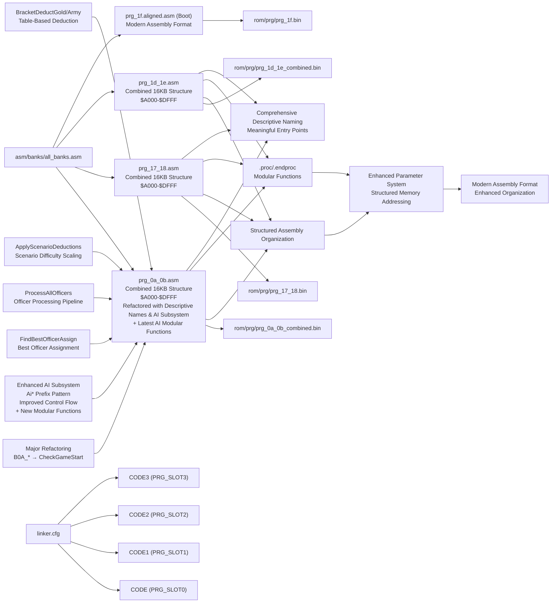

**Diagram sources**
- [all_banks.asm:1-38](file://asm/banks/all_banks.asm#L1-L38)
- [prg_0a_0b.asm:1-80](file://asm/banks/prg_0a_0b.asm#L1-L80)
- [prg_17_18.asm:1-80](file://asm/banks/prg_17_18.asm#L1-L80)
- [prg_1d_1e.asm:1-80](file://asm/banks/prg_1d_1e.asm#L1-L80)
- [linker.cfg:32-54](file://linker.cfg#L32-L54)

**Section sources**
- [all_banks.asm:1-38](file://asm/banks/all_banks.asm#L1-L38)
- [prg_0a_0b.asm:1-80](file://asm/banks/prg_0a_0b.asm#L1-L80)
- [prg_17_18.asm:1-80](file://asm/banks/prg_17_18.asm#L1-L80)
- [prg_1d_1e.asm:1-80](file://asm/banks/prg_1d_1e.asm#L1-L80)
- [linker.cfg:32-54](file://linker.cfg#L32-L54)

## Modern Assembly Formatting Standards

### Aligned Assembly Format
The modern aligned format provides comprehensive improvements in code organization and readability:

- **Structured Label Organization**: Labels are grouped by functional categories (constants, data, code, subroutines)
- **Address Constants**: Comprehensive address mapping system with clear naming conventions
- **Macro Definitions**: Enhanced macro system with proper parameter handling
- **Data Organization**: Structured data sections with clear labeling and organization
- **Code Readability**: Improved indentation and spacing for better code comprehension

### Enhanced Code Organization Features
The aligned format introduces several organizational improvements:

- **Functional Grouping**: Related functions and data are grouped together for better navigation
- **Consistent Formatting**: Standardized formatting across all code sections
- **Improved Navigation**: Logical organization makes code easier to navigate and understand
- **Enhanced Maintainability**: Better structure supports easier maintenance and updates

### Benefits for Development
The modern assembly formatting provides numerous benefits for developers:

- **Improved Readability**: Structured organization makes code easier to understand
- **Better Navigation**: Logical grouping helps developers quickly locate specific functionality
- **Enhanced Debugging**: Clear organization supports more effective debugging and analysis
- **Maintainability**: Better structure facilitates easier code maintenance and updates
- **Documentation Support**: Organized structure serves as implicit documentation of code functionality

**Section sources**
- [prg_1f.aligned.asm:12-80](file://asm/banks/prg_1f.aligned.asm#L12-L80)
- [prg_1f.aligned.asm:800-1599](file://asm/banks/prg_1f.aligned.asm#L800-L1599)
- [prg_17_18.asm:14-71](file://asm/banks/prg_17_18.asm#L14-L71)
- [prg_1d_1e.asm:12-16](file://asm/banks/prg_1d_1e.asm#L12-L16)
- [namco163.h:65-87](file://include/namco163.h#L65-L87)

## Enhanced Parameter Declaration System

### Comprehensive Parameter Alias System
The PRG bank 17-18 assembly now features a comprehensive parameter declaration system that replaces direct memory addressing with descriptive variable names:

- **Global Parameter Declarations**: Parameters like index_value, tile_ptr_lo/hi, attr_ptr_lo/hi, overlay_data_ptr, col_counter_lo/h, current_row/max_rows are declared at the function scope level
- **Structured Memory Addressing**: All zero-page memory operations now use named parameters instead of direct addressing like $000A, $000B, etc.
- **Enhanced Readability**: Code becomes self-documenting with meaningful variable names that describe their purpose and usage context
- **Improved Maintainability**: Parameter aliases make it easier to track memory usage and reduce errors from direct addressing mistakes

### Parameter Categories and Usage Patterns
The parameter system organizes memory usage into logical categories:

- **Index and Pointer Parameters**: index_value, overlay_data_ptr, scene_coord_ptr, work_ptr_hi
- **Pointer Pair Parameters**: tile_ptr_lo/hi, attr_ptr_lo/hi, ptr_001a_lo/hi, ptr_001c_lo/hi, ptr_001e_lo/hi
- **Counter and Control Parameters**: col_counter_lo/h, current_row, max_rows, row_limit, row_count
- **Temporary and Working Parameters**: param_byte1/2, tile_attr_byte, rle_marker, param_0003, param_0008
- **Address and Offset Parameters**: ppu_addr_lo/hi, attr_base_offset, coord_ptr_lo/hi, data_ptr_offset

### Function-Level Parameter Scoping
Each .proc block defines its own parameter namespace:

- **Local Symbol Isolation**: Parameters declared within .proc blocks remain local to that function scope
- **Clear Function Boundaries**: .endproc markers clearly define parameter scope and function boundaries
- **Modular Design**: Independent parameter spaces support better code modularity and reuse
- **Enhanced Debugging**: Scoped parameters support better debugging and analysis of function-specific memory usage

### Examples of Enhanced Parameter Usage
The parameter system dramatically improves code clarity:

- **SetupDisplayPtrs**: Uses index_value, tile_ptr_lo/hi, attr_ptr_lo/hi for tile/attribute pointer setup
- **PpuWriteRawRows**: Uses col_counter_lo/h, current_row, max_rows for row-based processing loops
- **RleDecompressHelper**: Uses col_counter_lo/h, tile_col_index, current_row for RLE processing coordination
- **RenderSceneHoriz**: Uses param_byte1/2, ppu_addr_hi, tile_col_index, current_row for horizontal rendering
- **BattleOverlayRender**: Uses overlay_data_ptr, scene_coord_ptr, work_ptr_hi for overlay processing

**Section sources**
- [prg_17_18.asm:135-155](file://asm/banks/prg_17_18.asm#L135-L155)
- [prg_17_18.asm:242-315](file://asm/banks/prg_17_18.asm#L242-L315)
- [prg_17_18.asm:759-857](file://asm/banks/prg_17_18.asm#L759-L857)
- [prg_17_18.asm:1288-1327](file://asm/banks/prg_17_18.asm#L1288-L1327)
- [prg_17_18.asm:1850-2002](file://asm/banks/prg_17_18.asm#L1850-L2002)

## Enhanced Code Organization

### Address Constant System
The aligned format implements a comprehensive address constant system:

- **RAM Address Constants**: Extensive mapping of RAM locations with descriptive names
- **PPU Register Constants**: Clear mapping of PPU register addresses and bit definitions
- **APU Register Constants**: Complete mapping of APU and I/O register addresses
- **Namco-163 Specific Constants**: Dedicated constants for mapper and expansion ROM registers
- **Combined Bank Constants**: Specialized address mappings for the PRG bank 17/18 and 1D/1E structures

### Macro Enhancement System
The macro system provides enhanced functionality:

- **Force Absolute Addressing**: Macros that force 16-bit addressing for absolute operations
- **Bank Switching Macros**: Enhanced macros for PRG bank switching with proper slot selection
- **Hardware Access Macros**: Streamlined macros for common hardware operations
- **Data Transfer Macros**: Optimized macros for efficient data movement and manipulation
- **Combined Bank Macros**: Specialized macros for managing the 16KB combined bank structures

### Data Organization Improvements
The aligned format provides better data organization:

- **Structured Data Sections**: Logical grouping of related data items
- **Clear Labeling**: Descriptive labels for easy identification of data purposes
- **Address Mapping**: Clear correlation between logical names and physical addresses
- **Constant Definitions**: Well-organized constants for easy modification and maintenance

### Structured Function Organization
The new .proc/.endproc organization provides comprehensive function structuring:

- **Scope Management**: Clear .proc/.endproc boundaries define function scope
- **Local Symbols**: Function-specific symbols remain local to their scope
- **Modular Design**: Independent function blocks improve code modularity
- **Enhanced Debugging**: Scoped organization supports better debugging and analysis
- **Code Reusability**: Modular functions can be reused independently

**Section sources**
- [prg_1f.aligned.asm:80-399](file://asm/banks/prg_1f.aligned.asm#L80-L399)
- [prg_17_18.asm:14-71](file://asm/banks/prg_17_18.asm#L14-L71)
- [prg_1d_1e.asm:12-16](file://asm/banks/prg_1d_1e.asm#L12-L16)
- [prg_1f.aligned.asm:1228-1256](file://asm/banks/prg_1f.aligned.asm#L1228-L1256)
- [prg_1f.aligned.asm:1319-1372](file://asm/banks/prg_1f.aligned.asm#L1319-L1372)
- [prg_17_18.asm:17-17](file://asm/banks/prg_17_18.asm#L17-L17)

## Callback Table Architecture

### Enhanced Callback Dispatcher Implementation
The B1F_CallbackDispatcher provides a robust callback mechanism with proper parameter passing and return value handling:

- **Parameter Passing**: Input parameter is passed via Y register and preserved across callback invocation
- **Inline Table Structure**: Callback tables are defined immediately after the JSR instruction
- **Indirect Jump Mechanism**: Uses return address calculation to access callback table entries
- **Symbolic Function Names**: All callback targets use symbolic names for improved maintainability
- **Structured Organization**: Proper .proc/.endproc boundaries ensure clean function scoping

### Callback Table Structure and Usage
The callback system follows a consistent pattern across the codebase:

- **Table Definition**: Inline word tables containing 16-bit function addresses
- **Index Calculation**: Index value multiplied by 2 for word-sized entries
- **Return Address Handling**: Automatic stack manipulation to access following table
- **Parameter Preservation**: Y register value saved and restored around callback invocation
- **Flexible Architecture**: Supports any number of callbacks with simple table extension

### SceneRenderer Callback Implementation
The SceneRenderer system demonstrates the proper callback architecture:

- **Six Entry Callback Table**: SceneOfficerListInit, ScenePageCopy, SceneRenderSetup, SceneSpriteSetup, SceneRenderExit3, SceneBufferFill
- **State Management**: Uses $0401 as callback index with automatic incrementation
- **Symbolic References**: All callback targets use descriptive function names
- **Parameter Context**: Maintains scene-specific state in zero-page memory locations
- **Integration Pattern**: Seamless integration with the broader callback system

**Updated** Major enhancement implementing proper callback table architecture replacing inline dispatch logic with structured, maintainable callback mechanisms.

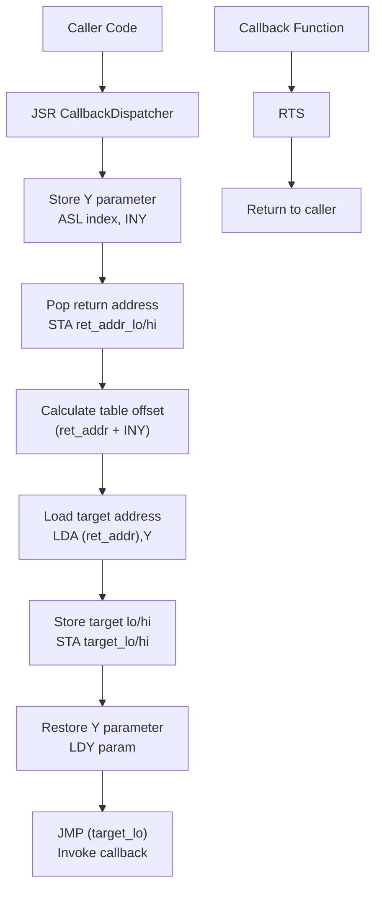

**Diagram sources**
- [prg_1f.aligned.asm:1757-1785](file://asm/banks/prg_1f.aligned.asm#L1757-L1785)
- [prg_1d_1e.asm:3179-3203](file://asm/banks/prg_1d_1e.asm#L3179-L3203)
- [prg_1d_1e.asm:570-612](file://asm/banks/prg_1d_1e.asm#L570-L612)

**Section sources**
- [prg_1f.aligned.asm:1757-1785](file://asm/banks/prg_1f.aligned.asm#L1757-L1785)
- [prg_1d_1e.asm:3179-3203](file://asm/banks/prg_1d_1e.asm#L3179-L3203)
- [prg_1d_1e.asm:570-612](file://asm/banks/prg_1d_1e.asm#L570-L612)

## SceneRenderer System Implementation

### Comprehensive Local Variable Documentation
The SceneRenderer system now features comprehensive local variable documentation across all key procedures:

- **SceneRenderer Core**: officer_list_st, officer_list_st1, officer_list_st2, officer_list_st3, oam_extra, scene_render_flag
- **MenuUpdate Variables**: menu_fmt_data0/1/2, menu_fmt_num0/1/2, menu_tile_tmp with detailed usage descriptions
- **YearDisplaySetup**: Local variables for year display formatting and positioning
- **PeriodicOverlayRefresh**: Variables for periodic refresh operations and timing control
- **ProvinceDataHandler**: Province-specific data handling and display variables
- **OfficerNameDisplay**: Officer name rendering and formatting variables
- **DisplayScaledName**: Name scaling and positioning variables
- **BankedDataHandler**: Bank switching and data management variables
- **SetupBankedData**: Data setup and initialization variables
- **StateHandler**: Game state management and transition variables
- **OfficerListHandler**: Officer list display and interaction variables

### SceneRenderer Callback Architecture
The SceneRenderer implements a six-entry callback system with proper state management:

- **SceneOfficerListInit**: Initializes officer list state registers with default values
- **ScenePageCopy**: Copies scene page data with bank switching and palette updates
- **SceneRenderSetup**: Handles scenario render setup, data loading, and timer initialization
- **SceneSpriteSetup**: Manages sprite OAM setup and input-driven palette operations
- **SceneRenderExit3**: Provides alternate render exit with scenario data loading
- **SceneBufferFill**: Fills VRAM buffer pages and manages data pointers

### Enhanced Procedural Boundaries
All SceneRenderer procedures implement proper .proc/.endproc boundaries with comprehensive local variable scoping:

- **Local Variable Isolation**: Each procedure defines its own parameter namespace
- **Clear Function Boundaries**: .endproc markers define complete function scope
- **Modular Design**: Independent procedures support better code organization
- **Enhanced Debugging**: Scoped variables support better debugging and analysis
- **Maintainability**: Clear boundaries facilitate easier code maintenance

**Updated** Comprehensive documentation of local variables across all key procedures with enhanced procedural boundaries and proper callback table architecture.

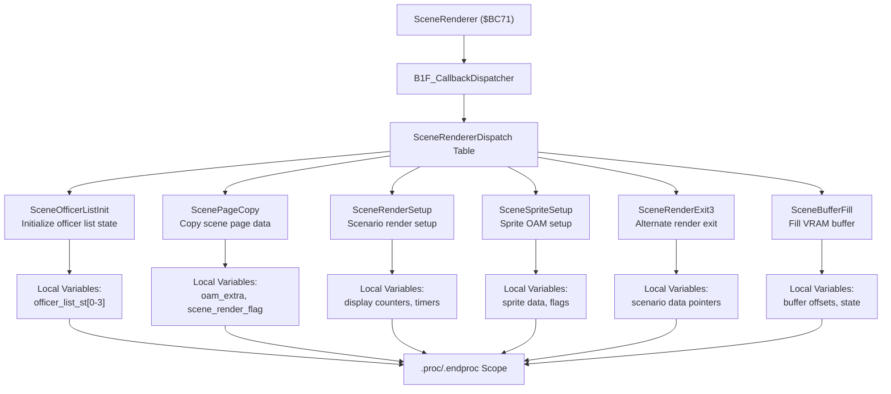

**Diagram sources**
- [prg_1d_1e.asm:3179-3203](file://asm/banks/prg_1d_1e.asm#L3179-L3203)
- [prg_1d_1e.asm:3209-3220](file://asm/banks/prg_1d_1e.asm#L3209-L3220)
- [prg_1d_1e.asm:3226-3271](file://asm/banks/prg_1d_1e.asm#L3226-L3271)
- [prg_1d_1e.asm:3277-3300](file://asm/banks/prg_1d_1e.asm#L3277-L3300)
- [prg_1d_1e.asm:3306-3325](file://asm/banks/prg_1d_1e.asm#L3306-L3325)
- [prg_1d_1e.asm:3331-3352](file://asm/banks/prg_1d_1e.asm#L3331-L3352)
- [prg_1d_1e.asm:3358-3400](file://asm/banks/prg_1d_1e.asm#L3358-L3400)

**Section sources**
- [prg_1d_1e.asm:3179-3203](file://asm/banks/prg_1d_1e.asm#L3179-L3203)
- [prg_1d_1e.asm:3209-3220](file://asm/banks/prg_1d_1e.asm#L3209-L3220)
- [prg_1d_1e.asm:3226-3271](file://asm/banks/prg_1d_1e.asm#L3226-L3271)
- [prg_1d_1e.asm:3277-3300](file://asm/banks/prg_1d_1e.asm#L3277-L3300)
- [prg_1d_1e.asm:3306-3325](file://asm/banks/prg_1d_1e.asm#L3306-L3325)
- [prg_1d_1e.asm:3331-3352](file://asm/banks/prg_1d_1e.asm#L3331-L3352)
- [prg_1d_1e.asm:3358-3400](file://asm/banks/prg_1d_1e.asm#L3358-L3400)

## AI Subsystem Architecture

### Comprehensive AI Function Reorganization
The AI subsystem has undergone comprehensive reorganization with consistent Ai* prefix naming pattern throughout the codebase:

- **AiTurnDispatch**: Main AI turn entry point that generates random numbers and determines action type
- **AiSearchPhase1**: First phase province search loop iterating through 30 provinces
- **AiSearchPhase2**: Second phase province search with different criteria and filtering
- **AiActionSelect**: Action selection logic based on random number generation
- **AiFindStrongestAdjacent**: Finds strongest adjacent province for potential conquest
- **AiCountActiveKingdoms**: Counts active kingdoms for strategic decision making
- **AiSwapProvinceOwner**: Handles province ownership transfer during AI actions
- **AiFindProvinceByOwner**: Locates provinces owned by specific entities
- **AiDomesticAction**: Processes domestic affairs and resource management
- **AiRandomCheck**: Generates and validates random numbers for AI decisions
- **AiEndTurn**: Finalizes turn processing and cleanup operations
- **AiScanMaxResource**: Scans maximum resources available to AI-controlled entities
- **AiRecruitAction**: Handles recruitment and unit management
- **AiFindBestProvince**: Evaluates and selects optimal provinces for AI actions
- **AiTurnLoop**: Main AI turn processing loop
- **AiEvaluateProvince**: Calculates province value and strategic importance
- **AiIncrementTurn**: Advances turn counter and state management
- **AiApplyDomesticChanges**: Applies changes resulting from domestic actions

### Latest AI Refactoring - New Modular Functions
The AI turn processing system has been completely refactored with new well-documented modular functions:

- **FindBestOfficerAssign ($C50E)**: Searches entities 0-29 for the best-scoring officer owned by the current player, then moves it from source to target list
  - Entity scanning with ownership validation
  - Score evaluation and best candidate selection
  - Source list removal and target list insertion
  - Post-processing with army value recalculation
- **ProcessAllOfficers ($C5B9)**: Iterates entities 0-29 to evaluate each officer and attempt kingdom assignment
  - Per-entity evaluation loop with nested EvaluateAndMarkOfficer subroutine
  - Kingdom assignment probability calculation
  - Random threshold validation and officer marking
- **ApplyScenarioDeductions ($CD68)**: New-game initialization applying difficulty-scaled deductions to multiple resource fields
  - Multiplier calculation based on scenario/difficulty parameter ($6F8D)
  - Field-specific deduction strategies (multiply/subtract vs direct assign)
  - Nested subroutines for multiplier calculation and arithmetic operations
- **BracketDeductGold ($CE67)**: Table-driven deduction system for gold field ($0522/$0523)
  - Threshold bracket lookup using ArmyDeductionTable
  - Multiplied result calculation and subtraction
  - Underflow protection and boundary handling
- **BracketDeductArmy ($CEDD)**: Identical algorithm to BracketDeductGold but targets soldiers field ($0526/$0527)
  - Shared deduction tables for consistency
  - Table-driven bracket-based resource reduction
- **OfficerSearchAndEvaluate ($C79A)**: AI officer recruitment/transfer pipeline for the current player
  - Entity scanning with ownership validation
  - Subordinate candidate evaluation and selection
  - Recruitment and transfer phase management
  - Eligibility checking and slot allocation
- **FindBestOfficerByCategory ($C98F)**: Category-based officer selection and priority slot management
  - Officer record scanning for category matching
  - Score evaluation and best candidate determination
  - Priority slot swapping and category processing
  - Officer change application and status updates

### Improved Internal Control Flow
The AI subsystem now features improved internal control flow with labeled targets replacing raw address jumps:

- **@exit_to_turn**: Common exit point for turn processing
- **@end_turn_process**: Shared end-turn processing logic
- **@apply_domestic_b**: Domestic apply path B for alternative processing
- **@check_kingdom_count**: Kingdom count validation and processing

### Better Loop Structure with Named Loop Bodies
The AI subsystem now implements better loop structure with properly named loop bodies:

- **@ScanOwnedProvinces**: Scans provinces owned by player kingdom
- **@ScanEnemyProvinces**: Scans provinces owned by enemy kingdoms
- **@InnerLoop**: Inner processing loop for province evaluation
- **@FindBestLoop**: Loop for finding best matching province
- **@FindBestSlot**: Slot allocation loop for battle units
- **@CountOwnedLoop**: Loop for counting owned provinces
- **@FindStrongestLoop**: Loop for finding strongest adjacent province
- **@FindBestSubCharacter**: Loop for evaluating sub-character options

### Enhanced Battle System Logic
The battle system logic has been enhanced with specialized functions for army and enemy management:

- **@PlaceNewArmies**: Places new armies in battle slots with strategic positioning
- **@PlaceNewEnemies**: Places new enemy forces with tactical considerations
- **@InsertBattleSlot**: Inserts units into available battle slots
- **@InsertEnemySlot**: Inserts enemy units into battle formations
- **@FindBestTarget**: Selects optimal targets for combat operations

### AI Turn Processing Pipeline
The AI turn processing follows a structured pipeline:

1. **AiTurnDispatch** generates random numbers and determines action type
2. **AiSearchPhase1/AiSearchPhase2** perform province searches with different criteria
3. **AiActionSelect** chooses appropriate action based on random selection
4. **New Modular AI Functions** execute specific strategic decisions:
   - **FindBestOfficerAssign** handles best officer assignment with scoring and list management
   - **ProcessAllOfficers** manages per-officer evaluation and kingdom assignment
   - **ApplyScenarioDeductions** applies difficulty-scaled resource deductions
   - **BracketDeductGold/Army** implements table-based resource reduction systems
   - **OfficerSearchAndEvaluate** executes officer recruitment and transfer pipeline
   - **FindBestOfficerByCategory** performs category-based officer selection and promotion
5. **Battle system functions** handle combat scenarios and unit placement
6. **Cleanup and transition** to next game state

**Updated** Major enhancement with comprehensive AI subsystem reorganization featuring consistent Ai* prefix naming pattern, improved internal control flow with labeled targets replacing raw address jumps, better loop structure with properly named loop bodies, enhanced battle system logic with specialized functions for army and enemy management, and latest AI refactoring with new modular functions including officer management algorithms, bracket-based deduction systems, and improved code organization.

```mermaid
flowchart TD
AITURN["AiTurnDispatch<br/>Main AI Turn Entry"] --> RANDOMCHECK["Generate Random Number<br/>Determine Action Type"]
RANDOMCHECK --> SEARCHPHASE1["AiSearchPhase1<br/>Province Search Phase 1"]
SEARCHPHASE1 --> SEARCHPHASE2["AiSearchPhase2<br/>Province Search Phase 2"]
SEARCHPHASE2 --> ACTIONSELECT["AiActionSelect<br/>Action Selection Logic"]
ACTIONSELECT --> STRATEGIC_ACTIONS["Strategic Actions<br/>Conquest, Diplomacy, Economy"]
ACTIONSELECT --> DOMESTIC_ACTIONS["Domestic Actions<br/>Resource Management"]
STRATEGIC_ACTIONS --> FIND_STRONGEST["AiFindStrongestAdjacent<br/>Find Target Province"]
STRATEGIC_ACTIONS --> COUNT_KINGDOMS["AiCountActiveKingdoms<br/>Assess Strategic Situation"]
DOMESTIC_ACTIONS --> SCAN_RESOURCE["AiScanMaxResource<br/>Resource Evaluation"]
DOMESTIC_ACTIONS --> RECRUIT["AiRecruitAction<br/>Unit Management"]
DOMESTIC_ACTIONS --> AI_DOMESTIC["AiDomesticAction<br/>Three-Phase Domestic Action System"]
AI_DOMESTIC --> PHASE1["Phase 1: Find weak entities"]
AI_DOMESTIC --> PHASE2["Phase 2: Find best targets"]
AI_DOMESTIC --> PHASE3["Phase 3: Compute action score"]
AI_FIND_OFFICER["FindBestOfficerAssign ($C50E)<br/>Best Officer Assignment"] --> ENTITY_SCAN["Entity Scanning<br/>Ownership Validation"]
AI_FIND_OFFICER --> SCORE_EVAL["Score Evaluation<br/>Best Candidate Selection"]
AI_FIND_OFFICER --> LIST_MANAGEMENT["Source/Target List<br/>Management"]
AI_PROCESS_ALL["ProcessAllOfficers ($C5B9)<br/>Officer Processing Pipeline"] --> PER_ENTITY["Per-Entity Evaluation<br/>Kingdom Assignment"]
AI_PROCESS_ALL --> EVALUATE_MARK["EvaluateAndMarkOfficer<br/>Nested Subroutine"]
AI_PROCESS_ALL --> PROBABILITY_CALC["Probability Calculation<br/>Random Threshold Validation"]
AI_SCENARIO_DEDUCTIONS["ApplyScenarioDeductions ($CD68)<br/>Scenario Difficulty Scaling"] --> MULTIPLIER_CALC["Multiplier Calculation<br/>Based on $6F8D"]
AI_SCENARIO_DEDUCTIONS --> FIELD_DEDUCTIONS["Field-Specific Deductions<br/>Multiply/Subtract vs Direct Assign"]
AI_SCENARIO_DEDUCTIONS --> NESTED_SUBS["Nested Subroutines<br/>@CalcMultiplier, @MultiplyAndSubtract"]
AI_BRACKET_DEDUCT["BracketDeductGold/Army ($CE67/$CEDD)<br/>Table-Based Resource Deduction"] --> THRESHOLD_LOOKUP["Threshold Bracket Lookup<br/>ArmyDeductionTable"]
AI_BRACKET_DEDUCT --> MULTIPLIED_RESULT["Multiplied Result<br/>Calculation and Subtraction"]
AI_BRACKET_DEDUCT --> UNDERFLOW_PROTECT["Underflow Protection<br/>Boundary Handling"]
AI_SEARCH_EVALUATE["OfficerSearchAndEvaluate ($C79A)<br/>Officer Recruitment Pipeline"] --> ENTITY_LOOP["Entity Scanning<br/>Ownership Validation"]
AI_SEARCH_EVALUATE --> CANDIDATE_EVAL["Candidate Evaluation<br/>Selection Logic"]
AI_SEARCH_EVALUATE --> RECRUIT_TRANSFER["Recruitment/Transfer<br/>Phase Management"]
AI_SEARCH_EVALUATE --> ELIGIBILITY_CHECK["Eligibility Checking<br/>Slot Allocation"]
AI_CATEGORY_FIND["FindBestOfficerByCategory ($C98F)<br/>Category-Based Selection"] --> CATEGORY_SCAN["Officer Record Scanning<br/>Category Matching"]
AI_CATEGORY_FIND --> BEST_SELECTION["Score Evaluation<br/>Best Candidate Determination"]
AI_CATEGORY_FIND --> PRIORITY_SWAP["Priority Slot Swapping<br/>Category Processing"]
AI_CATEGORY_FIND --> CHANGE_APPLICATION["Officer Change Application<br/>Status Updates"]
FIND_STRONGEST --> BATTLE_PLACEMENT["@PlaceNewArmies<br/>@PlaceNewEnemies"]
COUNT_KINGDOMS --> EVALUATE_PROVINCE["AiEvaluateProvince<br/>Strategic Assessment"]
SCAN_RESOURCE --> APPLY_DOMESTIC["AiApplyDomesticChanges<br/>Resource Updates"]
RECRUIT --> FIND_BEST_PROVINCE["AiFindBestProvince<br/>Optimal Location"]
BATTLE_PLACEMENT --> INSERT_SLOTS["@InsertBattleSlot<br/>@InsertEnemySlot"]
INSERT_SLOTS --> FIND_TARGET["@FindBestTarget<br/>Combat Target Selection"]
EVALUATE_PROVINCE --> SWAP_OWNER["AiSwapProvinceOwner<br/>Territory Changes"]
APPLY_DOMESTIC --> END_TURN["AiEndTurn<br/>Turn Cleanup"]
FIND_BEST_PROVINCE --> END_TURN
FIND_TARGET --> END_TURN
SWAP_OWNER --> END_TURN
END_TURN --> TURN_LOOP["AiTurnLoop<br/>Next Turn Processing"]
TURN_LOOP --> INCREMENT["AiIncrementTurn<br/>State Advancement"]
INCREMENT --> NEXT_TURN["Continue Game Loop"]
```

**Diagram sources**
- [prg_0a_0b.asm:3442-3700](file://asm/banks/prg_0a_0b.asm#L3442-L3700)
- [prg_0a_0b.asm:4158-4357](file://asm/banks/prg_0a_0b.asm#L4158-L4357)
- [prg_0a_0b.asm:4472-4671](file://asm/banks/prg_0a_0b.asm#L4472-L4671)
- [prg_0a_0b.asm:4726-4925](file://asm/banks/prg_0a_0b.asm#L4726-L4925)
- [prg_0a_0b.asm:3972-4171](file://asm/banks/prg_0a_0b.asm#L3972-L4171)
- [prg_0a_0b.asm:2050-2249](file://asm/banks/prg_0a_0b.asm#L2050-L2249)
- [prg_0a_0b.asm:5830-6029](file://asm/banks/prg_0a_0b.asm#L5830-L6029)
- [prg_0a_0b.asm:6228-6500](file://asm/banks/prg_0a_0b.asm#L6228-L6500)
- [prg_0a_0b.asm:6643-6842](file://asm/banks/prg_0a_0b.asm#L6643-L6842)
- [prg_0a_0b.asm:7165-7400](file://asm/banks/prg_0a_0b.asm#L7165-L7400)
- [prg_0a_0b.asm:7398-7597](file://asm/banks/prg_0a_0b.asm#L7398-L7597)
- [analyze_b49c.py:19-37](file://tools/analyze_b49c.py#L19-37)

**Section sources**
- [prg_0a_0b.asm:3442-3700](file://asm/banks/prg_0a_0b.asm#L3442-L3700)
- [prg_0a_0b.asm:4158-4357](file://asm/banks/prg_0a_0b.asm#L4158-L4357)
- [prg_0a_0b.asm:4472-4671](file://asm/banks/prg_0a_0b.asm#L4472-L4671)
- [prg_0a_0b.asm:4726-4925](file://asm/banks/prg_0a_0b.asm#L4726-L4925)
- [prg_0a_0b.asm:3972-4171](file://asm/banks/prg_0a_0b.asm#L3972-L4171)
- [prg_0a_0b.asm:2050-2249](file://asm/banks/prg_0a_0b.asm#L2050-L2249)
- [prg_0a_0b.asm:5830-6029](file://asm/banks/prg_0a_0b.asm#L5830-L6029)
- [prg_0a_0b.asm:6228-6500](file://asm/banks/prg_0a_0b.asm#L6228-L6500)
- [prg_0a_0b.asm:6643-6842](file://asm/banks/prg_0a_0b.asm#L6643-L6842)
- [prg_0a_0b.asm:7165-7400](file://asm/banks/prg_0a_0b.asm#L7165-L7400)
- [prg_0a_0b.asm:7398-7597](file://asm/banks/prg_0a_0b.asm#L7398-L7597)
- [analyze_b49c.py:19-37](file://tools/analyze_b49c.py#L19-37)

## Battle System Logic Enhancement

### Specialized Army and Enemy Management Functions
The battle system logic has been significantly enhanced with specialized functions for army and enemy management:

- **@PlaceNewArmies**: Strategically places new armies in battle slots with consideration for terrain and positioning
- **@PlaceNewEnemies**: Positions enemy forces with tactical awareness and formation considerations
- **@InsertBattleSlot**: Manages insertion of units into available battle slots with priority handling
- **@InsertEnemySlot**: Handles enemy unit placement with strategic positioning algorithms
- **@FindBestTarget**: Implements sophisticated target selection based on multiple factors including distance, strength, and strategic value

### Enhanced Battle Processing Pipeline
The battle processing pipeline now follows a structured approach:

1. **Army Placement**: @PlaceNewArmies evaluates available positions and places units strategically
2. **Enemy Deployment**: @PlaceNewEnemies positions opposing forces with tactical considerations
3. **Slot Management**: @InsertBattleSlot and @InsertEnemySlot manage unit allocation to battle slots
4. **Target Selection**: @FindBestTarget calculates optimal targets using distance, strength, and strategic value metrics
5. **Combat Resolution**: Integrated combat resolution with damage calculation and outcome determination

### Improved Control Flow and Loop Structures
The battle system now features improved control flow with properly named loop bodies:

- **@BattleArmyLoop**: Main loop for processing army units and their strategic placement
- **@BattleEnemyLoop**: Primary loop for enemy unit deployment and positioning
- **@BattleSlotLoop**: Loop for managing battle slot allocation and unit assignment
- **@EnemySlotLoop**: Specialized loop for enemy slot management and tactical positioning
- **@ScanTargetLoop**: Target scanning loop for evaluating potential combat targets
- **@FindSlotLoop**: Unit slot finding loop for locating available positions

### Advanced Target Selection Algorithm
The @FindBestTarget function implements sophisticated target selection logic:

- **Distance Calculation**: Computes distances between units and potential targets
- **Strength Assessment**: Evaluates relative strength and combat effectiveness
- **Strategic Value**: Considers strategic importance of targets beyond immediate combat value
- **Terrain Factors**: Incorporates terrain advantages and defensive bonuses
- **Priority Ranking**: Ranks potential targets based on multiple weighted criteria

**Updated** Major enhancement of battle system logic with specialized functions for army and enemy management, improved control flow with properly named loop bodies, and advanced target selection algorithm incorporating multiple strategic factors.

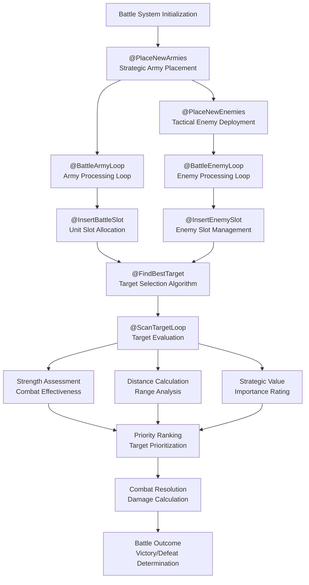

**Diagram sources**
- [prg_0a_0b.asm:2050-2249](file://asm/banks/prg_0a_0b.asm#L2050-L2249)

**Section sources**
- [prg_0a_0b.asm:2050-2249](file://asm/banks/prg_0a_0b.asm#L2050-L2249)

## Debugging and Verification Tools

### Aligned Format Benefits
The modern aligned format provides enhanced debugging capabilities:

- **Structured Code Analysis**: Organized code structure supports more effective analysis
- **Improved Symbol Resolution**: Clear label organization aids in symbol resolution during debugging
- **Enhanced Readability**: Better formatting supports faster code comprehension during debugging
- **Logical Organization**: Functional grouping makes it easier to isolate specific debugging scenarios

### Legacy Format Preservation
The project maintains backward compatibility through:

- **Backup Files**: Original format preserved in .bak files for reference
- **Aligned Versions**: Alternative formatting preserved for comparison and analysis
- **Migration Support**: Clear evidence of transformation supports migration and analysis

### Development Workflow Integration
The modern format integrates well with development workflows:

- **Tool Compatibility**: Format compatible with standard assembly development tools
- **Analysis Support**: Enhanced structure supports automated analysis and verification
- **Documentation Support**: Organized structure serves as built-in documentation

### Enhanced Parameter System Benefits
The new parameter declaration system provides additional debugging advantages:

- **Memory Usage Tracking**: Named parameters make it easier to track zero-page memory usage
- **Code Clarity**: Descriptive parameter names improve code comprehension during debugging
- **Error Reduction**: Parameter aliases reduce errors from direct memory addressing
- **Scope Analysis**: Local parameter scoping helps identify memory conflicts between functions

### Combined Bank System Benefits
The new combined PRG bank 1D/1E system provides debugging advantages:

- **Unified Memory Space**: Simplified memory management makes debugging more straightforward
- **Integrated Functionality**: Combined operations provide clearer execution flow analysis
- **Reduced Bank Confusion**: Eliminates confusion between separate bank management
- **Enhanced Testing**: Unified structure supports more comprehensive testing approaches

### New Menu Dispatch System Benefits
The new MenuDispatchTable provides additional debugging advantages:

- **Structured Command Handling**: Clear separation of menu command processing logic
- **Enhanced Traceability**: Individual command handlers can be debugged independently
- **Improved Error Detection**: Command validation and error handling are more systematic
- **Better Performance Analysis**: Command dispatch overhead can be measured and optimized

### Enhanced Callback System Benefits
The new callback table architecture provides debugging advantages:

- **Structured Callback Management**: Clear separation of callback registration and invocation
- **Enhanced Traceability**: Individual callbacks can be debugged independently
- **Improved Error Detection**: Callback validation and error handling are more systematic
- **Better Performance Analysis**: Callback dispatch overhead can be measured and optimized
- **Symbolic References**: Symbolic function names improve debugging and analysis

### Comprehensive Descriptive Entry Point Benefits
The fully descriptive entry points following the standardized naming convention provide significant debugging advantages:

- **Superior Code Navigation**: Meaningful names like CheckGameStart_Entry, PpuWriteRle_Entry, and PPUTileRender_Entry make it significantly easier to locate specific functionality
- **Enhanced Symbol Resolution**: Descriptive names dramatically improve debugging tool output and symbol tables
- **Built-in Documentation**: Entry point names serve as immediate inline documentation of function purpose
- **Reduced Cognitive Load**: Developers no longer need to remember what Entry00, Entry01, etc. do
- **Improved Maintenance**: Code changes are much easier to track when function names are descriptive
- **Better Error Messages**: Compiler and debugger messages are far more informative with descriptive names
- **Cross-Reference Clarity**: References in functions.h and other files become self-documenting
- **Team Collaboration**: Multiple developers can work on the codebase more effectively with clear naming conventions

### New Verification Tool Benefits
The verify_0a_0b.py tool provides comprehensive ROM validation:

- **Byte-for-Byte Accuracy**: Ensures rebuilt ROM matches original exactly
- **Automated Testing**: Validates refactoring completeness and correctness
- **Mismatch Detection**: Reports specific address mismatches with detailed information
- **Build Verification**: Confirms that major refactoring maintains ROM integrity
- **Development Confidence**: Provides assurance that code changes don't alter behavior

### Enhanced AI Subsystem Debugging Benefits
The AI subsystem reorganization provides significant debugging advantages:

- **Consistent Naming Convention**: Ai* prefix pattern makes AI functions easily identifiable and traceable
- **Improved Control Flow**: Labeled targets replace raw address jumps, making debugging flow analysis more straightforward
- **Named Loop Structures**: Properly named loop bodies (@ScanOwnedProvinces, @ScanEnemyProvinces, etc.) provide clear debugging context
- **Specialized Battle Functions**: Army and enemy management functions are clearly separated and individually debuggable
- **Enhanced Traceability**: AI turn processing pipeline is now clearly documented and traceable through function calls

### Latest AI Refactoring Debugging Benefits
The new modular AI functions provide additional debugging advantages:

- **Well-Documented Functions**: Each new function includes comprehensive comments explaining algorithms and phases
- **Modular Design**: Individual functions can be tested and debugged independently
- **Clear Algorithm Implementation**: Officer management algorithms, bracket-based deduction systems, and recruitment pipelines are clearly separated
- **Enhanced Traceability**: New functions like FindBestOfficerAssign ($C50E), ProcessAllOfficers ($C5B9), and ApplyScenarioDeductions ($CD68) provide clear entry points for debugging
- **Improved Analysis**: Tools like analyze_b49c.py provide automated analysis and improvement of AI function structure

**Updated** Enhanced debugging capabilities with comprehensive AI subsystem reorganization benefits, including consistent Ai* prefix naming pattern, improved control flow with labeled targets, properly named loop structures, specialized battle system functions for enhanced traceability and debugging support, and latest AI refactoring with new modular functions providing well-documented algorithms and clear debugging paths.

**Section sources**
- [prg_1f.aligned.asm:1-200](file://asm/banks/prg_1f.aligned.asm#L1-L200)
- [prg_1f.asm.bak:1-50](file://asm/banks/prg_1f.asm.bak#L1-L50)
- [assemble_prg_1d_1e.py:1-41](file://tools/assemble_prg_1d_1e.py#L1-L41)
- [prg_0a_0b.asm:491-501](file://asm/banks/prg_0a_0b.asm#L491-L501)
- [prg_17_18.asm:192-235](file://asm/banks/prg_17_18.asm#L192-L235)
- [prg_1d_1e.asm:264-335](file://asm/banks/prg_1d_1e.asm#L264-L335)
- [verify_0a_0b.py:1-28](file://tools/verify_0a_0b.py#L1-L28)

## Dependency Analysis
The architecture exhibits clear separation of concerns with modern assembly formatting standards:
- The boot bank depends on the mapper definitions and register abstractions.
- State handlers depend on the dispatcher and bank switching helpers.
- The combined PRG bank 17/18 structure depends on specialized display and rendering routines with structured function organization and enhanced parameter declarations.
- The new combined PRG bank 1D/1E structure depends on unified display and domestic operations with integrated SRAM management.
- The combined PRG bank 0A/0B structure depends on game logic and data processing routines with descriptive entry points.
- The linker configuration ties together segments and memory regions.
- The main module coordinates initialization and provides minimal ISR stubs.
- Modern assembly formatting provides improved organization and debugging support.
- Function address constants in functions.h provide centralized access to combined bank functionality.
- **Enhanced Parameter System**: Structured memory addressing system provides improved dependency management and code clarity.
- **Unified Bank Architecture**: The new combined PRG bank 1D/1E system provides architectural improvement over individual bank management with simplified dependencies.
- **Menu Dispatch Dependencies**: The MenuUpdate procedure depends on the B1F_CallbackDispatcher and MenuDispatchTable for structured command processing.
- **Callback System Dependencies**: The SceneRenderer system depends on the B1F_CallbackDispatcher for structured callback invocation with proper parameter passing.
- **Comprehensive Descriptive Entry Point Dependencies**: All combined bank systems depend on fully descriptive entry points following the standardized naming convention for superior code organization and maintainability.
- **Verification Tool Dependencies**: The verify_0a_0b.py tool depends on the original ROM file and build artifacts for validation.
- **AI Subsystem Dependencies**: The enhanced AI subsystem depends on consistent Ai* prefix naming pattern, improved control flow with labeled targets, properly named loop structures, and specialized battle system functions for army and enemy management.
- **Latest AI Refactoring Dependencies**: New modular AI functions depend on well-documented interfaces, clear algorithm separation, and comprehensive comment documentation for maintainability.

**Updated** Enhanced with modern assembly formatting standards and improved dependency management, including coverage of the new combined bank structure, structured function organization, the enhanced parameter declaration system, the new menu dispatch architecture, the enhanced callback system, the comprehensive descriptive entry point naming convention following the standardized naming pattern, the new verification tool infrastructure, the enhanced AI subsystem with consistent Ai* prefix pattern, improved control flow, and specialized battle system functions, plus latest AI refactoring with new modular functions including officer management algorithms, bracket-based deduction systems, and comprehensive documentation.

```mermaid
graph TB
ALIGNED["prg_1f.aligned.asm<br/>Modern Assembly Format"] --> NAMCO["namco163.h"]
ALIGNED --> REGS["6502_registers.h"]
ALIGNED --> MACROS["macros.h"]
ALIGNED --> CALLBACKDISP["CallbackDispatcher<br/>$EADE"]
COMBINED0A_0B["prg_0a_0b.asm<br/>Combined 16KB Structure<br/>Refactored with Descriptive Names & AI Subsystem<br/>+ Latest AI Modular Functions"] --> NAMCO
COMBINED0A_0B --> REGS
COMBINED0A_0B --> MACROS
COMBINED17_18["prg_17_18.asm<br/>Combined 16KB Structure"] --> NAMCO
COMBINED17_18 --> REGS
COMBINED17_18 --> MACROS
COMBINED1D_1E["prg_1d_1e.asm<br/>Combined 16KB Structure"] --> NAMCO
COMBINED1D_1E --> REGS
COMBINED1D_1E --> MACROS
COMBINED1D_1E --> FUNCTIONS["functions.h<br/>Function Address Constants"]
COMBINED0A_0B --> FUNCTIONS
COMBINED17_18 --> FUNCTIONS
COMBINED1D_1E --> PARAMSYS["Enhanced Parameter System<br/>Structured Memory Addressing"]
COMBINED1D_1E --> MENUDISPATCH["MenuDispatchTable<br/>32-Entry Command System"]
COMBINED1D_1E --> SCENERENDERER["SceneRenderer<br/>Callback Table Architecture"]
COMBINED1D_1E --> CALLBACKDISP
COMBINED0A_0B --> DESCENTRIES["Descriptive Entry Points<br/>CheckGameStart_Entry, etc."]
COMBINED17_18 --> DESCENTRIES
COMBINED1D_1E --> DESCENTRIES
COMBINED0A_0B --> AI_SUBSYSTEM["Enhanced AI Subsystem<br/>Ai* Prefix Pattern<br/>Improved Control Flow<br/>+ Latest AI Modular Functions"]
AI_SUBSYSTEM --> AI_FUNCTIONS["AiTurnDispatch, AiSearchPhase1,<br/>AiSearchPhase2, AiActionSelect,<br/>AiFindStrongestAdjacent, etc."]
AI_SUBSYSTEM --> LABELED_TARGETS["@exit_to_turn, @end_turn_process,<br/>@apply_domestic_b, @check_kingdom_count"]
AI_SUBSYSTEM --> NAMED_LOOPS["@ScanOwnedProvinces, @ScanEnemyProvinces,<br/>@InnerLoop, @FindBestLoop, etc."]
AI_SUBSYSTEM --> BATTLE_FUNCTIONS["@PlaceNewArmies, @PlaceNewEnemies,<br/>@InsertBattleSlot, @InsertEnemySlot,<br/>@FindBestTarget"]
AI_SUBSYSTEM --> AI_FIND_OFFICER["FindBestOfficerAssign ($C50E)<br/>Best Officer Assignment"]
AI_SUBSYSTEM --> AI_PROCESS_ALL["ProcessAllOfficers ($C5B9)<br/>Officer Processing Pipeline"]
AI_SUBSYSTEM --> AI_SCENARIO_DEDUCTIONS["ApplyScenarioDeductions ($CD68)<br/>Scenario Difficulty Scaling"]
AI_SUBSYSTEM --> AI_BRACKET_DEDUCT["BracketDeductGold/Army ($CE67/$CEDD)<br/>Table-Based Deduction"]
AI_SUBSYSTEM --> AI_SEARCH_EVALUATE["OfficerSearchAndEvaluate ($C79A)<br/>Officer Recruitment Pipeline"]
AI_SUBSYSTEM --> AI_CATEGORY_FIND["FindBestOfficerByCategory ($C98F)<br/>Category-Based Selection"]
MAIN["main.asm"] --> ALIGNED
MAIN --> NAMCO
LCFG["linker.cfg"] --> ALIGNED
LCFG --> COMBINED0A_0B
LCFG --> COMBINED17_18
LCFG --> COMBINED1D_1E
LCFG --> MAIN
ALIGNED --> STRUCT["Structured Organization"]
COMBINED0A_0B --> STRUCT
COMBINED17_18 --> STRUCT
COMBINED1D_1E --> STRUCT
ALIGNED --> DEBUG["Enhanced Debugging"]
COMBINED0A_0B --> DEBUG
COMBINED17_18 --> DEBUG
COMBINED1D_1E --> DEBUG
COMBINED0A_0B --> PROC[".proc/.endproc<br/>Modular Functions"]
COMBINED17_18 --> PROC
COMBINED1D_1E --> PROC
PARAMSYS --> PROC
STRUCT --> PROC
MENUDISPATCH --> CALLBACKEVAL["B1F_CallbackDispatcher"]
SCENERENDERER --> CALLBACKEVAL
CALLBACKEVAL --> ALIGNED
DESCENTRIES --> IMPROVEDMAINT["Improved Maintainability<br/>Better Code Organization"]
VERIFY["verify_0a_0b.py<br/>ROM Validation"] --> COMBINED0A_0B
VERIFY --> ORIGINALROM["Original ROM File"]
VERIFY --> BUILDARTIFACTS["Build Artifacts"]
AI_SUBSYSTEM --> ANALYZE["analyze_b49c.py<br/>AI Function Analysis"]
AI_FIND_OFFICER --> DOCUMENTATION["Well-Documented Algorithms<br/>Clear Function Separation"]
AI_PROCESS_ALL --> DOCUMENTATION
AI_SCENARIO_DEDUCTIONS --> DOCUMENTATION
AI_BRACKET_DEDUCT --> DOCUMENTATION
AI_SEARCH_EVALUATE --> DOCUMENTATION
AI_CATEGORY_FIND --> DOCUMENTATION
```

**Diagram sources**
- [prg_1f.aligned.asm:10-11](file://asm/banks/prg_1f.aligned.asm#L10-L11)
- [prg_0a_0b.asm:10-12](file://asm/banks/prg_0a_0b.asm#L10-L12)
- [prg_17_18.asm:10-12](file://asm/banks/prg_17_18.asm#L10-L12)
- [prg_1d_1e.asm:12-14](file://asm/banks/prg_1d_1e.asm#L12-L14)
- [namco163.h:10-17](file://include/namco163.h#L10-L17)
- [6502_registers.h:6-39](file://include/6502_registers.h#L6-L39)
- [macros.h:1-72](file://include/macros.h#L1-L72)
- [main.asm:6-7](file://asm/main.asm#L6-L7)
- [linker.cfg:18-55](file://linker.cfg#L18-L55)
- [functions.h:315-335](file://include/functions.h#L315-L335)
- [functions.h:574-597](file://include/functions.h#L574-L597)
- [functions.h:739-745](file://include/functions.h#L739-L745)
- [prg_0a_0b.asm:491-501](file://asm/banks/prg_0a_0b.asm#L491-L501)
- [prg_17_18.asm:192-235](file://asm/banks/prg_17_18.asm#L192-L235)
- [prg_1d_1e.asm:264-335](file://asm/banks/prg_1d_1e.asm#L264-L335)
- [prg_1d_1e.asm:366-398](file://asm/banks/prg_1d_1e.asm#L366-L398)
- [prg_1f.aligned.asm:1757-1785](file://asm/banks/prg_1f.aligned.asm#L1757-L1785)
- [prg_1d_1e.asm:3179-3203](file://asm/banks/prg_1d_1e.asm#L3179-L3203)
- [verify_0a_0b.py:1-28](file://tools/verify_0a_0b.py#L1-L28)
- [analyze_b49c.py:19-37](file://tools/analyze_b49c.py#L19-37)

**Section sources**
- [prg_1f.aligned.asm:10-11](file://asm/banks/prg_1f.aligned.asm#L10-L11)
- [prg_0a_0b.asm:10-12](file://asm/banks/prg_0a_0b.asm#L10-L12)
- [prg_17_18.asm:10-12](file://asm/banks/prg_17_18.asm#L10-L12)
- [prg_1d_1e.asm:12-14](file://asm/banks/prg_1d_1e.asm#L12-L14)
- [namco163.h:10-17](file://include/namco163.h#L10-L17)
- [6502_registers.h:6-39](file://include/6502_registers.h#L6-L39)
- [macros.h:1-72](file://include/macros.h#L1-L72)
- [main.asm:6-7](file://asm/main.asm#L6-L7)
- [linker.cfg:18-55](file://linker.cfg#L18-L55)
- [functions.h:315-335](file://include/functions.h#L315-L335)
- [functions.h:574-597](file://include/functions.h#L574-L597)
- [functions.h:739-745](file://include/functions.h#L739-L745)
- [prg_0a_0b.asm:491-501](file://asm/banks/prg_0a_0b.asm#L491-L501)
- [prg_17_18.asm:192-235](file://asm/banks/prg_17_18.asm#L192-L235)
- [prg_1d_1e.asm:264-335](file://asm/banks/prg_1d_1e.asm#L264-L335)
- [prg_1d_1e.asm:366-398](file://asm/banks/prg_1d_1e.asm#L366-L398)
- [prg_1f.aligned.asm:1757-1785](file://asm/banks/prg_1f.aligned.asm#L1757-L1785)
- [prg_1d_1e.asm:3179-3203](file://asm/banks/prg_1d_1e.asm#L3179-L3203)
- [verify_0a_0b.py:1-28](file://tools/verify_0a_0b.py#L1-L28)
- [analyze_b49c.py:19-37](file://tools/analyze_b49c.py#L19-37)

## Performance Considerations
- Bank switching involves writing to mapper registers; minimize unnecessary switches to reduce overhead.
- Use the provided enhanced macros to keep register writes compact and consistent.
- Leverage the vector dispatch to avoid frequent branching and to centralize state transitions.
- Keep PPU/APU operations synchronized with VBlank to prevent flicker and timing issues.
- The combined PRG bank 17/18 structure provides optimized display operations for strategic interface rendering.
- The new combined PRG bank 1D/1E system provides unified memory management and simplified bank switching for display and domestic operations.
- The combined PRG bank 0A/0B structure provides optimized game logic operations with descriptive entry points.
- **Enhanced Parameter System**: The structured parameter declaration system provides improved code organization for better performance analysis.
- **Debugging Efficiency**: Structured organization improves debugging efficiency and performance optimization.
- **Maintenance Overhead**: Modern formatting and parameter system add minimal overhead while providing significant development benefits.
- **Structured Functions**: The .proc/.endproc organization improves code modularity and reduces compilation times.
- **Memory Efficiency**: Parameter aliases eliminate redundant addressing operations and improve instruction efficiency.
- **Unified Bank Benefits**: The combined bank architecture reduces bank switching overhead and provides more efficient memory access patterns.
- **Menu Dispatch Optimization**: The new MenuDispatchTable provides efficient command routing with minimal overhead compared to conditional branching.
- **Callback System Performance**: The callback table architecture provides efficient dispatch with minimal overhead compared to inline conditional logic.
- **Symbolic References**: Symbolic function names improve code maintainability without performance impact.
- **Comprehensive Descriptive Entry Points**: Fully descriptive entry points following the standardized naming convention provide superior code organization with no performance penalty, significantly improving long-term maintainability and reducing debugging time across the entire codebase.
- **Verification Tool Impact**: The verify_0a_0b.py tool runs during development builds but has no runtime performance impact.
- **AI Subsystem Performance**: The enhanced AI subsystem with consistent Ai* prefix pattern and improved control flow provides better performance through optimized function organization and reduced overhead from labeled targets replacing raw address jumps.
- **Latest AI Refactoring Performance**: New modular AI functions provide optimized performance through well-structured algorithms, clear function separation, and efficient resource management in officer management algorithms, bracket-based deduction systems, and recruitment pipelines.

**Updated** Enhanced performance considerations with AI subsystem optimization benefits, including consistent Ai* prefix pattern for better function organization, improved control flow with labeled targets reducing overhead, specialized battle system functions providing optimized army and enemy management performance, and latest AI refactoring with new modular functions providing efficient algorithm implementation and optimized resource management.

## Troubleshooting Guide
- If the game does not enter the intended state, verify the vector table indexing and ensure the state counter is properly masked.
- If graphics appear incorrect after a bank switch, confirm the mapper register writes and palette upload sequences.
- If interrupts are not firing, ensure PPU control bits are set correctly and that the NMI flag is cleared appropriately.
- Use the provided enhanced macros for PPU operations to avoid off-by-one address errors.
- **Modern Format Benefits**: Utilize the structured aligned format to quickly locate and analyze specific code sections.
- **Organization Advantages**: Clear code organization makes troubleshooting more efficient and systematic.
- **Legacy Reference**: Use backup files to compare with original format when needed for analysis.
- **Migration Support**: Modern format supports easier migration and updates compared to legacy formats.
- **Combined Bank Issues**: For PRG bank 17/18 problems, verify the SwitchBankAC_A/B routine and ensure proper simultaneous loading.
- **Structured Function Issues**: For function scoping problems, verify .proc/.endproc balance and proper function boundaries.
- **RLE Decompression Errors**: For display issues, check RLE decompression helper functions and data stream integrity.
- **Parameter System Issues**: For memory addressing problems, verify parameter alias correctness and scope boundaries.
- **Unified Bank Problems**: For PRG bank 1D/1E issues, verify the unified bank switching and ensure proper memory mapping at $A000-$DFFF.
- **Enhanced Parameter System**: Use the structured parameter declarations to identify memory conflicts and improve debugging efficiency.
- **Menu Dispatch Issues**: For menu command problems, verify the MenuDispatchTable structure and B1F_CallbackDispatcher usage.
- **Command Handler Errors**: For specific menu command failures, check individual command handlers in the MenuDispatchTable range.
- **Callback System Issues**: For callback-related problems, verify the callback table structure and B1F_CallbackDispatcher implementation.
- **SceneRenderer Problems**: For scene rendering issues, check the SceneRenderer callback table and individual callback implementations.
- **Local Variable Conflicts**: For variable-related issues, verify local variable scoping and .proc/.endproc boundaries.
- **Comprehensive Descriptive Entry Point Issues**: For problems with fully descriptive entry points following the standardized naming convention like CheckGameStart_Entry, PpuWriteRle_Entry, or PPUTileRender_Entry, verify the jump table structure and ensure proper function name consistency across all combined bank systems. The descriptive naming convention eliminates confusion and makes debugging significantly more straightforward.
- **Verification Tool Failures**: When verify_0a_0b.py reports mismatches, examine the specific addresses reported and compare with original ROM bytes to identify refactoring errors.
- **AI Subsystem Issues**: For AI-related problems, verify the consistent Ai* prefix naming pattern, check labeled targets replacing raw address jumps, examine properly named loop bodies, and validate specialized battle system functions for army and enemy management. The enhanced AI subsystem organization should provide clearer debugging paths and better traceability through the AiTurnDispatch pipeline.
- **Latest AI Refactoring Issues**: For problems with new modular AI functions, verify the well-documented algorithm phases, check function entry points (FindBestOfficerAssign $C50E, ProcessAllOfficers $C5B9, ApplyScenarioDeductions $CD68), examine officer management algorithms, validate bracket-based deduction systems, and review recruitment pipeline implementation.

**Updated** Enhanced troubleshooting guidance with AI subsystem debugging support, including verification of consistent Ai* prefix naming pattern, labeled targets replacing raw address jumps, properly named loop bodies, and specialized battle system functions for army and enemy management, plus latest AI refactoring debugging support for new modular functions with well-documented algorithms and clear function separation.

**Section sources**
- [prg_1f.aligned.asm:739-750](file://asm/banks/prg_1f.aligned.asm#L739-L750)
- [prg_1f.aligned.asm:1071-1085](file://asm/banks/prg_1f.aligned.asm#L1071-L1085)
- [prg_1f.aligned.asm:1100-1113](file://asm/banks/prg_1f.aligned.asm#L1100-L1113)
- [prg_0a_0b.asm:491-501](file://asm/banks/prg_0a_0b.asm#L491-L501)
- [prg_17_18.asm:192-235](file://asm/banks/prg_17_18.asm#L192-L235)
- [prg_1d_1e.asm:264-335](file://asm/banks/prg_1d_1e.asm#L264-L335)
- [prg_1f.asm.bak:1-50](file://asm/banks/prg_1f.asm.bak#L1-L50)
- [prg_1d_1e.asm:366-398](file://asm/banks/prg_1d_1e.asm#L366-L398)
- [prg_1f.aligned.asm:1757-1785](file://asm/banks/prg_1f.aligned.asm#L1757-L1785)
- [prg_1d_1e.asm:3179-3203](file://asm/banks/prg_1d_1e.asm#L3179-L3203)
- [verify_0a_0b.py:1-28](file://tools/verify_0a_0b.py#L1-L28)

## Conclusion
The assembly architecture employs a robust, modular design centered on a fixed boot bank and a vector-driven state machine. The modern assembly format transformation represents a significant improvement in code organization, readability, and maintainability. The Namco-163 mapper enables efficient bank switching across four PRG slots, while the linker configuration and include files provide a consistent foundation for development. The new combined PRG bank 17/18 structure enhances display operations for the game's strategic interface, providing specialized PPU data handling, RLE decompression capabilities, and comprehensive display operation systems. The introduction of structured .proc/.endproc organization significantly improves code modularity and debugging support. The comprehensive tooling infrastructure supports automated analysis and verification, making the development process more efficient and reliable. The enhanced parameter declaration system provides structured memory addressing throughout the PRG bank 17-18 assembly, improving code readability and maintainability by replacing direct memory addressing with descriptive parameter names. The new combined PRG bank 1D/1E system represents a significant architectural improvement over the previous individual bank management approach, offering unified 16KB memory space at $A000-$DFFF with integrated display operations, menu handlers, domestic affairs dispatch, and SRAM save/load functionality. The major refactoring of the MenuUpdate procedure with its comprehensive 32-entry MenuDispatchTable provides structured command processing for menu commands $80-$9F, enhancing the overall system architecture with improved maintainability and debugging support. The enhanced SceneRenderer system now implements proper callback table architecture with symbolic function names, replacing inline dispatch logic for improved maintainability and debugging support. **Updated** The most significant recent enhancement is the completion of the major refactoring of PRG bank $0A+$0B, successfully transforming cryptic prefixed function names like B0A_CheckGameStart and B0B_SubStateDispatch into descriptive names like CheckGameStart and SubStateDispatch, while also updating all entry points from generic EntryXX patterns to meaningful descriptive names like CheckGameStart_Entry, PpuWriteRle_Entry, and PPUTileRender_Entry. **Major Enhancement** The AI subsystem has undergone comprehensive reorganization with consistent Ai* prefix naming pattern (AiTurnDispatch, AiSearchPhase1, AiSearchPhase2, AiActionSelect, AiFindStrongestAdjacent, AiCountActiveKingdoms, AiSwapProvinceOwner, AiFindProvinceByOwner, AiDomesticAction, AiRandomCheck, AiEndTurn, AiScanMaxResource, AiRecruitAction, AiFindBestProvince, AiTurnLoop, AiEvaluateProvince, AiIncrementTurn, AiApplyDomesticChanges), improved internal control flow with labeled targets replacing raw address jumps (@exit_to_turn, @end_turn_process, @apply_domestic_b, @check_kingdom_count), better loop structure with properly named loop bodies (@ScanOwnedProvinces, @ScanEnemyProvinces, @InnerLoop, @FindBestLoop, @FindBestSlot, @CountOwnedLoop, @FindStrongestLoop, @FindBestSubCharacter), and enhanced battle system logic with specialized functions for army and enemy management (@PlaceNewArmies, @PlaceNewEnemies, @InsertBattleSlot, @InsertEnemySlot, @FindBestTarget). **Latest Major Enhancement** The AI turn processing system has been completely refactored with new modular functions including FindBestOfficerAssign ($C50E) for best officer assignment with entity scanning and scoring, ProcessAllOfficers ($C5B9) for officer processing pipeline with kingdom assignment, ApplyScenarioDeductions ($CD68) for scenario difficulty scaling with multiplier calculation, BracketDeductGold/Army ($CE67/$CEDD) for table-based resource deduction systems, OfficerSearchAndEvaluate ($C79A) for officer recruitment and transfer pipeline, and FindBestOfficerByCategory ($C98F) for category-based officer selection and priority slot management. This transformative change establishes a consistent naming convention across the entire codebase, significantly improving code organization, debugging capabilities, and long-term maintainability through consistent symbolic reference patterns. The addition of the verify_0a_0b.py verification tool ensures that the major refactoring maintains byte-for-byte accuracy with the original ROM, providing confidence in the code changes. By following the documented patterns for bank assignment, state transitions, hardware abstraction, utilizing the modern assembly formatting standards with structured function organization, leveraging the enhanced parameter system, implementing the unified bank architecture, adopting the new menu dispatch system, embracing the enhanced callback architecture, incorporating the comprehensive descriptive entry point naming convention following the standardized naming pattern, integrating the enhanced AI subsystem with consistent Ai* prefix pattern, improved control flow, and specialized battle system functions, and implementing the latest AI refactoring with new modular functions providing well-documented algorithms and clear function separation, developers can extend the disassembly with accurate, maintainable code while benefiting from superior debugging and verification support through enhanced code organization and structure.