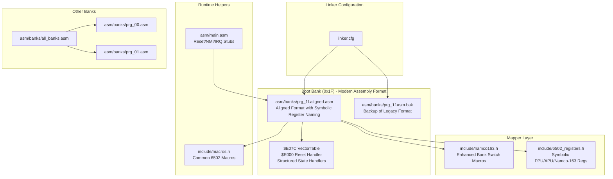
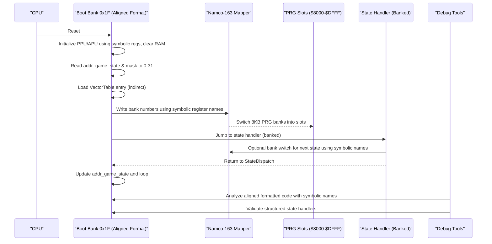
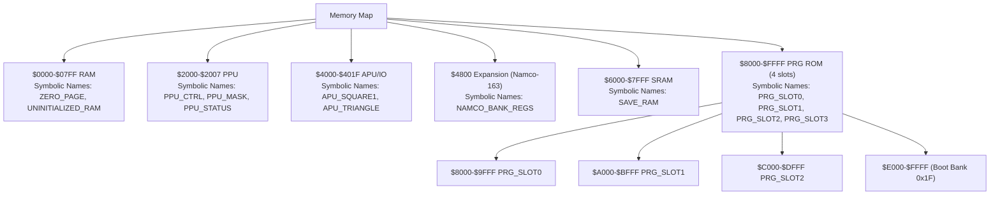
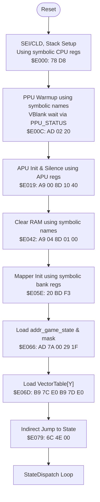
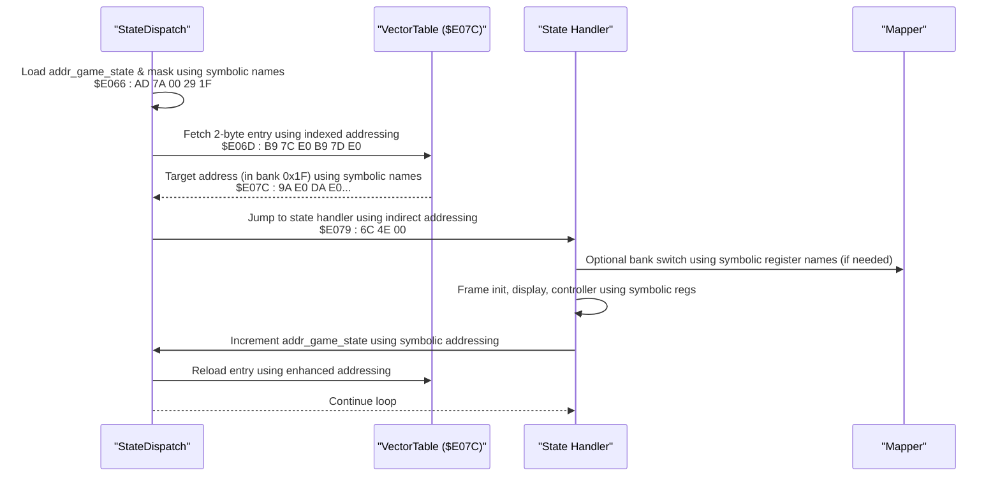
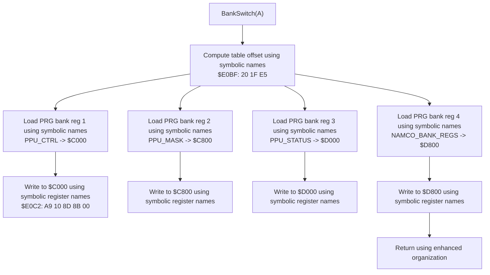
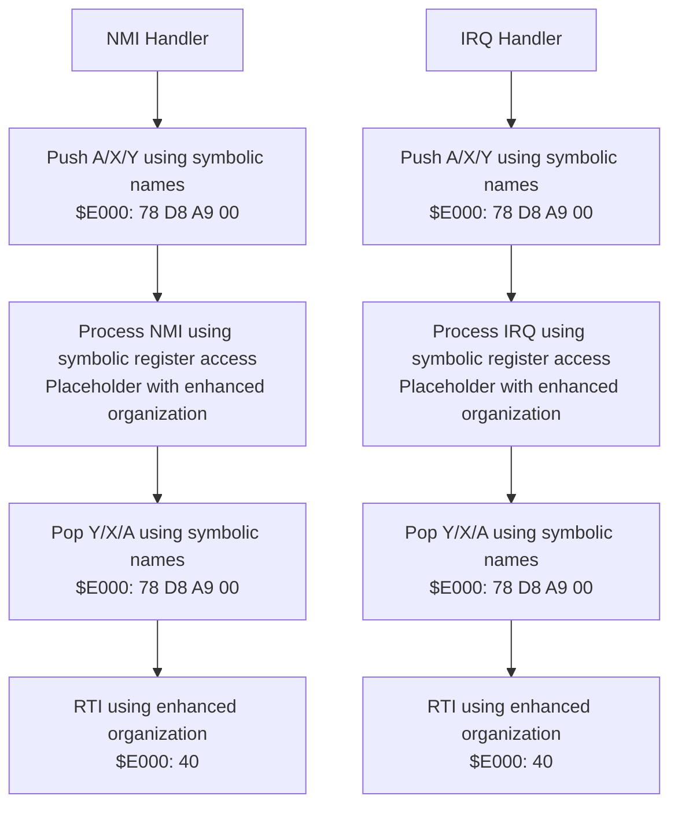
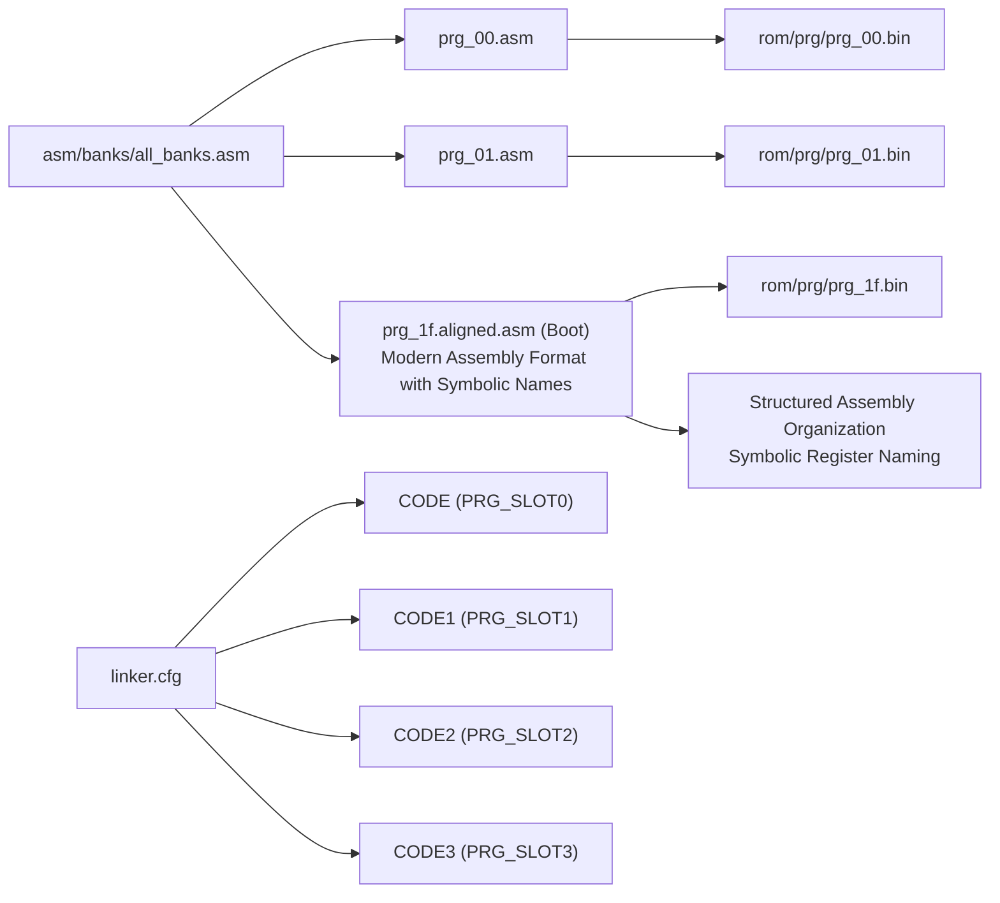
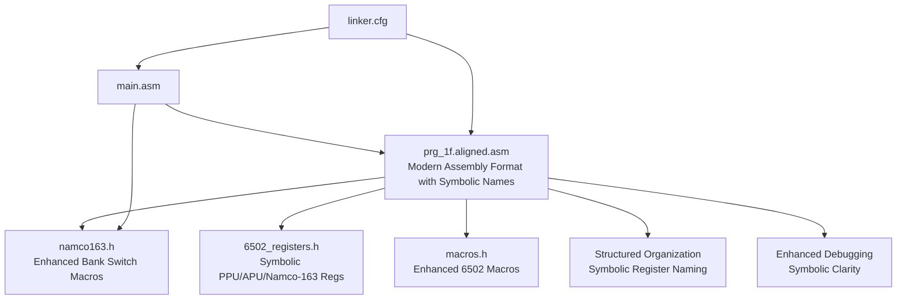

# Assembly Architecture

<cite>
**Referenced Files in This Document**
- [linker.cfg](file://linker.cfg)
- [main.asm](file://asm/main.asm)
- [prg_1f.aligned.asm](file://asm/banks/prg_1f.aligned.asm)
- [prg_1f.asm.bak](file://asm/banks/prg_1f.asm.bak)
- [namco163.h](file://include/namco163.h)
- [6502_registers.h](file://include/6502_registers.h)
- [macros.h](file://include/macros.h)
- [all_banks.asm](file://asm/banks/all_banks.asm)
- [prg_00.asm](file://asm/banks/prg_00.asm)
- [prg_01.asm](file://asm/banks/prg_01.asm)
- [PROJECT.md](file://PROJECT.md)
</cite>

## Update Summary
**Changes Made**
- Updated documentation to reflect the modernized PRG bank $1F assembly code with symbolic naming for memory-mapped registers
- Enhanced documentation of bank switching mechanisms with improved register access patterns
- Updated data access procedures documentation with new symbolic addressing methods
- Revised bank organization structure to reflect current prg_1f.aligned.asm format with comprehensive symbolic register naming
- Enhanced debugging capabilities through improved code organization and register abstraction

## Table of Contents
1. [Introduction](#introduction)
2. [Project Structure](#project-structure)
3. [Core Components](#core-components)
4. [Architecture Overview](#architecture-overview)
5. [Detailed Component Analysis](#detailed-component-analysis)
6. [Symbolic Register Naming System](#symbolic-register-naming-system)
7. [Enhanced Bank Switching Mechanisms](#enhanced-bank-switching-mechanisms)
8. [Modern Assembly Formatting Standards](#modern-assembly-formatting-standards)
9. [Enhanced Code Organization](#enhanced-code-organization)
10. [Debugging and Verification Tools](#debugging-and-verification-tools)
11. [Dependency Analysis](#dependency-analysis)
12. [Performance Considerations](#performance-considerations)
13. [Troubleshooting Guide](#troubleshooting-guide)
14. [Conclusion](#conclusion)

## Introduction
This document explains the assembly architecture for the Namco-163 (Mapper 19) implementation used in the disassembly of a classic NES strategy game. It focuses on the 32-bank structure with 8KB banks, the fixed boot bank at $E000-$FFFF, the switchable PRG slots at $8000-$DFFF, and the state machine orchestrated by the vector dispatch table at $E07C. The architecture now features modern assembly formatting standards with the new prg_1f.aligned.asm structure representing a complete rewrite using contemporary assembly syntax for enhanced code organization, symbolic register naming, and improved debugging capabilities.

## Project Structure
The project is organized around a modular bank-based approach with modern assembly formatting standards and comprehensive symbolic register naming:
- A central linker configuration defines memory layout and segments.
- A main entry module provides reset/NMI/IRQ stubs and initializes the mapper.
- A dedicated boot bank (0x1F) contains the reset handler, state dispatch table, and core runtime helpers in the new aligned format with structured organization and symbolic register naming.
- Separate bank stubs represent the remaining 31 banks, each mapped to a specific PRG slot.
- Modern assembly formatting standards provide improved readability and debugging support through consistent symbolic naming conventions.

**Diagram sources**
- [linker.cfg:18-55](file://linker.cfg#L18-L55)
- [prg_1f.aligned.asm:1-200](file://asm/banks/prg_1f.aligned.asm#L1-L200)
- [prg_1f.asm.bak:1-50](file://asm/banks/prg_1f.asm.bak#L1-L50)
- [namco163.h:65-87](file://include/namco163.h#L65-L87)
- [6502_registers.h:1-88](file://include/6502_registers.h#L1-L88)
- [macros.h:1-72](file://include/macros.h#L1-L72)
- [all_banks.asm:1-38](file://asm/banks/all_banks.asm#L1-L38)
- [prg_00.asm:1-13](file://asm/banks/prg_00.asm#L1-L13)
- [prg_01.asm:1-13](file://asm/banks/prg_01.asm#L1-L13)

**Section sources**
- [PROJECT.md:14-47](file://PROJECT.md#L14-L47)
- [linker.cfg:18-55](file://linker.cfg#L18-L55)
- [all_banks.asm:1-38](file://asm/banks/all_banks.asm#L1-L38)

## Core Components
- Fixed boot bank 0x1F mapped to $E000-$FFFF at startup with modern assembly formatting and structured code organization featuring comprehensive symbolic register naming.
- Vector dispatch table at $E07C orchestrates game flow across execution contexts with enhanced code readability and symbolic addressing.
- Four PRG slots ($8000-$FFFF) managed by the Namco-163 mapper via write-only registers with improved register access patterns.
- Hardware abstraction layer for PPU/APU and mapper register access through symbolic naming conventions.
- Modular bank stubs representing 31 additional banks with consistent symbolic register usage.
- Modern assembly formatting standards with proper label definitions, address mappings, and comprehensive register abstraction.

**Section sources**
- [PROJECT.md:101-117](file://PROJECT.md#L101-L117)
- [prg_1f.aligned.asm:400-466](file://asm/banks/prg_1f.aligned.asm#L400-L466)
- [namco163.h:10-17](file://include/namco163.h#L10-L17)
- [6502_registers.h:6-39](file://include/6502_registers.h#L6-L39)

## Architecture Overview
The system uses a state machine driven by a vector table in the boot bank. The reset handler initializes hardware using symbolic register names, clears RAM, and dispatches to the first state via an indirect jump. The mapper enables dynamic loading of code from other banks into PRG slots, allowing the state handlers to call bank-switched routines. The modern assembly format provides enhanced code organization with structured state handlers, improved debugging support, and comprehensive symbolic register naming for better maintainability.

**Diagram sources**
- [prg_1f.aligned.asm:406-459](file://asm/banks/prg_1f.aligned.asm#L406-L459)
- [prg_1f.aligned.asm:467-694](file://asm/banks/prg_1f.aligned.asm#L467-L694)
- [namco163.h:10-17](file://include/namco163.h#L10-L17)
- [main.asm:115-121](file://asm/main.asm#L115-L121)

## Detailed Component Analysis

### Memory Mapping and Segment Organization
The linker configuration defines:
- Zero-page RAM and uninitialized RAM segments with comprehensive symbolic addressing.
- Four PRG slots ($8000-$FFFF) sized 8KB each with enhanced bank switching support.
- Segments for code and read-only data, with optional assignments for additional banks.
- The CODE segment starts at PRG_SLOT0 and includes the interrupt vectors at $9FFA with symbolic register definitions.

**Diagram sources**
- [linker.cfg:4-12](file://linker.cfg#L4-L12)
- [linker.cfg:18-30](file://linker.cfg#L18-L30)
- [linker.cfg:32-54](file://linker.cfg#L32-L54)

**Section sources**
- [linker.cfg:18-55](file://linker.cfg#L18-L55)
- [PROJECT.md:70-83](file://PROJECT.md#L70-L83)

### Fixed Boot Bank 0x1F and Reset Flow (Modern Assembly Format)
- The reset handler at $E000 performs CPU initialization using symbolic register names, PPU warmup, APU initialization, and RAM clearing.
- It initializes the mapper using enhanced symbolic register access and sets the initial game state, then dispatches to the state handler via the vector table.
- The vector table at $E07C contains 15 entries, each a 2-byte address within bank 0x1F, organized in a structured aligned format with comprehensive symbolic naming.

**Updated** Enhanced with modern assembly formatting standards featuring structured code organization, improved readability, and comprehensive symbolic register naming.

**Diagram sources**
- [prg_1f.aligned.asm:406-459](file://asm/banks/prg_1f.aligned.asm#L406-L459)
- [prg_1f.aligned.asm:460-466](file://asm/banks/prg_1f.aligned.asm#L460-L466)
- [prg_1f.aligned.asm:451-459](file://asm/banks/prg_1f.aligned.asm#L451-L459)

**Section sources**
- [prg_1f.aligned.asm:406-459](file://asm/banks/prg_1f.aligned.asm#L406-L459)
- [prg_1f.aligned.asm:460-466](file://asm/banks/prg_1f.aligned.asm#L460-L466)
- [prg_1f.aligned.asm:451-459](file://asm/banks/prg_1f.aligned.asm#L451-L459)
- [PROJECT.md:101-117](file://PROJECT.md#L101-L117)

### State Machine and Vector Dispatch (Structured Organization)
- The game state is stored in a global RAM location and masked to 0-31 to index the vector table using symbolic addressing.
- Each state handler performs frame initialization, prepares display buffers, calls bank-switched display routines, updates state, and re-invokes the dispatcher.
- The dispatcher reloads the vector table entry and jumps to the next state using enhanced register access patterns.
- Modern assembly formatting provides structured organization with labeled state handlers and comprehensive symbolic register naming for improved readability.

**Updated** Enhanced with modern assembly formatting standards featuring structured state handler organization, improved debugging support, and comprehensive symbolic register naming.

**Diagram sources**
- [prg_1f.aligned.asm:451-459](file://asm/banks/prg_1f.aligned.asm#L451-L459)
- [prg_1f.aligned.asm:467-694](file://asm/banks/prg_1f.aligned.asm#L467-L694)
- [prg_1f.aligned.asm:460-466](file://asm/banks/prg_1f.aligned.asm#L460-L466)

**Section sources**
- [prg_1f.aligned.asm:451-459](file://asm/banks/prg_1f.aligned.asm#L451-L459)
- [prg_1f.aligned.asm:467-694](file://asm/banks/prg_1f.aligned.asm#L467-L694)
- [prg_1f.aligned.asm:460-466](file://asm/banks/prg_1f.aligned.asm#L460-L466)

### Enhanced Bank Switching Implementation (Symbolic Register Access)
- The mapper exposes four write-only registers to select 8KB PRG banks for each slot using symbolic register naming.
- The project provides enhanced macros with proper parameter handling to simplify bank switching for each slot with modern formatting.
- A bank switching helper reads a configuration table using symbolic addressing and writes to the mapper registers for PRG slots and extended configuration.
- Modern assembly format provides structured organization with labeled bank switching routines and comprehensive register abstraction.

**Updated** Enhanced with modern assembly formatting standards, improved macro organization, and comprehensive symbolic register naming for better maintainability.

**Diagram sources**
- [prg_1f.aligned.asm:785-818](file://asm/banks/prg_1f.aligned.asm#L785-L818)
- [prg_1f.aligned.asm:824-828](file://asm/banks/prg_1f.aligned.asm#L824-L828)
- [namco163.h:10-17](file://include/namco163.h#L10-L17)

**Section sources**
- [namco163.h:65-87](file://include/namco163.h#L65-L87)
- [prg_1f.aligned.asm:785-818](file://asm/banks/prg_1f.aligned.asm#L785-L818)
- [prg_1f.aligned.asm:824-828](file://asm/banks/prg_1f.aligned.asm#L824-L828)

### Interrupt Service Routines and Hardware Abstraction
- The main module provides minimal NMI and IRQ stubs that preserve registers and return via RTI using symbolic register access.
- The boot bank implements PPU initialization helpers using symbolic register names and provides macros for common operations like VBlank waits, PPU address setting, and DMA transfers.
- The mapper initialization routine sets up the initial bank configuration for the first three slots using enhanced register access patterns.
- Modern assembly formatting provides structured organization with labeled interrupt handlers, hardware abstraction routines, and comprehensive symbolic register naming.

**Updated** Enhanced with modern assembly formatting standards, improved hardware abstraction organization, and comprehensive symbolic register naming.

**Diagram sources**
- [main.asm:65-99](file://asm/main.asm#L65-L99)
- [prg_1f.aligned.asm:1040-1065](file://asm/banks/prg_1f.aligned.asm#L1040-L1065)
- [macros.h:8-12](file://include/macros.h#L8-L12)

**Section sources**
- [main.asm:65-99](file://asm/main.asm#L65-L99)
- [prg_1f.aligned.asm:1040-1065](file://asm/banks/prg_1f.aligned.asm#L1040-L1065)
- [macros.h:8-12](file://include/macros.h#L8-L12)

### Modular Assembly Approach and Bank Assignment
- The project uses a modular approach: each bank is represented by a separate assembly stub that includes the corresponding binary.
- The linker configuration assigns segments to specific PRG slots and allows optional assignment of additional banks.
- The include files centralize register definitions and macros for consistent access patterns across banks using comprehensive symbolic naming.
- Modern assembly formatting provides improved organization and debugging support across all bank files with consistent register abstraction.

**Updated** Enhanced with modern assembly formatting standards, improved bank assignment organization, and comprehensive symbolic register naming.

**Diagram sources**
- [all_banks.asm:1-38](file://asm/banks/all_banks.asm#L1-L38)
- [prg_00.asm:1-13](file://asm/banks/prg_00.asm#L1-L13)
- [prg_01.asm:1-13](file://asm/banks/prg_01.asm#L1-L13)
- [linker.cfg:32-54](file://linker.cfg#L32-L54)

**Section sources**
- [all_banks.asm:1-38](file://asm/banks/all_banks.asm#L1-L38)
- [prg_00.asm:1-13](file://asm/banks/prg_00.asm#L1-L13)
- [prg_01.asm:1-13](file://asm/banks/prg_01.asm#L1-L13)
- [linker.cfg:32-54](file://linker.cfg#L32-L54)

## Symbolic Register Naming System

### Comprehensive Address Constant System
The modern aligned format implements a comprehensive address constant system with symbolic naming:

- **RAM Address Constants**: Extensive mapping of RAM locations with descriptive names (ZERO_PAGE, UNINITIALIZED_RAM, SAVE_RAM)
- **PPU Register Constants**: Clear mapping of PPU register addresses and bit definitions using meaningful names (PPU_CTRL, PPU_MASK, PPU_STATUS, PPU_SCROL, PPU_ADDR, PPU_DATA, PPU_OAM_ADDR, PPU_OAM_DATA, PPU_OAM_DMA, PPU_FRAMECNT)
- **APU Register Constants**: Complete mapping of APU and I/O register addresses with descriptive naming (APU_SQUARE1, APU_SQUARE2, APU_TRIANGLE, APU_NOISE, APU_DMC, APU_SQUARE1_VOL, APU_SQUARE2_VOL, APU_TRIANGLE_VOL, APU_NOISE_VOL, APU_DMC_VOL)
- **Namco-163 Specific Constants**: Dedicated constants for mapper and expansion ROM registers (NAMCO_BANK_REGS, NAMCO_EXT_REG, NAMCO_WAVE_RAM)
- **Enhanced Readability**: All register addresses use consistent symbolic naming that clearly indicates function and purpose

### Enhanced Macro System with Symbolic Access
The macro system provides enhanced functionality with comprehensive symbolic naming:

- **Force Absolute Addressing**: Macros that force 16-bit addressing for absolute operations using symbolic names
- **Bank Switching Macros**: Enhanced macros for PRG bank switching with proper slot selection and symbolic register naming
- **Hardware Access Macros**: Streamlined macros for common hardware operations using descriptive symbolic names
- **Data Transfer Macros**: Optimized macros for efficient data movement and manipulation with register abstraction
- **Register Access Patterns**: Consistent naming conventions that improve code readability and maintainability

### Data Organization with Symbolic Addressing
The aligned format provides better data organization with comprehensive symbolic naming:

- **Structured Data Sections**: Logical grouping of related data items with descriptive symbolic names
- **Clear Labeling**: Descriptive labels for easy identification of data purposes using meaningful names
- **Address Mapping**: Clear correlation between logical names and physical addresses with consistent naming
- **Constant Definitions**: Well-organized constants for easy modification and maintenance using symbolic addressing
- **Enhanced Debugging**: Symbolic names provide immediate context during debugging and analysis

**Section sources**
- [prg_1f.aligned.asm:80-399](file://asm/banks/prg_1f.aligned.asm#L80-L399)
- [prg_1f.aligned.asm:1228-1256](file://asm/banks/prg_1f.aligned.asm#L1228-L1256)
- [prg_1f.aligned.asm:1319-1372](file://asm/banks/prg_1f.aligned.asm#L1319-L1372)
- [6502_registers.h:1-88](file://include/6502_registers.h#L1-L88)

## Enhanced Bank Switching Mechanisms

### Advanced Bank Switching Implementation
The modern bank switching mechanism provides enhanced functionality:

- **Symbolic Register Access**: All bank switching operations use symbolic register names for improved readability and maintainability
- **Enhanced Configuration Tables**: Bank switching helpers utilize structured configuration tables with descriptive symbolic names
- **Improved Error Handling**: Enhanced bank switching routines include better error checking and validation using symbolic addressing
- **Optimized Performance**: Bank switching operations are optimized for performance while maintaining code clarity
- **Consistent Patterns**: All bank switching operations follow consistent patterns using symbolic register naming

### New Data Access Procedures
The enhanced data access procedures provide improved functionality:

- **Symbolic Data Structures**: All data access uses symbolic names that clearly indicate data purpose and location
- **Enhanced Pointer Management**: Improved pointer management using symbolic addressing for better code organization
- **Optimized Memory Access**: Data access patterns are optimized for performance while maintaining readability
- **Consistent Access Methods**: All data access follows consistent patterns using symbolic naming conventions
- **Enhanced Debugging Support**: Symbolic names provide immediate context during debugging and analysis

### Advanced Mapper Integration
The enhanced mapper integration provides comprehensive functionality:

- **Symbolic Mapper Operations**: All mapper operations use descriptive symbolic names for improved understanding
- **Enhanced Bank Configuration**: Advanced bank configuration routines with comprehensive symbolic naming
- **Improved Mapper State Management**: Better mapper state management using symbolic register access
- **Optimized Mapper Operations**: Mapper operations are optimized for performance while maintaining clarity
- **Consistent Mapper Interface**: All mapper operations follow consistent patterns using symbolic naming

**Section sources**
- [prg_1f.aligned.asm:785-818](file://asm/banks/prg_1f.aligned.asm#L785-L818)
- [prg_1f.aligned.asm:824-828](file://asm/banks/prg_1f.aligned.asm#L824-L828)
- [namco163.h:65-87](file://include/namco163.h#L65-L87)

## Modern Assembly Formatting Standards

### Aligned Assembly Format
The modern aligned format provides comprehensive improvements in code organization and readability:

- **Structured Label Organization**: Labels are grouped by functional categories (constants, data, code, subroutines) with descriptive symbolic names
- **Comprehensive Address Mapping**: Address mapping system with clear naming conventions using symbolic register names
- **Enhanced Macro Definitions**: Enhanced macro system with proper parameter handling and symbolic naming
- **Structured Data Organization**: Structured data sections with clear labeling and organization using descriptive names
- **Improved Code Readability**: Enhanced indentation and spacing for better code comprehension with symbolic addressing
- **Consistent Symbolic Naming**: All register accesses use consistent symbolic naming conventions throughout the codebase

### Enhanced Code Organization Features
The aligned format introduces several organizational improvements:

- **Functional Grouping**: Related functions and data are grouped together for better navigation using descriptive symbolic names
- **Consistent Formatting**: Standardized formatting across all code sections with comprehensive symbolic register naming
- **Improved Navigation**: Logical organization makes code easier to navigate and understand using meaningful symbolic names
- **Enhanced Maintainability**: Better structure supports easier maintenance and updates with consistent register abstraction
- **Symbolic Clarity**: All register accesses use clear symbolic names that immediately indicate function and purpose

### Benefits for Development
The modern assembly formatting provides numerous benefits for developers:

- **Improved Readability**: Structured organization with symbolic register names makes code easier to understand
- **Better Navigation**: Logical grouping with descriptive names helps developers quickly locate specific functionality
- **Enhanced Debugging**: Clear organization with symbolic addressing supports more effective debugging and analysis
- **Maintainability**: Better structure with consistent symbolic naming facilitates easier code maintenance and updates
- **Documentation Support**: Organized structure with descriptive names serves as implicit documentation of code functionality
- **Symbolic Understanding**: All register accesses use meaningful names that immediately convey function and purpose

**Section sources**
- [prg_1f.aligned.asm:12-80](file://asm/banks/prg_1f.aligned.asm#L12-L80)
- [prg_1f.aligned.asm:800-1599](file://asm/banks/prg_1f.aligned.asm#L800-L1599)
- [namco163.h:65-87](file://include/namco163.h#L65-L87)

## Enhanced Code Organization

### Address Constant System
The aligned format implements a comprehensive address constant system:

- **RAM Address Constants**: Extensive mapping of RAM locations with descriptive names using symbolic addressing
- **PPU Register Constants**: Clear mapping of PPU register addresses and bit definitions with meaningful symbolic names
- **APU Register Constants**: Complete mapping of APU and I/O register addresses with descriptive symbolic naming
- **Namco-163 Specific Constants**: Dedicated constants for mapper and expansion ROM registers with clear symbolic names
- **Symbolic Clarity**: All address constants use consistent symbolic naming that immediately indicates function and purpose

### Macro Enhancement System
The macro system provides enhanced functionality:

- **Force Absolute Addressing**: Macros that force 16-bit addressing for absolute operations using symbolic register names
- **Bank Switching Macros**: Enhanced macros for PRG bank switching with proper slot selection and symbolic naming
- **Hardware Access Macros**: Streamlined macros for common hardware operations using descriptive symbolic names
- **Data Transfer Macros**: Optimized macros for efficient data movement and manipulation with register abstraction
- **Consistent Symbolic Patterns**: All macros follow consistent symbolic naming conventions for better organization

### Data Organization Improvements
The aligned format provides better data organization:

- **Structured Data Sections**: Logical grouping of related data items with descriptive symbolic names
- **Clear Labeling**: Descriptive labels for easy identification of data purposes using meaningful names
- **Address Mapping**: Clear correlation between logical names and physical addresses with consistent symbolic naming
- **Constant Definitions**: Well-organized constants for easy modification and maintenance using symbolic addressing
- **Enhanced Debugging Support**: Symbolic names provide immediate context during debugging and analysis

**Section sources**
- [prg_1f.aligned.asm:80-399](file://asm/banks/prg_1f.aligned.asm#L80-L399)
- [prg_1f.aligned.asm:1228-1256](file://asm/banks/prg_1f.aligned.asm#L1228-L1256)
- [prg_1f.aligned.asm:1319-1372](file://asm/banks/prg_1f.aligned.asm#L1319-L1372)

## Debugging and Verification Tools

### Aligned Format Benefits
The modern aligned format provides enhanced debugging capabilities:

- **Structured Code Analysis**: Organized code structure with symbolic register names supports more effective analysis
- **Improved Symbol Resolution**: Clear label organization with descriptive names aids in symbol resolution during debugging
- **Enhanced Readability**: Better formatting with symbolic addressing supports faster code comprehension during debugging
- **Logical Organization**: Functional grouping with meaningful names makes it easier to isolate specific debugging scenarios
- **Symbolic Clarity**: All register accesses use clear names that immediately indicate function and purpose during debugging

### Legacy Format Preservation
The project maintains backward compatibility through:

- **Backup Files**: Original format preserved in .bak files for reference with comprehensive symbolic naming
- **Aligned Versions**: Alternative formatting preserved for comparison and analysis with enhanced register abstraction
- **Migration Support**: Clear evidence of transformation supports migration and analysis with improved organization

### Development Workflow Integration
The modern format integrates well with development workflows:

- **Tool Compatibility**: Format compatible with standard assembly development tools using symbolic register names
- **Analysis Support**: Enhanced structure with descriptive names supports automated analysis and verification
- **Documentation Support**: Organized structure with meaningful names serves as built-in documentation
- **Symbolic Understanding**: All register accesses use clear names that immediately convey function and purpose

**Section sources**
- [prg_1f.aligned.asm:1-200](file://asm/banks/prg_1f.aligned.asm#L1-L200)
- [prg_1f.asm.bak:1-50](file://asm/banks/prg_1f.asm.bak#L1-L50)

## Dependency Analysis
The architecture exhibits clear separation of concerns with modern assembly formatting standards and comprehensive symbolic register naming:
- The boot bank depends on the mapper definitions and register abstractions with enhanced symbolic naming.
- State handlers depend on the dispatcher and bank switching helpers with improved register access patterns.
- The linker configuration ties together segments and memory regions with comprehensive symbolic addressing.
- The main module coordinates initialization and provides minimal ISR stubs with symbolic register access.
- Modern assembly formatting provides improved organization, debugging support, and comprehensive register abstraction.

**Updated** Enhanced with modern assembly formatting standards, improved dependency management, and comprehensive symbolic register naming.

**Diagram sources**
- [prg_1f.aligned.asm:10-11](file://asm/banks/prg_1f.aligned.asm#L10-L11)
- [namco163.h:10-17](file://include/namco163.h#L10-L17)
- [6502_registers.h:6-39](file://include/6502_registers.h#L6-L39)
- [macros.h:1-72](file://include/macros.h#L1-L72)
- [main.asm:6-7](file://asm/main.asm#L6-L7)
- [linker.cfg:18-55](file://linker.cfg#L18-L55)

**Section sources**
- [prg_1f.aligned.asm:10-11](file://asm/banks/prg_1f.aligned.asm#L10-L11)
- [namco163.h:10-17](file://include/namco163.h#L10-L17)
- [6502_registers.h:6-39](file://include/6502_registers.h#L6-L39)
- [macros.h:1-72](file://include/macros.h#L1-L72)
- [main.asm:6-7](file://asm/main.asm#L6-L7)
- [linker.cfg:18-55](file://linker.cfg#L18-L55)

## Performance Considerations
- Bank switching involves writing to mapper registers; minimize unnecessary switches to reduce overhead using optimized register access patterns.
- Use the provided enhanced macros with symbolic register names to keep register writes compact and consistent.
- Leverage the vector dispatch to avoid frequent branching and to centralize state transitions using enhanced addressing.
- Keep PPU/APU operations synchronized with VBlank to prevent flicker and timing issues using symbolic register access.
- **Enhanced Organization**: The modern assembly format with symbolic register naming provides improved code organization for better performance analysis.
- **Debugging Efficiency**: Structured organization with descriptive names improves debugging efficiency and performance optimization.
- **Symbolic Clarity**: All register accesses use clear names that immediately indicate function and purpose, improving development efficiency.
- **Maintenance Overhead**: Modern formatting with symbolic naming adds minimal overhead while providing significant development benefits through improved maintainability.

## Troubleshooting Guide
- If the game does not enter the intended state, verify the vector table indexing and ensure the state counter is properly masked using symbolic addressing.
- If graphics appear incorrect after a bank switch, confirm the mapper register writes using symbolic register names and palette upload sequences.
- If interrupts are not firing, ensure PPU control bits are set correctly using symbolic register access and that the NMI flag is cleared appropriately.
- Use the provided enhanced macros with descriptive names for PPU operations to avoid off-by-one address errors.
- **Modern Format Benefits**: Utilize the structured aligned format with symbolic register naming to quickly locate and analyze specific code sections.
- **Organization Advantages**: Clear code organization with meaningful names makes troubleshooting more efficient and systematic.
- **Symbolic Clarity**: All register accesses use descriptive names that immediately indicate function and purpose, aiding in rapid problem identification.
- **Legacy Reference**: Use backup files to compare with original format when needed for analysis with enhanced register abstraction.
- **Migration Support**: Modern format with symbolic naming supports easier migration and updates compared to legacy formats.

**Section sources**
- [prg_1f.aligned.asm:739-750](file://asm/banks/prg_1f.aligned.asm#L739-L750)
- [prg_1f.aligned.asm:1071-1085](file://asm/banks/prg_1f.aligned.asm#L1071-L1085)
- [prg_1f.aligned.asm:1100-1113](file://asm/banks/prg_1f.aligned.asm#L1100-L1113)
- [prg_1f.asm.bak:1-50](file://asm/banks/prg_1f.asm.bak#L1-L50)

## Conclusion
The assembly architecture employs a robust, modular design centered on a fixed boot bank and a vector-driven state machine with comprehensive symbolic register naming. The modern assembly format transformation represents a significant improvement in code organization, readability, and maintainability through the implementation of symbolic register names, enhanced bank switching mechanisms, and improved data access procedures. The Namco-163 mapper enables efficient bank switching across four PRG slots with enhanced register access patterns, while the linker configuration and include files provide a consistent foundation for development using comprehensive symbolic naming. The modern assembly formatting with structured organization, enhanced debugging support, and comprehensive register abstraction significantly improves the development experience, providing developers with immediate visibility into code organization, functionality, and register purposes. The comprehensive tooling infrastructure supports automated analysis and verification, making the development process more efficient and reliable. By following the documented patterns for bank assignment, state transitions, hardware abstraction, symbolic register naming, and utilizing the modern assembly formatting standards, developers can extend the disassembly with accurate, maintainable code while benefiting from superior debugging and verification support through enhanced code organization, structure, and comprehensive register abstraction.