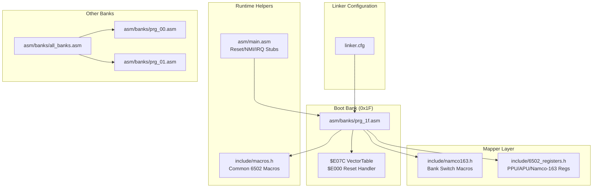
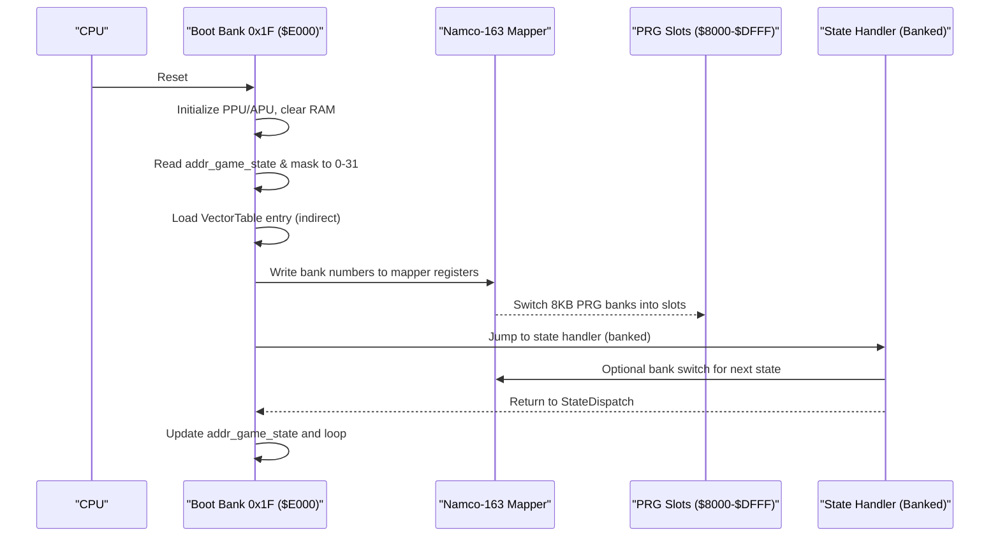
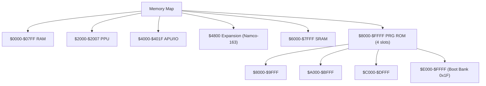
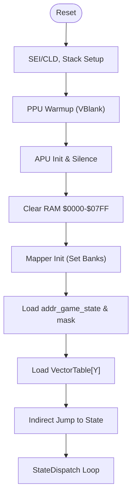
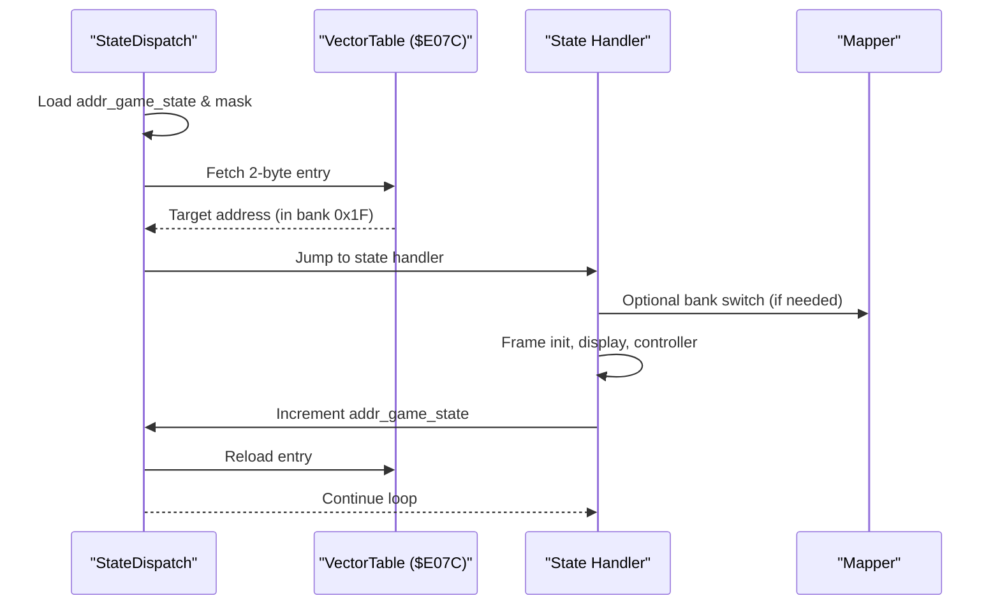
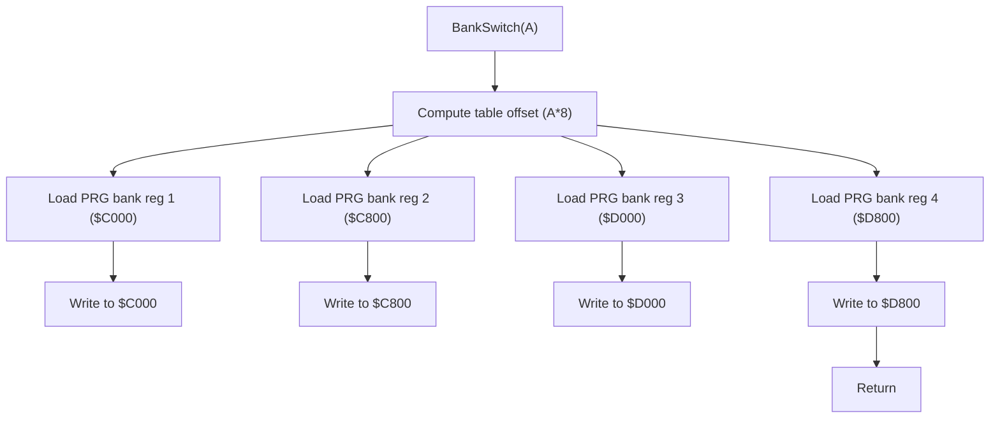
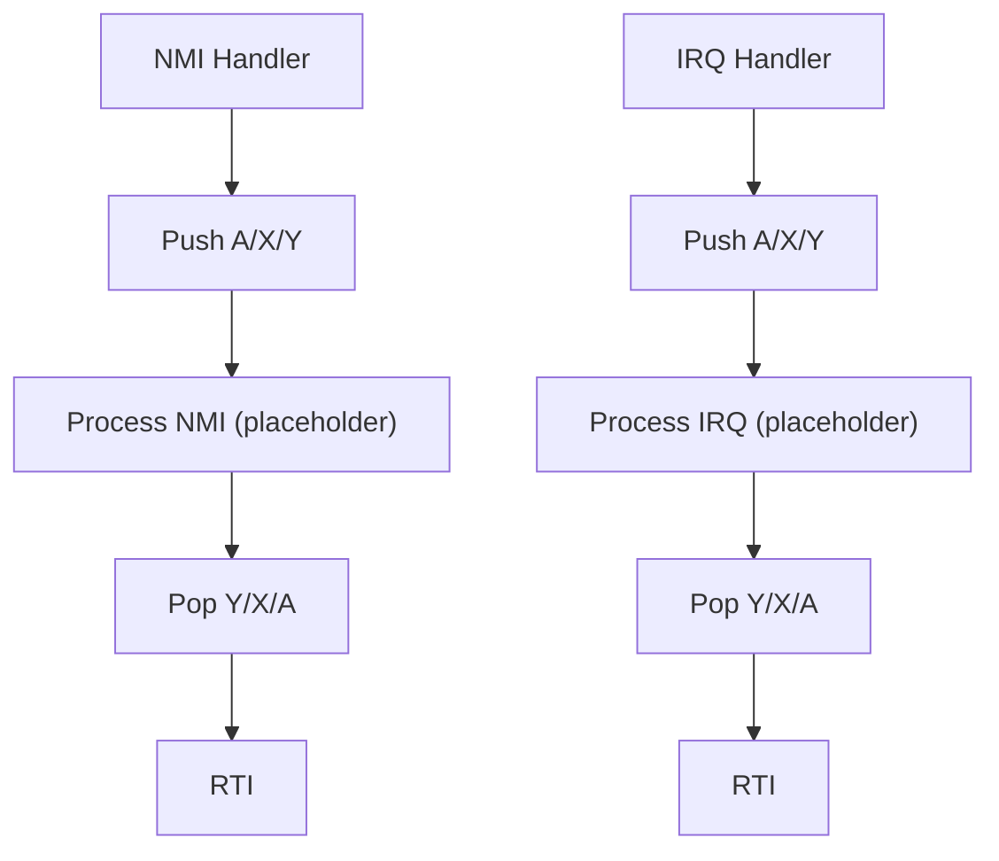
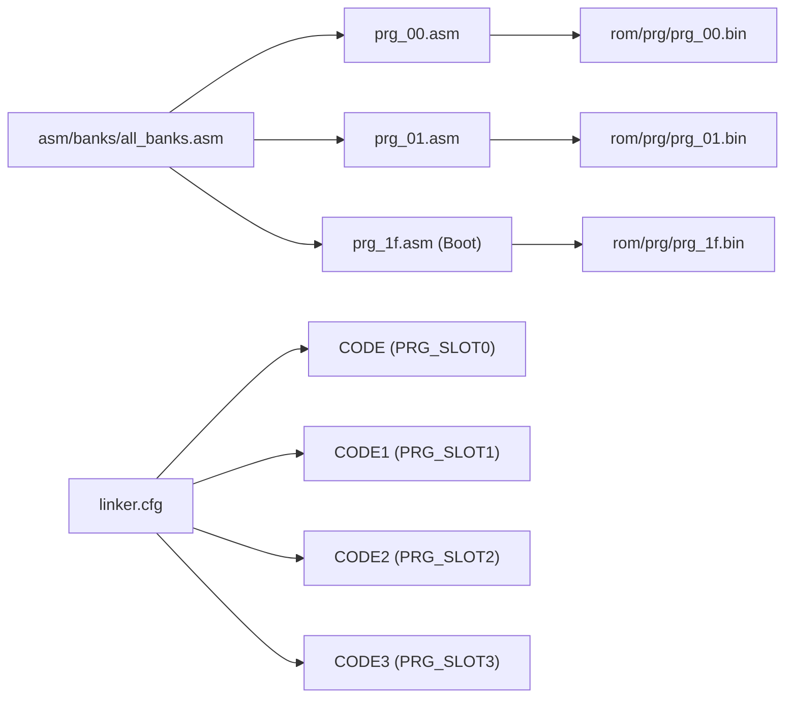
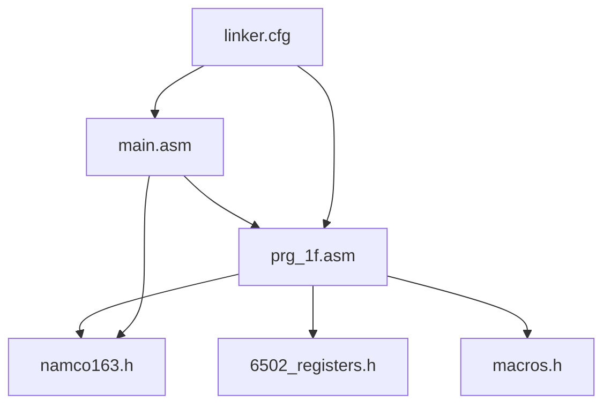

# Assembly Architecture

<cite>
**Referenced Files in This Document**
- [linker.cfg](file://linker.cfg)
- [main.asm](file://asm/main.asm)
- [prg_1f.asm](file://asm/banks/prg_1f.asm)
- [namco163.h](file://include/namco163.h)
- [6502_registers.h](file://include/6502_registers.h)
- [macros.h](file://include/macros.h)
- [all_banks.asm](file://asm/banks/all_banks.asm)
- [prg_00.asm](file://asm/banks/prg_00.asm)
- [prg_01.asm](file://asm/banks/prg_01.asm)
- [PROJECT.md](file://PROJECT.md)
</cite>

## Table of Contents
1. [Introduction](#introduction)
2. [Project Structure](#project-structure)
3. [Core Components](#core-components)
4. [Architecture Overview](#architecture-overview)
5. [Detailed Component Analysis](#detailed-component-analysis)
6. [Dependency Analysis](#dependency-analysis)
7. [Performance Considerations](#performance-considerations)
8. [Troubleshooting Guide](#troubleshooting-guide)
9. [Conclusion](#conclusion)

## Introduction
This document explains the assembly architecture for the Namco-163 (Mapper 19) implementation used in the disassembly of a classic NES strategy game. It focuses on the 32-bank structure with 8KB banks, the fixed boot bank at $E000-$FFFF, the switchable PRG slots at $8000-$DFFF, and the state machine orchestrated by the vector dispatch table at $E07C. It also documents the memory mapping configuration, segment organization, bank switching implementation, interrupt service routines, and the hardware abstraction layer for PPU/APU and the Namco-163 mapper.

## Project Structure
The project is organized around a modular bank-based approach:
- A central linker configuration defines memory layout and segments.
- A main entry module provides reset/NMI/IRQ stubs and initializes the mapper.
- A dedicated boot bank (0x1F) contains the reset handler, state dispatch table, and core runtime helpers.
- Separate bank stubs represent the remaining 31 banks, each mapped to a specific PRG slot.

**Diagram sources**
- [linker.cfg:18-55](file://linker.cfg#L18-L55)
- [prg_1f.asm:13-148](file://asm/banks/prg_1f.asm#L13-L148)
- [namco163.h:65-87](file://include/namco163.h#L65-L87)
- [6502_registers.h:1-88](file://include/6502_registers.h#L1-L88)
- [macros.h:1-72](file://include/macros.h#L1-L72)
- [all_banks.asm:1-38](file://asm/banks/all_banks.asm#L1-L38)
- [prg_00.asm:1-13](file://asm/banks/prg_00.asm#L1-L13)
- [prg_01.asm:1-13](file://asm/banks/prg_01.asm#L1-L13)

**Section sources**
- [PROJECT.md:14-47](file://PROJECT.md#L14-L47)
- [linker.cfg:18-55](file://linker.cfg#L18-L55)
- [all_banks.asm:1-38](file://asm/banks/all_banks.asm#L1-L38)

## Core Components
- Fixed boot bank 0x1F mapped to $E000-$FFFF at startup.
- Vector dispatch table at $E07C orchestrates game flow across execution contexts.
- Four PRG slots ($8000-$FFFF) managed by the Namco-163 mapper via write-only registers.
- Hardware abstraction layer for PPU/APU and mapper register access.
- Modular bank stubs representing 31 additional banks.

**Section sources**
- [PROJECT.md:101-117](file://PROJECT.md#L101-L117)
- [prg_1f.asm:153-169](file://asm/banks/prg_1f.asm#L153-L169)
- [namco163.h:10-17](file://include/namco163.h#L10-L17)
- [6502_registers.h:6-39](file://include/6502_registers.h#L6-L39)

## Architecture Overview
The system uses a state machine driven by a vector table in the boot bank. The reset handler initializes hardware, clears RAM, and dispatches to the first state via an indirect jump. The mapper enables dynamic loading of code from other banks into PRG slots, allowing the state handlers to call bank-switched routines.

**Diagram sources**
- [prg_1f.asm:74-148](file://asm/banks/prg_1f.asm#L74-L148)
- [prg_1f.asm:739-750](file://asm/banks/prg_1f.asm#L739-L750)
- [namco163.h:10-17](file://include/namco163.h#L10-L17)
- [main.asm:115-121](file://asm/main.asm#L115-L121)

## Detailed Component Analysis

### Memory Mapping and Segment Organization
The linker configuration defines:
- Zero-page RAM and uninitialized RAM segments.
- Four PRG slots ($8000-$FFFF) sized 8KB each.
- Segments for code and read-only data, with optional assignments for additional banks.
- The CODE segment starts at PRG_SLOT0 and includes the interrupt vectors at $9FFA.

**Diagram sources**
- [linker.cfg:4-12](file://linker.cfg#L4-L12)
- [linker.cfg:18-30](file://linker.cfg#L18-L30)
- [linker.cfg:32-54](file://linker.cfg#L32-L54)

**Section sources**
- [linker.cfg:18-55](file://linker.cfg#L18-L55)
- [PROJECT.md:70-83](file://PROJECT.md#L70-L83)

### Fixed Boot Bank 0x1F and Reset Flow
- The reset handler at $E000 performs CPU initialization, PPU warmup, APU initialization, and RAM clearing.
- It initializes the mapper and sets the initial game state, then dispatches to the state handler via the vector table.
- The vector table at $E07C contains 15 entries, each a 2-byte address within bank 0x1F.

**Diagram sources**
- [prg_1f.asm:74-148](file://asm/banks/prg_1f.asm#L74-L148)
- [prg_1f.asm:153-169](file://asm/banks/prg_1f.asm#L153-L169)
- [prg_1f.asm:739-750](file://asm/banks/prg_1f.asm#L739-L750)

**Section sources**
- [prg_1f.asm:74-148](file://asm/banks/prg_1f.asm#L74-L148)
- [prg_1f.asm:153-169](file://asm/banks/prg_1f.asm#L153-L169)
- [PROJECT.md:101-117](file://PROJECT.md#L101-L117)

### State Machine and Vector Dispatch
- The game state is stored in a global RAM location and masked to 0-31 to index the vector table.
- Each state handler performs frame initialization, prepares display buffers, calls bank-switched display routines, updates state, and re-invokes the dispatcher.
- The dispatcher reloads the vector table entry and jumps to the next state.

**Diagram sources**
- [prg_1f.asm:739-750](file://asm/banks/prg_1f.asm#L739-L750)
- [prg_1f.asm:153-169](file://asm/banks/prg_1f.asm#L153-L169)

**Section sources**
- [prg_1f.asm:739-750](file://asm/banks/prg_1f.asm#L739-L750)
- [prg_1f.asm:153-169](file://asm/banks/prg_1f.asm#L153-L169)

### Bank Switching Implementation
- The mapper exposes four write-only registers to select 8KB PRG banks for each slot.
- The project provides macros to simplify bank switching for each slot.
- A bank switching helper reads a configuration table and writes to the mapper registers for PRG slots and extended configuration.

**Diagram sources**
- [prg_1f.asm:785-818](file://asm/banks/prg_1f.asm#L785-L818)
- [prg_1f.asm:824-828](file://asm/banks/prg_1f.asm#L824-L828)
- [namco163.h:10-17](file://include/namco163.h#L10-L17)

**Section sources**
- [namco163.h:65-87](file://include/namco163.h#L65-L87)
- [prg_1f.asm:785-818](file://asm/banks/prg_1f.asm#L785-L818)
- [prg_1f.asm:824-828](file://asm/banks/prg_1f.asm#L824-L828)

### Interrupt Service Routines and Hardware Abstraction
- The main module provides minimal NMI and IRQ stubs that preserve registers and return via RTI.
- The boot bank implements PPU initialization helpers and provides macros for common operations like VBlank waits, PPU address setting, and DMA transfers.
- The mapper initialization routine sets up the initial bank configuration for the first three slots.

**Diagram sources**
- [main.asm:65-99](file://asm/main.asm#L65-L99)
- [prg_1f.asm:1040-1065](file://asm/banks/prg_1f.asm#L1040-L1065)
- [macros.h:8-12](file://include/macros.h#L8-L12)

**Section sources**
- [main.asm:65-99](file://asm/main.asm#L65-L99)
- [prg_1f.asm:1040-1065](file://asm/banks/prg_1f.asm#L1040-L1065)
- [macros.h:8-12](file://include/macros.h#L8-L12)

### Modular Assembly Approach and Bank Assignment
- The project uses a modular approach: each bank is represented by a separate assembly stub that includes the corresponding binary.
- The linker configuration assigns segments to specific PRG slots and allows optional assignment of additional banks.
- The include files centralize register definitions and macros for consistent access patterns across banks.

**Diagram sources**
- [all_banks.asm:1-38](file://asm/banks/all_banks.asm#L1-L38)
- [prg_00.asm:1-13](file://asm/banks/prg_00.asm#L1-L13)
- [prg_01.asm:1-13](file://asm/banks/prg_01.asm#L1-L13)
- [linker.cfg:32-54](file://linker.cfg#L32-L54)

**Section sources**
- [all_banks.asm:1-38](file://asm/banks/all_banks.asm#L1-L38)
- [prg_00.asm:1-13](file://asm/banks/prg_00.asm#L1-L13)
- [prg_01.asm:1-13](file://asm/banks/prg_01.asm#L1-L13)
- [linker.cfg:32-54](file://linker.cfg#L32-L54)

## Dependency Analysis
The architecture exhibits clear separation of concerns:
- The boot bank depends on the mapper definitions and register abstractions.
- State handlers depend on the dispatcher and bank switching helpers.
- The linker configuration ties together segments and memory regions.
- The main module coordinates initialization and provides minimal ISR stubs.

**Diagram sources**
- [prg_1f.asm:10-11](file://asm/banks/prg_1f.asm#L10-L11)
- [namco163.h:10-17](file://include/namco163.h#L10-L17)
- [6502_registers.h:6-39](file://include/6502_registers.h#L6-L39)
- [macros.h:1-72](file://include/macros.h#L1-L72)
- [main.asm:6-7](file://asm/main.asm#L6-L7)
- [linker.cfg:18-55](file://linker.cfg#L18-L55)

**Section sources**
- [prg_1f.asm:10-11](file://asm/banks/prg_1f.asm#L10-L11)
- [namco163.h:10-17](file://include/namco163.h#L10-L17)
- [6502_registers.h:6-39](file://include/6502_registers.h#L6-L39)
- [macros.h:1-72](file://include/macros.h#L1-L72)
- [main.asm:6-7](file://asm/main.asm#L6-L7)
- [linker.cfg:18-55](file://linker.cfg#L18-L55)

## Performance Considerations
- Bank switching involves writing to mapper registers; minimize unnecessary switches to reduce overhead.
- Use the provided macros to keep register writes compact and consistent.
- Leverage the vector dispatch to avoid frequent branching and to centralize state transitions.
- Keep PPU/APU operations synchronized with VBlank to prevent flicker and timing issues.

## Troubleshooting Guide
- If the game does not enter the intended state, verify the vector table indexing and ensure the state counter is properly masked.
- If graphics appear incorrect after a bank switch, confirm the mapper register writes and palette upload sequences.
- If interrupts are not firing, ensure PPU control bits are set correctly and that the NMI flag is cleared appropriately.
- Use the provided macros for PPU operations to avoid off-by-one address errors.

**Section sources**
- [prg_1f.asm:739-750](file://asm/banks/prg_1f.asm#L739-L750)
- [prg_1f.asm:1071-1085](file://asm/banks/prg_1f.asm#L1071-L1085)
- [prg_1f.asm:1100-1113](file://asm/banks/prg_1f.asm#L1100-L1113)
- [macros.h:8-12](file://include/macros.h#L8-L12)

## Conclusion
The assembly architecture employs a robust, modular design centered on a fixed boot bank and a vector-driven state machine. The Namco-163 mapper enables efficient bank switching across four PRG slots, while the linker configuration and include files provide a consistent foundation for development. By following the documented patterns for bank assignment, state transitions, and hardware abstraction, developers can extend the disassembly with accurate, maintainable code.