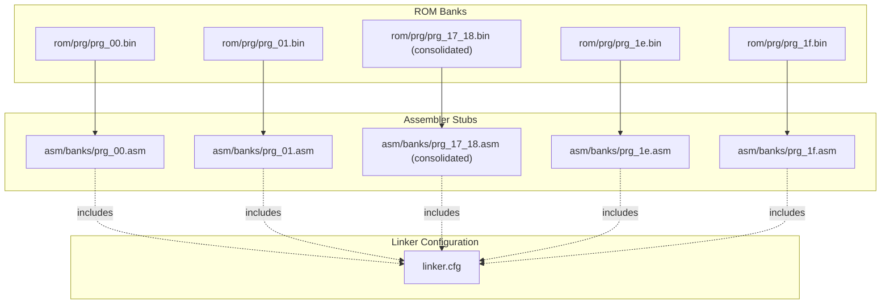
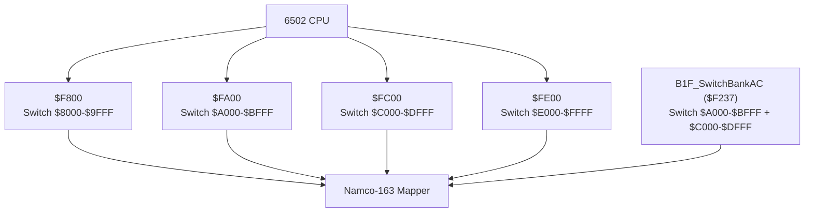
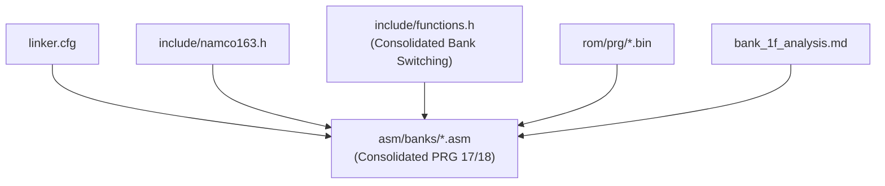

# Bank Organization and Memory Layout

<cite>
**Referenced Files in This Document**
- [linker.cfg](file://linker.cfg)
- [PROJECT.md](file://PROJECT.md)
- [namco163.h](file://include/namco163.h)
- [functions.h](file://include/functions.h)
- [all_banks.asm](file://asm/banks/all_banks.asm)
- [prg_00.asm](file://asm/banks/prg_00.asm)
- [prg_01.asm](file://asm/banks/prg_01.asm)
- [prg_17_18.asm](file://asm/banks/prg_17_18.asm)
- [prg_1e.asm](file://asm/banks/prg_1e.asm)
- [prg_1f.asm](file://asm/banks/prg_1f.asm)
- [bank_1f_analysis.md](file://code/bank_1f_analysis.md)
- [bank_1f_plan.md](file://code/bank_1f_plan.md)
- [Makefile](file://Makefile)
- [main.lst](file://build/main.lst)
</cite>

## Update Summary
**Changes Made**
- Updated consolidated bank switching mechanism for PRG banks $17 and $18
- Revised bank organization documentation to reflect unified 16KB block at $A000-$DFFF
- Updated practical distribution examples to show consolidated bank approach
- Modified bank switching examples to demonstrate new consolidated mechanism
- Updated dependency analysis to reflect structural changes

## Table of Contents
1. [Introduction](#introduction)
2. [Project Structure](#project-structure)
3. [Core Components](#core-components)
4. [Architecture Overview](#architecture-overview)
5. [Detailed Component Analysis](#detailed-component-analysis)
6. [Dependency Analysis](#dependency-analysis)
7. [Performance Considerations](#performance-considerations)
8. [Troubleshooting Guide](#troubleshooting-guide)
9. [Conclusion](#conclusion)

## Introduction
This document explains the bank organization and memory layout used by the Sango2DASM project for the Namco-163 (Mapper 19) implementation. It covers the 32-bank structure with 8KB banks, the fixed boot bank 0x1F mapped to $E000-$FFFF, the three switchable PRG slots at $8000-$DFFF, and the memory mapping configuration defined in linker.cfg. The document has been updated to reflect the recent consolidation of PRG banks $17 and $18 into a unified 16KB block at $A000-$DFFF, replacing the previous separate bank management approach with a consolidated bank switching mechanism. Practical examples show how code is distributed across banks, how bank numbers relate to memory addresses, and how the 6502 address space is utilized. It also documents bank switching mechanisms, memory overlap considerations, and the rationale behind the 8KB bank size.

## Project Structure
The project organizes PRG banks as 32 individual 8KB files (rom/prg/prg_XX.bin), each mapped into one of four PRG slots on the 6502 address bus. The linker.cfg defines the four PRG slots and how segments are loaded into them. The bank stub files under asm/banks/ include the ROM binaries and provide placeholders for disassembly. The include/namco163.h file defines mapper registers and bank switching macros. **Updated**: PRG banks $17 and $18 are now consolidated into a single prg_17_18.asm file that occupies both $A000-$BFFF and $C000-$DFFF, providing 16KB of unified code space.

**Diagram sources**
- [all_banks.asm:28](file://asm/banks/all_banks.asm#L28)
- [prg_17_18.asm:1-800](file://asm/banks/prg_17_18.asm#L1-L800)
- [linker.cfg:18-55](file://linker.cfg#L18-L55)

**Section sources**
- [PROJECT.md:14-47](file://PROJECT.md#L14-L47)
- [linker.cfg:18-55](file://linker.cfg#L18-L55)
- [all_banks.asm:1-37](file://asm/banks/all_banks.asm#L1-L37)

## Core Components
- 32 PRG banks × 8KB = 256KB total PRG ROM
- Four PRG slots on the 6502 address bus:
  - Slot 0: $8000-$9FFF (8KB)
  - Slot 1: $A000-$BFFF (8KB)
  - Slot 2: $C000-$DFFF (8KB)
  - Slot 3: $E000-$FFFF (8KB)
- Fixed boot bank 0x1F mapped to $E000-$FFFF at reset
- Bank switching controlled via mapper registers at $F800-$FE00
- **Updated**: Consolidated bank switching mechanism for PRG banks $17 and $18 using unified 16KB block at $A000-$DFFF

Key implementation references:
- Memory map and slot definitions in linker.cfg
- Bank indices and macros in include/namco163.h
- Consolidated bank stubs for PRG banks $17/$18 in asm/banks/prg_17_18.asm
- Bank switching helpers in include/functions.h
- Boot bank 0x1F and vector table in bank_1f_analysis.md

**Section sources**
- [linker.cfg:14-30](file://linker.cfg#L14-L30)
- [PROJECT.md:70-117](file://PROJECT.md#L70-L117)
- [namco163.h:10-14](file://include/namco163.h#L10-L14)
- [functions.h:187-190](file://include/functions.h#L187-L190)
- [prg_1f.asm:1-148](file://asm/banks/prg_1f.asm#L1-L148)

## Architecture Overview
The system uses a 4-slot PRG mapping scheme with 8KB banks. At reset, bank 0x1F is fixed in slot 3 ($E000-$FFFF). The remaining three slots ($8000-$DFFF) are switchable via mapper registers. **Updated**: PRG banks $17 and $18 are now managed as a consolidated unit, sharing the $A000-$DFFF address space through unified bank switching routines. Bank switching is performed by writing the desired bank number to specific addresses.

**Diagram sources**
- [PROJECT.md:84-94](file://PROJECT.md#L84-L94)
- [namco163.h:10-14](file://include/namco163.h#L10-L14)
- [functions.h:187-188](file://include/functions.h#L187-L188)

**Section sources**
- [PROJECT.md:84-117](file://PROJECT.md#L84-L117)
- [namco163.h:68-87](file://include/namco163.h#L68-L87)
- [functions.h:187-188](file://include/functions.h#L187-L188)

## Detailed Component Analysis

### 32-Bank Structure and Address Mapping
- Bank numbering: 0x00 through 0x1F (32 banks)
- Each bank: 8KB ($0000-$1FFF within bank)
- Slots:
  - $8000-$9FFF: Slot 0 (switchable via $F800)
  - $A000-$BFFF: Slot 1 (switchable via $FA00)
  - $C000-$DFFF: Slot 2 (switchable via $FC00)
  - $E000-$FFFF: Slot 3 (fixed boot bank 0x1F via $FE00)

**Updated**: PRG banks $17 and $18 are now consolidated into a single 16KB block occupying both $A000-$BFFF and $C000-$DFFF. This consolidation allows the $A000-$BFFF and $C000-$DFFF slots to be switched as a unified pair using the SwitchBankAC routines.

Memory mapping configuration in linker.cfg:
- MEMORY regions define four PRG slots with fill and fillval
- SEGMENTS map code and data into these slots
- CODE segment defaults to PRG slot 0; optional CODE0/CODE1/CODE2/CODE3 map to slots 0/1/2/3 respectively
- RODATA segments can be placed in any slot

Practical distribution examples:
- Bank 0x00: $8000-$9FFF (mapped via slot 0)
- Bank 0x01: $A000-$BFFF (mapped via slot 1)
- **Updated**: Bank 0x17/$0x18: $A000-$DFFF (consolidated 16KB block via SwitchBankAC)
- Bank 0x1E: $C000-$DFFF (mapped via slot 2)
- Bank 0x1F: $E000-$FFFF (boot bank, fixed)

**Section sources**
- [linker.cfg:18-55](file://linker.cfg#L18-L55)
- [PROJECT.md:70-83](file://PROJECT.md#L70-L83)
- [prg_00.asm:1-13](file://asm/banks/prg_00.asm#L1-L13)
- [prg_01.asm:1-13](file://asm/banks/prg_01.asm#L1-L13)
- [prg_17_18.asm:1-8](file://asm/banks/prg_17_18.asm#L1-L8)
- [prg_1e.asm:1-13](file://asm/banks/prg_1e.asm#L1-L13)
- [prg_1f.asm:1-13](file://asm/banks/prg_1f.asm#L1-L13)

### Fixed Boot Bank 0x1F at $E000-$FFFF
- Bank 0x1F is mapped to $E000-$FFFF at reset
- Contains reset handler, vector dispatch table, and core runtime functions
- Interrupt vectors are located at $FFFA-$FFFF:
  - NMI: $F800
  - RESET: $E000
  - IRQ: $FB2D

Boot sequence and dispatch:
- Reset handler initializes hardware, clears RAM, and reads the vector table at $E07C
- The vector table holds 15 entries (2 bytes each) for game states
- The state counter at $007A determines which entry to jump to

#### Bank 1F Region Map

| Address Range | Size | Purpose |
|---|---|---|
| $E000–$E079 | 121B | **Reset Handler** — PPU/APU init, RAM clear, mapper init |
| $E07C–$E099 | 30B | **Vector Dispatch Table** — 15 state entry points indexed by `$007A` |
| $E09A–$E4D8 | ~1KB | **Game State Handlers** — system init, new game, kingdom select, domestic affairs, battle, territory, advisor, turn summary, idle waits |
| $E4DA–$E566 | ~110B | **Core Helpers** — FrameInit, BankSwitch (8-byte Namco-163 config) |
| $E57F–$E6C5 | ~295B | **Sound Engine** — init, wavetable upload, note player, 8 sound wrappers |
| $E6C6–$E8B9 | ~470B | **Controller I/O + RNG** — controller read, palette upload, PPU helpers, 6 RNG functions + 256-byte random table |
| $E8BA–$E9B9 | 256B | **RNG Data Table** — pre-computed random bytes |
| $E9BA–$EC66 | ~685B | **Math Library** — BCD↔binary, 16/24-bit division, 24x8/24x16 multiply, mul-div-100, callback dispatcher |
| $EC67–$ED18 | ~178B | **Palette Animation** — color rotation effects |
| $ED19–$EE51 | ~310B | **Menu Cursor System** — 8 entry points (1–8 items/page), D-pad navigation, banked callback trampoline |
| $EE53–$F076 | ~550B | **NMI Sub-Dispatch + PPU Tile Writers** — BG/sprite/attribute tile writes |
| $F077–$F2AE | ~570B | **Sprite OAM, CHR Banking, Window Setup** — OAM writers, CHR bank switch, display setup |
| $F2AF–$F3BC | ~205B | **Data Access Functions** — hero/city/kingdom/kata-name address calculators |
| $F3BD–$F476 | ~185B | **Mapper Init + RAM Test** — controller validation, RAM integrity check |
| $F477–$F676 | 512B | **Sound/Music Data** — instrument definitions |
| $F677–$F7FF | 392B | Padding ($FF) |
| $F800–$FAA8 | 680B | **NMI Handler** — 8 sub-states dispatched by `$0078` |
| $FAA9–$FB2C | ~120B | **Palette Swap + Controller Read** — with NMI scroll mode |
| $FB2D–$FF5E | 990B | **IRQ Handler** — 14+ sub-states for mid-frame raster/CHR effects |
| $FF62–$FFD6 | ~115B | **Scroll Calculations** — two variants |
| $FFD7–$FFF9 | 35B | Padding |
| $FFFA–$FFFF | 6B | **Interrupt Vectors** |

#### Game State Machine (Vector Table at $E07C)

| # | Address | Name | Description |
|---|---------|------|-------------|
| 0 | $E09A | System Init | PPU setup, transition to state 9 |
| 1 | $E0DA | New Game Init | Display, SRAM init, music $81 |
| 2 | $E17D | Random + Display (Y=$2A) | Brief transition |
| 3 | $E18B | Kingdom Select | Scenario/normal mode selection |
| 4 | $E221 | Random + Display (Y=$28) | Brief transition |
| 5 | $E22F | Domestic Affairs | Action selection (farming, commerce, etc.) |
| 6 | $E2E2 | RNG Advance | Pure random seed advance |
| 7 | $E2E8 | Battle Phase | Combat with army status check |
| 8 | $E36A | RNG Advance | Pure random seed advance |
| 9 | $E37C | Territory/Map View | Game map display |
| 10 | $E3EB | Idle/Wait | NMI frame wait |
| 11 | $E3EE | Advisor/Council | Advisor dialogue |
| 12 | $E3EB | Idle/Wait | NMI frame wait |
| 13 | $E46A | Turn Summary | End-of-turn report |
| 14 | $E3EB | Idle/Wait | NMI frame wait |

**Section sources**
- [prg_1f.aligned.asm:1-50](file://asm/banks/prg_1f.aligned.asm#L1-L50)
- [bank_1f_analysis.md:1-11](file://code/bank_1f_analysis.md#L1-L11)
- [bank_1f_analysis.md:22-45](file://code/bank_1f_analysis.md#L22-L45)
- [bank_1f_analysis.md:54-77](file://code/bank_1f_analysis.md#L54-L77)
- [bank_1f_function_table.md:1-98](file://code/bank_1f_function_table.md#L1-L98)

### Three Switchable PRG Slots at $8000-$DFFF
- Slot 0: $8000-$9FFF (switchable via $F800)
- Slot 1: $A000-$BFFF (switchable via $FA00)
- Slot 2: $C000-$DFFF (switchable via $FC00)
- Slot 3: $E000-$FFFF (fixed to bank 0x1F via $FE00)

**Updated**: Consolidated bank switching for PRG banks $17/$18:
- The $A000-$BFFF and $C000-$DFFF slots are now managed as a unified pair
- Bank switching uses B1F_SwitchBankAC routines (B1F_SwitchBankAC_A/B) instead of individual $FA00/$FC00 writes
- Bank parameter Y determines both $A000-$BFFF and $C000-$DFFF banks simultaneously

Bank switching macros:
- switch_bank_8000(BANK_XX)
- switch_bank_A000(BANK_XX)
- switch_bank_C000(BANK_XX)
- switch_bank_E000(BANK_XX)

**Section sources**
- [PROJECT.md:84-94](file://PROJECT.md#L84-L94)
- [namco163.h:68-87](file://include/namco163.h#L68-L87)
- [functions.h:187-188](file://include/functions.h#L187-L188)

### Memory Mapping Configuration in linker.cfg
- MEMORY:
  - ZEROPAGE: $0000-$00FF
  - RAM: $0100-$07FF
  - PRG_SLOT0: $8000-$9FFF
  - PRG_SLOT1: $A000-$BFFF
  - PRG_SLOT2: $C000-$DFFF
  - PRG_SLOT3: $E000-$FFFF
- SEGMENTS:
  - ZEROPAGE: maps to ZEROPAGE
  - BSS: maps to RAM
  - CODE: maps to PRG_SLOT0 (reset/NMI/IRQ vectors)
  - VECTORS: maps to PRG_SLOT0, starts at $9FFA
  - CODE0/CODE1/CODE2/CODE3: optional segments for banked code
  - RODATA/RODATA0/RODATA1/RODATA2: optional read-only data segments

**Updated**: Segment organization for consolidated banks:
- CODE_BANK17_18: load = PRG_SLOT1, type = ro, optional = yes (maps to $A000-$BFFF)
- CODE_BANK18: load = PRG_SLOT2, type = ro, optional = yes (maps to $C000-$DFFF)
- Both segments share the same source file (prg_17_18.asm) but are loaded into different slots

Segment organization strategy:
- Place reset/NMI/IRQ vectors in CODE/VECTORS so they remain accessible from slot 0
- Use CODE0/CODE1/CODE2/CODE3 to allocate additional code to slots 0/1/2/3
- Use RODATA segments to place constants and tables in appropriate slots
- **Updated**: Consolidated bank 17/18 code uses CODE_BANK17_18 segment for unified management

**Section sources**
- [linker.cfg:18-55](file://linker.cfg#L18-L55)

### Practical Distribution Examples
- Bank 0x00: $8000-$9FFF
  - Stub: asm/banks/prg_00.asm includes rom/prg/prg_00.bin
- Bank 0x01: $A000-$BFFF
  - Stub: asm/banks/prg_01.asm includes rom/prg/prg_01.bin
- **Updated**: Banks 0x17/$0x18: $A000-$DFFF (consolidated)
  - Stub: asm/banks/prg_17_18.asm includes rom/prg/prg_17_18.bin
  - Contains domestic/kingdom display functions at $A000-$A029
  - Provides unified 16KB code space for both $A000-$BFFF and $C000-$DFFF
- Bank 0x1E: $C000-$DFFF
  - Stub: asm/banks/prg_1e.asm includes rom/prg/prg_1e.bin
- Bank 0x1F: $E000-$FFFF
  - Stub: asm/banks/prg_1f.asm includes rom/prg/prg_1f.bin
  - Contains boot code and dispatch logic

**Updated**: Consolidated bank switching in practice:
- To call bank-switched functions in $A000-$A029, bank 0x1F writes a JMP instruction into RAM at $00A5 and also writes to mapper register $F800 to patch the mapper
- **Updated**: For consolidated bank 0x17/$0x18, bank 0x1F uses B1F_SwitchBankAC routines to switch both $A000-$BFFF and $C000-$DFFF simultaneously
- Bank switching routine reads a configuration table and writes to mapper registers $C000/$C800/$D000/$D800

**Section sources**
- [prg_00.asm:1-13](file://asm/banks/prg_00.asm#L1-L13)
- [prg_01.asm:1-13](file://asm/banks/prg_01.asm#L1-L13)
- [prg_17_18.asm:1-8](file://asm/banks/prg_17_18.asm#L1-L8)
- [prg_1e.asm:1-13](file://asm/banks/prg_1e.asm#L1-L13)
- [prg_1f.asm:1-13](file://asm/banks/prg_1f.asm#L1-L13)
- [bank_1f_analysis.md:80-111](file://code/bank_1f_analysis.md#L80-L111)
- [bank_1f_analysis.md:499-533](file://code/bank_1f_analysis.md#L499-L533)

### Relationship Between Bank Numbers and Memory Addresses
- Bank 0x00 maps to $8000-$9FFF
- Bank 0x01 maps to $A000-$BFFF
- **Updated**: Banks 0x17/$0x18 map to $A000-$DFFF (consolidated 16KB block)
- Bank 0x1E maps to $C000-$DFFF
- Bank 0x1F maps to $E000-$FFFF (fixed)

**Updated**: Consolidated bank relationship:
- Bank 0x17 provides code for $A000-$BFFF (slot 1)
- Bank 0x18 provides code for $C000-$DFFF (slot 2)
- Together they form a unified 16KB block at $A000-$DFFF
- Bank switching uses B1F_SwitchBankAC routines to manage both slots simultaneously

This mapping is enforced by the mapper registers:
- $F800 selects bank for $8000-$9FFF
- $FA00 selects bank for $A000-$BFFF
- $FC00 selects bank for $C000-$DFFF
- $FE00 selects bank for $E000-$FFFF

**Section sources**
- [PROJECT.md:84-94](file://PROJECT.md#L84-L94)
- [namco163.h:10-14](file://include/namco163.h#L10-L14)
- [functions.h:316-332](file://include/functions.h#L316-L332)

### 6502 Address Space Utilization
- $0000-$07FF: 2KB RAM (including zero page)
- $2000-$2007: PPU registers
- $4000-$401F: APU/IO registers
- $6000-$7FFF: SRAM (8KB)
- $8000-$FFFF: PRG ROM (switchable 8KB banks)
  - $8000-$9FFF: Slot 0 (switchable)
  - $A000-$BFFF: Slot 1 (switchable)
  - $C000-$DFFF: Slot 2 (switchable)
  - $E000-$FFFF: Slot 3 (boot bank 0x1F)

**Updated**: Consolidated bank utilization:
- $A000-$BFFF: Slot 1 - Bank 0x17 (domestic/kingdom display)
- $C000-$DFFF: Slot 2 - Bank 0x18 (paired with bank 0x17)
- **New**: Unified 16KB block at $A000-$DFFF managed by consolidated bank switching

Bank switching occurs by writing to mapper registers at $F800-$FE00. The mapper decodes the bank number and maps it into the selected 8KB window. **Updated**: Consolidated banks use specialized switching routines for unified management.

**Section sources**
- [linker.cfg:4-12](file://linker.cfg#L4-L12)
- [PROJECT.md:70-83](file://PROJECT.md#L70-L83)
- [PROJECT.md:84-94](file://PROJECT.md#L84-L94)
- [functions.h:316-332](file://include/functions.h#L316-L332)

### Bank Switching Mechanisms
- Writing bank number to $F800 switches $8000-$9FFF
- Writing bank number to $FA00 switches $A000-$BFFF
- Writing bank number to $FC00 switches $C000-$DFFF
- Writing bank number to $FE00 switches $E000-$FFFF

**Updated**: Consolidated bank switching:
- B1F_SwitchBankAC_A/B routines switch both $A000-$BFFF and $C000-$DFFF simultaneously
- Uses bank parameter Y to set both slots to related bank numbers
- Bank 0x17 at $A000-$BFFF paired with bank 0x18 at $C000-$DFFF
- Provides unified access to 16KB of code space for domestic/kingdom display functions

The bank switching routine in bank 0x1F demonstrates how configurations are applied:
- Reads a table of 8-byte bank configurations
- Writes the first 4 bytes to mapper registers $C000/$C800/$D000/$D800
- Stores the last 4 bytes in RAM for later use

**Section sources**
- [PROJECT.md:84-94](file://PROJECT.md#L84-L94)
- [functions.h:187-188](file://include/functions.h#L187-L188)
- [bank_1f_analysis.md:499-533](file://code/bank_1f_analysis.md#L499-L533)

### Memory Overlap Considerations
- Bank 0x1F is fixed in slot 3 ($E000-$FFFF) at boot
- Other banks can be mapped into slots 0/1/2 at runtime
- **Updated**: Consolidated banks $17/$18 overlap in the $A000-$DFFF region but are managed as a unified pair
- Care must be taken when bank-switching to avoid clobbering code or data currently resident in the target slot
- **Updated**: Consolidated bank switching uses B1F_SwitchBankAC routines to prevent slot conflicts
- Bank 0x1F's bank-switching routine stores configuration in RAM ($00E6-$00ED) to preserve state across switches

**Section sources**
- [PROJECT.md:116-117](file://PROJECT.md#L116-L117)
- [bank_1f_analysis.md:499-533](file://code/bank_1f_analysis.md#L499-L533)
- [functions.h:316-332](file://include/functions.h#L316-L332)

### Rationale Behind the 8KB Bank Size Limitation
- 8KB aligns with the mapper's granularity for PRG bank switching
- Provides sufficient space for code and data while keeping the number of banks manageable (32 banks)
- Allows efficient bank switching with minimal overhead
- **Updated**: Consolidation of banks $17/$18 demonstrates the benefits of unified management for related functionality
- The linker.cfg and bank stubs reflect this constraint by organizing code into 8KB segments
- **New**: Consolidated approach reduces complexity for related functions that benefit from shared memory space

**Section sources**
- [linker.cfg:14-16](file://linker.cfg#L14-L16)
- [PROJECT.md:8-12](file://PROJECT.md#L8-L12)
- [prg_17_18.asm:1-8](file://asm/banks/prg_17_18.asm#L1-L8)

## Dependency Analysis
The bank organization depends on several components working together:
- linker.cfg defines the memory layout and segment-to-slot mapping
- include/namco163.h provides bank indices and macros for bank switching
- **Updated**: include/functions.h provides consolidated bank switching helpers (B1F_SwitchBankAC_A/B)
- asm/banks/* stubs include the ROM binaries for each bank
- **Updated**: Consolidated bank stubs for PRG banks $17/$18 in asm/banks/prg_17_18.asm
- bank_1f_analysis.md documents the boot bank's role and dispatch mechanism

**Diagram sources**
- [linker.cfg:18-55](file://linker.cfg#L18-L55)
- [namco163.h:30-62](file://include/namco163.h#L30-L62)
- [functions.h:187-188](file://include/functions.h#L187-L188)
- [all_banks.asm:1-38](file://asm/banks/all_banks.asm#L1-L38)
- [prg_17_18.asm:1-8](file://asm/banks/prg_17_18.asm#L1-L8)
- [bank_1f_analysis.md:1-11](file://code/bank_1f_analysis.md#L1-L11)

**Section sources**
- [linker.cfg:18-55](file://linker.cfg#L18-L55)
- [namco163.h:30-62](file://include/namco163.h#L30-L62)
- [functions.h:187-188](file://include/functions.h#L187-L188)
- [all_banks.asm:1-38](file://asm/banks/all_banks.asm#L1-L38)
- [prg_17_18.asm:1-8](file://asm/banks/prg_17_18.asm#L1-L8)
- [bank_1f_analysis.md:1-11](file://code/bank_1f_analysis.md#L1-L11)

## Performance Considerations
- Bank switching involves writing to mapper registers and potentially updating RAM copies of bank registers
- **Updated**: Consolidated bank switching reduces switching overhead for related functions
- Frequent bank switching can introduce overhead; minimize unnecessary switches
- **Updated**: Consolidated banks eliminate the need for separate slot management for paired functionality
- Place frequently accessed data and code in the same bank to reduce switching frequency
- Use the bank switching configuration table to batch changes when possible
- **New**: Consolidated approach improves cache locality for related domestic/kingdom display functions

## Troubleshooting Guide
Common issues and resolutions:
- Incorrect bank mapping at runtime:
  - Verify mapper register writes and bank indices
  - Ensure bank switching macros are used consistently
  - **Updated**: For consolidated banks, use B1F_SwitchBankAC routines instead of individual slot writes
- Vector table misreads:
  - Confirm the state counter mask and indexing logic
  - Validate vector table entries and bounds
- Bank collision:
  - Ensure bank-switched code does not overwrite active code in the target slot
  - Use RAM patches (e.g., $00A5) and mapper register writes carefully
  - **Updated**: Consolidated bank switching prevents slot conflicts through unified management
- **New**: Consolidated bank switching issues:
  - Verify B1F_SwitchBankAC parameter Y contains correct bank number
  - Ensure both $A000-$BFFF and $C000-$DFFF are intended for the same functional area
  - Check that bank 0x17 and 0x18 are properly paired in the switching routine

**Section sources**
- [bank_1f_analysis.md:54-77](file://code/bank_1f_analysis.md#L54-L77)
- [bank_1f_analysis.md:499-533](file://code/bank_1f_analysis.md#L499-L533)
- [functions.h:316-332](file://include/functions.h#L316-L332)

## Conclusion
The Sango2DASM project employs a 32-bank, 8KB-per-bank scheme with four PRG slots on the 6502 address bus. Bank 0x1F is fixed at $E000-$FFFF and serves as the boot bank, while slots 0/1/2 are switchable via mapper registers. **Updated**: PRG banks $17 and $18 have been consolidated into a unified 16KB block at $A000-$DFFF, managed through specialized bank switching routines. The linker.cfg defines the memory layout and segment-to-slot mapping, and the bank stubs integrate ROM binaries into the build. **Updated**: The consolidated approach simplifies management of related functionality while maintaining the flexibility of the 8KB bank architecture. Bank switching is handled through macros and a configuration table, with specialized routines for consolidated bank management, enabling flexible code distribution across banks. Understanding these relationships is essential for accurate disassembly and reliable runtime behavior.