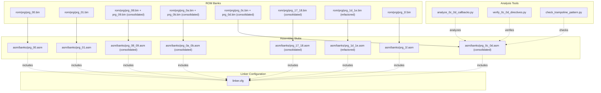
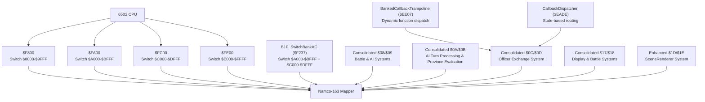
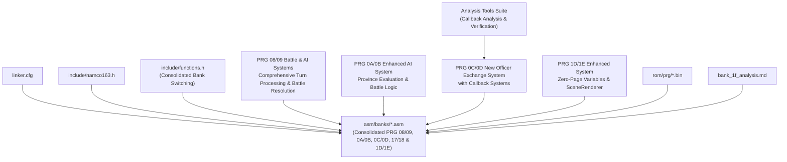

# Bank Organization and Memory Layout

<cite>
**Referenced Files in This Document**
- [linker.cfg](file://linker.cfg)
- [PROJECT.md](file://PROJECT.md)
- [namco163.h](file://include/namco163.h)
- [functions.h](file://include/functions.h)
- [all_banks.asm](file://asm/banks/all_banks.asm)
- [prg_0a_0b.asm](file://asm/banks/prg_0a_0b.asm)
- [prg_0c_0d.asm](file://asm/banks/prg_0c_0d.asm)
- [prg_17_18.asm](file://asm/banks/prg_17_18.asm)
- [prg_1d_1e.asm](file://asm/banks/prg_1d_1e.asm)
- [prg_08_09.asm](file://asm/banks/prg_08_09.asm)
- [prg_08.asm](file://asm/banks/prg_08.asm)
- [prg_09.asm](file://asm/banks/prg_09.asm)
- [bank_1f_analysis.md](file://code/bank_1f_analysis.md)
- [bank_1f_plan.md](file://code/bank_1f_plan.md)
- [Makefile](file://Makefile)
- [analyze_0c_0d_callbacks.py](file://tools/analyze_0c_0d_callbacks.py)
- [verify_0c_0d_directives.py](file://tools/verify_0c_0d_directives.py)
- [check_trampoline_pattern.py](file://tools/check_trampoline_pattern.py)
</cite>

## Update Summary
**Changes Made**
- Added comprehensive documentation for the new combined PRG banks $08/$09 containing battle and AI systems
- Updated all_banks.asm to reflect the new bank structure with prg_08_09.asm inclusion
- Enhanced coverage of the sophisticated AI turn processing system with province evaluation logic
- Documented the complete battle system implementation including BattleSetup, BattlePhaseProcess, and BattleCasualtyResolution
- Updated practical examples to include the new battle and AI functionality in the consolidated bank structure

## Table of Contents
1. [Introduction](#introduction)
2. [Project Structure](#project-structure)
3. [Core Components](#core-components)
4. [Architecture Overview](#architecture-overview)
5. [Detailed Component Analysis](#detailed-component-analysis)
6. [Dependency Analysis](#dependency-analysis)
7. [Performance Considerations](#performance-considerations)
8. [Troubleshooting Guide](#troubleshooting-guide)
9. [Conclusion](#conclusion)

## Introduction
This document explains the bank organization and memory layout used by the Sango2DASM project for the Namco-163 (Mapper 19) implementation. It covers the 32-bank structure with 8KB banks, the fixed boot bank 0x1F mapped to $E000-$FFFF, the three switchable PRG slots at $8000-$DFFF, and the memory mapping configuration defined in linker.cfg. The document has been updated to reflect the recent consolidation of PRG banks $0A/$0B, $0C/$0D, $17/$18, and $1D/$1E into unified 16KB blocks at $A000-$DFFF, replacing the previous separate bank management approach with a consolidated bank switching mechanism. **Updated**: Recent major enhancements include the addition of combined PRG banks $08/$09 containing sophisticated battle and AI systems, providing comprehensive province evaluation logic, army calculations, and battle resolution mechanics. **New**: The PRG banks $08/$09 implement a complete AI turn processing system with officer action decision-making, movement engines, and strategic command validation, alongside a full battle system with phase-based execution and casualty resolution. Practical examples show how code is distributed across banks, how bank numbers relate to memory addresses, and how the 6502 address space is utilized. It also documents bank switching mechanisms, memory overlap considerations, and the rationale behind the 8KB bank size limitation.

## Project Structure
The project organizes PRG banks as 32 individual 8KB files (rom/prg/prg_XX.bin), each mapped into one of four PRG slots on the 6502 address bus. The linker.cfg defines the four PRG slots and how segments are loaded into them. The bank stub files under asm/banks/ include the ROM binaries and provide placeholders for disassembly. The include/namco163.h file defines mapper registers and bank switching macros. **Updated**: PRG banks $08/$09, $0A/$0B, $0C/$0D, $17/$18, and $1D/$1E are now consolidated into single files that occupy both $A000-$BFFF and $C000-$DFFF, providing unified 16KB code spaces. **New**: PRG banks $08/$09 provide a comprehensive battle and AI system following the established consolidation pattern, featuring advanced AI turn processing, officer action dispatching, and complete battle phase management.

**Diagram sources**
- [all_banks.asm:13](file://asm/banks/all_banks.asm#L13)
- [all_banks.asm:14](file://asm/banks/all_banks.asm#L14)
- [all_banks.asm:16](file://asm/banks/all_banks.asm#L16)
- [all_banks.asm:27](file://asm/banks/all_banks.asm#L27)
- [all_banks.asm:32](file://asm/banks/all_banks.asm#L32)
- [prg_08_09.asm:1-7](file://asm/banks/prg_08_09.asm#L1-L7)
- [prg_0a_0b.asm:1-8](file://asm/banks/prg_0a_0b.asm#L1-L8)
- [prg_0c_0d.asm:1-8](file://asm/banks/prg_0c_0d.asm#L1-L8)
- [prg_17_18.asm:1-8](file://asm/banks/prg_17_18.asm#L1-L8)
- [prg_1d_1e.asm:1-10](file://asm/banks/prg_1d_1e.asm#L1-L10)
- [linker.cfg:41-43](file://linker.cfg#L41-L43)
- [linker.cfg:45-47](file://linker.cfg#L45-L47)
- [linker.cfg:49-51](file://linker.cfg#L49-L51)
- [linker.cfg:64-66](file://linker.cfg#L64-L66)
- [linker.cfg:74-76](file://linker.cfg#L74-L76)

**Section sources**
- [PROJECT.md:14-47](file://PROJECT.md#L14-L47)
- [linker.cfg:18-55](file://linker.cfg#L18-L55)
- [all_banks.asm:1-34](file://asm/banks/all_banks.asm#L1-L34)

## Core Components
- 32 PRG banks × 8KB = 256KB total PRG ROM
- Four PRG slots on the 6502 address bus:
  - Slot 0: $8000-$9FFF (8KB)
  - Slot 1: $A000-$BFFF (8KB)
  - Slot 2: $C000-$DFFF (8KB)
  - Slot 3: $E000-$FFFF (8KB)
- Fixed boot bank 0x1F mapped to $E000-$FFFF at reset
- Bank switching controlled via mapper registers at $F800-$FE00
- **Updated**: Consolidated bank switching mechanism for PRG banks $08/$09, $0A/$0B, $0C/$0D, $17/$18, and $1D/$1E using unified 16KB blocks at $A000-$DFFF
- **New**: PRG banks $08/$09 feature comprehensive AI turn processing with officer action decision-making, movement engines, and strategic command validation, alongside complete battle system with phase-based execution and casualty resolution

Key implementation references:
- Memory map and slot definitions in linker.cfg
- Bank indices and macros in include/namco163.h
- Consolidated bank stubs for PRG banks $08/$09, $0A/$0B, $0C/$0D, $17/$18, and $1D/$1E in asm/banks/prg_08_09.asm, asm/banks/prg_0a_0b.asm, asm/banks/prg_0c_0d.asm, asm/banks/prg_17_18.asm, and asm/banks/prg_1d_1e.asm
- Bank switching helpers in include/functions.h
- Boot bank 0x1F and vector table in bank_1f_analysis.md
- **New**: Comprehensive AI and battle system implementation in prg_08_09.asm

**Section sources**
- [linker.cfg:14-30](file://linker.cfg#L14-L30)
- [PROJECT.md:70-117](file://PROJECT.md#L70-L117)
- [namco163.h:10-14](file://include/namco163.h#L10-L14)
- [functions.h:187-190](file://include/functions.h#L187-L190)
- [prg_1f.asm:1-148](file://asm/banks/prg_1f.asm#L1-L148)
- [prg_1d_1e.asm:1287-1341](file://asm/banks/prg_1d_1e.asm#L1287-L1341)
- [prg_08_09.asm:46-109](file://asm/banks/prg_08_09.asm#L46-L109)

## Architecture Overview
The system uses a 4-slot PRG mapping scheme with 8KB banks. At reset, bank 0x1F is fixed in slot 3 ($E000-$FFFF). The remaining three slots ($8000-$DFFF) are switchable via mapper registers. **Updated**: PRG banks $08/$09, $0A/$0B, $0C/$0D, $17/$18, and $1D/$1E are now managed as consolidated units, sharing the $A000-$DFFF address space through unified bank switching routines. Bank switching is performed by writing the desired bank number to specific addresses. **New**: The $08/$09 banks implement sophisticated AI turn processing with officer action decision-making, movement engines, and strategic command validation, alongside complete battle system with phase-based execution and casualty resolution.

**Diagram sources**
- [PROJECT.md:84-94](file://PROJECT.md#L84-L94)
- [namco163.h:10-14](file://include/namco163.h#L10-L14)
- [functions.h:187-188](file://include/functions.h#L187-L188)
- [prg_08_09.asm:1-7](file://asm/banks/prg_08_09.asm#L1-L7)
- [prg_0a_0b.asm:1-8](file://asm/banks/prg_0a_0b.asm#L1-L8)
- [prg_0c_0d.asm:1-8](file://asm/banks/prg_0c_0d.asm#L1-L8)
- [prg_17_18.asm:1-8](file://asm/banks/prg_17_18.asm#L1-L8)
- [prg_1d_1e.asm:1287-1341](file://asm/banks/prg_1d_1e.asm#L1287-L1341)
- [prg_1f.asm:2376-2397](file://asm/banks/prg_1f.asm#L2376-L2397)

**Section sources**
- [PROJECT.md:84-117](file://PROJECT.md#L84-L117)
- [namco163.h:68-87](file://include/namco163.h#L68-L87)
- [functions.h:187-188](file://include/functions.h#L187-L188)

## Detailed Component Analysis

### 32-Bank Structure and Address Mapping
- Bank numbering: 0x00 through 0x1F (32 banks)
- Each bank: 8KB ($0000-$1FFF within bank)
- Slots:
  - $8000-$9FFF: Slot 0 (switchable via $F800)
  - $A000-$BFFF: Slot 1 (switchable via $FA00)
  - $C000-$DFFF: Slot 2 (switchable via $FC00)
  - $E000-$FFFF: Slot 3 (fixed boot bank 0x1F via $FE00)

**Updated**: PRG banks $08/$09, $0A/$0B, $0C/$0D, $17/$18, and $1D/$1E are now consolidated into single 16KB blocks occupying both $A000-$BFFF and $C000-$DFFF. This consolidation allows the $A000-$BFFF and $C000-$DFFF slots to be switched as unified pairs using the SwitchBankAC routines. **New**: The $08/$09 banks implement comprehensive AI turn processing with officer action decision-making, movement engines, and strategic command validation, alongside complete battle system with phase-based execution and casualty resolution.

Memory mapping configuration in linker.cfg:
- MEMORY regions define four PRG slots with fill and fillval
- SEGMENTS map code and data into these slots
- CODE segment defaults to PRG slot 0; optional CODE0/CODE1/CODE2/CODE3 map to slots 0/1/2/3 respectively
- RODATA segments can be placed in any slot

Practical distribution examples:
- Bank 0x00: $8000-$9FFF (mapped via slot 0)
- Bank 0x01: $A000-$BFFF (mapped via slot 1)
- **Updated**: Banks 0x08/$0x09: $A000-$DFFF (consolidated 16KB block via SwitchBankAC with battle and AI systems)
- **Updated**: Banks 0x0A/$0x0B: $A000-$DFFF (consolidated 16KB block via SwitchBankAC)
- **Updated**: Banks 0x0C/$0x0D: $A000-$DFFF (consolidated 16KB block via SwitchBankAC with advanced callback systems)
- **Updated**: Banks 0x17/$0x18: $A000-$DFFF (consolidated 16KB block via SwitchBankAC)
- **Updated**: Banks 0x1D/$0x1E: $A000-$DFFF (consolidated 16KB block via B1F_SwitchBank1D1E)
- Bank 0x1F: $E000-$FFFF (boot bank, fixed)

**Section sources**
- [linker.cfg:18-55](file://linker.cfg#L18-L55)
- [PROJECT.md:70-83](file://PROJECT.md#L70-L83)
- [prg_00.asm:1-13](file://asm/banks/prg_00.asm#L1-L13)
- [prg_01.asm:1-13](file://asm/banks/prg_01.asm#L1-L13)
- [prg_08_09.asm:1-7](file://asm/banks/prg_08_09.asm#L1-L7)
- [prg_0a_0b.asm:1-8](file://asm/banks/prg_0a_0b.asm#L1-L8)
- [prg_0c_0d.asm:1-8](file://asm/banks/prg_0c_0d.asm#L1-L8)
- [prg_17_18.asm:1-8](file://asm/banks/prg_17_18.asm#L1-L8)
- [prg_1d_1e.asm:1-10](file://asm/banks/prg_1d_1e.asm#L1-L10)
- [prg_1f.asm:1-13](file://asm/banks/prg_1f.asm#L1-L13)

### Fixed Boot Bank 0x1F at $E000-$FFFF
- Bank 0x1F is mapped to $E000-$FFFF at reset
- Contains reset handler, vector dispatch table, and core runtime functions
- Interrupt vectors are located at $FFFA-$FFFF:
  - NMI: $F800
  - RESET: $E000
  - IRQ: $FB2D

Boot sequence and dispatch:
- Reset handler initializes hardware, clears RAM, and reads the vector table at $E07C
- The vector table holds 15 entries (2 bytes each) for game states
- The state counter at $007A determines which entry to jump to

**Section sources**
- [PROJECT.md:101-117](file://PROJECT.md#L101-L117)
- [bank_1f_analysis.md:1-11](file://code/bank_1f_analysis.md#L1-L11)
- [bank_1f_analysis.md:22-45](file://code/bank_1f_analysis.md#L22-L45)
- [bank_1f_analysis.md:54-77](file://code/bank_1f_analysis.md#L54-L77)

### Three Switchable PRG Slots at $8000-$DFFF
- Slot 0: $8000-$9FFF (switchable via $F800)
- Slot 1: $A000-$BFFF (switchable via $FA00)
- Slot 2: $C000-$DFFF (switchable via $FC00)
- Slot 3: $E000-$FFFF (fixed to bank 0x1F via $FE00)

**Updated**: Consolidated bank switching for PRG banks $08/$09, $0A/$0B, $0C/$0D, $17/$18, and $1D/$1E:
- The $A000-$BFFF and $C000-$DFFF slots are now managed as unified pairs
- Bank switching uses B1F_SwitchBankAC routines (B1F_SwitchBankAC_A/B) instead of individual $FA00/$FC00 writes
- Bank parameter Y determines both $A000-$BFFF and $C000-$DFFF banks simultaneously
- **New**: Specialized handling for banks $08/$09 with comprehensive battle and AI systems following the established consolidation pattern

Bank switching macros:
- switch_bank_8000(BANK_XX)
- switch_bank_A000(BANK_XX)
- switch_bank_C000(BANK_XX)
- switch_bank_E000(BANK_XX)

**Section sources**
- [PROJECT.md:84-94](file://PROJECT.md#L84-L94)
- [namco163.h:68-87](file://include/namco163.h#L68-L87)
- [functions.h:187-188](file://include/functions.h#L187-L188)

### Memory Mapping Configuration in linker.cfg
- MEMORY:
  - ZEROPAGE: $0000-$00FF
  - RAM: $0100-$07FF
  - PRG_SLOT0: $8000-$9FFF
  - PRG_SLOT1: $A000-$BFFF
  - PRG_SLOT2: $C000-$DFFF
  - PRG_SLOT3: $E000-$FFFF
- SEGMENTS:
  - ZEROPAGE: maps to ZEROPAGE
  - BSS: maps to RAM
  - CODE: maps to PRG_SLOT0 (reset/NMI/IRQ vectors)
  - VECTORS: maps to PRG_SLOT0, starts at $9FFA
  - CODE0/CODE1/CODE2/CODE3: optional segments for banked code
  - RODATA/RODATA0/RODATA1/RODATA2: optional read-only data segments

**Updated**: Segment organization for consolidated banks:
- CODE_BANK08: load = BANK08, type = ro, optional = yes (maps to $A000-$BFFF)
- CODE_BANK09: load = BANK09, type = ro, optional = yes (maps to $C000-$DFFF)
- CODE_BANK0A: load = PRG_SLOT1, type = ro, optional = yes (maps to $A000-$BFFF)
- CODE_BANK0B: load = PRG_SLOT2, type = ro, optional = yes (maps to $C000-$DFFF)
- CODE_BANK0C: load = PRG_SLOT1, type = ro, optional = yes (maps to $A000-$BFFF)
- CODE_BANK0D: load = PRG_SLOT2, type = ro, optional = yes (maps to $C000-$DFFF)
- CODE_BANK17: load = PRG_SLOT1, type = ro, optional = yes (maps to $A000-$BFFF)
- CODE_BANK18: load = PRG_SLOT2, type = ro, optional = yes (maps to $C000-$DFFF)
- All segments share source files but are loaded into different slots for unified management

Segment organization strategy:
- Place reset/NMI/IRQ vectors in CODE/VECTORS so they remain accessible from slot 0
- Use CODE0/CODE1/CODE2/CODE3 to allocate additional code to slots 0/1/2/3
- Use RODATA segments to place constants and tables in appropriate slots
- **Updated**: Consolidated bank 08/09 code uses CODE_BANK08 and CODE_BANK09 segments for unified management with battle and AI systems
- **Updated**: Consolidated bank 0A/0B code uses CODE_BANK0A and CODE_BANK0B segments for unified management
- **Updated**: Consolidated bank 0C/0D code uses CODE_BANK0C and CODE_BANK0D segments for unified management with advanced callback systems
- **Updated**: Consolidated bank 17/18 code uses CODE_BANK17 and CODE_BANK18 segments for unified management
- **Updated**: Consolidated bank 1D/1E code uses CODE_BANK1D and CODE_BANK1E segments for unified management

**Section sources**
- [linker.cfg:18-55](file://linker.cfg#L18-L55)

### Practical Distribution Examples
- Bank 0x00: $8000-$9FFF
  - Stub: asm/banks/prg_00.asm includes rom/prg/prg_00.bin
- Bank 0x01: $A000-$BFFF
  - Stub: asm/banks/prg_01.asm includes rom/prg/prg_01.bin
- **Updated**: Banks 0x08/$0x09: $A000-$DFFF (consolidated with comprehensive battle and AI systems)
  - Stub: asm/banks/prg_08_09.asm includes rom/prg/prg_08.bin and rom/prg/prg_09.bin
  - Contains dispatch handlers at $A000-$A02A including AiTurnProcess, BattleSetup, and BattleCasualtyResolution
  - Provides unified 16KB code space for AI turn processing, officer action decision-making, movement engines, and complete battle system
  - Implements sophisticated AI with province evaluation, army calculations, and strategic command validation
- **Updated**: Banks 0x0A/$0x0B: $A000-$DFFF (consolidated with enhanced AI system)
  - Stub: asm/banks/prg_0a_0b.asm includes rom/prg/prg_0a.bin and rom/prg/prg_0b.bin
  - Contains jump table and main dispatch at $A000-$A00E
  - Provides unified 16KB code space for AI turn processing, province evaluation, and battle system logic
- **Updated**: Banks 0x0C/$0x0D: $A000-$DFFF (consolidated following established pattern with advanced callback systems)
  - Stub: asm/banks/prg_0c_0d.asm includes rom/prg/prg_0c.bin and rom/prg/prg_0d.bin
  - Contains jump table and dispatch handlers at $A000-$A00E
  - **New**: Implements BankedCallbackTrampoline ($EE07) for dynamic function dispatching with inline target specifications
  - **New**: Features CallbackDispatcher ($EADE) for state-based routing with variable-length dispatch tables
  - **New**: Provides unified 16KB code space following the same consolidation pattern as other bank pairs
- **Updated**: Banks 0x17/$0x18: $A000-$DFFF (consolidated)
  - Stub: asm/banks/prg_17_18.asm includes rom/prg/prg_17_18.bin
  - Contains domestic/kingdom display functions at $A000-$A029
  - Provides unified 16KB code space for both $A000-$BFFF and $C000-$DFFF
- **Updated**: Banks 0x1D/$0x1E: $A000-$DFFF (consolidated with enhanced display system)
  - Stub: asm/banks/prg_1d_1e.asm includes rom/prg/prg_1d_1e.bin
  - Contains jump table and menu handlers at $A000-$A047
  - Provides unified 16KB code space for both $A000-$BFFF and $C000-$DFFF
- Bank 0x1F: $E000-$FFFF
  - Stub: asm/banks/prg_1f.asm includes rom/prg/prg_1f.bin
  - Contains boot code and dispatch logic

**Updated**: Consolidated bank switching in practice:
- To call bank-switched functions in $A000-$A029, bank 0x1F writes a JMP instruction into RAM at $00A5 and also writes to mapper register $F800 to patch the mapper
- **Updated**: For consolidated bank 0x08/$0x09, bank 0x1F uses B1F_SwitchBankAC routines to switch both $A000-$BFFF and $C000-$DFFF simultaneously
- **Updated**: For consolidated bank 0x0A/$0x0B, bank 0x1F uses B1F_SwitchBankAC routines to switch both $A000-$BFFF and $C000-$DFFF simultaneously
- **Updated**: For consolidated bank 0x0C/$0x0D, bank 0x1F uses B1F_SwitchBankAC routines to switch both $A000-$BFFF and $C000-$DFFF simultaneously
- **Updated**: For consolidated bank 0x17/$0x18, bank 0x1F uses B1F_SwitchBankAC routines to switch both $A000-$BFFF and $C000-$DFFF simultaneously
- **Updated**: For consolidated bank 0x1D/$0x1E, bank 0x1F uses B1F_SwitchBank1D1E routine to switch the entire $A000-$DFFF 16KB block
- Bank switching routine reads a configuration table and writes to mapper registers $C000/$C800/$D000/$D800

**Section sources**
- [prg_00.asm:1-13](file://asm/banks/prg_00.asm#L1-L13)
- [prg_01.asm:1-13](file://asm/banks/prg_01.asm#L1-L13)
- [prg_08_09.asm:1-7](file://asm/banks/prg_08_09.asm#L1-L7)
- [prg_0a_0b.asm:1-8](file://asm/banks/prg_0a_0b.asm#L1-L8)
- [prg_0c_0d.asm:1-8](file://asm/banks/prg_0c_0d.asm#L1-L8)
- [prg_17_18.asm:1-8](file://asm/banks/prg_17_18.asm#L1-L8)
- [prg_1d_1e.asm:1-10](file://asm/banks/prg_1d_1e.asm#L1-L10)
- [prg_1f.asm:1-13](file://asm/banks/prg_1f.asm#L1-L13)
- [bank_1f_analysis.md:80-111](file://code/bank_1f_analysis.md#L80-L111)
- [bank_1f_analysis.md:499-533](file://code/bank_1f_analysis.md#L499-L533)

### Relationship Between Bank Numbers and Memory Addresses
- Bank 0x00 maps to $8000-$9FFF
- Bank 0x01 maps to $A000-$BFFF
- **Updated**: Banks 0x08/$0x09 map to $A000-$DFFF (consolidated 16KB block with battle and AI systems)
- **Updated**: Banks 0x0A/$0x0B map to $A000-$DFFF (consolidated 16KB block)
- **Updated**: Banks 0x0C/$0x0D map to $A000-$DFFF (consolidated 16KB block with advanced callback systems)
- **Updated**: Banks 0x17/$0x18 map to $A000-$DFFF (consolidated 16KB block)
- **Updated**: Banks 0x1D/$0x1E map to $A000-$DFFF (consolidated 16KB block)
- Bank 0x1F maps to $E000-$FFFF (fixed)

**Updated**: Consolidated bank relationship:
- Bank 0x08 provides code for $A000-$BFFF (slot 1) paired with bank 0x09 at $C000-$DFFF (slot 2)
- Bank 0x0A provides code for $A000-$BFFF (slot 1) paired with bank 0x0B at $C000-$DFFF (slot 2)
- **New**: Bank 0x0C provides code for $A000-$BFFF (slot 1) paired with bank 0x0D at $C000-$DFFF (slot 2)
- Together they form unified 16KB blocks at $A000-$DFFF managed by consolidated bank switching
- Bank switching uses B1F_SwitchBankAC routines to manage both slots simultaneously

This mapping is enforced by the mapper registers:
- $F800 selects bank for $8000-$9FFF
- $FA00 selects bank for $A000-$BFFF
- $FC00 selects bank for $C000-$DFFF
- $FE00 selects bank for $E000-$FFFF

**Section sources**
- [PROJECT.md:84-94](file://PROJECT.md#L84-L94)
- [namco163.h:10-14](file://include/namco163.h#L10-L14)
- [functions.h:316-332](file://include/functions.h#L316-L332)

### 6502 Address Space Utilization
- $0000-$07FF: 2KB RAM (including zero page)
- $2000-$2007: PPU registers
- $4000-$401F: APU/IO registers
- $6000-$7FFF: SRAM (8KB)
- $8000-$FFFF: PRG ROM (switchable 8KB banks)
  - $8000-$9FFF: Slot 0 (switchable)
  - $A000-$BFFF: Slot 1 (switchable)
  - $C000-$DFFF: Slot 2 (switchable)
  - $E000-$FFFF: Slot 3 (boot bank 0x1F)

**Updated**: Consolidated bank utilization:
- $A000-$BFFF: Slot 1 - Bank 0x08 (battle and AI systems), Bank 0x0A (enhanced AI/province evaluation), Bank 0x0C (new consolidated module with callback systems), Bank 0x17 (display systems), and Bank 0x1D (enhanced display system)
- $C000-$DFFF: Slot 2 - Bank 0x09 (paired with bank 0x08), Bank 0x0B (paired with bank 0x0A), Bank 0x0D (paired with bank 0x0C), Bank 0x18 (paired with bank 0x17), and Bank 0x1E (paired with bank 0x1D)
- Unified 16KB blocks at $A000-$DFFF managed by consolidated bank switching
- Bank switching occurs by writing to mapper registers at $F800-$FE00. The mapper decodes the bank number and maps it into the selected 8KB window. **Updated**: Consolidated banks use specialized switching routines for unified management.

**Section sources**
- [linker.cfg:4-12](file://linker.cfg#L4-L12)
- [PROJECT.md:70-83](file://PROJECT.md#L70-L83)
- [PROJECT.md:84-94](file://PROJECT.md#L84-L94)
- [functions.h:316-332](file://include/functions.h#L316-L332)

### Bank Switching Mechanisms
- Writing bank number to $F800 switches $8000-$9FFF
- Writing bank number to $FA00 switches $A000-$BFFF
- Writing bank number to $FC00 switches $C000-$DFFF
- Writing bank number to $FE00 switches $E000-$FFFF

**Updated**: Consolidated bank switching:
- B1F_SwitchBankAC_A/B routines switch both $A000-$BFFF and $C000-$DFFF simultaneously
- Uses bank parameter Y to set both slots to related bank numbers
- Bank 0x08 at $A000-$BFFF paired with bank 0x09 at $C000-$DFFF (comprehensive battle and AI systems)
- Bank 0x0A at $A000-$BFFF paired with bank 0x0B at $C000-$DFFF (enhanced AI/province evaluation)
- **New**: Bank 0x0C at $A000-$BFFF paired with bank 0x0D at $C000-$DFFF (new consolidated module with advanced callback systems)
- Bank 0x17 at $A000-$BFFF paired with bank 0x18 at $C000-$DFFF (display systems)
- Bank 0x1D at $A000-$BFFF paired with bank 0x1E at $C000-$DFFF (enhanced display system)
- B1F_SwitchBank1D1E routine switches the entire $A000-$DFFF 16KB block for banks 0x1D/$0x1E

**New**: BankedCallbackTrampoline system ($EE07):
- Enables dynamic function dispatching with inline target specifications
- Pattern: LDY #bank; JSR $EE07; .word target_addr
- Automatically handles bank switching and restoration
- Supports multiple consecutive targets for complex dispatch scenarios

**New**: CallbackDispatcher system ($EADE):
- Provides state-based routing with variable-length dispatch tables
- Table length determined by maximum index value before JSR call
- Enables efficient multi-state function routing without conditional branches

The bank switching routine in bank 0x1F demonstrates how configurations are applied:
- Reads a table of 8-byte bank configurations
- Writes the first 4 bytes to mapper registers $C000/$C800/$D000/$D800
- Stores the last 4 bytes in RAM for later use

**Section sources**
- [PROJECT.md:84-94](file://PROJECT.md#L84-L94)
- [functions.h:187-188](file://include/functions.h#L187-L188)
- [bank_1f_analysis.md:499-533](file://code/bank_1f_analysis.md#L499-L533)
- [prg_1f.asm:2376-2397](file://asm/banks/prg_1f.asm#L2376-L2397)

### Battle and AI Systems in Banks $08/$09
**New**: Major expansion of PRG banks $08/$09 introduces comprehensive battle and AI systems:

#### Complete AI Turn Processing System
**New**: Sophisticated AI turn processing with officer action decision-making:
- **AiTurnProcess**: Main AI turn processing entry point that iterates through AI officers and processes their actions
- **AiOfficerActionDecide**: Decides actions for current AI officer using callback dispatcher with 8 action types
- **Action_DefaultDecision**: Priority chain handling flee/recruit/attack/move/random actions
- **Action_Regroup**: Rejoin main force or march to capital/ordered target
- **Action_AttackNearest**: Attack nearest enemy within range 2 of self
- **Action_DefendBase**: Intercept enemy near base within range 2
- **Action_SweepRange3**: Sweep enemies within range 3
- **Action_CaptureProvince**: Occupy province and transfer resources
- **Action_RestoreHP**: Spend gold to restore HP at provinces
- **Action_Idle**: No action taken

#### Advanced Movement Engine
**New**: Sophisticated officer movement system:
- **AiExecuteMove**: Execute movement for current officer with terrain cost calculation
- **AiScanAdjacentOfficers**: Scan 4 adjacent positions for officers (N/S/W/E)
- **AiFindNearbyOfficers**: Scan all officers within Manhattan-distance range
- **AiCheckAttackNearby**: Check for enemy officer on adjacent tile
- **AiCheckFlee**: Decide whether officer should retreat based on strength thresholds
- Terrain-aware movement with proper boundary handling and wrap-around logic

#### Complete Battle System
**New**: Full battle system implementation:
- **BattleSetup**: Initialize battle parameters and faction setup
- **BattlePhaseProcess**: Battle turn phase dispatcher with 4 phases (attacker setup, defender setup, execute, post-process)
- **BattleAttackerSetup**: Configure attacker faction and war status
- **BattleDefenderSetup**: Configure defender faction and battle conditions
- **BattleExecute**: Populate unit lists and resolve strikes
- **BattlePostProcess**: Post-battle updates and state management
- **BattleCasualtyResolution**: Calculate casualties and apply battle results
- **BattleAttritionRound**: Per-round mutual attrition resolver for field battles

#### Strategic Command Validation
**New**: Comprehensive action feasibility checking:
- **AiCheckActionFeasible**: Per-stratagem precondition check with 16 different stratagems
- **AiCheckAttackFeasible**: Choose feasible action against candidate officer
- **AiCheckRecruit**: Try to recruit nearby officers with class table validation
- **AiSortNearbyOfficers**: Compact and sort nearby-officer table by troop strength
- Terrain-specific stratagem validation (fire attacks, traps, ambushes, etc.)

**Section sources**
- [prg_08_09.asm:46-109](file://asm/banks/prg_08_09.asm#L46-L109)
- [prg_08_09.asm:806-1094](file://asm/banks/prg_08_09.asm#L806-L1094)
- [prg_08_09.asm:1158-1538](file://asm/banks/prg_08_09.asm#L1158-L1538)
- [prg_08_09.asm:1540-2399](file://asm/banks/prg_08_09.asm#L1540-L2399)
- [prg_08_09.asm:3482-3638](file://asm/banks/prg_08_09.asm#L3482-L3638)
- [prg_08_09.asm:5529-6164](file://asm/banks/prg_08_09.asm#L5529-L6164)

### Memory Overlap Considerations
- Bank 0x1F is fixed in slot 3 ($E000-$FFFF) at boot
- Other banks can be mapped into slots 0/1/2 at runtime
- **Updated**: Consolidated banks $08/$09, $0A/$0B, $0C/$0D, $17/$18, and $1D/$1E overlap in the $A000-$DFFF region but are managed as unified pairs
- Care must be taken when bank-switching to avoid clobbering code or data currently resident in the target slot
- **Updated**: Consolidated bank switching uses B1F_SwitchBankAC and B1F_SwitchBank1D1E routines to prevent slot conflicts
- Bank 0x1F's bank-switching routine stores configuration in RAM ($00E6-$00ED) to preserve state across switches

**Section sources**
- [PROJECT.md:116-117](file://PROJECT.md#L116-L117)
- [bank_1f_analysis.md:499-533](file://code/bank_1f_analysis.md#L499-L533)
- [functions.h:316-332](file://include/functions.h#L316-L332)
- [prg_1d_1e.asm:1287-1341](file://asm/banks/prg_1d_1e.asm#L1287-L1341)

### Rationale Behind the 8KB Bank Size Limitation
- 8KB aligns with the mapper's granularity for PRG bank switching
- Provides sufficient space for code and data while keeping the number of banks manageable (32 banks)
- Allows efficient bank switching with minimal overhead
- **Updated**: Consolidation of banks $08/$09, $0A/$0B, $0C/$0D, $17/$18, and $1D/$1E demonstrates the benefits of unified management for related functionality
- The linker.cfg and bank stubs reflect this constraint by organizing code into 8KB segments
- **Updated**: Consolidated approach reduces complexity for related functions that benefit from shared memory space while maintaining the flexibility of the underlying 8KB architecture

**Section sources**
- [linker.cfg:14-16](file://linker.cfg#L14-L16)
- [PROJECT.md:8-12](file://PROJECT.md#L8-L12)
- [prg_08_09.asm:1-7](file://asm/banks/prg_08_09.asm#L1-L7)
- [prg_0a_0b.asm:1-8](file://asm/banks/prg_0a_0b.asm#L1-L8)
- [prg_0c_0d.asm:1-8](file://asm/banks/prg_0c_0d.asm#L1-L8)
- [prg_17_18.asm:1-8](file://asm/banks/prg_17_18.asm#L1-L8)
- [prg_1d_1e.asm:1-10](file://asm/banks/prg_1d_1e.asm#L1-L10)

## Dependency Analysis
The bank organization depends on several components working together:
- linker.cfg defines the memory layout and segment-to-slot mapping
- include/namco163.h provides bank indices and macros for bank switching
- **Updated**: include/functions.h provides consolidated bank switching helpers (B1F_SwitchBankAC_A/B and B1F_SwitchBank1D1E)
- asm/banks/* stubs include the ROM binaries for each bank
- **Updated**: Consolidated bank stubs for PRG banks $08/$09, $0A/$0B, $0C/$0D, $17/$18, and $1D/$1E in asm/banks/prg_08_09.asm, asm/banks/prg_0a_0b.asm, asm/banks/prg_0c_0d.asm, asm/banks/prg_17_18.asm, and asm/banks/prg_1d_1e.asm
- bank_1f_analysis.md documents the boot bank's role and dispatch mechanism
- **New**: Comprehensive battle and AI system implementation in prg_08_09.asm

**Diagram sources**
- [linker.cfg:18-55](file://linker.cfg#L18-L55)
- [namco163.h:30-62](file://include/namco163.h#L30-L62)
- [functions.h:187-188](file://include/functions.h#L187-L188)
- [all_banks.asm:13](file://asm/banks/all_banks.asm#L13)
- [all_banks.asm:14](file://asm/banks/all_banks.asm#L14)
- [all_banks.asm:16](file://asm/banks/all_banks.asm#L16)
- [all_banks.asm:27](file://asm/banks/all_banks.asm#L27)
- [all_banks.asm:32](file://asm/banks/all_banks.asm#L32)
- [prg_08_09.asm:1-7](file://asm/banks/prg_08_09.asm#L1-L7)
- [prg_0a_0b.asm:1-8](file://asm/banks/prg_0a_0b.asm#L1-L8)
- [prg_0c_0d.asm:1-8](file://asm/banks/prg_0c_0d.asm#L1-L8)
- [prg_17_18.asm:1-8](file://asm/banks/prg_17_18.asm#L1-L8)
- [prg_1d_1e.asm:1-10](file://asm/banks/prg_1d_1e.asm#L1-L10)
- [prg_1d_1e.asm:1287-1341](file://asm/banks/prg_1d_1e.asm#L1287-L1341)
- [bank_1f_analysis.md:1-11](file://code/bank_1f_analysis.md#L1-L11)
- [analyze_0c_0d_callbacks.py:1-20](file://tools/analyze_0c_0d_callbacks.py#L1-L20)
- [verify_0c_0d_directives.py:1-20](file://tools/verify_0c_0d_directives.py#L1-L20)
- [check_trampoline_pattern.py:1-20](file://tools/check_trampoline_pattern.py#L1-L20)

**Section sources**
- [linker.cfg:18-55](file://linker.cfg#L18-L55)
- [namco163.h:30-62](file://include/namco163.h#L30-L62)
- [functions.h:187-188](file://include/functions.h#L187-L188)
- [all_banks.asm:1-34](file://asm/banks/all_banks.asm#L1-L34)
- [prg_08_09.asm:1-7](file://asm/banks/prg_08_09.asm#L1-L7)
- [prg_0a_0b.asm:1-8](file://asm/banks/prg_0a_0b.asm#L1-L8)
- [prg_0c_0d.asm:1-8](file://asm/banks/prg_0c_0d.asm#L1-L8)
- [prg_17_18.asm:1-8](file://asm/banks/prg_17_18.asm#L1-L8)
- [prg_1d_1e.asm:1-10](file://asm/banks/prg_1d_1e.asm#L1-L10)
- [prg_1d_1e.asm:1287-1341](file://asm/banks/prg_1d_1e.asm#L1287-L1341)
- [bank_1f_analysis.md:1-11](file://code/bank_1f_analysis.md#L1-L11)

## Performance Considerations
- Bank switching involves writing to mapper registers and potentially updating RAM copies of bank registers
- **Updated**: Consolidated bank switching reduces switching overhead for related functions
- Frequent bank switching can introduce overhead; minimize unnecessary switches
- **Updated**: Consolidated banks eliminate the need for separate slot management for paired functionality
- Place frequently accessed data and code in the same bank to reduce switching frequency
- Use the bank switching configuration table to batch changes when possible
- **Updated**: Consolidated approach improves cache locality for related functions
- **Updated**: Unified 16KB blocks reduce memory fragmentation and improve code organization
- **New**: Battle and AI systems in banks $08/$09 provide efficient turn processing with optimized officer scanning and action decision-making
- **New**: Callback systems minimize overhead for dynamic function dispatching and state-based routing

## Troubleshooting Guide
Common issues and resolutions:
- Incorrect bank mapping at runtime:
  - Verify mapper register writes and bank indices
  - Ensure bank switching macros are used consistently
  - **Updated**: For consolidated banks, use B1F_SwitchBankAC or B1F_SwitchBank1D1E routines instead of individual slot writes
- Vector table misreads:
  - Confirm the state counter mask and indexing logic
  - Validate vector table entries and bounds
- Bank collision:
  - Ensure bank-switched code does not overwrite active code in the target slot
  - Use RAM patches (e.g., $00A5) and mapper register writes carefully
  - **Updated**: Consolidated bank switching prevents slot conflicts through unified management
- **Updated**: Consolidated bank switching issues:
  - Verify B1F_SwitchBankAC parameter Y contains correct bank number
  - Verify B1F_SwitchBank1D1E routine is used for banks 0x1D/$0x1E
  - Ensure both $A000-$BFFF and $C000-$DFFF are intended for the same functional area
  - Check that bank 0x08 and 0x09 are properly paired in the switching routine
  - Check that bank 0x0A and 0x0B are properly paired in the switching routine
  - **New**: Check that bank 0x0C and 0x0D are properly paired in the switching routine
  - Check that bank 0x17 and 0x18 are properly paired in the switching routine
  - **New**: Check that bank 0x1D and 0x1E are properly paired in the B1F_SwitchBank1D1E routine
  - **New**: Verify CODE_BANK08 and CODE_BANK09 segments are properly configured in linker.cfg
  - **New**: Ensure prg_08_09.asm follows the same consolidation pattern as other consolidated bank modules
- **New**: Battle and AI system issues:
  - Verify AI turn processing flow through AiTurnProcess and officer action decision-making
  - Check battle phase progression through BattlePhaseProcess (phases 0-3)
  - Validate officer movement calculations in AiExecuteMove with terrain costs
  - Ensure strategic command validation works correctly for all 16 stratagem types
  - Verify battle casualty resolution calculations and result application
  - Check officer recruitment logic with class table validation
- **New**: Callback system issues:
  - Verify BankedCallbackTrampoline calls follow the pattern: LDY #bank; JSR $EE07; .word target
  - Ensure CallbackDispatcher tables have correct length based on maximum index values
  - Use analyze_0c_0d_callbacks.py to verify callback patterns and table structures
  - Run verify_0c_0d_directives.py to ensure .word directives match original binary
  - Check check_trampoline_pattern.py output for consistent callback patterns

**Section sources**
- [bank_1f_analysis.md:54-77](file://code/bank_1f_analysis.md#L54-L77)
- [bank_1f_analysis.md:499-533](file://code/bank_1f_analysis.md#L499-L533)
- [functions.h:316-332](file://include/functions.h#L316-L332)
- [prg_1d_1e.asm:1287-1341](file://asm/banks/prg_1d_1e.asm#L1287-L1341)
- [prg_08_09.asm:1-7](file://asm/banks/prg_08_09.asm#L1-L7)
- [prg_0c_0d.asm:1-8](file://asm/banks/prg_0c_0d.asm#L1-L8)
- [analyze_0c_0d_callbacks.py:1-20](file://tools/analyze_0c_0d_callbacks.py#L1-L20)
- [verify_0c_0d_directives.py:1-20](file://tools/verify_0c_0d_directives.py#L1-L20)
- [check_trampoline_pattern.py:1-20](file://tools/check_trampoline_pattern.py#L1-L20)

## Conclusion
The Sango2DASM project employs a 32-bank, 8KB-per-bank scheme with four PRG slots on the 6502 address bus. Bank 0x1F is fixed at $E000-$FFFF and serves as the boot bank, while slots 0/1/2 are switchable via mapper registers. **Updated**: PRG banks $08/$09, $0A/$0B, $0C/$0D, $17/$18, and $1D/$1E have been consolidated into unified 16KB blocks at $A000-$DFFF, managed through specialized bank switching routines. **New**: PRG banks $08/$09 provide a comprehensive battle and AI system with sophisticated turn processing, officer action decision-making, movement engines, strategic command validation, and complete battle phase management with casualty resolution. **Updated**: PRG banks $0A/$0B provide enhanced AI turn processing with comprehensive province evaluation, army calculations, and battle system logic with extensive work area organization and SRAM integration. **Updated**: PRG banks $0C/$0D provide a comprehensive officer exchange system with 1760+ lines of documented code, complete state machine implementation with 5-phase exchange flow, officer management systems, command validation, army operations, and UI scene management. **Updated**: PRG banks $1D/$1E have undergone major refactoring with comprehensive zero-page variable organization, improved SceneRenderer callback architecture, and better code structure through systematic reorganization while maintaining complete functional equivalence. **New**: The BankedCallbackTrampoline ($EE07) and CallbackDispatcher ($EADE) systems enable sophisticated dynamic function dispatching and state-based routing throughout the codebase. **New**: Comprehensive analysis tools suite enables verification of callback patterns, directive validation, and trampoline consistency checking. The linker.cfg defines the memory layout and segment-to-slot mapping, and the bank stubs integrate ROM binaries into the build. **Updated**: The consolidated approach simplifies management of related functionality while maintaining the flexibility of the 8KB bank architecture. **Updated**: Consolidated bank switching reduces overhead and improves code organization through unified 16KB block management. Bank switching is handled through macros and a configuration table, with specialized routines for consolidated bank management, enabling flexible code distribution across banks. Understanding these relationships is essential for accurate disassembly and reliable runtime behavior.