# Battle and AI System - PRG Banks $08/$09

<cite>
**Referenced Files in This Document**
- [prg_08_09.asm](file://asm/banks/prg_08_09.asm)
- [prg_0e_0f.asm](file://asm/banks/prg_0e_0f.asm)
- [functions.h](file://include/functions.h)
- [PROJECT.md](file://PROJECT.md)
- [prg_0e_0f_ram_map.md](file://code/prg_0e_0f_ram_map.md)
- [prg_0e_0f_ram_usage.txt](file://code/prg_0e_0f_ram_usage.txt)
</cite>

## Update Summary
**Changes Made**
- Updated architecture overview to reflect the consolidated PRG banks $0E/$0F structure with unified war overlay system
- Enhanced terminology standardization throughout (Kingdom→Country/Ruler, Domestic→Strategy, Diplomacy→Intrigue, Territory→CountryMap)
- Added comprehensive documentation for the 11-phase war overlay state machine in prg_0e_0f.asm
- Expanded semantic decoding improvements covering over 1,800 lines of war phase and handler analysis
- Updated memory layout documentation showing the combined 16KB structure at $A000-$DFFF
- Enhanced component analysis with detailed war VBlank processing, overlay state machine, and CHR bank animation systems
- **Updated** Comprehensive terminology standardization from 'battle' to 'war' across all PRG banks including prg_08_09.asm, prg_0a_0b.asm, prg_0c_0d.asm, prg_0e_0f.asm, prg_17_18.asm, and prg_1d_1e.asm
- **New**: Major expansion of battle overlay system with 11-phase state machine, officer experience/level checking, stat-sum battle transfer functions, and complete battle animation/sound processing pipeline
- **New**: Enhanced RAM usage documentation with comprehensive prg_0e_0f_ram_map.md and prg_0e_0f_ram_usage.txt files

## Table of Contents
1. [Introduction](#introduction)
2. [Project Structure](#project-structure)
3. [Core Components](#core-components)
4. [Architecture Overview](#architecture-overview)
5. [Detailed Component Analysis](#detailed-component-analysis)
6. [Dependency Analysis](#dependency-analysis)
7. [Performance Considerations](#performance-considerations)
8. [Troubleshooting Guide](#troubleshooting-guide)
9. [Conclusion](#conclusion)

## Introduction
This document explains the war and artificial intelligence system implemented across PRG banks $08 and $09 for Sangokushi 2 (Haou no Tairiku, J). It covers the turn-based officer decision-making pipeline, movement engine, combat setup, casualty resolution, and attrition rounds. The code is organized around a dispatch table at $A000–$A029 that routes to high-level routines such as AI turn processing, war setup, casualty resolution, and attrition handling.

The system operates on a per-turn basis: it iterates through officers, decides actions (flee, recruit, attack, move, regroup, capture province, restore HP, idle), executes movement toward targets, and resolves combat outcomes with time-scaled army statistics.

**Updated** The war system has been significantly enhanced with the consolidation of PRG banks $0E and $0F into a unified 16KB structure, providing comprehensive war overlay management, VBlank processing, and animated war sequences. The terminology has been standardized throughout the codebase with Country/Ruler replacing Kingdom, Strategy replacing Domestic, Intrigue replacing Diplomacy, and CountryMap replacing Territory. All battle-related variables, procedures, and data structures have been renamed from 'battle' to 'war' (e.g., battle_scene_id → war_scene_id, BattleSetup_Entry → WarSetup_Entry, CombatCalc → WarClash).

**New** The battle overlay system in banks $0E/$0F has undergone major expansion from approximately 3,294 to over 4,686 lines of annotated assembly, featuring an 11-phase state machine (phases 0-9 plus phase $A), officer experience level checking, stat-sum battle transfer functions, and a complete battle animation/sound processing pipeline. Enhanced RAM usage documentation provides comprehensive coverage of the $0000-$07FF memory map with semantic naming conventions.

**Section sources**
- [prg_08_09.asm:15-38](file://asm/banks/prg_08_09.asm#L15-L38)
- [prg_0e_0f.asm:1-14](file://asm/banks/prg_0e_0f.asm#L1-L14)
- [PROJECT.md:70-99](file://PROJECT.md#L70-L99)
- [prg_0e_0f_ram_map.md:1-97](file://code/prg_0e_0f_ram_map.md#L1-L97)

## Project Structure
Banks $08 and $09 are combined into a single 16KB segment covering $A000–$DFFF. Bank $08 occupies $A000–$BFFF and bank $09 occupies $C000–$DFFF. A jump table at $A000–$A029 provides entry points for various subsystems including AI turn processing, war setup, casualty resolution, and attrition rounds.

**Updated** Additionally, PRG banks $0E and $0F have been consolidated into a single unified file (prg_0e_0f.asm) containing the complete war overlay system, VBlank frame processing, and animated war sequences, also occupying the $A000-$DFFF address range. The unified system features a sophisticated 11-phase state machine managing the entire war experience from intro sequences through combat resolution. All components now use consistent 'war' terminology throughout.

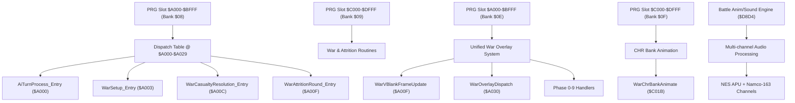

**Diagram sources**
- [prg_08_09.asm:84-113](file://asm/banks/prg_08_09.asm#L84-L113)
- [prg_0e_0f.asm:16-35](file://asm/banks/prg_0e_0f.asm#L16-L35)
- [prg_0e_0f.asm:4280-4314](file://asm/banks/prg_0e_0f.asm#L4280-L4314)
- [functions.h:894-911](file://include/functions.h#L894-L911)
- [prg_0e_0f.asm:8926-8933](file://asm/banks/prg_0e_0f.asm#L8926-L8933)

**Section sources**
- [prg_08_09.asm:1-12](file://asm/banks/prg_08_09.asm#L1-L12)
- [prg_0e_0f.asm:1-14](file://asm/banks/prg_0e_0f.asm#L1-L14)
- [PROJECT.md:70-99](file://PROJECT.md#L70-L99)

## Core Components
- AiTurnProcess_Entry: Main AI turn loop that scans officers, checks faction validity, and delegates action decisions.
- Action handlers: DefaultDecision, Regroup, AttackNearest, DefendBase, SweepRange3, CaptureProvince, RestoreHP, Idle.
- Movement engine: AiExecuteMove computes direction and step cost based on terrain, budget, and obstacles; supports encounter detection for regroup/capture modes.
- Proximity and scanning: AiScanAdjacentOfficers, AiFindNearbyOfficers, AiSortNearbyOfficers.
- Decision helpers: AiCheckFaction, AiCheckAttackNearby, AiCheckMove, AiCheckAttackFeasible, AiCheckRecruit, AiCheckFlee.
- War lifecycle: WarSetup_Entry, WarCasualtyResolution_Entry, WarAttritionRound_Entry.

**Updated** Enhanced with unified war overlay system featuring comprehensive terminology standardization:
- WarVBlankFrameUpdate: VBlank frame hook that manages war scene animations and overlay rendering
- WarOverlayDispatch: Central state machine managing 11 war phases (intro, actor selection, command resolution, etc.)
- Phase handlers: Comprehensive phase-specific sub-dispatchers for each war state with semantic decoding improvements
- WarChrBankAnimate: Animated CHR bank switching for war graphics
- Player request polling: Controller input handling for player takeover during wars
- OfficerBattleExpLevelCheck: Experience accrual and level-up system for commander officers
- OfficerStatSumBattleTransfer: Stat-sum battle transfer function combining Might and Intelligence
- BattleAnimSoundEngine: Multi-channel animation and audio engine supporting NES APU and Namco-163
- Terminology updates: Country/Ruler, Strategy, Intrigue, CountryMap throughout the system
- All functions now use consistent 'war' naming convention instead of 'battle'

**Section sources**
- [prg_08_09.asm:84-113](file://asm/banks/prg_08_09.asm#L84-L113)
- [prg_08_09.asm:127-184](file://asm/banks/prg_08_09.asm#L127-L184)
- [prg_08_09.asm:892-1169](file://asm/banks/prg_08_09.asm#L892-L1169)
- [prg_08_09.asm:1178-1272](file://asm/banks/prg_08_09.asm#L1178-L1272)
- [prg_08_09.asm:1384-1440](file://asm/banks/prg_08_09.asm#L1384-L1440)
- [prg_08_09.asm:2620-2684](file://asm/banks/prg_08_09.asm#L2620-L2684)
- [prg_0e_0f.asm:16-130](file://asm/banks/prg_0e_0f.asm#L16-L130)
- [prg_0e_0f.asm:4280-4314](file://asm/banks/prg_0e_0f.asm#L4280-L4314)
- [prg_0e_0f.asm:8776-8924](file://asm/banks/prg_0e_0f.asm#L8776-L8924)
- [prg_0e_0f.asm:8926-9405](file://asm/banks/prg_0e_0f.asm#L8926-L9405)

## Architecture Overview
The AI turn flow begins at the dispatch table and proceeds through AiTurnProcess_Entry, which iterates all officers and calls AiOfficerActionDecide. Each action handler may call movement or combat checks. Movement uses AiExecuteMove to compute feasible steps within the AI action budget. Combat-related decisions use proximity scanning and feasibility checks before committing to an action.

**Updated** The war system architecture now features a unified 16KB structure combining banks $0E and $0F, with a sophisticated overlay state machine managing the complete war experience from intro sequences through combat resolution. The system includes comprehensive terminology standardization and semantic decoding improvements across all components, with all references updated from 'battle' to 'war'.

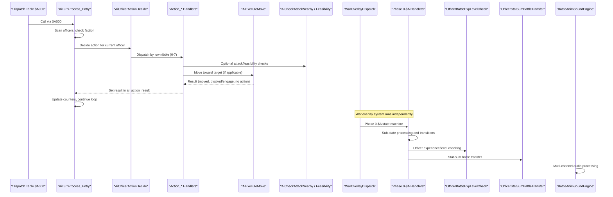

**Diagram sources**
- [prg_08_09.asm:84-113](file://asm/banks/prg_08_09.asm#L84-L113)
- [prg_08_09.asm:127-184](file://asm/banks/prg_08_09.asm#L127-L184)
- [prg_08_09.asm:186-212](file://asm/banks/prg_08_09.asm#L186-L212)
- [prg_0e_0f.asm:84-130](file://asm/banks/prg_0e_0f.asm#L84-L130)
- [prg_0e_0f.asm:8776-8924](file://asm/banks/prg_0e_0f.asm#L8776-L8924)
- [prg_0e_0f.asm:8926-9405](file://asm/banks/prg_0e_0f.asm#L8926-L9405)

## Detailed Component Analysis

### AiTurnProcess and Officer Loop
- Entry point at AiTurnProcess_Entry handles game state and phase transitions.
- Iterates up to 20 officers using index officer_scan_idx and validates entries from officer_state_table.
- Calls AiCheckFaction to ensure the officer belongs to the acting side.
- Invokes AiOfficerActionDecide to determine action; sets result in ai_action_result.
- Tracks acted count (acted_officer_cnt) and valid count (valid_officer_cnt); resets counters and rescan when needed.
- Marks turn complete by setting sram_game_start_flag to $FF.

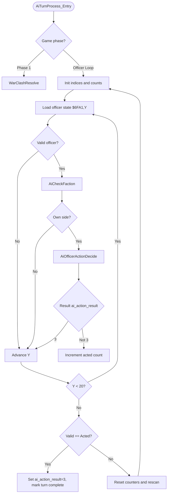

**Diagram sources**
- [prg_08_09.asm:127-184](file://asm/banks/prg_08_09.asm#L127-L184)

**Section sources**
- [prg_08_09.asm:127-184](file://asm/banks/prg_08_09.asm#L127-L184)

### Action Handlers and Decision Pipeline
- DefaultDecision: Priority chain flee → recruit → attack nearby → move → random idle/move to capital.
- Regroup: Rejoin main force or march to capital/ordered destination.
- AttackNearest: Find nearest enemy within range 2; fallback to capital/ordered destination.
- DefendBase: Intercept enemies near base within range 2; coordinate with adjacent allies.
- SweepRange3: Attack nearest enemy within range 3; fallback to generic move/capital.
- CaptureProvince: March to target province from bank $31 table; upon arrival set occupation state and transfer resources.
- RestoreHP: March to healing province; spend gold to restore HP up to base cap.
- Idle: No action.

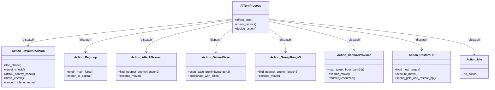

**Diagram sources**
- [prg_08_09.asm:213-879](file://asm/banks/prg_08_09.asm#L213-L879)

**Section sources**
- [prg_08_09.asm:213-879](file://asm/banks/prg_08_09.asm#L213-L879)

### Movement Engine: AiExecuteMove
- Computes deltas to target X/Y and queues two candidate directions (primary and secondary axes).
- Evaluates step costs using terrain tables and officer move type; respects AI budget war_action_points.
- Selects best candidate; if both blocked, checks for enemy encounter in regroup/capture modes.
- Stores chosen direction in ai_target_slot, result in ai_action_result (0=moved, 1=blocked/engage, 3=no action), and step cost in ai_move_cost.

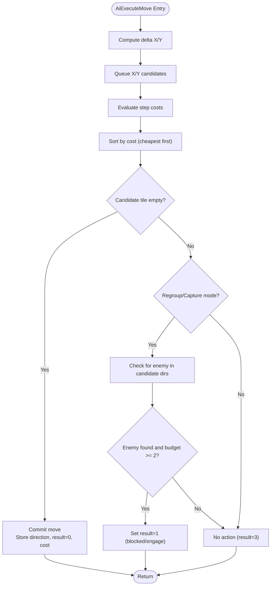

**Diagram sources**
- [prg_08_09.asm:892-1169](file://asm/banks/prg_08_09.asm#L892-L1169)

**Section sources**
- [prg_08_09.asm:892-1169](file://asm/banks/prg_08_09.asm#L892-L1169)

### Proximity Scanning and Sorting
- AiScanAdjacentOfficers: Scans N/S/W/E positions and stores officer indices (with faction bit) into adjacent_scan_results.
- AiFindNearbyOfficers: Scans all officers within Manhattan distance; outputs bit7=faction, bits0-6=distance into proximity_table.
- AiSortNearbyOfficers: Compacts enemy slots and sorts by troop strength (record fields +8/+9), strongest first.

**Diagram sources**
- [prg_08_09.asm:1178-1272](file://asm/banks/prg_08_09.asm#L1178-L1272)
- [prg_08_09.asm:2234-2297](file://asm/banks/prg_08_09.asm#L2234-L2297)

**Section sources**
- [prg_08_09.asm:1178-1272](file://asm/banks/prg_08_09.asm#L1178-L1272)
- [prg_08_09.asm:2234-2297](file://asm/banks/prg_08_09.asm#L2234-L2297)

### Decision Helpers: Attack, Recruit, Flee
- AiCheckAttackNearby: Checks adjacent tiles for enemy; requires budget ≥ 2; returns target and result=1.
- AiCheckMove: Chooses best feasible action against top nearby enemy candidates using rating tier, troop presence, and budget gates.
- AiCheckAttackFeasible: Cascades through action codes (priority order) gated by tier, troops, budget, and situational checks.
- AiCheckRecruit: Attempts recruitment with rating/rank gates and candidate troop checks; tries recruit action codes $0A–$0F.
- AiCheckFlee: Determines retreat based on home value, army stats comparison, thresholds, and random gate; selects destination province.

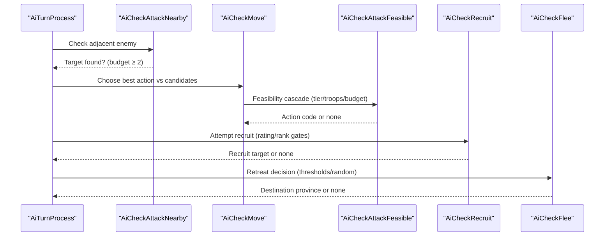

**Diagram sources**
- [prg_08_09.asm:1248-1440](file://asm/banks/prg_08_09.asm#L1248-L1440)
- [prg_08_09.asm:1629-1845](file://asm/banks/prg_08_09.asm#L1629-L1845)
- [prg_08_09.asm:2318-2609](file://asm/banks/prg_08_09.asm#L2318-L2609)

**Section sources**
- [prg_08_09.asm:1248-1440](file://asm/banks/prg_08_09.asm#L1248-L1440)
- [prg_08_09.asm:1629-1845](file://asm/banks/prg_08_09.asm#L1629-L1845)
- [prg_08_09.asm:2318-2609](file://asm/banks/prg_08_09.asm#L2318-L2609)

### War Lifecycle: Setup, Casualties, Attrition
- WarSetup_Entry: Clears officer states and proximity table; builds deployment rosters for both sides; resets army slots and counters.
- WarCasualtyResolution_Entry: Post-action damage and morale resolver; integrates with war state.
- WarAttritionRound_Entry: Per-round mutual attrition resolver for field battles; coordinates with casualty resolution.

**Updated** Enhanced with unified war overlay system featuring comprehensive terminology standardization:
- WarVBlankFrameUpdate: VBlank hook managing war scene animations and overlay rendering
- WarOverlayDispatch: Central state machine with 11 phases (intro, actor selection, command resolution, etc.)
- Phase handlers: Comprehensive sub-dispatchers for each war state with detailed sub-state management
- WarChrBankAnimate: Animated CHR bank switching for dynamic war graphics
- Player request polling: Controller input handling for player takeover during wars
- Semantic decoding improvements with over 1,800 lines of war phase and handler analysis
- All components now consistently use 'war' terminology instead of 'battle'

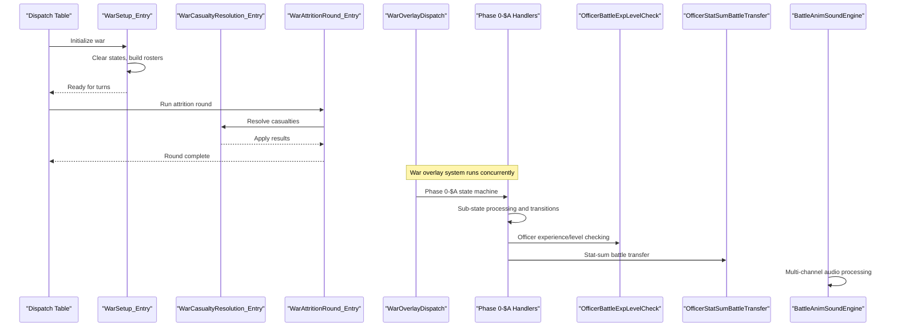

**Diagram sources**
- [prg_08_09.asm:2620-2684](file://asm/banks/prg_08_09.asm#L2620-L2684)
- [prg_08_09.asm:6152-6251](file://asm/banks/prg_08_09.asm#L6152-L6251)
- [prg_08_09.asm:6290-6407](file://asm/banks/prg_08_09.asm#L6290-L6407)
- [prg_0e_0f.asm:84-130](file://asm/banks/prg_0e_0f.asm#L84-L130)
- [prg_0e_0f.asm:4280-4314](file://asm/banks/prg_0e_0f.asm#L4280-L4314)
- [prg_0e_0f.asm:8776-8924](file://asm/banks/prg_0e_0f.asm#L8776-L8924)
- [prg_0e_0f.asm:8926-9405](file://asm/banks/prg_0e_0f.asm#L8926-L9405)

**Section sources**
- [prg_08_09.asm:2620-2684](file://asm/banks/prg_08_09.asm#L2620-L2684)
- [prg_08_09.asm:6152-6251](file://asm/banks/prg_08_09.asm#L6152-L6251)
- [prg_08_09.asm:6290-6407](file://asm/banks/prg_08_09.asm#L6290-L6407)
- [prg_0e_0f.asm:84-130](file://asm/banks/prg_0e_0f.asm#L84-L130)
- [prg_0e_0f.asm:4280-4314](file://asm/banks/prg_0e_0f.asm#L4280-L4314)

### Unified War Overlay System
**New Section** The consolidated PRG banks $0E/$0F provide a comprehensive war overlay system with sophisticated state management and enhanced semantic decoding:

- **WarVBlankFrameUpdate** ($A00F): VBlank frame hook that applies CHR bank animations, runs war overlay state machine, and handles menu updates with input suppression
- **WarOverlayDispatch** ($A030): Central state machine managing 11 war phases with sub-phase dispatching and comprehensive terminology standardization
- **Phase Handlers**: 
  - Phase 0: War intro sequence with roster display and data formatting
  - Phase 1: Next actor selection with priority-based scanning
  - Phase 2: Acting unit command resolution with attack/move paths
  - Phase 3: Command selection with player input handling
  - Phase 4: Defeat/retreat result processing with damage application
  - Phase 5: Side event handlers
  - Phase 6: Side A pre-battle formation select (+ menu)
  - Phase 7: Side B formation select + Battle Mode start
  - Phase 8: Point-spend panel for strategic resource allocation
  - Phase 9: Formation advance with animated sweep effects
  - Phase $A: AI taunt scene with choice menu
- **WarChrBankAnimate** ($C01B): Dynamic CHR bank switching for war graphics based on frame timing and war phase
- **Player Request Polling**: Controller input handling for player takeover during automatic war phases
- **Semantic Decoding**: Over 1,800 lines of war phase and handler analysis with improved terminology (Country/Ruler, Strategy, Intrigue, CountryMap)
- **Terminology Standardization**: All components now consistently use 'war' instead of 'battle' throughout the system

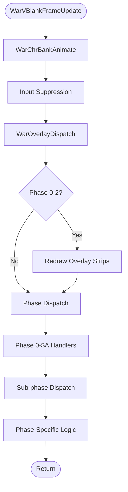

**Diagram sources**
- [prg_0e_0f.asm:16-52](file://asm/banks/prg_0e_0f.asm#L16-L52)
- [prg_0e_0f.asm:84-130](file://asm/banks/prg_0e_0f.asm#L84-L130)
- [prg_0e_0f.asm:4280-4314](file://asm/banks/prg_0e_0f.asm#L4280-L4314)

**Section sources**
- [prg_0e_0f.asm:16-130](file://asm/banks/prg_0e_0f.asm#L16-L130)
- [prg_0e_0f.asm:4280-4314](file://asm/banks/prg_0e_0f.asm#L4280-L4314)

### Officer Experience and Level System
**New Section** The battle overlay system includes comprehensive officer experience tracking and level-up mechanics:

- **OfficerBattleExpLevelCheck** ($D7FB): Battle experience accrual and level-up check for commander officers
  - Halves the amount and adds it to the officer's 16-bit Experience field (record bytes 6-7, capped at $C34F)
  - Compares experience total against OfficerLevelExpThresholds entry for current level
  - On reaching threshold, bumps level (byte $0B high nibble +1, low nibble preserved)
  - Applies diminishing Might bonus based on current Might value (6/5/4/2 points)
- **OfficerStatSumBattleTransfer** ($D8B0): Computes donor officer's Might + Intelligence sum and feeds it as 16-bit amount to OfficerBattleExpLevelCheck
  - Called via BankedCallbackTrampoline from prg_0c_0d.asm
  - Provides experience transfer mechanism between officers

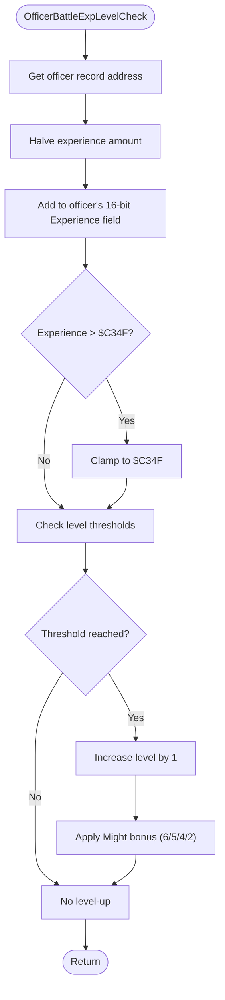

**Diagram sources**
- [prg_0e_0f.asm:8776-8924](file://asm/banks/prg_0e_0f.asm#L8776-L8924)

**Section sources**
- [prg_0e_0f.asm:8776-8924](file://asm/banks/prg_0e_0f.asm#L8776-L8924)

### Battle Animation and Sound Processing Pipeline
**New Section** The battle overlay system includes a sophisticated multi-channel animation and audio engine:

- **BattleAnimSoundEngine** ($D8D4): Processes 22 independent channels each VBlank
  - Supports 4 NES APU channels (pulse 1/2, triangle, noise) plus up to 18 Namco-163 expansion audio channels
  - Interprets byte-stream command protocol encoding duration, volume, pitch, vibrato, loop points, and termination
  - Handles channel initialization, command processing, and hardware register writes
- **BattleSoundChannelProc** ($DC59): Sound channel processing engine
  - Handles frequency scaling, vibrato, sound playback, and APU/Namco register writes
  - Includes VolumeFreqScale, VibratoUpdate, SoundPlay, and SoundPlayAlt functions
  - Manages tone tables, channel masks, and frequency lookup tables

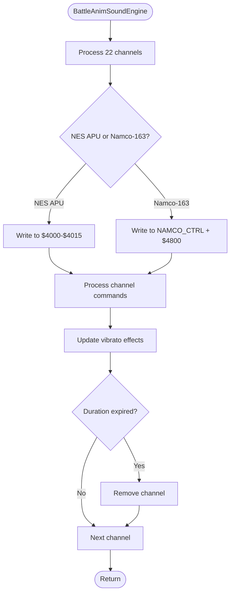

**Diagram sources**
- [prg_0e_0f.asm:8926-9405](file://asm/banks/prg_0e_0f.asm#L8926-L9405)

**Section sources**
- [prg_0e_0f.asm:8926-9405](file://asm/banks/prg_0e_0f.asm#L8926-L9405)

## Dependency Analysis
- AiTurnProcess depends on AiOfficerActionDecide and action handlers; these rely on movement and feasibility checks.
- Movement engine depends on terrain lookup, officer records, and budget checks.
- Proximity functions depend on officer arrays and faction flags.
- War lifecycle depends on roster data in banked memory and utility functions for math and bank switching.

**Updated** Enhanced dependencies now include the unified war overlay system with comprehensive terminology standardization:
- War overlay system depends on VBlank timing, CHR bank management, and phase state variables
- Phase handlers depend on player input polling, animation queue management, and panel rendering
- War graphics depend on dynamic CHR bank switching and palette management
- Cross-bank communication between $08/$09 (war engine) and $0E/$0F (overlay system)
- Semantic decoding improvements affecting all dependency relationships
- All function calls now use consistent 'war' naming convention
- Officer experience system depends on officer record access and level threshold tables
- Sound processing depends on channel state management and hardware register interfaces

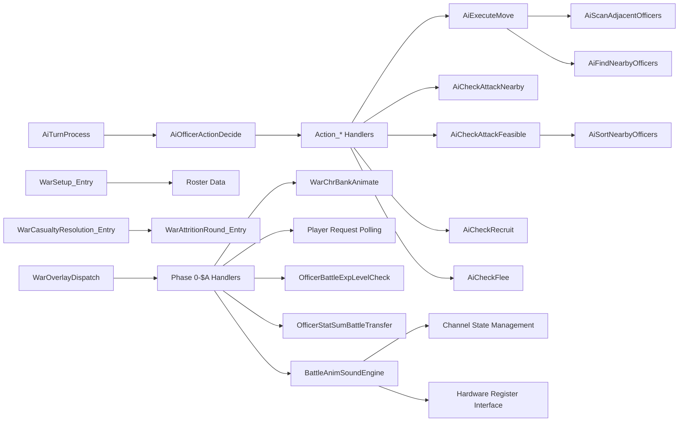

**Diagram sources**
- [prg_08_09.asm:127-184](file://asm/banks/prg_08_09.asm#L127-L184)
- [prg_08_09.asm:892-1169](file://asm/banks/prg_08_09.asm#L892-L1169)
- [prg_08_09.asm:1178-1272](file://asm/banks/prg_08_09.asm#L1178-L1272)
- [prg_08_09.asm:2234-2297](file://asm/banks/prg_08_09.asm#L2234-L2297)
- [prg_08_09.asm:2620-2684](file://asm/banks/prg_08_09.asm#L2620-L2684)
- [prg_08_09.asm:6152-6251](file://asm/banks/prg_08_09.asm#L6152-L6251)
- [prg_08_09.asm:6290-6407](file://asm/banks/prg_08_09.asm#L6290-L6407)
- [prg_0e_0f.asm:84-130](file://asm/banks/prg_0e_0f.asm#L84-L130)
- [prg_0e_0f.asm:4280-4314](file://asm/banks/prg_0e_0f.asm#L4280-L4314)
- [prg_0e_0f.asm:8776-8924](file://asm/banks/prg_0e_0f.asm#L8776-L8924)
- [prg_0e_0f.asm:8926-9405](file://asm/banks/prg_0e_0f.asm#L8926-L9405)

**Section sources**
- [prg_08_09.asm:127-184](file://asm/banks/prg_08_09.asm#L127-L184)
- [prg_08_09.asm:892-1169](file://asm/banks/prg_08_09.asm#L892-L1169)
- [prg_08_09.asm:1178-1272](file://asm/banks/prg_08_09.asm#L1178-L1272)
- [prg_08_09.asm:2234-2297](file://asm/banks/prg_08_09.asm#L2234-L2297)
- [prg_08_09.asm:2620-2684](file://asm/banks/prg_08_09.asm#L2620-L2684)
- [prg_08_09.asm:6152-6251](file://asm/banks/prg_08_09.asm#L6152-L6251)
- [prg_08_09.asm:6290-6407](file://asm/banks/prg_08_09.asm#L6290-L6407)
- [prg_0e_0f.asm:84-130](file://asm/banks/prg_0e_0f.asm#L84-L130)
- [prg_0e_0f.asm:4280-4314](file://asm/banks/prg_0e_0f.asm#L4280-L4314)

## Performance Considerations
- Officer iteration is bounded by 20 slots; proximity scans iterate all officers but use early exits for inactive slots.
- Sorting uses bubble sort on compacted enemy lists; typically small lists minimize overhead.
- Movement evaluation considers only two axis candidates; terrain cost lookup is constant-time per step.
- War setup clears fixed-size arrays; roster building scales with unit count per side.

**Updated** Enhanced performance considerations for the unified war system with semantic decoding optimizations:
- War overlay state machine runs every VBlank with efficient phase/sub-phase dispatching
- CHR bank animation updates occur every 8 frames based on frame tick counter optimization
- Player request polling minimizes controller input processing overhead
- Phase handlers use early exits and conditional processing to reduce unnecessary computations
- Memory access patterns optimized for sequential overlay strip rendering
- Terminology standardization reduces cognitive overhead in code maintenance
- Consistent 'war' naming convention improves code readability and maintainability
- Officer experience calculations use efficient threshold comparisons and diminishing returns
- Sound processing engine optimizes channel state management and hardware register writes
- Multi-channel audio processing balances CPU load across 22 simultaneous channels

## Troubleshooting Guide
- If officers do not act, verify ai_action_result values from action handlers and ensure budget war_action_points permits actions.
- If movement fails unexpectedly, check terrain costs and map bounds; confirm immobilized flag unit_immobilized is clear.
- For incorrect recruit/flee behavior, validate rating/rank gates and threshold comparisons; inspect random gates and province availability.
- In war setup, ensure faction war status byte equals $03 and rosters are correctly loaded from banked memory.

**Updated** Enhanced troubleshooting for unified war system with terminology standardization:
- If war overlay doesn't render, verify VBlank hook execution and phase state variables ($0540/$0541)
- If CHR bank animation appears corrupted, check frame tick counter and war phase selection logic
- If player input doesn't trigger takeover, verify WarPlayerRequestPoll execution and handoff flags ($0568/$0569)
- If war phases don't transition properly, inspect sub-phase counters and animation queue status
- For overlay rendering issues, check buffer pointers ($0560/$0561) and panel parameter blocks
- Verify terminology consistency across Country/Ruler, Strategy, Intrigue, and CountryMap references
- Ensure all function calls use updated 'war' naming convention (e.g., WarSetup_Entry instead of BattleSetup_Entry)
- If officer experience/level-up doesn't work, check OfficerBattleExpLevelCheck parameters and OfficerLevelExpThresholds table
- If sound processing fails, verify channel state management and hardware register write sequences
- For battle animation issues, check BattleAnimSoundEngine channel initialization and command stream processing

**Section sources**
- [prg_08_09.asm:213-879](file://asm/banks/prg_08_09.asm#L213-L879)
- [prg_08_09.asm:892-1169](file://asm/banks/prg_08_09.asm#L892-L1169)
- [prg_08_09.asm:1629-1845](file://asm/banks/prg_08_09.asm#L1629-L1845)
- [prg_08_09.asm:2620-2684](file://asm/banks/prg_08_09.asm#L2620-L2684)
- [prg_0e_0f.asm:84-130](file://asm/banks/prg_0e_0f.asm#L84-L130)
- [prg_0e_0f.asm:4280-4314](file://asm/banks/prg_0e_0f.asm#L4280-L4314)
- [prg_0e_0f.asm:8776-8924](file://asm/banks/prg_0e_0f.asm#L8776-L8924)
- [prg_0e_0f.asm:8926-9405](file://asm/banks/prg_0e_0f.asm#L8926-L9405)

## Conclusion
The PRG banks $08/$09 implement a comprehensive war and AI system centered on structured officer decision-making, robust movement logic, and scalable combat resolution. The design separates concerns between turn orchestration, action selection, movement execution, and war lifecycle management, enabling modular analysis and future enhancements.

**Updated** The architectural consolidation of PRG banks $0E and $0F into a unified 16KB structure has significantly enhanced the war system's capabilities, providing sophisticated overlay management, animated war sequences, and seamless integration between AI-driven wars and player interaction. The comprehensive terminology standardization (Country/Ruler, Strategy, Intrigue, CountryMap) and semantic decoding improvements with over 1,800 lines of war phase and handler analysis improve maintainability while delivering a more cohesive and feature-rich war experience. 

**New** The major expansion of the battle overlay system from approximately 3,294 to over 4,686 lines of annotated assembly introduces an 11-phase state machine, officer experience/level checking system, stat-sum battle transfer functions, and a complete battle animation/sound processing pipeline. The enhanced RAM usage documentation with comprehensive prg_0e_0f_ram_map.md and prg_0e_0f_ram_usage.txt files provides detailed coverage of the $0000-$07FF memory map with semantic naming conventions. The extensive renaming from 'battle' to 'war' across all PRG banks establishes a solid foundation for future development and debugging efforts, ensuring consistent terminology throughout the codebase. The multi-channel audio engine supporting both NES APU and Namco-163 expansion audio provides rich sound effects and music for battle scenes, while the officer experience system adds depth to character progression and strategic gameplay elements.