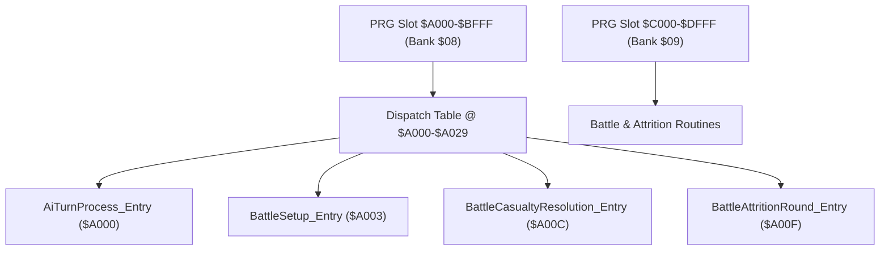
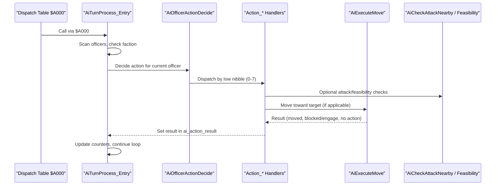
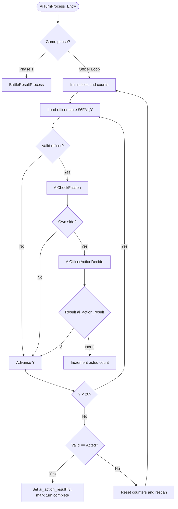
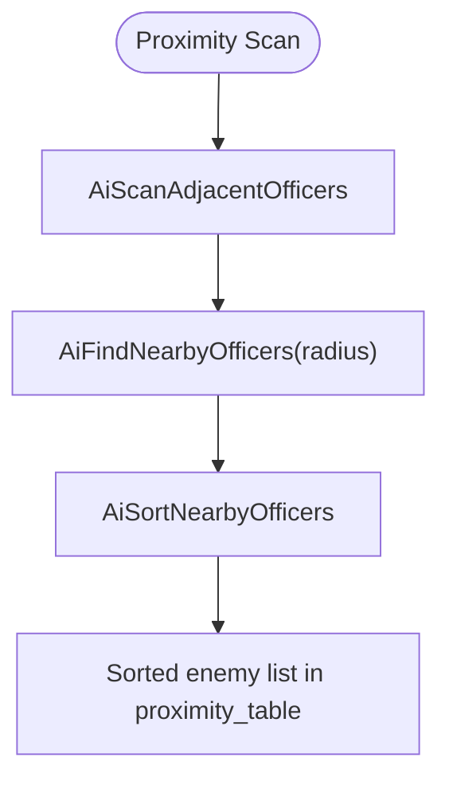
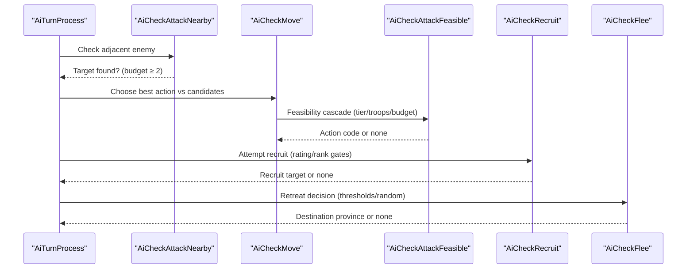
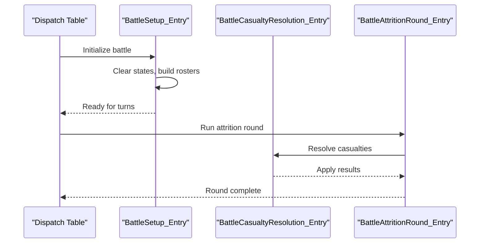
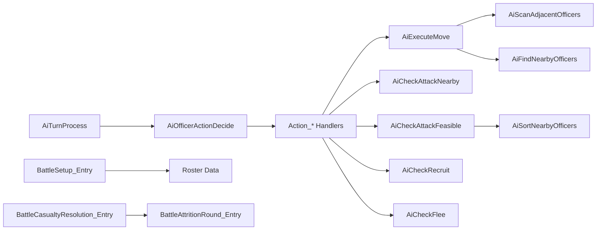

# Battle and AI System - PRG Banks $08/$09

<cite>
**Referenced Files in This Document**
- [prg_08_09.asm](file://asm/banks/prg_08_09.asm)
- [functions.h](file://include/functions.h)
- [PROJECT.md](file://PROJECT.md)
</cite>

## Update Summary
**Changes Made**
- Updated RAM map documentation with comprehensive semantic variable names replacing cryptic memory addresses
- Added detailed battle context memory layout documentation for WRAM $0400-$06FF work area and SRAM $6F00-$6FFF
- Updated function entry points to use descriptive labels (AiTurnProcess_Entry, BattleSetup_Entry, etc.)
- Replaced generic jump table entries (Loc_A000/Loc_A003 patterns) with meaningful semantic labels
- Enhanced all address-based references throughout battle AI logic with semantic labels for improved maintainability

## Table of Contents
1. [Introduction](#introduction)
2. [Project Structure](#project-structure)
3. [Core Components](#core-components)
4. [Architecture Overview](#architecture-overview)
5. [Detailed Component Analysis](#detailed-component-analysis)
6. [Dependency Analysis](#dependency-analysis)
7. [Performance Considerations](#performance-considerations)
8. [Troubleshooting Guide](#troubleshooting-guide)
9. [Conclusion](#conclusion)

## Introduction
This document explains the battle and artificial intelligence system implemented across PRG banks $08 and $09 for Sangokushi 2 (Haou no Tairiku, J). It covers the turn-based officer decision-making pipeline, movement engine, combat setup, casualty resolution, and attrition rounds. The code is organized around a dispatch table at $A000–$A029 that routes to high-level routines such as AI turn processing, battle setup, casualty resolution, and attrition handling.

The system operates on a per-turn basis: it iterates through officers, decides actions (flee, recruit, attack, move, regroup, capture province, restore HP, idle), executes movement toward targets, and resolves combat outcomes with time-scaled army statistics.

**Section sources**
- [prg_08_09.asm:15-38](file://asm/banks/prg_08_09.asm#L15-L38)
- [PROJECT.md:70-99](file://PROJECT.md#L70-L99)

## Project Structure
Banks $08 and $09 are combined into a single 16KB segment covering $A000–$DFFF. Bank $08 occupies $A000–$BFFF and bank $09 occupies $C000–$DFFF. A jump table at $A000–$A029 provides entry points for various subsystems including AI turn processing, battle setup, casualty resolution, and attrition rounds.

**Diagram sources**
- [prg_08_09.asm:84-113](file://asm/banks/prg_08_09.asm#L84-L113)
- [functions.h:894-911](file://include/functions.h#L894-L911)

**Section sources**
- [prg_08_09.asm:1-12](file://asm/banks/prg_08_09.asm#L1-L12)
- [PROJECT.md:70-99](file://PROJECT.md#L70-L99)

## Core Components
- AiTurnProcess_Entry: Main AI turn loop that scans officers, checks faction validity, and delegates action decisions.
- Action handlers: DefaultDecision, Regroup, AttackNearest, DefendBase, SweepRange3, CaptureProvince, RestoreHP, Idle.
- Movement engine: AiExecuteMove computes direction and step cost based on terrain, budget, and obstacles; supports encounter detection for regroup/capture modes.
- Proximity and scanning: AiScanAdjacentOfficers, AiFindNearbyOfficers, AiSortNearbyOfficers.
- Decision helpers: AiCheckFaction, AiCheckAttackNearby, AiCheckMove, AiCheckAttackFeasible, AiCheckRecruit, AiCheckFlee.
- Battle lifecycle: BattleSetup_Entry, BattleCasualtyResolution_Entry, BattleAttritionRound_Entry.

**Section sources**
- [prg_08_09.asm:84-113](file://asm/banks/prg_08_09.asm#L84-L113)
- [prg_08_09.asm:127-184](file://asm/banks/prg_08_09.asm#L127-L184)
- [prg_08_09.asm:892-1169](file://asm/banks/prg_08_09.asm#L892-L1169)
- [prg_08_09.asm:1178-1272](file://asm/banks/prg_08_09.asm#L1178-L1272)
- [prg_08_09.asm:1384-1440](file://asm/banks/prg_08_09.asm#L1384-L1440)
- [prg_08_09.asm:2620-2684](file://asm/banks/prg_08_09.asm#L2620-L2684)

## Architecture Overview
The AI turn flow begins at the dispatch table and proceeds through AiTurnProcess_Entry, which iterates all officers and calls AiOfficerActionDecide. Each action handler may call movement or combat checks. Movement uses AiExecuteMove to compute feasible steps within the AI action budget. Combat-related decisions use proximity scanning and feasibility checks before committing to an action.

**Diagram sources**
- [prg_08_09.asm:84-113](file://asm/banks/prg_08_09.asm#L84-L113)
- [prg_08_09.asm:127-184](file://asm/banks/prg_08_09.asm#L127-L184)
- [prg_08_09.asm:186-212](file://asm/banks/prg_08_09.asm#L186-L212)

## Detailed Component Analysis

### AiTurnProcess and Officer Loop
- Entry point at AiTurnProcess_Entry handles game state and phase transitions.
- Iterates up to 20 officers using index officer_scan_idx and validates entries from officer_state_table.
- Calls AiCheckFaction to ensure the officer belongs to the acting side.
- Invokes AiOfficerActionDecide to determine action; sets result in ai_action_result.
- Tracks acted count (acted_officer_cnt) and valid count (valid_officer_cnt); resets counters and rescan when needed.
- Marks turn complete by setting sram_game_start_flag to $FF.

**Diagram sources**
- [prg_08_09.asm:127-184](file://asm/banks/prg_08_09.asm#L127-L184)

**Section sources**
- [prg_08_09.asm:127-184](file://asm/banks/prg_08_09.asm#L127-L184)

### Action Handlers and Decision Pipeline
- DefaultDecision: Priority chain flee → recruit → attack nearby → move → random idle/move to capital.
- Regroup: Rejoin main force or march to capital/ordered destination.
- AttackNearest: Find nearest enemy within range 2; fallback to capital/ordered destination.
- DefendBase: Intercept enemies near base within range 2; coordinate with adjacent allies.
- SweepRange3: Attack nearest enemy within range 3; fallback to generic move/capital.
- CaptureProvince: March to target province from bank $31 table; upon arrival set occupation state and transfer resources.
- RestoreHP: March to healing province; spend gold to restore HP up to base cap.
- Idle: No action.

**Diagram sources**
- [prg_08_09.asm:213-879](file://asm/banks/prg_08_09.asm#L213-L879)

**Section sources**
- [prg_08_09.asm:213-879](file://asm/banks/prg_08_09.asm#L213-L879)

### Movement Engine: AiExecuteMove
- Computes deltas to target X/Y and queues two candidate directions (primary and secondary axes).
- Evaluates step costs using terrain tables and officer move type; respects AI budget battle_action_points.
- Selects best candidate; if both blocked, checks for enemy encounter in regroup/capture modes.
- Stores chosen direction in ai_target_slot, result in ai_action_result (0=moved, 1=blocked/engage, 3=no action), and step cost in ai_move_cost.

**Diagram sources**
- [prg_08_09.asm:892-1169](file://asm/banks/prg_08_09.asm#L892-L1169)

**Section sources**
- [prg_08_09.asm:892-1169](file://asm/banks/prg_08_09.asm#L892-L1169)

### Proximity Scanning and Sorting
- AiScanAdjacentOfficers: Scans N/S/W/E positions and stores officer indices (with faction bit) into adjacent_scan_results.
- AiFindNearbyOfficers: Scans all officers within Manhattan distance; outputs bit7=faction, bits0-6=distance into proximity_table.
- AiSortNearbyOfficers: Compacts enemy slots and sorts by troop strength (record fields +8/+9), strongest first.

**Diagram sources**
- [prg_08_09.asm:1178-1272](file://asm/banks/prg_08_09.asm#L1178-L1272)
- [prg_08_09.asm:2234-2297](file://asm/banks/prg_08_09.asm#L2234-L2297)

**Section sources**
- [prg_08_09.asm:1178-1272](file://asm/banks/prg_08_09.asm#L1178-L1272)
- [prg_08_09.asm:2234-2297](file://asm/banks/prg_08_09.asm#L2234-L2297)

### Decision Helpers: Attack, Recruit, Flee
- AiCheckAttackNearby: Checks adjacent tiles for enemy; requires budget ≥ 2; returns target and result=1.
- AiCheckMove: Chooses best feasible action against top nearby enemy candidates using rating tier, troop presence, and budget gates.
- AiCheckAttackFeasible: Cascades through action codes (priority order) gated by tier, troops, budget, and situational checks.
- AiCheckRecruit: Attempts recruitment with rating/rank gates and candidate troop checks; tries recruit action codes $0A–$0F.
- AiCheckFlee: Determines retreat based on home value, army stats comparison, thresholds, and random gate; selects destination province.

**Diagram sources**
- [prg_08_09.asm:1248-1440](file://asm/banks/prg_08_09.asm#L1248-L1440)
- [prg_08_09.asm:1629-1845](file://asm/banks/prg_08_09.asm#L1629-L1845)
- [prg_08_09.asm:2318-2609](file://asm/banks/prg_08_09.asm#L2318-L2609)

**Section sources**
- [prg_08_09.asm:1248-1440](file://asm/banks/prg_08_09.asm#L1248-L1440)
- [prg_08_09.asm:1629-1845](file://asm/banks/prg_08_09.asm#L1629-L1845)
- [prg_08_09.asm:2318-2609](file://asm/banks/prg_08_09.asm#L2318-L2609)

### Battle Lifecycle: Setup, Casualties, Attrition
- BattleSetup_Entry: Clears officer states and proximity table; builds deployment rosters for both sides; resets army slots and counters.
- BattleCasualtyResolution_Entry: Post-action damage and morale resolver; integrates with battle state.
- BattleAttritionRound_Entry: Per-round mutual attrition resolver for field battles; coordinates with casualty resolution.

**Diagram sources**
- [prg_08_09.asm:2620-2684](file://asm/banks/prg_08_09.asm#L2620-L2684)
- [prg_08_09.asm:6152-6251](file://asm/banks/prg_08_09.asm#L6152-L6251)
- [prg_08_09.asm:6290-6407](file://asm/banks/prg_08_09.asm#L6290-L6407)

**Section sources**
- [prg_08_09.asm:2620-2684](file://asm/banks/prg_08_09.asm#L2620-L2684)
- [prg_08_09.asm:6152-6251](file://asm/banks/prg_08_09.asm#L6152-L6251)
- [prg_08_09.asm:6290-6407](file://asm/banks/prg_08_09.asm#L6290-L6407)

## Dependency Analysis
- AiTurnProcess depends on AiOfficerActionDecide and action handlers; these rely on movement and feasibility checks.
- Movement engine depends on terrain lookup, officer records, and budget checks.
- Proximity functions depend on officer arrays and faction flags.
- Battle lifecycle depends on roster data in banked memory and utility functions for math and bank switching.

**Diagram sources**
- [prg_08_09.asm:127-184](file://asm/banks/prg_08_09.asm#L127-L184)
- [prg_08_09.asm:892-1169](file://asm/banks/prg_08_09.asm#L892-L1169)
- [prg_08_09.asm:1178-1272](file://asm/banks/prg_08_09.asm#L1178-L1272)
- [prg_08_09.asm:2234-2297](file://asm/banks/prg_08_09.asm#L2234-L2297)
- [prg_08_09.asm:2620-2684](file://asm/banks/prg_08_09.asm#L2620-L2684)
- [prg_08_09.asm:6152-6251](file://asm/banks/prg_08_09.asm#L6152-L6251)
- [prg_08_09.asm:6290-6407](file://asm/banks/prg_08_09.asm#L6290-L6407)

**Section sources**
- [prg_08_09.asm:127-184](file://asm/banks/prg_08_09.asm#L127-L184)
- [prg_08_09.asm:892-1169](file://asm/banks/prg_08_09.asm#L892-L1169)
- [prg_08_09.asm:1178-1272](file://asm/banks/prg_08_09.asm#L1178-L1272)
- [prg_08_09.asm:2234-2297](file://asm/banks/prg_08_09.asm#L2234-L2297)
- [prg_08_09.asm:2620-2684](file://asm/banks/prg_08_09.asm#L2620-L2684)
- [prg_08_09.asm:6152-6251](file://asm/banks/prg_08_09.asm#L6152-L6251)
- [prg_08_09.asm:6290-6407](file://asm/banks/prg_08_09.asm#L6290-L6407)

## Performance Considerations
- Officer iteration is bounded by 20 slots; proximity scans iterate all officers but use early exits for inactive slots.
- Sorting uses bubble sort on compacted enemy lists; typically small lists minimize overhead.
- Movement evaluation considers only two axis candidates; terrain cost lookup is constant-time per step.
- Battle setup clears fixed-size arrays; roster building scales with unit count per side.

[No sources needed since this section provides general guidance]

## Troubleshooting Guide
- If officers do not act, verify ai_action_result values from action handlers and ensure budget battle_action_points permits actions.
- If movement fails unexpectedly, check terrain costs and map bounds; confirm immobilized flag unit_immobilized is clear.
- For incorrect recruit/flee behavior, validate rating/rank gates and threshold comparisons; inspect random gates and province availability.
- In battle setup, ensure faction war status byte equals $03 and rosters are correctly loaded from banked memory.

**Section sources**
- [prg_08_09.asm:213-879](file://asm/banks/prg_08_09.asm#L213-L879)
- [prg_08_09.asm:892-1169](file://asm/banks/prg_08_09.asm#L892-L1169)
- [prg_08_09.asm:1629-1845](file://asm/banks/prg_08_09.asm#L1629-L1845)
- [prg_08_09.asm:2620-2684](file://asm/banks/prg_08_09.asm#L2620-L2684)

## Conclusion
The PRG banks $08/$09 implement a comprehensive battle and AI system centered on structured officer decision-making, robust movement logic, and scalable combat resolution. The design separates concerns between turn orchestration, action selection, movement execution, and battle lifecycle management, enabling modular analysis and future enhancements.

[No sources needed since this section summarizes without analyzing specific files]