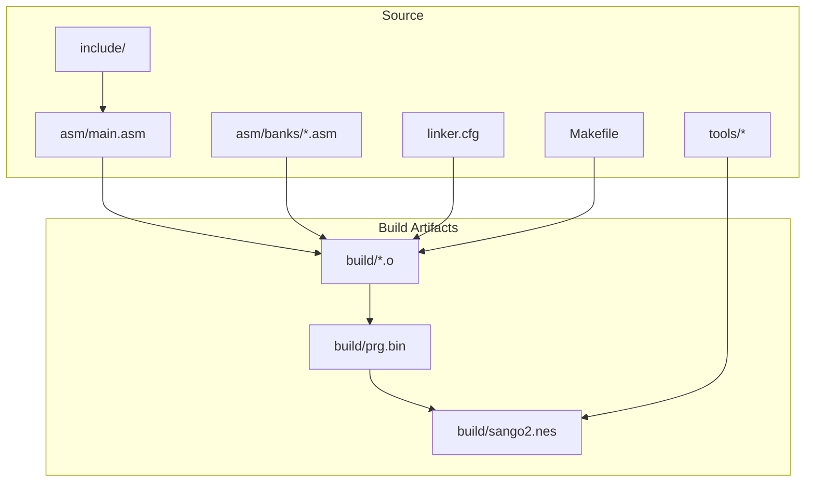
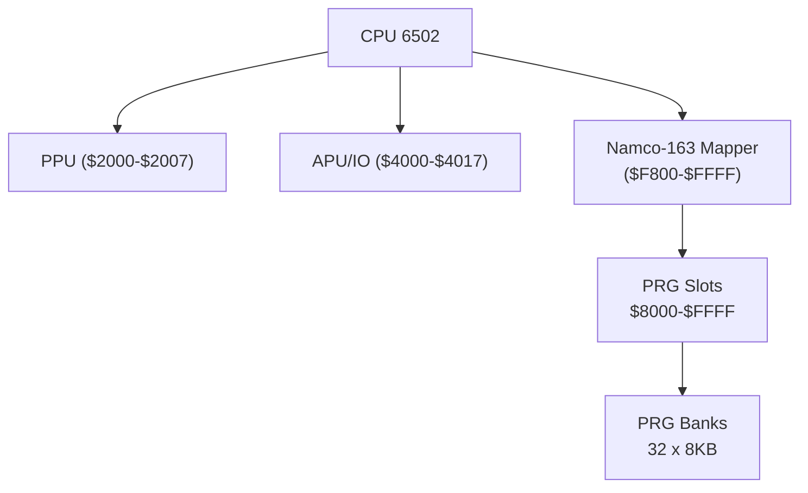
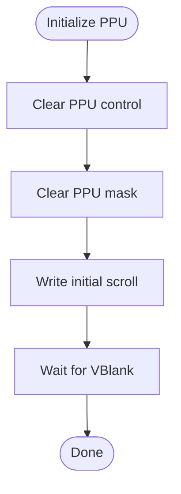
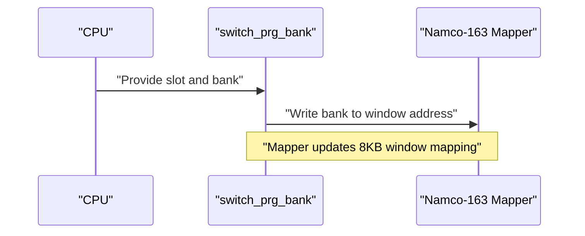
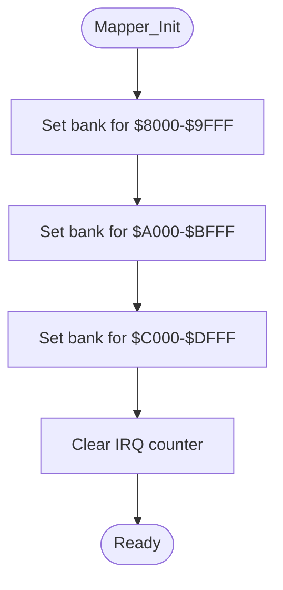
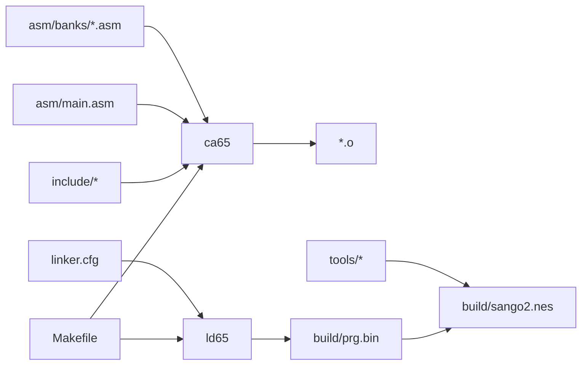

# Hardware Abstraction Layer

<cite>
**Referenced Files in This Document**
- [6502_registers.h](file://include/6502_registers.h)
- [macros.h](file://include/macros.h)
- [namco163.h](file://include/namco163.h)
- [main.asm](file://asm/main.asm)
- [linker.cfg](file://linker.cfg)
- [Makefile](file://Makefile)
- [PROJECT.md](file://PROJECT.md)
- [prg_00.asm](file://asm/banks/prg_00.asm)
- [prg_01.asm](file://asm/banks/prg_01.asm)
- [prg_02.asm](file://asm/banks/prg_02.asm)
- [prg_03.asm](file://asm/banks/prg_03.asm)
- [prg_1f.asm](file://asm/banks/prg_1f.asm)
- [rom_info.h](file://rom/rom_info.h)
- [generate_bank_stubs.py](file://tools/generate_bank_stubs.py)
- [split_rom.py](file://tools/split_rom.py)
</cite>

## Table of Contents
1. [Introduction](#introduction)
2. [Project Structure](#project-structure)
3. [Core Components](#core-components)
4. [Architecture Overview](#architecture-overview)
5. [Detailed Component Analysis](#detailed-component-analysis)
6. [Dependency Analysis](#dependency-analysis)
7. [Performance Considerations](#performance-considerations)
8. [Troubleshooting Guide](#troubleshooting-guide)
9. [Conclusion](#conclusion)
10. [Appendices](#appendices)

## Introduction
This document describes the hardware abstraction layer for the Sangokushi 2 - Haou no Tairiku (J) disassembly project targeting the NES platform with the Namco-163 (Mapper 19) hardware. It focuses on:
- Centralized PPU/APU register definitions and bit masks
- Macro utilities for register access and common hardware operations
- The Namco-163 mapper abstraction enabling clean bank switching across 32 PRG banks
- Practical examples of how the abstraction simplifies hardware programming and improves portability
- How the abstraction integrates with the overall system architecture and build pipeline

## Project Structure
The project is organized around a clear separation of concerns:
- include/: Header files defining hardware registers, mapper constants, and reusable macros
- asm/: Assembly entry points and bank stubs; bank segments are linked into PRG slots
- rom/: Split PRG/CHR banks and ROM metadata
- tools/: Utilities for ROM splitting, bank stub generation, and verification
- linker.cfg: Defines PRG memory slots and segment mapping for banked code
- Makefile: Orchestrates assembly, linking, and ROM creation

**Diagram sources**
- [Makefile:38-43](file://Makefile#L38-L43)
- [linker.cfg:18-54](file://linker.cfg#L18-L54)
- [main.asm:6-7](file://asm/main.asm#L6-L7)

**Section sources**
- [PROJECT.md:14-47](file://PROJECT.md#L14-L47)
- [Makefile:18-28](file://Makefile#L18-L28)
- [linker.cfg:18-54](file://linker.cfg#L18-L54)

## Core Components
This section documents the three pillars of the hardware abstraction layer: PPU/APU register definitions, macro utilities, and the Namco-163 mapper abstraction.

- PPU/APU register definitions
  - Provides symbolic names for PPU registers (control, mask, status, OAM, scroll, address/data), APU/IO registers (pulse, triangle, noise, DMC, OAM DMA, sound channels, joysticks), and the Namco-163 interface registers and bank switching addresses.
  - Includes bit masks for PPU control, mask, and status to simplify bitwise operations.

- Macro utilities
  - wait_vblank: Waits for VBlank using PPU status polling.
  - set_ppu_addr: Writes high and low bytes to PPU address registers.
  - ppu_write: Writes a literal value to PPU data register.
  - ppu_copy: Copies a block of data to PPU using a zero-page pointer and decrementing length.
  - dma_sprites: Performs OAM DMA via APU OAM DMA register.
  - switch_prg_bank: Writes a bank number to a selected bank window address for Namco-163.

- Namco-163 mapper abstraction
  - Declares bank window addresses for $8000, $A000, $C000, and $E000.
  - Provides bank indices (BANK_00..BANK_1F) and convenience macros switch_bank_8000/A000/C000/E000.
  - Supports initialization of mapper registers and IRQ counter.

These components centralize hardware details, reducing scattered magic numbers and register writes across the codebase.

**Section sources**
- [6502_registers.h:5-88](file://include/6502_registers.h#L5-L88)
- [macros.h:8-72](file://include/macros.h#L8-L72)
- [namco163.h:10-87](file://include/namco163.h#L10-L87)

## Architecture Overview
The system architecture leverages a banked PRG model with the Namco-163 mapper. The linker defines four PRG slots ($8000–$FFFF) that are mapped to 8KB windows controlled by the mapper. The abstraction layer ensures consistent register access and bank switching across all banks.

**Diagram sources**
- [linker.cfg:25-29](file://linker.cfg#L25-L29)
- [namco163.h:10-14](file://include/namco163.h#L10-L14)
- [PROJECT.md:84-93](file://PROJECT.md#L84-L93)

**Section sources**
- [PROJECT.md:70-83](file://PROJECT.md#L70-L83)
- [linker.cfg:18-30](file://linker.cfg#L18-L30)

## Detailed Component Analysis

### PPU/APU Register Definitions
- Purpose: Provide human-readable names and bit masks for PPU control/mask/status and APU/IO registers.
- Usage: Used throughout initialization routines and rendering helpers to configure PPU and APU without hardcoding addresses.
- Benefits: Improves readability, reduces errors, and centralizes hardware details.

**Diagram sources**
- [main.asm:104-110](file://asm/main.asm#L104-L110)
- [6502_registers.h:5-88](file://include/6502_registers.h#L5-L88)

**Section sources**
- [6502_registers.h:5-88](file://include/6502_registers.h#L5-L88)
- [main.asm:104-110](file://asm/main.asm#L104-L110)

### Macro Utilities
- wait_vblank: Polls PPU status to wait for VBlank onset and offset.
- set_ppu_addr: Sets PPU address high and low bytes atomically.
- ppu_write: Writes a constant value to PPU data.
- ppu_copy: Efficiently copies data to PPU using a zero-page pointer and loop with decrementing length.
- dma_sprites: Initiates OAM DMA by writing the high byte of the source address to the APU OAM DMA register.
- switch_prg_bank: Writes a bank number to a specific mapper window address depending on the macro’s slot argument.

**Diagram sources**
- [macros.h:60-71](file://include/macros.h#L60-L71)
- [namco163.h:10-14](file://include/namco163.h#L10-L14)

**Section sources**
- [macros.h:8-72](file://include/macros.h#L8-L72)
- [namco163.h:68-87](file://include/namco163.h#L68-L87)

### Namco-163 Mapper Abstraction
- Bank window addresses: $F800, $FA00, $FC00, $FE00 control 8KB windows at $8000–$9FFF, $A000–$BFFF, $C000–$DFFF, and $E000–$FFFF respectively.
- Bank indices: BANK_00..BANK_1F enumerate all 32 banks.
- Convenience macros: switch_bank_8000/A000/C000/E000 write a bank number to the appropriate window.
- Initialization: Mapper initialization sets initial banks and clears the IRQ counter.

**Diagram sources**
- [main.asm:115-121](file://asm/main.asm#L115-L121)
- [namco163.h:10-14](file://include/namco163.h#L10-L14)

**Section sources**
- [namco163.h:10-87](file://include/namco163.h#L10-L87)
- [main.asm:115-121](file://asm/main.asm#L115-L121)

### Practical Examples of Abstraction Benefits
- Centralized hardware definitions: Instead of scattering PPU control/mask/status writes, the code uses named constants and bit masks, improving maintainability.
- Simplified bank switching: Using switch_bank_8000/A000/C000/E000 avoids repetitive register writes and makes intent explicit.
- Portable register access: Macros encapsulate common sequences (e.g., setting PPU address, waiting for VBlank), enabling reuse across modules.

[No sources needed since this section synthesizes benefits without analyzing specific files]

### Relationship Between Abstraction and Portability
- The abstraction isolates hardware specifics behind named constants and macros, allowing higher-level code to remain unchanged if the underlying hardware changes.
- The linker configuration and bank stubs keep memory layout and segment mapping consistent, supporting portability across different ROM images or mappers with minimal changes.

**Section sources**
- [linker.cfg:32-54](file://linker.cfg#L32-L54)
- [PROJECT.md:152-158](file://PROJECT.md#L152-L158)

## Dependency Analysis
The build pipeline depends on include headers being assembled with main.asm and linked according to linker.cfg. Tools split ROMs into banks and generate stubs for disassembly.

**Diagram sources**
- [Makefile:38-43](file://Makefile#L38-L43)
- [linker.cfg:18-54](file://linker.cfg#L18-L54)

**Section sources**
- [Makefile:18-28](file://Makefile#L18-L28)
- [Makefile:46-48](file://Makefile#L46-L48)

## Performance Considerations
- Efficient PPU transfers: The ppu_copy macro uses a zero-page pointer and decrementing length to minimize overhead during tile/attribute uploads.
- VBlank synchronization: Using wait_vblank ensures safe PPU updates synchronized with the vertical blanking interval.
- Bank switching cost: Frequent bank switches can cause visible glitches; group related work within the same bank when possible.
- Macro expansion: Inline macros avoid subroutine call overhead for small, frequently used sequences.

[No sources needed since this section provides general guidance]

## Troubleshooting Guide
- PPU initialization issues: Verify that PPU control and mask are cleared before enabling rendering. Use the provided PPU initialization routine and ensure VBlank waits are performed.
- Bank switching not taking effect: Confirm that the correct window address is used and that the bank number is written to the mapper register. Check the mapper initialization routine.
- OAM DMA failures: Ensure the high byte of the source address is written to the APU OAM DMA register and that the source data resides in CPU RAM.
- ROM mismatch after rebuild: Use the verification target to compare the built ROM against the original.

**Section sources**
- [main.asm:104-110](file://asm/main.asm#L104-L110)
- [main.asm:115-121](file://asm/main.asm#L115-L121)
- [macros.h:52-55](file://include/macros.h#L52-L55)
- [Makefile:58-61](file://Makefile#L58-L61)

## Conclusion
The hardware abstraction layer consolidates PPU/APU register definitions, provides reusable macros for common operations, and offers a clean mapper abstraction for the Namco-163. Together, these components improve code readability, reduce errors, and support portability while integrating seamlessly with the build system and banked memory architecture.

[No sources needed since this section summarizes without analyzing specific files]

## Appendices

### Appendix A: Bank Stub Generation and ROM Splitting
- ROM splitting: The split utility parses the iNES header, splits PRG/CHR into 8KB banks, and generates a rom_info.h with mapper and bank counts.
- Bank stubs: The generator creates .asm stubs for each PRG bank and an all_banks.asm include file to aggregate them.

**Section sources**
- [split_rom.py:38-122](file://tools/split_rom.py#L38-L122)
- [generate_bank_stubs.py:12-46](file://tools/generate_bank_stubs.py#L12-L46)

### Appendix B: Banked Code Segments and Linker Mapping
- The linker defines four PRG slots and associates code segments to specific banks. As banks are disassembled, additional segments are added to link code into the correct slot.
- Bank 0x1F is mapped to $E000–$FFFF and contains the reset handler and dispatch logic.

**Section sources**
- [linker.cfg:18-54](file://linker.cfg#L18-L54)
- [PROJECT.md:101-117](file://PROJECT.md#L101-L117)

### Appendix C: Example Bank Files
- Bank stubs demonstrate the standard structure for each 8KB bank, including a segment directive and an .incbin statement pointing to the corresponding binary.

**Section sources**
- [prg_00.asm:6-12](file://asm/banks/prg_00.asm#L6-L12)
- [prg_01.asm:6-12](file://asm/banks/prg_01.asm#L6-L12)
- [prg_02.asm:6-12](file://asm/banks/prg_02.asm#L6-L12)
- [prg_03.asm:6-12](file://asm/banks/prg_03.asm#L6-L12)
- [prg_1f.asm:10-13](file://asm/banks/prg_1f.asm#L10-L13)