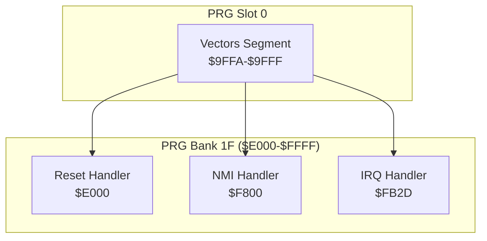
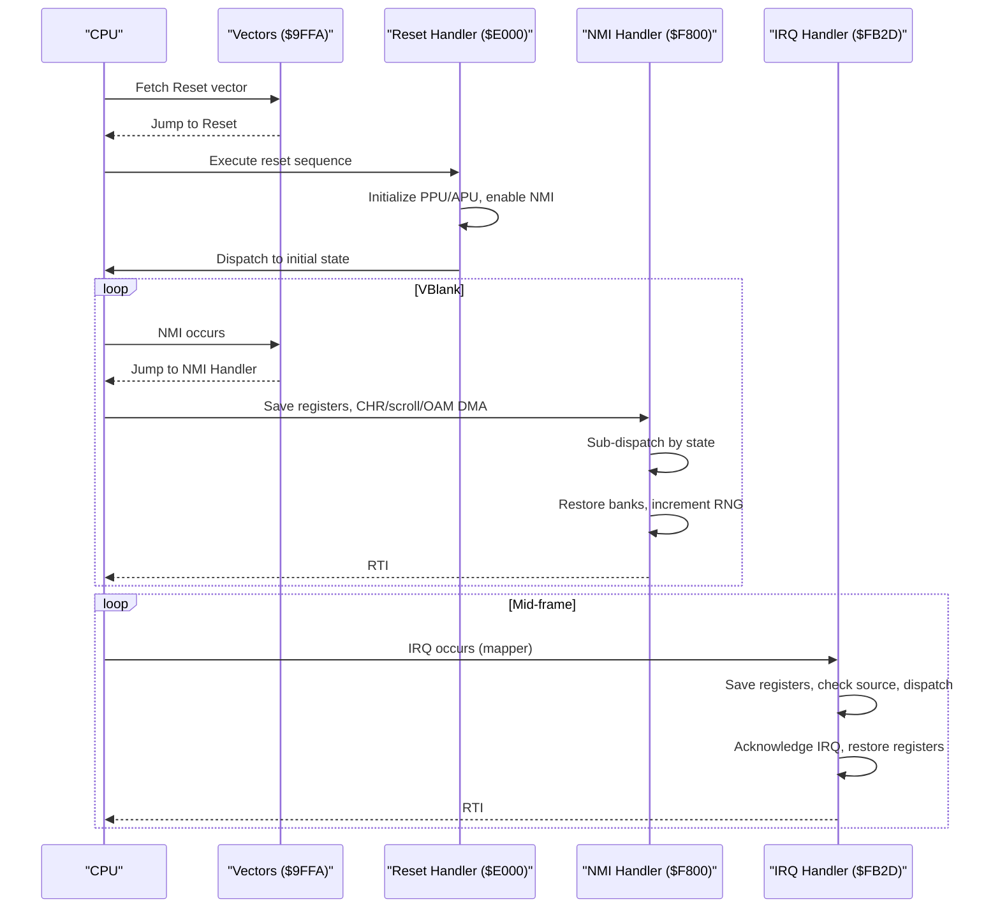
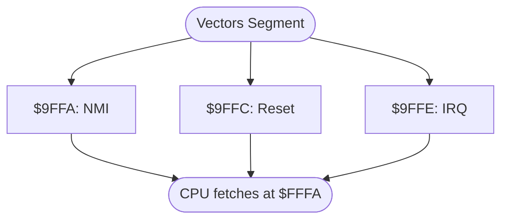
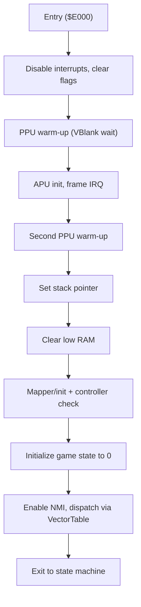
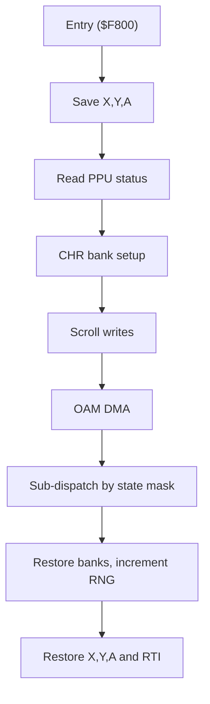
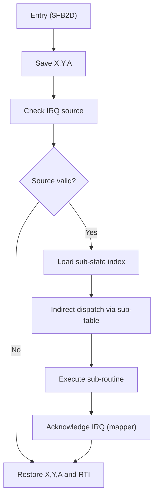
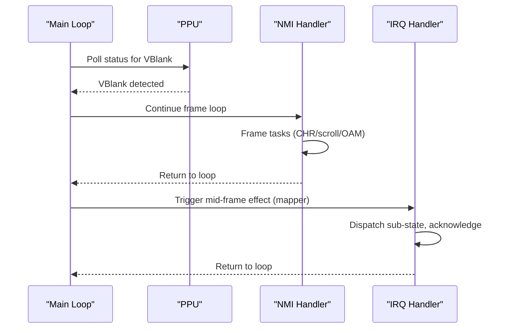
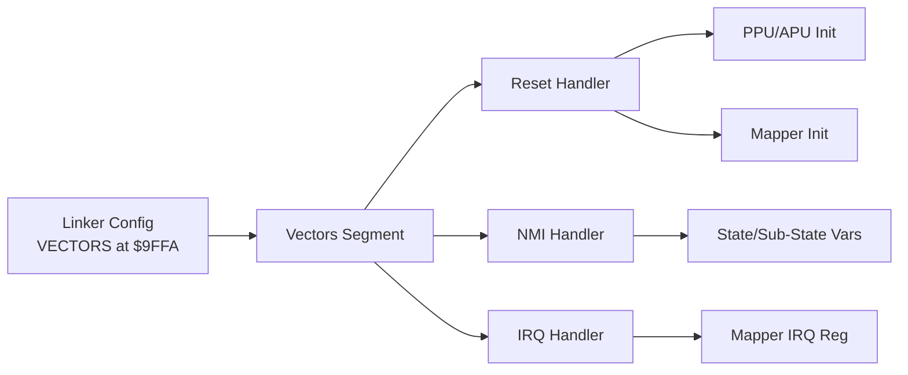

# Interrupt Handling and Vectors

<cite>
**Referenced Files in This Document**
- [asm/main.asm](file://asm/main.asm)
- [asm/banks/prg_1f.asm](file://asm/banks/prg_1f.asm)
- [include/6502_registers.h](file://include/6502_registers.h)
- [include/namco163.h](file://include/namco163.h)
- [linker.cfg](file://linker.cfg)
</cite>

## Table of Contents
1. [Introduction](#introduction)
2. [Project Structure](#project-structure)
3. [Core Components](#core-components)
4. [Architecture Overview](#architecture-overview)
5. [Detailed Component Analysis](#detailed-component-analysis)
6. [Dependency Analysis](#dependency-analysis)
7. [Performance Considerations](#performance-considerations)
8. [Troubleshooting Guide](#troubleshooting-guide)
9. [Conclusion](#conclusion)

## Introduction
This document explains interrupt handling and vector management in the codebase, focusing on the 6502 NMI and IRQ vectors, their placement in PRG slot 0, and the handlers’ roles in the overall system. It covers:
- Vector table organization at $9FFA in PRG slot 0
- Reset, NMI, and IRQ handlers implementation
- Processor state preservation during interrupts
- Interrupt service routine patterns and sub-dispatch mechanisms
- Timing considerations, interrupt masking, and interaction with the main game loop and state machine

## Project Structure
The interrupt system spans two primary locations:
- PRG slot 0 contains the interrupt vectors segment at $9FFA
- PRG bank 1F contains the Reset, NMI, and IRQ handlers plus supporting dispatch logic

**Diagram sources**
- [linker.cfg:41](file://linker.cfg#L41)
- [asm/main.asm:137-141](file://asm/main.asm#L137-L141)
- [asm/banks/prg_1f.asm:2866-2870](file://asm/banks/prg_1f.asm#L2866-L2870)

**Section sources**
- [linker.cfg:41](file://linker.cfg#L41)
- [asm/main.asm:137-141](file://asm/main.asm#L137-L141)
- [asm/banks/prg_1f.asm:2866-2870](file://asm/banks/prg_1f.asm#L2866-L2870)

## Core Components
- Interrupt vectors segment in PRG slot 0:
  - NMI vector at $9FFA
  - Reset vector at $9FFC
  - IRQ vector at $9FFE
- Reset handler in PRG bank 1F:
  - Disables interrupts, clears RAM, initializes PPU/APU, enables NMI, and dispatches to the initial state
- NMI handler in PRG bank 1F:
  - Saves registers, performs CHR setup, scroll, OAM DMA, sub-dispatches by state, restores banks and RNG counters, then returns
- IRQ handler in PRG bank 1F:
  - Saves registers, checks IRQ source, dispatches by sub-state, acknowledges IRQ, restores registers, and returns

**Section sources**
- [asm/main.asm:137-141](file://asm/main.asm#L137-L141)
- [asm/banks/prg_1f.asm:74-148](file://asm/banks/prg_1f.asm#L74-L148)
- [asm/banks/prg_1f.asm:2559-2658](file://asm/banks/prg_1f.asm#L2559-L2658)
- [asm/banks/prg_1f.asm:2733-2825](file://asm/banks/prg_1f.asm#L2733-L2825)

## Architecture Overview
The interrupt architecture integrates tightly with the PPU’s NMI and a custom IRQ source (via the Namco-163 mapper). The vector table is placed in PRG slot 0 so the 6502 can fetch vectors from $FFFA–$FFFF when reset or interrupted. PRG bank 1F holds the actual handlers and a state machine that orchestrates per-frame and mid-frame effects.

**Diagram sources**
- [linker.cfg:41](file://linker.cfg#L41)
- [asm/main.asm:137-141](file://asm/main.asm#L137-L141)
- [asm/banks/prg_1f.asm:74-148](file://asm/banks/prg_1f.asm#L74-L148)
- [asm/banks/prg_1f.asm:2559-2658](file://asm/banks/prg_1f.asm#L2559-L2658)
- [asm/banks/prg_1f.asm:2733-2825](file://asm/banks/prg_1f.asm#L2733-L2825)

## Detailed Component Analysis

### Interrupt Vector Table Placement
- Vectors segment is loaded into PRG slot 0 starting at $9FFA.
- The segment defines:
  - NMI vector at $9FFA
  - Reset vector at $9FFC
  - IRQ vector at $9FFE
- This ensures the 6502 fetches the correct entry points from $FFFA–$FFFF after reset or interrupt.

**Diagram sources**
- [asm/main.asm:137-141](file://asm/main.asm#L137-L141)
- [linker.cfg:41](file://linker.cfg#L41)

**Section sources**
- [asm/main.asm:137-141](file://asm/main.asm#L137-L141)
- [linker.cfg:41](file://linker.cfg#L41)

### Reset Handler
- Purpose: One-time initialization on power-on/reset.
- Actions:
  - Disable interrupts, clear decimal mode, set up stack pointer
  - Warm up PPU/APU, disable rendering and NMI
  - Reinitialize PPU/APU, wait for VBlank twice
  - Clear low RAM, initialize mapper/controller, set initial game state
  - Enable NMI and dispatch to the initial state via the vector table

**Diagram sources**
- [asm/banks/prg_1f.asm:74-148](file://asm/banks/prg_1f.asm#L74-L148)

**Section sources**
- [asm/banks/prg_1f.asm:74-148](file://asm/banks/prg_1f.asm#L74-L148)

### NMI Handler
- Purpose: Per-frame tasks synchronized to VBlank.
- Pattern:
  - Push accumulator and index registers onto the stack
  - Read PPU status
  - Perform CHR bank setup, scroll writes, and OAM DMA
  - Sub-dispatch by state using a small sub-state mask
  - Restore saved bank registers and increment RNG counters
  - Restore registers and return via RTI

**Diagram sources**
- [asm/banks/prg_1f.asm:2559-2658](file://asm/banks/prg_1f.asm#L2559-L2658)

**Section sources**
- [asm/banks/prg_1f.asm:2559-2658](file://asm/banks/prg_1f.asm#L2559-L2658)

### IRQ Handler
- Purpose: Mid-frame raster effects and mapper-driven IRQs.
- Pattern:
  - Push registers, check IRQ source flag
  - Dispatch by a sub-state index to specialized routines
  - Acknowledge IRQ by writing to the mapper register
  - Restore registers and return via RTI

**Diagram sources**
- [asm/banks/prg_1f.asm:2733-2825](file://asm/banks/prg_1f.asm#L2733-L2825)

**Section sources**
- [asm/banks/prg_1f.asm:2733-2825](file://asm/banks/prg_1f.asm#L2733-L2825)

### Interrupt Service Routine Patterns
- State preservation:
  - Handlers save A,X,Y before use and restore after completion
  - RTI is used to return with restored processor flags
- Sub-dispatch:
  - NMI uses a small mask on a state variable to choose among several sub-states
  - IRQ uses a dedicated sub-state index to select from a larger set of mid-frame effects
- Acknowledgment:
  - IRQ handler writes to the mapper register to acknowledge the source
- Interaction with PPU:
  - NMI reads PPU status and performs scroll/CHR/OAM updates
  - Both handlers rely on PPU timing and NMI being enabled

**Section sources**
- [asm/banks/prg_1f.asm:2559-2658](file://asm/banks/prg_1f.asm#L2559-L2658)
- [asm/banks/prg_1f.asm:2733-2825](file://asm/banks/prg_1f.asm#L2733-L2825)
- [include/6502_registers.h:55-87](file://include/6502_registers.h#L55-L87)

### Relationship Between Interrupts and the Main Game Loop
- The main loop waits for PPU status to indicate VBlank before continuing, ensuring the NMI handler runs predictably each frame.
- The state machine drives which sub-states are executed under NMI and IRQ, shaping gameplay behavior and visual effects.
- IRQ is used for mid-frame raster effects and mapper-driven events, complementing NMI’s frame synchronization.

**Diagram sources**
- [asm/main.asm:126-131](file://asm/main.asm#L126-L131)
- [asm/banks/prg_1f.asm:2559-2658](file://asm/banks/prg_1f.asm#L2559-L2658)
- [asm/banks/prg_1f.asm:2733-2825](file://asm/banks/prg_1f.asm#L2733-L2825)

**Section sources**
- [asm/main.asm:126-131](file://asm/main.asm#L126-L131)
- [asm/banks/prg_1f.asm:2559-2658](file://asm/banks/prg_1f.asm#L2559-L2658)
- [asm/banks/prg_1f.asm:2733-2825](file://asm/banks/prg_1f.asm#L2733-L2825)

### Practical Examples of Handler Implementation
- Proper state preservation:
  - Save A,X,Y early; restore in reverse order; use RTI
  - Example reference: [asm/banks/prg_1f.asm:2560-2564](file://asm/banks/prg_1f.asm#L2560-L2564), [asm/banks/prg_1f.asm:2734-2738](file://asm/banks/prg_1f.asm#L2734-L2738)
- Sub-dispatch pattern:
  - Load sub-state, shift for word index, indirect jump
  - Example reference: [asm/banks/prg_1f.asm:2586-2594](file://asm/banks/prg_1f.asm#L2586-L2594), [asm/banks/prg_1f.asm:2745-2752](file://asm/banks/prg_1f.asm#L2745-L2752)
- IRQ acknowledgment:
  - Write zero to the mapper IRQ register to acknowledge
  - Example reference: [asm/banks/prg_1f.asm:2817-2818](file://asm/banks/prg_1f.asm#L2817-L2818)

**Section sources**
- [asm/banks/prg_1f.asm:2560-2564](file://asm/banks/prg_1f.asm#L2560-L2564)
- [asm/banks/prg_1f.asm:2586-2594](file://asm/banks/prg_1f.asm#L2586-L2594)
- [asm/banks/prg_1f.asm:2734-2738](file://asm/banks/prg_1f.asm#L2734-L2738)
- [asm/banks/prg_1f.asm:2745-2752](file://asm/banks/prg_1f.asm#L2745-L2752)
- [asm/banks/prg_1f.asm:2817-2818](file://asm/banks/prg_1f.asm#L2817-L2818)

## Dependency Analysis
- Vector placement depends on the linker configuration placing the VECTORS segment at $9FFA in PRG slot 0.
- The Reset handler depends on PPU/APU initialization and the mapper initialization routine.
- The NMI handler depends on PPU status and state variables for sub-dispatch.
- The IRQ handler depends on the mapper IRQ register and a sub-table for mid-frame effects.

**Diagram sources**
- [linker.cfg:41](file://linker.cfg#L41)
- [asm/main.asm:137-141](file://asm/main.asm#L137-L141)
- [asm/banks/prg_1f.asm:74-148](file://asm/banks/prg_1f.asm#L74-L148)
- [asm/banks/prg_1f.asm:2559-2658](file://asm/banks/prg_1f.asm#L2559-L2658)
- [asm/banks/prg_1f.asm:2733-2825](file://asm/banks/prg_1f.asm#L2733-L2825)

**Section sources**
- [linker.cfg:41](file://linker.cfg#L41)
- [asm/main.asm:137-141](file://asm/main.asm#L137-L141)
- [asm/banks/prg_1f.asm:74-148](file://asm/banks/prg_1f.asm#L74-L148)
- [asm/banks/prg_1f.asm:2559-2658](file://asm/banks/prg_1f.asm#L2559-L2658)
- [asm/banks/prg_1f.asm:2733-2825](file://asm/banks/prg_1f.asm#L2733-L2825)

## Performance Considerations
- Minimize work in NMI to keep scanline timing stable; perform CHR/scroll/OAM DMA efficiently.
- Keep IRQ routines short and deterministic to avoid missing raster events.
- Use indirect dispatch tables to reduce branching overhead while maintaining flexibility.
- Ensure IRQ acknowledgment happens promptly to prevent repeated interrupts.

## Troubleshooting Guide
- Symptoms: Screen artifacts or inconsistent scrolling
  - Cause: NMI not acknowledging PPU status or incorrect scroll writes
  - Fix: Verify PPU status read and scroll register writes in the NMI handler
  - Reference: [asm/banks/prg_1f.asm:2567-2579](file://asm/banks/prg_1f.asm#L2567-L2579)
- Symptoms: Mid-frame effects not triggering
  - Cause: IRQ source not detected or not acknowledged
  - Fix: Confirm IRQ source check and mapper IRQ acknowledgment
  - Reference: [asm/banks/prg_1f.asm:2741-2742](file://asm/banks/prg_1f.asm#L2741-L2742), [asm/banks/prg_1f.asm:2817-2818](file://asm/banks/prg_1f.asm#L2817-L2818)
- Symptoms: Stutter or missed frames
  - Cause: Long-running NMI or IRQ routines
  - Fix: Reduce work in handlers; defer non-critical tasks to safe periods

**Section sources**
- [asm/banks/prg_1f.asm:2567-2579](file://asm/banks/prg_1f.asm#L2567-L2579)
- [asm/banks/prg_1f.asm:2741-2742](file://asm/banks/prg_1f.asm#L2741-L2742)
- [asm/banks/prg_1f.asm:2817-2818](file://asm/banks/prg_1f.asm#L2817-L2818)

## Conclusion
The interrupt system centers on a clean separation of concerns: the vector table in PRG slot 0, the Reset handler initializing hardware and state, and the NMI/IRQ handlers managing per-frame and mid-frame tasks. By preserving processor state, using sub-dispatch tables, and acknowledging IRQ sources promptly, the handlers integrate smoothly with the state machine and maintain predictable timing for PPU-driven effects.