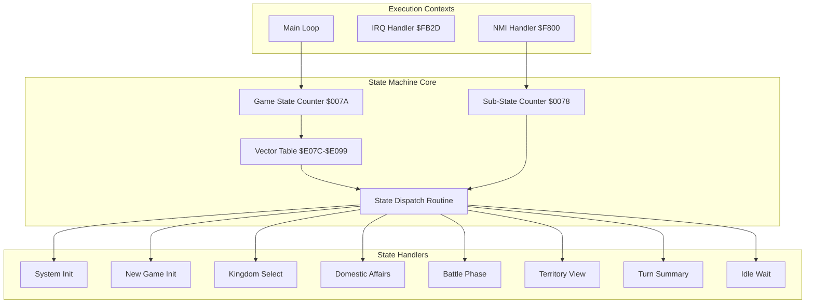
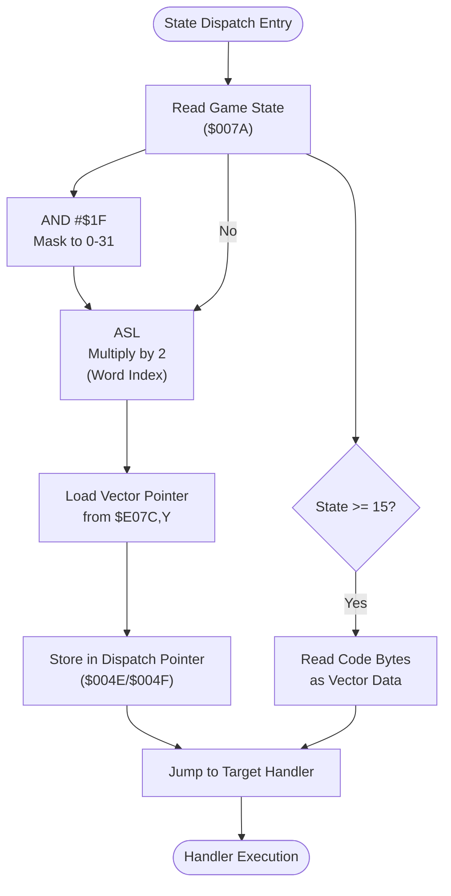
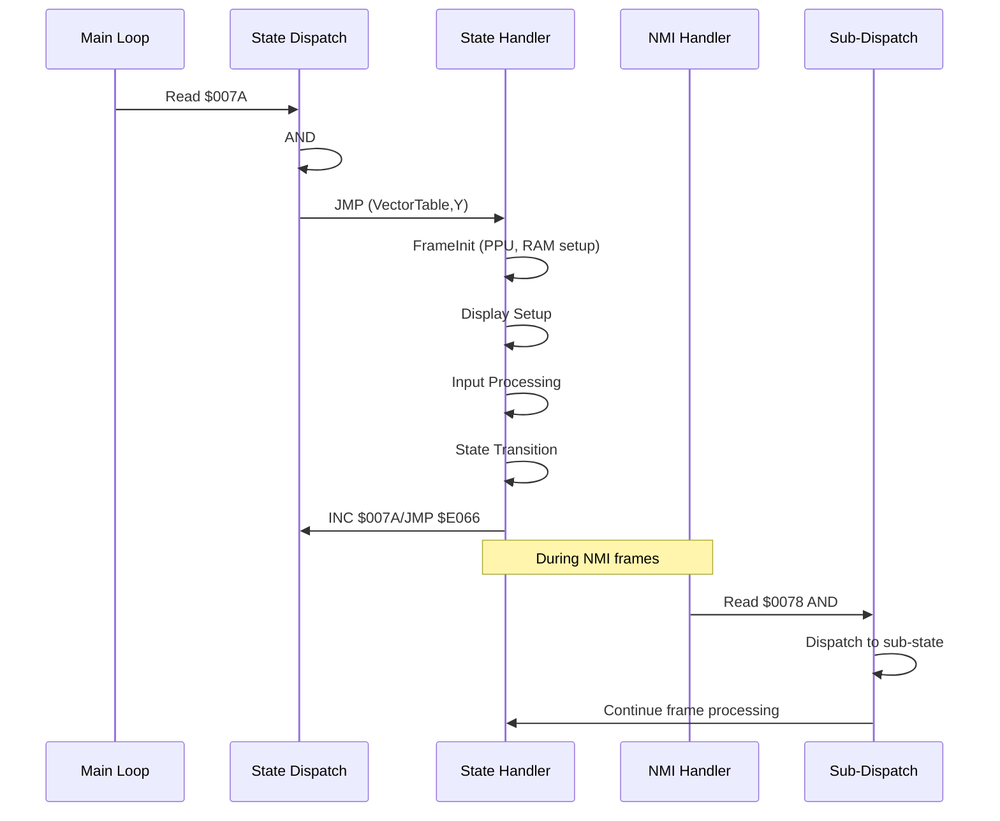
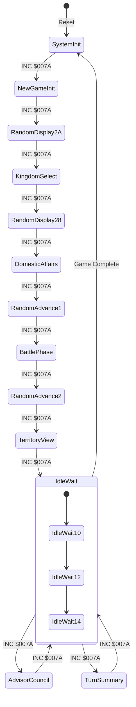
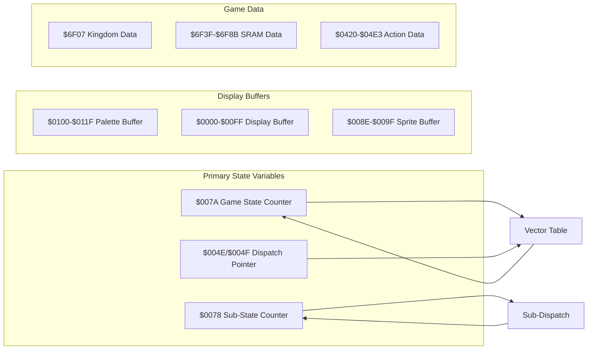
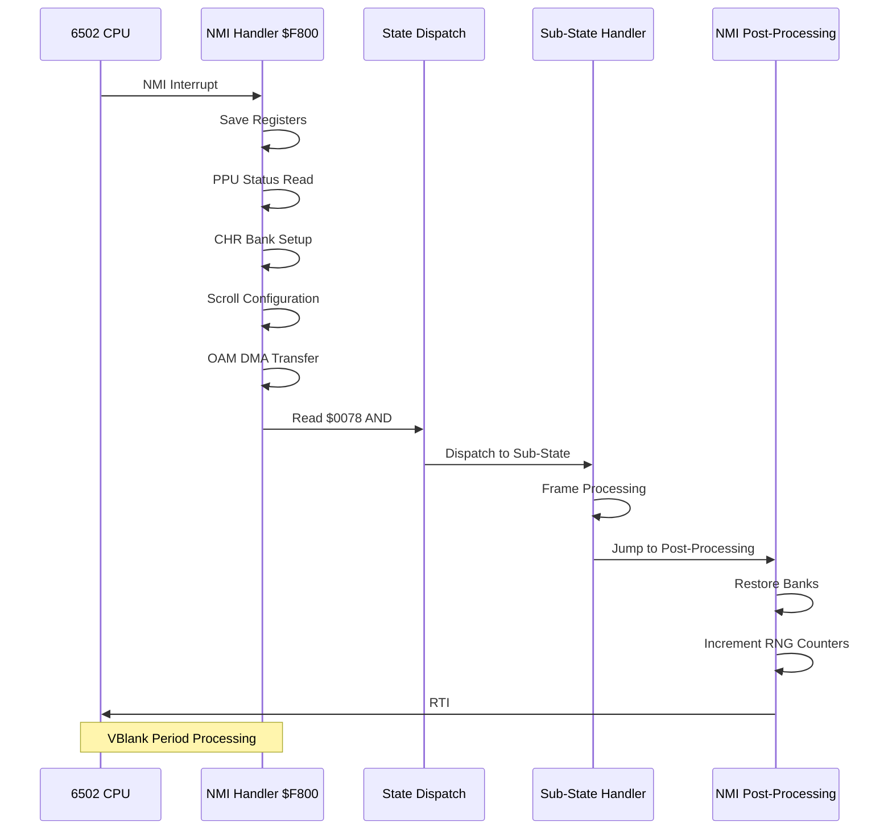

# State Machine Architecture

<cite>
**Referenced Files in This Document**
- [prg_1f.asm](file://asm/banks/prg_1f.asm)
- [main.asm](file://asm/main.asm)
- [bank_1f_analysis.md](file://code/bank_1f_analysis.md)
- [bank_1f_raw.asm](file://code/bank_1f_raw.asm)
</cite>

## Table of Contents
1. [Introduction](#introduction)
2. [System Architecture Overview](#system-architecture-overview)
3. [Vector Dispatch Mechanism](#vector-dispatch-mechanism)
4. [State Enumeration and Organization](#state-enumeration-and-organization)
5. [State Handler Implementation Patterns](#state-handler-implementation-patterns)
6. [State Transition Logic](#state-transition-logic)
7. [Memory Management and Data Structures](#memory-management-and-data-structures)
8. [NMI Integration and Frame Coordination](#nmi-integration-and-frame-coordination)
9. [Practical State Transition Examples](#practical-state-transition-examples)
10. [Performance Considerations](#performance-considerations)
11. [Troubleshooting and Debugging](#troubleshooting-and-debugging)

## Introduction

The Sango II state machine architecture implements a sophisticated 15-game state dispatcher using a vector dispatch table mechanism at $E07C. This system orchestrates the complete game flow across multiple execution contexts, coordinating between different game subsystems through a centralized state management approach. The architecture demonstrates advanced 6502 assembly programming techniques, including vector-based dispatch, memory banking, and interrupt-driven frame synchronization.

The state machine operates as a finite state automaton where each state represents a distinct phase of gameplay, from system initialization through turn-based strategic phases culminating in battle sequences and turn summaries. The dispatcher mechanism provides efficient state resolution through indexed vector table access, enabling rapid state transitions while maintaining clean separation of concerns between different game phases.

## System Architecture Overview

The state machine architecture consists of several interconnected components that work together to manage game flow:

**Diagram sources**
- [prg_1f.asm:150-168](file://asm/banks/prg_1f.asm#L150-L168)
- [prg_1f.asm:737-749](file://asm/banks/prg_1f.asm#L737-L749)

The architecture employs a hierarchical design where the main state dispatcher coordinates primary game states, while the NMI handler manages frame-based sub-states for real-time display updates and input processing.

## Vector Dispatch Mechanism

The vector dispatch mechanism at $E07C implements a compact and efficient state resolution system:

**Diagram sources**
- [prg_1f.asm:138-147](file://asm/banks/prg_1f.asm#L138-L147)
- [bank_1f_analysis.md:47-51](file://code/bank_1f_analysis.md#L47-L51)

The dispatch mechanism uses a 15-entry vector table (30 bytes total) with each entry containing a 16-bit little-endian pointer to the corresponding state handler routine. The indexing formula `($007A AND #$1F) * 2` ensures proper word alignment for 16-bit pointer access.

**Section sources**
- [prg_1f.asm:150-168](file://asm/banks/prg_1f.asm#L150-L168)
- [bank_1f_analysis.md:54-76](file://code/bank_1f_analysis.md#L54-L76)

## State Enumeration and Organization

The state machine manages 15 distinct game states, each serving a specific purpose in the overall game flow:

| State Index | State Name | Handler Address | Purpose |
|-------------|------------|-----------------|---------|
| 0 | System Init | $E09A | Boot sequence initialization |
| 1 | New Game Init | $E0DA | Initial game setup and SRAM initialization |
| 2 | Random Display 2A | $E17D | Random value display with Y=$2A |
| 3 | Kingdom Select | $E18B | Player kingdom selection |
| 4 | Random Display 28 | $E221 | Random value display with Y=$28 |
| 5 | Domestic Affairs | $E22F | Strategic decision-making phase |
| 6 | Random Advance 1 | $E2E2 | Pure random number generation |
| 7 | Battle Phase | $E2E8 | Combat and military operations |
| 8 | Random Advance 2 | $E36A | Additional random number generation |
| 9 | Territory View | $E37C | Map and territory display |
| 10 | Idle Wait | $E3EB | Frame synchronization state |
| 11 | Advisor Council | $E3EE | Advisory and dialogue phase |
| 12 | Idle Wait (Copy) | $E3EB | Duplicate of state 10 |
| 13 | Turn Summary | $E46A | End-of-turn reporting |
| 14 | Idle Wait (Copy) | $E3EB | Duplicate of state 10 |

**Section sources**
- [bank_1f_analysis.md:58-74](file://code/bank_1f_analysis.md#L58-L74)
- [prg_1f.asm:153-168](file://asm/banks/prg_1f.asm#L153-L168)

The organization demonstrates deliberate design choices, including duplicate idle states (10, 12, 14) that serve as null states for frame waiting, and specialized random display states that provide visual feedback during random number generation phases.

## State Handler Implementation Patterns

State handlers follow consistent implementation patterns that ensure predictable behavior and efficient resource management:

**Diagram sources**
- [prg_1f.asm:737-749](file://asm/banks/prg_1f.asm#L737-L749)
- [prg_1f.asm:2559-2658](file://asm/banks/prg_1f.asm#L2559-L2658)

Each state handler typically follows this pattern:
1. **Frame Initialization**: Calls the frame initialization routine to prepare PPU and RAM
2. **Display Setup**: Configures display modes and prepares data buffers
3. **Input Processing**: Reads controller input and processes user interactions
4. **State Transition**: Updates the game state counter for next frame
5. **Return to Dispatch**: Jumps back to the main state dispatch routine

**Section sources**
- [bank_1f_analysis.md:80-160](file://code/bank_1f_analysis.md#L80-L160)
- [prg_1f.asm:174-202](file://asm/banks/prg_1f.asm#L174-L202)

## State Transition Logic

The state transition system operates through explicit increment operations within state handlers, creating a deterministic progression through the game phases:

**Diagram sources**
- [bank_1f_analysis.md:162-474](file://code/bank_1f_analysis.md#L162-L474)

The transition logic demonstrates several key characteristics:
- **Sequential Progression**: States generally progress in a fixed order through the game phases
- **Idle State Loops**: Multiple idle states (10, 12, 14) provide frame synchronization
- **Conditional Transitions**: Some states branch based on game conditions or player input
- **Repetition**: Certain states repeat for extended periods (idle states)

**Section sources**
- [bank_1f_analysis.md:406-412](file://code/bank_1f_analysis.md#L406-L412)
- [prg_1f.asm:269-275](file://asm/banks/prg_1f.asm#L269-L275)

## Memory Management and Data Structures

The state machine relies on carefully organized memory structures to maintain state information and coordinate between different game phases:

**Diagram sources**
- [bank_1f_analysis.md:47-51](file://code/bank_1f_analysis.md#L47-L51)
- [prg_1f.asm:179-184](file://asm/banks/prg_1f.asm#L179-L184)

Key memory management aspects include:

### State Variables
- **Game State Counter** ($007A): Primary state index (0-14) determining vector table access
- **Sub-State Counter** ($0078): Secondary state for frame-based processing within major states
- **Dispatch Pointer** ($004E/$004F): Temporary storage for resolved handler addresses

### Display Management
- **Palette Buffer** ($0100-$011F): Sprite palette data for consistent color representation
- **Display Buffer** ($0000-$00FF): Working buffer for display data manipulation
- **Sprite Buffer** ($008E-$009F): Sprite positioning and animation data

### Persistent Data Storage
- **SRAM Data** ($6F3F-$6F8B): Game progress and configuration data
- **Kingdom Data** ($6F07): Persistent kingdom information across sessions

**Section sources**
- [bank_1f_analysis.md:1659-1674](file://code/bank_1f_analysis.md#L1659-L1674)
- [prg_1f.asm:179-184](file://asm/banks/prg_1f.asm#L179-L184)

## NMI Integration and Frame Coordination

The NMI handler provides critical frame synchronization and sub-state coordination:

**Diagram sources**
- [prg_1f.asm:2559-2658](file://asm/banks/prg_1f.asm#L2559-L2658)
- [prg_1f.asm:2585-2594](file://asm/banks/prg_1f.asm#L2585-L2594)

The NMI handler operates during VBlank periods to provide smooth frame synchronization:

### Frame Processing Responsibilities
- **PPU Status Management**: Reads and processes PPU status for frame timing
- **CHR Bank Management**: Configures character ROM banking for display data
- **Scroll Positioning**: Updates PPU scroll registers for smooth scrolling
- **OAM DMA Transfer**: Performs sprite DMA transfers during blanking period

### Sub-State Coordination
The NMI handler reads the sub-state counter ($0078) and applies a bitwise AND with #$0F to determine the appropriate sub-state handler. This creates eight distinct sub-states that coordinate with the main state machine.

**Section sources**
- [prg_1f.asm:2559-2658](file://asm/banks/prg_1f.asm#L2559-L2658)
- [bank_1f_analysis.md:2585-2594](file://code/bank_1f_analysis.md#L2585-L2594)

## Practical State Transition Examples

### Example 1: System Initialization Sequence
The initialization process demonstrates the complete boot sequence:

1. **System Init** (State 0): Sets up PPU, initializes palette data, patches RAM/mapper
2. **Transition**: Increments state to 9 (Territory View)
3. **Immediate Dispatch**: Jumps to StateDispatch for immediate execution

### Example 2: Kingdom Selection Flow
The kingdom selection state showcases input processing and data management:

1. **Frame Init**: Prepares display and clears working buffers
2. **Display Setup**: Configures display mode 1 for kingdom selection
3. **Input Processing**: Reads controller input to determine selected kingdom
4. **Data Loading**: Loads kingdom coordinates and pointer data
5. **State Transition**: Increments to next state for game progression

### Example 3: Battle Phase Coordination
The battle phase demonstrates complex state coordination:

1. **Army Status Check**: Validates army readiness flags
2. **Sprite Management**: Clears inactive army sprites
3. **Display Updates**: Refreshes battle graphics
4. **Music Control**: Plays appropriate battle soundtrack
5. **State Progression**: Advances to next phase after combat resolution

**Section sources**
- [bank_1f_analysis.md:80-160](file://code/bank_1f_analysis.md#L80-L160)
- [bank_1f_analysis.md:177-225](file://code/bank_1f_analysis.md#L177-L225)
- [bank_1f_analysis.md:312-349](file://code/bank_1f_analysis.md#L312-L349)

## Performance Considerations

The state machine architecture incorporates several performance optimization strategies:

### Vector Table Efficiency
- **Direct Addressing**: 16-bit pointers eliminate subroutine overhead
- **Indexed Access**: Single multiplication operation for pointer calculation
- **Cache-Friendly**: Sequential memory access patterns

### Memory Banking Optimization
- **Configurable Banks**: Dynamic bank switching minimizes memory conflicts
- **Predictable Access**: Consistent bank layouts reduce lookup overhead
- **Minimal State**: Reduced state variables minimize memory footprint

### Frame Synchronization
- **NMI Coordination**: Offloads frame processing to interrupt handler
- **VBlank Utilization**: Uses vertical blanking for intensive operations
- **DMA Transfers**: Leverages hardware DMA for sprite updates

## Troubleshooting and Debugging

Common issues and debugging approaches for the state machine:

### State Stuck Issues
- **Symptom**: Game appears frozen in specific state
- **Diagnosis**: Check $007A for consistent value, verify vector table integrity
- **Solution**: Reset state counter or patch invalid vector entries

### Display Corruption
- **Symptom**: Incorrect graphics or palette issues
- **Diagnosis**: Verify palette buffer initialization, check bank switching
- **Solution**: Reinitialize display buffers, restore proper bank configurations

### Input Processing Problems
- **Symptom**: Controller input not recognized
- **Diagnosis**: Examine controller read routine, verify input buffer contents
- **Solution**: Reset input buffers, reinitialize controller interface

**Section sources**
- [bank_1f_analysis.md:477-495](file://code/bank_1f_analysis.md#L477-L495)
- [prg_1f.asm:2559-2658](file://asm/banks/prg_1f.asm#L2559-L2658)