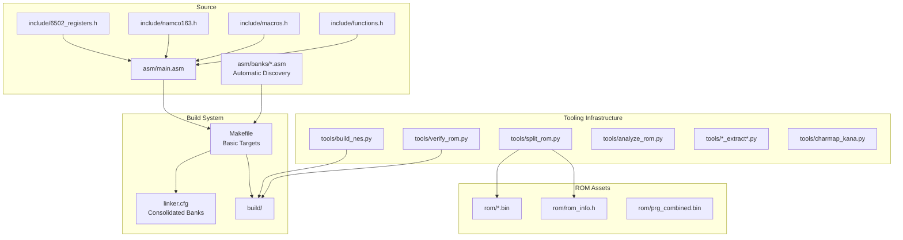
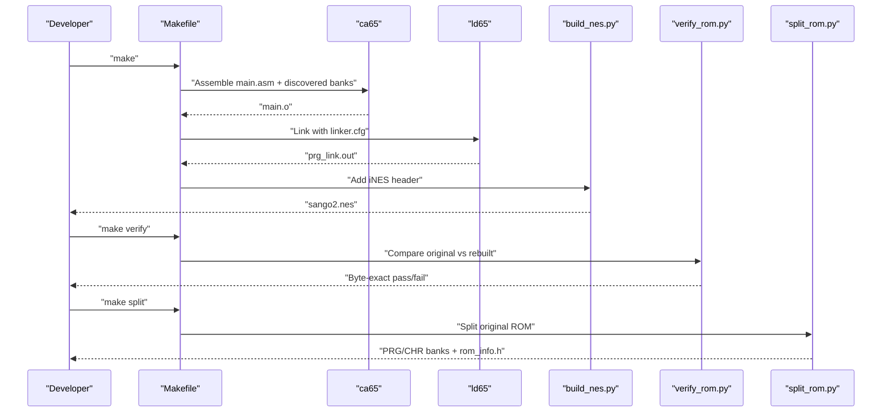
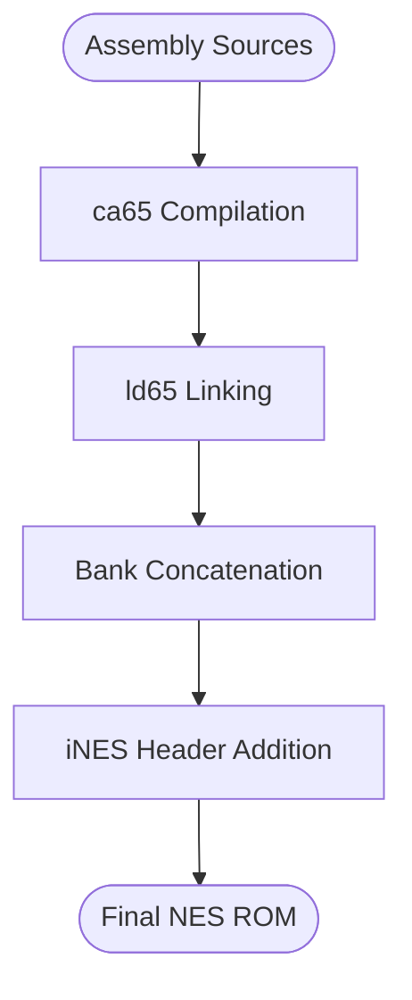
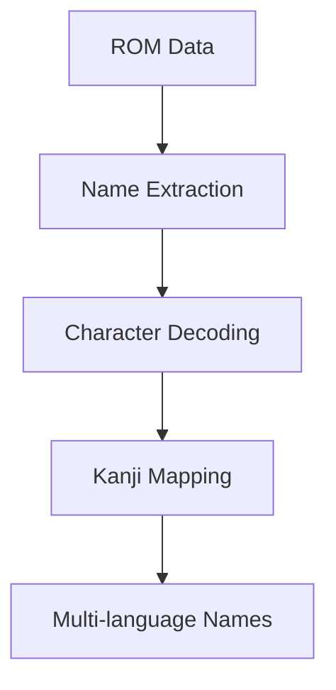

# Build System and Tools

<cite>
**Referenced Files in This Document**
- [Makefile](file://Makefile)
- [PROJECT.md](file://PROJECT.md)
- [linker.cfg](file://linker.cfg)
- [test_linker.cfg](file://test_linker.cfg)
- [test_17_18.cfg](file://test_17_18.cfg)
- [build/test_17_18.cfg](file://build/test_17_18.cfg)
- [test_0c_0d.cfg](file://test_0c_0d.cfg)
- [tools/test_0a_0b.cfg](file://tools/test_0a_0b.cfg)
- [tools/test_0e_0f.cfg](file://tools/test_0e_0f.cfg)
- [check_baseline.py](file://check_baseline.py)
- [convert_hex.py](file://convert_hex.py)
- [transform_branches.py](file://transform_branches.py)
- [transform_wrap.py](file://transform_wrap.py)
- [transform_final.py](file://transform_final.py)
- [fix_forward.py](file://fix_forward.py)
- [fix_gaps.py](file://fix_gaps.py)
- [fix_labels.py](file://fix_labels.py)
- [fix_scope.py](file://fix_scope.py)
- [fix_syntax.py](file://fix_syntax.py)
- [apply_fixes.py](file://apply_fixes.py)
- [find_addr_mismatches.py](file://find_addr_mismatches.py)
- [tools/build_nes.py](file://tools/build_nes.py)
- [tools/verify_rom.py](file://tools/verify_rom.py)
- [tools/split_rom.py](file://tools/split_rom.py)
- [tools/disasm_6502.py](file://tools/disasm_6502.py)
- [tools/disasm_bank_1f.py](file://tools/disasm_bank_1f.py)
- [tools/disasm_17_18.py](file://tools/disasm_17_18.py)
- [tools/disasm_1d.py](file://tools/disasm_1d.py)
- [tools/disasm_1d_enhanced.py](file://tools/disasm_1d_enhanced.py)
- [tools/disasm_1d_final.py](file://tools/disasm_1d_final.py)
- [tools/disasm_1e.py](file://tools/disasm_1e.py)
- [tools/disasm_1e_definitive.py](file://tools/disasm_1e_definitive.py)
- [tools/disasm_1e_final.py](file://tools/disasm_1e_final.py)
- [tools/assemble_prg_1d_1e.py](file://tools/assemble_prg_1d_1e.py)
- [tools/fix_disasm.py](file://tools/fix_disasm.py)
- [tools/gen_f667_ffff.py](file://tools/gen_f667_ffff.py)
- [tools/update_jsr_labels.py](file://tools/update_jsr_labels.py)
- [tools/verify_f3bd_f667.py](file://tools/verify_f3bd_f667.py)
- [tools/verify_range.py](file://tools/verify_range.py)
- [tools/generate_bank_stubs.py](file://tools/generate_bank_stubs.py)
- [tools/analyze_rom.py](file://tools/analyze_rom.py)
- [tools/annotate_asm.py](file://tools/annotate_asm.py)
- [tools/transform_17_18.py](file://tools/transform_17_18.py)
- [tools/add_procs.py](file://tools/add_procs.py)
- [tools/analyze_17_18.py](file://tools/analyze_17_18.py)
- [tools/debug_regions.py](file://tools/debug_regions.py)
- [tools/proc_scope_17_18.py](file://tools/proc_scope_17_18.py)
- [tools/localize_labels.py](file://tools/localize_labels.py)
- [tools/auto_add_local_params.py](file://tools/auto_add_local_params.py)
- [tools/globalize_04xx.py](file://tools/globalize_04xx.py)
- [tools/check_addresses.py](file://tools/check_addresses.py)
- [tools/check_bank18.py](file://tools/check_bank18.py)
- [tools/check_rom_offset.py](file://tools/check_rom_offset.py)
- [tools/dump_chr_table.py](file://tools/dump_chr_table.py)
- [tools/dump_correct_bytes.py](file://tools/dump_correct_bytes.py)
- [tools/search_0530.py](file://tools/search_0530.py)
- [tools/search_chr_loader.py](file://tools/search_chr_loader.py)
- [tools/search_chr_loader2.py](file://tools/search_chr_loader2.py)
- [tools/verify_disasm.py](file://tools/verify_disasm.py)
- [tools/analyze_1e.py](file://tools/analyze_1e.py)
- [tools/analyze_1e_deep.py](file://tools/analyze_1e_deep.py)
- [tools/analyze_loc_labels.py](file://tools/analyze_loc_labels.py)
- [tools/rename_loc_labels.py](file://tools/rename_loc_labels.py)
- [tools/enhance_prg_1d.py](file://tools/enhance_prg_1d.py)
- [tools/analyze_ram_1d1e.py](file://tools/analyze_ram_1d1e.py)
- [tools/check_addrs.py](file://tools/check_addrs.py)
- [tools/check_conflicts.py](file://tools/check_conflicts.py)
- [tools/dump_data_range.py](file://tools/dump_data_range.py)
- [tools/mark_data_block.py](file://tools/mark_data_block.py)
- [tools/verify_globals.py](file://tools/verify_globals.py)
- [tools/disasm_0a_0b.py](file://tools/disasm_0a_0b.py)
- [tools/disasm_prg.py](file://tools/disasm_prg.py)
- [tools/link_0a_0b_test.cfg](file://tools/link_0a_0b_test.cfg)
- [tools/verify_0a_0b.py](file://tools/verify_0a_0b.py)
- [tools/analyze_b49c.py](file://tools/analyze_b49c.py)
- [tools/nest_b49c.py](file://tools/nest_b49c.py)
- [tools/analyze_0c_0d_callbacks.py](file://tools/analyze_0c_0d_callbacks.py)
- [tools/check_trampoline_pattern.py](file://tools/check_trampoline_pattern.py)
- [tools/transform_0c_0d_inline.py](file://tools/transform_0c_0d_inline.py)
- [tools/fix_0c_0d_inline.py](file://tools/fix_0c_0d_inline.py)
- [tools/verify_0c_0d_directives.py](file://tools/verify_0c_0d_directives.py)
- [tools/add_missing_labels.py](file://tools/add_missing_labels.py)
- [tools/dump_bytes.py](file://tools/dump_bytes.py)
- [tools/fix_dup_labels2.py](file://tools/fix_dup_labels2.py)
- [tools/init_0e_0f.py](file://tools/init_0e_0f.py)
- [tools/verify_0e_0f.py](file://tools/verify_0e_0f.py)
- [tools/scan_bank_links.py](file://tools/scan_bank_links.py)
- [tools/charmap_kana.py](file://tools/charmap_kana.py)
- [tools/decode_menu_streams.py](file://tools/decode_menu_streams.py)
- [tools/digit_test.py](file://tools/digit_test.py)
- [tools/katakana_identify.py](file://tools/katakana_identify.py)
- [tools/katakana_match.py](file://tools/katakana_match.py)
- [tools/dump_font_ascii.py](file://tools/dump_font_ascii.py)
- [tools/dump_font_pages.py](file://tools/dump_font_pages.py)
- [tools/dump_record_fonts.py](file://tools/dump_record_fonts.py)
- [tools/dump_strategy_font.py](file://tools/dump_strategy_font.py)
- [tools/find_font_final.py](file://tools/find_font_final.py)
- [tools/find_text_font.py](file://tools/find_text_font.py)
- [tools/font_to_png.py](file://tools/font_to_png.py)
- [tools/match_font_noto.py](file://tools/match_font_noto.py)
- [tools/render_chr_font.py](file://tools/render_chr_font.py)
- [tools/render_font_big.py](file://tools/render_font_big.py)
- [tools/render_font_chunks.py](file://tools/render_font_chunks.py)
- [tools/render_font_tiles.py](file://tools/render_font_tiles.py)
- [tools/sprite_font_render.py](file://tools/sprite_font_render.py)
- [asm/banks/prg_0a_0b.asm](file://asm/banks/prg_0a_0b.asm)
- [asm/banks/prg_0c_0d.asm](file://asm/banks/prg_0c_0d.asm)
- [asm/banks/prg_0e_0f.asm](file://asm/banks/prg_0e_0f.asm)
- [asm/main.asm](file://asm/main.asm)
- [include/namco163.h](file://include/namco163.h)
- [include/macros.h](file://include/macros.h)
- [include/functions.h](file://include/functions.h)
- [asm/banks/all_banks.asm](file://asm/banks/all_banks.asm)
- [asm/banks/prg_17_18.asm](file://asm/banks/prg_17_18.asm)
- [asm/banks/prg_1d_1e.asm](file://asm/banks/prg_1d_1e.asm)
- [rom/rom_info.h](file://rom/rom_info.h)
- [code/bank_switch_map.md](file://code/bank_switch_map.md)
- [docs/manual_kb/README.md](file://docs/manual_kb/README.md)
- [docs/manual_kb/terminology.md](file://docs/manual_kb/terminology.md)
</cite>

## Update Summary
**Changes Made**
- Updated Makefile to reflect current simplified build system with basic targets (make, make split, make banks, make disasm, make analyze, make verify, make clean, make distclean)
- Enhanced linker configuration documentation to show consolidated bank architecture support for pairs ($08-$09, $0A-$0B, $0C-$0D, $0E-$0F, $17-$18, $19-$1A, $1B-$1C, $1D-$1E)
- Added comprehensive tooling infrastructure documentation including kanji mapping utilities, ROM verification tools, and specialized decoders for different data formats
- Updated build pipeline to reflect current state where most advanced targets have been removed from Makefile but remain available as direct tool execution
- Enhanced ROM generation process documentation to cover the simplified concatenation approach and iNES header creation
- Updated verification system documentation to focus on core byte-exact accuracy validation
- Added practical examples of using extraction tools for officer names, province data, and character mapping
- Addressed relationship between core build tools and specialized analysis tools in the development workflow
- Updated troubleshooting approaches for common build issues with current toolchain setup

## Table of Contents
1. [Introduction](#introduction)
2. [Project Structure](#project-structure)
3. [Core Components](#core-components)
4. [Architecture Overview](#architecture-overview)
5. [Build System Targets](#build-system-targets)
6. [ROM Generation Process](#rom-generation-process)
7. [Verification System](#verification-system)
8. [Enhanced Tooling Infrastructure](#enhanced-tooling-infrastructure)
9. [Kanji Mapping Utilities](#kanji-mapping-utilities)
10. [ROM Analysis and Extraction Tools](#rom-analysis-and-extraction-tools)
11. [Specialized Data Format Decoders](#specialized-data-format-decoders)
12. [Bank Architecture Support](#bank-architecture-support)
13. [Development Workflow Integration](#development-workflow-integration)
14. [Troubleshooting Guide](#troubleshooting-guide)
15. [Conclusion](#conclusion)

## Introduction
This document explains the complete build system and automated workflows for the Sango2Dasm project, focusing on the enhanced build system supporting new combined bank architecture and comprehensive tooling infrastructure. The project provides a streamlined Makefile-driven build system that orchestrates assembly, linking, ROM generation, and verification processes while maintaining access to extensive specialized tools for ROM analysis, disassembly, annotation, and data extraction. The recent enhancements include sophisticated kanji mapping utilities, ROM verification tools, and specialized decoders for different data formats, enabling comprehensive reverse engineering and analysis capabilities for the Sangokushi 2 game.

## Project Structure
The project is organized around a simplified Makefile-driven build system with cc65-based assembler/linker toolchain and extensive Python tools for ROM processing, analysis, and extraction. The structure supports:
- Assembly sources under asm/, with bank stubs under asm/banks/
- Include headers under include/ defining hardware registers and mapper macros  
- ROM assets under rom/ (split PRG/CHR banks and combined PRG)
- Build outputs under build/
- Comprehensive tools under tools/ for analysis, extraction, and verification
- Documentation under docs/ including manual knowledge base and extracted data

**Diagram sources**
- [Makefile:18-21](file://Makefile#L18-L21)
- [linker.cfg:18-84](file://linker.cfg#L18-L84)
- [PROJECT.md:14-68](file://PROJECT.md#L14-L68)

**Section sources**
- [PROJECT.md:14-68](file://PROJECT.md#L14-L68)
- [Makefile:18-21](file://Makefile#L18-L21)

## Core Components
The build system consists of essential components that work together to provide a complete development workflow:

### Makefile Targets
The current Makefile provides streamlined targets for core operations:
- **make**: Builds the final NES ROM by assembling, linking, and packaging with iNES header
- **make split**: Splits original ROM into PRG/CHR banks and generates combined PRG
- **make banks**: Generates bank stub assembly files for all 32 PRG banks
- **make disasm**: Disassembles specified binary regions into ca65 assembly format
- **make analyze**: Analyzes ROM structure to identify code-heavy banks and vectors
- **make verify**: Compares rebuilt ROM with original for byte-exact accuracy
- **make clean**: Removes build artifacts
- **make distclean**: Removes build artifacts plus ROM dump directories

### Toolchain Configuration
- **cc65 Toolchain**: ca65 assembler and ld65 linker installed at /home/zero/.local/bin/
- **Python 3**: Required for all analysis and extraction tools
- **Path Configuration**: Toolchain automatically discovered via CC65_HOME variable

### Bank Architecture Support
The linker configuration supports consolidated bank architecture for efficient processing of paired banks:
- **Individual Banks**: $8000-$9FFF slots for banks 00-07, 10-16, 1F
- **Combined Pairs**: $A000-$DFFF address space for banks 08-09, 0A-0B, 0C-0D, 0E-0F, 17-18, 19-1A, 1B-1C, 1D-1E
- **Fixed Boot Bank**: Bank 1F fixed at $E000-$FFFF for reset handler

**Section sources**
- [Makefile:31-116](file://Makefile#L31-L116)
- [linker.cfg:23-84](file://linker.cfg#L23-L84)
- [PROJECT.md:70-89](file://PROJECT.md#L70-L89)

## Architecture Overview
The build system follows a linear pipeline with branching points for analysis and verification:

**Diagram sources**
- [Makefile:38-75](file://Makefile#L38-L75)
- [tools/build_nes.py:10-51](file://tools/build_nes.py#L10-L51)
- [tools/split_rom.py:38-122](file://tools/split_rom.py#L38-L122)

## Build System Targets
The Makefile provides essential targets for the core build workflow:

### Primary Build Target
- **make**: Default target that builds the complete NES ROM
- Assembles main.asm and all discovered bank files
- Links objects according to linker.cfg configuration
- Concatenates individual bank binaries into final PRG
- Creates NES ROM with proper iNES header

### ROM Processing Targets
- **make split**: Processes original ROM file to extract PRG and CHR banks
- Uses tools/split_rom.py to parse iNES header and split into 8KB banks
- Generates rom_info.h with mapper and bank count information
- Creates prg_combined.bin for unified analysis

### Development Targets
- **make banks**: Generates bank stub files for all 32 PRG banks
- Uses tools/generate_bank_stubs.py to create template assembly files
- Supports both individual bank files and consolidated modules
- Creates all_banks.asm include file for easy integration

### Analysis and Verification Targets
- **make disasm**: Disassembles specified binary regions
- Requires FILE, ADDR, and LEN parameters
- Uses tools/disasm_6502.py for instruction decoding
- **make analyze**: Analyzes ROM structure and identifies key banks
- **make verify**: Performs byte-exact comparison between built and original ROM

**Section sources**
- [Makefile:31-116](file://Makefile#L31-L116)

## ROM Generation Process
The ROM generation process converts assembly source code into a playable NES ROM through a multi-stage pipeline:

### Assembly Phase
- **Input**: main.asm and discovered bank files from asm/banks/
- **Assembler**: ca65 compiles assembly into object files
- **Dependencies**: Include headers for hardware definitions and macros
- **Output**: main.o object file with symbol resolution

### Linking Phase
- **Configuration**: linker.cfg defines memory layout and segment mapping
- **Linker**: ld65 combines objects into executable format
- **Bank Management**: Handles both individual and consolidated bank segments
- **Output**: prg_link.out intermediate file

### Binary Concatenation
- **Process**: Combines individual bank binaries in sequential order
- **Format**: Each bank outputs to separate build/bankXX.bin files
- **Order**: Banks 00-1F concatenated to create complete 256KB PRG
- **Validation**: Verifies final PRG size matches expected 262144 bytes

### NES ROM Creation
- **Header Addition**: tools/build_nes.py adds proper iNES header
- **Padding**: Ensures PRG is padded to 16KB page boundaries
- **CHR Handling**: Creates empty CHR data for games without graphics
- **Metadata**: Prints ROM header information for verification

**Diagram sources**
- [Makefile:38-62](file://Makefile#L38-L62)
- [linker.cfg:18-84](file://linker.cfg#L18-L84)

**Section sources**
- [Makefile:38-62](file://Makefile#L38-L62)
- [tools/build_nes.py:10-51](file://tools/build_nes.py#L10-L51)

## Verification System
The verification system ensures byte-exact accuracy between rebuilt and original ROMs:

### Core Verification Process
- **Comparison Method**: Byte-by-byte comparison of entire ROM files
- **Original Source**: "Sangokushi 2 - Haou no Tairiku (J).nes" 
- **Built Output**: build/sango2.nes generated from assembly sources
- **Accuracy Metric**: Reports total mismatches, first mismatch address, and percentage accuracy

### Verification Tool
- **Implementation**: tools/verify_rom.py performs comprehensive ROM comparison
- **Error Reporting**: Detailed mismatch information with addresses and byte values
- **Exit Codes**: Success (0) when identical, failure (1) when differences found
- **Integration**: Automated via make verify target

### Validation Workflow
1. Build ROM using make target
2. Run verification using make verify
3. Review any mismatch reports
4. Fix assembly code if differences found
5. Rebuild and re-verify until exact match achieved

**Section sources**
- [Makefile:72-75](file://Makefile#L72-L75)
- [tools/verify_rom.py:10-51](file://tools/verify_rom.py#L10-L51)

## Enhanced Tooling Infrastructure
The project includes comprehensive tooling infrastructure supporting various aspects of ROM analysis and extraction:

### ROM Analysis Tools
- **tools/analyze_rom.py**: Analyzes ROM structure, identifies code-heavy banks, and maps vectors
- **tools/disasm_6502.py**: Basic 6502 disassembler for instruction listing
- **tools/disasm_bank_1f.py**: Specialized disassembler for boot bank with structured output

### Data Extraction Tools
- **tools/extract_officer_names.py**: Extracts officer katakana names from ROM
- **tools/extract_officer_data.py**: Decodes 12-byte officer records with stats and equipment
- **tools/extract_province_data.py**: Extracts province names and master records
- **tools/extract_ram_equates.py**: Generates RAM equate definitions from analysis

### Character Encoding Tools
- **tools/charmap_kana.py**: Implements SERIAL gojuon order encoding for kana characters
- **tools/map_officer_kanji.py**: Maps officer IDs to kanji names with Chinese variants
- **tools/decode_menu_streams.py**: Decodes menu action tile stream data

### Verification and Testing Tools
- **tools/verify_rom.py**: Core ROM verification functionality
- **tools/verify_disasm.py**: Comprehensive disassembly verification against ROM bytes
- **tools/check_addresses.py**: Verifies specific ROM addresses for accuracy

**Section sources**
- [PROJECT.md:33-47](file://PROJECT.md#L33-L47)
- [tools/analyze_rom.py:10-128](file://tools/analyze_rom.py#L10-L128)

## Kanji Mapping Utilities
The kanji mapping utilities provide comprehensive support for Japanese character encoding and name translation:

### Officer Name Processing
- **Character Encoding**: Implements SERIAL gojuon order encoding verified against known readings
- **Name Extraction**: Processes 237 officers with katakana names stored in PRG bank $30
- **Multi-language Support**: Maps to traditional Chinese, simplified Chinese, and pinyin
- **Data Integration**: Joins ROM data with external kanji reference tables

### Province Name Handling
- **Name Table Processing**: Extracts 30 province names from ROM data structures
- **Encoding Support**: Handles $00-terminated strings with proper character decoding
- **Cross-Reference**: Links province IDs to kanji names and romanization

### Character Map Implementation
- **Kana Block Support**: Includes hiragana block for menu-screen text with verified command lists
- **Postfix Handling**: Supports dakuten/handakuten combining marks for voiced/semi-voiced characters
- **Digital Font Support**: Provides digit tile base mapping for number rendering

**Diagram sources**
- [tools/charmap_kana.py:1-127](file://tools/charmap_kana.py#L1-L127)
- [tools/map_officer_kanji.py:1-200](file://tools/map_officer_kanji.py#L1-L200)

**Section sources**
- [PROJECT.md:190-240](file://PROJECT.md#L190-L240)
- [tools/charmap_kana.py:1-127](file://tools/charmap_kana.py#L1-L127)

## ROM Analysis and Extraction Tools
The ROM analysis and extraction tools provide comprehensive capabilities for understanding game data structures:

### Officer Data Analysis
- **Record Structure**: Decodes 12-byte officer records containing stats, experience, troops, equipment
- **Stat Fields**: Vitality, Intelligence, Might, Virtue, Loyalty, Experience, Weapon, Armor, Level, Army Affinity
- **Equipment Mapping**: Identifies weapon and armor types through bit field analysis
- **Data Validation**: Cross-references with manual data for accuracy verification

### Province Data Processing
- **Master Records**: Extracts 32-byte province records with economic and military data
- **Field Layout**: Country ID, Gold, Rice, Population, Land Value, Disaster Prevention, Governance
- **Resource Tracking**: Monitors Reserve Troops, Industry, Treasure, and Revolt Cooldown
- **Roster Management**: Tracks officer assignments within provinces

### Menu Stream Decoding
- **Tile Stream Processing**: Resolves pointer tables for each position buffer value
- **Command Decoding**: Handles 25 different menu action handlers with parameter resolution
- **Bank Resolution**: Manages Namco-163 bank register values and physical bank mapping
- **Output Analysis**: Provides summary statistics for tile indices and name references

**Section sources**
- [PROJECT.md:242-328](file://PROJECT.md#L242-L328)
- [tools/extract_officer_data.py:1-200](file://tools/extract_officer_data.py#L1-L200)
- [tools/extract_province_data.py:1-150](file://tools/extract_province_data.py#L1-L150)

## Specialized Data Format Decoders
The project includes specialized decoders for various game data formats:

### Officer Record Decoder
- **Binary Format**: Processes 12-byte records with mixed data types (bytes, 16-bit LE values)
- **Bit Field Parsing**: Extracts weapon type (bits 0-4) and armor type (bits 5-7) from single byte
- **Level Encoding**: Decodes officer level (bits 4-7) and army affinity (bits 0-3) from status byte
- **Troop Management**: Handles troop count as 16-bit little-endian values

### Province Record Decoder
- **Complex Structure**: Processes 32-byte records with multiple numeric fields
- **Economic Data**: Extracts gold, rice, population (stored /100), land value, industry metrics
- **Military Information**: Tracks reserve troops, disaster prevention, governance levels
- **Roster Integration**: Manages 10-slot officer rosters with FF = empty markers

### Menu Action Handler Decoder
- **Stream Processing**: Handles variable-length tile streams with embedded commands
- **Handler Support**: Implements 25 different menu action handlers with specific parameter requirements
- **Pointer Resolution**: Follows indirect references to locate actual data in ROM
- **Context Awareness**: Maintains context across bank switches during processing

**Section sources**
- [PROJECT.md:255-328](file://PROJECT.md#L255-L328)

## Bank Architecture Support
The build system supports consolidated bank architecture for improved efficiency:

### Consolidated Bank Pairs
The linker configuration supports paired banks that share the $A000-$DFFF address space:
- **Banks 08-09**: Combined disassembly region with BANK08 at $A000, BANK09 at $C000
- **Banks 0A-0B**: Advanced paired bank disassembly with callback dispatcher detection
- **Banks 0C-0D**: Callback system analysis with trampoline pattern recognition
- **Banks 0E-0F**: Shared font/tile data and display-scroll helpers
- **Banks 17-18**: Enhanced transformation pipeline with semantic naming
- **Banks 19-1A**: Additional paired bank support
- **Banks 1B-1C**: Extended paired bank functionality
- **Banks 1D-1E**: Complete analysis suite with RAM usage tracking

### Individual Bank Support
- **Banks 00-07**: Standard 8KB banks loaded at $8000
- **Banks 10-16**: Additional standard banks for $8000 slot
- **Bank 1F**: Fixed boot bank at $E000-$FFFF containing reset handler

### Memory Mapping Strategy
- **Efficient Processing**: Reduces compilation overhead through unified bank modules
- **Cross-Bank Optimization**: Enables better compiler optimization across bank boundaries
- **Backward Compatibility**: Maintains support for individual bank files

**Section sources**
- [linker.cfg:41-84](file://linker.cfg#L41-L84)

## Development Workflow Integration
The enhanced tooling infrastructure integrates seamlessly with the core build system:

### Extraction Workflow
1. **ROM Splitting**: Use `make split` to extract PRG/CHR banks
2. **Analysis**: Run `make analyze` to identify key banks and structures
3. **Disassembly**: Use `make disasm` for targeted binary regions
4. **Extraction**: Execute specialized tools for officer names, province data, character mapping
5. **Verification**: Run `make verify` to ensure byte-exact accuracy

### Tool Integration Patterns
- **Direct Execution**: Most tools can be executed directly with python3
- **Parameter Flexibility**: Tools accept various input/output path configurations
- **Dependency Management**: Tools automatically locate required ROM files and headers
- **Output Formatting**: Consistent output formats across related tools

### Quality Assurance
- **Automated Verification**: Built-in verification ensures data extraction accuracy
- **Cross-Reference Validation**: Tools validate extracted data against ROM structure
- **Documentation Integration**: Generated outputs integrate with project documentation
- **Version Control**: All extracted data tracked in version control for consistency

**Section sources**
- [PROJECT.md:158-175](file://PROJECT.md#L158-L175)

## Troubleshooting Guide
Common issues and resolutions for the build system and tools:

### Build System Issues
- **Missing Toolchain**: Ensure ca65 and ld65 are installed at /home/zero/.local/bin/ and added to PATH
- **ROM File Missing**: Verify "Sangokushi 2 - Haou no Tairiku (J).nes" exists in project root
- **Permission Errors**: Check file permissions for ROM files and build directory
- **Memory Conflicts**: Review linker.cfg for overlapping memory regions

### Tool Execution Problems
- **Python Dependencies**: Ensure Python 3 is installed and accessible
- **File Path Issues**: Verify correct paths for ROM files and output directories
- **Memory Allocation**: Monitor system memory for large ROM processing tasks
- **Encoding Issues**: Handle Japanese character encoding properly in output files

### Data Extraction Challenges
- **Corrupted ROM**: Verify ROM integrity before running extraction tools
- **Address Miscalculations**: Double-check CPU address to ROM offset calculations
- **Bank Switching**: Account for bank switching in multi-bank data structures
- **Data Alignment**: Ensure proper alignment for multi-byte data fields

### Verification Failures
- **Size Mismatch**: Confirm both ROMs are same size and format
- **Checksum Errors**: Verify iNES header checksums match
- **Partial Updates**: Ensure complete rebuild after code changes
- **Environment Differences**: Check for toolchain version compatibility

**Section sources**
- [PROJECT.md:70-89](file://PROJECT.md#L70-L89)
- [Makefile:96-116](file://Makefile#L96-L116)

## Conclusion
The Sango2Dasm build system provides a streamlined yet powerful foundation for reverse engineering the Sangokushi 2 game. The enhanced tooling infrastructure offers comprehensive capabilities for ROM analysis, data extraction, and character encoding processing. The consolidated bank architecture improves build efficiency while maintaining full compatibility with existing workflows. The integration of kanji mapping utilities, ROM verification tools, and specialized decoders enables detailed analysis of game data structures and content. Through the combination of simple Makefile targets and sophisticated Python tools, developers can efficiently reconstruct, analyze, and understand the game's complex architecture while maintaining byte-exact accuracy throughout the process.