# Build System and Tools

<cite>
**Referenced Files in This Document**
- [Makefile](file://Makefile)
- [PROJECT.md](file://PROJECT.md)
- [linker.cfg](file://linker.cfg)
- [test_linker.cfg](file://test_linker.cfg)
- [test_17_18.cfg](file://test_17_18.cfg)
- [build/test_17_18.cfg](file://build/test_17_18.cfg)
- [test_0c_0d.cfg](file://test_0c_0d.cfg)
- [check_baseline.py](file://check_baseline.py)
- [convert_hex.py](file://convert_hex.py)
- [transform_branches.py](file://transform_branches.py)
- [transform_wrap.py](file://transform_wrap.py)
- [transform_final.py](file://transform_final.py)
- [fix_forward.py](file://fix_forward.py)
- [fix_gaps.py](file://fix_gaps.py)
- [fix_labels.py](file://fix_labels.py)
- [fix_scope.py](file://fix_scope.py)
- [fix_syntax.py](file://fix_syntax.py)
- [apply_fixes.py](file://apply_fixes.py)
- [tools/build_nes.py](file://tools/build_nes.py)
- [tools/verify_rom.py](file://tools/verify_rom.py)
- [tools/split_rom.py](file://tools/split_rom.py)
- [tools/disasm_6502.py](file://tools/disasm_6502.py)
- [tools/disasm_bank_1f.py](file://tools/disasm_bank_1f.py)
- [tools/disasm_17_18.py](file://tools/disasm_17_18.py)
- [tools/disasm_1d.py](file://tools/disasm_1d.py)
- [tools/disasm_1d_enhanced.py](file://tools/disasm_1d_enhanced.py)
- [tools/disasm_1d_final.py](file://tools/disasm_1d_final.py)
- [tools/disasm_1e.py](file://tools/disasm_1e.py)
- [tools/disasm_1e_definitive.py](file://tools/disasm_1e_definitive.py)
- [tools/disasm_1e_final.py](file://tools/disasm_1e_final.py)
- [tools/assemble_prg_1d_1e.py](file://tools/assemble_prg_1d_1e.py)
- [tools/fix_disasm.py](file://tools/fix_disasm.py)
- [tools/gen_f667_ffff.py](file://tools/gen_f667_ffff.py)
- [tools/update_jsr_labels.py](file://tools/update_jsr_labels.py)
- [tools/verify_f3bd_f667.py](file://tools/verify_f3bd_f667.py)
- [tools/verify_range.py](file://tools/verify_range.py)
- [tools/generate_bank_stubs.py](file://tools/generate_bank_stubs.py)
- [tools/analyze_rom.py](file://tools/analyze_rom.py)
- [tools/annotate_asm.py](file://tools/annotate_asm.py)
- [tools/transform_17_18.py](file://tools/transform_17_18.py)
- [tools/add_procs.py](file://tools/add_procs.py)
- [tools/analyze_17_18.py](file://tools/analyze_17_18.py)
- [tools/debug_regions.py](file://tools/debug_regions.py)
- [tools/proc_scope_17_18.py](file://tools/proc_scope_17_18.py)
- [tools/localize_labels.py](file://tools/localize_labels.py)
- [tools/auto_add_local_params.py](file://tools/auto_add_local_params.py)
- [tools/globalize_04xx.py](file://tools/globalize_04xx.py)
- [tools/check_addresses.py](file://tools/check_addresses.py)
- [tools/check_bank18.py](file://tools/check_bank18.py)
- [tools/check_rom_offset.py](file://tools/check_rom_offset.py)
- [tools/dump_chr_table.py](file://tools/dump_chr_table.py)
- [tools/dump_correct_bytes.py](file://tools/dump_correct_bytes.py)
- [tools/search_0530.py](file://tools/search_0530.py)
- [tools/search_chr_loader.py](file://tools/search_chr_loader.py)
- [tools/search_chr_loader2.py](file://tools/search_chr_loader2.py)
- [tools/verify_disasm.py](file://tools/verify_disasm.py)
- [tools/analyze_1e.py](file://tools/analyze_1e.py)
- [tools/analyze_1e_deep.py](file://tools/analyze_1e_deep.py)
- [tools/analyze_loc_labels.py](file://tools/analyze_loc_labels.py)
- [tools/rename_loc_labels.py](file://tools/rename_loc_labels.py)
- [tools/enhance_prg_1d.py](file://tools/enhance_prg_1d.py)
- [tools/analyze_ram_1d1e.py](file://tools/analyze_ram_1d1e.py)
- [tools/check_addrs.py](file://tools/check_addrs.py)
- [tools/check_conflicts.py](file://tools/check_conflicts.py)
- [tools/dump_data_range.py](file://tools/dump_data_range.py)
- [tools/mark_data_block.py](file://tools/mark_data_block.py)
- [tools/verify_globals.py](file://tools/verify_globals.py)
- [tools/disasm_0a_0b.py](file://tools/disasm_0a_0b.py)
- [tools/disasm_prg.py](file://tools/disasm_prg.py)
- [tools/link_0a_0b_test.cfg](file://tools/link_0a_0b_test.cfg)
- [tools/verify_0a_0b.py](file://tools/verify_0a_0b.py)
- [tools/analyze_b49c.py](file://tools/analyze_b49c.py)
- [tools/nest_b49c.py](file://tools/nest_b49c.py)
- [tools/analyze_0c_0d_callbacks.py](file://tools/analyze_0c_0d_callbacks.py)
- [tools/check_trampoline_pattern.py](file://tools/check_trampoline_pattern.py)
- [tools/transform_0c_0d_inline.py](file://tools/transform_0c_0d_inline.py)
- [tools/fix_0c_0d_inline.py](file://tools/fix_0c_0d_inline.py)
- [tools/verify_0c_0d_directives.py](file://tools/verify_0c_0d_directives.py)
- [asm/banks/prg_0a_0b.asm](file://asm/banks/prg_0a_0b.asm)
- [asm/banks/prg_0c_0d.asm](file://asm/banks/prg_0c_0d.asm)
- [asm/main.asm](file://asm/main.asm)
- [include/namco163.h](file://include/namco163.h)
- [include/macros.h](file://include/macros.h)
- [include/functions.h](file://include/functions.h)
- [asm/banks/all_banks.asm](file://asm/banks/all_banks.asm)
- [asm/banks/prg_17_18.asm](file://asm/banks/prg_17_18.asm)
- [asm/banks/prg_1d_1e.asm](file://asm/banks/prg_1d_1e.asm)
</cite>

## Update Summary
**Changes Made**
- Added comprehensive documentation for new PRG bank $0C/$0D callback system analysis tools including analyze_0c_0d_callbacks.py, check_trampoline_pattern.py, transform_0c_0d_inline.py, fix_0c_0d_inline.py, and verify_0c_0d_directives.py
- Enhanced build pipeline documentation with new test configuration file test_0c_0d.cfg for standalone verification of consolidated prg_0c_0d.asm module
- Updated Makefile targets section to include new specialized analysis and transformation tools for callback system handling
- Added detailed coverage of BankedCallbackTrampoline ($EE07) and CallbackDispatcher ($EADE) patterns with inline data transformation capabilities
- Integrated new trampoline pattern validation and inline data transformation workflows into the existing build system architecture

## Table of Contents
1. [Introduction](#introduction)
2. [Project Structure](#project-structure)
3. [Core Components](#core-components)
4. [Architecture Overview](#architecture-overview)
5. [Detailed Component Analysis](#detailed-component-analysis)
6. [Unified Disassembly Pipeline](#unified-disassembly-pipeline)
7. [Enhanced Disassembly Tools](#enhanced-disassembly-tools)
8. [Advanced Paired Bank Disassembly](#advanced-paired-bank-disassembly)
9. [AI Code Modernization Tools](#ai-code-modernization-tools)
10. [Transformation Pipeline](#transformation-pipeline)
11. [RAM Centralization and Standardization](#ram-centralization-and-standardization)
12. [ROM Analysis and Verification Tools](#rom-analysis-and-verification-tools)
13. [PRG Banks $1D/$1E Analysis Suite](#prg-banks-1d1e-analysis-suite)
14. [Label Analysis and Renaming System](#label-analysis-and-renaming-system)
15. [PRG Bank $0C/$0D Callback System Analysis](#prg-bank-0c0d-callback-system-analysis)
16. [Dependency Analysis](#dependency-analysis)
17. [Performance Considerations](#performance-considerations)
18. [Troubleshooting Guide](#troubleshooting-guide)
19. [Conclusion](#conclusion)
20. [Appendices](#appendices)

## Introduction
This document explains the complete build system and automated workflows for the Sango2Dasm project. It covers the Makefile targets, the ROM generation pipeline from assembly through linking to the final NES ROM with proper iNES headers, the verification system that ensures byte-exact rebuilds, and the enhanced annotation tools used to document and validate disassembly. The project now features a comprehensive unified disassembly approach that provides automated cleanup, cross-bank reference handling, address-to-symbol mapping, and specialized tools for different ROM regions. The recent addition of the automated RAM centralization tool provides systematic approach to maintaining consistent memory address definitions across the codebase, significantly improving code readability and maintainability. The enhanced toolchain now includes specialized disassemblers for Bank $1D and $1E, cross-reference analysis tools, automated verification systems, sophisticated label analysis and renaming capabilities, and a comprehensive suite of Python analysis tools specifically designed for PRG banks $1D/$1E including RAM usage analysis, address validation, symbol conflict detection, data extraction, automated data insertion, and global variable validation. **New**: Advanced paired bank disassembly tools provide sophisticated recursive descent algorithms for analyzing complex bank pairs with callback dispatchers and inline table detection, complemented by specialized verification tools for byte-exact accuracy validation. **New**: AI code modernization tools provide automated analysis and structural optimization for the AI turn dispatch system with intelligent branch instruction fixing and semantic renaming capabilities using the new modular Ai* architecture with improved nested procedure support. **Updated**: Bank stub generation and assembly process now supports consolidated bank modules like prg_0c_0d.asm, reducing compilation overhead through unified bank management while maintaining compatibility with individual bank files. **New**: Specialized PRG bank $0C/$0D callback system analysis tools provide comprehensive analysis of BankedCallbackTrampoline and CallbackDispatcher patterns with inline data transformation capabilities and standalone verification support.

## Project Structure
The project is organized around a Makefile-driven build system, a cc65-based assembler/linker toolchain, and a suite of Python tools for ROM splitting, disassembly, analysis, annotation, verification, and assembly transformation. The structure supports:
- Assembly sources under asm/, with bank stubs under asm/banks/
- Include headers under include/ defining hardware registers and mapper macros
- ROM assets under rom/ (split PRG/CHR banks and combined PRG)
- Build outputs under build/
- Automated tools under tools/
- **New**: Comprehensive transformation pipeline with sophisticated semantic naming, enhanced code organization, and automated tooling for PRG bank $17/$18 assembly code maintainability
- **New**: Specialized disassembly tools for Bank $1D ($A000-$BFFF) and Bank $1E ($C000-$DFFF) with combined assembly pipeline
- **New**: Advanced label analysis and renaming system for automated Loc_ label processing and meaningful name assignment
- **New**: Comprehensive PRG banks $1D/$1E analysis suite providing RAM usage analysis, address validation, symbol conflict detection, data extraction, automated data insertion, and global variable validation
- **New**: Advanced paired bank disassembly tools for complex bank pairs with recursive descent algorithms and callback dispatcher detection, plus specialized verification tools for byte-exact accuracy validation
- **New**: AI code modernization tools for automated analysis and structural optimization of the AI turn dispatch system with new modular Ai* architecture and improved nested procedure support
- **Updated**: Consolidated bank management supporting unified bank modules like prg_0c_0d.asm for reduced compilation overhead
- **New**: Specialized PRG bank $0C/$0D callback system analysis tools with standalone verification configuration

```mermaid
graph TB
subgraph "Source"
A_main["asm/main.asm"]
A_banks["asm/banks/*.asm"]
A_consolidated["asm/banks/prg_0c_0d.asm<br/>Consolidated Module"]
H_regs["include/6502_registers.h"]
H_namco["include/namco163.h"]
H_macros["include/macros.h"]
H_functions["include/functions.h"]
end
subgraph "Build"
MK["Makefile"]
CFG["linker.cfg"]
TEST_CFG["test_linker.cfg"]
TEST_17_18["test_17_18.cfg"]
TEST_17_18_BUILD["build/test_17_18.cfg"]
TEST_0C_0D["test_0c_0d.cfg"]
OUT["build/"]
end
subgraph "Unified Disassembly Pipeline"
UD1["disasm_17_18.py<br/>710 lines"]
UD2["fix_disasm.py"]
UD3["gen_f667_ffff.py"]
UD4["update_jsr_labels.py"]
UD5["verify_f3bd_f667.py"]
UD6["verify_range.py"]
end
subgraph "Enhanced Transformation Pipeline"
TP1["transform_17_18.py<br/>348 lines - Semantic Naming"]
TP2["add_procs.py<br/>189 lines - Basic Scoping"]
TP3["analyze_17_18.py<br/>118 lines - Boundary Analysis"]
TP4["debug_regions.py<br/>98 lines - Transition Debugging"]
TP5["proc_scope_17_18.py<br/>Enhanced .proc/.endproc"]
TP6["localize_labels.py<br/>New tool for @local labels"]
TP7["auto_add_local_params.py<br/>415 lines - Automated parameter naming"]
TP8["globalize_04xx.py<br/>205 lines - RAM centralization"]
end
subgraph "Bank $1D/$1E Disassembly Pipeline"
B1D["disasm_1d.py<br/>Complete 6502 disassembler"]
B1DE["disasm_1d_enhanced.py<br/>Enhanced with section markers"]
B1DF["disasm_1d_final.py<br/>Final assembly generator"]
B1E["disasm_1e.py<br/>Two-pass disassembler"]
B1ED["disasm_1e_definitive.py<br/>Definitive data region handling"]
B1EF["disasm_1e_final.py<br/>Simple linear-sweep"]
B1D1E["assemble_prg_1d_1e.py<br/>Combined assembly builder"]
end
subgraph "Advanced Paired Bank Disassembly & Verification"
APB1["disasm_0a_0b.py<br/>Recursive descent for banks $0A/$0B"]
APB2["disasm_prg.py<br/>General-purpose combined PRG disassembler"]
APB3["link_0a_0b_test.cfg<br/>Test linker configuration"]
APB4["verify_0a_0b.py<br/>Byte-exact verification tool"]
end
subgraph "AI Code Modernization Tools - Modular Ai* Architecture"
AI1["analyze_b49c.py<br/>AI turn dispatch analysis with Ai* naming"]
AI2["nest_b49c.py<br/>Nested procedure restructuring"]
end
subgraph "PRG Banks $1D/$1E Analysis Suite"
AN1["analyze_ram_1d1e.py<br/>RAM usage analysis"]
AN2["check_addrs.py<br/>Address validation"]
AN3["check_conflicts.py<br/>Symbol conflict detection"]
AN4["dump_data_range.py<br/>ROM data extraction"]
AN5["mark_data_block.py<br/>Automated data insertion"]
AN6["verify_globals.py<br/>Global variable validation"]
end
subgraph "Label Analysis & Renaming"
LA1["analyze_loc_labels.py<br/>Loc_ label analysis"]
LA2["rename_loc_labels.py<br/>Automated label renaming"]
LA3["enhance_prg_1d.py<br/>Enhanced Bank $1D processing"]
end
subgraph "ROM Analysis and Verification"
RA1["check_addresses.py<br/>Address verification"]
RA2["check_bank18.py<br/>Bank validation"]
RA3["check_rom_offset.py<br/>Offset mapping"]
RA4["dump_chr_table.py<br/>CHR table inspection"]
RA5["dump_correct_bytes.py<br/>Correct bytes verification"]
RA6["search_0530.py<br/>$0530 pattern search"]
RA7["search_chr_loader.py<br/>CHR loader pattern"]
RA8["search_chr_loader2.py<br/>Specific CHR loader"]
RA9["verify_disasm.py<br/>Disassembly verification"]
RA10["analyze_1e.py<br/>Structure analysis"]
RA11["analyze_1e_deep.py<br/>Deep structure analysis"]
end
subgraph "PRG Bank $0C/$0D Callback System Analysis"
CS1["analyze_0c_0d_callbacks.py<br/>Callback pattern analysis"]
CS2["check_trampoline_pattern.py<br/>Trampoline validation"]
CS3["transform_0c_0d_inline.py<br/>Inline data transformation"]
CS4["fix_0c_0d_inline.py<br/>Inline data fixing"]
CS5["verify_0c_0d_directives.py<br/>Directive verification"]
end
subgraph "Tools"
T_build["tools/build_nes.py"]
T_verify["tools/verify_rom.py"]
T_split["tools/split_rom.py"]
T_disasm["tools/disasm_6502.py"]
T_disasm1f["tools/disasm_bank_1f.py"]
T_gen["tools/generate_bank_stubs.py"]
T_analyze["tools/analyze_rom.py"]
T_annotate["tools/annotate_asm.py"]
end
subgraph "ROM Assets"
R_rom["rom/*.bin"]
R_info["rom/rom_info.h"]
R_combined["rom/prg_combined.bin"]
end
A_main --> MK
A_banks --> MK
A_consolidated --> MK
H_regs --> A_main
H_namco --> A_main
H_macros --> A_main
H_functions --> T_update_jsr
MK --> CFG
MK --> TEST_CFG
MK --> TEST_17_18
MK --> TEST_17_18_BUILD
MK --> TEST_0C_0D
MK --> OUT
MK --> UD1
MK --> UD2
MK --> UD3
MK --> UD4
MK --> UD5
MK --> UD6
MK --> TP1
MK --> TP2
MK --> TP3
MK --> TP4
MK --> TP5
MK --> TP6
MK --> TP7
MK --> TP8
MK --> B1D
MK --> B1DE
MK --> B1DF
MK --> B1E
MK --> B1ED
MK --> B1EF
MK --> B1D1E
MK --> APB1
MK --> APB2
MK --> APB4
MK --> AI1
MK --> AI2
MK --> AN1
MK --> AN2
MK --> AN3
MK --> AN4
MK --> AN5
MK --> AN6
MK --> LA1
MK --> LA2
MK --> LA3
MK --> RA1
MK --> RA2
MK --> RA3
MK --> RA4
MK --> RA5
MK --> RA6
MK --> RA7
MK --> RA8
MK --> RA9
MK --> RA10
MK --> RA11
MK --> CS1
MK --> CS2
MK --> CS3
MK --> CS4
MK --> CS5
MK --> T_build
MK --> T_verify
MK --> T_split
MK --> T_disasm
MK --> T_disasm1f
MK --> T_gen
MK --> T_analyze
MK --> T_annotate
T_split --> R_rom
T_split --> R_info
T_split --> R_combined
T_build --> OUT
T_verify --> OUT
```

**Diagram sources**
- [Makefile:1-102](file://Makefile#L1-L102)
- [linker.cfg:1-66](file://linker.cfg#L1-L66)
- [test_linker.cfg:1-13](file://test_linker.cfg#L1-L13)
- [test_17_18.cfg:1-9](file://test_17_18.cfg#L1-L9)
- [build/test_17_18.cfg:1-11](file://build/test_17_18.cfg#L1-L11)
- [test_0c_0d.cfg:1-13](file://test_0c_0d.cfg#L1-L13)
- [tools/disasm_17_18.py:1-710](file://tools/disasm_17_18.py#L1-L710)
- [tools/fix_disasm.py:1-56](file://tools/fix_disasm.py#L1-L56)
- [tools/gen_f667_ffff.py:1-396](file://tools/gen_f667_ffff.py#L1-L396)
- [tools/update_jsr_labels.py:1-137](file://tools/update_jsr_labels.py#L1-L137)
- [tools/verify_f3bd_f667.py:1-45](file://tools/verify_f3bd_f667.py#L1-L45)
- [tools/verify_range.py:1-42](file://tools/verify_range.py#L1-L42)
- [tools/disasm_1d.py:1-214](file://tools/disasm_1d.py#L1-L214)
- [tools/disasm_1d_enhanced.py:1-443](file://tools/disasm_1d_enhanced.py#L1-L443)
- [tools/disasm_1d_final.py:1-210](file://tools/disasm_1d_final.py#L1-L210)
- [tools/disasm_1e.py:1-512](file://tools/disasm_1e.py#L1-L512)
- [tools/disasm_1e_definitive.py:1-522](file://tools/disasm_1e_definitive.py#L1-L522)
- [tools/disasm_1e_final.py:1-494](file://tools/disasm_1e_final.py#L1-L494)
- [tools/assemble_prg_1d_1e.py:1-41](file://tools/assemble_prg_1d_1e.py#L1-L41)
- [tools/disasm_0a_0b.py:1-1258](file://tools/disasm_0a_0b.py#L1-L1258)
- [tools/disasm_prg.py:1-523](file://tools/disasm_prg.py#L1-L523)
- [tools/verify_0a_0b.py:1-28](file://tools/verify_0a_0b.py#L1-L28)
- [tools/link_0a_0b_test.cfg:1-10](file://tools/link_0a_0b_test.cfg#L1-L10)
- [tools/transform_17_18.py:1-348](file://tools/transform_17_18.py#L1-L348)
- [tools/add_procs.py:1-189](file://tools/add_procs.py#L1-L189)
- [tools/analyze_17_18.py:1-118](file://tools/analyze_17_18.py#L1-L118)
- [tools/debug_regions.py:1-98](file://tools/debug_regions.py#L1-L98)
- [tools/proc_scope_17_18.py:1-813](file://tools/proc_scope_17_18.py#L1-L813)
- [tools/localize_labels.py:1-526](file://tools/localize_labels.py#L1-L526)
- [tools/auto_add_local_params.py:1-416](file://tools/auto_add_local_params.py#L1-L416)
- [tools/globalize_04xx.py:1-205](file://tools/globalize_04xx.py#L1-L205)
- [tools/check_addresses.py:1-33](file://tools/check_addresses.py#L1-L33)
- [tools/check_bank18.py:1-50](file://tools/check_bank18.py#L1-L50)
- [tools/check_rom_offset.py:1-43](file://tools/check_rom_offset.py#L1-L43)
- [tools/dump_chr_table.py:1-13](file://tools/dump_chr_table.py#L1-L13)
- [tools/dump_correct_bytes.py:1-35](file://tools/dump_correct_bytes.py#L1-L35)
- [tools/search_0530.py:1-23](file://tools/search_0530.py#L1-L23)
- [tools/search_chr_loader.py:1-15](file://tools/search_chr_loader.py#L1-L15)
- [tools/search_chr_loader2.py:1-21](file://tools/search_chr_loader2.py#L1-L21)
- [tools/verify_disasm.py:1-34](file://tools/verify_disasm.py#L1-L34)
- [tools/analyze_1e.py:1-36](file://tools/analyze_1e.py#L1-L36)
- [tools/analyze_1e_deep.py:1-53](file://tools/analyze_1e_deep.py#L1-L53)
- [tools/analyze_loc_labels.py:1-84](file://tools/analyze_loc_labels.py#L1-L84)
- [tools/rename_loc_labels.py:1-339](file://tools/rename_loc_labels.py#L1-L339)
- [tools/enhance_prg_1d.py:1-254](file://tools/enhance_prg_1d.py#L1-L254)
- [tools/analyze_ram_1d1e.py:1-102](file://tools/analyze_ram_1d1e.py#L1-L102)
- [tools/check_addrs.py:1-56](file://tools/check_addrs.py#L1-L56)
- [tools/check_conflicts.py:1-42](file://tools/check_conflicts.py#L1-L42)
- [tools/dump_data_range.py:1-13](file://tools/dump_data_range.py#L1-L13)
- [tools/mark_data_block.py:1-56](file://tools/mark_data_block.py#L1-L56)
- [tools/verify_globals.py:1-105](file://tools/verify_globals.py#L1-L105)
- [tools/analyze_b49c.py:1-281](file://tools/analyze_b49c.py#L1-L281)
- [tools/nest_b49c.py:1-149](file://tools/nest_b49c.py#L1-L149)
- [tools/analyze_0c_0d_callbacks.py:1-257](file://tools/analyze_0c_0d_callbacks.py#L1-L257)
- [tools/check_trampoline_pattern.py:1-65](file://tools/check_trampoline_pattern.py#L1-L65)
- [tools/transform_0c_0d_inline.py:1-393](file://tools/transform_0c_0d_inline.py#L1-L393)
- [tools/fix_0c_0d_inline.py:1-226](file://tools/fix_0c_0d_inline.py#L1-L226)
- [tools/verify_0c_0d_directives.py:1-84](file://tools/verify_0c_0d_directives.py#L1-L84)

**Section sources**
- [PROJECT.md:14-47](file://PROJECT.md#L14-L47)
- [Makefile:12-31](file://Makefile#L12-L31)

## Core Components
- Makefile targets orchestrate the entire pipeline: assembling, linking, building the final ROM, splitting ROMs, disassembling, analyzing, verifying, cleaning, and the new unified disassembly pipeline with transformation tools.
- The cc65 toolchain (ca65 and ld65) compiles assembly into an object file and links it according to the linker configuration.
- Python tools handle ROM parsing, bank generation, disassembly, analysis, annotation, verification, and the comprehensive unified disassembly pipeline with transformation tools.
- **New**: Enhanced transformation pipeline provides sophisticated tools for PRG bank $17/$18 assembly code with semantic naming conventions, comprehensive .proc/.endproc organization, and advanced boundary analysis.
- **New**: Automated parameter declaration tool provides systematic approach to maintaining consistent parameter naming conventions across assembly code.
- **New**: RAM centralization tool provides systematic approach to standardizing $04xx memory region definitions with centralized global RAM definitions.
- **New**: Comprehensive ROM analysis and verification toolkit provides dedicated tools for byte-level ROM inspection, pattern matching, and cross-referencing.
- **New**: Specialized disassembly tools for Bank $1D ($A000-$BFFF) and Bank $1E ($C000-$DFFF) with combined assembly pipeline.
- **New**: Advanced label analysis and renaming system provides automated Loc_ label processing and meaningful name assignment for improved code readability.
- **New**: Comprehensive PRG banks $1D/$1E analysis suite provides specialized tools for RAM usage analysis, address validation, symbol conflict detection, ROM data extraction, automated data insertion, and global variable validation.
- **New**: Advanced paired bank disassembly tools provide sophisticated recursive descent algorithms for analyzing complex bank pairs with callback dispatchers and inline table detection, complemented by specialized verification tools for byte-exact accuracy validation.
- **New**: AI code modernization tools provide automated analysis and structural optimization for the AI turn dispatch system with intelligent branch instruction fixing, semantic renaming, and support for the new modular Ai* architecture with improved nested procedure support and better control flow.
- **New**: Specialized PRG bank $0C/$0D callback system analysis tools provide comprehensive analysis of BankedCallbackTrampoline and CallbackDispatcher patterns with inline data transformation capabilities and standalone verification support.
- **Updated**: Consolidated bank management reduces compilation overhead through unified bank modules like prg_0c_0d.asm while maintaining compatibility with individual bank files.

Key capabilities:
- Assemble and link to produce a raw PRG binary.
- Add an iNES header and pad to the correct size to form a complete ROM.
- Split an original ROM into PRG/CHR banks for disassembly.
- Disassemble and annotate assembly for documentation and validation.
- Analyze ROM structure to identify code-heavy banks and vectors.
- Verify byte-exact rebuilds against the original ROM.
- Generate bank stubs to bootstrap disassembly.
- **New**: Unified disassembly with specialized tools for Bank $17/$18 paired disassembly, Bank $1F range disassembly, and cross-bank reference mapping.
- **New**: Enhanced transformation pipeline with semantic naming (B17_18_), comprehensive .proc/.endproc organization, cross-bank reference handling, and automated code organization.
- **New**: Automated parameter declaration system that generates meaningful local parameter names for .proc blocks.
- **New**: RAM centralization system that standardizes $04xx memory region definitions with globally defined canonical names.
- **New**: Dedicated ROM analysis tools for address verification, bank validation, offset mapping, pattern searching, and disassembly verification.
- **New**: Specialized disassembly pipeline for Bank $1D and $1E with multiple disassembler variants and combined assembly generation.
- **New**: Advanced label analysis system that groups Loc_ labels by procedure and shows context around definitions and references.
- **New**: Automated label renaming system that replaces generic Loc_ labels with meaningful names using comprehensive mapping tables.
- **New**: Comprehensive PRG banks $1D/$1E analysis suite with RAM usage analysis, address validation, symbol conflict detection, ROM data extraction, automated data insertion, and global variable validation.
- **New**: Advanced paired bank disassembly with recursive descent algorithms, callback dispatcher detection, and inline table analysis for complex bank pairs, plus specialized verification tools for byte-exact accuracy validation.
- **New**: AI code modernization tools with automated branch instruction fixing, semantic renaming using Ai* prefix convention, nested procedure restructuring, and improved control flow with labeled targets replacing raw address jumps and better nested procedure support.
- **New**: Specialized PRG bank $0C/$0D callback system analysis with BankedCallbackTrampoline and CallbackDispatcher pattern detection, inline data transformation, and standalone verification support.
- **Updated**: Consolidated bank management supporting unified bank modules for reduced compilation overhead while maintaining full compatibility with existing individual bank files.

**Section sources**
- [Makefile:31-101](file://Makefile#L31-L101)
- [tools/build_nes.py:10-51](file://tools/build_nes.py#L10-L51)
- [tools/split_rom.py:38-122](file://tools/split_rom.py#L38-L122)
- [tools/disasm_6502.py:286-362](file://tools/disasm_6502.py#L286-L362)
- [tools/disasm_bank_1f.py:329-442](file://tools/disasm_bank_1f.py#L329-L442)
- [tools/analyze_rom.py:10-128](file://tools/analyze_rom.py#L10-L128)
- [tools/verify_rom.py:10-51](file://tools/verify_rom.py#L10-L51)
- [tools/generate_bank_stubs.py:12-46](file://tools/generate_bank_stubs.py#L12-L46)

## Architecture Overview
The build system follows a linear pipeline with branching points for analysis and verification. The primary flow is:
- Assemble and link to produce a PRG binary.
- Convert PRG to a full NES ROM with an iNES header.
- Optionally split an original ROM into banks for comparison and disassembly.
- Disassemble and annotate assembly for documentation and validation.
- Verify the rebuilt ROM against the original.
- **New**: Apply unified disassembly pipeline for specialized ROM region processing with cross-bank reference handling.
- **New**: Apply enhanced transformation pipeline for PRG bank $17/$18 assembly code with semantic naming, comprehensive .proc/.endproc organization, and advanced boundary analysis.
- **New**: Utilize automated parameter declaration tool for systematic parameter naming in assembly code.
- **New**: Utilize RAM centralization tool for standardizing $04xx memory region definitions with centralized global RAM definitions.
- **New**: Utilize dedicated ROM analysis tools for detailed byte-level verification and pattern matching.
- **New**: Apply specialized disassembly pipeline for Bank $1D/$1E with multiple disassembler variants and combined assembly generation.
- **New**: Apply advanced label analysis and renaming system for automated Loc_ label processing and meaningful name assignment.
- **New**: Utilize comprehensive PRG banks $1D/$1E analysis suite for RAM usage analysis, address validation, symbol conflict detection, ROM data extraction, automated data insertion, and global variable validation.
- **New**: Apply advanced paired bank disassembly tools for complex bank pairs with recursive descent algorithms and callback dispatcher detection, followed by specialized verification for byte-exact accuracy.
- **New**: Apply AI code modernization tools for automated analysis and structural optimization of the AI turn dispatch system with new modular Ai* architecture, improved nested procedure support, and better control flow.
- **New**: Apply specialized PRG bank $0C/$0D callback system analysis tools for BankedCallbackTrampoline and CallbackDispatcher pattern detection with inline data transformation.
- **Updated**: Process consolidated bank modules like prg_0c_0d.asm for reduced compilation overhead while maintaining compatibility with individual bank files.

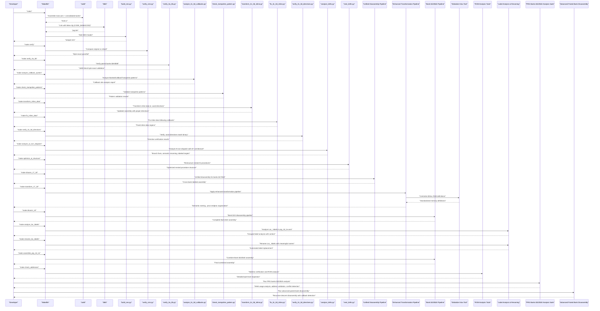

**Diagram sources**
- [Makefile:31-48](file://Makefile#L31-L48)
- [tools/build_nes.py:10-51](file://tools/build_nes.py#L10-L51)
- [tools/verify_rom.py:10-69](file://tools/verify_rom.py#L10-L69)
- [tools/verify_0a_0b.py:1-28](file://tools/verify_0a_0b.py#L1-L28)
- [tools/analyze_0c_0d_callbacks.py:1-257](file://tools/analyze_0c_0d_callbacks.py#L1-L257)
- [tools/check_trampoline_pattern.py:1-65](file://tools/check_trampoline_pattern.py#L1-L65)
- [tools/transform_0c_0d_inline.py:1-393](file://tools/transform_0c_0d_inline.py#L1-L393)
- [tools/fix_0c_0d_inline.py:1-226](file://tools/fix_0c_0d_inline.py#L1-L226)
- [tools/verify_0c_0d_directives.py:1-84](file://tools/verify_0c_0d_directives.py#L1-L84)
- [tools/analyze_b49c.py:1-281](file://tools/analyze_b49c.py#L1-L281)
- [tools/nest_b49c.py:1-149](file://tools/nest_b49c.py#L1-L149)

## Detailed Component Analysis

### Makefile Targets and Orchestration
- make (default): Builds the final ROM by assembling, linking, and packaging with the iNES header.
- make split: Splits an original ROM into PRG/CHR banks and generates a combined PRG for disassembly.
- make banks: Generates bank stub assembly files for all 32 PRG banks.
- make disasm: Disassembles a specified binary region into ca65 assembly format.
- make analyze: Analyzes ROM structure to identify code-heavy banks and vectors.
- make verify: Compares the rebuilt ROM with the original for byte-exact accuracy.
- make clean: Removes build artifacts.
- make distclean: Removes build artifacts plus ROM dump directories.
- **New**: make verify_0a_0b: Verifies paired banks $0A/$0B test build matches original ROM with byte-exact accuracy.
- **New**: make analyze_callback_system: Analyzes BankedCallbackTrampoline and CallbackDispatcher patterns in PRG banks $0C/$0D.
- **New**: make check_trampoline_patterns: Validates trampoline patterns and inline data structures.
- **New**: make transform_inline_data: Transforms inline .byte data to proper .word directives after callback calls.
- **New**: make fix_inline_data: Fixes inline data regions following BankedCallbackTrampoline and CallbackDispatcher calls.
- **New**: make verify_0c_0d_directives: Verifies .word directives in prg_0c_0d.asm match original binary.
- **New**: make analyze_ai_turn_dispatch: Analyzes and improves AI turn dispatch code with branch instruction fixing and semantic renaming using Ai* architecture.
- **New**: make optimize_ai_structure: Restructures nested AI procedures for optimized code organization with modular Ai* functions.
- **New**: make disasm_17_18: Unified disassembly for paired Bank $17/$18 region with cross-bank references.
- **New**: make gen_f667_ffff: Specialized disassembly for Bank $1F range $F667-$FFFF.
- **New**: make update_jsr_labels: Update JSR/JMP operands using functions.h address map.
- **New**: make transform_17_18: Apply semantic naming transformation to PRG bank $17/$18 assembly code.
- **New**: make add_procs: Add .proc/.endproc scoping to PRG bank $17/$18 assembly code.
- **New**: make analyze_17_18: Analyze PRG bank $17/$18 assembly code boundaries and function structure.
- **New**: make debug_regions: Debug region transitions in PRG bank $17/$18 assembly code.
- **New**: make proc_scope_17_18: Enhanced .proc/.endproc scoping with advanced boundary analysis for PRG bank $17/$18 assembly code.
- **New**: make localize_labels: Convert branch-only labels to @local format with proper scoping.
- **New**: make auto_add_local_params: Automatically add local parameter declarations to .proc blocks.
- **New**: make globalize_04xx: Centralize $04xx RAM definitions with standardized global memory definitions.
- **New**: make check_addresses: Verify ROM bytes at specific addresses for disassembly accuracy.
- **New**: make check_bank18: Validate bank $18 content and cross-check with bank $17.
- **New**: make check_rom_offset: Map CPU addresses to ROM file offsets for verification.
- **New**: make dump_chr_table: Inspect CHR table data in combined ROM.
- **New**: make dump_correct_bytes: Verify correct bytes in ROM for disassembly validation.
- **New**: make search_0530: Search for $0530 store patterns in ROM.
- **New**: make search_chr_loader: Find CHR loader patterns in ROM.
- **New**: make search_chr_loader2: Locate specific CHR loader with $0530/$0531 stores.
- **New**: make verify_disasm: Comprehensive disassembly verification against ROM bytes.
- **New**: make disasm_1d: Complete 6502 disassembler for Bank $1D ($A000-$BFFF).
- **New**: make disasm_1d_enhanced: Enhanced disassembly with section markers and meaningful names.
- **New**: make disasm_1d_final: Final assembly generator for Bank $1D.
- **New**: make disasm_1e: Two-pass disassembler for Bank $1E ($C000-$DFFF).
- **New**: make disasm_1e_definitive: Definitive data region handling for Bank $1E.
- **New**: make disasm_1e_final: Simple linear-sweep disassembler for Bank $1E.
- **New**: make assemble_prg_1d_1e: Combine Bank $1D/$1E assembly into final 16KB mapping.
- **New**: make analyze_loc_labels: Analyze Loc_ labels grouped by procedure with context display.
- **New**: make rename_loc_labels: Automate replacement of Loc_ labels with meaningful names.
- **New**: make enhance_prg_1d: Enhanced Bank $1D processing with .proc/.endproc organization.
- **New**: make analyze_ram_1d1e: Analyze RAM usage patterns in PRG banks $1D/$1E assembly code.
- **New**: make check_addrs: Validate specific RAM addresses usage in PRG banks $1D/$1E.
- **New**: make check_conflicts: Detect symbol conflicts between global and local scopes in PRG banks $1D/$1E.
- **New**: make dump_data_range: Extract ROM data ranges for PRG banks $1D/$1E analysis.
- **New**: make mark_data_block: Insert automated data blocks into PRG banks $1D/$1E assembly.
- **New**: make verify_globals: Validate global variable definitions in PRG banks $1D/$1E assembly.
- **New**: make disasm_0a_0b: Advanced recursive descent disassembly for paired banks $0A/$0B with callback dispatcher detection.
- **New**: make disasm_prg: General-purpose combined PRG disassembler with multi-pass code analysis.

Usage patterns:
- Start with make split to prepare ROM assets.
- Use make banks to bootstrap disassembly.
- Disassemble and annotate code with make disasm and tools/annotate_asm.py.
- **New**: Use make verify_0a_0b to validate paired banks $0A/$0B with byte-exact accuracy.
- **New**: Use make analyze_callback_system to analyze BankedCallbackTrampoline and CallbackDispatcher patterns.
- **New**: Use make check_trampoline_patterns to validate trampoline patterns and inline data structures.
- **New**: Use make transform_inline_data to convert inline .byte data to proper .word directives.
- **New**: Use make fix_inline_data to fix inline data regions following callback calls.
- **New**: Use make verify_0c_0d_directives to verify .word directives match original binary.
- **New**: Use make analyze_ai_turn_dispatch to analyze and improve AI turn dispatch code with automated branch instruction fixing, semantic renaming using Ai* convention, and labeled target improvements with better nested procedure support.
- **New**: Use make optimize_ai_structure to restructure nested AI procedures for optimized code organization with modular Ai* functions.
- **New**: Apply unified disassembly pipeline with make disasm_17_18 for paired bank processing.
- **New**: Use make gen_f667_ffff for specialized Bank $1F range disassembly.
- **New**: Use make update_jsr_labels to map addresses to symbols in Bank $1F assembly.
- **New**: Use transformation pipeline for PRG bank $17/$18 assembly code organization.
- **New**: Use make proc_scope_17_18 for enhanced .proc/.endproc organization with advanced boundary analysis.
- **New**: Use make localize_labels for converting branch-only labels to @local format.
- **New**: Use make auto_add_local_params for automated parameter declaration generation.
- **New**: Use make globalize_04xx for centralized RAM definition standardization.
- **New**: Utilize ROM analysis tools for detailed verification and debugging workflows.
- **New**: Apply specialized disassembly pipeline for Bank $1D/$1E with multiple disassembler variants.
- **New**: Use make assemble_prg_1d_1e to combine Bank $1D/$1E assembly into final mapping.
- **New**: Use make analyze_loc_labels to analyze Loc_ label usage patterns and context.
- **New**: Use make rename_loc_labels to automate meaningful label replacement.
- **New**: Utilize PRG banks $1D/$1E analysis suite for comprehensive RAM usage analysis, address validation, and symbol conflict detection.
- **New**: Apply advanced paired bank disassembly tools for complex bank pairs with recursive descent algorithms.
- Iterate assembly and linking, then verify with make verify or make verify_0a_0b for paired banks.

**Section sources**
- [Makefile:31-101](file://Makefile#L31-L101)
- [PROJECT.md:58-69](file://PROJECT.md#L58-L69)

### Bank Stub Generation and Consolidated Bank Management

#### Overview
The bank stub generation system has been updated to support consolidated bank modules that reduce compilation overhead while maintaining full compatibility with individual bank files. The system now supports both traditional individual bank files and unified consolidated modules like prg_0c_0d.asm, following the established pattern of prg_0a_0b.asm, prg_17_18.asm, and prg_1d_1e.asm.

#### Consolidated Bank Architecture
Consolidated bank modules combine two adjacent 8KB banks into a single 16KB assembly file, providing several benefits:
- **Reduced Compilation Overhead**: Fewer separate compilation units reduce overall build time
- **Improved Cross-Bank Optimization**: Better compiler optimization across bank boundaries
- **Simplified Linking**: Reduced number of segments to manage during linking
- **Maintained Compatibility**: Individual bank files remain available for backward compatibility

#### prg_0c_0d.asm Implementation
The prg_0c_0d.asm module demonstrates the consolidated bank pattern:
- **Combined Address Space**: Covers $A000-$DFFF (16KB) with Bank $0C at $A000-$BFFF and Bank $0D at $C000-$DFFF
- **Unified Segments**: Uses separate CODE_BANK0C and CODE_BANK0D segments within the same file
- **Cross-Bank References**: Automatic handling of references between the two banks
- **Include Integration**: Seamlessly integrated into all_banks.asm alongside individual bank files

#### Linker Configuration Updates
The linker.cfg has been updated to support consolidated bank segments:
- **CODE_BANK0C**: Maps to PRG_SLOT1 ($A000-$BFFF)
- **CODE_BANK0D**: Maps to PRG_SLOT2 ($C000-$DFFF)
- **Optional Segments**: Both segments are marked as optional for flexible linking

#### Standalone Verification Configuration
A new test configuration file test_0c_0d.cfg provides standalone verification support for the consolidated prg_0c_0d.asm module:
- **Memory Layout**: Defines ZEROPAGE, RAM, and PRG_SLOT1 memory regions
- **Segment Mapping**: Maps CODE_BANK0C segment to PRG_SLOT1 for testing
- **Standalone Testing**: Enables independent verification of the consolidated bank module

**Updated** The bank stub generation process now supports consolidated bank modules like prg_0c_0d.asm, reducing compilation overhead through unified bank management while maintaining full compatibility with existing individual bank files.

**Section sources**
- [asm/banks/prg_0c_0d.asm:1-7600](file://asm/banks/prg_0c_0d.asm#L1-L7600)
- [asm/banks/all_banks.asm:15-16](file://asm/banks/all_banks.asm#L15-L16)
- [linker.cfg:55-56](file://linker.cfg#L55-L56)
- [tools/generate_bank_stubs.py:12-52](file://tools/generate_bank_stubs.py#L12-L52)
- [test_0c_0d.cfg:1-13](file://test_0c_0d.cfg#L1-L13)

### AI Code Modernization Tools

#### Overview
The AI code modernization tools provide automated analysis and structural optimization capabilities specifically designed for the AI turn dispatch system in prg_0a_0b.asm. These tools focus on the new modular Ai* architecture instead of the old Proc_B49C structure, offering intelligent branch instruction fixing, semantic renaming with Ai* prefix convention, improved control flow with labeled targets replacing raw address jumps, and code structure optimization with enhanced nested procedure support.

#### analyze_b49c.py - AI Turn Dispatch Analysis Tool with Modular Ai* Architecture
- **Purpose**: Analyzes and improves the AI turn dispatch system with automated enhancements supporting the new modular Ai* architecture
- **Modular Architecture Support**: Works with new AiTurnDispatch, AiSearchPhase1, AiSearchPhase2, AiActionSelect functions instead of old Proc_B49C structure
- **Branch Instruction Fixing**: Converts .byte branch instructions to proper mnemonics with target labels using improved control flow
- **Semantic Renaming**: Renames labels to meaningful descriptive names following Ai* prefix convention for better semantic understanding
- **Improved Control Flow**: Replaces raw address jumps with labeled targets for better code readability and maintainability
- **Inline Comment Generation**: Adds detailed comments for non-trivial logic sections with enhanced semantic understanding
- **Missing Label Detection**: Automatically generates labels for branch targets that lack proper labels
- **Raw Address Resolution**: Converts JMP/JSR references from raw addresses to symbolic labels with improved targeting
- **Comprehensive Coverage**: Processes the entire AI turn dispatch range ($B49C-$BF44) with modular function awareness
- **Enhanced Nested Procedure Support**: Better handling of nested procedures within the modular Ai* architecture

#### nest_b49c.py - Nested Procedure Restructuring Tool for Modular Architecture
- **Purpose**: Restructures the AI turn dispatch system by optimizing the new modular Ai* function architecture
- **Procedure Merging**: Removes premature .endproc directives and merges nested procs into unified scope with modular function support
- **Variable Consolidation**: Replaces individual variable definitions with unified set at top of procedure for better organization
- **Equate Removal**: Eliminates redundant equate label definitions since code labels provide them
- **Global Declaration Cleanup**: Removes .global declarations for nested procedures with modular function awareness
- **Code Optimization**: Reduces code complexity while maintaining functionality with improved control flow patterns
- **Enhanced Nested Procedure Handling**: Improved support for nested procedures within the modular Ai* architecture

#### AI Turn Dispatch System Architecture with Modular Ai* Functions
The AI turn dispatch system now uses a modular architecture with clear function separation and improved nested procedure support:
- **Main Entry Point**: AiTurnDispatch ($B49C) - AI turn entry point with jump table using modular design
- **Search Phases**: AiSearchPhase1 ($B4BF) and AiSearchPhase2 ($B504) for province scanning with improved control flow
- **Action Selection**: AiActionSelect ($B5FC) for determining AI actions with labeled targets
- **Support Functions**: Various helper functions for province management, resource calculation, and state updates with modular organization
- **Enhanced Nested Procedures**: Better support for nested procedures within the modular architecture

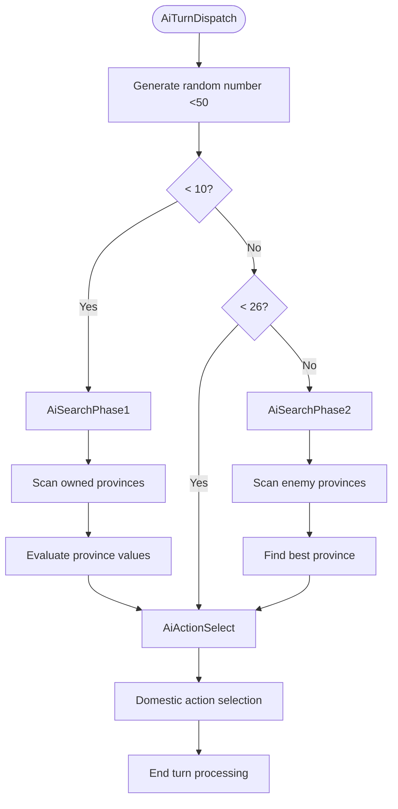

**Diagram sources**
- [tools/analyze_b49c.py:19-39](file://tools/analyze_b49c.py#L19-L39)
- [asm/banks/prg_0a_0b.asm:3471-3649](file://asm/banks/prg_0a_0b.asm#L3471-L3649)

#### Integration with Build System
The AI code modernization tools integrate seamlessly with the development workflow:
- **Direct Tool Execution**: python3 tools/analyze_b49c.py and python3 tools/nest_b49c.py
- **Sequential Processing**: analyze_b49c.py should run before nest_b49c.py for optimal results
- **Backup Support**: Tools operate on prg_0a_0b.asm with comprehensive logging
- **Validation Output**: Provides detailed statistics about changes made and improvements achieved
- **Modular Architecture Support**: Enhanced support for Ai* prefix naming convention and improved control flow patterns with better nested procedure handling

**Section sources**
- [tools/analyze_b49c.py:1-281](file://tools/analyze_b49c.py#L1-L281)
- [tools/nest_b49c.py:1-149](file://tools/nest_b49c.py#L1-L149)
- [asm/banks/prg_0a_0b.asm:3471-3649](file://asm/banks/prg_0a_0b.asm#L3471-L3649)

### ROM Generation Pipeline (Assembly to Final NES ROM)
The pipeline converts assembly into a playable ROM with:
- Assembling: ca65 compiles main.asm into an object file.
- Linking: ld65 links with linker.cfg to produce a PRG binary.
- Packaging: build_nes.py adds an iNES header and pads PRG to 16KB pages, creates empty CHR, and prints ROM metadata.

**Diagram sources**
- [Makefile:38-48](file://Makefile#L38-L48)
- [tools/build_nes.py:10-51](file://tools/build_nes.py#L10-L51)
- [linker.cfg:18-54](file://linker.cfg#L18-L54)

**Section sources**
- [Makefile:38-48](file://Makefile#L38-L48)
- [tools/build_nes.py:10-51](file://tools/build_nes.py#L10-L51)
- [linker.cfg:18-54](file://linker.cfg#L18-L54)

### ROM Splitting and Bank Generation
- split_rom.py parses the iNES header, splits PRG/CHR into 8KB banks, and writes rom_info.h with mapper and bank counts.
- generate_bank_stubs.py creates 32 bank stubs and an all_banks.asm include file to simplify assembly inclusion.

**Diagram sources**
- [tools/split_rom.py:38-122](file://tools/split_rom.py#L38-L122)
- [tools/generate_bank_stubs.py:12-46](file://tools/generate_bank_stubs.py#L12-L46)

**Section sources**
- [tools/split_rom.py:38-122](file://tools/split_rom.py#L38-L122)
- [tools/generate_bank_stubs.py:12-46](file://tools/generate_bank_stubs.py#L12-L46)

### Disassembly and Annotation Tools
- disasm_6502.py disassembles 6502 binaries into ca65 assembly with address and byte columns, supporting various addressing modes.
- disasm_bank_1f.py provides comprehensive disassembly for Bank 0x1F with structured function definitions, named regions, and inline binary comments.
- **New**: disasm_17_18.py provides unified recursive descent disassembly for paired Bank $17/$18 region with cross-bank reference handling.
- **New**: gen_f667_ffff.py generates specialized disassembly for Bank $1F range $F667-$FFFF with detailed interrupt handler analysis.
- **New**: update_jsr_labels.py maps JSR/JMP operands to symbolic names using functions.h address map.
- **New**: verify_f3bd_f667.py verifies Bank $1F range $F3BD-$F667 assembly against binary with detailed error reporting.
- **New**: disasm_1d.py provides complete 6502 disassembler for Bank $1D ($A000-$BFFF) with full instruction coverage.
- **New**: disasm_1d_enhanced.py enhances Bank $1D disassembly with section markers, meaningful subroutine names, and complete byte coverage.
- **New**: disasm_1d_final.py generates final ca65-compatible assembly with proper code/data identification for Bank $1D.
- **New**: disasm_1e.py provides two-pass disassembler for Bank $1E ($C000-$DFFF) with procedure detection and data region identification.
- **New**: disasm_1e_definitive.py handles definitive data region detection between code routines for Bank $1E.
- **New**: disasm_1e_final.py provides simple linear-sweep disassembler for Bank $1E with .byte data handling.
- **New**: assemble_prg_1d_1e.py combines Bank $1D/$1E assembly into final 16KB mapping ($A000-$DFFF).
- **New**: disasm_0a_0b.py provides advanced recursive descent disassembly for paired banks $0A/$0B with callback dispatcher detection and inline table analysis.
- **New**: disasm_prg.py provides general-purpose combined PRG disassembler with multi-pass code analysis and callback table detection.
- **New**: verify_0a_0b.py provides specialized verification for paired banks $0A/$0B with byte-exact accuracy validation against original ROM.
- **New**: analyze_b49c.py provides AI turn dispatch analysis with branch instruction fixing, semantic renaming using Ai* convention, and improved control flow with labeled targets and enhanced nested procedure support.
- **New**: nest_b49c.py provides nested procedure restructuring for AI code optimization with modular architecture support and better nested procedure handling.
- annotate_asm.py annotates existing assembly with ROM addresses and actual opcode bytes, using a symbol table and instruction size heuristics. It can optionally verify assembly with ca65.

Enhanced with improved output format supporting inline binary comments and detailed address mapping for precise ROM analysis.

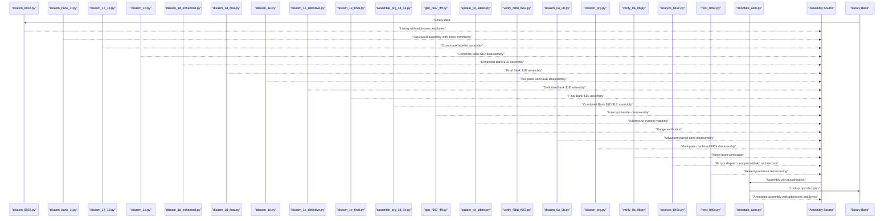

**Diagram sources**
- [tools/disasm_6502.py:286-362](file://tools/disasm_6502.py#L286-L362)
- [tools/disasm_bank_1f.py:329-442](file://tools/disasm_bank_1f.py#L329-L442)
- [tools/disasm_17_18.py:1-710](file://tools/disasm_17_18.py#L1-L710)
- [tools/disasm_1d.py:1-214](file://tools/disasm_1d.py#L1-L214)
- [tools/disasm_1d_enhanced.py:1-443](file://tools/disasm_1d_enhanced.py#L1-L443)
- [tools/disasm_1d_final.py:1-210](file://tools/disasm_1d_final.py#L1-L210)
- [tools/disasm_1e.py:1-512](file://tools/disasm_1e.py#L1-L512)
- [tools/disasm_1e_definitive.py:1-522](file://tools/disasm_1e_definitive.py#L1-L522)
- [tools/disasm_1e_final.py:1-494](file://tools/disasm_1e_final.py#L1-L494)
- [tools/assemble_prg_1d_1e.py:1-41](file://tools/assemble_prg_1d_1e.py#L1-L41)
- [tools/gen_f667_ffff.py:1-396](file://tools/gen_f667_ffff.py#L1-L396)
- [tools/update_jsr_labels.py:1-137](file://tools/update_jsr_labels.py#L1-L137)
- [tools/verify_f3bd_f667.py:1-45](file://tools/verify_f3bd_f667.py#L1-L45)
- [tools/disasm_0a_0b.py:1-1258](file://tools/disasm_0a_0b.py#L1-L1258)
- [tools/disasm_prg.py:1-523](file://tools/disasm_prg.py#L1-L523)
- [tools/verify_0a_0b.py:1-28](file://tools/verify_0a_0b.py#L1-L28)
- [tools/analyze_b49c.py:1-281](file://tools/analyze_b49c.py#L1-L281)
- [tools/nest_b49c.py:1-149](file://tools/nest_b49c.py#L1-L149)
- [tools/annotate_asm.py:315-478](file://tools/annotate_asm.py#L315-L478)

**Section sources**
- [tools/disasm_6502.py:286-362](file://tools/disasm_6502.py#L286-L362)
- [tools/disasm_bank_1f.py:329-442](file://tools/disasm_bank_1f.py#L329-L442)
- [tools/disasm_17_18.py:1-710](file://tools/disasm_17_18.py#L1-L710)
- [tools/disasm_1d.py:1-214](file://tools/disasm_1d.py#L1-L214)
- [tools/disasm_1d_enhanced.py:1-443](file://tools/disasm_1d_enhanced.py#L1-L443)
- [tools/disasm_1d_final.py:1-210](file://tools/disasm_1d_final.py#L1-L210)
- [tools/disasm_1e.py:1-512](file://tools/disasm_1e.py#L1-L512)
- [tools/disasm_1e_definitive.py:1-522](file://tools/disasm_1e_definitive.py#L1-L522)
- [tools/disasm_1e_final.py:1-494](file://tools/disasm_1e_final.py#L1-L494)
- [tools/assemble_prg_1d_1e.py:1-41](file://tools/assemble_prg_1d_1e.py#L1-L41)
- [tools/gen_f667_ffff.py:1-396](file://tools/gen_f667_ffff.py#L1-L396)
- [tools/update_jsr_labels.py:1-137](file://tools/update_jsr_labels.py#L1-L137)
- [tools/verify_f3bd_f667.py:1-45](file://tools/verify_f3bd_f667.py#L1-L45)
- [tools/disasm_0a_0b.py:1-1258](file://tools/disasm_0a_0b.py#L1-L1258)
- [tools/disasm_prg.py:1-523](file://tools/disasm_prg.py#L1-L523)
- [tools/verify_0a_0b.py:1-28](file://tools/verify_0a_0b.py#L1-L28)
- [tools/analyze_b49c.py:1-281](file://tools/analyze_b49c.py#L1-L281)
- [tools/nest_b49c.py:1-149](file://tools/nest_b49c.py#L1-L149)
- [tools/annotate_asm.py:315-478](file://tools/annotate_asm.py#L315-L478)

### ROM Verification System
- verify_rom.py performs a byte-by-byte comparison of two ROM files, reporting total mismatches, first mismatch address, and accuracy percentage. It exits with success when identical.
- **New**: verify_f3bd_f667.py verifies Bank $1F range $F3BD-$F667 assembly against binary with detailed error reporting.
- **New**: verify_range.py verifies disassembly bytes in prg_1f.aligned.asm against the binary for range $E843-$F2AE.
- **New**: verify_disasm.py provides comprehensive disassembly verification by checking multiple known addresses for byte-level accuracy.
- **New**: verify_0a_0b.py provides specialized verification for paired banks $0A/$0B with byte-exact accuracy validation, comparing the combined 16KB block ($A000-$DFFF) against the original ROM.

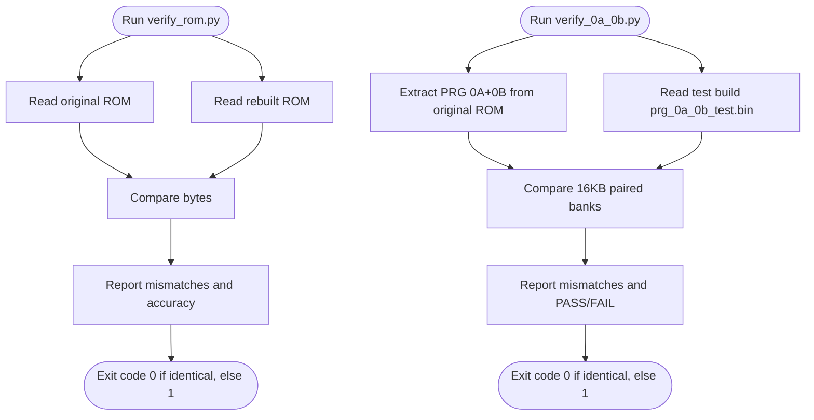

**Diagram sources**
- [tools/verify_rom.py:10-69](file://tools/verify_rom.py#L10-L69)
- [tools/verify_0a_0b.py:1-28](file://tools/verify_0a_0b.py#L1-L28)

**Section sources**
- [tools/verify_rom.py:10-69](file://tools/verify_rom.py#L10-L69)
- [tools/verify_0a_0b.py:1-28](file://tools/verify_0a_0b.py#L1-L28)

### Linker Configuration and Bank Segments
- linker.cfg defines 4 PRG slots ($8000-$FFFF) and segments for code/data. As banks are disassembled, new segments are added to map code into the correct bank slots.
- **New**: test_17_18.cfg provides a temporary configuration for standalone verification of paired Bank $17/$18 assembly code.
- **New**: build/test_17_18.cfg provides a test linker configuration specifically for Bank $17/$18 disassembly pipeline.
- **New**: tools/link_0a_0b_test.cfg provides a test linker configuration for paired banks $0A/$0B disassembly.
- **New**: test_0c_0d.cfg provides standalone verification configuration for consolidated prg_0c_0d.asm module.
- **Updated**: Consolidated bank support with CODE_BANK0C and CODE_BANK0D segments for prg_0c_0d.asm module.

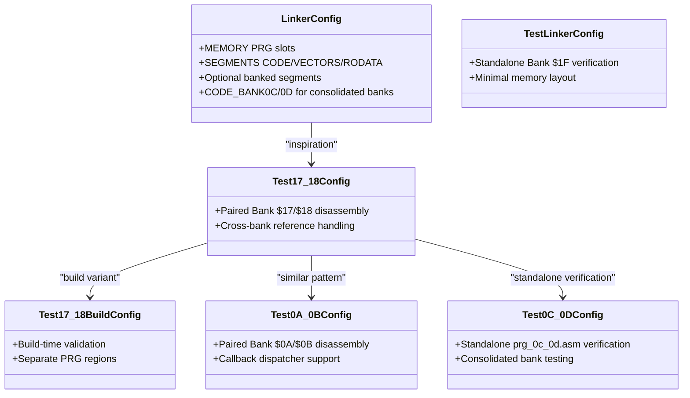

**Diagram sources**
- [linker.cfg:18-66](file://linker.cfg#L18-L66)
- [test_linker.cfg:1-13](file://test_linker.cfg#L1-L13)
- [test_17_18.cfg:1-9](file://test_17_18.cfg#L1-L9)
- [build/test_17_18.cfg:1-11](file://build/test_17_18.cfg#L1-L11)
- [tools/link_0a_0b_test.cfg:1-10](file://tools/link_0a_0b_test.cfg#L1-L10)
- [test_0c_0d.cfg:1-13](file://test_0c_0d.cfg#L1-L13)

**Section sources**
- [linker.cfg:18-66](file://linker.cfg#L18-L66)
- [test_linker.cfg:1-13](file://test_linker.cfg#L1-L13)
- [test_17_18.cfg:1-9](file://test_17_18.cfg#L1-L9)
- [build/test_17_18.cfg:1-11](file://build/test_17_18.cfg#L1-L11)
- [tools/link_0a_0b_test.cfg:1-10](file://tools/link_0a_0b_test.cfg#L1-L10)
- [test_0c_0d.cfg:1-13](file://test_0c_0d.cfg#L1-L13)

### Assembly Entry Points and Mapper Integration
- asm/main.asm sets up reset/NMI/IRQ handlers, initializes PPU/APU, and switches PRG banks via macros from include/namco163.h.
- include/namco163.h defines mapper registers and bank switching macros used by the assembly.
- include/macros.h provides convenience macros for PPU operations and DMA.
- **New**: include/functions.h provides address-to-symbol mapping for Bank $1F code with $E000-$FFFF addresses.

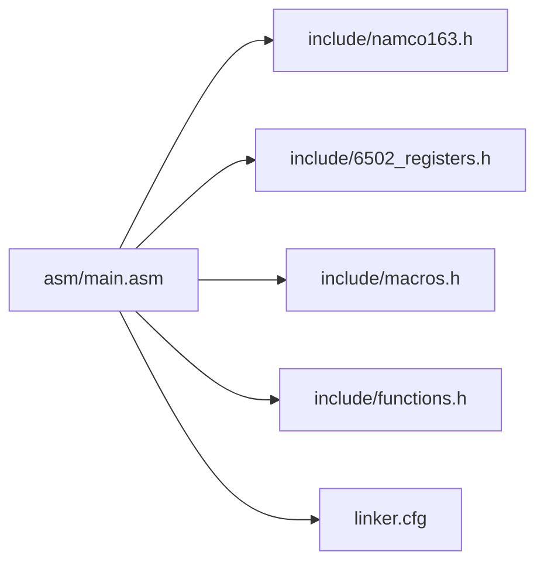

**Diagram sources**
- [asm/main.asm:1-141](file://asm/main.asm#L1-L141)
- [include/namco163.h:1-87](file://include/namco163.h#L1-L87)
- [include/macros.h:1-72](file://include/macros.h#L1-L72)
- [include/functions.h:1-87](file://include/functions.h#L1-L87)
- [linker.cfg:18-54](file://linker.cfg#L18-L54)

**Section sources**
- [asm/main.asm:25-141](file://asm/main.asm#L25-L141)
- [include/namco163.h:10-87](file://include/namco163.h#L10-L87)
- [include/macros.h:8-72](file://include/macros.h#L8-L72)
- [include/functions.h:1-87](file://include/functions.h#L1-L87)

## Unified Disassembly Pipeline

### Overview
The unified disassembly pipeline provides a comprehensive automated workflow for processing different ROM regions with specialized tools. The pipeline consists of six specialized tools that work together to provide cross-bank reference handling, address-to-symbol mapping, and region-specific disassembly capabilities.

### Pipeline Architecture
The unified disassembly pipeline operates on different ROM regions with specialized tools:

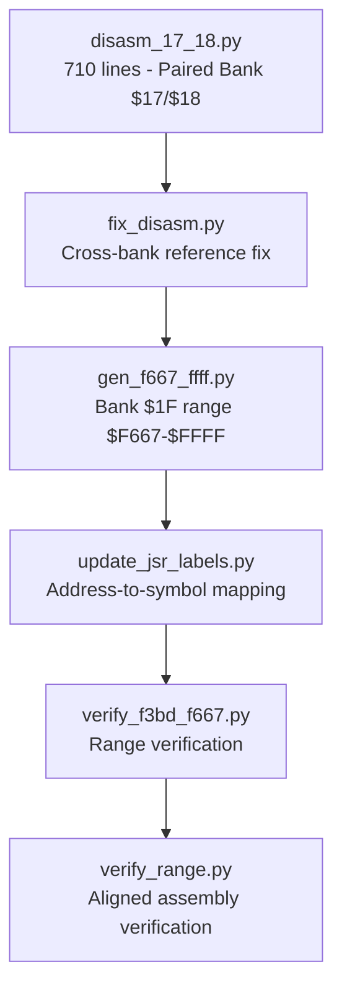

**Diagram sources**
- [tools/disasm_17_18.py:1-710](file://tools/disasm_17_18.py#L1-L710)
- [tools/fix_disasm.py:1-56](file://tools/fix_disasm.py#L1-L56)
- [tools/gen_f667_ffff.py:1-396](file://tools/gen_f667_ffff.py#L1-L396)
- [tools/update_jsr_labels.py:1-137](file://tools/update_jsr_labels.py#L1-L137)
- [tools/verify_f3bd_f667.py:1-45](file://tools/verify_f3bd_f667.py#L1-L45)
- [tools/verify_range.py:1-42](file://tools/verify_range.py#L1-L42)

### Stage-by-Stage Breakdown

#### Stage 1: Paired Bank Disassembly (disasm_17_18.py)
- **Recursive Descent Analysis**: Uses sophisticated recursive descent algorithm to distinguish code from data across paired Bank $17/$18 region ($A000-$DFFF).
- **Cross-Bank Reference Handling**: Automatically detects and handles cross-bank references between $A000-$BFFF and $C000-$DFFF.
- **Inline Table Detection**: Identifies callback dispatcher tables and banked callback trampolines with automatic table size calculation.
- **Known Function Integration**: Incorporates known function addresses from Bank $1F for better disassembly accuracy.
- **Output Generation**: Produces labeled assembly with proper cross-bank equates and inline byte comments.

#### Stage 2: Cross-Bank Reference Fix (fix_disasm.py)
- **Automated Enhancement**: Enhances existing disasm_17_18.py with cross-bank reference computation and equate generation.
- **Integration Point**: Inserts cross-reference collection after label building and before output generation.
- **Equation Generation**: Creates proper equate statements for cross-bank references in both directions.

#### Stage 3: Bank $1F Range Disassembly (gen_f667_ffff.py)
- **Specialized Range Processing**: Focuses on Bank $1F range $F667-$FFFF with detailed interrupt handler analysis.
- **Interrupt Handler Coverage**: Provides comprehensive disassembly of NMI/IRQ handlers, scroll routines, and interrupt vectors.
- **Structural Organization**: Groups code into logical sections with proper procedure boundaries and data tables.
- **Padding Detection**: Identifies and formats unused ROM regions with appropriate comments.

#### Stage 4: Address-to-Symbol Mapping (update_jsr_labels.py)
- **Symbol Resolution**: Maps JSR/JMP operands to symbolic names using functions.h address map for $E000-$FFFF.
- **Inline Comment Parsing**: Decodes target addresses from inline byte comments in assembly files.
- **Idempotent Processing**: Safe to run multiple times without changing output.
- **Scoped Reference Handling**: Excludes local (@) and scoped (::) references from automatic mapping.

#### Stage 5: Range Verification (verify_f3bd_f667.py)
- **Targeted Verification**: Verifies Bank $1F range $F3BD-$F667 assembly against original binary.
- **Pattern Matching**: Uses strict regex pattern matching for inline byte comments with 2-digit hex validation.
- **Error Reporting**: Provides detailed error reports with expected vs actual byte comparisons.
- **Count Validation**: Ensures both byte content and count match the expected 683 bytes.

#### Stage 6: Aligned Assembly Verification (verify_range.py)
- **Range-Specific Validation**: Verifies disassembly bytes in prg_1f.aligned.asm against binary for range $E843-$F2AE.
- **Pattern Validation**: Ensures all tokens are exactly 2 hex characters for reliable parsing.
- **Comprehensive Coverage**: Validates the aligned Bank $1F assembly file for the specified address range.

**Section sources**
- [tools/disasm_17_18.py:1-710](file://tools/disasm_17_18.py#L1-L710)
- [tools/fix_disasm.py:1-56](file://tools/fix_disasm.py#L1-L56)
- [tools/gen_f667_ffff.py:1-396](file://tools/gen_f667_ffff.py#L1-L396)
- [tools/update_jsr_labels.py:1-137](file://tools/update_jsr_labels.py#L1-L137)
- [tools/verify_f3bd_f667.py:1-45](file://tools/verify_f3bd_f667.py#L1-L45)
- [tools/verify_range.py:1-42](file://tools/verify_range.py#L1-L42)

### Integration with Build System
The unified disassembly pipeline integrates seamlessly with the Makefile build system:
- **New**: make disasm_17_18 target triggers the complete paired bank disassembly workflow.
- **New**: make gen_f667_ffff target generates specialized Bank $1F range disassembly.
- **New**: make update_jsr_labels target updates JSR/JMP operands using address mapping.
- **New**: make verify_f3bd_f667 target validates Bank $1F range assembly.
- Each stage produces detailed logging and validation feedback.
- Intermediate results are saved to maintain progress and enable debugging.
- Final output provides comprehensive cross-bank labeled assembly ready for compilation.

**Section sources**
- [Makefile:31-101](file://Makefile#L31-L101)

## Enhanced Disassembly Tools

### Advanced Disassembly Capabilities
The project now features significantly enhanced disassembly tools with improved output formats that provide detailed address mapping and inline binary comments:

#### disasm_6502.py - Enhanced Basic Disassembler
- Produces formatted output with address, byte columns, and instruction mnemonics
- Supports various addressing modes with proper operand formatting
- Provides truncated instruction handling for boundary conditions
- Includes base address mapping for accurate CPU address translation

#### disasm_bank_1f.py - Comprehensive Bank 0x1F Disassembler
- **Structured Function Analysis**: Organizes Bank 0x1F into named functions and data regions
- **Inline Binary Comments**: Each instruction includes detailed address and raw byte information
- **Named Region Definitions**: Groups code into logical sections (Reset, State Handlers, Sound Engine, etc.)
- **Complete Interrupt Vector Support**: Properly handles NMI/RESET/IRQ vectors with inline comments
- **Data Table Formatting**: Formats data regions with inline address and byte comments
- **Padding Detection**: Identifies and formats unused ROM regions

#### disasm_17_18.py - Unified Paired Bank Disassembler
- **Recursive Descent Analysis**: Sophisticated algorithm to distinguish code from data across paired banks
- **Cross-Bank Reference Handling**: Automatic detection and labeling of cross-bank references
- **Inline Table Detection**: Identifies callback dispatcher tables and banked callback patterns
- **Known Function Integration**: Incorporates Bank $1F function addresses for better accuracy
- **Cross-Bank Equates**: Generates proper equate statements for inter-bank references
- **Output Generation**: Produces labeled assembly with inline byte comments

#### disasm_1d.py - Complete Bank $1D Disassembler
- **Full 6502 Instruction Coverage**: Complete disassembly of all 151 legal 6502 opcodes
- **Accurate Operand Formatting**: Proper handling of all addressing modes and operand types
- **Complete Byte Coverage**: 8192 bytes fully covered with proper instruction boundaries
- **Base Address Mapping**: Accurate CPU address translation for all disassembled instructions

#### disasm_1d_enhanced.py - Enhanced Bank $1D Disassembler
- **Section Markers**: Adds meaningful section headers for different entry regions
- **Jump Table Processing**: Proper handling of 24-entry jump table at $A000-$A047
- **Data Region Identification**: Accurate identification and formatting of data tables
- **Meaningful Names**: Assigns descriptive names to subroutines and data regions
- **Complete Coverage**: Full 8KB coverage with proper code/data boundaries

#### disasm_1d_final.py - Final Bank $1D Generator
- **Final Assembly Output**: Generates ca65-compatible assembly with proper code/data identification
- **Data Region Handling**: Uses .byte directives for identified data tables
- **Label Generation**: Creates proper labels for all branch/jump targets
- **Bank $1F Integration**: Maps Bank $1F function calls to symbolic names

#### disasm_1e.py - Two-Pass Bank $1E Disassembler
- **Procedure Detection**: Identifies subroutines through analysis of JSR targets and RTS instructions
- **Data Region Identification**: Detects lookup tables and data blocks between code routines
- **Bank $1F Integration**: Maps Bank $1F function calls to symbolic names
- **Complete Coverage**: Full 8KB coverage with proper code/data boundaries

#### disasm_1e_definitive.py - Definitive Bank $1E Disassembler
- **Definitive Data Handling**: Accurately handles tile data blocks between code routines
- **Complex Data Analysis**: Identifies data regions through analysis of instruction patterns
- **Tile Data Processing**: Properly formats tile map and lookup data tables
- **Complete Byte Coverage**: Full 8KB coverage with accurate data/code separation

#### disasm_1e_final.py - Simple Bank $1E Disassembler
- **Linear-Sweep Approach**: Simple and straightforward disassembly of all valid instructions
- **Data Table Detection**: Uses .byte directives for known data tables and padding
- **Bank $1F Integration**: Maps Bank $1F function calls to symbolic names
- **Complete Coverage**: Full 8KB coverage with minimal complexity

#### assemble_prg_1d_1e.py - Combined Assembly Builder
- **Bank $1D Integration**: Incorporates complete Bank $1D disassembly with proper headers
- **Bank $1E Placeholder**: Adds Bank $1E section with .incbin placeholder for pending disassembly
- **Segment Management**: Proper .segment directives for both Bank $1D and Bank $1E
- **File Generation**: Creates final combined assembly file for 16KB mapping ($A000-$DFFF)

#### gen_f667_ffff.py - Specialized Bank $1F Range Disassembler
- **Interrupt Handler Focus**: Comprehensive disassembly of NMI/IRQ handlers and scroll routines
- **Structural Organization**: Logical grouping of interrupt handlers, state machines, and data tables
- **Padding Detection**: Identifies and formats unused ROM regions with appropriate comments
- **Vector Table Analysis**: Proper handling of interrupt vectors and dispatch tables

#### update_jsr_labels.py - Address-to-Symbol Mapping Tool
- **Symbol Resolution**: Maps JSR/JMP operands to symbolic names using functions.h address map
- **Inline Comment Parsing**: Decodes target addresses from assembly inline comments
- **Scoped Reference Handling**: Excludes local (@) and scoped (::) references from mapping
- **Idempotent Processing**: Safe to run multiple times without changing output

#### verify_f3bd_f667.py - Range Verification Tool
- **Targeted Verification**: Validates Bank $1F range $F3BD-$F667 assembly against original binary
- **Pattern Matching**: Strict regex validation for inline byte comments with 2-digit hex
- **Error Reporting**: Detailed comparison of expected vs actual byte content
- **Count Validation**: Ensures both byte content and count match expected values

**Enhanced Output Format Features**:
- Address mapping: `${addr:04X}:` provides precise ROM address information
- Inline binary comments: Raw byte sequences appended as `; ${addr:04X}: ${raw_str}`
- Structured organization: Logical grouping of functions, tables, and data sections
- Complete coverage: Handles all 8KB of Bank 0x1F with detailed analysis
- Cross-bank references: Proper handling of inter-bank code and data references
- Bank $1D/$1E combination: 16KB mapping from $A000-$DFFF with proper segment management

**Diagram sources**
- [tools/disasm_17_18.py:1-710](file://tools/disasm_17_18.py#L1-L710)
- [tools/gen_f667_ffff.py:1-396](file://tools/gen_f667_ffff.py#L1-L396)
- [tools/update_jsr_labels.py:1-137](file://tools/update_jsr_labels.py#L1-L137)

**Section sources**
- [tools/disasm_6502.py:286-362](file://tools/disasm_6502.py#L286-L362)
- [tools/disasm_bank_1f.py:329-442](file://tools/disasm_bank_1f.py#L329-L442)
- [tools/disasm_17_18.py:1-710](file://tools/disasm_17_18.py#L1-L710)
- [tools/disasm_1d.py:1-214](file://tools/disasm_1d.py#L1-L214)
- [tools/disasm_1d_enhanced.py:1-443](file://tools/disasm_1d_enhanced.py#L1-L443)
- [tools/disasm_1d_final.py:1-210](file://tools/disasm_1d_final.py#L1-L210)
- [tools/disasm_1e.py:1-512](file://tools/disasm_1e.py#L1-L512)
- [tools/disasm_1e_definitive.py:1-522](file://tools/disasm_1e_definitive.py#L1-L522)
- [tools/disasm_1e_final.py:1-494](file://tools/disasm_1e_final.py#L1-L494)
- [tools/assemble_prg_1d_1e.py:1-41](file://tools/assemble_prg_1d_1e.py#L1-L41)
- [tools/gen_f667_ffff.py:1-396](file://tools/gen_f667_ffff.py#L1-L396)
- [tools/update_jsr_labels.py:1-137](file://tools/update_jsr_labels.py#L1-L137)
- [tools/verify_f3bd_f667.py:1-45](file://tools/verify_f3bd_f667.py#L1-L45)

### Advanced Annotation and Address Mapping
- annotate_asm.py provides sophisticated address mapping with section header resynchronization
- Supports both address-only and full annotation modes
- Includes forward search capability to handle ROM instruction variations
- Provides verification support with optional ca65 compilation checks
- **New**: Integrated with unified disassembly pipeline for cross-bank reference handling

**Enhanced Annotation Features**:
- Address hint parsing: Resynchronizes address mapping using section header comments
- Forward instruction search: Handles cases where ROM has extra instructions
- Symbol resolution: Integrates with include files for accurate operand resolution
- Verification integration: Optional ca65 compilation to validate annotated assembly
- Cross-bank reference support: Handles inter-bank code and data references

**Section sources**
- [tools/annotate_asm.py:315-478](file://tools/annotate_asm.py#L315-L478)

## Advanced Paired Bank Disassembly

### Overview
The advanced paired bank disassembly system provides sophisticated tools for analyzing complex bank pairs with recursive descent algorithms, callback dispatcher detection, and inline table analysis. This system addresses the challenges of working with tightly coupled bank pairs that use callback dispatchers and inline pointer tables for dynamic code execution. The system now includes specialized verification tools for ensuring byte-exact accuracy of the disassembled output.

### Advanced Disassembly Tools

#### disasm_0a_0b.py - Recursive Descent Disassembler for Banks $0A/$0B
- **Sophisticated Algorithm**: Implements recursive descent disassembly with iterative refinement to discover all code regions
- **Callback Dispatcher Detection**: Automatically identifies CallbackDispatcher ($EADE) and BankedCallbackTrampoline ($EE07) patterns
- **Inline Table Analysis**: Detects and processes inline pointer tables following dispatcher calls
- **Cross-Bank Reference Handling**: Manages references between banks $0A ($A000-$BFFF) and $0B ($C000-$DFFF)
- **Proc Boundary Detection**: Identifies procedure boundaries using RTS/JMP analysis and fallthrough detection
- **RAM Address Aliasing**: Provides meaningful names for zero-page and RAM addresses used within procedures
- **Comprehensive Output**: Generates ca65-compatible assembly with .proc/.endproc blocks and global RAM definitions

#### disasm_prg.py - General-Purpose Combined PRG Disassembler
- **Multi-Pass Analysis**: Performs three-pass analysis to distinguish code from data regions
- **Pass 1 - Target Collection**: Linear scan to collect branch/jump/JSR targets and detect dispatcher patterns
- **Pass 2 - Execution Tracing**: Trace execution from seed entry points, marking code until terminator instructions
- **Pass 3 - Output Generation**: Generate ca65-compatible assembly with proper code/data region separation
- **Dispatch Table Recognition**: Identifies inline .word tables after JSR to known dispatcher addresses
- **Flexible Configuration**: Supports configurable bank combinations and output formats
- **Statistical Reporting**: Provides detailed statistics about code vs data ratios and analysis progress

#### verify_0a_0b.py - Specialized Paired Bank Verification Tool
- **Byte-Exact Accuracy Validation**: Compares the combined 16KB block ($A000-$DFFF) from paired banks $0A/$0B against the original ROM
- **Test Build Integration**: Validates that the test build output (build/prg_0a_0b_test.bin) matches the original ROM exactly
- **Detailed Mismatch Reporting**: Reports up to 10 specific mismatch locations with addresses and byte values
- **Comprehensive Coverage**: Validates the entire 16KB paired bank region for byte-exact fidelity
- **Automated Testing**: Provides clear PASS/FAIL status with exit codes for CI/CD integration

### Advanced Features

#### Callback Dispatcher Detection
Both tools implement sophisticated callback dispatcher detection:
- **CallbackDispatcher Pattern**: Recognizes JSR $EADE followed by inline .word pointer tables
- **BankedCallbackTrampoline Pattern**: Identifies JSR $EE07 with single pointer arguments
- **Table Size Calculation**: Automatically determines table boundaries based on valid pointer ranges
- **Callback Target Analysis**: Treats table entries as additional code entry points for tracing

#### Recursive Descent Algorithm
The disasm_0a_0b.py tool implements an advanced recursive descent algorithm:
- **Entry Point Discovery**: Starts with known entry points (jump table, bank starts)
- **Instruction Tracing**: Follows execution paths through branches, jumps, and JSR calls
- **Termination Detection**: Stops tracing at JMP, RTS, RTI, or unknown opcodes
- **Iterative Refinement**: Repeatedly traces code and discovers new entry points until convergence
- **Fallthrough Detection**: Identifies code that follows RTS/JMP instructions as potential new procedures

#### Procedure Boundary Analysis
Advanced procedure boundary detection includes:
- **RTS/JMP Analysis**: Identifies procedure ends at return and jump instructions
- **Branch Target Classification**: Distinguishes between branch targets (not proc starts) and JSR/JMP targets (proc starts)
- **Mid-Instruction Protection**: Prevents procedure starts at mid-instruction addresses
- **Cross-Bank Proc Boundaries**: Handles procedure boundaries that span bank divisions

#### RAM Address Aliasing
Comprehensive RAM address aliasing system:
- **Zero-Page Aliases**: Provides meaningful names for frequently used zero-page addresses
- **Work Area Definitions**: Defines work area variables with descriptive names
- **Math Workspace Aliases**: Names mathematical computation workspace variables
- **Game State Variables**: Provides aliases for game state and control variables
- **SRAM Definitions**: Defines battery-backed SRAM address aliases

### Integration with Build System
The advanced paired bank disassembly tools integrate with the build system through:
- **Direct Tool Execution**: python3 tools/disasm_0a_0b.py and python3 tools/disasm_prg.py
- **Verification Integration**: python3 tools/verify_0a_0b.py for byte-exact accuracy validation
- **Test Configuration**: tools/link_0a_0b_test.cfg provides linker configuration for testing
- **Output Generation**: Creates assembly files in asm/banks/ directory
- **Validation Support**: Enables verification of generated assembly against original ROM

**Section sources**
- [tools/disasm_0a_0b.py:1-1258](file://tools/disasm_0a_0b.py#L1-L1258)
- [tools/disasm_prg.py:1-523](file://tools/disasm_prg.py#L1-L523)
- [tools/verify_0a_0b.py:1-28](file://tools/verify_0a_0b.py#L1-L28)
- [tools/link_0a_0b_test.cfg:1-10](file://tools/link_0a_0b_test.cfg#L1-L10)

## AI Code Modernization Tools

### Overview
The AI code modernization tools provide automated analysis and structural optimization capabilities specifically designed for the AI turn dispatch system in prg_0a_0b.asm. These tools focus on the new modular Ai* architecture instead of the old Proc_B49C structure, offering intelligent branch instruction fixing, semantic renaming with Ai* prefix convention, improved control flow with labeled targets replacing raw address jumps, and code structure optimization with enhanced nested procedure support.

### AI Analysis Tools

#### analyze_b49c.py - AI Turn Dispatch Analysis Tool with Modular Ai* Architecture
- **Modular Architecture Support**: Works with new AiTurnDispatch, AiSearchPhase1, AiSearchPhase2, AiActionSelect functions
- **Branch Instruction Fixing**: Converts .byte branch instructions to proper mnemonics with target labels using improved control flow
- **Semantic Renaming**: Renames labels to meaningful descriptive names following Ai* prefix convention for better semantic understanding
- **Improved Control Flow**: Replaces raw address jumps with labeled targets for better code readability and maintainability
- **Inline Comment Generation**: Adds detailed comments for non-trivial logic sections with enhanced semantic understanding
- **Missing Label Detection**: Automatically generates labels for branch targets that lack proper labels
- **Raw Address Resolution**: Converts JMP/JSR references from raw addresses to symbolic labels with improved targeting
- **Comprehensive Coverage**: Processes the entire AI turn dispatch range ($B49C-$BF44) with modular function awareness
- **Enhanced Nested Procedure Support**: Better handling of nested procedures within the modular Ai* architecture

#### nest_b49c.py - Nested Procedure Restructuring Tool for Modular Architecture
- **Procedure Merging**: Removes premature .endproc directives and merges nested procs into unified scope with modular function support
- **Variable Consolidation**: Replaces individual variable definitions with unified set at top of procedure for better organization
- **Equate Removal**: Eliminates redundant equate label definitions since code labels provide them
- **Global Declaration Cleanup**: Removes .global declarations for nested procedures with modular function awareness
- **Code Optimization**: Reduces code complexity while maintaining functionality with improved control flow patterns
- **Enhanced Nested Procedure Handling**: Improved support for nested procedures within the modular Ai* architecture

### AI Turn Dispatch System Architecture with Modular Ai* Functions
The AI turn dispatch system now uses a modular architecture with clear function separation and improved nested procedure support:
- **Main Entry Point**: AiTurnDispatch ($B49C) - AI turn entry point with jump table using modular design
- **Search Phases**: AiSearchPhase1 ($B4BF) and AiSearchPhase2 ($B504) for province scanning with improved control flow
- **Action Selection**: AiActionSelect ($B5FC) for determining AI actions with labeled targets
- **Support Functions**: Various helper functions for province management, resource calculation, and state updates with modular organization
- **Enhanced Nested Procedures**: Better support for nested procedures within the modular architecture

**Diagram sources**
- [tools/analyze_b49c.py:19-39](file://tools/analyze_b49c.py#L19-L39)
- [asm/banks/prg_0a_0b.asm:3471-3649](file://asm/banks/prg_0a_0b.asm#L3471-L3649)

### Integration with Build System
The AI code modernization tools integrate seamlessly with the development workflow:
- **Direct Tool Execution**: python3 tools/analyze_b49c.py and python3 tools/nest_b49c.py
- **Sequential Processing**: analyze_b49c.py should run before nest_b49c.py for optimal results
- **Backup Support**: Tools operate on prg_0a_0b.asm with comprehensive logging
- **Validation Output**: Provides detailed statistics about changes made and improvements achieved
- **Modular Architecture Support**: Enhanced support for Ai* prefix naming convention and improved control flow patterns with better nested procedure handling

**Section sources**
- [tools/analyze_b49c.py:1-281](file://tools/analyze_b49c.py#L1-L281)
- [tools/nest_b49c.py:1-149](file://tools/nest_b49c.py#L1-L149)
- [asm/banks/prg_0a_0b.asm:3471-3649](file://asm/banks/prg_0a_0b.asm#L3471-L3649)

## Transformation Pipeline

### Overview
The transformation pipeline provides a comprehensive automated workflow for organizing and enhancing PRG bank $17/$18 assembly code with semantic naming conventions, enhanced .proc/.endproc organization, and advanced boundary analysis. The pipeline consists of eight specialized tools that work together to provide systematic parameter naming, code organization, naming standardization, and comprehensive debugging capabilities.

### Pipeline Architecture
The transformation pipeline operates on PRG bank $17/$18 assembly code with eight specialized stages:

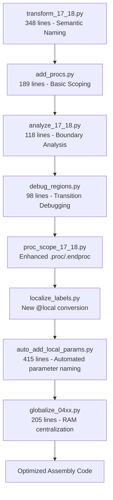

**Diagram sources**
- [tools/transform_17_18.py:1-348](file://tools/transform_17_18.py#L1-L348)
- [tools/add_procs.py:1-189](file://tools/add_procs.py#L1-L189)
- [tools/analyze_17_18.py:1-118](file://tools/analyze_17_18.py#L1-L118)
- [tools/debug_regions.py:1-98](file://tools/debug_regions.py#L1-L98)
- [tools/proc_scope_17_18.py:1-813](file://tools/proc_scope_17_18.py#L1-L813)
- [tools/localize_labels.py:1-526](file://tools/localize_labels.py#L1-L526)
- [tools/auto_add_local_params.py:1-416](file://tools/auto_add_local_params.py#L1-L416)
- [tools/globalize_04xx.py:1-205](file://tools/globalize_04xx.py#L1-L205)

### Stage-by-Stage Breakdown

#### Stage 1: Semantic Naming Transformation (transform_17_18.py)
- **Region-Based Organization**: Uses a comprehensive region map to identify function boundaries and data sections across Bank $17 ($A000-$BFFF) and Bank $18 ($C000-$DFFF).
- **Semantic Naming Convention**: Applies B17_18_ prefix to all identified functions and data structures for clear identification.
- **Cross-Bank Reference Handling**: Automatically detects and handles cross-bank references between $A000-$BFFF and $C000-$DFFF.
- **Section Headers**: Adds detailed section headers with address ranges, function types, and descriptions.
- **Label Renaming**: Renames LXXXX labels to semantic B17_18_ names and updates all references.
- **Dry Run Mode**: Supports --dry-run flag for previewing changes without modification.

#### Stage 2: Basic Procedure Scoping (add_procs.py)
- **Block Parsing**: Parses assembly code into structured blocks including section headers, labels, code, data, and comments.
- **Region Classification**: Classifies regions as code or data based on content analysis and section headers.
- **Cross-Reference Analysis**: Identifies cross-referenced Lxxxx labels that need proper scoping.
- **Scoping Implementation**: Adds .proc/.endproc directives around identified regions to improve code organization.
- **Block Grouping**: Groups related blocks into logical regions for better maintainability.

#### Stage 3: Advanced Boundary Analysis (analyze_17_18.py)
- **Address Mapping**: Builds comprehensive address-to-line mappings from inline byte comments.
- **Function Boundary Detection**: Analyzes RTS instructions, JSR/JMP patterns, and label relationships to identify function boundaries.
- **Entry Point Analysis**: Identifies jump table entry targets and traces function extents.
- **Cross-Bank Reference Analysis**: Detects and analyzes cross-bank references and their implications.
- **Statistical Analysis**: Provides counts of JSR/JMP instructions and function sizes for code analysis.

#### Stage 4: Region Transition Debugging (debug_regions.py)
- **Transition Analysis**: Tracks region transitions throughout the assembly code to ensure proper boundary detection.
- **Boundary Validation**: Validates that region boundaries align with actual code structure and address ranges.
- **Debug Output**: Provides detailed transition reports showing when and where region changes occur.
- **Boundary Verification**: Compares detected transitions with expected region counts and boundaries.

#### Stage 5: Enhanced .proc/.endproc Organization (proc_scope_17_18.py)
- **Advanced Boundary Detection**: Implements sophisticated algorithm to determine optimal .proc/.endproc boundaries based on code structure and data regions.
- **Proc Boundary Calculation**: Uses comprehensive analysis of label definitions, data ranges, and inline dispatch tables to determine proc boundaries.
- **Inner Global Detection**: Identifies labels that appear in multiple contexts and marks them as inner globals requiring special handling.
- **At-Candidate Analysis**: Detects labels that could be @-scoped references and analyzes their usage patterns.
- **Word Target Processing**: Handles word-sized targets and their relationship to proc boundaries.
- **Boundary Optimization**: Optimizes proc boundaries to minimize overlap and maximize code clarity.

#### Stage 6: Localized Label Conversion (localize_labels.py)
- **Branch-Only Label Detection**: Identifies labels that are only referenced by branch instructions (BCC, BCS, BEQ, etc.).
- **@Local Conversion**: Converts these labels to @local format for proper scoping within procedures.
- **Safety Verification**: Ensures that @local labels are only used within the same procedure context.
- **Descriptive Naming**: Generates meaningful @ names based on branch direction and context (loop, done, skip, target).
- **Cross-Reference Handling**: Manages cross-procedure references appropriately.

#### Stage 7: Automated Parameter Declaration (auto_add_local_params.py)
- **Parameter Extraction**: Parses all .proc/.endproc blocks and extracts zero-page/RAM memory addresses used in each proc.
- **Global Definition Filtering**: Skips addresses that are already globally defined, focusing only on local parameters.
- **Meaningful Naming**: Generates descriptive parameter names based on context, usage patterns, and address ranges.
- **Pointer Pair Detection**: Automatically identifies consecutive addresses that form pointer pairs (lo/hi) and renames them systematically.
- **Parameter Insertion**: Inserts parameter definitions at the start of each .proc block with proper formatting.
- **Address Replacement**: Replaces raw addresses in proc bodies with named parameters, handling both full and zero-page forms.
- **Well-Known Address Support**: Uses predefined naming conventions for common addresses (pointers, counters, flags, etc.).

#### Stage 8: RAM Centralization (globalize_04xx.py)
- **Canonical Name Mapping**: Defines comprehensive mapping from $04xx addresses to globally standardized canonical names.
- **Global Definition Block Generation**: Creates centralized global RAM definition block outside .proc scopes.
- **Local Definition Removal**: Removes all local $04xx = $04XX definitions from inside .proc blocks.
- **Alias Renaming**: Replaces old alias names with canonical names in instruction lines.
- **Functional Grouping**: Organizes $04xx addresses into logical functional groups (Pointer/State, Officer/Selection, Map/Scroll pointers, Main game state, Extended state).
- **Comment Integration**: Adds descriptive comments to canonical names for improved code documentation.

### Integration with Build System
The transformation pipeline integrates seamlessly with the Makefile build system:
- **New**: make transform_17_18 target applies semantic naming transformation to PRG bank $17/$18 assembly code.
- **New**: make add_procs target adds basic .proc/.endproc scoping to organized assembly code.
- **New**: make analyze_17_18 target analyzes function boundaries and cross-bank references.
- **New**: make debug_regions target validates region transitions and boundary detection.
- **New**: make proc_scope_17_18 target applies enhanced .proc/.endproc organization with advanced boundary analysis.
- **New**: make localize_labels target converts branch-only labels to @local format with proper scoping.
- **New**: make auto_add_local_params target automatically adds local parameter declarations to .proc blocks.
- **New**: make globalize_04xx target centralizes $04xx RAM definitions with standardized global memory definitions.
- Each stage produces detailed logging and validation feedback.
- Intermediate results are saved to maintain progress and enable debugging.
- Final output provides well-organized, semantically-named assembly code with optimized .proc/.endproc boundaries, systematic parameter naming, and centralized RAM definitions ready for compilation.

**Section sources**
- [tools/transform_17_18.py:1-348](file://tools/transform_17_18.py#L1-L348)
- [tools/add_procs.py:1-189](file://tools/add_procs.py#L1-L189)
- [tools/analyze_17_18.py:1-118](file://tools/analyze_17_18.py#L1-L118)
- [tools/debug_regions.py:1-98](file://tools/debug_regions.py#L1-L98)
- [tools/proc_scope_17_18.py:1-813](file://tools/proc_scope_17_18.py#L1-L813)
- [tools/localize_labels.py:1-526](file://tools/localize_labels.py#L1-L526)
- [tools/auto_add_local_params.py:1-416](file://tools/auto_add_local_params.py#L1-L416)
- [tools/globalize_04xx.py:1-205](file://tools/globalize_04xx.py#L1-L205)

### Semantic Naming Conventions
The transformation pipeline implements a comprehensive semantic naming system for PRG bank $17/$18 assembly code:

#### Naming Pattern
- **Prefix**: B17_18_ (identifies Bank $17/$18 origin)
- **Function Names**: Descriptive names based on functionality (e.g., B17_18_ PpuWriteRle, B17_18_ DisplayRenderScene)
- **Data Names**: Descriptive names indicating data purpose (e.g., B17_18_ BattleTileData, B17_18_ TileLookupTable)
- **Table Names**: Descriptive names indicating table purpose (e.g., B17_18_ JumpTable, B17_18_ AnimFrameTable)

#### Cleaner Naming Examples
Recent refactoring has introduced cleaner, more descriptive function names:
- **PpuWriteRle**: Replaces generic LXXXX naming with clear PPU RLE writing functionality
- **PpuCopyRaw**: Clear indication of raw PPU data copying operation
- **PpuWriteTileOffset**: Describes tile offset writing to PPU
- **DomesticDisplay**: Self-explanatory domestic affairs display routine

#### Region Classification
- **Functions**: Code regions ending with RTS, tail-call JMP, or region boundaries
- **Data Tables**: Static data arrays and lookup tables
- **Jump Tables**: Dispatch tables with multiple entry points
- **State Machines**: Complex control flow with multiple states

#### Cross-Bank Reference Handling
- **Automatic Detection**: Identifies cross-bank references between $A000-$BFFF and $C000-$DFFF
- **Proper Labeling**: Ensures cross-bank references use semantic naming conventions
- **Equation Generation**: Creates proper equate statements for cross-bank references
- **Scope Management**: Maintains proper scoping across bank boundaries

### Enhanced .proc/.endproc Organization
The proc_scope_17_18.py tool provides advanced .proc/.endproc organization with sophisticated boundary analysis:

#### Advanced Boundary Detection Algorithm
- **Proc Start Analysis**: Identifies potential proc start locations based on label definitions and code structure
- **Data Region Integration**: Incorporates data region boundaries into proc boundary calculations
- **Next Boundary Determination**: Calculates optimal end points by finding the nearest proc start or data region
- **Boundary Optimization**: Minimizes overlap and maximizes code clarity through boundary optimization

#### Inner Global Detection
- **Multi-Context Labels**: Identifies labels that appear in multiple contexts requiring special handling
- **Inner Global Marking**: Marks inner globals with appropriate scope qualifiers
- **Cross-Reference Handling**: Ensures proper handling of cross-references to inner globals

#### At-Candidate Analysis
- **At-Reference Detection**: Identifies labels that could be @-scoped references
- **Usage Pattern Analysis**: Analyzes usage patterns to determine appropriate scoping
- **Candidate Classification**: Classifies labels as potential @-references for further processing

#### Word Target Processing
- **Word-Sized Target Detection**: Identifies word-sized targets and their relationship to proc boundaries
- **Target Analysis**: Analyzes word targets to determine their impact on proc boundaries
- **Boundary Adjustment**: Adjusts proc boundaries based on word target relationships

### Localized Label Conversion
The localize_labels.py tool provides systematic conversion of branch-only labels to @local format:

#### Branch-Only Label Detection
- **Reference Analysis**: Identifies labels that are only referenced by branch instructions (BCC, BCS, BEQ, etc.)
- **Usage Pattern Recognition**: Analyzes instruction patterns to determine label scope requirements
- **Safety Verification**: Ensures @local labels are only used within the same procedure context

#### Descriptive @Naming Strategy
- **Direction-Based Naming**: Generates meaningful names based on branch direction and context
- **Loop Detection**: Identifies loop constructs and names them appropriately
- **Conditional Logic**: Handles conditional branches with descriptive naming (skip, done)
- **Fallback Naming**: Uses target as default when context doesn't indicate a specific pattern

#### Safety and Validation
- **Cross-Procedure Reference Checking**: Verifies that @local labels aren't referenced across procedure boundaries
- **Iteration-Based Promotion**: Promotes labels with cross-procedure references to proc_starts
- **Deterministic Ordering**: Processes labels in a consistent order for reproducible results

### Automated Parameter Declaration System
The auto_add_local_params.py tool provides systematic approach to maintaining consistent parameter naming conventions:

#### Parameter Extraction and Analysis
- **Proc Block Parsing**: Identifies all .proc/.endproc blocks and extracts memory addresses used within each block
- **Address Range Filtering**: Skips hardware registers, ROM, and expansion memory ranges, focusing on RAM and zero-page addresses
- **Usage Pattern Analysis**: Records instruction types, read/write operations, and access frequencies for each address
- **Global Definition Detection**: Filters out addresses that are already globally defined, focusing on local parameters only

#### Intelligent Parameter Naming
- **Well-Known Address Support**: Uses predefined naming conventions for common addresses (pointers, counters, flags, etc.)
- **Context-Aware Naming**: Generates descriptive names based on instruction patterns, address ranges, and usage characteristics
- **Pointer Pair Detection**: Automatically identifies consecutive addresses that form pointer pairs and renames them systematically
- **Name Collision Prevention**: Ensures unique parameter names by appending numeric suffixes when conflicts occur

#### Parameter Insertion and Replacement
- **Parameter Definition Generation**: Creates formatted parameter definitions with proper alignment and spacing
- **Address Replacement**: Replaces raw addresses in proc bodies with named parameters, handling both absolute and zero-page forms
- **Comment Preservation**: Maintains inline comments and formatting while replacing addresses with meaningful parameter names
- **Pointer Form Handling**: Properly handles both full 16-bit addresses and 8-bit zero-page forms in address replacement

#### Advanced Features
- **Skip Range Management**: Excludes hardware registers, ROM, expansion ROM, and SRAM from parameter consideration
- **Instruction Type Analysis**: Differentiates between read-only, write-only, and read-write operations for better naming decisions
- **Branch Instruction Detection**: Identifies status flags and loop variables through branch instruction patterns
- **State Variable Recognition**: Detects state machine variables through specific address range patterns

### RAM Centralization System
The globalize_04xx.py tool provides systematic approach to standardizing $04xx memory region definitions:

#### Canonical Name Mapping
- **Comprehensive Address Coverage**: Maps all $04xx addresses to globally standardized canonical names
- **Functional Grouping**: Organizes addresses into logical functional groups for better code organization
- **Descriptive Naming**: Uses meaningful names that describe the purpose and usage of each memory location
- **Comment Integration**: Adds descriptive comments to explain the function and context of each canonical name

#### Global Definition Generation
- **Centralized Block Creation**: Generates a centralized global RAM definition block outside .proc scopes
- **Functional Organization**: Groups related memory addresses by their functional purpose (pointer/state, officer/selection, map/scroll, etc.)
- **Consistent Formatting**: Uses consistent formatting and spacing for easy reading and maintenance
- **Documentation Integration**: Includes explanatory comments for each functional group

#### Local Definition Removal
- **Alias Detection**: Identifies all local $04xx = $04XX definitions within .proc blocks
- **Selective Removal**: Removes only those local definitions that correspond to canonical addresses
- **Reference Tracking**: Counts and reports the number of local definitions removed
- **Scope Preservation**: Maintains proper scoping for non-canonical addresses and local variables

#### Alias Renaming
- **Pattern Matching**: Uses regex patterns to identify and replace old alias names with canonical names
- **Whole-Word Replacement**: Ensures complete replacement without partial matches
- **Reference Counting**: Tracks and reports the number of references renamed
- **Scope Awareness**: Preserves local @-scoped references and ::-scoped references

#### Functional Grouping Strategy
The tool organizes $04xx addresses into five functional groups:
- **Pointer/State ($0400-$0411)**: General-purpose pointer and state variables
- **Officer/Selection ($0424-$0435)**: Officer selection and assignment variables
- **Map/Scroll pointers ($0470-$0473)**: Map scrolling and display pointer variables
- **Main game state ($04A8-$04C0)**: Core game state and control variables
- **Extended state ($04C9-$04D5)**: Extended state and data pointer variables

**Section sources**
- [tools/transform_17_18.py:30-168](file://tools/transform_17_18.py#L30-L168)
- [tools/proc_scope_17_18.py:315-813](file://tools/proc_scope_17_18.py#L315-813)
- [tools/localize_labels.py:1-526](file://tools/localize_labels.py#L1-L526)
- [tools/auto_add_local_params.py:1-416](file://tools/auto_add_local_params.py#L1-L416)
- [tools/globalize_04xx.py:1-205](file://tools/globalize_04xx.py#L1-L205)

## RAM Centralization and Standardization

### Overview
The RAM centralization system provides a comprehensive automated workflow for standardizing $04xx memory region definitions in PRG bank $17/$18 assembly code. This system addresses the challenge of inconsistent memory address aliasing by creating a centralized global RAM definition system that replaces local memory address aliases with globally defined canonical names.

### Centralization Architecture
The RAM centralization system operates on PRG bank $17/$18 assembly code with a four-stage process:

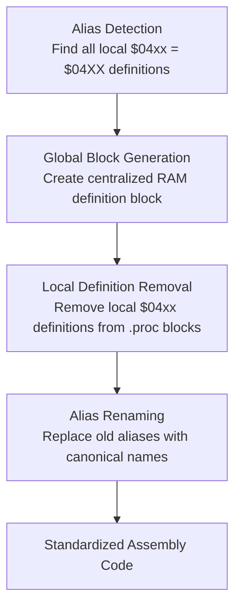

**Diagram sources**
- [tools/globalize_04xx.py:1-205](file://tools/globalize_04xx.py#L1-L205)

### Stage-by-Stage Breakdown

#### Stage 1: Alias Detection (build_alias_map)
- **Pattern Recognition**: Uses regex patterns to identify all local memory address alias definitions in the format `name = $04XX`
- **Address Validation**: Validates that detected addresses fall within the $04xx range and are included in the canonical mapping
- **Alias Collection**: Builds a comprehensive map of old alias names to their corresponding canonical names
- **Duplicate Handling**: Ensures that only unique aliases are processed, avoiding redundant operations

#### Stage 2: Global Block Generation (make_global_block)
- **Functional Grouping**: Organizes $04xx addresses into five logical functional groups based on their purpose and usage patterns
- **Canonical Name Application**: Applies the predefined canonical names to each address in the mapping
- **Comment Integration**: Adds descriptive comments explaining the function and context of each canonical name
- **Formatting Consistency**: Uses consistent formatting and spacing for easy reading and maintenance

#### Stage 3: Local Definition Removal
- **Scope Detection**: Identifies .proc/.endproc block boundaries to ensure proper scope management
- **Selective Removal**: Removes only local $04xx definitions that correspond to canonical addresses
- **Reference Tracking**: Counts and reports the number of local definitions removed
- **Scope Preservation**: Maintains proper scoping for non-canonical addresses and local variables

#### Stage 4: Alias Renaming
- **Pattern Matching**: Uses regex patterns with word boundaries to ensure complete replacement without partial matches
- **Whole-Word Replacement**: Replaces old alias names with canonical names while preserving local @-scoped references
- **Reference Counting**: Tracks and reports the number of references successfully renamed
- **Scope Awareness**: Preserves scoped references (e.g., `::name`, `@name`) that should not be globally replaced

### Functional Grouping Strategy
The system organizes $04xx addresses into five functional groups based on their role in the game's memory management:

#### Pointer/State ($0400-$0411)
- **Domestic Work Pointer**: `domestic_work_ptr_lo` and `domestic_work_ptr_hi` for domestic dispatch operations
- **Scroll Pointer**: `scroll_ptr_lo` and `scroll_ptr_hi` for scroll position management
- **Cursor Pointer**: `domestic_cursor_lo` and `domestic_cursor_hi` for domestic display navigation
- **Officer List Pointer**: `domestic_officer_list_lo` and `domestic_officer_list_hi` for officer selection lists

#### Officer/Selection ($0424-$0435)
- **Troop Assignment Counter**: `troop_assign_counter_lo` and `troop_assign_counter_hi` for troop assignment progress
- **Selected Officer ID**: `selected_officer_id` for active/selected officer identification
- **Battle Result Phase**: `battle_result_phase` for shared battle result processing
- **Dispatch Timer**: `dispatch_timer` for general dispatch timing
- **Menu Blink Timer**: `menu_blink_timer` for menu selection feedback

#### Map/Scroll Pointers ($0470-$0473)
- **Animation PPU Pointer**: `anim_ppu_ptr_lo` and `anim_ppu_ptr_hi` for animation display
- **Map Scroll Pointer**: `map_scroll_ptr_lo` and `map_scroll_ptr_hi` for map scrolling operations

#### Main Game State ($04A8-$04C0)
- **Game State**: `game_state` for major game state (0-14) indexing dispatch table
- **Sub-State**: `sub_state` for sub-state within each major state
- **Active Player Slot**: `active_player_slot` for current player index (0 or 1)
- **Player Flags**: `player_flag_0` for player 0 status
- **Player Officer IDs**: `player_officer_id_0` and `player_officer_id_1` for officer assignments
- **Name Tile Index**: `name_tile_index` for name tile and scroll tile data
- **Domestic Action Index**: `domestic_action_index` for domestic affairs actions
- **Player Army Values**: `player_army_value_0` and `player_army_value_1` for army statistics
- **Player Random Offsets**: `player_random_offset_0` for player 0 randomization
- **Player Action Timers**: `player_action_timer_0` for player action timing
- **Animation Timer**: `anim_timer` for general animation timing
- **Map Scroll Phase**: `map_scroll_phase` for map scrolling animation
- **Scroll Row Count**: `scroll_row_count` for scroll positioning
- **Slide Y Position**: `slide_y_pos` for slide animation positioning
- **Cutscene Load Progress**: `cutscene_load_progress` for cutscene loading
- **Display Pointer**: `display_ptr_lo` and `display_ptr_hi` for display management
- **Sub-Action Type**: `sub_action_type` for sub-action type selection
- **Frame Counter**: `frame_counter` for frame-based timing
- **Player Scene Index**: `player_scene_index` for per-player scene management
- **Event Overlay Flag**: `event_overlay_flag` for event overlay and battle formation
- **UI State**: `ui_state` for user interface state management
- **Name Tile Pointer**: `name_tile_ptr_lo` and `name_tile_ptr_hi` for name tile display

#### Extended State ($04C9-$04D5)
- **Dispatch Step**: `dispatch_step` for dispatch phase counting
- **Dispatch Source/Destination Pointers**: `dispatch_src_ptr_lo`/`dispatch_src_ptr_hi`, `dispatch_dst_ptr_lo`/`dispatch_dst_ptr_hi`
- **Dispatch Data/Offset Pointers**: `dispatch_data_ptr_lo`/`dispatch_data_ptr_hi`, `dispatch_offset_ptr_lo`/`dispatch_offset_ptr_hi`

### Integration with Build System
The RAM centralization system integrates seamlessly with the Makefile build system:
- **New**: make globalize_04xx target executes the complete RAM centralization workflow
- **New**: Direct tool execution: python3 tools/globalize_04xx.py
- **New**: Dry run mode: python3 tools/globalize_04xx.py --dry-run
- **New**: Custom input/output specification: python3 tools/globalize_04xx.py --input asm/banks/prg_17_18.asm --output asm/banks/prg_17_18_globalized.asm

The tool processes the assembly file in-place by default, but supports custom input/output paths for testing and validation purposes. The tool provides detailed logging of its operations, including the number of aliases detected, local definitions removed, and references renamed.

**Section sources**
- [tools/globalize_04xx.py:1-205](file://tools/globalize_04xx.py#L1-L205)

### Advanced RAM Centralization Features
The globalize_04xx.py tool provides several advanced features for comprehensive RAM standardization:

#### Canonical Name Mapping
- **Comprehensive Coverage**: Maps all $04xx addresses from $0400 to $04D5 to globally standardized names
- **Descriptive Naming**: Uses meaningful names that clearly indicate the purpose and usage context of each memory location
- **Comment Integration**: Adds explanatory comments to clarify the function and context of each canonical name
- **Well-Known Address Support**: Leverages predefined naming conventions for common memory locations

#### Scope Preservation
- **Local Reference Protection**: Preserves local @-scoped references and ::-scoped references that should not be globally replaced
- **Non-Canonical Address Handling**: Maintains local definitions for addresses not included in the canonical mapping
- **Proc Boundary Awareness**: Properly handles .proc/.endproc scope boundaries to avoid unintended global replacements

#### Functional Organization
- **Logical Grouping**: Organizes memory addresses into five functional groups based on their purpose and usage patterns
- **Consistent Formatting**: Uses consistent formatting and spacing for easy reading and maintenance
- **Documentation Integration**: Includes explanatory comments for each functional group and individual addresses

#### Error Handling and Validation
- **Pattern Validation**: Uses regex patterns with word boundaries to ensure accurate pattern matching
- **Reference Tracking**: Counts and reports the number of aliases detected, local definitions removed, and references renamed
- **Scope Verification**: Ensures proper handling of scope boundaries and preserves intended local references

**Section sources**
- [tools/globalize_04xx.py:13-132](file://tools/globalize_04xx.py#L13-L132)
- [tools/globalize_04xx.py:135-201](file://tools/globalize_04xx.py#L135-L201)

## ROM Analysis and Verification Tools

### Overview
The ROM analysis and verification toolkit provides dedicated tools for detailed byte-level ROM inspection, pattern matching, and cross-referencing. These tools complement the existing verification system by offering specialized analysis capabilities for ROM reconstruction and debugging. The toolkit now includes specialized verification tools for paired bank validation with byte-exact accuracy requirements.

### Analysis Tool Architecture
The ROM analysis toolkit consists of ten specialized tools that work together to provide comprehensive ROM verification and debugging capabilities:

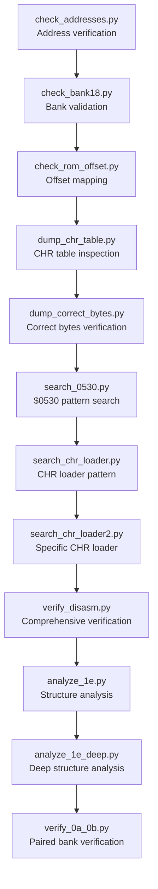

**Diagram sources**
- [tools/check_addresses.py:1-33](file://tools/check_addresses.py#L1-33)
- [tools/check_bank18.py:1-50](file://tools/check_bank18.py#L1-L50)
- [tools/check_rom_offset.py:1-43](file://tools/check_rom_offset.py#L1-L43)
- [tools/dump_chr_table.py:1-13](file://tools/dump_chr_table.py#L1-L13)
- [tools/dump_correct_bytes.py:1-35](file://tools/dump_correct_bytes.py#L1-L35)
- [tools/search_0530.py:1-23](file://tools/search_0530.py#L1-L23)
- [tools/search_chr_loader.py:1-15](file://tools/search_chr_loader.py#L1-L15)
- [tools/search_chr_loader2.py:1-21](file://tools/search_chr_loader2.py#L1-L21)
- [tools/verify_disasm.py:1-34](file://tools/verify_disasm.py#L1-L34)
- [tools/analyze_1e.py:1-36](file://tools/analyze_1e.py#L1-L36)
- [tools/analyze_1e_deep.py:1-53](file://tools/analyze_1e_deep.py#L1-L53)
- [tools/verify_0a_0b.py:1-28](file://tools/verify_0a_0b.py#L1-L28)

### Individual Tool Analysis

#### check_addresses.py - Address Verification Tool
- **Purpose**: Verifies ROM bytes at specific disassembly addresses for accuracy
- **Functionality**: Reads ROM data from prg_17.bin and displays bytes at addresses $A8D3, $A944, and user-specified data table pointers
- **Address Mapping**: Converts disassembly addresses to ROM file offsets (e.g., $A8D3 -> offset $08D3)
- **Output Format**: Displays 16-byte chunks in hexadecimal format with CPU addresses
- **Use Case**: Validates that ROM bytes match expected disassembly at critical addresses

#### check_bank18.py - Bank Validation Tool
- **Purpose**: Validates bank $18 content and cross-checks with bank $17
- **Functionality**: Checks target byte sequences at specific offsets in prg_18.bin and prg_17.bin
- **Cross-Bank Verification**: Compares bank $18 content with expected patterns and validates combined bank layout
- **Target Bytes**: Searches for specific byte sequences (e.g., A0 00 AD 0D 00) to verify ROM structure
- **Combined Bank Analysis**: Validates combined bank layout where bank $17 occupies $0000-$1FFF and bank $18 occupies $2000-$3FFF

#### check_rom_offset.py - Offset Mapping Tool
- **Purpose**: Maps CPU addresses to ROM file offsets for verification
- **Functionality**: Calculates file offsets for CPU addresses within combined ROM structure
- **Bank Calculation**: Computes bank-specific offsets using standard 8KB bank sizing ($2000 bytes per bank)
- **Pattern Searching**: Searches for target byte sequences anywhere in the combined ROM
- **Verification Workflow**: Provides systematic approach to verify ROM address mappings

#### dump_chr_table.py - CHR Table Inspection Tool
- **Purpose**: Inspects CHR table data in combined ROM for verification
- **Functionality**: Dumps 256 bytes of ROM data centered around address $A8FD for detailed analysis
- **Context Analysis**: Provides broader context around specific CHR table addresses
- **Combined ROM Usage**: Works with prg_17_18_combined.bin for unified bank analysis
- **Verification Support**: Supports CHR loader verification and table structure analysis

#### dump_correct_bytes.py - Correct Bytes Verification Tool
- **Purpose**: Verifies correct bytes in ROM for disassembly validation
- **Functionality**: Dumps specific byte ranges from prg_17.bin and analyzes data table structures
- **Range Analysis**: Covers disassembly addresses $A8D3-$A988 with detailed byte-by-byte output
- **Data Table Processing**: Analyzes 10-byte entries in data tables with pointer extraction and address calculation
- **ASCII Representation**: Provides ASCII character representation alongside hexadecimal data

#### search_0530.py - $0530 Pattern Search Tool
- **Purpose**: Searches for $0530 store patterns in ROM for CHR loader identification
- **Functionality**: Searches for STA $0530 instructions (8D 30 05) and similar patterns (STA $0531)
- **Pattern Recognition**: Identifies specific store instructions targeting $0530/$0531 addresses
- **Context Display**: Shows instruction context around detected patterns for analysis
- **CHR Loader Support**: Aids in identifying CHR loading routines and data structures

#### search_chr_loader.py - CHR Loader Pattern Tool
- **Purpose**: Finds general CHR loader patterns in ROM
- **Functionality**: Searches for TAY followed by LDA absolute,Y instruction sequences
- **Pattern Matching**: Identifies TAY (A8) followed by LDA absolute,Y (B9) patterns
- **Loader Identification**: Supports identification of CHR loading routines using Y-indexed addressing
- **Instruction Context**: Displays instruction context for pattern analysis

#### search_chr_loader2.py - Specific CHR Loader Tool
- **Purpose**: Locates specific CHR loader with $0530/$0531 stores
- **Functionality**: Searches for complex pattern: TAY, LDA abs,Y, STA $0530, LDA abs,Y, STA $0531
- **Multi-Step Verification**: Identifies complete CHR loading sequences with specific store addresses
- **Pattern Validation**: Confirms complex instruction sequences for accurate loader identification
- **Address Verification**: Supports verification of CHR loader address patterns

#### verify_disasm.py - Comprehensive Disassembly Verification Tool
- **Purpose**: Provides comprehensive disassembly verification against ROM bytes
- **Functionality**: Checks multiple known addresses from disassembly for byte-level accuracy
- **Test Addresses**: Validates addresses $A8D3 (LDY #$00), $A8D5 (LDA a:$000D), $A8FD (PHA), $A8FE (LDY a:$0019), $A901 (LDA $0680,Y)
- **Multi-Address Testing**: Tests multiple addresses to ensure comprehensive disassembly accuracy
- **Context Verification**: Displays actual ROM bytes at target addresses for comparison

#### analyze_1e.py - Bank $1E Structure Analysis Tool
- **Purpose**: Analyzes structure of Bank $1E ($C000-$DFFF) for disassembly guidance
- **Functionality**: Identifies RTS positions, JMP targets, and unique intra-bank JSR targets
- **End-of-ROM Analysis**: Examines last 128 bytes for $FF padding patterns
- **Pattern Recognition**: Helps identify callback patterns and data table boundaries
- **Disassembly Planning**: Provides structural insights for Bank $1E disassembly strategy

#### analyze_1e_deep.py - Deep Bank $1E Analysis Tool
- **Purpose**: Provides deep structural analysis of Bank $1E for definitive disassembly
- **Functionality**: Analyzes JMP $C934 patterns and data blocks between code routines
- **Data Block Detection**: Identifies lookup tables and data regions after specific JMP instructions
- **Context Analysis**: Shows surrounding bytes and patterns for accurate data/code separation
- **Padding Analysis**: Locates $FF padding regions and provides context for ROM structure understanding

#### verify_0a_0b.py - Specialized Paired Bank Verification Tool
- **Purpose**: Provides specialized verification for paired banks $0A/$0B with byte-exact accuracy validation
- **Functionality**: Compares the combined 16KB block ($A000-$DFFF) from paired banks $0A/$0B against the original ROM
- **Test Build Integration**: Validates that the test build output (build/prg_0a_0b_test.bin) matches the original ROM exactly
- **Detailed Mismatch Reporting**: Reports up to 10 specific mismatch locations with addresses and byte values
- **Comprehensive Coverage**: Validates the entire 16KB paired bank region for byte-exact fidelity
- **Automated Testing**: Provides clear PASS/FAIL status with exit codes for CI/CD integration

### Integration with Build System
The ROM analysis toolkit integrates seamlessly with the Makefile build system:
- **New**: make check_addresses target verifies ROM bytes at specific disassembly addresses.
- **New**: make check_bank18 target validates bank $18 content and cross-checks with bank $17.
- **New**: make check_rom_offset target maps CPU addresses to ROM file offsets for verification.
- **New**: make dump_chr_table target inspects CHR table data in combined ROM.
- **New**: make dump_correct_bytes target verifies correct bytes in ROM for disassembly validation.
- **New**: make search_0530 target searches for $0530 store patterns in ROM.
- **New**: make search_chr_loader target finds general CHR loader patterns in ROM.
- **New**: make search_chr_loader2 target locates specific CHR loader with $0530/$0531 stores.
- **New**: make verify_disasm target provides comprehensive disassembly verification.
- **New**: make analyze_1e target analyzes Bank $1E structure for disassembly guidance.
- **New**: make analyze_1e_deep target provides deep structural analysis of Bank $1E.
- **New**: make verify_0a_0b target provides specialized verification for paired banks $0A/$0B with byte-exact accuracy.
- Each tool produces detailed logging and validation feedback for ROM debugging.
- Tools utilize ROM assets generated by make split and make banks targets.
- Results support iterative assembly and linking workflows for accurate ROM reconstruction.

**Section sources**
- [tools/check_addresses.py:1-33](file://tools/check_addresses.py#L1-33)
- [tools/check_bank18.py:1-50](file://tools/check_bank18.py#L1-L50)
- [tools/check_rom_offset.py:1-43](file://tools/check_rom_offset.py#L1-L43)
- [tools/dump_chr_table.py:1-13](file://tools/dump_chr_table.py#L1-L13)
- [tools/dump_correct_bytes.py:1-35](file://tools/dump_correct_bytes.py#L1-L35)
- [tools/search_0530.py:1-23](file://tools/search_0530.py#L1-L23)
- [tools/search_chr_loader.py:1-15](file://tools/search_chr_loader.py#L1-L15)
- [tools/search_chr_loader2.py:1-21](file://tools/search_chr_loader2.py#L1-L21)
- [tools/verify_disasm.py:1-34](file://tools/verify_disasm.py#L1-L34)
- [tools/analyze_1e.py:1-36](file://tools/analyze_1e.py#L1-L36)
- [tools/analyze_1e_deep.py:1-53](file://tools/analyze_1e_deep.py#L1-L53)
- [tools/verify_0a_0b.py:1-28](file://tools/verify_0a_0b.py#L1-L28)

### Advanced Verification Workflows
The ROM analysis toolkit enables sophisticated verification workflows:

#### Byte-Level Verification Workflow
1. **Address Verification**: Use check_addresses.py to verify critical ROM addresses
2. **Bank Validation**: Use check_bank18.py to validate bank-specific content
3. **Offset Mapping**: Use check_rom_offset.py to verify CPU-to-file address mappings
4. **Pattern Search**: Use search_0530.py, search_chr_loader.py, and search_chr_loader2.py to identify specific ROM patterns
5. **Comprehensive Testing**: Use verify_disasm.py to test multiple addresses for accuracy
6. **Paired Bank Validation**: Use verify_0a_0b.py to validate paired banks $0A/$0B with byte-exact accuracy

#### CHR Loader Verification Workflow
1. **Pattern Identification**: Use search_chr_loader.py and search_chr_loader2.py to locate CHR loaders
2. **Table Analysis**: Use dump_chr_table.py and dump_correct_bytes.py to analyze CHR table structures
3. **Address Validation**: Use check_addresses.py and verify_disasm.py to confirm ROM addresses
4. **Cross-Reference Validation**: Use check_bank18.py to validate bank-specific CHR loader content

#### Data Table Verification Workflow
1. **Table Location**: Use dump_correct_bytes.py to locate and analyze data tables
2. **Pointer Extraction**: Analyze 10-byte entries to extract and validate table pointers
3. **Address Calculation**: Verify calculated addresses against ROM content
4. **Pattern Matching**: Use search_0530.py to identify store patterns in data tables

#### Bank $1E Structure Analysis Workflow
1. **Basic Analysis**: Use analyze_1e.py to identify RTS positions and JMP targets
2. **Deep Analysis**: Use analyze_1e_deep.py to detect data blocks and lookup tables
3. **Pattern Recognition**: Identify JMP $C934 patterns and data table boundaries
4. **Padding Detection**: Locate $FF padding regions and analyze ROM structure

#### Paired Bank Verification Workflow
1. **Disassembly**: Use disasm_0a_0b.py to generate paired bank disassembly
2. **Test Build**: Compile test build using link_0a_0b_test.cfg configuration
3. **Verification**: Use verify_0a_0b.py to validate byte-exact accuracy against original ROM
4. **Mismatch Analysis**: Review detailed mismatch reports for any discrepancies
5. **Iterative Refinement**: Update disassembly based on verification results and re-test

**Section sources**
- [tools/check_addresses.py:1-33](file://tools/check_addresses.py#L1-33)
- [tools/check_bank18.py:1-50](file://tools/check_bank18.py#L1-L50)
- [tools/check_rom_offset.py:1-43](file://tools/check_rom_offset.py#L1-L43)
- [tools/dump_correct_bytes.py:1-35](file://tools/dump_correct_bytes.py#L1-L35)
- [tools/search_0530.py:1-23](file://tools/search_0530.py#L1-L23)
- [tools/search_chr_loader.py:1-15](file://tools/search_chr_loader.py#L1-L15)
- [tools/search_chr_loader2.py:1-21](file://tools/search_chr_loader2.py#L1-L21)
- [tools/verify_disasm.py:1-34](file://tools/verify_disasm.py#L1-L34)
- [tools/analyze_1e.py:1-36](file://tools/analyze_1e.py#L1-L36)
- [tools/analyze_1e_deep.py:1-53](file://tools/analyze_1e_deep.py#L1-L53)
- [tools/verify_0a_0b.py:1-28](file://tools/verify_0a_0b.py#L1-L28)

## PRG Banks $1D/$1E Analysis Suite

### Overview
The PRG banks $1D/$1E analysis suite provides a comprehensive set of specialized Python tools designed specifically for analyzing and validating PRG banks $1D ($A000-$BFFF) and $1E ($C000-$DFFF) assembly code. This suite addresses the unique challenges of working with these banks through RAM usage analysis, address validation, symbol conflict detection, ROM data extraction, automated data insertion, and global variable validation. The tools work together to provide systematic analysis and validation workflows for maintaining code quality and consistency across these critical memory regions.

### Analysis Suite Architecture
The PRG banks $1D/$1E analysis suite consists of six specialized tools that provide comprehensive analysis and validation capabilities:

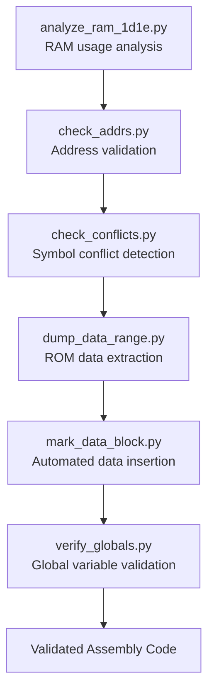

**Diagram sources**
- [tools/analyze_ram_1d1e.py:1-102](file://tools/analyze_ram_1d1e.py#L1-102)
- [tools/check_addrs.py:1-56](file://tools/check_addrs.py#L1-L56)
- [tools/check_conflicts.py:1-42](file://tools/check_conflicts.py#L1-L42)
- [tools/dump_data_range.py:1-13](file://tools/dump_data_range.py#L1-L13)
- [tools/mark_data_block.py:1-56](file://tools/mark_data_block.py#L1-L56)
- [tools/verify_globals.py:1-105](file://tools/verify_globals.py#L1-L105)

### Individual Tool Analysis

#### analyze_ram_1d1e.py - RAM Usage Analysis Tool
- **Purpose**: Analyzes RAM usage patterns across PRG banks $1D/$1E assembly code
- **Functionality**: Scans prg_1d_1e.asm for RAM address usage within .proc blocks and file scope
- **Procedure Grouping**: Automatically groups RAM addresses by their containing .proc blocks
- **Usage Statistics**: Provides detailed usage counts and cross-procedure reference analysis
- **Global vs Local Classification**: Distinguishes between global addresses (used by 2+ procs) and local addresses (used by single proc)
- **Already Defined Handling**: Excludes addresses already defined in file scope or extern definitions

#### check_addrs.py - Address Validation Tool
- **Purpose**: Validates specific RAM addresses usage patterns in PRG banks $1D/$1E
- **Functionality**: Checks predefined list of critical addresses for usage patterns and scope classification
- **Address List**: Validates 60+ specific addresses including $0014-$001D, $0424-$0486, $03A5-$03BA, and others
- **Scope Classification**: Reports whether addresses are GLOBAL (used by 2+ procs) or LOCAL (used by single proc)
- **Missing Address Detection**: Identifies addresses that are not found in the assembly code
- **Validation Workflow**: Provides systematic validation of critical memory addresses

#### check_conflicts.py - Symbol Conflict Detection Tool
- **Purpose**: Detects symbol conflicts between global and local scopes in PRG banks $1D/$1E
- **Functionality**: Scans assembly code for symbol definitions and identifies scope conflicts
- **Conflict Detection**: Identifies symbols defined in both GLOBAL and local (.proc) scopes
- **Scope Tracking**: Tracks symbol definitions with line numbers and scope information
- **Conflict Reporting**: Provides detailed reports of conflicting symbol definitions
- **Quality Assurance**: Ensures symbol scope consistency across the codebase

#### dump_data_range.py - ROM Data Extraction Tool
- **Purpose**: Extracts specific ROM data ranges for analysis and verification
- **Functionality**: Reads binary data from prg_1e.bin and dumps specified byte ranges
- **Range Specification**: Supports configurable start and end addresses for data extraction
- **Formatted Output**: Generates ca65-compatible .byte directives with inline comments
- **Analysis Support**: Provides raw data dumps for manual inspection and verification
- **Data Validation**: Supports verification of ROM data integrity

#### mark_data_block.py - Automated Data Insertion Tool
- **Purpose**: Automatically inserts data blocks into PRG banks $1D/$1E assembly code
- **Functionality**: Replaces placeholder comments with actual .byte data from ROM
- **Block Detection**: Identifies data block boundaries using header comments and procedure markers
- **Data Generation**: Converts ROM binary data to ca65-compatible .byte directives
- **Automated Processing**: Performs bulk data insertion with minimal manual intervention
- **Code Maintenance**: Keeps assembly code synchronized with ROM data

#### verify_globals.py - Global Variable Validation Tool
- **Purpose**: Validates global variable definitions and identifies missing global addresses
- **Functionality**: Checks that all global addresses are properly defined and used by multiple procedures
- **Global Definition Check**: Verifies that currently-defined global addresses are used by 2+ procedures
- **Missing Global Detection**: Identifies addresses used by 2+ procedures that are not yet defined as global
- **Already Named Handling**: Excludes addresses already named or defined elsewhere
- **Validation Reporting**: Provides comprehensive reports of global variable issues

### Integration with Build System
The PRG banks $1D/$1E analysis suite integrates seamlessly with the Makefile build system:
- **New**: make analyze_ram_1d1e target executes RAM usage analysis for PRG banks $1D/$1E
- **New**: make check_addrs target validates specific RAM addresses in PRG banks $1D/$1E
- **New**: make check_conflicts target detects symbol conflicts in PRG banks $1D/$1E
- **New**: make dump_data_range target extracts ROM data ranges for analysis
- **New**: make mark_data_block target inserts automated data blocks into assembly code
- **New**: make verify_globals target validates global variable definitions in PRG banks $1D/$1E
- Each tool provides detailed logging and validation feedback for code quality assurance
- Tools utilize prg_1d_1e.asm as the primary input file for analysis
- Results support iterative development and maintenance workflows for PRG banks $1D/$1E

**Section sources**
- [tools/analyze_ram_1d1e.py:1-102](file://tools/analyze_ram_1d1e.py#L1-L102)
- [tools/check_addrs.py:1-56](file://tools/check_addrs.py#L1-L56)
- [tools/check_conflicts.py:1-42](file://tools/check_conflicts.py#L1-L42)
- [tools/dump_data_range.py:1-13](file://tools/dump_data_range.py#L1-L13)
- [tools/mark_data_block.py:1-56](file://tools/mark_data_block.py#L1-L56)
- [tools/verify_globals.py:1-105](file://tools/verify_globals.py#L1-L105)

### Advanced Analysis Workflows
The PRG banks $1D/$1E analysis suite enables sophisticated analysis workflows:

#### RAM Usage Analysis Workflow
1. **Initial Analysis**: Use analyze_ram_1d1e.py to identify RAM usage patterns and classify addresses
2. **Critical Address Validation**: Use check_addrs.py to validate specific critical addresses
3. **Conflict Detection**: Use check_conflicts.py to identify symbol scope conflicts
4. **Global Variable Management**: Use verify_globals.py to ensure proper global variable definitions

#### Data Block Management Workflow
1. **Data Extraction**: Use dump_data_range.py to extract ROM data for analysis
2. **Automated Insertion**: Use mark_data_block.py to insert data blocks into assembly code
3. **Verification**: Validate inserted data against source ROM for accuracy
4. **Maintenance**: Keep assembly code synchronized with ROM data changes

#### Quality Assurance Workflow
1. **Comprehensive Analysis**: Run all analysis tools to assess code quality
2. **Issue Identification**: Identify RAM usage issues, symbol conflicts, and missing definitions
3. **Remediation**: Address identified issues through code modifications
4. **Validation**: Re-run analysis tools to verify issue resolution

**Section sources**
- [tools/analyze_ram_1d1e.py:15-102](file://tools/analyze_ram_1d1e.py#L15-102)
- [tools/check_addrs.py:29-56](file://tools/check_addrs.py#L29-56)
- [tools/check_conflicts.py:28-42](file://tools/check_conflicts.py#L28-42)
- [tools/dump_data_range.py:1-13](file://tools/dump_data_range.py#L1-L13)
- [tools/mark_data_block.py:14-56](file://tools/mark_data_block.py#L14-L56)
- [tools/verify_globals.py:40-105](file://tools/verify_globals.py#L40-L105)

## Label Analysis and Renaming System

### Overview
The label analysis and renaming system provides automated tools for processing Loc_ labels in Bank $1D/$1E assembly code. This system addresses the challenge of generic Loc_XXXX labels by providing comprehensive analysis capabilities and automated replacement with meaningful names. The system consists of three specialized tools that work together to analyze label usage patterns, provide contextual information, and perform intelligent label replacement.

### System Architecture
The label analysis and renaming system operates on Bank $1D/$1E assembly code with three specialized stages:

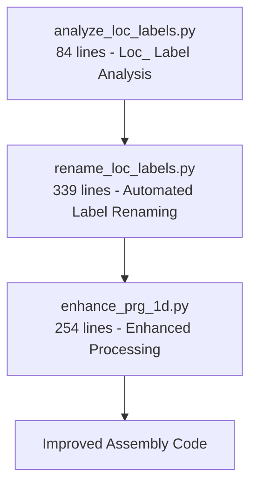

**Diagram sources**
- [tools/analyze_loc_labels.py:1-84](file://tools/analyze_loc_labels.py#L1-84)
- [tools/rename_loc_labels.py:1-339](file://tools/rename_loc_labels.py#L1-L339)
- [tools/enhance_prg_1d.py:1-254](file://tools/enhance_prg_1d.py#L1-L254)

### Stage-by-Stage Breakdown

#### Stage 1: Loc_ Label Analysis (analyze_loc_labels.py)
- **Procedure Grouping**: Automatically groups Loc_ labels by their containing .proc blocks
- **Context Display**: Shows 2 lines before, the label definition line, and 5 lines after for each label
- **Reference Tracking**: Counts and displays references to each label with sample reference locations
- **Bank 1E Equates**: Specifically highlights Bank 1E equate definitions for cross-bank reference analysis
- **Analysis Output**: Provides structured analysis report showing label usage patterns and relationships

#### Stage 2: Automated Label Renaming (rename_loc_labels.py)
- **Comprehensive Mapping**: Contains extensive mapping table of Loc_ addresses to meaningful names
- **Scope-Aware Naming**: Supports both @-prefixed local labels and module-level cross-procedure labels
- **Validation System**: Verifies that all Loc_ labels in the file are covered by the mapping table
- **Safe Replacement**: Uses word boundary matching to prevent partial replacements
- **Progress Reporting**: Provides detailed logging of replacement operations and completion status
- **Coverage Verification**: Ensures no Loc_ labels remain after processing

#### Stage 3: Enhanced Bank $1D Processing (enhance_prg_1d.py)
- **Enhanced Disassembly**: Generates improved Bank $1D assembly with better organization
- **Procedure Integration**: Adds .proc/.endproc blocks for entry-point procedures
- **Meaningful Names**: Applies descriptive procedure names instead of generic EntryXX labels
- **Jump Table Enhancement**: Improves jump table presentation with better comments and organization
- **Code Structure**: Provides enhanced code organization with proper section headers and comments

### Integration with Build System
The label analysis and renaming system integrates seamlessly with the Makefile build system:
- **New**: make analyze_loc_labels target executes the Loc_ label analysis workflow
- **New**: make rename_loc_labels target performs automated label replacement
- **New**: make enhance_prg_1d target generates enhanced Bank $1D assembly
- **New**: Direct tool execution: python3 tools/analyze_loc_labels.py
- **New**: Direct tool execution: python3 tools/rename_loc_labels.py
- **New**: Direct tool execution: python3 tools/enhance_prg_1d.py

The tools process the prg_1d_1e.asm file and provide detailed logging of their operations, including label counts, replacement statistics, and verification results.

**Section sources**
- [tools/analyze_loc_labels.py:1-84](file://tools/analyze_loc_labels.py#L1-84)
- [tools/rename_loc_labels.py:1-339](file://tools/rename_loc_labels.py#L1-L339)
- [tools/enhance_prg_1d.py:1-254](file://tools/enhance_prg_1d.py#L1-L254)

### Advanced Label Analysis Features
The analyze_loc_labels.py tool provides sophisticated analysis capabilities for understanding label usage patterns:

#### Procedure-Based Organization
- **Proc Boundary Detection**: Automatically identifies .proc/.endproc block boundaries
- **Label Association**: Associates each Loc_ label with its containing procedure
- **Contextual Analysis**: Provides surrounding code context for better understanding
- **Reference Tracking**: Monitors how labels are used within and across procedures

#### Comprehensive Context Display
- **Definition Context**: Shows 2 lines before and 5 lines after label definitions
- **Reference Examples**: Displays first few references to each label with line numbers
- **Summary Statistics**: Provides counts of definitions and references for each label
- **Cross-Procedure Analysis**: Identifies labels used across multiple procedures

#### Bank 1E Equate Analysis
- **Special Handling**: Specifically identifies and highlights Bank 1E equate definitions
- **Cross-Bank References**: Analyzes equates that bridge Bank $1D and Bank $1E
- **Importance Indicators**: Marks critical cross-bank dependencies

### Automated Label Renaming System
The rename_loc_labels.py tool provides comprehensive automated label replacement capabilities:

#### Extensive Mapping Database
- **Comprehensive Coverage**: Maps over 150 Loc_ labels to meaningful names
- **Context-Aware Naming**: Uses descriptive names based on function and usage context
- **Scope Management**: Supports both local (@) and global label scoping
- **Cross-Procedure Support**: Handles labels that span multiple procedures

#### Intelligent Replacement Process
- **Word Boundary Matching**: Prevents accidental partial replacements
- **Order Processing**: Sorts labels by length to avoid substitution conflicts
- **Validation System**: Verifies completeness of label coverage
- **Progress Tracking**: Reports replacement statistics and completion status

#### Safety and Verification
- **Pre-flight Checks**: Validates that all Loc_ labels are covered by mapping
- **Post-processing Verification**: Ensures no Loc_ labels remain after replacement
- **Backup Support**: Can operate in dry-run mode for safety
- **Error Reporting**: Provides detailed information about unmapped or extra labels

### Enhanced Bank $1D Processing
The enhance_prg_1d.py tool provides advanced processing for Bank $1D assembly code:

#### Enhanced Disassembly Features
- **Procedure Organization**: Automatically wraps entry-point procedures in .proc/.endproc blocks
- **Meaningful Naming**: Replaces generic EntryXX labels with descriptive names
- **Jump Table Enhancement**: Improves jump table presentation with better comments
- **Code Structure**: Provides better organization with section headers and comments

#### Integration with Label System
- **Label Compatibility**: Works seamlessly with renamed Loc_ labels
- **Procedure Boundaries**: Respects .proc/.endproc boundaries during processing
- **Cross-Reference Handling**: Maintains proper cross-procedure references
- **Output Quality**: Generates high-quality, well-organized assembly code

**Section sources**
- [tools/analyze_loc_labels.py:15-84](file://tools/analyze_loc_labels.py#L15-L84)
- [tools/rename_loc_labels.py:11-274](file://tools/rename_loc_labels.py#L11-L274)
- [tools/enhance_prg_1d.py:14-40](file://tools/enhance_prg_1d.py#L14-L40)

## PRG Bank $0C/$0D Callback System Analysis

### Overview
The PRG bank $0C/$0D callback system analysis tools provide specialized capabilities for analyzing and transforming the sophisticated callback mechanism used throughout the game's codebase. This system centers around two key patterns: BankedCallbackTrampoline ($EE07) for cross-bank function calls with inline target specifications, and CallbackDispatcher ($EADE) for variable-length callback tables with dynamic dispatching. The tools work together to analyze callback patterns, validate trampoline implementations, transform inline data structures, and verify directive accuracy.

### Callback System Architecture
The callback system implements a sophisticated cross-bank calling mechanism:

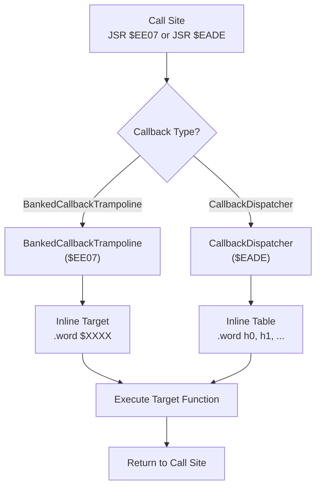

**Diagram sources**
- [tools/analyze_0c_0d_callbacks.py:1-257](file://tools/analyze_0c_0d_callbacks.py#L1-L257)
- [tools/check_trampoline_pattern.py:1-65](file://tools/check_trampoline_pattern.py#L1-L65)
- [tools/transform_0c_0d_inline.py:1-393](file://tools/transform_0c_0d_inline.py#L1-L393)

### Analysis Tools

#### analyze_0c_0d_callbacks.py - Callback Pattern Analysis Tool
- **Purpose**: Analyzes inline data following BankedCallbackTrampoline and CallbackDispatcher calls in bank 0C/0D
- **Trampoline Detection**: Finds all JSR $EE07 sites with exactly 1 inline .word target
- **Dispatcher Analysis**: Identifies JSR $EADE sites with variable-length .word tables
- **Context Analysis**: Examines calling context (LDA #imm, LDY #param) to determine table sizes
- **Disassembly Support**: Includes minimal 6502 disassembler for post-table instruction analysis
- **Pattern Recognition**: Supports both immediate value and memory-based index determination

#### check_trampoline_pattern.py - Trampoline Pattern Validation Tool
- **Purpose**: Validates the address list pattern following BankedCallbackTrampoline and CallbackDispatcher calls
- **Pattern Scanning**: Scans binary data for JSR $EE07 and JSR $EADE patterns
- **Address List Analysis**: Extracts and validates inline target addresses and table entries
- **Continuity Checking**: Verifies that address lists are continuous and properly terminated
- **Output Reporting**: Provides detailed reports of found patterns and their characteristics

### Transformation Tools

#### transform_0c_0d_inline.py - Inline Data Transformation Tool
- **Purpose**: Transforms prg_0c_0d.asm by converting .byte data regions following callback calls into proper .word directives + disassembled code
- **Pattern Recognition**: Identifies BankedCallbackTrampoline ($EE07) and CallbackDispatcher ($EADE) call sites
- **Data Region Detection**: Locates inline data regions marked with "; --- Data Region ---" comments
- **Directive Conversion**: Converts .byte sequences to proper .word directives with inline comments
- **Code Disassembly**: Disassembles remaining bytes after inline data into proper instructions
- **Known Function Integration**: Maps known function addresses to symbolic names using KNOWN_FUNCS table

#### fix_0c_0d_inline.py - Inline Data Fixing Tool
- **Purpose**: Fixes inline data following BankedCallbackTrampoline and CallbackDispatcher in prg_0c_0d.asm
- **Binary Analysis**: Scans binary data for callback patterns and inline data structures
- **Label Correlation**: Matches inline addresses with labeled addresses in assembly file
- **Table Size Determination**: Determines CallbackDispatcher table sizes by matching labeled addresses
- **Diagnostic Output**: Provides detailed analysis of callback patterns and table structures

### Verification Tools

#### verify_0c_0d_directives.py - Directive Verification Tool
- **Purpose**: Verifies that .word directives in prg_0c_0d.asm match the original binary
- **Directive Parsing**: Parses .word directives with address comments and inline byte sequences
- **Binary Comparison**: Compares directive values against original ROM binary data
- **Error Reporting**: Reports mismatches between directive values and actual binary content
- **Validation Output**: Provides comprehensive validation results with error counts

### Integration with Build System
The PRG bank $0C/$0D callback system analysis tools integrate with the build system through specialized Makefile targets:
- **New**: make analyze_callback_system: Analyzes BankedCallbackTrampoline and CallbackDispatcher patterns
- **New**: make check_trampoline_patterns: Validates trampoline patterns and inline data structures
- **New**: make transform_inline_data: Transforms inline .byte data to proper .word directives
- **New**: make fix_inline_data: Fixes inline data regions following callback calls
- **New**: make verify_0c_0d_directives: Verifies .word directives match original binary
- **Direct Tool Execution**: All tools can be executed directly with python3 for standalone analysis

### Callback Pattern Details

#### BankedCallbackTrampoline ($EE07)
- **Calling Convention**: LDY #bank_number; JSR $EE07; .word target_address
- **Inline Data**: Always exactly 1 .word (2 bytes) target specification
- **Functionality**: Cross-bank function calls with automatic bank switching
- **Stack Manipulation**: Saves/restores PRG bank state and manages return addresses
- **Example Usage**: `$A024: LDY #$3D; JSR $EE07; .word $A003`

#### CallbackDispatcher ($EADE)
- **Calling Convention**: LDA #index; LDY #param; JSR $EADE; .word h0, h1, ...
- **Inline Data**: Variable-length .word table (size determined by max index)
- **Functionality**: Dynamic dispatch to callback functions based on index parameter
- **Table Structure**: Sequential array of function pointers with automatic size calculation
- **Context Analysis**: Supports both immediate values and memory-based index determination

### Standalone Verification Configuration
The test_0c_0d.cfg file provides standalone verification support for the consolidated prg_0c_0d.asm module:
- **Memory Layout**: Defines ZEROPAGE, RAM, and PRG_SLOT1 memory regions
- **Segment Mapping**: Maps CODE_BANK0C segment to PRG_SLOT1 for testing
- **Standalone Testing**: Enables independent verification of callback system functionality

**Section sources**
- [tools/analyze_0c_0d_callbacks.py:1-257](file://tools/analyze_0c_0d_callbacks.py#L1-L257)
- [tools/check_trampoline_pattern.py:1-65](file://tools/check_trampoline_pattern.py#L1-L65)
- [tools/transform_0c_0d_inline.py:1-393](file://tools/transform_0c_0d_inline.py#L1-L393)
- [tools/fix_0c_0d_inline.py:1-226](file://tools/fix_0c_0d_inline.py#L1-L226)
- [tools/verify_0c_0d_directives.py:1-84](file://tools/verify_0c_0d_directives.py#L1-L84)
- [test_0c_0d.cfg:1-13](file://test_0c_0d.cfg#L1-L13)

## Dependency Analysis
The build system exhibits clear separation of concerns:
- Makefile orchestrates tool invocations and manages dependencies between assembly, linking, and ROM packaging.
- Python tools encapsulate domain-specific tasks (ROM parsing, disassembly, analysis, annotation, verification).
- **New**: Unified disassembly pipeline provides specialized tools for different ROM regions with cross-bank reference handling.
- **New**: Enhanced transformation pipeline provides sophisticated tools for PRG bank $17/$18 assembly code organization with comprehensive .proc/.endproc boundary analysis, automated parameter naming, and RAM centralization.
- **New**: RAM centralization tool provides systematic approach to standardizing $04xx memory region definitions with centralized global RAM definitions.
- **New**: ROM analysis and verification toolkit provides dedicated tools for byte-level ROM inspection and pattern matching, including specialized paired bank verification.
- **New**: Specialized disassembly pipeline for Bank $1D/$1E with multiple disassembler variants and combined assembly generation.
- **New**: Advanced label analysis and renaming system provides automated Loc_ label processing and meaningful name assignment.
- **New**: Comprehensive PRG banks $1D/$1E analysis suite provides specialized tools for RAM usage analysis, address validation, symbol conflict detection, ROM data extraction, automated data insertion, and global variable validation.
- **New**: Advanced paired bank disassembly tools provide sophisticated recursive descent algorithms for analyzing complex bank pairs with callback dispatchers and inline table detection, complemented by specialized verification tools for byte-exact accuracy validation.
- **New**: AI code modernization tools provide automated analysis and structural optimization for the AI turn dispatch system with intelligent branch instruction fixing, semantic renaming using Ai* convention, improved control flow with labeled targets, and enhanced nested procedure support.
- **New**: Specialized PRG bank $0C/$0D callback system analysis tools provide comprehensive analysis of BankedCallbackTrampoline and CallbackDispatcher patterns with inline data transformation capabilities and standalone verification support.
- **Updated**: Consolidated bank management reduces compilation overhead through unified bank modules like prg_0c_0d.asm while maintaining compatibility with individual bank files.
- Assembly sources depend on include headers for hardware and mapper definitions.
- Bank stubs and include files coordinate the assembly of multiple banks.
- **New**: Cross-dependencies between unified disassembly tools, enhanced transformation pipeline, RAM centralization tool, ROM analysis tools, automated parameter declaration system, Bank $1D/$1E disassembly pipeline, label analysis system, PRG banks $1D/$1E analysis suite, advanced paired bank disassembly tools, AI code modernization tools with modular Ai* architecture and enhanced nested procedure support, specialized verification tools for comprehensive ROM coverage, PRG bank $0C/$0D callback system analysis tools with standalone verification support, and consolidated bank management for reduced compilation overhead.

```mermaid
graph TB
MK["Makefile"] --> CA["ca65"]
MK --> LD["ld65"]
MK --> BN["build_nes.py"]
MK --> VR["verify_rom.py"]
MK --> SP["split_rom.py"]
MK --> DS["disasm_6502.py"]
MK --> DS1F["disasm_bank_1f.py"]
MK --> GS["generate_bank_stubs.py"]
MK --> AZ["analyze_rom.py"]
MK --> AN["annotate_asm.py"]
MK --> UD1["disasm_17_18.py"]
MK --> UD2["fix_disasm.py"]
MK --> UD3["gen_f667_ffff.py"]
MK --> UD4["update_jsr_labels.py"]
MK --> UD5["verify_f3bd_f667.py"]
MK --> UD6["verify_range.py"]
MK --> TP1["transform_17_18.py"]
MK --> TP2["add_procs.py"]
MK --> TP3["analyze_17_18.py"]
MK --> TP4["debug_regions.py"]
MK --> TP5["proc_scope_17_18.py"]
MK --> TP6["localize_labels.py"]
MK --> TP7["auto_add_local_params.py"]
MK --> TP8["globalize_04xx.py"]
MK --> B1D["disasm_1d.py"]
MK --> B1DE["disasm_1d_enhanced.py"]
MK --> B1DF["disasm_1d_final.py"]
MK --> B1E["disasm_1e.py"]
MK --> B1ED["disasm_1e_definitive.py"]
MK --> B1EF["disasm_1e_final.py"]
MK --> B1D1E["assemble_prg_1d_1e.py"]
MK --> APB1["disasm_0a_0b.py"]
MK --> APB2["disasm_prg.py"]
MK --> V0AB["verify_0a_0b.py"]
MK --> AI1["analyze_b49c.py"]
MK --> AI2["nest_b49c.py"]
MK --> LA1["analyze_loc_labels.py"]
MK --> LA2["rename_loc_labels.py"]
MK --> LA3["enhance_prg_1d.py"]
MK --> RA1["check_addresses.py"]
MK --> RA2["check_bank18.py"]
MK --> RA3["check_rom_offset.py"]
MK --> RA4["dump_chr_table.py"]
MK --> RA5["dump_correct_bytes.py"]
MK --> RA6["search_0530.py"]
MK --> RA7["search_chr_loader.py"]
MK --> RA8["search_chr_loader2.py"]
MK --> RA9["verify_disasm.py"]
MK --> RA10["analyze_1e.py"]
MK --> RA11["analyze_1e_deep.py"]
MK --> P1D1E1["analyze_ram_1d1e.py"]
MK --> P1D1E2["check_addrs.py"]
MK --> P1D1E3["check_conflicts.py"]
MK --> P1D1E4["dump_data_range.py"]
MK --> P1D1E5["mark_data_block.py"]
MK --> P1D1E6["verify_globals.py"]
MK --> CS1["analyze_0c_0d_callbacks.py"]
MK --> CS2["check_trampoline_pattern.py"]
MK --> CS3["transform_0c_0d_inline.py"]
MK --> CS4["fix_0c_0d_inline.py"]
MK --> CS5["verify_0c_0d_directives.py"]
M_main["asm/main.asm"] --> H_namco["include/namco163.h"]
M_main --> H_macros["include/macros.h"]
M_main --> H_functions["include/functions.h"]
M_main --> L_cfg["linker.cfg"]
AB["asm/banks/all_banks.asm"] --> M_main
ACD["asm/banks/prg_0c_0d.asm"] --> AB
UD1 --> UD2
UD2 --> UD3
UD3 --> UD4
UD4 --> UD5
UD5 --> UD6
TP1 --> TP2
TP2 --> TP3
TP3 --> TP4
TP4 --> TP5
TP5 --> TP6
TP6 --> TP7
TP7 --> TP8
TP8 --> Output["Enhanced Assembly Output"]
B1D --> B1DE
B1DE --> B1DF
B1E --> B1ED
B1ED --> B1EF
B1DF --> B1D1E
B1EF --> B1D1E
B1D1E --> Output
APB1 --> Output
APB2 --> Output
V0AB --> Output
AI1 --> AI2
AI2 --> Output
LA1 --> LA2
LA2 --> LA3
LA3 --> Output
RA1 --> RA2
RA2 --> RA3
RA3 --> RA4
RA4 --> RA5
RA5 --> RA6
RA6 --> RA7
RA7 --> RA8
RA8 --> RA9
RA9 --> RA10
RA10 --> RA11
P1D1E1 --> P1D1E2
P1D1E2 --> P1D1E3
P1D1E3 --> P1D1E4
P1D1E4 --> P1D1E5
P1D1E5 --> P1D1E6
P1D1E6 --> Output
CS1 --> CS2
CS2 --> CS3
CS3 --> CS4
CS4 --> CS5
CS5 --> Output
```

**Diagram sources**
- [Makefile:31-101](file://Makefile#L31-L101)
- [tools/build_nes.py:10-51](file://tools/build_nes.py#L10-L51)
- [tools/verify_rom.py:10-69](file://tools/verify_rom.py#L10-L69)
- [tools/split_rom.py:38-122](file://tools/split_rom.py#L38-L122)
- [tools/disasm_6502.py:286-362](file://tools/disasm_6502.py#L286-L362)
- [tools/disasm_bank_1f.py:329-442](file://tools/disasm_bank_1f.py#L329-L442)
- [tools/generate_bank_stubs.py:12-46](file://tools/generate_bank_stubs.py#L12-L46)
- [tools/analyze_rom.py:10-128](file://tools/analyze_rom.py#L10-L128)
- [tools/annotate_asm.py:315-478](file://tools/annotate_asm.py#L315-L478)
- [tools/disasm_17_18.py:1-710](file://tools/disasm_17_18.py#L1-L710)
- [tools/fix_disasm.py:1-56](file://tools/fix_disasm.py#L1-L56)
- [tools/gen_f667_ffff.py:1-396](file://tools/gen_f667_ffff.py#L1-L396)
- [tools/update_jsr_labels.py:1-137](file://tools/update_jsr_labels.py#L1-L137)
- [tools/verify_f3bd_f667.py:1-45](file://tools/verify_f3bd_f667.py#L1-L45)
- [tools/verify_range.py:1-42](file://tools/verify_range.py#L1-L42)
- [tools/transform_17_18.py:1-348](file://tools/transform_17_18.py#L1-L348)
- [tools/add_procs.py:1-189](file://tools/add_procs.py#L1-L189)
- [tools/analyze_17_18.py:1-118](file://tools/analyze_17_18.py#L1-L118)
- [tools/debug_regions.py:1-98](file://tools/debug_regions.py#L1-L98)
- [tools/proc_scope_17_18.py:1-813](file://tools/proc_scope_17_18.py#L1-L813)
- [tools/localize_labels.py:1-526](file://tools/localize_labels.py#L1-L526)
- [tools/auto_add_local_params.py:1-416](file://tools/auto_add_local_params.py#L1-L416)
- [tools/globalize_04xx.py:1-205](file://tools/globalize_04xx.py#L1-L205)
- [tools/disasm_1d.py:1-214](file://tools/disasm_1d.py#L1-L214)
- [tools/disasm_1d_enhanced.py:1-443](file://tools/disasm_1d_enhanced.py#L1-L443)
- [tools/disasm_1d_final.py:1-210](file://tools/disasm_1d_final.py#L1-L210)
- [tools/disasm_1e.py:1-512](file://tools/disasm_1e.py#L1-L512)
- [tools/disasm_1e_definitive.py:1-522](file://tools/disasm_1e_definitive.py#L1-L522)
- [tools/disasm_1e_final.py:1-494](file://tools/disasm_1e_final.py#L1-L494)
- [tools/assemble_prg_1d_1e.py:1-41](file://tools/assemble_prg_1d_1e.py#L1-L41)
- [tools/disasm_0a_0b.py:1-1258](file://tools/disasm_0a_0b.py#L1-L1258)
- [tools/disasm_prg.py:1-523](file://tools/disasm_prg.py#L1-L523)
- [tools/verify_0a_0b.py:1-28](file://tools/verify_0a_0b.py#L1-L28)
- [tools/analyze_b49c.py:1-281](file://tools/analyze_b49c.py#L1-L281)
- [tools/nest_b49c.py:1-149](file://tools/nest_b49c.py#L1-L149)
- [tools/analyze_loc_labels.py:1-84](file://tools/analyze_loc_labels.py#L1-L84)
- [tools/rename_loc_labels.py:1-339](file://tools/rename_loc_labels.py#L1-L339)
- [tools/enhance_prg_1d.py:1-254](file://tools/enhance_prg_1d.py#L1-L254)
- [tools/check_addresses.py:1-33](file://tools/check_addresses.py#L1-33)
- [tools/check_bank18.py:1-50](file://tools/check_bank18.py#L1-L50)
- [tools/check_rom_offset.py:1-43](file://tools/check_rom_offset.py#L1-L43)
- [tools/dump_chr_table.py:1-13](file://tools/dump_chr_table.py#L1-L13)
- [tools/dump_correct_bytes.py:1-35](file://tools/dump_correct_bytes.py#L1-L35)
- [tools/search_0530.py:1-23](file://tools/search_0530.py#L1-L23)
- [tools/search_chr_loader.py:1-15](file://tools/search_chr_loader.py#L1-L15)
- [tools/search_chr_loader2.py:1-21](file://tools/search_chr_loader2.py#L1-L21)
- [tools/verify_disasm.py:1-34](file://tools/verify_disasm.py#L1-L34)
- [tools/analyze_1e.py:1-36](file://tools/analyze_1e.py#L1-L36)
- [tools/analyze_1e_deep.py:1-53](file://tools/analyze_1e_deep.py#L1-L53)
- [tools/analyze_ram_1d1e.py:1-102](file://tools/analyze_ram_1d1e.py#L1-L102)
- [tools/check_addrs.py:1-56](file://tools/check_addrs.py#L1-L56)
- [tools/check_conflicts.py:1-42](file://tools/check_conflicts.py#L1-L42)
- [tools/dump_data_range.py:1-13](file://tools/dump_data_range.py#L1-L13)
- [tools/mark_data_block.py:1-56](file://tools/mark_data_block.py#L1-L56)
- [tools/verify_globals.py:1-105](file://tools/verify_globals.py#L1-L105)
- [tools/analyze_0c_0d_callbacks.py:1-257](file://tools/analyze_0c_0d_callbacks.py#L1-L257)
- [tools/check_trampoline_pattern.py:1-65](file://tools/check_trampoline_pattern.py#L1-L65)
- [tools/transform_0c_0d_inline.py:1-393](file://tools/transform_0c_0d_inline.py#L1-L393)
- [tools/fix_0c_0d_inline.py:1-226](file://tools/fix_0c_0d_inline.py#L1-L226)
- [tools/verify_0c_0d_directives.py:1-84](file://tools/verify_0c_0d_directives.py#L1-L84)

**Section sources**
- [Makefile:31-101](file://Makefile#L31-L101)
- [PROJECT.md:14-47](file://PROJECT.md#L14-L47)

## Performance Considerations
- Disassembly and annotation operate on 8KB banks; keep input binaries small and targeted for faster iteration.
- The verification step compares entire ROMs; ensure original and rebuilt files are present and sized correctly to avoid unnecessary overhead.
- Linker segmentation should be kept minimal until needed to reduce linking complexity and runtime.
- Enhanced disassembly tools provide more detailed output but may require additional processing time for complex bank analysis.
- **New**: Unified disassembly pipeline processes multiple ROM regions with sophisticated algorithms; expect significant processing time for large assembly files.
- **New**: Enhanced transformation pipeline applies multiple passes with detailed analysis and advanced boundary detection; expect substantial processing time for PRG bank $17/$18 assembly code.
- **New**: Automated parameter declaration tool processes entire .proc blocks with comprehensive address analysis; expect processing time proportional to code complexity and parameter count.
- **New**: RAM centralization tool processes entire assembly files with comprehensive alias detection and replacement; expect processing time proportional to code complexity and alias count.
- **New**: ROM analysis toolkit provides specialized tools for detailed byte-level inspection; expect processing time proportional to ROM size and search scope.
- **New**: Bank $1D/$1E disassembly pipeline provides multiple disassembler variants with different complexity levels; choose appropriate disassembler based on desired output quality and processing time.
- **New**: Label analysis and renaming system processes entire assembly files with comprehensive label scanning and replacement; expect processing time proportional to code size and label count.
- **New**: PRG banks $1D/$1E analysis suite provides comprehensive RAM usage analysis and validation; expect processing time proportional to code complexity and address count.
- **New**: Advanced paired bank disassembly tools implement sophisticated recursive descent algorithms; expect significant processing time for complex bank pairs with callback dispatchers.
- **New**: AI code modernization tools analyze complex AI turn dispatch system with modular Ai* architecture and improved nested procedure support; expect processing time proportional to code complexity and function nesting depth.
- **New**: Specialized verification tools like verify_0a_0b.py perform byte-exact comparisons of large ROM regions; expect processing time proportional to ROM size being validated.
- **New**: PRG bank $0C/$0D callback system analysis tools perform comprehensive binary scanning and pattern matching; expect processing time proportional to ROM size and callback pattern density.
- **New**: Inline data transformation tools process entire assembly files with binary correlation; expect processing time proportional to code size and inline data complexity.
- **Updated**: Consolidated bank management reduces compilation overhead by processing fewer compilation units; expect faster build times with prg_0c_0d.asm compared to separate prg_0c.asm and prg_0d.asm files.
- **New**: Each disassembly, transformation, analysis, and label processing stage provides detailed logging; use make targets with verbose output to monitor progress during long-running operations.
- **New**: Advanced .proc/.endproc organization with boundary analysis requires additional processing time but provides optimal code structure and maintainability.
- **New**: Localized label conversion adds another processing stage but significantly improves code readability and maintainability.
- **New**: Automated parameter declaration system requires comprehensive address analysis but provides systematic parameter naming improvements.
- **New**: RAM centralization system requires comprehensive alias detection and replacement but provides standardized memory definitions across the codebase.
- **New**: Pattern searching tools may require scanning entire ROM files; consider performance implications for large ROM images.
- **New**: Label replacement operations use word boundary matching which may require additional processing time but ensures safe replacements.
- **New**: RAM usage analysis tools scan entire assembly files for address patterns; expect processing time proportional to code size and RAM address frequency.
- **New**: Symbol conflict detection performs comprehensive symbol table analysis; expect processing time proportional to symbol count and scope complexity.
- **New**: Callback dispatcher detection in paired bank disassembly requires extensive analysis of inline tables and pointer validation; expect processing time proportional to code complexity and dispatcher usage.
- **New**: AI branch instruction fixing and semantic renaming with Ai* architecture requires comprehensive code analysis; expect processing time proportional to AI system complexity and modular function interactions.
- **New**: Nested procedure restructuring with modular architecture involves complex scope analysis and variable consolidation; expect processing time proportional to nesting depth and variable count.
- **New**: Byte-exact verification tools compare entire ROM regions; expect processing time proportional to the size of the ROM region being validated.
- **New**: Callback pattern analysis tools scan entire binary data for JSR patterns; expect processing time proportional to ROM size and callback pattern frequency.
- **New**: Inline data transformation requires binary correlation with assembly files; expect processing time proportional to code size and inline data complexity.

## Troubleshooting Guide
Common issues and resolutions:
- Missing toolchain: Ensure ca65 and ld65 are installed and on PATH. The Makefile expects them under ~/.local/bin/.
- Missing ROM assets: Run make split to generate rom/prg/ and rom/chr/ banks and rom_info.h.
- Bank stubs not included: Run make banks to generate asm/banks/*.asm and include all_banks.asm.
- Verification fails due to size mismatch: Confirm both ROMs are padded to the same size; build_nes.py pads PRG to 16KB pages.
- Disassembly address drift: Use annotate_asm.py with address hints in assembly comments to resynchronize.
- Linker errors: Update linker.cfg with new segments as banks are disassembled; ensure segments map to correct PRG slots.
- Enhanced disassembly output issues: Ensure proper base address mapping and inline comment formatting for accurate analysis.
- **New**: Unified disassembly pipeline failures: Check individual stage logs in the terminal output; each stage prints detailed progress and error information.
- **New**: Enhanced transformation pipeline failures: Check individual stage logs for transform_17_18.py, add_procs.py, analyze_17_18.py, debug_regions.py, proc_scope_17_18.py, localize_labels.py, auto_add_local_params.py, and globalize_04xx.py.
- **New**: Cross-bank reference issues: Verify that fix_disasm.py has been run to enhance disasm_17_18.py output.
- **New**: Address-to-symbol mapping failures: Ensure functions.h contains proper address-to-symbol mappings for $E000-$FFFF.
- **New**: Range verification failures: Check that verify_f3bd_f667.py and verify_range.py are run with correct file paths and address ranges.
- **New**: Semantic naming conflicts: Ensure transform_17_18.py runs before add_procs.py to avoid naming conflicts.
- **New**: .proc/.endproc boundary issues: Use proc_scope_17_18.py for advanced boundary analysis and optimization.
- **New**: Localized label conversion failures: Check that localize_labels.py runs after proc_scope_17_18.py to ensure proper label classification.
- **New**: Automated parameter declaration failures: Verify that auto_add_local_params.py runs after proc_scope_17_18.py to ensure proper parameter insertion.
- **New**: Parameter naming conflicts: Check that auto_add_local_params.py handles well-known address collisions properly.
- **New**: RAM centralization failures: Verify that globalize_04xx.py runs after proc_scope_17_18.py to ensure proper alias detection and replacement.
- **New**: Alias replacement issues: Check that globalize_04xx.py properly handles @-scoped and ::-scoped references.
- **New**: ROM analysis tool failures: Verify ROM files exist in rom/prg/ directory; check file permissions and sizes.
- **New**: Address verification issues: Ensure check_addresses.py uses correct ROM file paths and address mappings.
- **New**: Pattern search failures: Verify ROM files contain expected patterns; adjust search parameters if needed.
- **New**: Offset mapping errors: Check bank sizing assumptions (8KB per bank) and CPU address calculations.
- **New**: CHR loader identification problems: Use multiple search tools (search_chr_loader.py, search_chr_loader2.py) for comprehensive pattern detection.
- **New**: Bank $1D/$1E disassembly pipeline failures: Check individual disassembler logs and ensure proper file paths.
- **New**: Combined assembly generation failures: Verify that Bank $1D disassembly has been generated before running assemble_prg_1d_1e.py.
- **New**: Label analysis failures: Ensure prg_1d_1e.asm exists and contains proper .proc/.endproc blocks.
- **New**: Label renaming conflicts: Check that rename_loc_labels.py mapping table covers all Loc_ labels in the target file.
- **New**: Label replacement issues: Verify that rename_loc_labels.py uses word boundary matching to prevent partial replacements.
- **New**: Enhanced Bank $1D processing failures: Ensure proper input file format and path configuration.
- **New**: PRG banks $1D/$1E analysis suite failures: Verify prg_1d_1e.asm exists and contains proper assembly structure.
- **New**: RAM usage analysis failures: Check that analyze_ram_1d1e.py can parse .proc/.endproc blocks correctly.
- **New**: Address validation failures: Ensure check_addrs.py target addresses are valid and present in the assembly code.
- **New**: Symbol conflict detection failures: Verify that check_conflicts.py properly identifies symbol definitions and scope boundaries.
- **New**: ROM data extraction failures: Check that dump_data_range.py can access prg_1e.bin and specified address ranges.
- **New**: Automated data insertion failures: Verify that mark_data_block.py can locate data block boundaries and insert .byte directives correctly.
- **New**: Global variable validation failures: Ensure verify_globals.py properly identifies global definitions and usage patterns.
- **New**: Advanced paired bank disassembly failures: Verify ROM files exist for banks $0A/$0B and check callback dispatcher patterns.
- **New**: Recursive descent algorithm issues: Check that disasm_0a_0b.py can properly trace code execution and identify procedure boundaries.
- **New**: Callback dispatcher detection problems: Verify that known dispatcher addresses ($EADE, $EE07) are correctly configured.
- **New**: Inline table analysis failures: Check that pointer table boundaries are correctly calculated and validated.
- **New**: RAM aliasing issues: Verify that RAM address names are properly defined and don't conflict with existing definitions.
- **New**: Paired bank verification failures: Ensure verify_0a_0b.py can access both the original ROM and the test build output file.
- **New**: Test build configuration issues: Verify that link_0a_0b_test.cfg is properly configured for paired banks $0A/$0B.
- **New**: Byte-exact verification mismatches: Review detailed mismatch reports from verify_0a_0b.py to identify specific address discrepancies.
- **New**: AI code modernization failures: Verify that analyze_b49c.py and nest_b49c.py can access prg_0a_0b.asm and process AI turn dispatch code with modular Ai* architecture and enhanced nested procedure support correctly.
- **New**: Branch instruction fixing issues: Check that analyze_b49c.py properly identifies .byte branch instructions and generates correct mnemonics with improved control flow.
- **New**: Semantic renaming conflicts with Ai* architecture: Ensure that analyze_b49c.py rename mappings don't conflict with existing labels and follow Ai* prefix convention.
- **New**: Nested procedure restructuring failures with modular architecture: Verify that nest_b49c.py properly identifies procedure boundaries and variable definitions in modular Ai* functions with enhanced nested procedure support.
- **New**: AI variable consolidation issues: Check that nest_b49c.py correctly consolidates variables from nested procedures into unified scope with modular function support.
- **New**: AI global declaration removal problems: Verify that nest_b49c.py properly removes .global declarations for nested procedures with modular architecture awareness.
- **New**: PRG bank $0C/$0D callback system analysis failures: Verify ROM files exist for banks $0C/$0D and check callback pattern detection.
- **New**: Callback pattern analysis issues: Ensure analyze_0c_0d_callbacks.py can properly scan binary data for JSR $EE07 and JSR $EADE patterns.
- **New**: Trampoline pattern validation failures: Check that check_trampoline_pattern.py correctly identifies callback patterns and inline data structures.
- **New**: Inline data transformation problems: Verify that transform_0c_0d_inline.py can properly correlate assembly addresses with binary data.
- **New**: Inline data fixing issues: Ensure fix_0c_0d_inline.py correctly matches inline addresses with labeled addresses in assembly file.
- **New**: Directive verification failures: Check that verify_0c_0d_directives.py can properly parse .word directives and compare with binary data.
- **New**: Standalone verification configuration issues: Verify that test_0c_0d.cfg is properly configured for consolidated prg_0c_0d.asm module testing.
- **Updated**: Consolidated bank compilation issues: Verify that prg_0c_0d.asm is properly included in all_banks.asm and that CODE_BANK0C/CODE_BANK0D segments are correctly mapped in linker.cfg.
- **Updated**: Bank stub generation conflicts: Ensure generate_bank_stubs.py doesn't create duplicate files when consolidated modules exist.

Practical examples:
- Disassemble a specific bank region: make disasm FILE=rom/prg/prg_1f.bin ADDR=E000 LEN=256
- Analyze ROM structure: make analyze
- Verify rebuilt ROM: make verify
- **New**: Verify paired banks $0A/$0B: make verify_0a_0b
- **New**: Analyze callback system: make analyze_callback_system
- **New**: Check trampoline patterns: make check_trampoline_patterns
- **New**: Transform inline data: make transform_inline_data
- **New**: Fix inline data: make fix_inline_data
- **New**: Verify callback directives: make verify_0c_0d_directives
- **New**: Analyze AI turn dispatch with modular architecture: python3 tools/analyze_b49c.py
- **New**: Optimize AI structure with Ai* functions: python3 tools/nest_b49c.py
- **New**: Apply unified disassembly: make disasm_17_18
- **New**: Generate Bank $1F range disassembly: make gen_f667_ffff
- **New**: Update JSR labels: make update_jsr_labels
- **New**: Verify specific range: make verify_f3bd_f667
- **New**: Transform PRG bank $17/$18: make transform_17_18
- **New**: Add basic procedure scoping: make add_procs
- **New**: Analyze boundaries: make analyze_17_18
- **New**: Debug regions: make debug_regions
- **New**: Enhanced .proc/.endproc organization: make proc_scope_17_18
- **New**: Localized label conversion: make localize_labels
- **New**: Automated parameter declaration: make auto_add_local_params
- **New**: RAM centralization: make globalize_04xx
- **New**: Analyze Loc_ labels: make analyze_loc_labels
- **New**: Rename Loc_ labels: make rename_loc_labels
- **New**: Enhanced Bank $1D processing: make enhance_prg_1d
- **New**: RAM usage analysis: make analyze_ram_1d1e
- **New**: Address validation: make check_addrs
- **New**: Symbol conflict detection: make check_conflicts
- **New**: ROM data extraction: make dump_data_range
- **New**: Automated data insertion: make mark_data_block
- **New**: Global variable validation: make verify_globals
- **New**: Advanced paired bank disassembly: python3 tools/disasm_0a_0b.py
- **New**: General-purpose PRG disassembly: python3 tools/disasm_prg.py 0x1D 0x1E --output output/prg_1d_1e_raw.asm
- **New**: Paired bank verification: python3 tools/verify_0a_0b.py
- **New**: Transform specific stage: python3 tools/transform_17_18.py, python3 tools/add_procs.py, etc.
- **New**: Advanced boundary analysis: python3 tools/proc_scope_17_18.py
- **New**: Localized label conversion: python3 tools/localize_labels.py
- **New**: Automated parameter declaration: python3 tools/auto_add_local_params.py
- **New**: RAM centralization: python3 tools/globalize_04xx.py
- **New**: Label analysis: python3 tools/analyze_loc_labels.py
- **New**: Label renaming: python3 tools/rename_loc_labels.py
- **New**: Enhanced processing: python3 tools/enhance_prg_1d.py
- **New**: Address verification: make check_addresses
- **New**: Bank validation: make check_bank18
- **New**: Offset mapping: make check_rom_offset
- **New**: CHR table inspection: make dump_chr_table
- **New**: Correct bytes verification: make dump_correct_bytes
- **New**: $0530 pattern search: make search_0530
- **New**: CHR loader pattern search: make search_chr_loader
- **New**: Specific CHR loader search: make search_chr_loader2
- **New**: Comprehensive disassembly verification: make verify_disasm
- **New**: Bank $1E structure analysis: make analyze_1e
- **New**: Deep Bank $1E analysis: make analyze_1e_deep
- **New**: Direct tool execution: python3 tools/check_addresses.py, python3 tools/check_bank18.py, etc.
- **New**: RAM centralization: python3 tools/globalize_04xx.py --input asm/banks/prg_17_18.asm --output asm/banks/prg_17_18_globalized.asm
- **New**: Bank $1D disassembly: make disasm_1d
- **New**: Enhanced Bank $1D disassembly: make disasm_1d_enhanced
- **New**: Final Bank $1D assembly: make disasm_1d_final
- **New**: Bank $1E disassembly: make disasm_1e
- **New**: Definitive Bank $1E disassembly: make disasm_1e_definitive
- **New**: Final Bank $1E assembly: make disasm_1e_final
- **New**: Combined Bank $1D/$1E assembly: make assemble_prg_1d_1e
- **New**: Generate enhanced Bank 0x1F disassembly: python3 tools/disasm_bank_1f.py rom/prg/prg_1f.bin
- **New**: Clean build artifacts: make clean
- **New**: Clean and remove ROM dumps: make distclean
- **New**: RAM usage analysis: python3 tools/analyze_ram_1d1e.py
- **New**: Address validation: python3 tools/check_addrs.py
- **New**: Symbol conflict detection: python3 tools/check_conflicts.py
- **New**: ROM data extraction: python3 tools/dump_data_range.py
- **New**: Automated data insertion: python3 tools/mark_data_block.py
- **New**: Global variable validation: python3 tools/verify_globals.py
- **New**: Advanced paired bank disassembly: python3 tools/disasm_0a_0b.py
- **New**: General-purpose PRG disassembly: python3 tools/disasm_prg.py 0x1D 0x1E --output output/prg_1d_1e_raw.asm
- **New**: Paired bank verification: python3 tools/verify_0a_0b.py
- **New**: Transform specific stage: python3 tools/transform_17_18.py, python3 tools/add_procs.py, etc.
- **New**: Advanced boundary analysis: python3 tools/proc_scope_17_18.py
- **New**: Localized label conversion: python3 tools/localize_labels.py
- **New**: Automated parameter declaration: python3 tools/auto_add_local_params.py
- **New**: RAM centralization: python3 tools/globalize_04xx.py
- **New**: Label analysis: python3 tools/analyze_loc_labels.py
- **New**: Label renaming: python3 tools/rename_loc_labels.py
- **New**: Enhanced processing: python3 tools/enhance_prg_1d.py
- **New**: Address verification: make check_addresses
- **New**: Bank validation: make check_bank18
- **New**: Offset mapping: make check_rom_offset
- **New**: CHR table inspection: make dump_chr_table
- **New**: Correct bytes verification: make dump_correct_bytes
- **New**: $0530 pattern search: make search_0530
- **New**: CHR loader pattern search: make search_chr_loader
- **New**: Specific CHR loader search: make search_chr_loader2
- **New**: Comprehensive disassembly verification: make verify_disasm
- **New**: Bank $1E structure analysis: make analyze_1e
- **New**: Deep Bank $1E analysis: make analyze_1e_deep
- **New**: Direct tool execution: python3 tools/check_addresses.py, python3 tools/check_bank18.py, etc.
- **New**: RAM centralization: python3 tools/globalize_04xx.py --input asm/banks/prg_17_18.asm --output asm/banks/prg_17_18_globalized.asm
- **New**: Bank $1D disassembly: make disasm_1d
- **New**: Enhanced Bank $1D disassembly: make disasm_1d_enhanced
- **New**: Final Bank $1D assembly: make disasm_1d_final
- **New**: Bank $1E disassembly: make disasm_1e
- **New**: Definitive Bank $1E disassembly: make disasm_1e_definitive
- **New**: Final Bank $1E assembly: make disasm_1e_final
- **New**: Combined Bank $1D/$1E assembly: make assemble_prg_1d_1e
- **New**: Generate enhanced Bank 0x1F disassembly: python3 tools/disasm_bank_1f.py rom/prg/prg_1f.bin
- **New**: Clean build artifacts: make clean
- **New**: Clean and remove ROM dumps: make distclean
- **New**: RAM usage analysis: python3 tools/analyze_ram_1d1e.py
- **New**: Address validation: python3 tools/check_addrs.py
- **New**: Symbol conflict detection: python3 tools/check_conflicts.py
- **New**: ROM data extraction: python3 tools/dump_data_range.py
- **New**: Automated data insertion: python3 tools/mark_data_block.py
- **New**: Global variable validation: python3 tools/verify_globals.py
- **New**: Callback system analysis: python3 tools/analyze_0c_0d_callbacks.py
- **New**: Trampoline pattern validation: python3 tools/check_trampoline_pattern.py
- **New**: Inline data transformation: python3 tools/transform_0c_0d_inline.py
- **New**: Inline data fixing: python3 tools/fix_0c_0d_inline.py
- **New**: Directive verification: python3 tools/verify_0c_0d_directives.py
- **New**: Standalone verification config: python3 tools/test_0c_0d.cfg

**Section sources**
- [Makefile:51-101](file://Makefile#L51-L101)
- [tools/verify_rom.py:22-51](file://tools/verify_rom.py#L22-L51)
- [tools/annotate_asm.py:357-404](file://tools/annotate_asm.py#L357-404)
- [tools/split_rom.py:124-139](file://tools/split_rom.py#L124-L139)
- [tools/verify_0a_0b.py:1-28](file://tools/verify_0a_0b.py#L1-L28)
- [tools/analyze_b49c.py:1-281](file://tools/analyze_b49c.py#L1-L281)
- [tools/nest_b49c.py:1-149](file://tools/nest_b49c.py#L1-L149)
- [tools/analyze_0c_0d_callbacks.py:1-257](file://tools/analyze_0c_0d_callbacks.py#L1-L257)
- [tools/check_trampoline_pattern.py:1-65](file://tools/check_trampoline_pattern.py#L1-L65)
- [tools/transform_0c_0d_inline.py:1-393](file://tools/transform_0c_0d_inline.py#L1-L393)
- [tools/fix_0c_0d_inline.py:1-226](file://tools/fix_0c_0d_inline.py#L1-L226)
- [tools/verify_0c_0d_directives.py:1-84](file://tools/verify_0c_0d_directives.py#L1-L84)

## Conclusion
The Sango2Dasm build system integrates cc65 assembly/linking with a robust set of Python tools to support ROM disassembly, analysis, annotation, and verification. The recent addition of the comprehensive unified disassembly pipeline provides unprecedented automation for different ROM regions, featuring six specialized tools that work together to provide cross-bank reference handling, address-to-symbol mapping, and region-specific disassembly capabilities. The newly enhanced transformation pipeline extends this automation to PRG bank $17/$18 assembly code with sophisticated semantic naming conventions, comprehensive .proc/.endproc organization, advanced boundary analysis capabilities, and the new automated parameter declaration system. The latest additions include proc_scope_17_18.py for enhanced .proc/.endproc organization, localize_labels.py for converting branch-only labels to @local format, auto_add_local_params.py for systematic parameter naming in assembly code, and globalize_04xx.py for centralized RAM definition standardization, significantly improving code readability and maintainability. The newly integrated ROM analysis and verification toolkit provides dedicated tools for detailed byte-level ROM inspection, pattern matching, and cross-referencing, enabling comprehensive ROM reconstruction and validation workflows. The most recent enhancement introduces the advanced label analysis and renaming system with analyze_loc_labels.py, rename_loc_labels.py, and enhance_prg_1d.py, providing automated Loc_ label processing and meaningful name assignment for improved code organization. The newest addition is the comprehensive PRG banks $1D/$1E analysis suite with analyze_ram_1d1e.py, check_addrs.py, check_conflicts.py, dump_data_range.py, mark_data_block.py, and verify_globals.py, providing specialized tools for RAM usage analysis, address validation, symbol conflict detection, ROM data extraction, automated data insertion, and global variable validation. **New**: The advanced paired bank disassembly system with disasm_0a_0b.py and disasm_prg.py provides sophisticated recursive descent algorithms for analyzing complex bank pairs with callback dispatchers and inline table detection, complemented by the specialized verify_0a_0b.py verification tool that ensures byte-exact accuracy validation for paired banks $0A/$0B. **New**: The AI code modernization tools with analyze_b49c.py and nest_b49c.py provide automated analysis and structural optimization for the AI turn dispatch system with new modular Ai* architecture, enhanced nested procedure support, intelligent branch instruction fixing, semantic renaming using Ai* prefix convention, improved control flow with labeled targets replacing raw address jumps, and nested procedure restructuring capabilities. **New**: The specialized PRG bank $0C/$0D callback system analysis tools with analyze_0c_0d_callbacks.py, check_trampoline_pattern.py, transform_0c_0d_inline.py, fix_0c_0d_inline.py, and verify_0c_0d_directives.py provide comprehensive analysis of BankedCallbackTrampoline and CallbackDispatcher patterns with inline data transformation capabilities and standalone verification support through test_0c_0d.cfg configuration. **Updated**: The bank stub generation and assembly process now supports consolidated bank modules like prg_0c_0d.asm, reducing compilation overhead through unified bank management while maintaining full compatibility with existing individual bank files. The Makefile provides a unified interface to orchestrate the complete pipeline, while tools like split_rom.py, disasm_6502.py, disasm_bank_1f.py, the unified disassembly tools, the enhanced transformation pipeline tools, the RAM centralization tool, the ROM analysis toolkit, the label analysis system, the PRG banks $1D/$1E analysis suite, the advanced paired bank disassembly tools, the AI code modernization tools with modular Ai* architecture and enhanced nested procedure support, the specialized PRG bank $0C/$0D callback system analysis tools with standalone verification support, the specialized verification tools for byte-exact accuracy validation, and the consolidated bank management system enable comprehensive ROM reconstruction and validation. By following the documented targets and procedures, developers can efficiently reconstruct and validate the ROM while maintaining byte-exact fidelity and ensuring clean, maintainable assembly code with proper cross-bank reference handling, semantic naming conventions, optimized .proc/.endproc organization, systematic parameter naming, centralized RAM definitions, comprehensive ROM analysis capabilities, automated label management, specialized PRG banks $1D/$1E analysis tools, advanced paired bank disassembly capabilities, AI code modernization features with modular Ai* architecture and enhanced nested procedure support, improved control flow with labeled targets, specialized PRG bank $0C/$0D callback system analysis with standalone verification support, specialized verification tools for byte-exact accuracy validation, and consolidated bank management for reduced compilation overhead, significantly improving code readability, maintainability, and build performance.

## Appendices

### Practical Workflows
- Initial setup: make split, make banks
- Enhanced disassembly: make disasm, tools/disasm_bank_1f.py, tools/annotate_asm.py
- **New**: Unified disassembly: make disasm_17_18, make gen_f667_ffff, make update_jsr_labels
- **New**: Range verification: make verify_f3bd_f667, make verify_range
- **New**: Enhanced transformation pipeline: make transform_17_18, make add_procs, make analyze_17_18, make debug_regions, make proc_scope_17_18, make localize_labels, make auto_add_local_params
- **New**: RAM centralization workflow: make globalize_04xx
- **New**: ROM analysis workflow: make check_addresses, make check_bank18, make check_rom_offset, make dump_chr_table, make dump_correct_bytes, make search_0530, make search_chr_loader, make search_chr_loader2, make verify_disasm, make analyze_1e, make analyze_1e_deep
- **New**: Paired bank verification workflow: make verify_0a_0b
- **New**: AI code modernization workflow with modular Ai* architecture and enhanced nested procedure support: python3 tools/analyze_b49c.py, python3 tools/nest_b49c.py
- **New**: Bank $1D/$1E disassembly workflow: make disasm_1d, make disasm_1d_enhanced, make disasm_1d_final, make disasm_1e, make disasm_1e_definitive, make disasm_1e_final, make assemble_prg_1d_1e
- **New**: Advanced paired bank disassembly workflow: python3 tools/disasm_0a_0b.py, python3 tools/disasm_prg.py 0x1D 0x1E --output output/prg_1d_1e_raw.asm, python3 tools/verify_0a_0b.py
- **New**: Label analysis and renaming workflow: make analyze_loc_labels, make rename_loc_labels, make enhance_prg_1d
- **New**: PRG banks $1D/$1E analysis workflow: make analyze_ram_1d1e, make check_addrs, make check_conflicts, make dump_data_range, make mark_data_block, make verify_globals
- **New**: PRG bank $0C/$0D callback system analysis workflow: make analyze_callback_system, make check_trampoline_patterns, make transform_inline_data, make fix_inline_data, make verify_0c_0d_directives
- **Updated**: Consolidated bank workflow: make banks (generates both individual and consolidated bank files), make (uses prg_0c_0d.asm for reduced compilation overhead)
- Iterative assembly: make, make verify
- Cleanup: make clean, make distclean

### Example Commands
- make disasm FILE=rom/prg/prg_1f.bin ADDR=E000 LEN=1024
- make analyze
- make verify
- **New**: make verify_0a_0b
- **New**: make analyze_callback_system
- **New**: make check_trampoline_patterns
- **New**: make transform_inline_data
- **New**: make fix_inline_data
- **New**: make verify_0c_0d_directives
- **New**: python3 tools/analyze_b49c.py
- **New**: python3 tools/nest_b49c.py
- **New**: make disasm_17_18
- **New**: make gen_f667_ffff
- **New**: make update_jsr_labels
- **New**: make verify_f3bd_f667
- **New**: make verify_range
- **New**: make transform_17_18
- **New**: make add_procs
- **New**: make analyze_17_18
- **New**: make debug_regions
- **New**: make proc_scope_17_18
- **New**: make localize_labels
- **New**: make auto_add_local_params
- **New**: make globalize_04xx
- **New**: make analyze_loc_labels
- **New**: make rename_loc_labels
- **New**: make enhance_prg_1d
- **New**: make analyze_ram_1d1e
- **New**: make check_addrs
- **New**: make check_conflicts
- **New**: make dump_data_range
- **New**: make mark_data_block
- **New**: make verify_globals
- **New**: make check_addresses
- **New**: make check_bank18
- **New**: make check_rom_offset
- **New**: make dump_chr_table
- **New**: make dump_correct_bytes
- **New**: make search_0530
- **New**: make search_chr_loader
- **New**: make search_chr_loader2
- **New**: make verify_disasm
- **New**: make analyze_1e
- **New**: make analyze_1e_deep
- **New**: python3 tools/transform_17_18.py
- **New**: python3 tools/add_procs.py
- **New**: python3 tools/analyze_17_18.py
- **New**: python3 tools/debug_regions.py
- **New**: python3 tools/proc_scope_17_18.py
- **New**: python3 tools/localize_labels.py
- **New**: python3 tools/auto_add_local_params.py
- **New**: python3 tools/globalize_04xx.py
- **New**: python3 tools/analyze_loc_labels.py
- **New**: python3 tools/rename_loc_labels.py
- **New**: python3 tools/enhance_prg_1d.py
- **New**: python3 tools/analyze_ram_1d1e.py
- **New**: python3 tools/check_addrs.py
- **New**: python3 tools/check_conflicts.py
- **New**: python3 tools/dump_data_range.py
- **New**: python3 tools/mark_data_block.py
- **New**: python3 tools/verify_globals.py
- **New**: python3 tools/check_addresses.py
- **New**: python3 tools/check_bank18.py
- **New**: python3 tools/check_rom_offset.py
- **New**: python3 tools/dump_chr_table.py
- **New**: python3 tools/dump_correct_bytes.py
- **New**: python3 tools/search_0530.py
- **New**: python3 tools/search_chr_loader.py
- **New**: python3 tools/search_chr_loader2.py
- **New**: python3 tools/verify_disasm.py
- **New**: python3 tools/analyze_1e.py
- **New**: python3 tools/analyze_1e_deep.py
- **New**: python3 tools/transform_17_18.py --dry-run
- **New**: python3 tools/proc_scope_17_18.py --dry-run
- **New**: python3 tools/localize_labels.py --dry-run
- **New**: python3 tools/auto_add_local_params.py --input asm/banks/prg_17_18.asm --output asm/banks/prg_17_18_auto.asm
- **New**: python3 tools/globalize_04xx.py --input asm/banks/prg_17_18.asm --output asm/banks/prg_17_18_globalized.asm
- **New**: python3 tools/analyze_loc_labels.py
- **New**: python3 tools/rename_loc_labels.py
- **New**: python3 tools/enhance_prg_1d.py
- **New**: python3 tools/analyze_ram_1d1e.py
- **New**: python3 tools/check_addrs.py
- **New**: python3 tools/check_conflicts.py
- **New**: python3 tools/dump_data_range.py
- **New**: python3 tools/mark_data_block.py
- **New**: python3 tools/verify_globals.py
- **New**: python3 tools/add_procs.py
- **New**: python3 tools/analyze_17_18.py
- **New**: python3 tools/debug_regions.py
- **New**: python3 tools/proc_scope_17_18.py
- **New**: python3 tools/localize_labels.py
- **New**: python3 tools/auto_add_local_params.py
- **New**: python3 tools/globalize_04xx.py
- **New**: python3 tools/check_addresses.py --address $A8D3
- **New**: python3 tools/check_bank18.py --offset $08D3
- **New**: python3 tools/check_rom_offset.py --cpu $A8D3
- **New**: python3 tools/dump_chr_table.py --range 256
- **New**: python3 tools/dump_correct_bytes.py --start $08D3 --end $0988
- **New**: python3 tools/search_0530.py --pattern 8D3005
- **New**: python3 tools/search_chr_loader.py --pattern A8B9
- **New**: python3 tools/search_chr_loader2.py --pattern A8B98D3005B98D3105
- **New**: python3 tools/verify_disasm.py --addresses A8D3,A8D5,A8FD,A8FE,A901
- **New**: python3 tools/analyze_1e.py --pattern C934
- **New**: python3 tools/analyze_1e_deep.py --region DF10,DF90
- **New**: python3 tools/disasm_bank_1f.py rom/prg/prg_1f.bin
- **New**: python3 tools/disasm_1d.py rom/prg/prg_1d.bin
- **New**: python3 tools/disasm_1d_enhanced.py
- **New**: python3 tools/disasm_1d_final.py
- **New**: python3 tools/disasm_1e.py rom/prg/prg_1e.bin
- **New**: python3 tools/disasm_1e_definitive.py
- **New**: python3 tools/disasm_1e_final.py
- **New**: python3 tools/assemble_prg_1d_1e.py
- **New**: python3 tools/disasm_bank_1f.py rom/prg/prg_1f.bin
- **New**: python3 tools/annotate_asm.py --in-place --verify
- **New**: python3 tools/disasm_bank_1f.py rom/prg/prg_1f.bin
- **New**: python3 tools/annotate_asm.py --in-place --verify
- **New**: python3 tools/disasm_bank_1f.py rom/prg/prg_1f.bin
- **New**: python3 tools/annotate_asm.py --in-place --verify
- **New**: python3 tools/disasm_0a_0b.py
- **New**: python3 tools/disasm_prg.py 0x1D 0x1E --output output/prg_1d_1e_raw.asm
- **New**: python3 tools/disasm_prg.py 0x0A 0x0B --output output/prg_0a_0b_raw.asm
- **New**: python3 tools/verify_0a_0b.py
- **New**: python3 tools/disasm_bank_1f.py rom/prg/prg_1f.bin
- **New**: python3 tools/annotate_asm.py --in-place --verify
- **New**: python3 tools/disasm_bank_1f.py rom/prg/prg_1f.bin
- **New**: python3 tools/annotate_asm.py --in-place --verify
- **New**: python3 tools/analyze_b49c.py
- **New**: python3 tools/nest_b49c.py
- **New**: python3 tools/disasm_bank_1f.py rom/prg/prg_1f.bin
- **New**: python3 tools/annotate_asm.py --in-place --verify
- **New**: python3 tools/disasm_bank_1f.py rom/prg/prg_1f.bin
- **New**: python3 tools/annotate_asm.py --in-place --verify
- **New**: python3 tools/analyze_0c_0d_callbacks.py
- **New**: python3 tools/check_trampoline_pattern.py
- **New**: python3 tools/transform_0c_0d_inline.py
- **New**: python3 tools/fix_0c_0d_inline.py
- **New**: python3 tools/verify_0c_0d_directives.py
- **New**: python3 tools/disasm_bank_1f.py rom/prg/prg_1f.bin
- **New**: python3 tools/annotate_asm.py --in-place --verify
- **New**: python3 tools/disasm_bank_1f.py rom/prg/prg_1f.bin
- **New**: python3 tools/annotate_asm.py --in-place --verify