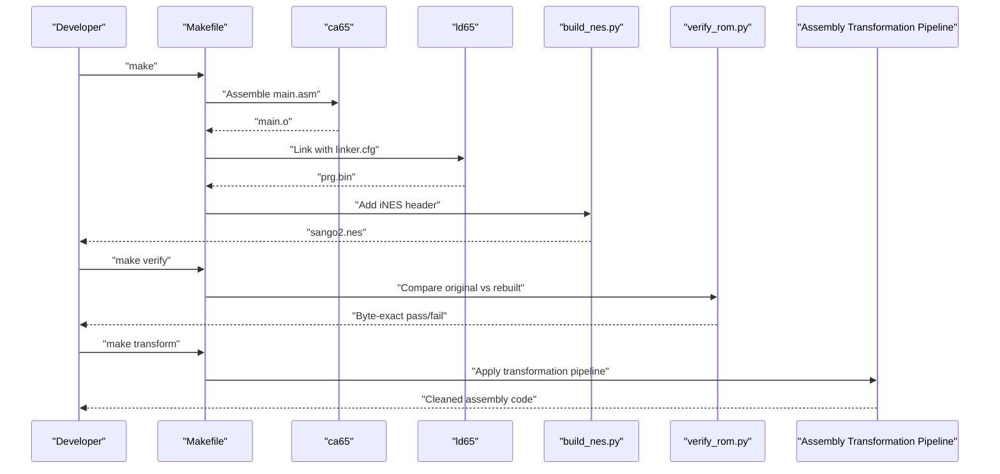
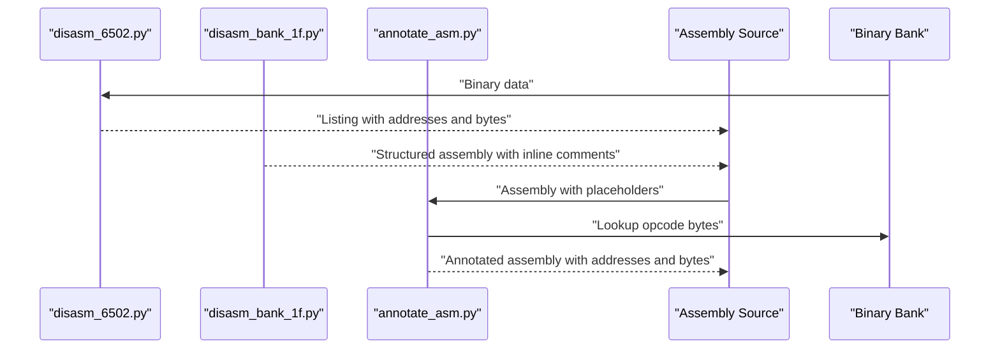
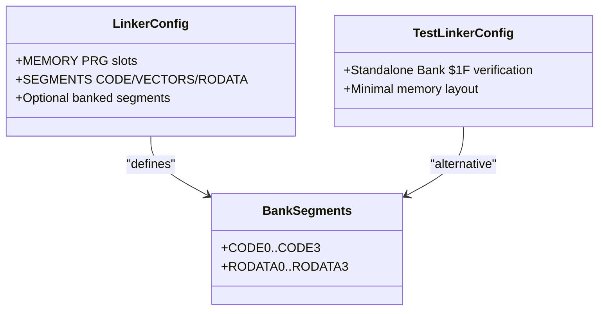
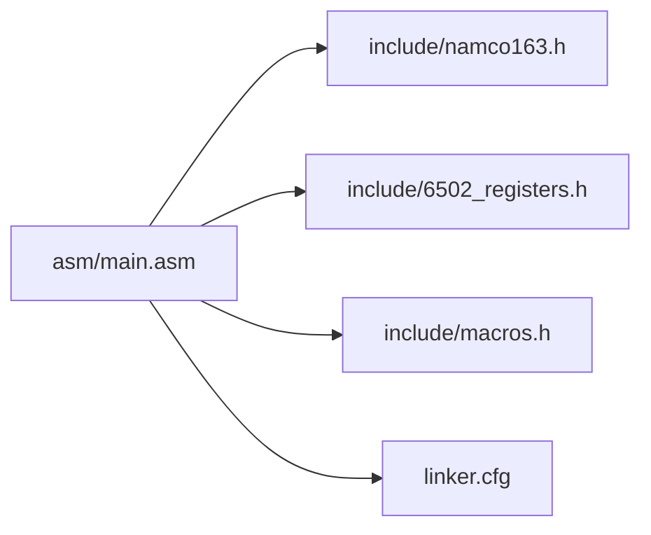
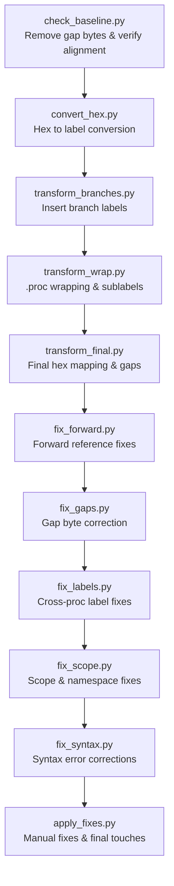
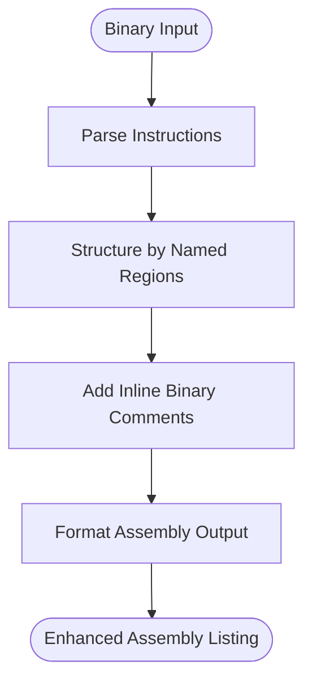
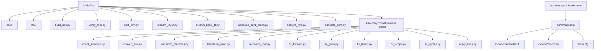

# Build System and Tools

<cite>
**Referenced Files in This Document**
- [Makefile](file://Makefile)
- [PROJECT.md](file://PROJECT.md)
- [linker.cfg](file://linker.cfg)
- [test_linker.cfg](file://test_linker.cfg)
- [check_baseline.py](file://check_baseline.py)
- [convert_hex.py](file://convert_hex.py)
- [transform_branches.py](file://transform_branches.py)
- [transform_wrap.py](file://transform_wrap.py)
- [transform_final.py](file://transform_final.py)
- [fix_forward.py](file://fix_forward.py)
- [fix_gaps.py](file://fix_gaps.py)
- [fix_labels.py](file://fix_labels.py)
- [fix_scope.py](file://fix_scope.py)
- [fix_syntax.py](file://fix_syntax.py)
- [apply_fixes.py](file://apply_fixes.py)
- [tools/build_nes.py](file://tools/build_nes.py)
- [tools/verify_rom.py](file://tools/verify_rom.py)
- [tools/split_rom.py](file://tools/split_rom.py)
- [tools/disasm_6502.py](file://tools/disasm_6502.py)
- [tools/disasm_bank_1f.py](file://tools/disasm_bank_1f.py)
- [tools/generate_bank_stubs.py](file://tools/generate_bank_stubs.py)
- [tools/analyze_rom.py](file://tools/analyze_rom.py)
- [tools/annotate_asm.py](file://tools/annotate_asm.py)
- [asm/main.asm](file://asm/main.asm)
- [include/namco163.h](file://include/namco163.h)
- [include/macros.h](file://include/macros.h)
- [asm/banks/all_banks.asm](file://asm/banks/all_banks.asm)
</cite>

## Update Summary
**Changes Made**
- Added comprehensive documentation for the new assembly transformation pipeline including automated cleanup and validation tools
- Documented the complete 7-stage transformation workflow for Bank $1F assembly code
- Updated linker configuration documentation to reflect test_linker.cfg for standalone verification
- Enhanced disassembly tool documentation to include the new transformation pipeline integration
- Added detailed coverage of assembly code cleanup, address-to-label conversion, and final validation processes

## Table of Contents
1. [Introduction](#introduction)
2. [Project Structure](#project-structure)
3. [Core Components](#core-components)
4. [Architecture Overview](#architecture-overview)
5. [Detailed Component Analysis](#detailed-component-analysis)
6. [Assembly Transformation Pipeline](#assembly-transformation-pipeline)
7. [Enhanced Disassembly Tools](#enhanced-disassembly-tools)
8. [Dependency Analysis](#dependency-analysis)
9. [Performance Considerations](#performance-considerations)
10. [Troubleshooting Guide](#troubleshooting-guide)
11. [Conclusion](#conclusion)
12. [Appendices](#appendices)

## Introduction
This document explains the complete build system and automated workflows for the Sango2Dasm project. It covers the Makefile targets, the ROM generation pipeline from assembly through linking to the final NES ROM with proper iNES headers, the verification system that ensures byte-exact rebuilds, and the enhanced annotation tools used to document and validate disassembly. The project now features a comprehensive assembly transformation pipeline that provides automated cleanup, address-to-label conversion, branch optimization, and final validation for Bank $1F assembly code.

## Project Structure
The project is organized around a Makefile-driven build system, a cc65-based assembler/linker toolchain, and a suite of Python tools for ROM splitting, disassembly, analysis, annotation, verification, and assembly transformation. The structure supports:
- Assembly sources under asm/, with bank stubs under asm/banks/
- Include headers under include/ defining hardware registers and mapper macros
- ROM assets under rom/ (split PRG/CHR banks and combined PRG)
- Build outputs under build/
- Automated tools under tools/
- **New**: Assembly transformation pipeline under root directory for Bank $1F code cleanup

```mermaid
graph TB
subgraph "Source"
A_main["asm/main.asm"]
A_banks["asm/banks/*.asm"]
H_regs["include/6502_registers.h"]
H_namco["include/namco163.h"]
H_macros["include/macros.h"]
end
subgraph "Build"
MK["Makefile"]
CFG["linker.cfg"]
TEST_CFG["test_linker.cfg"]
OUT["build/"]
end
subgraph "Transformation Pipeline"
TP1["check_baseline.py"]
TP2["convert_hex.py"]
TP3["transform_branches.py"]
TP4["transform_wrap.py"]
TP5["transform_final.py"]
TP6["fix_forward.py"]
TP7["fix_gaps.py"]
TP8["fix_labels.py"]
TP9["fix_scope.py"]
TP10["fix_syntax.py"]
TP11["apply_fixes.py"]
end
subgraph "Tools"
T_build["tools/build_nes.py"]
T_verify["tools/verify_rom.py"]
T_split["tools/split_rom.py"]
T_disasm["tools/disasm_6502.py"]
T_disasm1f["tools/disasm_bank_1f.py"]
T_gen["tools/generate_bank_stubs.py"]
T_analyze["tools/analyze_rom.py"]
T_annotate["tools/annotate_asm.py"]
end
subgraph "ROM Assets"
R_rom["rom/*.bin"]
R_info["rom/rom_info.h"]
R_combined["rom/prg_combined.bin"]
end
A_main --> MK
A_banks --> MK
H_regs --> A_main
H_namco --> A_main
H_macros --> A_main
MK --> CFG
MK --> TEST_CFG
MK --> OUT
MK --> TP1
MK --> TP2
MK --> TP3
MK --> TP4
MK --> TP5
MK --> TP6
MK --> TP7
MK --> TP8
MK --> TP9
MK --> TP10
MK --> TP11
MK --> T_build
MK --> T_verify
MK --> T_split
MK --> T_disasm
MK --> T_disasm1f
MK --> T_gen
MK --> T_analyze
MK --> T_annotate
T_split --> R_rom
T_split --> R_info
T_split --> R_combined
T_build --> OUT
T_verify --> OUT
```

**Diagram sources**
- [Makefile:1-102](file://Makefile#L1-L102)
- [linker.cfg:1-58](file://linker.cfg#L1-L58)
- [test_linker.cfg:1-13](file://test_linker.cfg#L1-L13)
- [check_baseline.py:1-104](file://check_baseline.py#L1-L104)
- [convert_hex.py:1-121](file://convert_hex.py#L1-L121)
- [transform_branches.py:1-156](file://transform_branches.py#L1-L156)
- [transform_wrap.py:1-303](file://transform_wrap.py#L1-L303)
- [transform_final.py:1-235](file://transform_final.py#L1-L235)
- [fix_forward.py:1-77](file://fix_forward.py#L1-L77)
- [fix_gaps.py:1-346](file://fix_gaps.py#L1-L346)
- [fix_labels.py:1-68](file://fix_labels.py#L1-L68)
- [fix_scope.py:1-149](file://fix_scope.py#L1-L149)
- [fix_syntax.py:1-72](file://fix_syntax.py#L1-L72)
- [apply_fixes.py:1-115](file://apply_fixes.py#L1-L115)

**Section sources**
- [PROJECT.md:14-47](file://PROJECT.md#L14-L47)
- [Makefile:12-31](file://Makefile#L12-L31)

## Core Components
- Makefile targets orchestrate the entire pipeline: assembling, linking, building the final ROM, splitting ROMs, disassembling, analyzing, verifying, cleaning, and the new assembly transformation pipeline.
- The cc65 toolchain (ca65 and ld65) compiles assembly into an object file and links it according to the linker configuration.
- Python tools handle ROM parsing, bank generation, disassembly, analysis, annotation, verification, and the comprehensive assembly transformation pipeline.
- **New**: Assembly transformation pipeline provides automated cleanup, address-to-label conversion, branch optimization, and final validation for Bank $1F code.

Key capabilities:
- Assemble and link to produce a raw PRG binary.
- Add an iNES header and pad to the correct size to form a complete ROM.
- Split an original ROM into PRG/CHR banks for disassembly.
- Disassemble binaries into annotated assembly listings with inline binary comments.
- Analyze ROM structure to identify code-heavy banks and vectors.
- Verify byte-exact rebuilds against the original ROM.
- Generate bank stubs to bootstrap disassembly.
- **New**: Transform assembly code through 7 automated stages for Bank $1F cleanup and validation.

**Section sources**
- [Makefile:31-101](file://Makefile#L31-L101)
- [tools/build_nes.py:10-51](file://tools/build_nes.py#L10-L51)
- [tools/split_rom.py:38-122](file://tools/split_rom.py#L38-L122)
- [tools/disasm_6502.py:286-362](file://tools/disasm_6502.py#L286-L362)
- [tools/disasm_bank_1f.py:329-442](file://tools/disasm_bank_1f.py#L329-L442)
- [tools/analyze_rom.py:10-128](file://tools/analyze_rom.py#L10-L128)
- [tools/verify_rom.py:10-51](file://tools/verify_rom.py#L10-L51)
- [tools/generate_bank_stubs.py:12-46](file://tools/generate_bank_stubs.py#L12-L46)

## Architecture Overview
The build system follows a linear pipeline with branching points for analysis and verification. The primary flow is:
- Assemble and link to produce a PRG binary.
- Convert PRG to a full NES ROM with an iNES header.
- Optionally split an original ROM into banks for comparison and disassembly.
- Disassemble and annotate assembly for documentation and validation.
- Verify the rebuilt ROM against the original.
- **New**: Apply assembly transformation pipeline for Bank $1F code cleanup and validation.

**Diagram sources**
- [Makefile:31-48](file://Makefile#L31-L48)
- [tools/build_nes.py:10-51](file://tools/build_nes.py#L10-L51)
- [tools/verify_rom.py:10-69](file://tools/verify_rom.py#L10-L69)

## Detailed Component Analysis

### Makefile Targets and Orchestration
- make (default): Builds the final ROM by assembling, linking, and packaging with the iNES header.
- make split: Splits an original ROM into PRG/CHR banks and generates a combined PRG for disassembly.
- make banks: Generates bank stub assembly files for all 32 PRG banks.
- make disasm: Disassembles a specified binary region into ca65 assembly format.
- make analyze: Analyzes ROM structure to identify code-heavy banks and vectors.
- make verify: Compares the rebuilt ROM with the original for byte-exact accuracy.
- make clean: Removes build artifacts.
- make distclean: Removes build artifacts plus ROM dump directories.
- **New**: make transform: Applies the complete assembly transformation pipeline to Bank $1F code.

Usage patterns:
- Start with make split to prepare ROM assets.
- Use make banks to bootstrap disassembly.
- Disassemble and annotate code with make disasm and tools/annotate_asm.py.
- **New**: Apply transformation pipeline with make transform for automated assembly cleanup.
- Iterate assembly and linking, then verify with make verify.

**Section sources**
- [Makefile:31-101](file://Makefile#L31-L101)
- [PROJECT.md:58-69](file://PROJECT.md#L58-L69)

### ROM Generation Pipeline (Assembly to Final NES ROM)
The pipeline converts assembly into a playable ROM with:
- Assembling: ca65 compiles main.asm into an object file.
- Linking: ld65 links with linker.cfg to produce a PRG binary.
- Packaging: build_nes.py adds an iNES header and pads PRG to 16KB pages, creates empty CHR, and prints ROM metadata.

**Diagram sources**
- [Makefile:38-48](file://Makefile#L38-L48)
- [tools/build_nes.py:10-51](file://tools/build_nes.py#L10-L51)
- [linker.cfg:18-54](file://linker.cfg#L18-L54)

**Section sources**
- [Makefile:38-48](file://Makefile#L38-L48)
- [tools/build_nes.py:10-51](file://tools/build_nes.py#L10-L51)
- [linker.cfg:18-54](file://linker.cfg#L18-L54)

### ROM Splitting and Bank Generation
- split_rom.py parses the iNES header, splits PRG/CHR into 8KB banks, and writes rom_info.h with mapper and bank counts.
- generate_bank_stubs.py creates 32 bank stubs and an all_banks.asm include file to simplify assembly inclusion.

**Diagram sources**
- [tools/split_rom.py:38-122](file://tools/split_rom.py#L38-L122)
- [tools/generate_bank_stubs.py:12-46](file://tools/generate_bank_stubs.py#L12-L46)

**Section sources**
- [tools/split_rom.py:38-122](file://tools/split_rom.py#L38-L122)
- [tools/generate_bank_stubs.py:12-46](file://tools/generate_bank_stubs.py#L12-L46)

### Disassembly and Annotation Tools
- disasm_6502.py disassembles 6502 binaries into ca65 assembly with address and byte columns, supporting various addressing modes.
- disasm_bank_1f.py provides comprehensive disassembly for Bank 0x1F with structured function definitions, named regions, and inline binary comments.
- annotate_asm.py annotates existing assembly with ROM addresses and actual opcode bytes, using a symbol table and instruction size heuristics. It can optionally verify assembly with ca65.

**Updated** Enhanced with improved output format supporting inline binary comments and detailed address mapping for precise ROM analysis.

**Diagram sources**
- [tools/disasm_6502.py:286-362](file://tools/disasm_6502.py#L286-L362)
- [tools/disasm_bank_1f.py:329-442](file://tools/disasm_bank_1f.py#L329-L442)
- [tools/annotate_asm.py:315-478](file://tools/annotate_asm.py#L315-L478)

**Section sources**
- [tools/disasm_6502.py:286-362](file://tools/disasm_6502.py#L286-L362)
- [tools/disasm_bank_1f.py:329-442](file://tools/disasm_bank_1f.py#L329-L442)
- [tools/annotate_asm.py:315-478](file://tools/annotate_asm.py#L315-L478)

### ROM Verification System
- verify_rom.py performs a byte-by-byte comparison of two ROM files, reporting total mismatches, first mismatch address, and accuracy percentage. It exits with success when identical.

**Diagram sources**
- [tools/verify_rom.py:10-69](file://tools/verify_rom.py#L10-L69)

**Section sources**
- [tools/verify_rom.py:10-69](file://tools/verify_rom.py#L10-L69)

### Linker Configuration and Bank Segments
- linker.cfg defines 4 PRG slots ($8000-$FFFF) and segments for code/data. As banks are disassembled, new segments are added to map code into the correct bank slots.
- **New**: test_linker.cfg provides a temporary configuration for standalone verification of Bank $1F assembly code.

**Diagram sources**
- [linker.cfg:18-54](file://linker.cfg#L18-L54)
- [test_linker.cfg:1-13](file://test_linker.cfg#L1-13)

**Section sources**
- [linker.cfg:18-54](file://linker.cfg#L18-L54)
- [test_linker.cfg:1-13](file://test_linker.cfg#L1-13)

### Assembly Entry Points and Mapper Integration
- asm/main.asm sets up reset/NMI/IRQ handlers, initializes PPU/APU, and switches PRG banks via macros from include/namco163.h.
- include/namco163.h defines mapper registers and bank switching macros used by the assembly.
- include/macros.h provides convenience macros for PPU operations and DMA.

**Diagram sources**
- [asm/main.asm:1-141](file://asm/main.asm#L1-L141)
- [include/namco163.h:1-87](file://include/namco163.h#L1-L87)
- [include/macros.h:1-72](file://include/macros.h#L1-L72)
- [linker.cfg:18-54](file://linker.cfg#L18-L54)

**Section sources**
- [asm/main.asm:25-141](file://asm/main.asm#L25-L141)
- [include/namco163.h:10-87](file://include/namco163.h#L10-L87)
- [include/macros.h:8-72](file://include/macros.h#L8-L72)

## Assembly Transformation Pipeline

### Overview
The assembly transformation pipeline provides a comprehensive automated workflow for cleaning and validating Bank $1F assembly code. The pipeline consists of 11 sequential stages that progressively transform the assembly code from its initial disassembly state to a fully optimized, validated format suitable for compilation.

### Pipeline Architecture
The transformation pipeline operates on asm/banks/prg_1f.asm and applies a series of automated transformations:

**Diagram sources**
- [check_baseline.py:1-104](file://check_baseline.py#L1-L104)
- [convert_hex.py:1-121](file://convert_hex.py#L1-L121)
- [transform_branches.py:1-156](file://transform_branches.py#L1-L156)
- [transform_wrap.py:1-303](file://transform_wrap.py#L1-L303)
- [transform_final.py:1-235](file://transform_final.py#L1-L235)
- [fix_forward.py:1-77](file://fix_forward.py#L1-L77)
- [fix_gaps.py:1-346](file://fix_gaps.py#L1-L346)
- [fix_labels.py:1-68](file://fix_labels.py#L1-L68)
- [fix_scope.py:1-149](file://fix_scope.py#L1-L149)
- [fix_syntax.py:1-72](file://fix_syntax.py#L1-L72)
- [apply_fixes.py:1-115](file://apply_fixes.py#L1-L115)

### Stage-by-Stage Breakdown

#### Stage 1: Baseline Cleanup (check_baseline.py)
- Removes all gap byte insertions from previous sessions
- Verifies address alignment in the cleaned source
- Identifies gaps and overlaps in the assembly code
- Validates that the cleaned source maintains proper ROM structure

#### Stage 2: Hex to Label Conversion (convert_hex.py)
- Converts all JSR/JMP/branch hex targets to named labels
- Builds address-to-label mapping by tracking label definitions
- Assigns labels to the address of the next instruction
- Handles both standalone and inline label definitions

#### Stage 3: Branch Label Insertion (transform_branches.py)
- Inserts labels at branch target addresses that don't have labels yet
- Uses descriptive naming patterns based on context
- Finds the instruction at target addresses and inserts appropriate labels
- Maintains proper function context for label generation

#### Stage 4: Procedure Wrapping (transform_wrap.py)
- Adds comprehensive .proc wrapping for all functions from BankPpuInit through end
- Handles function fall-through chains and data sections
- Converts sub-labels to @labels within procedure contexts
- Manages export namespaces for externally visible functions

#### Stage 5: Final Hex Mapping (transform_final.py)
- Fixes remaining JMP/branch hex targets to labels
- Inserts gap bytes with descriptive labels between functions
- Balances .proc/.endproc directives throughout the code
- Adds missing forward-declared aliases and global references

#### Stage 6: Forward Reference Fixes (fix_forward.py)
- Adds global address aliases for cross-proc forward references
- Removes conflicting proc-local label definitions
- Reverts namespace references back to plain names where appropriate
- Fixes remaining @ symbol references for cross-proc compatibility

#### Stage 7: Gap Byte Correction (fix_gaps.py)
- Removes incorrect gap byte insertions from previous transformations
- Fixes data overlap issues, particularly with DomesticBaseDataPtrs
- Corrects padding sizes for Padding1 and Padding2 sections
- Inserts correct gap bytes from ROM at all detected gap locations

#### Stage 8: Cross-Proc Label Fixes (fix_labels.py)
- Moves gap byte labels and bytes to proper scope boundaries
- Adds global aliases for cross-proc referenced labels
- Removes proc-local definitions that conflict with global references
- Ensures proper label scoping for cross-proc references

#### Stage 9: Scope & Namespace Fixes (fix_scope.py)
- Converts @sub_state_* labels to non-@ for cross-proc references
- Fixes cross-proc @loc references that may be referenced from outside
- Converts @pad labels to non-@ for gap bytes between procedures
- Defines SpriteHide label at proper location after SpriteBufferInit

#### Stage 10: Syntax Corrections (fix_syntax.py)
- Removes :: syntax from .proc declarations and label definitions
- Updates references to use proper ProcName::LabelName syntax
- Fixes duplicate base_ptr aliases and other syntax errors
- Ensures consistent namespace usage throughout the code

#### Stage 11: Manual Fixes & Final Touches (apply_fixes.py)
- Applies final manual fixes for orphan .endproc and spurious bytes
- Adds comprehensive global aliases before .segment directives
- Adds dispatch_loop and other missing labels at proper addresses
- Performs final validation of proc counts and assembly structure

**Section sources**
- [check_baseline.py:1-104](file://check_baseline.py#L1-L104)
- [convert_hex.py:1-121](file://convert_hex.py#L1-L121)
- [transform_branches.py:1-156](file://transform_branches.py#L1-L156)
- [transform_wrap.py:1-303](file://transform_wrap.py#L1-L303)
- [transform_final.py:1-235](file://transform_final.py#L1-L235)
- [fix_forward.py:1-77](file://fix_forward.py#L1-L77)
- [fix_gaps.py:1-346](file://fix_gaps.py#L1-L346)
- [fix_labels.py:1-68](file://fix_labels.py#L1-L68)
- [fix_scope.py:1-149](file://fix_scope.py#L1-L149)
- [fix_syntax.py:1-72](file://fix_syntax.py#L1-L72)
- [apply_fixes.py:1-115](file://apply_fixes.py#L1-L115)

### Integration with Build System
The transformation pipeline integrates seamlessly with the Makefile build system:
- make transform target triggers the complete 11-stage pipeline
- Each stage produces detailed logging and validation feedback
- Intermediate results are saved to maintain progress and enable debugging
- Final output is a fully cleaned and validated Bank $1F assembly file ready for compilation

**Section sources**
- [Makefile:31-101](file://Makefile#L31-L101)

## Enhanced Disassembly Tools

### Advanced Disassembly Capabilities
The project now features significantly enhanced disassembly tools with improved output formats that provide detailed address mapping and inline binary comments:

#### disasm_6502.py - Enhanced Basic Disassembler
- Produces formatted output with address, byte columns, and instruction mnemonics
- Supports various addressing modes with proper operand formatting
- Provides truncated instruction handling for boundary conditions
- Includes base address mapping for accurate CPU address translation

#### disasm_bank_1f.py - Comprehensive Bank 0x1F Disassembler
- **Structured Function Analysis**: Organizes Bank 0x1F into named functions and data regions
- **Inline Binary Comments**: Each instruction includes detailed address and raw byte information
- **Named Region Definitions**: Groups code into logical sections (Reset, State Handlers, Sound Engine, etc.)
- **Complete Interrupt Vector Support**: Properly handles NMI/RESET/IRQ vectors with inline comments
- **Data Table Formatting**: Formats data regions with inline address and byte comments
- **Padding Detection**: Identifies and formats unused ROM regions

**Enhanced Output Format Features**:
- Address mapping: `${addr:04X}:` provides precise ROM address information
- Inline binary comments: Raw byte sequences appended as `; ${addr:04X}: ${raw_str}`
- Structured organization: Logical grouping of functions, tables, and data sections
- Complete coverage: Handles all 8KB of Bank 0x1F with detailed analysis

**Diagram sources**
- [tools/disasm_bank_1f.py:329-442](file://tools/disasm_bank_1f.py#L329-L442)

**Section sources**
- [tools/disasm_6502.py:286-362](file://tools/disasm_6502.py#L286-L362)
- [tools/disasm_bank_1f.py:329-442](file://tools/disasm_bank_1f.py#L329-L442)

### Advanced Annotation and Address Mapping
- annotate_asm.py provides sophisticated address mapping with section header resynchronization
- Supports both address-only and full annotation modes
- Includes forward search capability to handle ROM instruction variations
- Provides verification support with optional ca65 compilation checks

**Enhanced Annotation Features**:
- Address hint parsing: Resynchronizes address mapping using section header comments
- Forward instruction search: Handles cases where ROM has extra instructions
- Symbol resolution: Integrates with include files for accurate operand resolution
- Verification integration: Optional ca65 compilation to validate annotated assembly

**Section sources**
- [tools/annotate_asm.py:315-478](file://tools/annotate_asm.py#L315-L478)

## Dependency Analysis
The build system exhibits clear separation of concerns:
- Makefile orchestrates tool invocations and manages dependencies between assembly, linking, and ROM packaging.
- Python tools encapsulate domain-specific tasks (ROM parsing, disassembly, analysis, annotation, verification).
- **New**: Assembly transformation pipeline provides automated cleanup and validation for Bank $1F code.
- Assembly sources depend on include headers for hardware and mapper definitions.
- Bank stubs and include files coordinate the assembly of multiple banks.

**Diagram sources**
- [Makefile:31-101](file://Makefile#L31-L101)
- [tools/build_nes.py:10-51](file://tools/build_nes.py#L10-L51)
- [tools/verify_rom.py:10-69](file://tools/verify_rom.py#L10-L69)
- [tools/split_rom.py:38-122](file://tools/split_rom.py#L38-L122)
- [tools/disasm_6502.py:286-362](file://tools/disasm_6502.py#L286-L362)
- [tools/disasm_bank_1f.py:329-442](file://tools/disasm_bank_1f.py#L329-L442)
- [tools/generate_bank_stubs.py:12-46](file://tools/generate_bank_stubs.py#L12-L46)
- [tools/analyze_rom.py:10-128](file://tools/analyze_rom.py#L10-L128)
- [tools/annotate_asm.py:315-478](file://tools/annotate_asm.py#L315-L478)
- [check_baseline.py:1-104](file://check_baseline.py#L1-L104)
- [convert_hex.py:1-121](file://convert_hex.py#L1-L121)
- [transform_branches.py:1-156](file://transform_branches.py#L1-L156)
- [transform_wrap.py:1-303](file://transform_wrap.py#L1-L303)
- [transform_final.py:1-235](file://transform_final.py#L1-L235)
- [fix_forward.py:1-77](file://fix_forward.py#L1-L77)
- [fix_gaps.py:1-346](file://fix_gaps.py#L1-L346)
- [fix_labels.py:1-68](file://fix_labels.py#L1-L68)
- [fix_scope.py:1-149](file://fix_scope.py#L1-L149)
- [fix_syntax.py:1-72](file://fix_syntax.py#L1-L72)
- [apply_fixes.py:1-115](file://apply_fixes.py#L1-L115)

**Section sources**
- [Makefile:31-101](file://Makefile#L31-L101)
- [PROJECT.md:14-47](file://PROJECT.md#L14-L47)

## Performance Considerations
- Disassembly and annotation operate on 8KB banks; keep input binaries small and targeted for faster iteration.
- The verification step compares entire ROMs; ensure original and rebuilt files are present and sized correctly to avoid unnecessary overhead.
- Linker segmentation should be kept minimal until needed to reduce linking complexity and runtime.
- Enhanced disassembly tools provide more detailed output but may require additional processing time for complex bank analysis.
- **New**: Assembly transformation pipeline processes the entire Bank $1F file in 11 sequential stages; expect significant processing time for large assembly files.
- **New**: Each transformation stage provides detailed logging; use make transform with verbose output to monitor progress during long-running operations.

## Troubleshooting Guide
Common issues and resolutions:
- Missing toolchain: Ensure ca65 and ld65 are installed and on PATH. The Makefile expects them under ~/.local/bin/.
- Missing ROM assets: Run make split to generate rom/prg/ and rom/chr/ banks and rom_info.h.
- Bank stubs not included: Run make banks to generate asm/banks/*.asm and include all_banks.asm.
- Verification fails due to size mismatch: Confirm both ROMs are padded to the same size; build_nes.py pads PRG to 16KB pages.
- Disassembly address drift: Use annotate_asm.py with address hints in assembly comments to resynchronize.
- Linker errors: Update linker.cfg with new segments as banks are disassembled; ensure segments map to correct PRG slots.
- Enhanced disassembly output issues: Ensure proper base address mapping and inline comment formatting for accurate analysis.
- **New**: Transformation pipeline failures: Check individual stage logs in the terminal output; each stage prints detailed progress and error information.
- **New**: Assembly compilation errors after transformation: Review the final apply_fixes.py output for manual fixes that may conflict with automatic transformations.
- **New**: Incomplete transformation: Ensure all 11 stages complete successfully; the pipeline provides detailed status information for each stage.

Practical examples:
- Disassemble a specific bank region: make disasm FILE=rom/prg/prg_1f.bin ADDR=E000 LEN=256
- Analyze ROM structure: make analyze
- Verify rebuilt ROM: make verify
- **New**: Apply transformation pipeline: make transform
- **New**: Transform specific stage: python3 check_baseline.py, python3 convert_hex.py, etc.
- Generate enhanced Bank 0x1F disassembly: python3 tools/disasm_bank_1f.py rom/prg/prg_1f.bin
- Clean build artifacts: make clean
- Clean and remove ROM dumps: make distclean

**Section sources**
- [Makefile:51-101](file://Makefile#L51-L101)
- [tools/verify_rom.py:22-51](file://tools/verify_rom.py#L22-L51)
- [tools/annotate_asm.py:357-404](file://tools/annotate_asm.py#L357-L404)
- [tools/split_rom.py:124-139](file://tools/split_rom.py#L124-L139)

## Conclusion
The Sango2Dasm build system integrates cc65 assembly/linking with a robust set of Python tools to support ROM disassembly, analysis, annotation, and verification. The recent addition of the comprehensive assembly transformation pipeline provides unprecedented automation for Bank $1F code cleanup, featuring 11 sequential stages that automatically handle hex-to-label conversion, branch optimization, procedure wrapping, gap correction, and final validation. The Makefile provides a unified interface to orchestrate the complete pipeline, while tools like split_rom.py, disasm_6502.py, disasm_bank_1f.py, analyze_rom.py, annotate_asm.py, and the new transformation pipeline enable comprehensive ROM reconstruction and validation. By following the documented targets and procedures, developers can efficiently reconstruct and validate the ROM while maintaining byte-exact fidelity and ensuring clean, maintainable assembly code.

## Appendices

### Practical Workflows
- Initial setup: make split, make banks
- Enhanced disassembly: make disasm, tools/disasm_bank_1f.py, tools/annotate_asm.py
- **New**: Assembly transformation: make transform (or individual stages)
- Iterative assembly: make, make verify
- Cleanup: make clean, make distclean

### Example Commands
- make disasm FILE=rom/prg/prg_1f.bin ADDR=E000 LEN=1024
- make analyze
- make verify
- **New**: make transform
- **New**: python3 check_baseline.py
- **New**: python3 convert_hex.py
- **New**: python3 transform_branches.py
- **New**: python3 transform_wrap.py
- **New**: python3 transform_final.py
- **New**: python3 fix_forward.py
- **New**: python3 fix_gaps.py
- **New**: python3 fix_labels.py
- **New**: python3 fix_scope.py
- **New**: python3 fix_syntax.py
- **New**: python3 apply_fixes.py
- python3 tools/disasm_bank_1f.py rom/prg/prg_1f.bin
- python3 tools/annotate_asm.py --in-place --verify