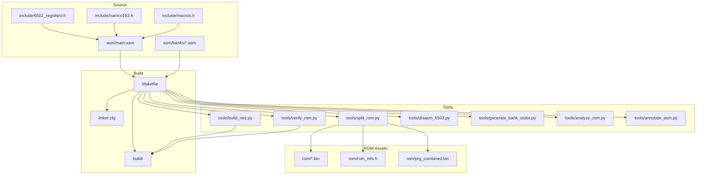
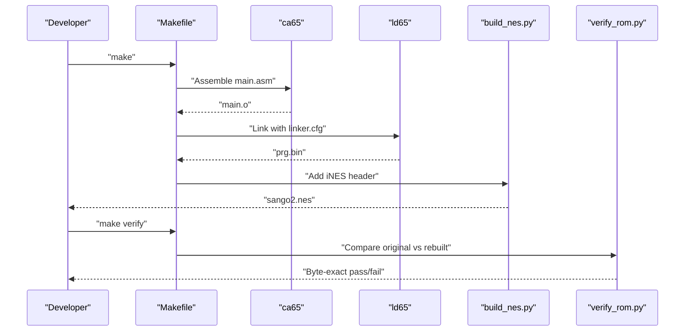
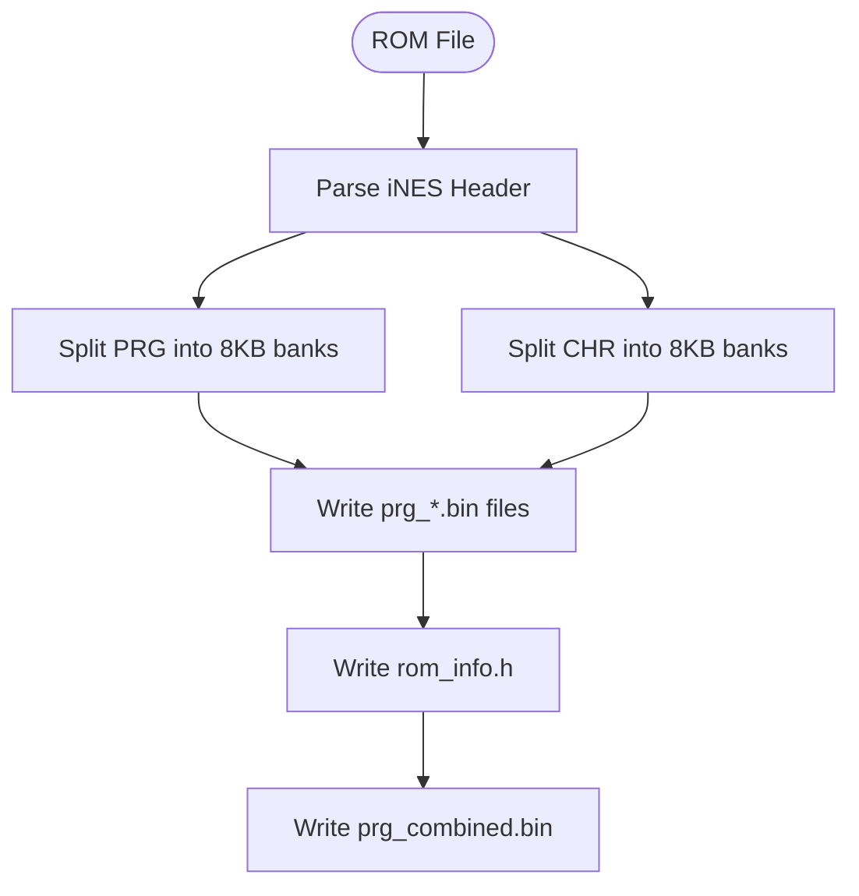
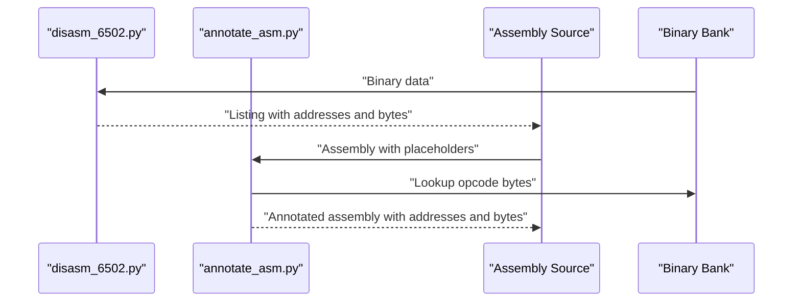
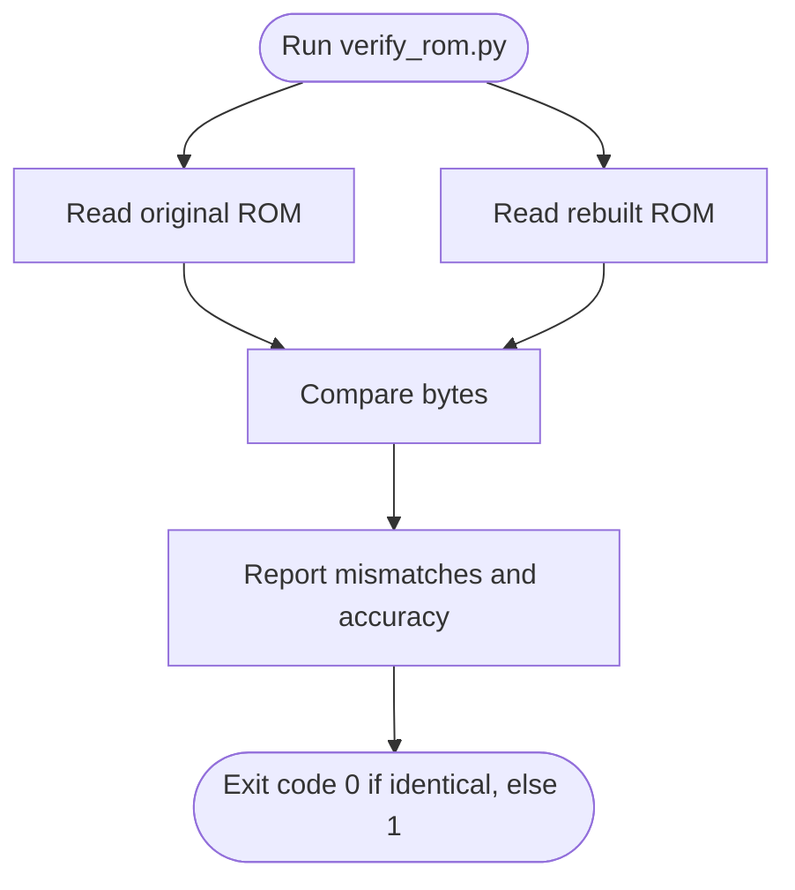
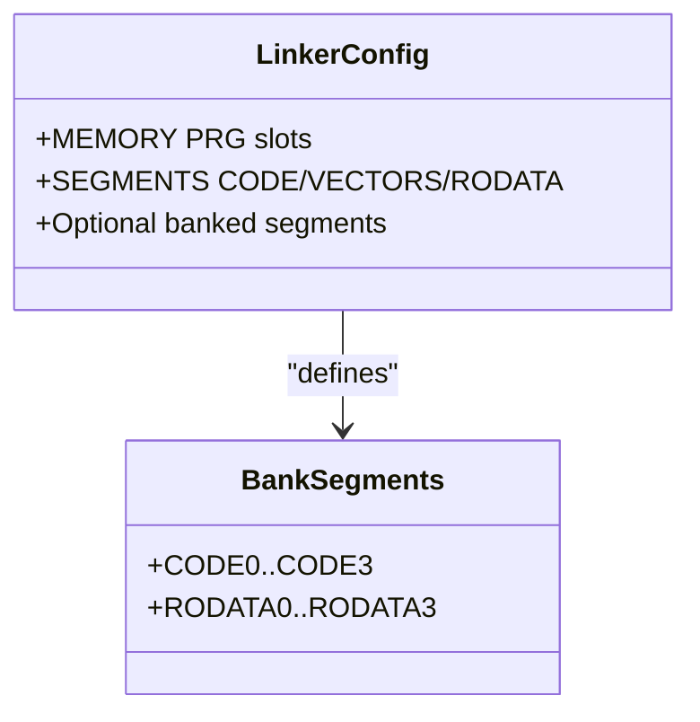
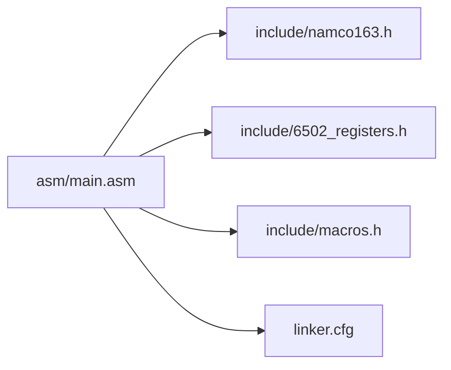
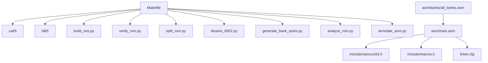

# Build System and Tools

<cite>
**Referenced Files in This Document**
- [Makefile](file://Makefile)
- [PROJECT.md](file://PROJECT.md)
- [linker.cfg](file://linker.cfg)
- [tools/build_nes.py](file://tools/build_nes.py)
- [tools/verify_rom.py](file://tools/verify_rom.py)
- [tools/split_rom.py](file://tools/split_rom.py)
- [tools/disasm_6502.py](file://tools/disasm_6502.py)
- [tools/generate_bank_stubs.py](file://tools/generate_bank_stubs.py)
- [tools/analyze_rom.py](file://tools/analyze_rom.py)
- [tools/annotate_asm.py](file://tools/annotate_asm.py)
- [asm/main.asm](file://asm/main.asm)
- [include/namco163.h](file://include/namco163.h)
- [include/macros.h](file://include/macros.h)
- [asm/banks/all_banks.asm](file://asm/banks/all_banks.asm)
</cite>

## Table of Contents
1. [Introduction](#introduction)
2. [Project Structure](#project-structure)
3. [Core Components](#core-components)
4. [Architecture Overview](#architecture-overview)
5. [Detailed Component Analysis](#detailed-component-analysis)
6. [Dependency Analysis](#dependency-analysis)
7. [Performance Considerations](#performance-considerations)
8. [Troubleshooting Guide](#troubleshooting-guide)
9. [Conclusion](#conclusion)
10. [Appendices](#appendices)

## Introduction
This document explains the complete build system and automated workflows for the Sango2Dasm project. It covers the Makefile targets, the ROM generation pipeline from assembly through linking to the final NES ROM with proper iNES headers, the verification system that ensures byte-exact rebuilds, and the annotation tools used to document and validate disassembly. It also documents the relationships between tools, error handling strategies, and practical examples for integrating the pipeline into a development workflow.

## Project Structure
The project is organized around a Makefile-driven build system, a cc65-based assembler/linker toolchain, and a suite of Python tools for ROM splitting, disassembly, analysis, annotation, and verification. The structure supports:
- Assembly sources under asm/, with bank stubs under asm/banks/
- Include headers under include/ defining hardware registers and mapper macros
- ROM assets under rom/ (split PRG/CHR banks and combined PRG)
- Build outputs under build/
- Automated tools under tools/

**Diagram sources**
- [Makefile:1-102](file://Makefile#L1-L102)
- [linker.cfg:1-55](file://linker.cfg#L1-L55)
- [tools/build_nes.py:1-58](file://tools/build_nes.py#L1-L58)
- [tools/verify_rom.py:1-73](file://tools/verify_rom.py#L1-L73)
- [tools/split_rom.py:1-140](file://tools/split_rom.py#L1-L140)
- [tools/disasm_6502.py:1-363](file://tools/disasm_6502.py#L1-L363)
- [tools/generate_bank_stubs.py:1-53](file://tools/generate_bank_stubs.py#L1-L53)
- [tools/analyze_rom.py:1-135](file://tools/analyze_rom.py#L1-L135)
- [tools/annotate_asm.py:1-481](file://tools/annotate_asm.py#L1-L481)
- [asm/main.asm:1-141](file://asm/main.asm#L1-L141)
- [include/namco163.h:1-87](file://include/namco163.h#L1-L87)
- [include/macros.h:1-72](file://include/macros.h#L1-L72)
- [asm/banks/all_banks.asm:1-38](file://asm/banks/all_banks.asm#L1-L38)

**Section sources**
- [PROJECT.md:14-47](file://PROJECT.md#L14-L47)
- [Makefile:12-31](file://Makefile#L12-L31)

## Core Components
- Makefile targets orchestrate the entire pipeline: assembling, linking, building the final ROM, splitting ROMs, disassembling, analyzing, verifying, and cleaning.
- The cc65 toolchain (ca65 and ld65) compiles assembly into an object file and links it according to the linker configuration.
- Python tools handle ROM parsing, bank generation, disassembly, analysis, annotation, and verification.

Key capabilities:
- Assemble and link to produce a raw PRG binary.
- Add an iNES header and pad to the correct size to form a complete ROM.
- Split an original ROM into PRG/CHR banks for disassembly.
- Disassemble binaries into annotated assembly listings.
- Analyze ROM structure to identify code-heavy banks and vectors.
- Verify byte-exact rebuilds against the original ROM.
- Generate bank stubs to bootstrap disassembly.

**Section sources**
- [Makefile:31-101](file://Makefile#L31-L101)
- [tools/build_nes.py:10-51](file://tools/build_nes.py#L10-L51)
- [tools/split_rom.py:38-122](file://tools/split_rom.py#L38-L122)
- [tools/disasm_6502.py:286-362](file://tools/disasm_6502.py#L286-L362)
- [tools/analyze_rom.py:10-128](file://tools/analyze_rom.py#L10-L128)
- [tools/verify_rom.py:10-51](file://tools/verify_rom.py#L10-L51)
- [tools/generate_bank_stubs.py:12-46](file://tools/generate_bank_stubs.py#L12-L46)

## Architecture Overview
The build system follows a linear pipeline with branching points for analysis and verification. The primary flow is:
- Assemble and link to produce a PRG binary.
- Convert PRG to a full NES ROM with an iNES header.
- Optionally split an original ROM into banks for comparison and disassembly.
- Disassemble and annotate assembly for documentation and validation.
- Verify the rebuilt ROM against the original.

**Diagram sources**
- [Makefile:31-48](file://Makefile#L31-L48)
- [tools/build_nes.py:10-51](file://tools/build_nes.py#L10-L51)
- [tools/verify_rom.py:10-69](file://tools/verify_rom.py#L10-L69)

## Detailed Component Analysis

### Makefile Targets and Orchestration
- make (default): Builds the final ROM by assembling, linking, and packaging with the iNES header.
- make split: Splits an original ROM into PRG/CHR banks and generates a combined PRG for disassembly.
- make banks: Generates bank stub assembly files for all 32 PRG banks.
- make disasm: Disassembles a specified binary region into ca65 assembly format.
- make analyze: Analyzes ROM structure to identify code-heavy banks and vectors.
- make verify: Compares the rebuilt ROM with the original for byte-exact accuracy.
- make clean: Removes build artifacts.
- make distclean: Removes build artifacts plus ROM dump directories.

Usage patterns:
- Start with make split to prepare ROM assets.
- Use make banks to bootstrap disassembly.
- Disassemble and annotate code with make disasm and tools/annotate_asm.py.
- Iterate assembly and linking, then verify with make verify.

**Section sources**
- [Makefile:31-101](file://Makefile#L31-L101)
- [PROJECT.md:58-69](file://PROJECT.md#L58-L69)

### ROM Generation Pipeline (Assembly to Final NES ROM)
The pipeline converts assembly into a playable ROM with:
- Assembling: ca65 compiles main.asm into an object file.
- Linking: ld65 links with linker.cfg to produce a PRG binary.
- Packaging: build_nes.py adds an iNES header and pads PRG to 16KB pages, creates empty CHR, and prints ROM metadata.

**Diagram sources**
- [Makefile:38-48](file://Makefile#L38-L48)
- [tools/build_nes.py:10-51](file://tools/build_nes.py#L10-L51)
- [linker.cfg:18-54](file://linker.cfg#L18-L54)

**Section sources**
- [Makefile:38-48](file://Makefile#L38-L48)
- [tools/build_nes.py:10-51](file://tools/build_nes.py#L10-L51)
- [linker.cfg:18-54](file://linker.cfg#L18-L54)

### ROM Splitting and Bank Generation
- split_rom.py parses the iNES header, splits PRG/CHR into 8KB banks, and writes rom_info.h with mapper and bank counts.
- generate_bank_stubs.py creates 32 bank stubs and an all_banks.asm include file to simplify assembly inclusion.

**Diagram sources**
- [tools/split_rom.py:38-122](file://tools/split_rom.py#L38-L122)
- [tools/generate_bank_stubs.py:12-46](file://tools/generate_bank_stubs.py#L12-L46)

**Section sources**
- [tools/split_rom.py:38-122](file://tools/split_rom.py#L38-L122)
- [tools/generate_bank_stubs.py:12-46](file://tools/generate_bank_stubs.py#L12-L46)

### Disassembly and Annotation Tools
- disasm_6502.py disassembles 6502 binaries into ca65 assembly with address and byte columns, supporting various addressing modes.
- annotate_asm.py annotates existing assembly with ROM addresses and actual opcode bytes, using a symbol table and instruction size heuristics. It can optionally verify assembly with ca65.

**Diagram sources**
- [tools/disasm_6502.py:286-362](file://tools/disasm_6502.py#L286-L362)
- [tools/annotate_asm.py:315-478](file://tools/annotate_asm.py#L315-L478)

**Section sources**
- [tools/disasm_6502.py:286-362](file://tools/disasm_6502.py#L286-L362)
- [tools/annotate_asm.py:315-478](file://tools/annotate_asm.py#L315-L478)

### ROM Verification System
- verify_rom.py performs a byte-by-byte comparison of two ROM files, reporting total mismatches, first mismatch address, and accuracy percentage. It exits with success when identical.

**Diagram sources**
- [tools/verify_rom.py:10-69](file://tools/verify_rom.py#L10-L69)

**Section sources**
- [tools/verify_rom.py:10-69](file://tools/verify_rom.py#L10-L69)

### Linker Configuration and Bank Segments
- linker.cfg defines 4 PRG slots ($8000-$FFFF) and segments for code/data. As banks are disassembled, new segments are added to map code into the correct bank slots.

**Diagram sources**
- [linker.cfg:18-54](file://linker.cfg#L18-L54)

**Section sources**
- [linker.cfg:18-54](file://linker.cfg#L18-L54)

### Assembly Entry Points and Mapper Integration
- asm/main.asm sets up reset/NMI/IRQ handlers, initializes PPU/APU, and switches PRG banks via macros from include/namco163.h.
- include/namco163.h defines mapper registers and bank switching macros used by the assembly.
- include/macros.h provides convenience macros for PPU operations and DMA.

**Diagram sources**
- [asm/main.asm:1-141](file://asm/main.asm#L1-L141)
- [include/namco163.h:1-87](file://include/namco163.h#L1-L87)
- [include/macros.h:1-72](file://include/macros.h#L1-L72)
- [linker.cfg:18-54](file://linker.cfg#L18-L54)

**Section sources**
- [asm/main.asm:25-141](file://asm/main.asm#L25-L141)
- [include/namco163.h:10-87](file://include/namco163.h#L10-L87)
- [include/macros.h:8-72](file://include/macros.h#L8-L72)

## Dependency Analysis
The build system exhibits clear separation of concerns:
- Makefile orchestrates tool invocations and manages dependencies between assembly, linking, and ROM packaging.
- Python tools encapsulate domain-specific tasks (ROM parsing, disassembly, analysis, annotation, verification).
- Assembly sources depend on include headers for hardware and mapper definitions.
- Bank stubs and include files coordinate the assembly of multiple banks.

**Diagram sources**
- [Makefile:31-101](file://Makefile#L31-L101)
- [tools/build_nes.py:10-51](file://tools/build_nes.py#L10-L51)
- [tools/verify_rom.py:10-69](file://tools/verify_rom.py#L10-L69)
- [tools/split_rom.py:38-122](file://tools/split_rom.py#L38-L122)
- [tools/disasm_6502.py:286-362](file://tools/disasm_6502.py#L286-L362)
- [tools/generate_bank_stubs.py:12-46](file://tools/generate_bank_stubs.py#L12-L46)
- [tools/analyze_rom.py:10-128](file://tools/analyze_rom.py#L10-L128)
- [tools/annotate_asm.py:315-478](file://tools/annotate_asm.py#L315-L478)
- [asm/main.asm:1-141](file://asm/main.asm#L1-L141)
- [include/namco163.h:1-87](file://include/namco163.h#L1-L87)
- [include/macros.h:1-72](file://include/macros.h#L1-L72)
- [asm/banks/all_banks.asm:1-38](file://asm/banks/all_banks.asm#L1-L38)

**Section sources**
- [Makefile:31-101](file://Makefile#L31-L101)
- [PROJECT.md:14-47](file://PROJECT.md#L14-L47)

## Performance Considerations
- Disassembly and annotation operate on 8KB banks; keep input binaries small and targeted for faster iteration.
- The verification step compares entire ROMs; ensure original and rebuilt files are present and sized correctly to avoid unnecessary overhead.
- Linker segmentation should be kept minimal until needed to reduce linking complexity and runtime.

## Troubleshooting Guide
Common issues and resolutions:
- Missing toolchain: Ensure ca65 and ld65 are installed and on PATH. The Makefile expects them under ~/.local/bin/.
- Missing ROM assets: Run make split to generate rom/prg/ and rom/chr/ banks and rom_info.h.
- Bank stubs not included: Run make banks to generate asm/banks/*.asm and include all_banks.asm.
- Verification fails due to size mismatch: Confirm both ROMs are padded to the same size; build_nes.py pads PRG to 16KB pages.
- Disassembly address drift: Use annotate_asm.py with address hints in assembly comments to resynchronize.
- Linker errors: Update linker.cfg with new segments as banks are disassembled; ensure segments map to correct PRG slots.

Practical examples:
- Disassemble a specific bank region: make disasm FILE=rom/prg/prg_1f.bin ADDR=E000 LEN=256
- Analyze ROM structure: make analyze
- Verify rebuilt ROM: make verify
- Clean build artifacts: make clean
- Clean and remove ROM dumps: make distclean

**Section sources**
- [Makefile:51-101](file://Makefile#L51-L101)
- [tools/verify_rom.py:22-51](file://tools/verify_rom.py#L22-L51)
- [tools/annotate_asm.py:357-404](file://tools/annotate_asm.py#L357-L404)
- [tools/split_rom.py:124-139](file://tools/split_rom.py#L124-L139)

## Conclusion
The Sango2Dasm build system integrates cc65 assembly/linking with a robust set of Python tools to support ROM disassembly, analysis, annotation, and verification. The Makefile provides a unified interface to orchestrate the pipeline, while tools like split_rom.py, disasm_6502.py, analyze_rom.py, annotate_asm.py, and verify_rom.py enable precise, repeatable workflows. By following the documented targets and procedures, developers can efficiently reconstruct and validate the ROM while maintaining byte-exact fidelity.

## Appendices

### Practical Workflows
- Initial setup: make split, make banks
- Disassembly: make disasm, tools/annotate_asm.py
- Iterative assembly: make, make verify
- Cleanup: make clean, make distclean

### Example Commands
- make disasm FILE=rom/prg/prg_1f.bin ADDR=E000 LEN=256
- make analyze
- make verify