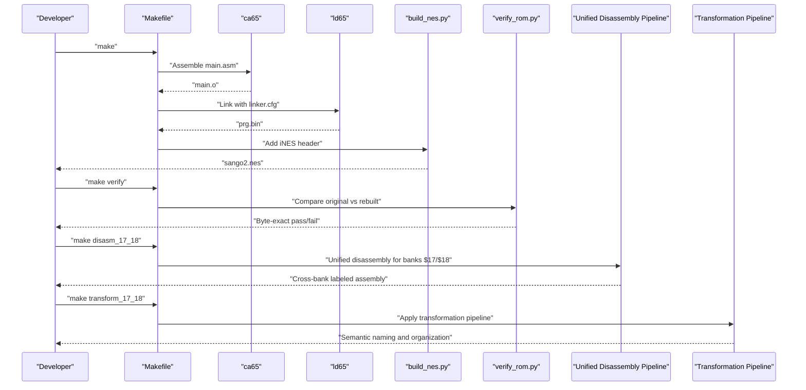
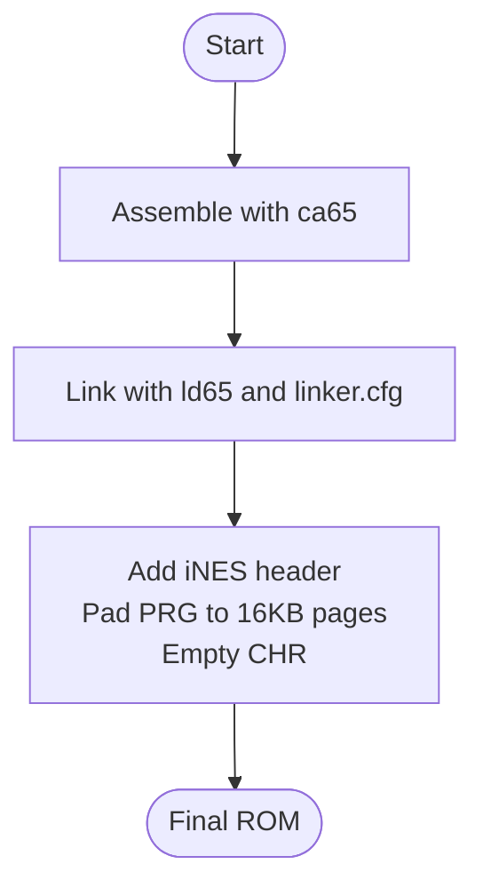
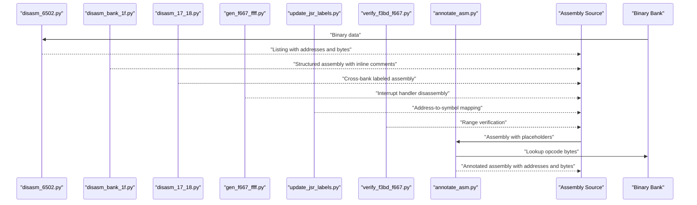
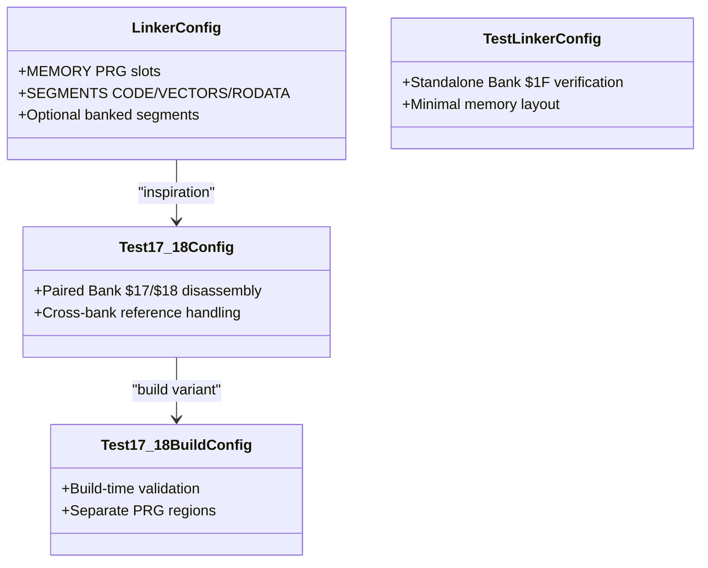
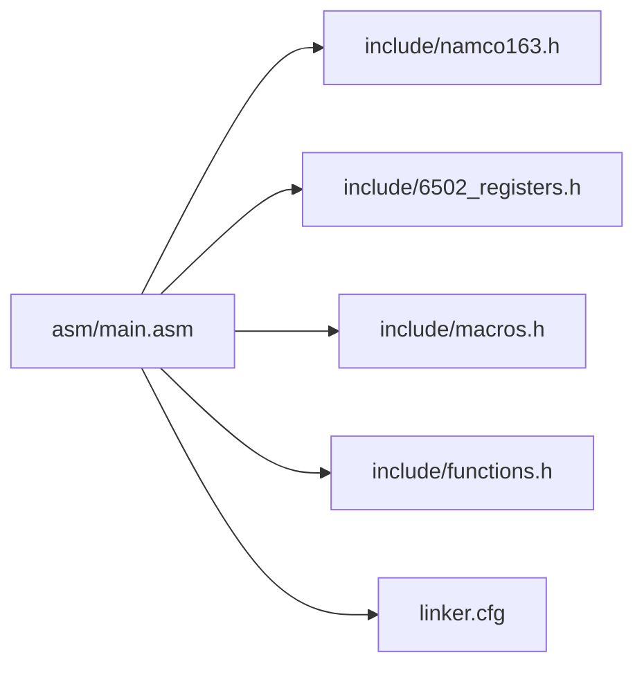
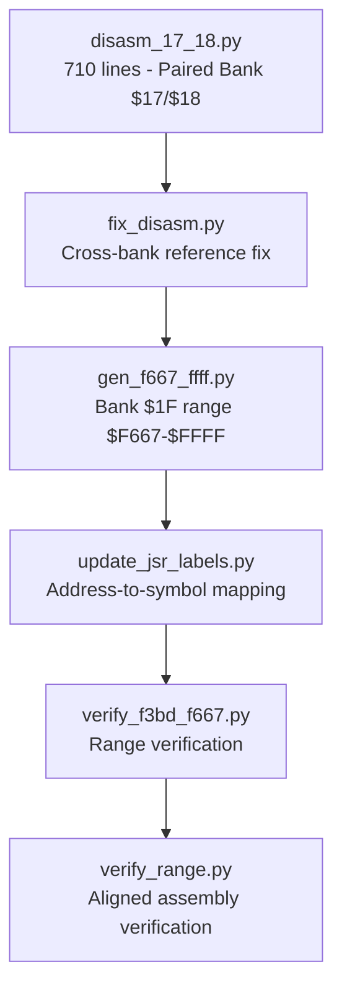
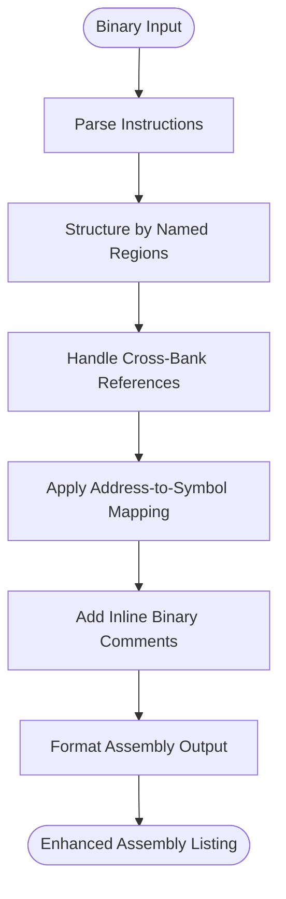
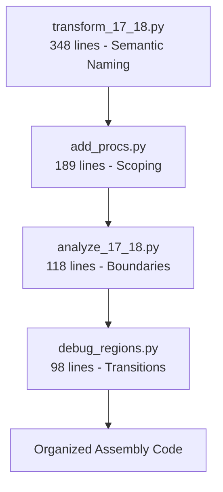
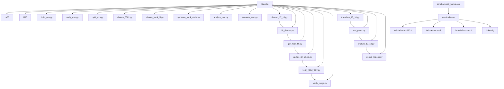

# Build System and Tools

<cite>
**Referenced Files in This Document**
- [Makefile](file://Makefile)
- [PROJECT.md](file://PROJECT.md)
- [linker.cfg](file://linker.cfg)
- [test_linker.cfg](file://test_linker.cfg)
- [test_17_18.cfg](file://test_17_18.cfg)
- [build/test_17_18.cfg](file://build/test_17_18.cfg)
- [check_baseline.py](file://check_baseline.py)
- [convert_hex.py](file://convert_hex.py)
- [transform_branches.py](file://transform_branches.py)
- [transform_wrap.py](file://transform_wrap.py)
- [transform_final.py](file://transform_final.py)
- [fix_forward.py](file://fix_forward.py)
- [fix_gaps.py](file://fix_gaps.py)
- [fix_labels.py](file://fix_labels.py)
- [fix_scope.py](file://fix_scope.py)
- [fix_syntax.py](file://fix_syntax.py)
- [apply_fixes.py](file://apply_fixes.py)
- [tools/build_nes.py](file://tools/build_nes.py)
- [tools/verify_rom.py](file://tools/verify_rom.py)
- [tools/split_rom.py](file://tools/split_rom.py)
- [tools/disasm_6502.py](file://tools/disasm_6502.py)
- [tools/disasm_bank_1f.py](file://tools/disasm_bank_1f.py)
- [tools/disasm_17_18.py](file://tools/disasm_17_18.py)
- [tools/fix_disasm.py](file://tools/fix_disasm.py)
- [tools/gen_f667_ffff.py](file://tools/gen_f667_ffff.py)
- [tools/update_jsr_labels.py](file://tools/update_jsr_labels.py)
- [tools/verify_f3bd_f667.py](file://tools/verify_f3bd_f667.py)
- [tools/verify_range.py](file://tools/verify_range.py)
- [tools/generate_bank_stubs.py](file://tools/generate_bank_stubs.py)
- [tools/analyze_rom.py](file://tools/analyze_rom.py)
- [tools/annotate_asm.py](file://tools/annotate_asm.py)
- [tools/transform_17_18.py](file://tools/transform_17_18.py)
- [tools/add_procs.py](file://tools/add_procs.py)
- [tools/analyze_17_18.py](file://tools/analyze_17_18.py)
- [tools/debug_regions.py](file://tools/debug_regions.py)
- [asm/main.asm](file://asm/main.asm)
- [include/namco163.h](file://include/namco163.h)
- [include/macros.h](file://include/macros.h)
- [include/functions.h](file://include/functions.h)
- [asm/banks/all_banks.asm](file://asm/banks/all_banks.asm)
</cite>

## Update Summary
**Changes Made**
- Added comprehensive documentation for four new Python transformation tools for PRG bank $17/$18 assembly code: transform_17_18.py, add_procs.py, analyze_17_18.py, and debug_regions.py
- Integrated these tools into the unified disassembly pipeline with semantic naming conventions and enhanced code organization
- Updated the Makefile to include new targets for the transformation tools
- Enhanced the transformation pipeline documentation to cover automated tooling for maintainability
- Added detailed coverage of the semantic naming system (B17_18_ prefix) and cross-bank reference handling

## Table of Contents
1. [Introduction](#introduction)
2. [Project Structure](#project-structure)
3. [Core Components](#core-components)
4. [Architecture Overview](#architecture-overview)
5. [Detailed Component Analysis](#detailed-component-analysis)
6. [Unified Disassembly Pipeline](#unified-disassembly-pipeline)
7. [Enhanced Disassembly Tools](#enhanced-disassembly-tools)
8. [Transformation Pipeline](#transformation-pipeline)
9. [Dependency Analysis](#dependency-analysis)
10. [Performance Considerations](#performance-considerations)
11. [Troubleshooting Guide](#troubleshooting-guide)
12. [Conclusion](#conclusion)
13. [Appendices](#appendices)

## Introduction
This document explains the complete build system and automated workflows for the Sango2Dasm project. It covers the Makefile targets, the ROM generation pipeline from assembly through linking to the final NES ROM with proper iNES headers, the verification system that ensures byte-exact rebuilds, and the enhanced annotation tools used to document and validate disassembly. The project now features a comprehensive unified disassembly approach that provides automated cleanup, cross-bank reference handling, address-to-symbol mapping, and specialized tools for different ROM regions. Additionally, the transformation pipeline now includes sophisticated tools for PRG bank $17/$18 assembly code with semantic naming conventions and enhanced code organization.

## Project Structure
The project is organized around a Makefile-driven build system, a cc65-based assembler/linker toolchain, and a suite of Python tools for ROM splitting, disassembly, analysis, annotation, verification, and assembly transformation. The structure supports:
- Assembly sources under asm/, with bank stubs under asm/banks/
- Include headers under include/ defining hardware registers and mapper macros
- ROM assets under rom/ (split PRG/CHR banks and combined PRG)
- Build outputs under build/
- Automated tools under tools/
- **New**: Comprehensive transformation pipeline with specialized tools for PRG bank $17/$18 assembly code including semantic naming and cross-bank reference handling

```mermaid
graph TB
subgraph "Source"
A_main["asm/main.asm"]
A_banks["asm/banks/*.asm"]
H_regs["include/6502_registers.h"]
H_namco["include/namco163.h"]
H_macros["include/macros.h"]
H_functions["include/functions.h"]
end
subgraph "Build"
MK["Makefile"]
CFG["linker.cfg"]
TEST_CFG["test_linker.cfg"]
TEST_17_18["test_17_18.cfg"]
TEST_17_18_BUILD["build/test_17_18.cfg"]
OUT["build/"]
end
subgraph "Unified Disassembly Pipeline"
UD1["disasm_17_18.py<br/>710 lines"]
UD2["fix_disasm.py"]
UD3["gen_f667_ffff.py"]
UD4["update_jsr_labels.py"]
UD5["verify_f3bd_f667.py"]
UD6["verify_range.py"]
end
subgraph "Transformation Pipeline"
TP1["transform_17_18.py<br/>348 lines"]
TP2["add_procs.py<br/>189 lines"]
TP3["analyze_17_18.py<br/>118 lines"]
TP4["debug_regions.py<br/>98 lines"]
end
subgraph "Tools"
T_build["tools/build_nes.py"]
T_verify["tools/verify_rom.py"]
T_split["tools/split_rom.py"]
T_disasm["tools/disasm_6502.py"]
T_disasm1f["tools/disasm_bank_1f.py"]
T_gen["tools/generate_bank_stubs.py"]
T_analyze["tools/analyze_rom.py"]
T_annotate["tools/annotate_asm.py"]
end
subgraph "ROM Assets"
R_rom["rom/*.bin"]
R_info["rom/rom_info.h"]
R_combined["rom/prg_combined.bin"]
end
A_main --> MK
A_banks --> MK
H_regs --> A_main
H_namco --> A_main
H_macros --> A_main
H_functions --> T_update_jsr
MK --> CFG
MK --> TEST_CFG
MK --> TEST_17_18
MK --> TEST_17_18_BUILD
MK --> OUT
MK --> UD1
MK --> UD2
MK --> UD3
MK --> UD4
MK --> UD5
MK --> UD6
MK --> TP1
MK --> TP2
MK --> TP3
MK --> TP4
MK --> T_build
MK --> T_verify
MK --> T_split
MK --> T_disasm
MK --> T_disasm1f
MK --> T_gen
MK --> T_analyze
MK --> T_annotate
T_split --> R_rom
T_split --> R_info
T_split --> R_combined
T_build --> OUT
T_verify --> OUT
```

**Diagram sources**
- [Makefile:1-102](file://Makefile#L1-L102)
- [linker.cfg:1-58](file://linker.cfg#L1-L58)
- [test_linker.cfg:1-13](file://test_linker.cfg#L1-L13)
- [test_17_18.cfg:1-9](file://test_17_18.cfg#L1-L9)
- [build/test_17_18.cfg:1-11](file://build/test_17_18.cfg#L1-L11)
- [tools/disasm_17_18.py:1-710](file://tools/disasm_17_18.py#L1-L710)
- [tools/fix_disasm.py:1-56](file://tools/fix_disasm.py#L1-L56)
- [tools/gen_f667_ffff.py:1-396](file://tools/gen_f667_ffff.py#L1-L396)
- [tools/update_jsr_labels.py:1-137](file://tools/update_jsr_labels.py#L1-L137)
- [tools/verify_f3bd_f667.py:1-45](file://tools/verify_f3bd_f667.py#L1-L45)
- [tools/verify_range.py:1-42](file://tools/verify_range.py#L1-L42)
- [tools/transform_17_18.py:1-348](file://tools/transform_17_18.py#L1-L348)
- [tools/add_procs.py:1-189](file://tools/add_procs.py#L1-L189)
- [tools/analyze_17_18.py:1-118](file://tools/analyze_17_18.py#L1-L118)
- [tools/debug_regions.py:1-98](file://tools/debug_regions.py#L1-L98)

**Section sources**
- [PROJECT.md:14-47](file://PROJECT.md#L14-L47)
- [Makefile:12-31](file://Makefile#L12-L31)

## Core Components
- Makefile targets orchestrate the entire pipeline: assembling, linking, building the final ROM, splitting ROMs, disassembling, analyzing, verifying, cleaning, and the new unified disassembly pipeline with transformation tools.
- The cc65 toolchain (ca65 and ld65) compiles assembly into an object file and links it according to the linker configuration.
- Python tools handle ROM parsing, bank generation, disassembly, analysis, annotation, verification, and the comprehensive unified disassembly pipeline with transformation tools.
- **New**: Transformation pipeline provides sophisticated tools for PRG bank $17/$18 assembly code with semantic naming conventions, enhanced code organization, and automated tooling for maintainability.

Key capabilities:
- Assemble and link to produce a raw PRG binary.
- Add an iNES header and pad to the correct size to form a complete ROM.
- Split an original ROM into PRG/CHR banks for disassembly.
- Disassemble and annotate assembly for documentation and validation.
- Analyze ROM structure to identify code-heavy banks and vectors.
- Verify byte-exact rebuilds against the original ROM.
- Generate bank stubs to bootstrap disassembly.
- **New**: Unified disassembly with specialized tools for Bank $17/$18 paired disassembly, Bank $1F range disassembly, and cross-bank reference mapping.
- **New**: Transformation pipeline with semantic naming (B17_18_), cross-bank reference handling, and automated code organization.

**Section sources**
- [Makefile:31-101](file://Makefile#L31-L101)
- [tools/build_nes.py:10-51](file://tools/build_nes.py#L10-L51)
- [tools/split_rom.py:38-122](file://tools/split_rom.py#L38-L122)
- [tools/disasm_6502.py:286-362](file://tools/disasm_6502.py#L286-L362)
- [tools/disasm_bank_1f.py:329-442](file://tools/disasm_bank_1f.py#L329-L442)
- [tools/analyze_rom.py:10-128](file://tools/analyze_rom.py#L10-L128)
- [tools/verify_rom.py:10-51](file://tools/verify_rom.py#L10-L51)
- [tools/generate_bank_stubs.py:12-46](file://tools/generate_bank_stubs.py#L12-L46)

## Architecture Overview
The build system follows a linear pipeline with branching points for analysis and verification. The primary flow is:
- Assemble and link to produce a PRG binary.
- Convert PRG to a full NES ROM with an iNES header.
- Optionally split an original ROM into banks for comparison and disassembly.
- Disassemble and annotate assembly for documentation and validation.
- Verify the rebuilt ROM against the original.
- **New**: Apply unified disassembly pipeline for specialized ROM region processing with cross-bank reference handling.
- **New**: Apply transformation pipeline for PRG bank $17/$18 assembly code with semantic naming and enhanced organization.

**Diagram sources**
- [Makefile:31-48](file://Makefile#L31-L48)
- [tools/build_nes.py:10-51](file://tools/build_nes.py#L10-L51)
- [tools/verify_rom.py:10-69](file://tools/verify_rom.py#L10-L69)

## Detailed Component Analysis

### Makefile Targets and Orchestration
- make (default): Builds the final ROM by assembling, linking, and packaging with the iNES header.
- make split: Splits an original ROM into PRG/CHR banks and generates a combined PRG for disassembly.
- make banks: Generates bank stub assembly files for all 32 PRG banks.
- make disasm: Disassembles a specified binary region into ca65 assembly format.
- make analyze: Analyzes ROM structure to identify code-heavy banks and vectors.
- make verify: Compares the rebuilt ROM with the original for byte-exact accuracy.
- make clean: Removes build artifacts.
- make distclean: Removes build artifacts plus ROM dump directories.
- **New**: make disasm_17_18: Unified disassembly for paired Bank $17/$18 region with cross-bank references.
- **New**: make gen_f667_ffff: Specialized disassembly for Bank $1F range $F667-$FFFF.
- **New**: make update_jsr_labels: Update JSR/JMP operands using functions.h address map.
- **New**: make transform_17_18: Apply semantic naming transformation to PRG bank $17/$18 assembly code.
- **New**: make add_procs: Add .proc/.endproc scoping to PRG bank $17/$18 assembly code.
- **New**: make analyze_17_18: Analyze PRG bank $17/$18 assembly code boundaries and function structure.
- **New**: make debug_regions: Debug region transitions in PRG bank $17/$18 assembly code.

Usage patterns:
- Start with make split to prepare ROM assets.
- Use make banks to bootstrap disassembly.
- Disassemble and annotate code with make disasm and tools/annotate_asm.py.
- **New**: Apply unified disassembly pipeline with make disasm_17_18 for paired bank processing.
- **New**: Use make gen_f667_ffff for specialized Bank $1F range disassembly.
- **New**: Use make update_jsr_labels to map addresses to symbols in Bank $1F assembly.
- **New**: Use transformation pipeline for PRG bank $17/$18 assembly code organization.
- Iterate assembly and linking, then verify with make verify.

**Section sources**
- [Makefile:31-101](file://Makefile#L31-L101)
- [PROJECT.md:58-69](file://PROJECT.md#L58-L69)

### ROM Generation Pipeline (Assembly to Final NES ROM)
The pipeline converts assembly into a playable ROM with:
- Assembling: ca65 compiles main.asm into an object file.
- Linking: ld65 links with linker.cfg to produce a PRG binary.
- Packaging: build_nes.py adds an iNES header and pads PRG to 16KB pages, creates empty CHR, and prints ROM metadata.

**Diagram sources**
- [Makefile:38-48](file://Makefile#L38-L48)
- [tools/build_nes.py:10-51](file://tools/build_nes.py#L10-L51)
- [linker.cfg:18-54](file://linker.cfg#L18-L54)

**Section sources**
- [Makefile:38-48](file://Makefile#L38-L48)
- [tools/build_nes.py:10-51](file://tools/build_nes.py#L10-L51)
- [linker.cfg:18-54](file://linker.cfg#L18-L54)

### ROM Splitting and Bank Generation
- split_rom.py parses the iNES header, splits PRG/CHR into 8KB banks, and writes rom_info.h with mapper and bank counts.
- generate_bank_stubs.py creates 32 bank stubs and an all_banks.asm include file to simplify assembly inclusion.

**Diagram sources**
- [tools/split_rom.py:38-122](file://tools/split_rom.py#L38-L122)
- [tools/generate_bank_stubs.py:12-46](file://tools/generate_bank_stubs.py#L12-L46)

**Section sources**
- [tools/split_rom.py:38-122](file://tools/split_rom.py#L38-L122)
- [tools/generate_bank_stubs.py:12-46](file://tools/generate_bank_stubs.py#L12-L46)

### Disassembly and Annotation Tools
- disasm_6502.py disassembles 6502 binaries into ca65 assembly with address and byte columns, supporting various addressing modes.
- disasm_bank_1f.py provides comprehensive disassembly for Bank 0x1F with structured function definitions, named regions, and inline binary comments.
- **New**: disasm_17_18.py provides unified recursive descent disassembly for paired Bank $17/$18 region with cross-bank reference handling.
- **New**: gen_f667_ffff.py generates specialized disassembly for Bank $1F range $F667-$FFFF with detailed interrupt handler analysis.
- **New**: update_jsr_labels.py maps JSR/JMP operands to symbolic names using functions.h address map.
- **New**: verify_f3bd_f667.py verifies Bank $1F range $F3BD-$F667 assembly against binary.
- annotate_asm.py annotates existing assembly with ROM addresses and actual opcode bytes, using a symbol table and instruction size heuristics. It can optionally verify assembly with ca65.

**Updated** Enhanced with improved output format supporting inline binary comments and detailed address mapping for precise ROM analysis.

**Diagram sources**
- [tools/disasm_6502.py:286-362](file://tools/disasm_6502.py#L286-L362)
- [tools/disasm_bank_1f.py:329-442](file://tools/disasm_bank_1f.py#L329-L442)
- [tools/disasm_17_18.py:1-710](file://tools/disasm_17_18.py#L1-L710)
- [tools/gen_f667_ffff.py:1-396](file://tools/gen_f667_ffff.py#L1-L396)
- [tools/update_jsr_labels.py:1-137](file://tools/update_jsr_labels.py#L1-L137)
- [tools/verify_f3bd_f667.py:1-45](file://tools/verify_f3bd_f667.py#L1-L45)
- [tools/annotate_asm.py:315-478](file://tools/annotate_asm.py#L315-L478)

**Section sources**
- [tools/disasm_6502.py:286-362](file://tools/disasm_6502.py#L286-L362)
- [tools/disasm_bank_1f.py:329-442](file://tools/disasm_bank_1f.py#L329-L442)
- [tools/disasm_17_18.py:1-710](file://tools/disasm_17_18.py#L1-L710)
- [tools/gen_f667_ffff.py:1-396](file://tools/gen_f667_ffff.py#L1-L396)
- [tools/update_jsr_labels.py:1-137](file://tools/update_jsr_labels.py#L1-L137)
- [tools/verify_f3bd_f667.py:1-45](file://tools/verify_f3bd_f667.py#L1-L45)
- [tools/annotate_asm.py:315-478](file://tools/annotate_asm.py#L315-L478)

### ROM Verification System
- verify_rom.py performs a byte-by-byte comparison of two ROM files, reporting total mismatches, first mismatch address, and accuracy percentage. It exits with success when identical.
- **New**: verify_f3bd_f667.py verifies Bank $1F range $F3BD-$F667 assembly against binary with detailed error reporting.
- **New**: verify_range.py verifies disassembly bytes in prg_1f.aligned.asm against the binary for range $E843-$F2AE.

**Diagram sources**
- [tools/verify_rom.py:10-69](file://tools/verify_rom.py#L10-L69)

**Section sources**
- [tools/verify_rom.py:10-69](file://tools/verify_rom.py#L10-L69)

### Linker Configuration and Bank Segments
- linker.cfg defines 4 PRG slots ($8000-$FFFF) and segments for code/data. As banks are disassembled, new segments are added to map code into the correct bank slots.
- **New**: test_17_18.cfg provides a temporary configuration for standalone verification of paired Bank $17/$18 assembly code.
- **New**: build/test_17_18.cfg provides a test linker configuration specifically for Bank $17/$18 disassembly pipeline.

**Diagram sources**
- [linker.cfg:18-54](file://linker.cfg#L18-L54)
- [test_linker.cfg:1-13](file://test_linker.cfg#L1-13)
- [test_17_18.cfg:1-9](file://test_17_18.cfg#L1-L9)
- [build/test_17_18.cfg:1-11](file://build/test_17_18.cfg#L1-L11)

**Section sources**
- [linker.cfg:18-54](file://linker.cfg#L18-L54)
- [test_linker.cfg:1-13](file://test_linker.cfg#L1-13)
- [test_17_18.cfg:1-9](file://test_17_18.cfg#L1-L9)
- [build/test_17_18.cfg:1-11](file://build/test_17_18.cfg#L1-L11)

### Assembly Entry Points and Mapper Integration
- asm/main.asm sets up reset/NMI/IRQ handlers, initializes PPU/APU, and switches PRG banks via macros from include/namco163.h.
- include/namco163.h defines mapper registers and bank switching macros used by the assembly.
- include/macros.h provides convenience macros for PPU operations and DMA.
- **New**: include/functions.h provides address-to-symbol mapping for Bank $1F code with $E000-$FFFF addresses.

**Diagram sources**
- [asm/main.asm:1-141](file://asm/main.asm#L1-L141)
- [include/namco163.h:1-87](file://include/namco163.h#L1-L87)
- [include/macros.h:1-72](file://include/macros.h#L1-L72)
- [include/functions.h:1-87](file://include/functions.h#L1-L87)
- [linker.cfg:18-54](file://linker.cfg#L18-L54)

**Section sources**
- [asm/main.asm:25-141](file://asm/main.asm#L25-L141)
- [include/namco163.h:10-87](file://include/namco163.h#L10-L87)
- [include/macros.h:8-72](file://include/macros.h#L8-L72)
- [include/functions.h:1-87](file://include/functions.h#L1-L87)

## Unified Disassembly Pipeline

### Overview
The unified disassembly pipeline provides a comprehensive automated workflow for processing different ROM regions with specialized tools. The pipeline consists of six specialized tools that work together to provide cross-bank reference handling, address-to-symbol mapping, and region-specific disassembly capabilities.

### Pipeline Architecture
The unified disassembly pipeline operates on different ROM regions with specialized tools:

**Diagram sources**
- [tools/disasm_17_18.py:1-710](file://tools/disasm_17_18.py#L1-L710)
- [tools/fix_disasm.py:1-56](file://tools/fix_disasm.py#L1-L56)
- [tools/gen_f667_ffff.py:1-396](file://tools/gen_f667_ffff.py#L1-L396)
- [tools/update_jsr_labels.py:1-137](file://tools/update_jsr_labels.py#L1-L137)
- [tools/verify_f3bd_f667.py:1-45](file://tools/verify_f3bd_f667.py#L1-L45)
- [tools/verify_range.py:1-42](file://tools/verify_range.py#L1-L42)

### Stage-by-Stage Breakdown

#### Stage 1: Paired Bank Disassembly (disasm_17_18.py)
- **Recursive Descent Analysis**: Uses sophisticated recursive descent algorithm to distinguish code from data across paired Bank $17/$18 region ($A000-$DFFF).
- **Cross-Bank Reference Handling**: Automatically detects and handles cross-bank references between $A000-$BFFF and $C000-$DFFF.
- **Inline Table Detection**: Identifies callback dispatcher tables and banked callback trampolines with automatic table size calculation.
- **Known Function Integration**: Incorporates known function addresses from Bank $1F for better disassembly accuracy.
- **Output Generation**: Produces labeled assembly with proper cross-bank equates and inline byte comments.

#### Stage 2: Cross-Bank Reference Fix (fix_disasm.py)
- **Automated Enhancement**: Enhances existing disasm_17_18.py with cross-bank reference computation and equate generation.
- **Integration Point**: Inserts cross-reference collection after label building and before output generation.
- **Equation Generation**: Creates proper equate statements for cross-bank references in both directions.

#### Stage 3: Bank $1F Range Disassembly (gen_f667_ffff.py)
- **Specialized Range Processing**: Focuses on Bank $1F range $F667-$FFFF with detailed interrupt handler analysis.
- **Interrupt Handler Coverage**: Provides comprehensive disassembly of NMI/IRQ handlers, scroll routines, and interrupt vectors.
- **Structural Organization**: Groups code into logical sections with proper procedure boundaries and data tables.
- **Padding Detection**: Identifies and formats unused ROM regions with appropriate comments.

#### Stage 4: Address-to-Symbol Mapping (update_jsr_labels.py)
- **Symbol Resolution**: Maps JSR/JMP operands to symbolic names using functions.h address map for $E000-$FFFF.
- **Inline Comment Parsing**: Decodes target addresses from inline byte comments in assembly files.
- **Idempotent Processing**: Safe to run multiple times without changing output.
- **Scoped Reference Handling**: Excludes local (@) and scoped (::) references from automatic mapping.

#### Stage 5: Range Verification (verify_f3bd_f667.py)
- **Targeted Verification**: Verifies Bank $1F range $F3BD-$F667 assembly against original binary.
- **Pattern Matching**: Uses strict regex pattern matching for inline byte comments with 2-digit hex validation.
- **Error Reporting**: Provides detailed error reports with expected vs actual byte comparisons.
- **Count Validation**: Ensures both byte content and count match the expected 683 bytes.

#### Stage 6: Aligned Assembly Verification (verify_range.py)
- **Range-Specific Validation**: Verifies disassembly bytes in prg_1f.aligned.asm against binary for range $E843-$F2AE.
- **Pattern Validation**: Ensures all tokens are exactly 2 hex characters for reliable parsing.
- **Comprehensive Coverage**: Validates the aligned Bank $1F assembly file for the specified address range.

**Section sources**
- [tools/disasm_17_18.py:1-710](file://tools/disasm_17_18.py#L1-L710)
- [tools/fix_disasm.py:1-56](file://tools/fix_disasm.py#L1-L56)
- [tools/gen_f667_ffff.py:1-396](file://tools/gen_f667_ffff.py#L1-L396)
- [tools/update_jsr_labels.py:1-137](file://tools/update_jsr_labels.py#L1-L137)
- [tools/verify_f3bd_f667.py:1-45](file://tools/verify_f3bd_f667.py#L1-L45)
- [tools/verify_range.py:1-42](file://tools/verify_range.py#L1-L42)

### Integration with Build System
The unified disassembly pipeline integrates seamlessly with the Makefile build system:
- **New**: make disasm_17_18 target triggers the complete paired bank disassembly workflow.
- **New**: make gen_f667_ffff target generates specialized Bank $1F range disassembly.
- **New**: make update_jsr_labels target updates JSR/JMP operands using address mapping.
- **New**: make verify_f3bd_f667 target validates Bank $1F range assembly.
- Each stage produces detailed logging and validation feedback.
- Intermediate results are saved to maintain progress and enable debugging.
- Final output provides comprehensive cross-bank labeled assembly ready for compilation.

**Section sources**
- [Makefile:31-101](file://Makefile#L31-L101)

## Enhanced Disassembly Tools

### Advanced Disassembly Capabilities
The project now features significantly enhanced disassembly tools with improved output formats that provide detailed address mapping and inline binary comments:

#### disasm_6502.py - Enhanced Basic Disassembler
- Produces formatted output with address, byte columns, and instruction mnemonics
- Supports various addressing modes with proper operand formatting
- Provides truncated instruction handling for boundary conditions
- Includes base address mapping for accurate CPU address translation

#### disasm_bank_1f.py - Comprehensive Bank 0x1F Disassembler
- **Structured Function Analysis**: Organizes Bank 0x1F into named functions and data regions
- **Inline Binary Comments**: Each instruction includes detailed address and raw byte information
- **Named Region Definitions**: Groups code into logical sections (Reset, State Handlers, Sound Engine, etc.)
- **Complete Interrupt Vector Support**: Properly handles NMI/RESET/IRQ vectors with inline comments
- **Data Table Formatting**: Formats data regions with inline address and byte comments
- **Padding Detection**: Identifies and formats unused ROM regions

#### disasm_17_18.py - Unified Paired Bank Disassembler
- **Recursive Descent Analysis**: Sophisticated algorithm to distinguish code from data across paired banks
- **Cross-Bank Reference Handling**: Automatic detection and labeling of cross-bank references
- **Inline Table Detection**: Identifies callback dispatcher tables and banked callback patterns
- **Known Function Integration**: Incorporates Bank $1F function addresses for better accuracy
- **Cross-Bank Equates**: Generates proper equate statements for inter-bank references
- **Output Generation**: Produces labeled assembly with inline byte comments

#### gen_f667_ffff.py - Specialized Bank $1F Range Disassembler
- **Interrupt Handler Focus**: Comprehensive disassembly of NMI/IRQ handlers and scroll routines
- **Structural Organization**: Logical grouping of interrupt handlers, state machines, and data tables
- **Padding Detection**: Identifies and formats unused ROM regions with appropriate comments
- **Vector Table Analysis**: Proper handling of interrupt vectors and dispatch tables

#### update_jsr_labels.py - Address-to-Symbol Mapping Tool
- **Symbol Resolution**: Maps JSR/JMP operands to symbolic names using functions.h address map
- **Inline Comment Parsing**: Decodes target addresses from assembly inline comments
- **Scoped Reference Handling**: Excludes local (@) and scoped (::) references from mapping
- **Idempotent Processing**: Safe to run multiple times without changing output

#### verify_f3bd_f667.py - Range Verification Tool
- **Targeted Verification**: Validates Bank $1F range $F3BD-$F667 assembly against original binary
- **Pattern Matching**: Strict regex validation for inline byte comments with 2-digit hex
- **Error Reporting**: Detailed comparison of expected vs actual byte content
- **Count Validation**: Ensures both byte content and count match expected values

**Enhanced Output Format Features**:
- Address mapping: `${addr:04X}:` provides precise ROM address information
- Inline binary comments: Raw byte sequences appended as `; ${addr:04X}: ${raw_str}`
- Structured organization: Logical grouping of functions, tables, and data sections
- Complete coverage: Handles all 8KB of Bank 0x1F with detailed analysis
- Cross-bank references: Proper handling of inter-bank code and data references

**Diagram sources**
- [tools/disasm_17_18.py:1-710](file://tools/disasm_17_18.py#L1-L710)
- [tools/gen_f667_ffff.py:1-396](file://tools/gen_f667_ffff.py#L1-L396)
- [tools/update_jsr_labels.py:1-137](file://tools/update_jsr_labels.py#L1-L137)

**Section sources**
- [tools/disasm_6502.py:286-362](file://tools/disasm_6502.py#L286-L362)
- [tools/disasm_bank_1f.py:329-442](file://tools/disasm_bank_1f.py#L329-L442)
- [tools/disasm_17_18.py:1-710](file://tools/disasm_17_18.py#L1-L710)
- [tools/gen_f667_ffff.py:1-396](file://tools/gen_f667_ffff.py#L1-L396)
- [tools/update_jsr_labels.py:1-137](file://tools/update_jsr_labels.py#L1-L137)
- [tools/verify_f3bd_f667.py:1-45](file://tools/verify_f3bd_f667.py#L1-L45)

### Advanced Annotation and Address Mapping
- annotate_asm.py provides sophisticated address mapping with section header resynchronization
- Supports both address-only and full annotation modes
- Includes forward search capability to handle ROM instruction variations
- Provides verification support with optional ca65 compilation checks
- **New**: Integrated with unified disassembly pipeline for cross-bank reference handling

**Enhanced Annotation Features**:
- Address hint parsing: Resynchronizes address mapping using section header comments
- Forward instruction search: Handles cases where ROM has extra instructions
- Symbol resolution: Integrates with include files for accurate operand resolution
- Verification integration: Optional ca65 compilation to validate annotated assembly
- Cross-bank reference support: Handles inter-bank code and data references

**Section sources**
- [tools/annotate_asm.py:315-478](file://tools/annotate_asm.py#L315-L478)

## Transformation Pipeline

### Overview
The transformation pipeline provides a comprehensive automated workflow for organizing and enhancing PRG bank $17/$18 assembly code with semantic naming conventions and cross-bank reference handling. The pipeline consists of four specialized tools that work together to provide systematic code organization, naming standardization, and debugging capabilities.

### Pipeline Architecture
The transformation pipeline operates on PRG bank $17/$18 assembly code with four specialized stages:

**Diagram sources**
- [tools/transform_17_18.py:1-348](file://tools/transform_17_18.py#L1-L348)
- [tools/add_procs.py:1-189](file://tools/add_procs.py#L1-L189)
- [tools/analyze_17_18.py:1-118](file://tools/analyze_17_18.py#L1-L118)
- [tools/debug_regions.py:1-98](file://tools/debug_regions.py#L1-L98)

### Stage-by-Stage Breakdown

#### Stage 1: Semantic Naming Transformation (transform_17_18.py)
- **Region-Based Organization**: Uses a comprehensive region map to identify function boundaries and data sections across Bank $17 ($A000-$BFFF) and Bank $18 ($C000-$DFFF).
- **Semantic Naming Convention**: Applies B17_18_ prefix to all identified functions and data structures for clear identification.
- **Cross-Bank Reference Handling**: Automatically detects and handles cross-bank references between $A000-$BFFF and $C000-$DFFF.
- **Section Headers**: Adds detailed section headers with address ranges, function types, and descriptions.
- **Label Renaming**: Renames LXXXX labels to semantic B17_18_ names and updates all references.
- **Dry Run Mode**: Supports --dry-run flag for previewing changes without modification.

#### Stage 2: Procedure Scoping (add_procs.py)
- **Block Parsing**: Parses assembly code into structured blocks including section headers, labels, code, data, and comments.
- **Region Classification**: Classifies regions as code or data based on content analysis and section headers.
- **Cross-Reference Analysis**: Identifies cross-referenced Lxxxx labels that need proper scoping.
- **Scoping Implementation**: Adds .proc/.endproc directives around identified regions to improve code organization.
- **Block Grouping**: Groups related blocks into logical regions for better maintainability.

#### Stage 3: Boundary Analysis (analyze_17_18.py)
- **Address Mapping**: Builds comprehensive address-to-line mappings from inline byte comments.
- **Function Boundary Detection**: Analyzes RTS instructions, JSR/JMP patterns, and label relationships to identify function boundaries.
- **Entry Point Analysis**: Identifies jump table entry targets and traces function extents.
- **Cross-Bank Reference Analysis**: Detects and analyzes cross-bank references and their implications.
- **Statistical Analysis**: Provides counts of JSR/JMP instructions and function sizes for code analysis.

#### Stage 4: Region Debugging (debug_regions.py)
- **Transition Analysis**: Tracks region transitions throughout the assembly code to ensure proper boundary detection.
- **Boundary Validation**: Validates that region boundaries align with actual code structure and address ranges.
- **Debug Output**: Provides detailed transition reports showing when and where region changes occur.
- **Boundary Verification**: Compares detected transitions with expected region counts and boundaries.

### Integration with Build System
The transformation pipeline integrates seamlessly with the Makefile build system:
- **New**: make transform_17_18 target applies semantic naming transformation to PRG bank $17/$18 assembly code.
- **New**: make add_procs target adds .proc/.endproc scoping to organized assembly code.
- **New**: make analyze_17_18 target analyzes function boundaries and cross-bank references.
- **New**: make debug_regions target validates region transitions and boundary detection.
- Each stage produces detailed logging and validation feedback.
- Intermediate results are saved to maintain progress and enable debugging.
- Final output provides well-organized, semantically-named assembly code ready for compilation.

**Section sources**
- [tools/transform_17_18.py:1-348](file://tools/transform_17_18.py#L1-L348)
- [tools/add_procs.py:1-189](file://tools/add_procs.py#L1-L189)
- [tools/analyze_17_18.py:1-118](file://tools/analyze_17_18.py#L1-L118)
- [tools/debug_regions.py:1-98](file://tools/debug_regions.py#L1-L98)

### Semantic Naming Conventions
The transformation pipeline implements a comprehensive semantic naming system for PRG bank $17/$18 assembly code:

#### Naming Pattern
- **Prefix**: B17_18_ (identifies Bank $17/$18 origin)
- **Function Names**: Descriptive names based on functionality (e.g., B17_18_PpuWriteRle, B17_18_DisplayRenderScene)
- **Data Names**: Descriptive names indicating data purpose (e.g., B17_18_BattleTileData, B17_18_TileLookupTable)
- **Table Names**: Descriptive names indicating table purpose (e.g., B17_18_JumpTable, B17_18_AnimFrameTable)

#### Region Classification
- **Functions**: Code regions ending with RTS, tail-call JMP, or region boundaries
- **Data Tables**: Static data arrays and lookup tables
- **Jump Tables**: Dispatch tables with multiple entry points
- **State Machines**: Complex control flow with multiple states

#### Cross-Bank Reference Handling
- **Automatic Detection**: Identifies cross-bank references between $A000-$BFFF and $C000-$DFFF
- **Proper Labeling**: Ensures cross-bank references use semantic naming conventions
- **Equation Generation**: Creates proper equate statements for cross-bank references
- **Scope Management**: Maintains proper scoping across bank boundaries

**Section sources**
- [tools/transform_17_18.py:30-168](file://tools/transform_17_18.py#L30-L168)

## Dependency Analysis
The build system exhibits clear separation of concerns:
- Makefile orchestrates tool invocations and manages dependencies between assembly, linking, and ROM packaging.
- Python tools encapsulate domain-specific tasks (ROM parsing, disassembly, analysis, annotation, verification).
- **New**: Unified disassembly pipeline provides specialized tools for different ROM regions with cross-bank reference handling.
- **New**: Transformation pipeline provides sophisticated tools for PRG bank $17/$18 assembly code organization.
- Assembly sources depend on include headers for hardware and mapper definitions.
- Bank stubs and include files coordinate the assembly of multiple banks.
- **New**: Cross-dependencies between unified disassembly tools and transformation pipeline for comprehensive ROM coverage.

**Diagram sources**
- [Makefile:31-101](file://Makefile#L31-L101)
- [tools/build_nes.py:10-51](file://tools/build_nes.py#L10-L51)
- [tools/verify_rom.py:10-69](file://tools/verify_rom.py#L10-L69)
- [tools/split_rom.py:38-122](file://tools/split_rom.py#L38-L122)
- [tools/disasm_6502.py:286-362](file://tools/disasm_6502.py#L286-L362)
- [tools/disasm_bank_1f.py:329-442](file://tools/disasm_bank_1f.py#L329-L442)
- [tools/generate_bank_stubs.py:12-46](file://tools/generate_bank_stubs.py#L12-L46)
- [tools/analyze_rom.py:10-128](file://tools/analyze_rom.py#L10-L128)
- [tools/annotate_asm.py:315-478](file://tools/annotate_asm.py#L315-L478)
- [tools/disasm_17_18.py:1-710](file://tools/disasm_17_18.py#L1-L710)
- [tools/fix_disasm.py:1-56](file://tools/fix_disasm.py#L1-L56)
- [tools/gen_f667_ffff.py:1-396](file://tools/gen_f667_ffff.py#L1-L396)
- [tools/update_jsr_labels.py:1-137](file://tools/update_jsr_labels.py#L1-L137)
- [tools/verify_f3bd_f667.py:1-45](file://tools/verify_f3bd_f667.py#L1-L45)
- [tools/verify_range.py:1-42](file://tools/verify_range.py#L1-L42)
- [tools/transform_17_18.py:1-348](file://tools/transform_17_18.py#L1-L348)
- [tools/add_procs.py:1-189](file://tools/add_procs.py#L1-L189)
- [tools/analyze_17_18.py:1-118](file://tools/analyze_17_18.py#L1-L118)
- [tools/debug_regions.py:1-98](file://tools/debug_regions.py#L1-L98)

**Section sources**
- [Makefile:31-101](file://Makefile#L31-L101)
- [PROJECT.md:14-47](file://PROJECT.md#L14-L47)

## Performance Considerations
- Disassembly and annotation operate on 8KB banks; keep input binaries small and targeted for faster iteration.
- The verification step compares entire ROMs; ensure original and rebuilt files are present and sized correctly to avoid unnecessary overhead.
- Linker segmentation should be kept minimal until needed to reduce linking complexity and runtime.
- Enhanced disassembly tools provide more detailed output but may require additional processing time for complex bank analysis.
- **New**: Unified disassembly pipeline processes multiple ROM regions with sophisticated algorithms; expect significant processing time for large assembly files.
- **New**: Transformation pipeline applies multiple passes with detailed analysis; expect substantial processing time for PRG bank $17/$18 assembly code.
- **New**: Each disassembly and transformation stage provides detailed logging; use make targets with verbose output to monitor progress during long-running operations.
- **New**: Cross-bank reference handling and semantic naming require additional processing time but provide more accurate and maintainable assembly results.

## Troubleshooting Guide
Common issues and resolutions:
- Missing toolchain: Ensure ca65 and ld65 are installed and on PATH. The Makefile expects them under ~/.local/bin/.
- Missing ROM assets: Run make split to generate rom/prg/ and rom/chr/ banks and rom_info.h.
- Bank stubs not included: Run make banks to generate asm/banks/*.asm and include all_banks.asm.
- Verification fails due to size mismatch: Confirm both ROMs are padded to the same size; build_nes.py pads PRG to 16KB pages.
- Disassembly address drift: Use annotate_asm.py with address hints in assembly comments to resynchronize.
- Linker errors: Update linker.cfg with new segments as banks are disassembled; ensure segments map to correct PRG slots.
- Enhanced disassembly output issues: Ensure proper base address mapping and inline comment formatting for accurate analysis.
- **New**: Unified disassembly pipeline failures: Check individual stage logs in the terminal output; each stage prints detailed progress and error information.
- **New**: Cross-bank reference issues: Verify that fix_disasm.py has been run to enhance disasm_17_18.py output.
- **New**: Address-to-symbol mapping failures: Ensure functions.h contains proper address-to-symbol mappings for $E000-$FFFF.
- **New**: Range verification failures: Check that verify_f3bd_f667.py and verify_range.py are run with correct file paths and address ranges.
- **New**: Transformation pipeline failures: Check individual stage logs for transform_17_18.py, add_procs.py, analyze_17_18.py, and debug_regions.py.
- **New**: Semantic naming conflicts: Ensure transform_17_18.py runs before add_procs.py to avoid naming conflicts.
- **New**: Dry run issues: Use --dry-run flag with transform_17_18.py to preview changes before applying.

Practical examples:
- Disassemble a specific bank region: make disasm FILE=rom/prg/prg_1f.bin ADDR=E000 LEN=256
- Analyze ROM structure: make analyze
- Verify rebuilt ROM: make verify
- **New**: Apply unified disassembly: make disasm_17_18
- **New**: Generate Bank $1F range disassembly: make gen_f667_ffff
- **New**: Update JSR labels: make update_jsr_labels
- **New**: Verify specific range: make verify_f3bd_f667
- **New**: Transform PRG bank $17/$18: make transform_17_18
- **New**: Add procedure scoping: make add_procs
- **New**: Analyze boundaries: make analyze_17_18
- **New**: Debug regions: make debug_regions
- **New**: Transform specific stage: python3 tools/transform_17_18.py, python3 tools/add_procs.py, etc.
- Generate enhanced Bank 0x1F disassembly: python3 tools/disasm_bank_1f.py rom/prg/prg_1f.bin
- Clean build artifacts: make clean
- Clean and remove ROM dumps: make distclean

**Section sources**
- [Makefile:51-101](file://Makefile#L51-L101)
- [tools/verify_rom.py:22-51](file://tools/verify_rom.py#L22-L51)
- [tools/annotate_asm.py:357-404](file://tools/annotate_asm.py#L357-L404)
- [tools/split_rom.py:124-139](file://tools/split_rom.py#L124-L139)

## Conclusion
The Sango2Dasm build system integrates cc65 assembly/linking with a robust set of Python tools to support ROM disassembly, analysis, annotation, and verification. The recent addition of the comprehensive unified disassembly pipeline provides unprecedented automation for different ROM regions, featuring six specialized tools that work together to provide cross-bank reference handling, address-to-symbol mapping, and region-specific disassembly capabilities. The newly added transformation pipeline extends this automation to PRG bank $17/$18 assembly code with sophisticated semantic naming conventions, enhanced code organization, and automated tooling for maintainability. The Makefile provides a unified interface to orchestrate the complete pipeline, while tools like split_rom.py, disasm_6502.py, disasm_bank_1f.py, the unified disassembly tools, the transformation pipeline tools, and the enhanced verification system enable comprehensive ROM reconstruction and validation. By following the documented targets and procedures, developers can efficiently reconstruct and validate the ROM while maintaining byte-exact fidelity and ensuring clean, maintainable assembly code with proper cross-bank reference handling and semantic naming conventions.

## Appendices

### Practical Workflows
- Initial setup: make split, make banks
- Enhanced disassembly: make disasm, tools/disasm_bank_1f.py, tools/annotate_asm.py
- **New**: Unified disassembly: make disasm_17_18, make gen_f667_ffff, make update_jsr_labels
- **New**: Range verification: make verify_f3bd_f667, make verify_range
- **New**: Transformation pipeline: make transform_17_18, make add_procs, make analyze_17_18, make debug_regions
- Iterative assembly: make, make verify
- Cleanup: make clean, make distclean

### Example Commands
- make disasm FILE=rom/prg/prg_1f.bin ADDR=E000 LEN=1024
- make analyze
- make verify
- **New**: make disasm_17_18
- **New**: make gen_f667_ffff
- **New**: make update_jsr_labels
- **New**: make verify_f3bd_f667
- **New**: make verify_range
- **New**: make transform_17_18
- **New**: make add_procs
- **New**: make analyze_17_18
- **New**: make debug_regions
- **New**: python3 tools/transform_17_18.py
- **New**: python3 tools/add_procs.py
- **New**: python3 tools/analyze_17_18.py
- **New**: python3 tools/debug_regions.py
- **New**: python3 tools/transform_17_18.py --dry-run
- **New**: python3 tools/add_procs.py asm/banks/prg_17_18.asm
- **New**: python3 tools/analyze_17_18.py
- **New**: python3 tools/debug_regions.py
- python3 tools/disasm_bank_1f.py rom/prg/prg_1f.bin
- python3 tools/annotate_asm.py --in-place --verify