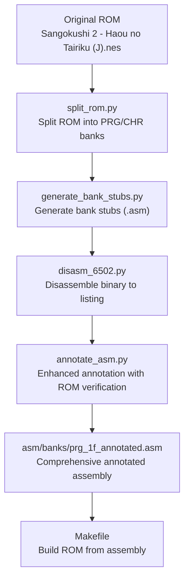
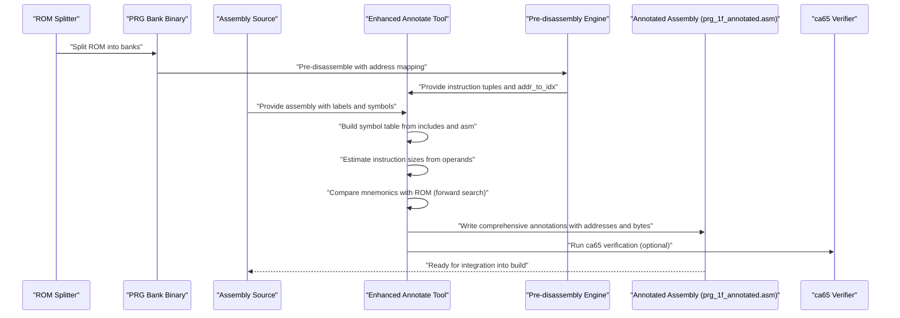
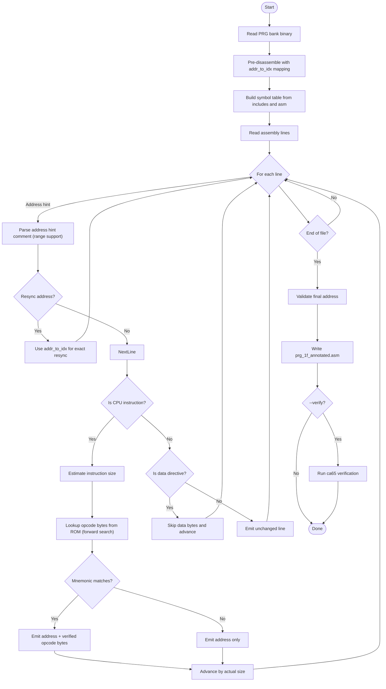
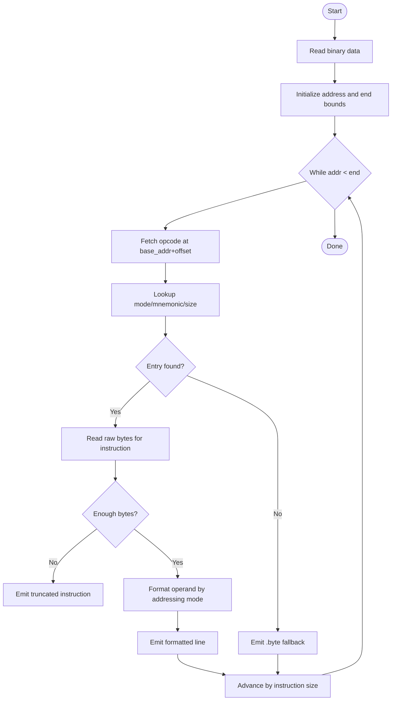
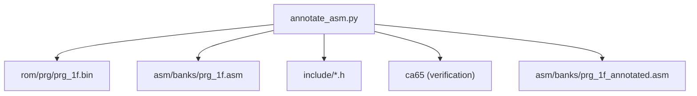

# Code Annotation and Documentation Tools

<cite>
**Referenced Files in This Document**
- [annotate_asm.py](file://tools/annotate_asm.py)
- [disasm_6502.py](file://tools/disasm_6502.py)
- [generate_bank_stubs.py](file://tools/generate_bank_stubs.py)
- [split_rom.py](file://tools/split_rom.py)
- [analyze_bank_1f.py](file://tools/analyze_bank_1f.py)
- [PROJECT.md](file://PROJECT.md)
- [Makefile](file://Makefile)
- [prg_1f.asm](file://asm/banks/prg_1f.asm)
- [prg_1f_annotated.asm](file://asm/banks/prg_1f_annotated.asm)
- [macros.h](file://include/macros.h)
</cite>

## Update Summary
**Changes Made**
- Enhanced annotate_asm.py with improved ROM address tracking using pre-disassembly and address-to-index mapping
- Added opcode verification capabilities with forward search for ROM alignment
- Updated output file naming to use prg_1f_annotated.asm by default
- Improved address hint parsing with range support and section header resynchronization
- Enhanced verification process with ca65 integration

## Table of Contents
1. [Introduction](#introduction)
2. [Project Structure](#project-structure)
3. [Core Components](#core-components)
4. [Architecture Overview](#architecture-overview)
5. [Detailed Component Analysis](#detailed-component-analysis)
6. [Dependency Analysis](#dependency-analysis)
7. [Performance Considerations](#performance-considerations)
8. [Troubleshooting Guide](#troubleshooting-guide)
9. [Conclusion](#conclusion)
10. [Appendices](#appendices)

## Introduction
This document describes the automated annotation system that enhances assembly code readability and maintainability for the Sangokushi 2 - Haou no Tairiku (J) NES disassembly project. The system has been enhanced with improved ROM address tracking, opcode verification capabilities, and comprehensive assembly annotation output. It explains how comments, labels, and cross-references are automatically generated and integrated into the assembly code, documents the annotation algorithms, data source integration, and output formatting, and demonstrates practical usage within the broader disassembly workflow. The goal is to improve code comprehension, streamline maintenance, and support collaborative reverse engineering efforts.

## Project Structure
The project organizes the disassembly pipeline around a set of tools and assets:
- ROM splitting and bank generation produce binary banks for analysis.
- Disassembly tools convert binaries into human-readable assembly listings.
- The enhanced annotation tool overlays ROM addresses and opcode bytes onto annotated assembly with improved accuracy.
- Documentation and analysis scripts provide insights into function boundaries, data tables, and bank switching patterns.
- Build automation integrates annotated assembly back into a full ROM.

**Diagram sources**
- [split_rom.py:1-140](file://tools/split_rom.py#L1-L140)
- [generate_bank_stubs.py:1-53](file://tools/generate_bank_stubs.py#L1-L53)
- [disasm_6502.py:1-363](file://tools/disasm_6502.py#L1-L363)
- [annotate_asm.py:1-599](file://tools/annotate_asm.py#L1-L599)
- [Makefile:1-102](file://Makefile#L1-L102)

**Section sources**
- [PROJECT.md:14-47](file://PROJECT.md#L14-L47)
- [Makefile:50-75](file://Makefile#L50-L75)

## Core Components
- **Enhanced Annotate Assembly Tool**: Reads a PRG bank binary and an assembly file, performs pre-disassembly with address-to-index mapping, estimates instruction sizes from operand text, resolves symbols, compares mnemonics against the ROM with forward search verification, and annotates each instruction with its CPU address and actual opcode bytes. It supports in-place editing, backup creation, and optional verification via ca65.
- **Disassembler**: Converts a 6502 binary into a formatted listing with addresses, bytes, and mnemonics, handling various addressing modes and truncated instructions.
- **Bank Stubs Generator**: Creates assembly stub files for each PRG bank that include the corresponding binary, enabling incremental replacement with annotated code.
- **ROM Splitter**: Parses the iNES header and splits PRG/CHR ROMs into 8KB banks, generating a combined PRG file and ROM metadata.
- **Analysis Scripts**: Provide high-level insights into bank 0x1F, including vector tables, bank switching patterns, function boundaries, and data tables.

**Section sources**
- [annotate_asm.py:1-16](file://tools/annotate_asm.py#L1-L16)
- [disasm_6502.py:1-6](file://tools/disasm_6502.py#L1-L6)
- [generate_bank_stubs.py:1-6](file://tools/generate_bank_stubs.py#L1-L6)
- [split_rom.py:1-6](file://tools/split_rom.py#L1-L6)
- [analyze_bank_1f.py:1-3](file://tools/analyze_bank_1f.py#L1-L3)

## Architecture Overview
The enhanced annotation system operates as a post-processing step after disassembly and before linking. It consumes:
- The PRG bank binary (e.g., prg_1f.bin) for ground-truth opcode bytes and instruction boundaries.
- The assembly file (e.g., prg_1f.asm) for textual instructions, labels, and symbol definitions.
- Include files (e.g., macros.h, 6502_registers.h, namco163.h) for symbol resolution and macro definitions.

It produces:
- Comprehensive annotated assembly with address and opcode byte comments in prg_1f_annotated.asm.
- Optional in-place edits with .bak backups.
- Optional ca65 verification to ensure correctness.

**Diagram sources**
- [split_rom.py:38-122](file://tools/split_rom.py#L38-L122)
- [annotate_asm.py:313-338](file://tools/annotate_asm.py#L313-L338)
- [annotate_asm.py:433-435](file://tools/annotate_asm.py#L433-L435)
- [Makefile:40-44](file://Makefile#L40-L44)

## Detailed Component Analysis

### Enhanced Annotate Assembly Tool
The enhanced annotate tool performs a sophisticated line-by-line pass over the assembly file, tracking the current CPU address and aligning it with the PRG bank binary through pre-disassembly and address mapping. Key improvements include:

- **Pre-disassembly Engine**: Creates instruction tuples with address-to-index mapping for precise ROM alignment.
- **Forward Search Verification**: Searches forward up to 3 instructions to handle cases where ROM has extra instructions not present in assembly.
- **Improved Address Hint Parsing**: Supports both single address and range formats in section headers for better resynchronization.
- **Enhanced Section Header Resynchronization**: Uses addr_to_idx mapping to resync addresses exactly at instruction boundaries.
- **Comprehensive Output**: Writes to prg_1f_annotated.asm by default with full address and opcode byte annotations.

**Diagram sources**
- [annotate_asm.py:313-338](file://tools/annotate_asm.py#L313-L338)
- [annotate_asm.py:433-435](file://tools/annotate_asm.py#L433-L435)
- [annotate_asm.py:488-518](file://tools/annotate_asm.py#L488-L518)

**Section sources**
- [annotate_asm.py:23-85](file://tools/annotate_asm.py#L23-L85)
- [annotate_asm.py:93-138](file://tools/annotate_asm.py#L93-L138)
- [annotate_asm.py:143-188](file://tools/annotate_asm.py#L143-L188)
- [annotate_asm.py:191-201](file://tools/annotate_asm.py#L191-L201)
- [annotate_asm.py:220-227](file://tools/annotate_asm.py#L220-L227)
- [annotate_asm.py:230-278](file://tools/annotate_asm.py#L230-L278)
- [annotate_asm.py:283-311](file://tools/annotate_asm.py#L283-L311)
- [annotate_asm.py:313-338](file://tools/annotate_asm.py#L313-L338)
- [annotate_asm.py:412-427](file://tools/annotate_asm.py#L412-L427)
- [annotate_asm.py:448-546](file://tools/annotate_asm.py#L448-L546)
- [annotate_asm.py:579-599](file://tools/annotate_asm.py#L579-L599)

### Disassembler Tool
The disassembler converts a 6502 binary into a formatted listing with addresses, bytes, and mnemonics. It:
- Maintains an opcode table with addressing modes and cycle counts.
- Handles truncated instructions gracefully by emitting partial bytes.
- Formats operands according to addressing mode (immediate, zero-page, absolute, indexed, relative, etc.).
- Supports configurable start address, length, and base address mapping.

**Diagram sources**
- [disasm_6502.py:286-334](file://tools/disasm_6502.py#L286-L334)

**Section sources**
- [disasm_6502.py:10-87](file://tools/disasm_6502.py#L10-L87)
- [disasm_6502.py:239-284](file://tools/disasm_6502.py#L239-L284)
- [disasm_6502.py:286-334](file://tools/disasm_6502.py#L286-L334)

### Bank Stubs Generator
Generates assembly stub files for each PRG bank that include the corresponding binary. This enables incremental replacement of stubs with annotated code during the disassembly process.

**Section sources**
- [generate_bank_stubs.py:12-46](file://tools/generate_bank_stubs.py#L12-L46)

### ROM Splitter
Parses the iNES header and splits PRG/CHR ROMs into 8KB banks, generating a combined PRG file and ROM metadata.

**Section sources**
- [split_rom.py:11-36](file://tools/split_rom.py#L11-L36)
- [split_rom.py:38-122](file://tools/split_rom.py#L38-L122)

### Analysis Scripts
Provide high-level insights into bank 0x1F, including vector tables, bank switching patterns, function boundaries, and data tables.

**Section sources**
- [analyze_bank_1f.py:4-67](file://tools/analyze_bank_1f.py#L4-L67)
- [analyze_bank_1f.py:69-111](file://tools/analyze_bank_1f.py#L69-L111)
- [analyze_bank_1f.py:112-153](file://tools/analyze_bank_1f.py#L112-L153)

## Dependency Analysis
The enhanced annotation tool depends on:
- The PRG bank binary for ground-truth opcode bytes and instruction boundaries.
- The assembly source for instruction text and labels.
- Include files for symbol definitions and macro expansions.

**Diagram sources**
- [annotate_asm.py:415-426](file://tools/annotate_asm.py#L415-L426)
- [Makefile:40-44](file://Makefile#L40-L44)

**Section sources**
- [annotate_asm.py:415-426](file://tools/annotate_asm.py#L415-L426)
- [Makefile:40-44](file://Makefile#L40-L44)

## Performance Considerations
- **Enhanced Instruction Size Estimation**: Uses operand heuristics and symbol resolution; while efficient, it may require adjustments for complex addressing modes.
- **Pre-disassembly Optimization**: The tool reads the entire binary and assembly file into memory once, then uses address-to-index mapping for O(1) lookups during annotation.
- **Forward Search Algorithm**: Searches up to 3 instructions ahead to handle ROM divergence, adding minimal overhead while improving accuracy.
- **Address Hint Parsing**: Improved parsing and symbol building occur once per run; caching or incremental updates could reduce overhead in iterative workflows.
- **Verification via ca65**: Adds runtime but ensures correctness; consider conditional verification in CI or batch runs.

## Troubleshooting Guide
Common issues and resolutions:
- **Address Drift**: Use address-hint comments in assembly to resynchronize the annotation stream. The enhanced tool now supports range formats and exact resynchronization via addr_to_idx mapping.
- **Mnemonic Mismatches**: The tool now uses forward search to compare up to 3 instructions ahead, improving accuracy when ROM has extra instructions not present in assembly.
- **Symbol Resolution Failures**: Ensure include files are present and define required symbols; verify macro expansions do not interfere with symbol parsing.
- **Verification Failures**: Confirm ca65 is installed and on PATH; check include paths and segment definitions.
- **Output File Location**: The tool now writes to prg_1f_annotated.asm by default instead of overwriting the original prg_1f.asm.

**Section sources**
- [annotate_asm.py:220-227](file://tools/annotate_asm.py#L220-L227)
- [annotate_asm.py:488-518](file://tools/annotate_asm.py#L488-L518)
- [annotate_asm.py:472-487](file://tools/annotate_asm.py#L472-L487)
- [annotate_asm.py:579-599](file://tools/annotate_asm.py#L579-L599)

## Conclusion
The enhanced automated annotation system significantly improves assembly readability by overlaying precise CPU addresses and verified opcode bytes onto annotated code. The new pre-disassembly engine with address-to-index mapping, forward search verification, and comprehensive output file management provides superior accuracy and reliability. It integrates seamlessly into the disassembly workflow, supports in-place editing with backups, and provides optional verification to maintain correctness. By combining heuristic instruction sizing, symbol resolution, ROM-grounded comparisons, and advanced address tracking, it accelerates code comprehension, simplifies maintenance, and facilitates collaborative reverse engineering efforts.

## Appendices

### Practical Usage Examples
- **Enhanced Annotation Process**:
  - Command: `python3 tools/annotate_asm.py [--in-place] [--verify]`
  - Behavior: Reads prg_1f.bin and prg_1f.asm, performs pre-disassembly with address mapping, writes annotated output to prg_1f_annotated.asm, optionally verifies with ca65.
- **Disassemble a Binary**:
  - Command: `make disasm FILE=rom/prg/prg_1f.bin ADDR=E000 LEN=1024`
  - Behavior: Produces a formatted listing suitable for manual analysis or as input to annotation.
- **Generate Bank Stubs**:
  - Command: `make banks`
  - Behavior: Creates prg_XX.asm stubs that include the corresponding binary for each PRG bank.
- **Split ROM**:
  - Command: `make split`
  - Behavior: Splits the original ROM into PRG/CHR banks and generates rom_info.h and prg_combined.bin.

**Section sources**
- [annotate_asm.py:9-16](file://tools/annotate_asm.py#L9-L16)
- [Makefile:64-66](file://Makefile#L64-L66)
- [Makefile:51-53](file://Makefile#L51-L53)
- [Makefile:55-57](file://Makefile#L55-L57)

### Customization Options
- **In-place Editing**: Use --in-place to overwrite the original assembly file with a .bak backup.
- **Verification**: Use --verify to run ca65 on the annotated output and confirm assembly success.
- **Include Paths**: The tool searches include directories for symbol definitions; ensure include paths are correct.
- **Output File**: The tool now writes to prg_1f_annotated.asm by default instead of overwriting prg_1f.asm.

**Section sources**
- [annotate_asm.py:420-427](file://tools/annotate_asm.py#L420-L427)
- [annotate_asm.py:579-599](file://tools/annotate_asm.py#L579-L599)

### Relationship to Disassembly Workflow
- **Enhanced Workflow**: Start with ROM splitting and bank stub generation, disassemble selected banks to obtain initial listings, replace stubs with enhanced annotated assembly for improved readability, integrate annotated assembly into the build system, and verify byte-exact matches with the enhanced verification process.

**Section sources**
- [PROJECT.md:134-151](file://PROJECT.md#L134-L151)
- [Makefile:51-75](file://Makefile#L51-L75)