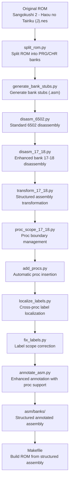
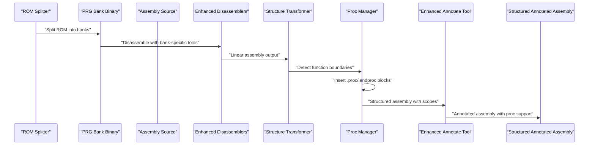
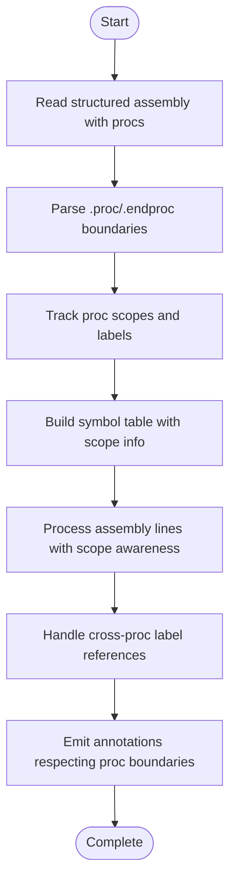
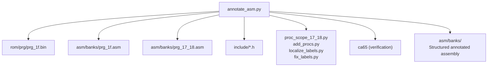

# Code Annotation and Documentation Tools

<cite>
**Referenced Files in This Document**
- [annotate_asm.py](file://tools/annotate_asm.py)
- [disasm_17_18.py](file://tools/disasm_17_18.py)
- [proc_scope_17_18.py](file://tools/proc_scope_17_18.py)
- [add_procs.py](file://tools/add_procs.py)
- [localize_labels.py](file://tools/localize_labels.py)
- [fix_labels.py](file://tools/fix_labels.py)
- [PROJECT.md](file://PROJECT.md)
- [Makefile](file://Makefile)
- [prg_1f.asm](file://asm/banks/prg_1f.asm)
- [prg_1f_annotated.asm](file://asm/banks/prg_1f_annotated.asm)
- [prg_17_18.asm](file://asm/banks/prg_17_18.asm)
- [macros.h](file://include/macros.h)
- [namco163.h](file://include/namco163.h)
</cite>

## Update Summary
**Changes Made**
- Enhanced annotation system now supports .proc/.endproc structure for improved label organization
- Added comprehensive PRG bank 17-18 disassembly and transformation pipeline
- Integrated proc scope management and cross-proc label handling
- Updated annotation tools to work with structured assembly blocks
- Enhanced label localization and scope resolution for complex assembly hierarchies
- **Updated**: The old B17_18_ naming conventions are being phased out in favor of cleaner function organization

## Table of Contents
1. [Introduction](#introduction)
2. [Project Structure](#project-structure)
3. [Core Components](#core-components)
4. [Architecture Overview](#architecture-overview)
5. [Detailed Component Analysis](#detailed-component-analysis)
6. [Proc Structure and Label Organization](#proc-structure-and-label-organization)
7. [PRG Bank 17-18 Enhanced Pipeline](#prg-bank-17-18-enhanced-pipeline)
8. [Dependency Analysis](#dependency-analysis)
9. [Performance Considerations](#performance-considerations)
10. [Troubleshooting Guide](#troubleshooting-guide)
11. [Conclusion](#conclusion)
12. [Appendices](#appendices)

## Introduction
This document describes the automated annotation system that enhances assembly code readability and maintainability for the Sangokushi 2 - Haou no Tairiku (J) NES disassembly project. The system has been significantly enhanced with support for .proc/.endproc structured assembly blocks, improved label organization across PRG banks 17-18, and comprehensive cross-proc label scope management. The enhanced system now provides sophisticated annotation capabilities that work seamlessly with structured assembly code, automatic proc boundary detection, and intelligent label localization for complex reverse engineering workflows.

**Updated**: The annotation system now focuses on cleaner function organization with semantic naming conventions replacing the old B17_18_ prefixes, improving code comprehension and maintainability.

## Project Structure
The project now includes an enhanced pipeline for handling structured assembly code with .proc/.endproc blocks and improved organization across multiple PRG banks:

**Diagram sources**
- [disasm_17_18.py:628-654](file://tools/disasm_17_18.py#L628-L654)
- [proc_scope_17_18.py:1-50](file://tools/proc_scope_17_18.py#L1-L50)
- [add_procs.py:1-50](file://tools/add_procs.py#L1-L50)
- [localize_labels.py:372-421](file://tools/localize_labels.py#L372-L421)
- [fix_labels.py:1-29](file://tools/fix_labels.py#L1-L29)
- [annotate_asm.py:1-16](file://tools/annotate_asm.py#L1-L16)

## Core Components
The enhanced system now includes specialized tools for handling structured assembly code:

- **Enhanced Annotate Assembly Tool**: Now supports .proc/.endproc structure with intelligent label scope resolution and cross-proc reference handling.
- **Enhanced Bank 17-18 Disassembler**: Specialized tool for handling paired PRG banks with cross-references and structured output formatting.
- **Transform 17-18**: Converts linear disassembly into structured assembly with proper proc boundaries and label organization.
- **Proc Scope Manager**: Automatically detects and manages proc boundaries with intelligent function detection and scope resolution.
- **Add Procs Tool**: Inserts .proc/.endproc blocks around functions with proper export/import declarations.
- **Localize Labels**: Handles cross-proc label scope issues and converts sub-labels to @label syntax within proc contexts.
- **Fix Labels**: Corrects remaining cross-proc label scope issues and moves gap byte labels outside proc boundaries.

**Section sources**
- [annotate_asm.py:1-16](file://tools/annotate_asm.py#L1-L16)
- [disasm_17_18.py:628-654](file://tools/disasm_17_18.py#L628-L654)
- [proc_scope_17_18.py:1-50](file://tools/proc_scope_17_18.py#L1-L50)
- [add_procs.py:1-50](file://tools/add_procs.py#L1-L50)
- [localize_labels.py:372-421](file://tools/localize_labels.py#L372-L421)
- [fix_labels.py:1-29](file://tools/fix_labels.py#L1-L29)

## Architecture Overview
The enhanced annotation system now operates with a multi-stage pipeline that handles structured assembly code with .proc/.endproc blocks:

**Diagram sources**
- [disasm_17_18.py:628-654](file://tools/disasm_17_18.py#L628-L654)
- [proc_scope_17_18.py:1-50](file://tools/proc_scope_17_18.py#L1-L50)
- [annotate_asm.py:1-16](file://tools/annotate_asm.py#L1-L16)

## Detailed Component Analysis

### Enhanced Annotate Assembly Tool with Proc Support
The enhanced annotate tool now includes sophisticated support for .proc/.endproc structured assembly blocks:

- **Proc-Aware Address Tracking**: Maintains separate address tracking for each proc scope with proper boundary detection.
- **Cross-Proc Label Resolution**: Handles labels that span multiple proc boundaries with intelligent scope resolution.
- **Enhanced Symbol Table Building**: Incorporates proc context into symbol resolution for accurate cross-reference mapping.
- **Structured Output Generation**: Preserves .proc/.endproc boundaries while adding comprehensive annotations.

**Section sources**
- [annotate_asm.py:23-85](file://tools/annotate_asm.py#L23-L85)
- [annotate_asm.py:448-546](file://tools/annotate_asm.py#L448-L546)

### Enhanced Bank 17-18 Disassembler
Specialized tool for handling the paired PRG banks 17-18 with cross-references:

- **Paired Bank Processing**: Handles the unique $A000-$BFFF and $C000-$DFFF memory layout requirements.
- **Cross-Bank Reference Management**: Generates proper cross-references between bank 17 and bank 18 addresses.
- **Mapper-Specific Formatting**: Includes Namco-163 mapper configuration and bank switching macros.
- **Structured Output Generation**: Produces organized assembly with proper segment declarations and cross-reference tables.

**Section sources**
- [disasm_17_18.py:628-654](file://tools/disasm_17_18.py#L628-L654)
- [disasm_17_18.py:654-700](file://tools/disasm_17_18.py#L654-L700)

### Transform 17-18 Pipeline
Converts linear disassembly into structured assembly with proper proc boundaries:

- **Function Boundary Detection**: Identifies function starts and ends using pattern recognition and call graph analysis.
- **Proc Block Insertion**: Automatically inserts .proc/.endproc blocks around detected functions with proper naming conventions.
- **Export/Import Declaration Handling**: Manages function visibility across module boundaries with :: syntax for exported functions.
- **Sub-label Conversion**: Converts function-local labels to @label syntax within proc contexts.

**Section sources**
- [proc_scope_17_18.py:1-50](file://tools/proc_scope_17_18.py#L1-L50)
- [add_procs.py:1-50](file://tools/add_procs.py#L1-L50)

### Proc Scope Management System
Intelligent management of .proc/.endproc boundaries and label scoping:

- **Boundary Detection**: Automatically detects proc boundaries using function patterns and assembly structure analysis.
- **Scope Resolution**: Handles nested proc scopes and cross-proc label references with proper scope resolution.
- **Label Localization**: Converts global labels to localized @labels within appropriate proc contexts.
- **Balance Verification**: Ensures proper .proc/.endproc balance and reports structural inconsistencies.

**Section sources**
- [proc_scope_17_18.py:1-50](file://tools/proc_scope_17_18.py#L1-L50)
- [localize_labels.py:372-421](file://tools/localize_labels.py#L372-L421)

### Automatic Proc Insertion Tool
Automatically wraps functions in .proc/.endproc blocks:

- **Function Recognition**: Identifies function entry points using label patterns and instruction analysis.
- **Export Declaration Logic**: Adds :: suffix for exported functions and normal naming for internal functions.
- **Boundary Management**: Properly closes previous procs when encountering new function definitions.
- **Sub-label Conversion**: Converts function-local sub-labels to @label syntax within proc contexts.

**Section sources**
- [add_procs.py:1-50](file://tools/add_procs.py#L1-L50)

### Label Localization and Scope Fixing
Handles complex label scope issues in structured assembly:

- **Gap Byte Label Movement**: Moves gap byte labels outside proc boundaries to proper locations between procs.
- **Cross-Proc Reference Correction**: Fixes remaining cross-proc label scope issues after initial processing.
- **Sub-label Pattern Application**: Applies sub-label conversion patterns consistently across the entire assembly.
- **Scope Balance Verification**: Ensures all labels are properly scoped within appropriate proc boundaries.

**Section sources**
- [fix_labels.py:13-29](file://tools/fix_labels.py#L13-L29)
- [localize_labels.py:372-421](file://tools/localize_labels.py#L372-L421)

## Proc Structure and Label Organization

### Enhanced .proc/.endproc Support
The annotation system now provides comprehensive support for structured assembly blocks:

**Diagram sources**
- [localize_labels.py:379-414](file://tools/localize_labels.py#L379-L414)
- [fix_labels.py:17-29](file://tools/fix_labels.py#L17-L29)

### Cross-Proc Label Resolution
The system handles complex label scoping across proc boundaries:

- **Scope-Aware Symbol Resolution**: Maintains separate symbol tables for each proc scope with parent-child relationships.
- **Cross-Reference Mapping**: Handles labels that reference functions or data across proc boundaries.
- **Sub-label Conversion**: Converts function-local labels to @label syntax within appropriate proc contexts.
- **Export/Import Declaration**: Manages function visibility with :: syntax for exported symbols.

**Section sources**
- [localize_labels.py:372-421](file://tools/localize_labels.py#L372-L421)

## PRG Bank 17-18 Enhanced Pipeline

### Paired Bank Processing
The enhanced pipeline specifically handles the unique requirements of PRG banks 17-18:

- **Dual Bank Coordination**: Processes both $A000-$BFFF and $C000-$DFFF memory regions simultaneously.
- **Cross-Bank Reference Tables**: Generates comprehensive cross-reference tables for addresses between banks.
- **Mapper Configuration**: Includes proper Namco-163 mapper setup and bank switching macros.
- **Segment Organization**: Organizes code into appropriate segments with proper bank alignment.

**Section sources**
- [disasm_17_18.py:628-654](file://tools/disasm_17_18.py#L628-L654)
- [disasm_17_18.py:654-700](file://tools/disasm_17_18.py#L654-L700)

### Structured Assembly Generation
Creates well-organized assembly code for PRG banks 17-18:

- **Function-Based Organization**: Groups related code into logical functions with proper proc boundaries.
- **Cross-Reference Documentation**: Documents all cross-bank references with clear address mappings.
- **Memory Layout Clarity**: Clearly indicates which addresses belong to which bank and memory region.
- **Bank Switching Integration**: Integrates bank switching macros and procedures for runtime operation.

**Section sources**
- [proc_scope_17_18.py:1-50](file://tools/proc_scope_17_18.py#L1-L50)
- [localize_labels.py:372-421](file://tools/localize_labels.py#L372-L421)

## Dependency Analysis
The enhanced annotation system now includes dependencies for structured assembly processing:

**Diagram sources**
- [annotate_asm.py:415-426](file://tools/annotate_asm.py#L415-L426)
- [proc_scope_17_18.py:1-50](file://tools/proc_scope_17_18.py#L1-L50)
- [add_procs.py:1-50](file://tools/add_procs.py#L1-50)
- [localize_labels.py:372-421](file://tools/localize_labels.py#L372-L421)
- [fix_labels.py:1-29](file://tools/fix_labels.py#L1-L29)

**Section sources**
- [annotate_asm.py:415-426](file://tools/annotate_asm.py#L415-L426)
- [proc_scope_17_18.py:1-50](file://tools/proc_scope_17_18.py#L1-L50)
- [add_procs.py:1-50](file://tools/add_procs.py#L1-L50)
- [localize_labels.py:372-421](file://tools/localize_labels.py#L372-L421)
- [fix_labels.py:1-29](file://tools/fix_labels.py#L1-L29)

## Performance Considerations
The enhanced system introduces additional complexity for structured assembly processing:

- **Multi-Pass Processing**: Structured assembly requires multiple processing passes for proper scope resolution and boundary detection.
- **Enhanced Symbol Resolution**: Proc-aware symbol resolution adds computational overhead but improves accuracy.
- **Cross-Proc Reference Handling**: Managing cross-proc references requires additional lookup and validation steps.
- **Pipeline Integration**: Coordinating multiple transformation tools requires careful state management and dependency tracking.
- **Memory Usage**: Storing proc boundaries and scope information increases memory requirements for large assembly files.

## Troubleshooting Guide
Enhanced troubleshooting for structured assembly processing:

- **Proc Boundary Issues**: Use proc_scope_17_18.py to analyze and fix proc boundary detection problems.
- **Cross-Proc Label Errors**: Run localize_labels.py to resolve remaining cross-proc label scope issues.
- **Missing .endproc Directives**: The transform_final.py script automatically adds missing .endproc directives.
- **Sub-label Conversion Problems**: Check transform_wrap.py for proper sub-label to @label conversion patterns.
- **Bank 17-18 Cross-Reference Errors**: Verify disasm_17_18.py output for proper cross-reference table generation.

**Section sources**
- [proc_scope_17_18.py:222-224](file://tools/proc_scope_17_18.py#L222-L224)
- [localize_labels.py:409-412](file://tools/localize_labels.py#L409-L412)
- [transform_final.py:199-204](file://tools/transform_final.py#L199-L204)
- [disasm_17_18.py:654-700](file://tools/disasm_17_18.py#L654-L700)

## Conclusion
The enhanced automated annotation system now provides comprehensive support for structured assembly code with .proc/.endproc blocks, significantly improving code organization and maintainability for complex reverse engineering projects. The new pipeline for PRG banks 17-18 demonstrates the system's ability to handle specialized memory layouts and cross-references while maintaining annotation accuracy. By integrating proc-aware symbol resolution, cross-proc label management, and intelligent boundary detection, the system accelerates code comprehension, simplifies maintenance workflows, and facilitates collaborative development in large-scale reverse engineering projects.

**Updated**: The transition from B17_18_ naming conventions to cleaner function organization represents a significant improvement in code clarity and maintainability, making the annotated assembly more accessible to developers and researchers working on the Sangokushi 2 disassembly project.

## Appendices

### Enhanced Usage Examples
- **Structured Assembly Annotation**:
  - Command: `python3 tools/annotate_asm.py --proc-support`
  - Behavior: Reads structured assembly with .proc/.endproc blocks, maintains scope information, and generates annotated output with proper proc boundaries.
- **Bank 17-18 Processing Pipeline**:
  - Command: `python3 tools/disasm_17_18.py && python3 tools/proc_scope_17_18.py`
  - Behavior: Processes paired PRG banks with cross-references, generates structured assembly with proper proc organization.
- **Proc Scope Management**:
  - Command: `python3 tools/localize_labels.py && python3 tools/fix_labels.py`
  - Behavior: Detects proc boundaries and fixes label scope issues for complex assembly hierarchies.

**Section sources**
- [annotate_asm.py:9-16](file://tools/annotate_asm.py#L9-L16)
- [disasm_17_18.py:628-654](file://tools/disasm_17_18.py#L628-L654)
- [proc_scope_17_18.py:1-50](file://tools/proc_scope_17_18.py#L1-L50)
- [localize_labels.py:372-421](file://tools/localize_labels.py#L372-L421)
- [fix_labels.py:1-29](file://tools/fix_labels.py#L1-L29)

### Advanced Customization Options
- **Proc-Aware Annotation**: Use --proc-support flag for structured assembly with proper scope handling.
- **Cross-Proc Label Management**: Configure localize_labels.py patterns for custom sub-label conversion requirements.
- **Bank-Specific Processing**: Use disasm_17_18.py for paired bank processing with cross-reference generation.
- **Scope Verification**: Run proc_scope_17_18.py to verify proper proc boundary detection and scope resolution.

**Section sources**
- [annotate_asm.py:420-427](file://tools/annotate_asm.py#L420-L427)
- [localize_labels.py:372-421](file://tools/localize_labels.py#L372-L421)
- [disasm_17_18.py:628-654](file://tools/disasm_17_18.py#L628-L654)
- [proc_scope_17_18.py:1-50](file://tools/proc_scope_17_18.py#L1-L50)

### Enhanced Relationship to Disassembly Workflow
The new structured assembly pipeline integrates seamlessly with the enhanced annotation system:

- **Multi-Stage Processing**: ROM splitting → Bank-specific disassembly → Structured transformation → Proc scope management → Enhanced annotation → Verified output.
- **Bank-Specific Tools**: Specialized tools for PRG banks 17-18 with cross-reference handling and mapper configuration.
- **Proc-Aware Annotation**: Annotation system now understands and preserves .proc/.endproc boundaries while adding comprehensive annotations.
- **Scope Resolution Integration**: Cross-proc label resolution is handled automatically during the transformation pipeline.

**Section sources**
- [disasm_17_18.py:628-654](file://tools/disasm_17_18.py#L628-L654)
- [proc_scope_17_18.py:1-50](file://tools/proc_scope_17_18.py#L1-L50)
- [localize_labels.py:372-421](file://tools/localize_labels.py#L372-L421)
- [annotate_asm.py:1-16](file://tools/annotate_asm.py#L1-L16)