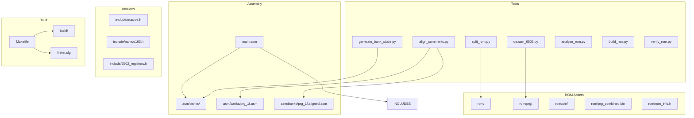
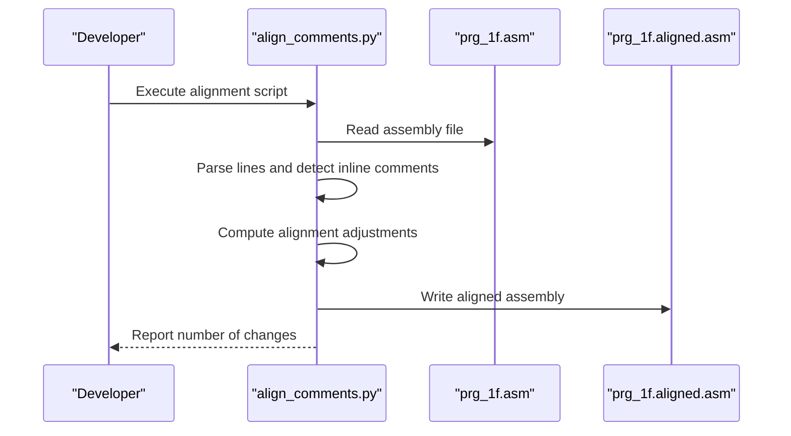
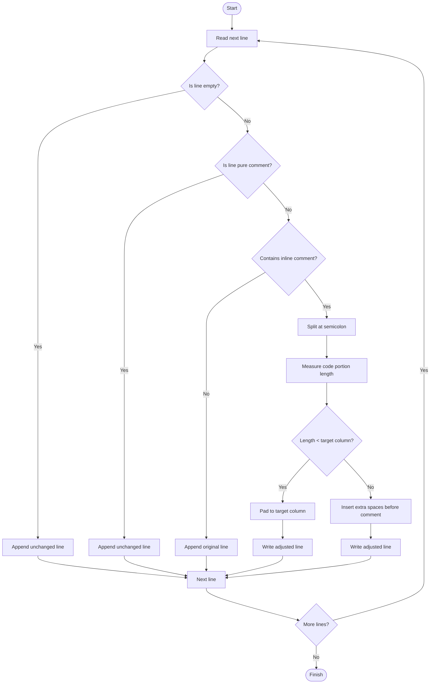
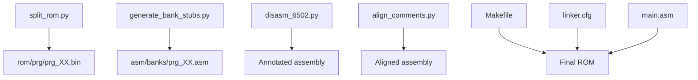
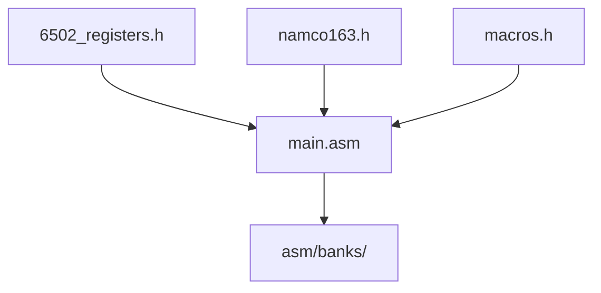
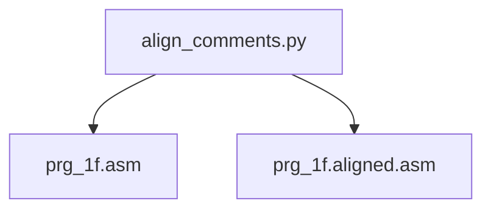

# Comment Alignment Tool

<cite>
**Referenced Files in This Document**
- [align_comments.py](file://tools/align_comments.py)
- [prg_1f.asm](file://asm/banks/prg_1f.asm)
- [prg_1f.aligned.asm](file://asm/banks/prg_1f.aligned.asm)
- [PROJECT.md](file://PROJECT.md)
- [Makefile](file://Makefile)
- [linker.cfg](file://linker.cfg)
- [disasm_6502.py](file://tools/disasm_6502.py)
- [generate_bank_stubs.py](file://tools/generate_bank_stubs.py)
- [split_rom.py](file://tools/split_rom.py)
- [analyze_rom.py](file://tools/analyze_rom.py)
- [main.asm](file://asm/main.asm)
- [macros.h](file://include/macros.h)
- [namco163.h](file://include/namco163.h)
- [6502_registers.h](file://include/6502_registers.h)
</cite>

## Table of Contents
1. [Introduction](#introduction)
2. [Project Structure](#project-structure)
3. [Core Components](#core-components)
4. [Architecture Overview](#architecture-overview)
5. [Detailed Component Analysis](#detailed-component-analysis)
6. [Dependency Analysis](#dependency-analysis)
7. [Performance Considerations](#performance-considerations)
8. [Troubleshooting Guide](#troubleshooting-guide)
9. [Conclusion](#conclusion)

## Introduction
This document describes the Comment Alignment Tool, a focused utility designed to standardize inline comment placement in the Namco-163 disassembly project for Sangokushi 2 - Haou no Tairiku (J). The tool ensures that inline comments in the assembly source are aligned to a consistent column, improving readability and maintainability during the reverse engineering process. It operates specifically on the Bank 1F assembly file, which contains the reset handler and central dispatch logic for the game.

The tool is part of a larger disassembly workflow that includes ROM splitting, bank stub generation, disassembly, and verification against the original ROM. The Comment Alignment Tool complements these activities by enforcing a uniform presentation of inline commentary, which is essential when analyzing complex 6502 assembly code with frequent cross-references and technical notes.

**Section sources**
- [PROJECT.md:1-181](file://PROJECT.md#L1-L181)

## Project Structure
The project follows a conventional structure for a cc65-based NES disassembly:
- Tools: Python scripts for ROM manipulation, disassembly, analysis, and build support
- Assembly: Bank stubs and main entry point assembly files
- Includes: Header files defining hardware registers and macros
- ROM assets: Split PRG/CHR banks and combined binaries
- Build: Makefile targets and linker configuration

**Diagram sources**
- [Makefile:1-102](file://Makefile#L1-L102)
- [linker.cfg:1-55](file://linker.cfg#L1-L55)
- [PROJECT.md:14-47](file://PROJECT.md#L14-L47)

**Section sources**
- [PROJECT.md:14-47](file://PROJECT.md#L14-L47)
- [Makefile:1-102](file://Makefile#L1-L102)
- [linker.cfg:1-55](file://linker.cfg#L1-L55)

## Core Components
The Comment Alignment Tool consists of a single-purpose Python script that:
- Reads the Bank 1F assembly file
- Identifies lines containing inline comments
- Computes the current column position of the code portion
- Adjusts whitespace to align comments to a fixed column boundary
- Writes the modified content to a new output file
- Reports the number of changed lines

Key characteristics:
- Fixed alignment column: 48
- Ignores empty lines and pure comment lines
- Preserves existing indentation for code and comment parts
- Operates only on lines with inline semicolon-delimited comments
- Produces a new output file to avoid overwriting the original

**Section sources**
- [align_comments.py:1-48](file://tools/align_comments.py#L1-L48)

## Architecture Overview
The Comment Alignment Tool participates in the broader disassembly pipeline as follows:
- ROM splitting and bank generation establish the baseline assembly files
- Disassembly produces annotated listings that require post-processing for readability
- The alignment tool standardizes comment placement for improved legibility
- The build system integrates these outputs into a working ROM

**Diagram sources**
- [align_comments.py:1-48](file://tools/align_comments.py#L1-L48)
- [prg_1f.asm:1-200](file://asm/banks/prg_1f.asm#L1-L200)

**Section sources**
- [align_comments.py:1-48](file://tools/align_comments.py#L1-L48)
- [PROJECT.md:134-151](file://PROJECT.md#L134-L151)

## Detailed Component Analysis

### Comment Alignment Algorithm
The alignment process follows a deterministic flow:
- Skip empty lines and pure comment lines
- Locate the semicolon that introduces the inline comment
- Measure the length of the code portion (excluding trailing whitespace)
- If the code portion is shorter than the target column, pad with spaces
- If the code portion exceeds the target column, insert a double-space separator before the comment
- Preserve original line endings and whitespace around the comment

**Diagram sources**
- [align_comments.py:11-43](file://tools/align_comments.py#L11-L43)

**Section sources**
- [align_comments.py:11-43](file://tools/align_comments.py#L11-L43)

### Integration with Disassembly Workflow
The alignment tool fits into the disassembly workflow as follows:
- Bank stubs are generated to provide a starting point for each PRG bank
- Bank 1F is disassembled to produce the initial annotated listing
- Inline comments are aligned to improve readability
- The aligned listing is reviewed and refined iteratively
- The build system links the final assembly into a ROM image

**Diagram sources**
- [split_rom.py:38-122](file://tools/split_rom.py#L38-L122)
- [generate_bank_stubs.py:12-46](file://tools/generate_bank_stubs.py#L12-L46)
- [disasm_6502.py:286-334](file://tools/disasm_6502.py#L286-L334)
- [align_comments.py:5-47](file://tools/align_comments.py#L5-L47)
- [Makefile:38-48](file://Makefile#L38-L48)
- [linker.cfg:32-54](file://linker.cfg#L32-L54)
- [main.asm:25-141](file://asm/main.asm#L25-L141)

**Section sources**
- [PROJECT.md:134-151](file://PROJECT.md#L134-L151)
- [split_rom.py:38-122](file://tools/split_rom.py#L38-L122)
- [generate_bank_stubs.py:12-46](file://tools/generate_bank_stubs.py#L12-L46)
- [disasm_6502.py:286-334](file://tools/disasm_6502.py#L286-L334)
- [align_comments.py:5-47](file://tools/align_comments.py#L5-L47)
- [Makefile:38-48](file://Makefile#L38-L48)
- [linker.cfg:32-54](file://linker.cfg#L32-L54)
- [main.asm:25-141](file://asm/main.asm#L25-L141)

### Hardware and Macro Context
The alignment tool operates on assembly code that uses hardware register definitions and macros. Understanding these contexts helps ensure that comments remain meaningful and accurate after alignment:
- Register definitions provide semantic context for addresses and bitfields
- Macros encapsulate common operations, reducing the cognitive load when reading code
- Bank switching macros are crucial for understanding memory-mapped behavior

**Diagram sources**
- [6502_registers.h:1-88](file://include/6502_registers.h#L1-L88)
- [namco163.h:1-87](file://include/namco163.h#L1-L87)
- [macros.h:1-72](file://include/macros.h#L1-L72)
- [main.asm:6-141](file://asm/main.asm#L6-L141)

**Section sources**
- [6502_registers.h:1-88](file://include/6502_registers.h#L1-L88)
- [namco163.h:1-87](file://include/namco163.h#L1-L87)
- [macros.h:1-72](file://include/macros.h#L1-L72)
- [main.asm:6-141](file://asm/main.asm#L6-L141)

## Dependency Analysis
The Comment Alignment Tool has minimal external dependencies and interacts primarily with the assembly file system:
- Input: Bank 1F assembly file
- Output: Aligned assembly file
- No runtime dependencies beyond standard Python libraries

**Diagram sources**
- [align_comments.py:5-47](file://tools/align_comments.py#L5-L47)

**Section sources**
- [align_comments.py:5-47](file://tools/align_comments.py#L5-L47)

## Performance Considerations
The alignment tool processes a single assembly file linearly:
- Time complexity: O(n) with respect to the number of lines
- Space complexity: O(n) for storing the output buffer
- I/O operations: Single read and single write to disk
- Practical considerations: The tool is fast enough to run frequently during development without impacting workflow

[No sources needed since this section provides general guidance]

## Troubleshooting Guide
Common issues and resolutions:
- Incorrect target column: The tool uses a fixed column value; verify that the desired alignment matches project standards
- Unexpected changes: Review the diff between the original and aligned files to confirm that only spacing was altered
- File permissions: Ensure write access to the assembly directory for the output file
- Mixed indentation: The tool preserves existing indentation; if tabs and spaces are mixed, consider normalizing whitespace beforehand

**Section sources**
- [align_comments.py:31-42](file://tools/align_comments.py#L31-L42)

## Conclusion
The Comment Alignment Tool provides a simple yet effective mechanism to standardize inline comment placement in the Bank 1F assembly file. By enforcing consistent alignment, it improves readability and supports collaborative analysis of the 6502 disassembly. Integrated into the broader disassembly workflow, the tool contributes to a cleaner, more maintainable codebase that reflects the project's commitment to accuracy and clarity.

[No sources needed since this section summarizes without analyzing specific files]