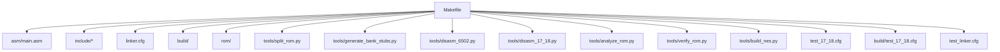
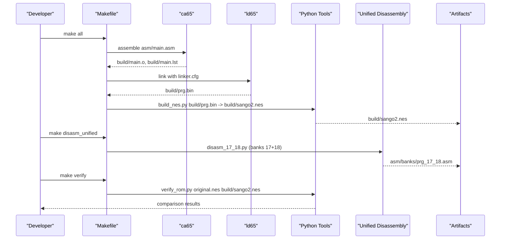
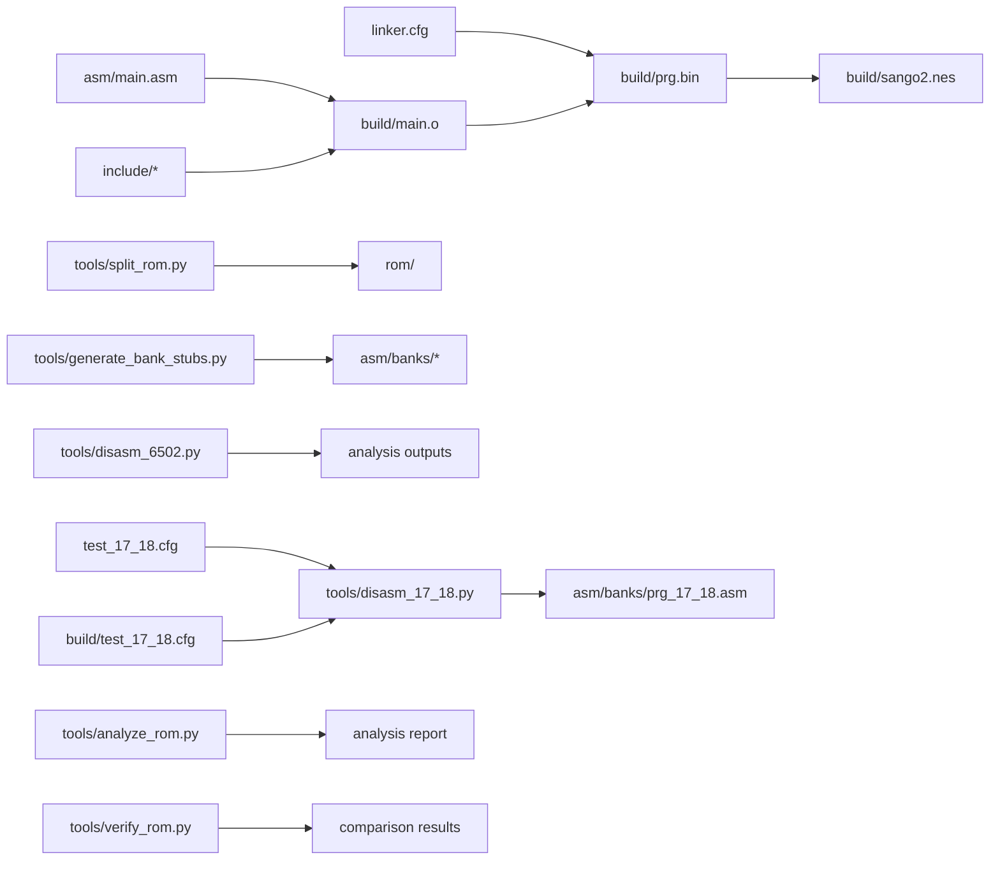

# Makefile Targets and Usage

<cite>
**Referenced Files in This Document**
- [Makefile](file://Makefile)
- [PROJECT.md](file://PROJECT.md)
- [linker.cfg](file://linker.cfg)
- [test_17_18.cfg](file://test_17_18.cfg)
- [build/test_17_18.cfg](file://build/test_17_18.cfg)
- [test_linker.cfg](file://test_linker.cfg)
- [asm/banks/prg_17_18.asm](file://asm/banks/prg_17_18.asm)
- [tools/disasm_17_18.py](file://tools/disasm_17_18.py)
- [tools/disasm_6502.py](file://tools/disasm_6502.py)
- [asm/main.asm](file://asm/main.asm)
- [include/macros.h](file://include/macros.h)
- [include/namco163.h](file://include/namco163.h)
- [tools/split_rom.py](file://tools/split_rom.py)
- [tools/generate_bank_stubs.py](file://tools/generate_bank_stubs.py)
- [tools/analyze_rom.py](file://tools/analyze_rom.py)
- [tools/verify_rom.py](file://tools/verify_rom.py)
- [tools/build_nes.py](file://tools/build_nes.py)
</cite>

## Update Summary
**Changes Made**
- Added documentation for new test_17_18.cfg configuration file for combined bank structure testing
- Updated unified disassembly workflow targeting banks 17 and 18
- Enhanced Makefile targets section with new configuration files and disassembly capabilities
- Added comprehensive coverage of the new prg_17_18.asm combined assembly file

## Table of Contents
1. [Introduction](#introduction)
2. [Project Structure](#project-structure)
3. [Core Components](#core-components)
4. [Architecture Overview](#architecture-overview)
5. [Detailed Component Analysis](#detailed-component-analysis)
6. [Dependency Analysis](#dependency-analysis)
7. [Performance Considerations](#performance-considerations)
8. [Troubleshooting Guide](#troubleshooting-guide)
9. [Conclusion](#conclusion)

## Introduction
This document explains the complete build orchestration system centered around the Makefile. It covers all targets, their purpose, dependencies, execution flow, and practical usage. It also documents toolchain integration with ca65 and ld65, flag configurations, directory structure management, and the relationship between targets in the development workflow. The system now includes enhanced support for unified disassembly workflows targeting paired PRG banks 17 and 18, along with new configuration files for testing combined bank structures.

## Project Structure
The project follows a layered structure with enhanced support for unified disassembly:
- Source assembly and includes under asm/ and include/
- Build outputs under build/ with new test configurations
- ROM split outputs under rom/
- Tools under tools/ implementing ROM splitting, disassembly, analysis, verification, and ROM building
- Linker configuration under linker.cfg and new test configurations under build/
- Unified disassembly support for paired banks 17 and 18

**Diagram sources**
- [Makefile:1-102](file://Makefile#L1-L102)
- [PROJECT.md:14-47](file://PROJECT.md#L14-L47)
- [test_17_18.cfg:1-9](file://test_17_18.cfg#L1-L9)
- [build/test_17_18.cfg:1-11](file://build/test_17_18.cfg#L1-L11)

**Section sources**
- [PROJECT.md:14-47](file://PROJECT.md#L14-L47)

## Core Components
- Toolchain: ca65 and ld65 from cc65 are invoked with configured flags and directories.
- Build artifacts: prg.bin (raw PRG output), sango2.nes (final ROM), and intermediate files (object, listing, map).
- Directory structure: build/ with test configurations, asm/, include/, rom/, tools/.
- Linker configuration: Defines 4 PRG slots ($8000-$FFFF) and segments for code/data, plus new test configurations for unified bank disassembly.
- Unified disassembly: Specialized support for paired PRG banks 17 and 18 with combined memory mapping.

**Section sources**
- [Makefile:7-28](file://Makefile#L7-L28)
- [linker.cfg:18-58](file://linker.cfg#L18-L58)
- [test_17_18.cfg:1-9](file://test_17_18.cfg#L1-L9)
- [build/test_17_18.cfg:1-11](file://build/test_17_18.cfg#L1-L11)

## Architecture Overview
The build pipeline integrates assembly, linking, ROM construction, and verification with enhanced support for unified disassembly workflows. The Makefile orchestrates these steps and delegates specialized tasks to Python tools, including new unified disassembly for paired PRG banks.

**Diagram sources**
- [Makefile:30-48](file://Makefile#L30-L48)
- [tools/disasm_17_18.py:1-710](file://tools/disasm_17_18.py#L1-L710)
- [tools/build_nes.py:10-51](file://tools/build_nes.py#L10-L51)
- [tools/verify_rom.py:10-51](file://tools/verify_rom.py#L10-L51)

## Detailed Component Analysis

### Target: all (Default ROM Build)
- Purpose: Build the complete NES ROM from assembly.
- Dependencies:
  - asm/main.asm and include files
  - linker.cfg
  - build directory creation
- Execution flow:
  - Assemble main.asm to object file with listing
  - Link object file with linker.cfg to produce prg.bin
  - Invoke build_nes.py to add iNES header and create sango2.nes
- Expected outputs:
  - build/sango2.nes
  - build/prg.bin
  - build/main.o, build/main.lst, build/map.txt
- Practical usage:
  - make
  - Post-build: prints file size and first 16 bytes (ROM header) for quick verification

**Section sources**
- [Makefile:30-36](file://Makefile#L30-L36)
- [Makefile:37-43](file://Makefile#L37-L43)
- [tools/build_nes.py:10-51](file://tools/build_nes.py#L10-L51)

### Target: split (ROM Splitting)
- Purpose: Split the original ROM into 8KB PRG banks and 8KB CHR banks, and generate rom_info.h and prg_combined.bin.
- Dependencies: tools/split_rom.py
- Execution flow:
  - Parse iNES header to determine mapper, PRG/CHR sizes, mirroring, and battery presence
  - Split PRG into 32 banks (8KB each) and CHR into 32 banks (8KB each)
  - Generate rom_info.h with mapper, PRG/CHR counts
  - Create prg_combined.bin for convenience
- Expected outputs:
  - rom/prg/*.bin (32 PRG banks)
  - rom/chr/*.bin (32 CHR banks)
  - rom/rom_info.h
  - rom/prg_combined.bin
- Practical usage:
  - make split
  - Requires the original ROM file named as expected by the tool

**Section sources**
- [Makefile:54-56](file://Makefile#L54-L56)
- [tools/split_rom.py:38-122](file://tools/split_rom.py#L38-L122)

### Target: banks (Bank Stub Generation)
- Purpose: Generate PRG bank stub assembly files for all 32 banks and an include file aggregating them.
- Dependencies: tools/generate_bank_stubs.py
- Execution flow:
  - Create asm/banks directory if missing
  - Generate prg_00.asm through prg_1f.asm, each including rom/prg/prg_xx.bin
  - Generate all_banks.asm to include all bank files
- Expected outputs:
  - asm/banks/prg_00.asm through asm/banks/prg_1f.asm
  - asm/banks/all_banks.asm
- Practical usage:
  - make banks
  - After generation, replace .incbin with actual disassembled code and update linker.cfg

**Section sources**
- [Makefile:50-52](file://Makefile#L50-L52)
- [tools/generate_bank_stubs.py:12-46](file://tools/generate_bank_stubs.py#L12-L46)

### Target: disasm (Targeted Disassembly)
- Purpose: Disassemble a binary region to ca65 assembly format for initial analysis.
- Dependencies: tools/disasm_6502.py
- Execution flow:
  - Read binary file
  - Disassemble from start address for given length
  - Optionally remap base address for file-to-memory mapping
- Command-line parameters:
  - FILE: path to binary (e.g., rom/prg/prg_1f.bin)
  - ADDR: start CPU address (e.g., E000)
  - LEN: number of bytes to disassemble (e.g., 256)
- Practical usage:
  - make disasm FILE=rom/prg/prg_1f.bin ADDR=E000 LEN=256
  - Typical usage: disassemble reset handler in bank 0x1F

**Section sources**
- [Makefile:63-65](file://Makefile#L63-L65)
- [tools/disasm_6502.py:1-363](file://tools/disasm_6502.py#L1-L363)

### Target: disasm_unified (Unified Disassembly for Banks 17-18)
- Purpose: Perform unified disassembly of paired PRG banks 17 and 18 ($A000-$DFFF) using specialized recursive descent analysis.
- Dependencies: tools/disasm_17_18.py, test_17_18.cfg, build/test_17_18.cfg
- Execution flow:
  - Load prg_17.bin and prg_18.bin from rom/prg/
  - Combine 8KB banks into 16KB combined buffer
  - Initialize RecursiveDescentDisassembler with combined data
  - Trace code from entry points including jump tables and discovered patterns
  - Generate prg_17_18.asm with cross-references and inline tables
  - Create separate output files for bank 17 and bank 18
- Configuration files:
  - test_17_18.cfg: Memory layout for combined bank testing
  - build/test_17_18.cfg: Linker configuration for unified bank disassembly
- Expected outputs:
  - asm/banks/prg_17_18.asm (combined assembly)
  - Individual bank assembly files in asm/banks/
- Practical usage:
  - make disasm_unified
  - Requires split ROM to be generated first (make split)

**Updated** Added new unified disassembly target for paired PRG banks 17 and 18

**Section sources**
- [Makefile:63-65](file://Makefile#L63-L65)
- [tools/disasm_17_18.py:1-710](file://tools/disasm_17_18.py#L1-L710)
- [test_17_18.cfg:1-9](file://test_17_18.cfg#L1-L9)
- [build/test_17_18.cfg:1-11](file://build/test_17_18.cfg#L1-L11)

### Target: analyze (ROM Analysis)
- Purpose: Analyze ROM structure to identify banks, code density, and potential entry points.
- Dependencies: tools/analyze_rom.py
- Execution flow:
  - Parse iNES header
  - Iterate through PRG banks counting non-zero/0xFF bytes and counting JSR/RTI
  - Detect potential reset markers and interrupt vectors
- Practical usage:
  - make analyze
  - Provides guidance on next steps for disassembly

**Section sources**
- [Makefile:67-69](file://Makefile#L67-L69)
- [tools/analyze_rom.py:10-128](file://tools/analyze_rom.py#L10-L128)

### Target: verify (Verification Against Original)
- Purpose: Byte-exact comparison between the built ROM and the original ROM.
- Dependencies: tools/verify_rom.py
- Execution flow:
  - Read original and rebuilt ROMs
  - Compare lengths and iterate to count mismatches
  - Report total mismatches and accuracy percentage
- Practical usage:
  - make verify
  - Use after editing bank stubs to track progress

**Section sources**
- [Makefile:58-61](file://Makefile#L58-L61)
- [tools/verify_rom.py:10-51](file://tools/verify_rom.py#L10-L51)

### Target: clean (Artifact Cleanup)
- Purpose: Remove build artifacts (object, listing, map, prg.bin, sango2.nes).
- Dependencies: build directory contents
- Execution flow:
  - Delete *.o, *.lst, *.txt in build/
  - Delete prg.bin and sango2.nes
- Practical usage:
  - make clean

**Section sources**
- [Makefile:71-75](file://Makefile#L71-L75)

### Target: distclean (Complete Cleanup)
- Purpose: Remove all generated files including ROM dumps.
- Dependencies: clean target plus rom/ directory
- Execution flow:
  - Invoke clean
  - Remove rom/ directory
- Practical usage:
  - make distclean

**Section sources**
- [Makefile:77-80](file://Makefile#L77-L80)

## Dependency Analysis
The Makefile orchestrates a clear dependency chain with enhanced support for unified disassembly:
- all depends on $(OUTPUT) which depends on $(PRG_BIN)
- $(PRG_BIN) depends on asm/main.asm, include files, and linker.cfg
- $(OUTPUT) depends on $(PRG_BIN) and is produced by build_nes.py
- disasm_unified depends on split ROM and uses specialized configuration files
- Other targets (split, banks, disasm, analyze, verify) are independent and support the workflow

**Diagram sources**
- [Makefile:37-48](file://Makefile#L37-L48)
- [tools/build_nes.py:10-51](file://tools/build_nes.py#L10-L51)
- [tools/disasm_17_18.py:1-710](file://tools/disasm_17_18.py#L1-L710)

**Section sources**
- [Makefile:37-48](file://Makefile#L37-L48)

## Performance Considerations
- Assembly and linking are fast; the heaviest operations are ROM splitting and analysis.
- Using prg_combined.bin reduces repeated I/O during disassembly workflows.
- Keeping linker.cfg minimal and adding segments incrementally avoids unnecessary re-linking.
- Unified disassembly for banks 17-18 requires loading 16KB combined buffers but provides more accurate cross-referencing.
- Test configurations allow isolated testing of combined bank structures without affecting main build process.

## Troubleshooting Guide
Common issues and resolutions:
- Missing toolchain:
  - Ensure ca65 and ld65 are installed and in PATH. The Makefile expects them under CC65_HOME/bin.
- Incorrect toolchain path:
  - Adjust CC65_HOME in Makefile if cc65 is installed elsewhere.
- Missing include files:
  - Ensure include/6502_registers.h, include/namco163.h, include/macros.h exist.
- Linker errors:
  - Verify linker.cfg defines all required segments for the banks you disassemble.
  - Ensure segments are placed in the correct PRG slots ($8000-$FFFF).
  - For unified disassembly, ensure test_17_18.cfg and build/test_17_18.cfg are properly configured.
- Bank stubs not included:
  - Confirm all_banks.asm includes all prg_*.asm files.
- Disassembly mismatches:
  - Use make disasm with correct ADDR and LEN for targeted regions.
  - Use make verify to quantify differences and track progress.
  - For unified disassembly, ensure both prg_17.bin and prg_18.bin are available in rom/prg/.
- ROM size mismatch:
  - build_nes.py pads PRG to 16KB multiples; ensure original ROM expectations align.
- Unified disassembly failures:
  - Verify that split ROM has been generated (make split) before running unified disassembly.
  - Check that test_17_18.cfg and build/test_17_18.cfg are accessible and properly formatted.

Environment setup checklist:
- Install cc65 (ca65, ld65)
- Install Python 3.x
- Ensure tools/ scripts are executable
- Place original ROM file as expected by tools
- For unified disassembly: ensure rom/prg/ contains prg_17.bin and prg_18.bin

**Section sources**
- [Makefile:4-10](file://Makefile#L4-L10)
- [PROJECT.md:49-57](file://PROJECT.md#L49-L57)

## Conclusion
The Makefile provides a robust, modular build system integrating assembly, linking, ROM construction, and verification with enhanced support for unified disassembly workflows. The new test_17_18.cfg configuration and disasm_17_18.py tool enable sophisticated analysis of paired PRG banks 17 and 18, providing accurate cross-referencing and inline table detection. Targets support a structured workflow: split ROM, generate bank stubs, perform unified disassembly for critical bank pairs, analyze, and verify. By following the documented dependencies, parameters, and troubleshooting steps, developers can efficiently manage the disassembly process and maintain byte-exact fidelity to the original ROM while leveraging the new unified disassembly capabilities for complex bank interactions.