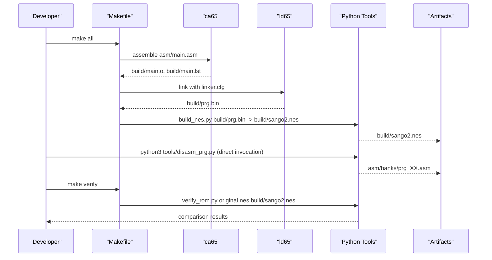
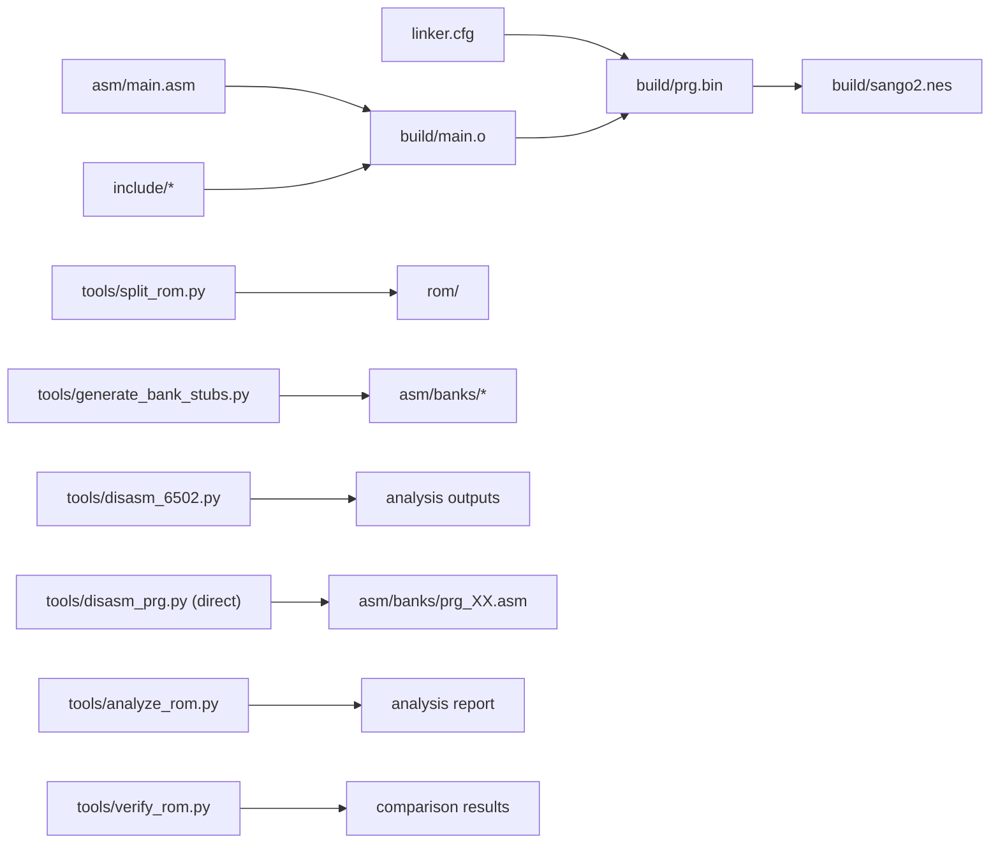

# Makefile Targets and Usage

<cite>
**Referenced Files in This Document**
- [Makefile](file://Makefile)
- [PROJECT.md](file://PROJECT.md)
- [linker.cfg](file://linker.cfg)
- [test_17_18.cfg](file://test_17_18.cfg)
- [build/test_17_18.cfg](file://build/test_17_18.cfg)
- [test_linker.cfg](file://test_linker.cfg)
- [asm/banks/prg_17_18.asm](file://asm/banks/prg_17_18.asm)
- [tools/disasm_17_18.py](file://tools/disasm_17_18.py)
- [tools/disasm_6502.py](file://tools/disasm_6502.py)
- [tools/analyze_17_18.py](file://tools/analyze_17_18.py)
- [tools/proc_scope_17_18.py](file://tools/proc_scope_17_18.py)
- [tools/transform_17_18.py](file://tools/transform_17_18.py)
- [tools/add_procs.py](file://tools/add_procs.py)
- [tools/align_comments.py](file://tools/align_comments.py)
- [tools/annotate_asm.py](file://tools/annotate_asm.py)
- [tools/localize_labels.py](file://tools/localize_labels.py)
- [asm/main.asm](file://asm/main.asm)
- [include/macros.h](file://include/macros.h)
- [include/namco163.h](file://include/namco163.h)
- [tools/split_rom.py](file://tools/split_rom.py)
- [tools/generate_bank_stubs.py](file://tools/generate_bank_stubs.py)
- [tools/analyze_rom.py](file://tools/analyze_rom.py)
- [tools/verify_rom.py](file://tools/verify_rom.py)
- [tools/build_nes.py](file://tools/build_nes.py)
</cite>

## Update Summary
**Changes Made**
- Corrected documentation to reflect actual Makefile targets (removed non-existent disasm_unified and transform_17_18 targets)
- Updated tool references to match the actual tools/ directory contents
- Documented the specialized bank-pair disassembly tools (disasm_prg.py, disasm_0a_0b.py, disasm_17_18.py, etc.) that are run directly via python3 rather than through Makefile targets

## Table of Contents
1. [Introduction](#introduction)
2. [Project Structure](#project-structure)
3. [Core Components](#core-components)
4. [Architecture Overview](#architecture-overview)
5. [Detailed Component Analysis](#detailed-component-analysis)
6. [Dependency Analysis](#dependency-analysis)
7. [Performance Considerations](#performance-considerations)
8. [Troubleshooting Guide](#troubleshooting-guide)
9. [Conclusion](#conclusion)

## Introduction
This document explains the complete build orchestration system centered around the Makefile. It covers all targets, their purpose, dependencies, execution flow, and practical usage. It also documents toolchain integration with ca65 and ld65, flag configurations, directory structure management, and the relationship between targets in the development workflow. Specialized bank-pair disassembly and transformation tools (e.g., disasm_prg.py, disasm_17_18.py, transform_17_18.py) are run directly via python3 rather than through Makefile targets.

## Project Structure
The project follows a layered structure:
- Source assembly and includes under asm/ and include/ (including include/functions.h for symbolic labels)
- Build outputs under build/
- ROM split outputs under rom/
- Tools under tools/ implementing ROM splitting, disassembly, analysis, verification, ROM building, and automated transformation pipelines
- Linker configuration under linker.cfg
- Specialized bank-pair disassembly tools (disasm_prg.py, disasm_0a_0b.py, disasm_17_18.py, disasm_1d*.py, disasm_1e*.py) are invoked directly via python3

```mermaid
graph TB
A["Makefile"] --> B["asm/main.asm"]
A --> C["include/*"]
A --> D["linker.cfg"]
A --> E["build/"]
A --> F["rom/"]
A --> G["tools/split_rom.py"]
A --> H["tools/generate_bank_stubs.py"]
A --> I["tools/disasm_6502.py"]
A --> J["tools/analyze_rom.py"]
A --> K["tools/verify_rom.py"]
A --> L["tools/build_nes.py"]
DIRECT["Direct python3 invocation"] --> M["tools/disasm_prg.py"]
DIRECT --> N["tools/disasm_0a_0b.py"]
DIRECT --> O["tools/disasm_17_18.py"]
DIRECT --> P["tools/disasm_1d*.py / disasm_1e*.py"]
DIRECT --> Q["tools/transform_17_18.py"]
DIRECT --> R["tools/proc_wrap_general.py"]
```

**Diagram sources**
- [Makefile:1-102](file://Makefile#L1-L102)
- [PROJECT.md:14-47](file://PROJECT.md#L14-L47)

**Section sources**
- [PROJECT.md:14-47](file://PROJECT.md#L14-L47)

## Core Components
- Toolchain: ca65 and ld65 from cc65 are invoked with configured flags and directories.
- Build artifacts: prg.bin (raw PRG output), sango2.nes (final ROM), and intermediate files (object, listing, map).
- Directory structure: build/, asm/, include/ (including functions.h), rom/, tools/.
- Linker configuration: Defines 4 PRG slots ($8000-$FFFF) and segments for code/data, including dedicated segments for disassembled bank pairs (CODE_BANK0A/0B, CODE_BANK0C/0D, CODE_BANK17/18, CODE_BANK1F).
- Specialized bank-pair disassembly tools are run directly via python3 (not Makefile targets).

**Section sources**
- [Makefile:7-28](file://Makefile#L7-L28)
- [linker.cfg:18-65](file://linker.cfg#L18-L65)

## Architecture Overview
The build pipeline integrates assembly, linking, ROM construction, and verification. The Makefile orchestrates these steps and delegates specialized tasks to Python tools. Bank-specific disassembly and transformation tools are invoked directly via python3.

**Diagram sources**
- [Makefile:30-48](file://Makefile#L30-L48)
- [tools/build_nes.py:10-51](file://tools/build_nes.py#L10-L51)
- [tools/verify_rom.py:10-51](file://tools/verify_rom.py#L10-L51)

## Detailed Component Analysis

### Target: all (Default ROM Build)
- Purpose: Build the complete NES ROM from assembly.
- Dependencies:
  - asm/main.asm and include files
  - linker.cfg
  - build directory creation
- Execution flow:
  - Assemble main.asm to object file with listing
  - Link object file with linker.cfg to produce prg.bin
  - Invoke build_nes.py to add iNES header and create sango2.nes
- Expected outputs:
  - build/sango2.nes
  - build/prg.bin
  - build/main.o, build/main.lst, build/map.txt
- Practical usage:
  - make
  - Post-build: prints file size and first 16 bytes (ROM header) for quick verification

**Section sources**
- [Makefile:30-36](file://Makefile#L30-L36)
- [Makefile:37-43](file://Makefile#L37-L43)
- [tools/build_nes.py:10-51](file://tools/build_nes.py#L10-L51)

### Target: split (ROM Splitting)
- Purpose: Split the original ROM into 8KB PRG banks and 8KB CHR banks, and generate rom_info.h and prg_combined.bin.
- Dependencies: tools/split_rom.py
- Execution flow:
  - Parse iNES header to determine mapper, PRG/CHR sizes, mirroring, and battery presence
  - Split PRG into 32 banks (8KB each) and CHR into 32 banks (8KB each)
  - Generate rom_info.h with mapper, PRG/CHR counts
  - Create prg_combined.bin for convenience
- Expected outputs:
  - rom/prg/*.bin (32 PRG banks)
  - rom/chr/*.bin (32 CHR banks)
  - rom/rom_info.h
  - rom/prg_combined.bin
- Practical usage:
  - make split
  - Requires the original ROM file named as expected by the tool

**Section sources**
- [Makefile:54-56](file://Makefile#L54-L56)
- [tools/split_rom.py:38-122](file://tools/split_rom.py#L38-L122)

### Target: banks (Bank Stub Generation)
- Purpose: Generate PRG bank stub assembly files for all 32 banks and an include file aggregating them.
- Dependencies: tools/generate_bank_stubs.py
- Execution flow:
  - Create asm/banks directory if missing
  - Generate prg_00.asm through prg_1f.asm, each including rom/prg/prg_xx.bin
  - Generate all_banks.asm to include all bank files
- Expected outputs:
  - asm/banks/prg_00.asm through asm/banks/prg_1f.asm
  - asm/banks/all_banks.asm
- Practical usage:
  - make banks
  - After generation, replace .incbin with actual disassembled code and update linker.cfg

**Section sources**
- [Makefile:50-52](file://Makefile#L50-L52)
- [tools/generate_bank_stubs.py:12-46](file://tools/generate_bank_stubs.py#L12-L46)

### Target: disasm (Targeted Disassembly)
- Purpose: Disassemble a binary region to ca65 assembly format for initial analysis.
- Dependencies: tools/disasm_6502.py
- Execution flow:
  - Read binary file
  - Disassemble from start address for given length
  - Optionally remap base address for file-to-memory mapping
- Command-line parameters:
  - FILE: path to binary (e.g., rom/prg/prg_1f.bin)
  - ADDR: start CPU address (e.g., E000)
  - LEN: number of bytes to disassemble (e.g., 256)
- Practical usage:
  - make disasm FILE=rom/prg/prg_1f.bin ADDR=E000 LEN=256
  - Typical usage: disassemble reset handler in bank 0x1F

**Section sources**
- [Makefile:63-65](file://Makefile#L63-L65)
- [tools/disasm_6502.py:1-363](file://tools/disasm_6502.py#L1-L363)

### Target: analyze (ROM Analysis)
- Purpose: Analyze ROM structure to identify banks, code density, and potential entry points.
- Dependencies: tools/analyze_rom.py
- Execution flow:
  - Parse iNES header
  - Iterate through PRG banks counting non-zero/0xFF bytes and counting JSR/RTI
  - Detect potential reset markers and interrupt vectors
- Practical usage:
  - make analyze
  - Provides guidance on next steps for disassembly

**Section sources**
- [Makefile:67-69](file://Makefile#L67-L69)
- [tools/analyze_rom.py:10-128](file://tools/analyze_rom.py#L10-L128)

### Target: verify (Verification Against Original)
- Purpose: Byte-exact comparison between the built ROM and the original ROM.
- Dependencies: tools/verify_rom.py
- Execution flow:
  - Read original and rebuilt ROMs
  - Compare lengths and iterate to count mismatches
  - Report total mismatches and accuracy percentage
- Practical usage:
  - make verify
  - Use after editing bank stubs to track progress

**Section sources**
- [Makefile:58-61](file://Makefile#L58-L61)
- [tools/verify_rom.py:10-51](file://tools/verify_rom.py#L10-L51)

### Target: clean (Artifact Cleanup)
- Purpose: Remove build artifacts (object, listing, map, prg.bin, sango2.nes).
- Dependencies: build directory contents
- Execution flow:
  - Delete *.o, *.lst, *.txt in build/
  - Delete prg.bin and sango2.nes
- Practical usage:
  - make clean

**Section sources**
- [Makefile:71-75](file://Makefile#L71-L75)

### Target: distclean (Complete Cleanup)
- Purpose: Remove all generated files including ROM dumps.
- Dependencies: clean target plus rom/ directory
- Execution flow:
  - Invoke clean
  - Remove rom/ directory
- Practical usage:
  - make distclean

**Section sources**
- [Makefile:77-80](file://Makefile#L77-L80)

## Dependency Analysis
The Makefile orchestrates a clear dependency chain:
- all depends on $(OUTPUT) which depends on $(PRG_BIN)
- $(PRG_BIN) depends on asm/main.asm, include files (including functions.h), and linker.cfg
- $(OUTPUT) depends on $(PRG_BIN) and is produced by build_nes.py
- Other targets (split, banks, disasm, analyze, verify) are independent and support the workflow
- Specialized bank-pair tools (disasm_prg.py, disasm_0a_0b.py, disasm_17_18.py, etc.) are invoked directly via python3

**Diagram sources**
- [Makefile:37-48](file://Makefile#L37-L48)
- [tools/build_nes.py:10-51](file://tools/build_nes.py#L10-L51)

**Section sources**
- [Makefile:37-48](file://Makefile#L37-L48)

## Performance Considerations
- Assembly and linking are fast; the heaviest operations are ROM splitting and analysis.
- Using prg_combined.bin reduces repeated I/O during disassembly workflows.
- Keeping linker.cfg minimal and adding segments incrementally avoids unnecessary re-linking.
- Specialized bank-pair disassembly tools load 16KB combined buffers for accurate cross-referencing.
- Automated transformation tools (proc_wrap_general.py, localize_labels.py) reduce manual effort in code modernization.

## Troubleshooting Guide
Common issues and resolutions:
- Missing toolchain:
  - Ensure ca65 and ld65 are installed and in PATH. The Makefile expects them under CC65_HOME/bin.
- Incorrect toolchain path:
  - Adjust CC65_HOME in Makefile if cc65 is installed elsewhere.
- Missing include files:
  - Ensure include/6502_registers.h, include/namco163.h, include/macros.h, and include/functions.h exist.
- Linker errors:
  - Verify linker.cfg defines all required segments for the banks you disassemble.
  - Ensure segments are placed in the correct PRG slots ($8000-$FFFF).
- Bank stubs not included:
  - Confirm all_banks.asm includes all prg_*.asm files.
- Disassembly mismatches:
  - Use make disasm with correct ADDR and LEN for targeted regions.
  - Use make verify to quantify differences and track progress.
- ROM size mismatch:
  - build_nes.py pads PRG to 16KB multiples; ensure original ROM expectations align.

Environment setup checklist:
- Install cc65 (ca65, ld65)
- Install Python 3.x
- Ensure tools/ scripts are executable
- Place original ROM file as expected by tools

**Section sources**
- [Makefile:4-10](file://Makefile#L4-L10)
- [PROJECT.md:49-57](file://PROJECT.md#L49-L57)

## Conclusion
The Makefile provides a robust, modular build system integrating assembly, linking, ROM construction, and verification. Specialized bank-pair disassembly tools (disasm_prg.py, disasm_0a_0b.py, disasm_17_18.py, disasm_1d*.py, disasm_1e*.py) and transformation tools (transform_17_18.py, proc_wrap_general.py, localize_labels.py) are invoked directly via python3 rather than through Makefile targets. Targets support a structured workflow: split ROM, generate bank stubs, disassemble, analyze, and verify. By following the documented dependencies, parameters, and troubleshooting steps, developers can efficiently manage the disassembly process and maintain byte-exact fidelity to the original ROM.