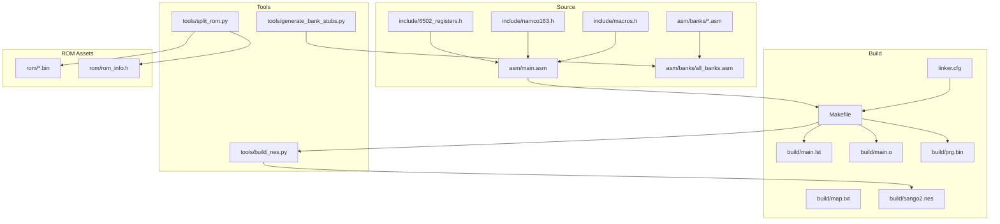
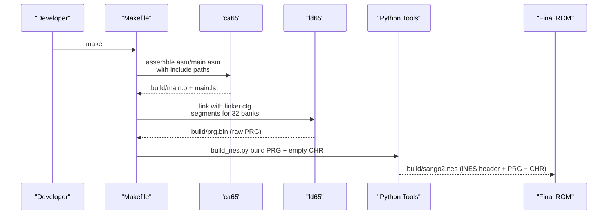
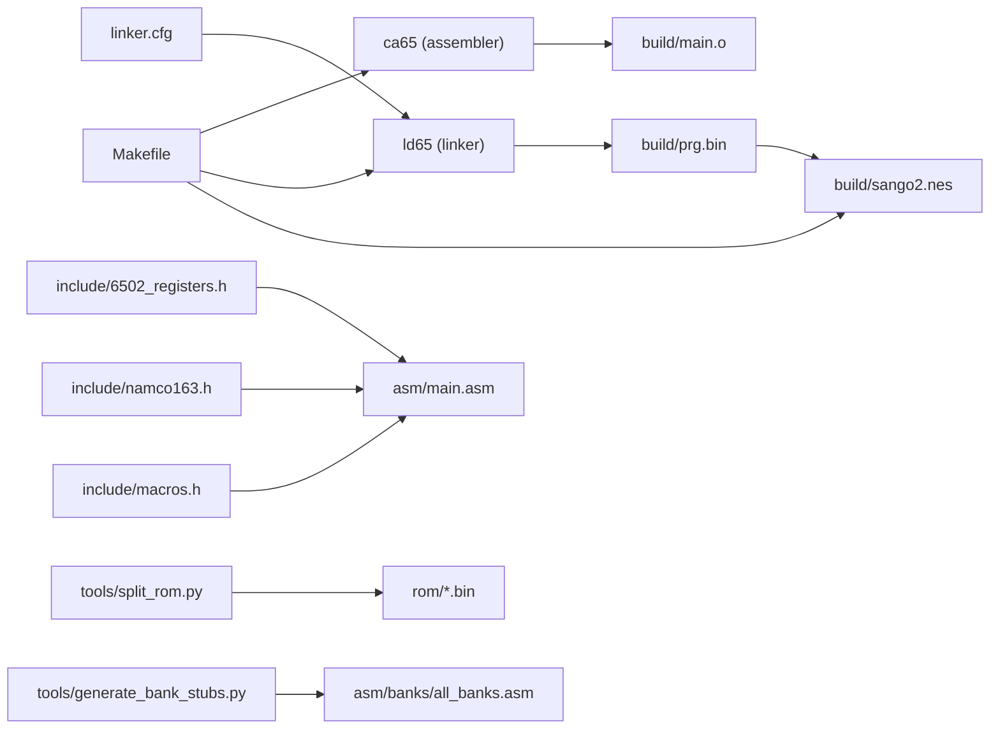
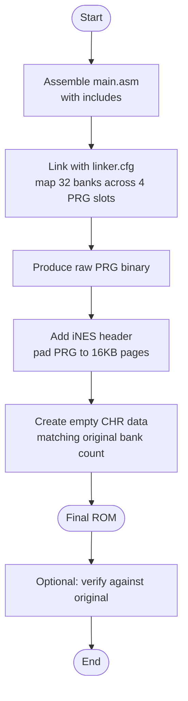

# ROM Generation and Linking Process

<cite>
**Referenced Files in This Document**
- [Makefile](file://Makefile)
- [linker.cfg](file://linker.cfg)
- [PROJECT.md](file://PROJECT.md)
- [asm/main.asm](file://asm/main.asm)
- [tools/build_nes.py](file://tools/build_nes.py)
- [include/namco163.h](file://include/namco163.h)
- [include/macros.h](file://include/macros.h)
- [asm/banks/all_banks.asm](file://asm/banks/all_banks.asm)
- [asm/banks/prg_00.asm](file://asm/banks/prg_00.asm)
- [asm/banks/prg_1e.asm](file://asm/banks/prg_1e.asm)
- [asm/banks/prg_1f.asm](file://asm/banks/prg_1f.asm)
- [asm/banks/prg_0c_0d.asm](file://asm/banks/prg_0c_0d.asm)
- [tools/generate_bank_stubs.py](file://tools/generate_bank_stubs.py)
- [tools/split_rom.py](file://tools/split_rom.py)
- [build/main.lst](file://build/main.lst)
</cite>

## Update Summary
**Changes Made**
- Updated linker configuration section to reflect new CODE_BANK0C and CODE_BANK0D segments
- Modified banked code and segment strategy section to document the combined bank architecture
- Updated build system description to show streamlined include structure
- Enhanced memory layout documentation to explain the 16KB combined bank approach

## Table of Contents
1. [Introduction](#introduction)
2. [Project Structure](#project-structure)
3. [Core Components](#core-components)
4. [Architecture Overview](#architecture-overview)
5. [Detailed Component Analysis](#detailed-component-analysis)
6. [Dependency Analysis](#dependency-analysis)
7. [Performance Considerations](#performance-considerations)
8. [Troubleshooting Guide](#troubleshooting-guide)
9. [Conclusion](#conclusion)
10. [Appendices](#appendices)

## Introduction
This document explains the complete ROM generation pipeline for transforming assembly code into a final NES ROM for a Namco-163 (Mapper 19) game. It covers:
- Assembly-to-object compilation using ca65
- Linking with ld65 and the linker configuration
- Final ROM creation with iNES header and CHR data integration
- Memory mapping strategy, bank switching configuration, and how the linker resolves symbols across 32 PRG banks
- Practical build flow, intermediate file formats, and the role of each component

## Project Structure
The project organizes the build around a Makefile-driven workflow, a cc65-based assembler/linker toolchain, and a set of Python utilities for ROM manipulation and analysis. Key directories and roles:
- asm/: Assembly sources, including main entry and per-bank stubs
- include/: Shared 6502 and mapper definitions
- rom/: Split PRG/CHR banks and ROM metadata
- tools/: Utilities for splitting ROMs, generating bank stubs, building final ROMs, and verification
- build/: Intermediate outputs (object, listing, map)
- linker.cfg: Defines memory layout and segment assignments for 32 PRG banks

**Diagram sources**
- [Makefile:1-102](file://Makefile#L1-L102)
- [linker.cfg:1-66](file://linker.cfg#L1-L66)
- [tools/build_nes.py:1-58](file://tools/build_nes.py#L1-L58)
- [tools/split_rom.py:1-140](file://tools/split_rom.py#L1-L140)
- [tools/generate_bank_stubs.py:1-53](file://tools/generate_bank_stubs.py#L1-L53)
- [asm/banks/all_banks.asm:1-34](file://asm/banks/all_banks.asm#L1-L34)

**Section sources**
- [Makefile:1-102](file://Makefile#L1-L102)
- [PROJECT.md:14-47](file://PROJECT.md#L14-L47)

## Core Components
- Assembly sources: Entry point and global code live in main.asm; per-bank stubs are included via all_banks.asm and mapped into 32 PRG banks during linking.
- Linker configuration: Defines 4 PRG slots and segment assignments that accommodate up to 32 banks by assigning segments to each slot.
- ROM builder: Adds an iNES header and pads PRG data to 16KB pages, while creating empty CHR data matching the original ROM's bank count.
- Bank stub generator: Creates per-bank .asm stubs that include the original binary for incremental disassembly and replacement.
- ROM splitter: Splits an existing ROM into 8KB PRG banks and 8KB CHR banks, generating rom_info.h and a combined PRG binary.

**Section sources**
- [asm/main.asm:1-141](file://asm/main.asm#L1-L141)
- [linker.cfg:18-66](file://linker.cfg#L18-L66)
- [tools/build_nes.py:10-58](file://tools/build_nes.py#L10-L58)
- [tools/generate_bank_stubs.py:12-53](file://tools/generate_bank_stubs.py#L12-L53)
- [tools/split_rom.py:38-122](file://tools/split_rom.py#L38-L122)

## Architecture Overview
The pipeline transforms assembly into a ROM in three stages:
1) Assemble and link to produce a raw PRG binary
2) Add iNES header and pad to 16KB pages, append empty CHR data
3) Integrate banked code across 32 PRG banks using segment mapping and bank switching

**Diagram sources**
- [Makefile:38-48](file://Makefile#L38-L48)
- [tools/build_nes.py:10-58](file://tools/build_nes.py#L10-L58)

## Detailed Component Analysis

### Assembly-to-Object Compilation (ca65)
- The Makefile invokes ca65 with include directories and generates a listing file for debugging and verification.
- The main assembly file defines zero page, BSS, code, and interrupt vectors, and includes mapper and macro headers.
- The listing file (build/main.lst) contains symbol definitions and cross-references useful for debugging.

Key behaviors:
- Includes for 6502 registers, Namco-163 definitions, and common macros
- Segment declarations for ZEROPAGE, BSS, CODE, and VECTORS
- Interrupt vectors placed at a specific offset in PRG slot 0

**Section sources**
- [Makefile:27-41](file://Makefile#L27-L41)
- [asm/main.asm:6-141](file://asm/main.asm#L6-L141)
- [build/main.lst:1-200](file://build/main.lst#L1-L200)

### Linking Phase (ld65) and linker.cfg
- The linker configuration defines:
  - Memory regions for zero page, system RAM, and four PRG slots ($8000–$FFFF)
  - Segment assignments for CODE, VECTORS, and optional RODATA across the four slots
- The linker maps assembled code into the PRG slots and resolves symbols across banks
- The Makefile passes the linker configuration and requests a map file for symbol analysis

Memory mapping highlights:
- Four 8KB PRG slots mapped to $8000–$FFFF
- VECTORS segment starts at a fixed offset in PRG slot 0
- Optional CODE segments for additional banks as disassembly progresses

**Updated** The linker configuration now includes specialized segments for combined bank pairs, particularly CODE_BANK0C and CODE_BANK0D which map to PRG_SLOT1 and PRG_SLOT2 respectively, supporting the new combined 16KB bank architecture.

**Section sources**
- [linker.cfg:18-66](file://linker.cfg#L18-L66)
- [Makefile:28-43](file://Makefile#L28-L43)

### Banked Code and Segment Strategy
- Per-bank stubs are generated and included via all_banks.asm
- Each bank stub uses a dedicated segment name and includes the original 8KB binary
- During linking, additional segments can be added to map code into the appropriate PRG slot

**Updated** The build system has been streamlined by replacing separate prg_0c.asm and prg_0d.asm includes with a single prg_0c_0d.asm include in all_banks.asm. This combined bank approach treats banks 0C and 0D as a unified 16KB block spanning $A000-$DFFF, improving code organization and reducing build complexity.

Practical implications:
- Bank 0x1F is special: it contains the reset handler and dispatch table at $E000–$FFFF
- Bank switching is performed via mapper registers at $F800–$FE00
- Combined banks (0C+0D, 0A+0B, 17+18, 1D+1E) provide larger contiguous code sections when needed

**Section sources**
- [tools/generate_bank_stubs.py:12-53](file://tools/generate_bank_stubs.py#L12-L53)
- [asm/banks/all_banks.asm:1-34](file://asm/banks/all_banks.asm#L1-L34)
- [asm/banks/prg_00.asm:1-13](file://asm/banks/prg_00.asm#L1-L13)
- [asm/banks/prg_1e.asm:1-13](file://asm/banks/prg_1e.asm#L1-L13)
- [asm/banks/prg_1f.asm:1-800](file://asm/banks/prg_1f.asm#L1-L800)
- [asm/banks/prg_0c_0d.asm:1-800](file://asm/banks/prg_0c_0d.asm#L1-L800)

### Bank Switching and Reset Handler
- The mapper header defines bank switching registers and bank indices
- The main assembly initializes the mapper and loads initial banks
- The reset handler in bank 0x1F performs PPU/APU initialization, clears RAM, and dispatches to the current game state

Address and bank layout:
- $F800–$FE00 write addresses select 8KB banks in each slot
- Bank 0x1F is fixed at $E000–$FFFF at boot

**Section sources**
- [include/namco163.h:10-87](file://include/namco163.h#L10-L87)
- [asm/main.asm:115-121](file://asm/main.asm#L115-L121)
- [PROJECT.md:101-117](file://PROJECT.md#L101-L117)

### ROM Creation with iNES Header and CHR Integration
- The ROM builder:
  - Reads the raw PRG binary produced by the linker
  - Pads PRG to the nearest 16KB multiple (ensuring original ROM size parity)
  - Creates empty CHR data matching the original bank count
  - Writes an iNES header with Mapper 19, battery, and horizontal mirroring flags
- The resulting file is a valid NES ROM ready for testing

**Section sources**
- [tools/build_nes.py:10-58](file://tools/build_nes.py#L10-L58)

### ROM Splitting and Bank Stub Generation
- The ROM splitter:
  - Parses the iNES header to determine mapper, PRG/CHR sizes, and flags
  - Splits PRG and CHR into 8KB banks
  - Generates rom_info.h and a combined PRG binary for analysis
- The bank stub generator:
  - Creates per-bank .asm stubs that include the original binary
  - Generates all_banks.asm to include all stubs

**Section sources**
- [tools/split_rom.py:38-122](file://tools/split_rom.py#L38-L122)
- [tools/generate_bank_stubs.py:12-53](file://tools/generate_bank_stubs.py#L12-L53)

## Dependency Analysis
The build depends on:
- cc65 toolchain (ca65, ld65) and Python 3
- Assembly includes for register and mapper definitions
- Linker configuration to resolve 32 PRG banks across four PRG slots
- Python tools for ROM manipulation and bank generation

**Diagram sources**
- [Makefile:38-48](file://Makefile#L38-L48)
- [linker.cfg:18-66](file://linker.cfg#L18-L66)
- [tools/build_nes.py:10-58](file://tools/build_nes.py#L10-L58)
- [tools/split_rom.py:38-122](file://tools/split_rom.py#L38-L122)
- [tools/generate_bank_stubs.py:12-53](file://tools/generate_bank_stubs.py#L12-L53)

**Section sources**
- [Makefile:1-102](file://Makefile#L1-L102)
- [PROJECT.md:49-69](file://PROJECT.md#L49-L69)

## Performance Considerations
- Keep assembly listings minimal for faster builds; rely on the map file for symbol analysis
- Limit unnecessary re-linking by grouping related banks into segments and updating linker.cfg incrementally
- Use bank stubs to isolate work on individual banks; avoid rebuilding unrelated sections
- Ensure bank switching macros are used consistently to prevent accidental cross-slot jumps
- Combined bank architecture reduces include overhead and simplifies build dependencies

## Troubleshooting Guide
Common issues and remedies:
- Incorrect bank placement: Verify segment assignments in linker.cfg and ensure bank stubs include the correct 8KB region
- Missing or misnamed bank stubs: Regenerate stubs using the bank stub generator and confirm all_banks.asm inclusion
- Linker symbol errors: Confirm that all referenced symbols are defined within the mapped PRG slots
- ROM mismatch after rebuild: Use the verification tool to compare against the original ROM and iterate on disassembly accuracy
- Combined bank issues: When working with combined banks like 0C+0D, ensure both segments are properly linked and address calculations account for the 16KB boundary

**Section sources**
- [tools/generate_bank_stubs.py:12-53](file://tools/generate_bank_stubs.py#L12-L53)
- [tools/split_rom.py:38-122](file://tools/split_rom.py#L38-L122)
- [PROJECT.md:165-181](file://PROJECT.md#L165-L181)

## Conclusion
The ROM generation pipeline integrates cc65 assembly, ld65 linking with a carefully designed memory model, and a Python-based ROM builder to reconstruct a complete NES ROM. By leveraging banked segments, consistent bank switching macros, and modular bank stubs, the project supports scalable disassembly and precise ROM reconstruction for Mapper 19. The recent adoption of combined bank architecture further optimizes the build process and provides more flexible code organization options.

## Appendices

### Build Process Flow

**Diagram sources**
- [Makefile:38-48](file://Makefile#L38-L48)
- [tools/build_nes.py:10-58](file://tools/build_nes.py#L10-L58)

### Memory Layout and Address Calculations
- PRG slots: Four 8KB windows mapped to $8000–$FFFF
- Bank switching: Writes to $F800–$FE00 select banks for each slot
- Reset handler: Located at $E000–$FFFF in bank 0x1F at boot
- Bank stubs: Each stub maps to an 8KB window based on its bank index
- Combined banks: Special handling for paired banks (0C+0D, 0A+0B, etc.) providing 16KB contiguous sections

**Updated** The memory layout now supports combined bank pairs where two adjacent 8KB banks are treated as a single 16KB unit. For example, banks 0C and 0D together occupy $A000-$DFFF, with CODE_BANK0C mapping to PRG_SLOT1 ($A000-$BFFF) and CODE_BANK0D mapping to PRG_SLOT2 ($C000-$DFFF).

**Section sources**
- [linker.cfg:4-16](file://linker.cfg#L4-L16)
- [PROJECT.md:70-117](file://PROJECT.md#L70-L117)
- [include/namco163.h:10-16](file://include/namco163.h#L10-L16)
- [asm/banks/prg_0c_0d.asm:1-10](file://asm/banks/prg_0c_0d.asm#L1-L10)

### Combined Bank Architecture Details
The project now implements a hybrid approach combining individual 8KB banks with selected 16KB combined banks:

**Combined Bank Pairs:**
- Banks 0A+0B: Map to PRG_SLOT1 and PRG_SLOT2
- Banks 0C+0D: Map to PRG_SLOT1 and PRG_SLOT2  
- Banks 17+18: Map to PRG_SLOT1 and PRG_SLOT2
- Banks 1D+1E: Map to PRG_SLOT1 and PRG_SLOT2

**Benefits:**
- Reduced include overhead in all_banks.asm
- Simplified build dependencies
- Better code locality for related functionality
- Easier management of large code sections

**Implementation:**
- Single include files like prg_0c_0d.asm handle both banks
- Separate CODE_BANK0C and CODE_BANK0D segments in linker.cfg
- Maintains compatibility with existing 8KB bank structure

**Section sources**
- [asm/banks/all_banks.asm:15-16](file://asm/banks/all_banks.asm#L15-L16)
- [linker.cfg:52-59](file://linker.cfg#L52-L59)
- [asm/banks/prg_0c_0d.asm:1-7](file://asm/banks/prg_0c_0d.asm#L1-L7)