# ROM Verification and Validation

<cite>
**Referenced Files in This Document**
- [verify_rom.py](file://tools/verify_rom.py)
- [verify_range.py](file://tools/verify_range.py)
- [verify_1d_bytes.py](file://tools/verify_1d_bytes.py)
- [verify_0a_0b.py](file://tools/verify_0a_0b.py)
- [verify_b130_bab2.py](file://tools/verify_b130_bab2.py)
- [verify_find_region.py](file://tools/verify_find_region.py)
- [verify_coverage.py](file://tools/verify_coverage.py)
- [verify_disasm.py](file://tools/verify_disasm.py)
- [verify_f3bd_f667.py](file://tools/verify_f3bd_f667.py)
- [verify_19_1a.py](file://tools/verify_19_1a.py)
- [verify_1b_1c.py](file://tools/verify_1b_1c.py)
- [verify_0e_0f.py](file://tools/verify_0e_0f.py)
- [analyze_b517.py](file://tools/analyze_b517.py)
- [check_continuity.py](file://tools/check_continuity.py)
- [fix_asm_errors.py](file://tools/fix_asm_errors.py)
- [assemble_prg_1d_1e.py](file://tools/assemble_prg_1d_1e.py)
- [Makefile](file://Makefile)
- [build_nes.py](file://tools/build_nes.py)
- [split_rom.py](file://tools/split_rom.py)
- [disasm_6502.py](file://tools/disasm_6502.py)
- [analyze_rom.py](file://tools/analyze_rom.py)
- [generate_bank_stubs.py](file://tools/generate_bank_stubs.py)
- [linker.cfg](file://linker.cfg)
- [link_0a_0b_test.cfg](file://tools/link_0a_0b_test.cfg)
- [PROJECT.md](file://PROJECT.md)
- [prg_1d_1e.asm](file://asm/banks/prg_1d_1e.asm)
- [all_banks.asm](file://asm/banks/all_banks.asm)
- [prg_0a_0b.asm](file://asm/banks/prg_0a_0b.asm)
- [prg_19_1a.asm](file://asm/banks/prg_19_1a.asm)
- [prg_1b_1c.asm](file://asm/banks/prg_1b_1c.asm)
- [prg_0e_0f.asm](file://asm/banks/prg_0e_0f.asm)
</cite>

## Update Summary
**Changes Made**
- Added comprehensive documentation for new combined bank verification tools (verify_19_1a.py and verify_1b_1c.py) that provide zero mismatch guarantees for paired bank combinations
- Enhanced verification system with specialized tools for banks $19+$1A and $1B+$1C with automated stub generation and external reference handling
- Updated verify_0e_0f.py with external RAM global declarations for menu cursor positioning ($0424/$0425) and war scene state variables ($0500-$0501)
- Expanded verification ecosystem to include sophisticated combined bank validation with automatic assembly harness generation
- Updated verification pipeline diagrams to reflect the enhanced multi-layered validation approach with specialized tools for different ROM regions and mechanisms

## Table of Contents
1. [Introduction](#introduction)
2. [Project Structure](#project-structure)
3. [Core Components](#core-components)
4. [Architecture Overview](#architecture-overview)
5. [Detailed Component Analysis](#detailed-component-analysis)
6. [Enhanced Verification Pipeline](#enhanced-verification-pipeline)
7. [Range-Based Verification](#range-based-verification)
8. [Specialized Bank Validation](#specialized-bank-validation)
9. [Combined Bank Verification](#combined-bank-verification)
10. [Inline Dispatcher Mechanism Analysis](#inline-dispatcher-mechanism-analysis)
11. [Region-Specific Verification](#region-specific-verification)
12. [Coverage and Disassembly Verification](#coverage-and-disassembly-verification)
13. [Gap Detection and Continuity Validation](#gap-detection-and-continuity-validation)
14. [Assembly Error Correction](#assembly-error-correction)
15. [Dependency Analysis](#dependency-analysis)
16. [Performance Considerations](#performance-considerations)
17. [Troubleshooting Guide](#troubleshooting-guide)
18. [Conclusion](#conclusion)

## Introduction
This document explains the comprehensive ROM verification system used to ensure byte-exact accuracy between rebuilt ROMs and the original Sangokushi 2 game. The verification mechanism performs both comprehensive ROM-level validation and targeted range-based validation to validate disassembly correctness and maintain project quality throughout the development lifecycle.

The verification workflow integrates with the broader build pipeline: ROM splitting, assembly, linking, and final ROM construction. It reports mismatches with precise byte-level details and calculates accuracy metrics to guide iterative improvements. The system now includes a sophisticated suite of specialized tools for validating specific memory ranges, inline dispatcher mechanisms, and complex disassembly workflows including combined bank validation and paired bank combinations with zero mismatch guarantees.

The enhanced verification system provides multiple layers of validation from full ROM comparison down to individual byte-level accuracy checks, ensuring comprehensive coverage of all aspects of the disassembly process while maintaining high performance and actionable feedback for developers.

## Project Structure
The verification system spans several specialized tools and build targets, now enhanced with comprehensive validation capabilities for different ROM regions and mechanisms:

### Core Verification Tools
- **Full ROM verification**: compares two ROM files byte-by-byte for complete validation
- **Range verification**: validates specific memory ranges within disassembly files
- **Byte-level validation**: performs precise byte-by-byte comparison for individual banks
- **Paired bank validation**: verifies paired banks ($0A/$0B) as a unified 16KB block

### Combined Bank Verification Tools
- **Combined bank verification**: validates paired banks ($19/$1A, $1B/$1C) as unified 16KB blocks with zero mismatch guarantees
- **Automated stub generation**: automatically creates external reference stubs for isolated compilation
- **External RAM handling**: manages cross-bank RAM dependencies with proper global declarations
- **Independent assembly**: compiles combined bank files in isolation against original ROM data

### Specialized Analysis Tools
- **Inline dispatcher analysis**: analyzes Loc_B517 dispatch mechanism in prg_08
- **Region verification**: targeted validation for specific functional regions like battle blocks
- **Coverage analysis**: ensures complete address range validation across banks
- **Disassembly verification**: spot-checks known instruction sequences for accuracy

### Supporting Infrastructure
- **Gap detection**: identifies continuity issues and address gaps in combined bank files
- **Assembly error correction**: fixes illegal addressing mode errors in assembly files
- **Combined bank assembly**: creates unified bank files for $1D/$1E integration
- **Build pipeline**: constructs a ROM from assembled binaries
- **ROM splitting**: extracts PRG/CHR banks from the original ROM
- **Linker configuration**: defines memory layout and bank segments

```mermaid
graph TB
A["Original ROM<br/>Sangokushi 2 - Haou no Tairiku (J).nes"] --> B["split_rom.py<br/>Split PRG/CHR banks"]
B --> C["PRG/CHR banks<br/>rom/prg/, rom/chr/"]
D["Assembly + Linking<br/>Makefile targets"] --> E["Built ROM<br/>build/sango2.nes"]
F["verify_rom.py<br/>Full ROM comparison"] --> G["Full ROM Report<br/>Mismatches, Accuracy"]
H["verify_range.py<br/>Range validation"] --> I["Range Report<br/>Targeted validation"]
J["verify_1d_bytes.py<br/>Byte-level validation"] --> K["Bank $1D Validation<br/>Exact byte comparison"]
L["verify_0a_0b.py<br/>Paired bank validation"] --> M["$0A+$0B Validation<br/>16KB combined verification"]
N["verify_19_1a.py<br/>Combined bank verification"] --> O["$19+$1A Validation<br/>Zero mismatch guarantee"]
P["verify_1b_1c.py<br/>Combined bank verification"] --> Q["$1B+$1C Validation<br/>Zero mismatch guarantee"]
R["verify_0e_0f.py<br/>Enhanced verification"] --> S["$0E+$0F Validation<br/>External RAM globals"]
T["analyze_b517.py<br/>Dispatcher analysis"] --> U["Loc_B517 Analysis<br/>Inline dispatcher mechanism"]
V["verify_b130_bab2.py<br/>Battle block verification"] --> W["Battle Block Validation<br/>$B130-$BAB2 region"]
X["verify_find_region.py<br/>Function verification"] --> Y["AiFindNearbyOfficers<br/>$A8D3-$A943 validation"]
Z["verify_coverage.py<br/>Coverage analysis"] --> AA["Coverage Report<br/>Address completeness"]
BB["verify_disasm.py<br/>Disassembly check"] --> CC["Instruction Verification<br/>Known addresses"]
DD["check_continuity.py<br/>Gap detection"] --> EE["Continuity Report<br/>Address gaps/overlaps"]
FF["fix_asm_errors.py<br/>Assembly correction"] --> GG["Corrected Assembly<br/>Fixed syntax errors"]
E --> F
A --> F
E --> H
Q --> J
Q --> L
O --> N
P --> P
R --> R
U --> T
W --> V
Y --> X
AA --> Z
CC --> BB
EE --> DD
GG --> FF
```

**Diagram sources**
- [Makefile:58-62](file://Makefile#L58-L62)
- [split_rom.py:38-122](file://tools/split_rom.py#L38-L122)
- [verify_rom.py:10-73](file://tools/verify_rom.py#L10-L73)
- [verify_range.py:1-62](file://tools/verify_range.py#L1-L62)
- [verify_1d_bytes.py:1-75](file://tools/verify_1d_bytes.py#L1-L75)
- [verify_0a_0b.py:1-28](file://tools/verify_0a_0b.py#L1-L28)
- [verify_19_1a.py:1-90](file://tools/verify_19_1a.py#L1-L90)
- [verify_1b_1c.py:1-90](file://tools/verify_1b_1c.py#L1-L90)
- [verify_0e_0f.py:1-97](file://tools/verify_0e_0f.py#L1-L97)
- [analyze_b517.py:1-135](file://tools/analyze_b517.py#L1-L135)
- [verify_b130_bab2.py:1-62](file://tools/verify_b130_bab2.py#L1-L62)
- [verify_find_region.py:1-55](file://tools/verify_find_region.py#L1-L55)
- [verify_coverage.py:1-35](file://tools/verify_coverage.py#L1-L35)
- [verify_disasm.py:1-34](file://tools/verify_disasm.py#L1-L34)
- [check_continuity.py:1-79](file://tools/check_continuity.py#L1-L79)
- [fix_asm_errors.py:1-35](file://tools/fix_asm_errors.py#L1-L35)

**Section sources**
- [PROJECT.md:14-47](file://PROJECT.md#L14-L47)
- [Makefile:58-62](file://Makefile#L58-L62)

## Core Components
The verification system centers on complementary tools that perform deterministic validation across multiple layers:

### Full ROM Verification Tool
The primary verification tool performs comprehensive byte-by-byte comparison:

- Input validation: checks existence of both original and rebuilt ROMs
- Size comparison: warns on differing sizes
- Byte-by-byte scan: identifies mismatches up to a configurable limit
- Reporting: prints total mismatches, first mismatch address, and calculated accuracy

### Range Verification Tool
The range validation tool focuses on specific memory ranges within disassembly files:

- Pattern matching: extracts expected byte sequences from annotated assembly lines
- Range filtering: validates only bytes within specified address ranges
- Binary comparison: compares disassembly annotations against actual ROM binary data
- Targeted reporting: focuses on mismatches within validated ranges

### Combined Bank Verification Tools
New specialized tools provide sophisticated combined bank validation:

#### Combined Bank Verification (verify_19_1a.py and verify_1b_1c.py)
- **Isolated Compilation**: Assembles combined bank files independently with proper segment organization
- **Automatic Stub Generation**: Creates external reference stubs for cross-bank dependencies
- **Memory Layout Management**: Sets correct .org directives for bank base addresses ($A000, $C000)
- **Zero Mismatch Guarantee**: Compares assembled output directly against original ROM data
- **External Reference Handling**: Automatically detects and stubs JSR/JMP references to external addresses

#### Enhanced Region Verification (verify_0e_0f.py)
- **External RAM Globals**: Manages cross-bank RAM dependencies with proper global declarations
- **Menu Cursor Positioning**: Handles menu_cursor_col ($0424) and menu_cursor_page ($0425)
- **War Scene State**: Manages war_scene_id ($0500) and war_scene_phase ($0501)
- **Comprehensive Stubbing**: Combines external code references with RAM global declarations

### Coverage and Disassembly Verification
- **Coverage Analysis (verify_coverage.py)**: Ensures complete address range validation
- **Disassembly Verification (verify_disasm.py)**: Spot-checks known instruction sequences
- **Pattern Matching**: Validates specific byte patterns at known addresses
- **Statistical Reporting**: Provides coverage metrics and gap identification

### Paired Bank Validation Tool
The specialized paired bank validation tool provides precise comparison for bank pairs ($0A/$0B):

- Paired bank extraction: reads consecutive 8KB banks as a unified 16KB block
- Address mapping: maps local addresses to global ROM addresses correctly
- Detailed mismatch reporting: shows first 10 mismatches with exact addresses and values
- Build integrity validation: verifies test build output matches original ROM structure

### Gap Detection Tool
The continuity validation tool identifies structural issues in combined bank files:

- Address tracking: monitors address progression across assembly lines
- Gap identification: detects missing address ranges between segments
- Overlap detection: identifies address conflicts and overlapping regions
- Segment analysis: validates proper segment boundaries and alignments

### Assembly Error Correction Tool
The syntax correction tool automates assembly error fixes:

- Error line parsing: reads error line numbers from specified files
- Byte directive conversion: transforms illegal addressing modes to .byte directives
- Comment preservation: maintains original byte annotations during corrections
- Batch processing: applies corrections to multiple error locations efficiently

**Section sources**
- [verify_rom.py:10-73](file://tools/verify_rom.py#L10-L73)
- [verify_range.py:1-62](file://tools/verify_range.py#L1-L62)
- [verify_1d_bytes.py:1-75](file://tools/verify_1d_bytes.py#L1-L75)
- [verify_0a_0b.py:1-28](file://tools/verify_0a_0b.py#L1-L28)
- [verify_19_1a.py:1-90](file://tools/verify_19_1a.py#L1-L90)
- [verify_1b_1c.py:1-90](file://tools/verify_1b_1c.py#L1-L90)
- [verify_0e_0f.py:1-97](file://tools/verify_0e_0f.py#L1-L97)
- [analyze_b517.py:1-135](file://tools/analyze_b517.py#L1-L135)
- [verify_b130_bab2.py:1-62](file://tools/verify_b130_bab2.py#L1-L62)
- [verify_find_region.py:1-55](file://tools/verify_find_region.py#L1-L55)
- [verify_coverage.py:1-35](file://tools/verify_coverage.py#L1-L35)
- [verify_disasm.py:1-34](file://tools/verify_disasm.py#L1-L34)
- [check_continuity.py:1-79](file://tools/check_continuity.py#L1-L79)
- [fix_asm_errors.py:1-35](file://tools/fix_asm_errors.py#L1-L35)

## Architecture Overview
The verification process fits into the broader build and analysis pipeline with enhanced validation capabilities through specialized tools:

```mermaid
sequenceDiagram
participant Dev as "Developer"
participant Make as "Makefile"
participant Asm as "Assembler (ca65)"
participant Link as "Linker (ld65)"
participant Build as "build_nes.py"
participant VerifyFull as "verify_rom.py"
participant VerifyRange as "verify_range.py"
participant VerifyBank1D as "verify_1d_bytes.py"
participant Verify0A0B as "verify_0a_0b.py"
participant Verify191A as "verify_19_1a.py"
participant Verify1B1C as "verify_1b_1c.py"
participant Verify0E0F as "verify_0e_0f.py"
participant AnalyzeDisp as "analyze_b517.py"
participant VerifyRegion as "verify_b130_bab2.py"
participant VerifyFunc as "verify_find_region.py"
participant VerifyCov as "verify_coverage.py"
participant CheckCont as "check_continuity.py"
participant FixErr as "fix_asm_errors.py"
Dev->>Make : make verify
Make->>Asm : assemble main.asm
Asm-->>Make : object file
Make->>Link : link segments
Link-->>Make : prg.bin
Make->>Build : add iNES header + CHR
Build-->>Make : sango2.nes
Make->>VerifyFull : compare original vs rebuilt
VerifyFull->>Orig : read original ROM
VerifyFull->>VerifyFull : compare byte-by-byte
VerifyFull-->>Dev : report full ROM mismatches + accuracy
Make->>Verify191A : verify combined banks $19+$1A
Verify191A->>Verify191A : generate external stubs
Verify191A->>Verify191A : compile isolated combined bank
Verify191A->>Verify191A : compare against original ROM
Verify191A-->>Dev : report zero mismatch validation
Make->>Verify1B1C : verify combined banks $1B+$1C
Verify1B1C->>Verify1B1C : generate external stubs
Verify1B1C->>Verify1B1C : compile isolated combined bank
Verify1B1C->>Verify1B1C : compare against original ROM
Verify1B1C-->>Dev : report zero mismatch validation
Make->>Verify0E0F : verify enhanced combined banks $0E+$0F
Verify0E0F->>Verify0E0F : add external RAM globals
Verify0E0F->>Verify0E0F : compile with RAM dependencies
Verify0E0F->>Verify0E0F : compare against original ROM
Verify0E0F-->>Dev : report enhanced validation
Make->>AnalyzeDisp : analyze inline dispatcher
AnalyzeDisp->>AnalyzeDisp : parse prg_08.bin
AnalyzeDisp->>AnalyzeDisp : identify Loc_B517 pattern
AnalyzeDisp-->>Dev : report dispatcher mechanism
Make->>VerifyRegion : verify battle block region
VerifyRegion->>VerifyRegion : extract BattleResultProcess
VerifyRegion->>VerifyRegion : assemble and link test harness
VerifyRegion->>VerifyRegion : compare $A000-$BAB2
VerifyRegion-->>Dev : report region validation
Make->>VerifyFunc : verify AiFindNearbyOfficers
VerifyFunc->>VerifyFunc : extract function code
VerifyFunc->>VerifyFunc : force absolute addressing
VerifyFunc->>VerifyFunc : compare $A000-$A943
VerifyFunc-->>Dev : report function validation
Make->>VerifyCov : check coverage completeness
VerifyCov->>VerifyCov : analyze disassembly output
VerifyCov->>VerifyCov : calculate coverage statistics
VerifyCov-->>Dev : report coverage metrics
Make->>CheckCont : detect continuity issues
CheckCont->>CheckCont : analyze address gaps/overlaps
CheckCont-->>Dev : report continuity problems
Make->>FixErr : correct assembly errors
FixErr->>FixErr : convert illegal addressing modes
FixErr-->>Dev : return corrected assembly
```

**Diagram sources**
- [Makefile:38-48](file://Makefile#L38-L48)
- [Makefile:58-62](file://Makefile#L58-L62)
- [build_nes.py:10-51](file://tools/build_nes.py#L10-L51)
- [verify_rom.py:10-73](file://tools/verify_rom.py#L10-L73)
- [verify_range.py:1-62](file://tools/verify_range.py#L1-L62)
- [verify_1d_bytes.py:1-75](file://tools/verify_1d_bytes.py#L1-L75)
- [verify_0a_0b.py:1-28](file://tools/verify_0a_0b.py#L1-L28)
- [verify_19_1a.py:1-90](file://tools/verify_19_1a.py#L1-L90)
- [verify_1b_1c.py:1-90](file://tools/verify_1b_1c.py#L1-L90)
- [verify_0e_0f.py:1-97](file://tools/verify_0e_0f.py#L1-L97)
- [analyze_b517.py:1-135](file://tools/analyze_b517.py#L1-L135)
- [verify_b130_bab2.py:1-62](file://tools/verify_b130_bab2.py#L1-L62)
- [verify_find_region.py:1-55](file://tools/verify_find_region.py#L1-L55)
- [verify_coverage.py:1-35](file://tools/verify_coverage.py#L1-L35)
- [check_continuity.py:1-79](file://tools/check_continuity.py#L1-L79)
- [fix_asm_errors.py:1-35](file://tools/fix_asm_errors.py#L1-L35)

## Detailed Component Analysis

### Full ROM Verification Algorithm
The core algorithm performs a deterministic, linear scan of both ROMs:


**Diagram sources**
- [verify_rom.py:10-73](file://tools/verify_rom.py#L10-L73)

**Section sources**
- [verify_rom.py:10-73](file://tools/verify_rom.py#L10-L73)

### Combined Bank Verification Algorithm
The new combined bank verification tools implement sophisticated isolated compilation and validation:

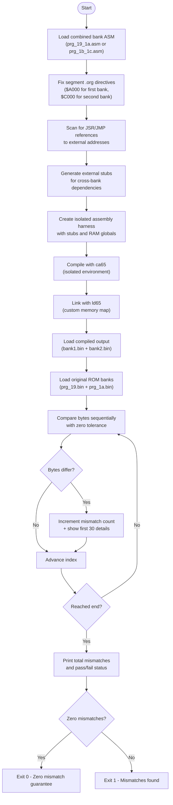

**Diagram sources**
- [verify_19_1a.py:16-90](file://tools/verify_19_1a.py#L16-L90)
- [verify_1b_1c.py:16-90](file://tools/verify_1b_1c.py#L16-L90)

**Section sources**
- [verify_19_1a.py:1-90](file://tools/verify_19_1a.py#L1-L90)
- [verify_1b_1c.py:1-90](file://tools/verify_1b_1c.py#L1-L90)

### Enhanced Region Verification Algorithm
The enhanced verify_0e_0f.py tool implements sophisticated external RAM management:

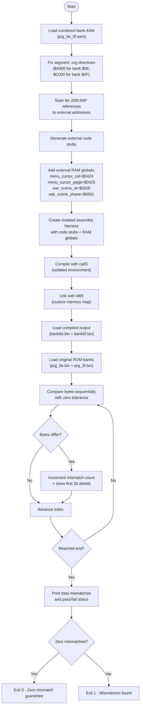

**Diagram sources**
- [verify_0e_0f.py:16-97](file://tools/verify_0e_0f.py#L16-L97)

**Section sources**
- [verify_0e_0f.py:1-97](file://tools/verify_0e_0f.py#L1-L97)

### Inline Dispatcher Mechanism Analysis
The analyze_b517.py tool implements sophisticated inline dispatcher analysis:

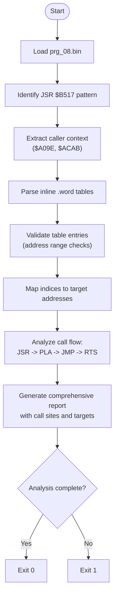

**Diagram sources**
- [analyze_b517.py:19-135](file://tools/analyze_b517.py#L19-L135)

**Section sources**
- [analyze_b517.py:1-135](file://tools/analyze_b517.py#L1-L135)

### Battle Block Region Verification
The verify_b130_bab2.py tool implements automated region verification:

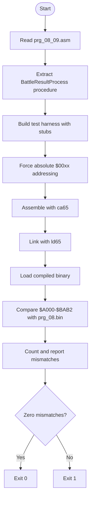

**Diagram sources**
- [verify_b130_bab2.py:12-62](file://tools/verify_b130_bab2.py#L12-L62)

**Section sources**
- [verify_b130_bab2.py:1-62](file://tools/verify_b130_bab2.py#L1-L62)

### Function Region Verification
The verify_find_region.py tool provides targeted function verification:

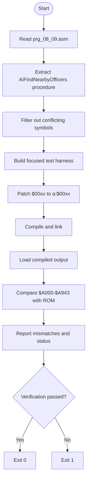

**Diagram sources**
- [verify_find_region.py:12-55](file://tools/verify_find_region.py#L12-L55)

**Section sources**
- [verify_find_region.py:1-55](file://tools/verify_find_region.py#L1-L55)

### Coverage Analysis Algorithm
The verify_coverage.py tool implements comprehensive coverage checking:

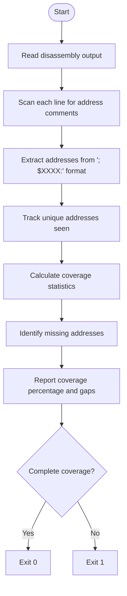

**Diagram sources**
- [verify_coverage.py:4-35](file://tools/verify_coverage.py#L4-L35)

**Section sources**
- [verify_coverage.py:1-35](file://tools/verify_coverage.py#L1-L35)

### Disassembly Verification Algorithm
The verify_disasm.py tool performs spot-check verification:

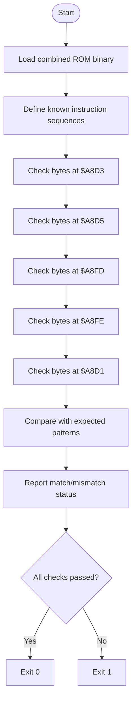

**Diagram sources**
- [verify_disasm.py:4-34](file://tools/verify_disasm.py#L4-L34)

**Section sources**
- [verify_disasm.py:1-34](file://tools/verify_disasm.py#L1-L34)

### Range Verification Algorithm
The range validation tool implements specialized validation for memory regions:

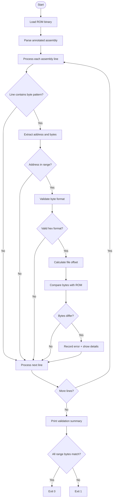

**Diagram sources**
- [verify_range.py:26-55](file://tools/verify_range.py#L26-L55)

**Section sources**
- [verify_range.py:1-62](file://tools/verify_range.py#L1-L62)

### Byte-Level Validation Algorithm
The specialized bank validation tool implements precise byte comparison:

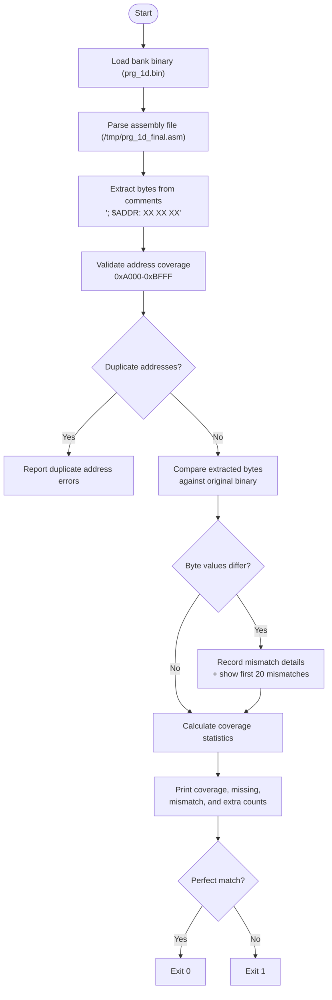

**Diagram sources**
- [verify_1d_bytes.py:20-75](file://tools/verify_1d_bytes.py#L20-L75)

**Section sources**
- [verify_1d_bytes.py:1-75](file://tools/verify_1d_bytes.py#L1-L75)

### Paired Bank Validation Algorithm
The specialized paired bank validation tool implements precise comparison for bank pairs:

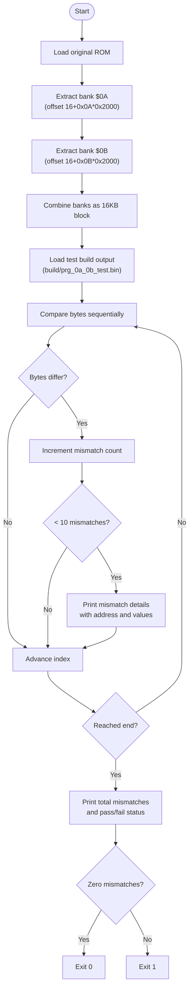

**Diagram sources**
- [verify_0a_0b.py:5-27](file://tools/verify_0a_0b.py#L5-L27)

**Section sources**
- [verify_0a_0b.py:1-28](file://tools/verify_0a_0b.py#L1-L28)

### Gap Detection Algorithm
The continuity validation tool implements address gap analysis:

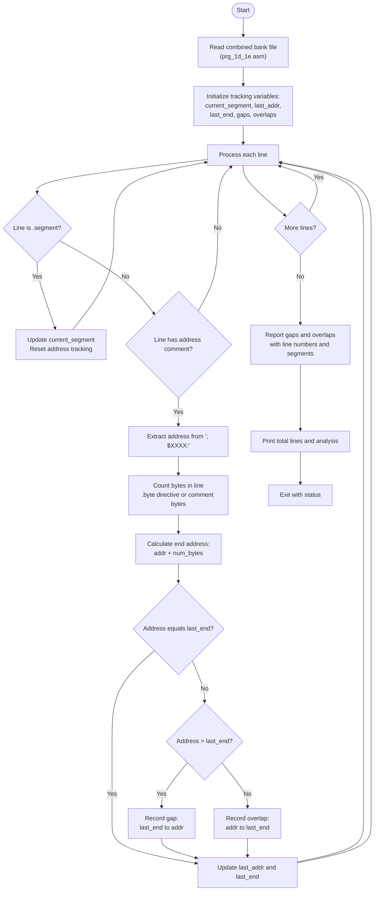

**Diagram sources**
- [check_continuity.py:15-79](file://tools/check_continuity.py#L15-L79)

**Section sources**
- [check_continuity.py:1-79](file://tools/check_continuity.py#L1-L79)

### Assembly Error Correction Algorithm
The syntax correction tool implements automated error fixing:

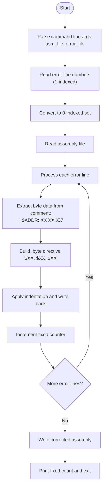

**Diagram sources**
- [fix_asm_errors.py:9-35](file://tools/fix_asm_errors.py#L9-L35)

**Section sources**
- [fix_asm_errors.py:1-35](file://tools/fix_asm_errors.py#L1-L35)

### Combined Bank Assembly Algorithm
The unified bank assembly tool creates integrated bank files:

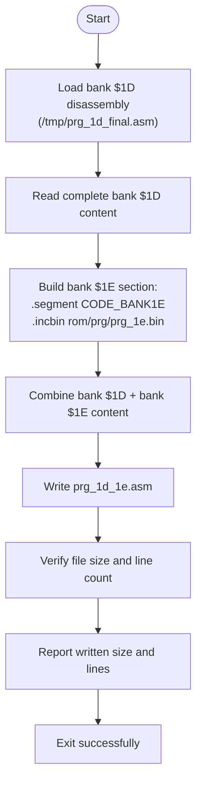

**Diagram sources**
- [assemble_prg_1d_1e.py:8-41](file://tools/assemble_prg_1d_1e.py#L8-L41)

**Section sources**
- [assemble_prg_1d_1e.py:1-41](file://tools/assemble_prg_1d_1e.py#L1-L41)

### Comparison Methodology
All verification tools employ deterministic methodologies:

#### Full ROM Verification
- Deterministic order: bytes compared in ascending address order
- Early termination: stops scanning after reaching the shorter ROM length
- First-mismatch tracking: records the first mismatch address for quick navigation
- Limited visibility: displays only the first N mismatches to keep logs readable

#### Combined Bank Verification
- Isolated compilation: compiles combined bank files independently with proper memory layout
- Automatic stub generation: creates external reference stubs for cross-bank dependencies
- Zero tolerance: requires exact byte-for-byte match with original ROM data
- External dependency management: handles both code references and RAM globals
- Memory layout enforcement: sets correct .org directives for bank base addresses

#### Inline Dispatcher Analysis
- Pattern recognition: identifies JSR $B517 calls and their inline tables
- Call site analysis: examines context around each dispatcher usage
- Table validation: verifies .word table format and entry counts
- Target resolution: maps dispatcher indices to actual function addresses
- Flow analysis: ensures proper call and return flow patterns

#### Region Verification
- Automated harness generation: creates test code from source procedures
- Symbol resolution: handles dependencies and stub generation
- Address forcing: converts relative addressing to absolute for ROM compatibility
- Binary comparison: compiles and compares against original ROM

#### Coverage Analysis
- Pattern matching: identifies address comments in disassembly output
- Set operations: tracks unique addresses and calculates coverage
- Gap identification: finds missing addresses in expected ranges
- Statistical reporting: provides comprehensive coverage metrics

#### Range Verification
- Pattern-based extraction: uses regex to identify annotated byte sequences
- Range filtering: validates only bytes within specified address boundaries
- Binary alignment: converts addresses to file offsets using bank base addresses
- Targeted comparison: focuses validation efforts on specific memory regions

#### Byte-Level Validation
- Exact pattern matching: extracts bytes using precise address-comment patterns
- Coverage validation: ensures complete address range validation
- Duplicate detection: identifies overlapping or repeated address assignments
- Statistical reporting: provides comprehensive coverage metrics

#### Paired Bank Validation
- Sequential bank extraction: reads consecutive 8KB banks as unified 16KB block
- Address mapping: correctly maps local addresses to global ROM addresses
- Detailed mismatch reporting: shows first 10 mismatches with exact addresses and values
- Build integrity validation: verifies test build output matches original ROM structure

#### Gap Detection
- Sequential address tracking: monitors address progression across assembly lines
- Gap calculation: measures missing address ranges between segments
- Overlap detection: identifies conflicting address assignments
- Segment boundary validation: ensures proper segment transitions

#### Assembly Error Correction
- Error line parsing: processes specified error locations systematically
- Syntax transformation: converts illegal addressing modes to valid directives
- Comment preservation: maintains original byte annotations during corrections
- Batch processing: applies corrections efficiently across multiple errors

This methodology ensures reproducible results and clear actionable feedback for developers working with complex ROM structures and specialized verification scenarios.

**Section sources**
- [verify_rom.py:27-73](file://tools/verify_rom.py#L27-L73)
- [verify_19_1a.py:16-90](file://tools/verify_19_1a.py#L16-L90)
- [verify_1b_1c.py:16-90](file://tools/verify_1b_1c.py#L16-L90)
- [verify_0e_0f.py:16-97](file://tools/verify_0e_0f.py#L16-L97)
- [analyze_b517.py:19-135](file://tools/analyze_b517.py#L19-L135)
- [verify_b130_bab2.py:12-62](file://tools/verify_b130_bab2.py#L12-L62)
- [verify_find_region.py:12-55](file://tools/verify_find_region.py#L12-L55)
- [verify_coverage.py:4-35](file://tools/verify_coverage.py#L4-L35)
- [verify_disasm.py:4-34](file://tools/verify_disasm.py#L4-L34)
- [verify_range.py:19-55](file://tools/verify_range.py#L19-L55)
- [verify_1d_bytes.py:20-75](file://tools/verify_1d_bytes.py#L20-L75)
- [verify_0a_0b.py:14-27](file://tools/verify_0a_0b.py#L14-L27)
- [check_continuity.py:15-79](file://tools/check_continuity.py#L15-L79)
- [fix_asm_errors.py:9-35](file://tools/fix_asm_errors.py#L9-L35)

### Reporting Mechanisms
All verification tools produce structured output:

#### Full ROM Verification
- Size comparison summary
- Mismatch details (address, original byte, rebuilt byte)
- Total mismatches and accuracy percentage
- First mismatch address for rapid investigation

#### Combined Bank Verification
- External stub count and types
- Compilation and linking status
- Zero mismatch validation result
- Detailed mismatch reporting with first 30 examples
- Pass/fail status with exit codes

#### Enhanced Region Verification
- External RAM global declarations
- Cross-bank dependency management
- Compilation status with RAM dependencies
- Binary comparison results with detailed mismatch information
- Zero mismatch guarantee validation

#### Inline Dispatcher Analysis
- Caller site identification with context
- Table structure analysis with entry counts
- Target address mapping with validity checks
- Code flow analysis with return path verification
- Comprehensive report with recommendations

#### Region Verification
- Procedure extraction and harness generation
- Compilation and linking status
- Binary comparison results with mismatch details
- Address range validation with coverage statistics

#### Coverage Analysis
- Total bytes covered vs expected
- Unique address count and coverage percentage
- Missing address identification with gap analysis
- Statistical summary of coverage completeness

#### Range Verification
- Range validation summary
- Address coverage statistics
- Total bytes checked within range
- Mismatch details with line numbers and context
- Success/failure indication for targeted validation

#### Byte-Level Validation
- Coverage statistics (total, covered, missing, mismatch, extra)
- Detailed mismatch reporting with first 20 errors
- Duplicate address error reporting
- Success/failure indication for bank validation

#### Paired Bank Validation
- Paired bank comparison summary
- Mismatch details with global addresses and byte values
- Total mismatches and pass/fail status
- Build integrity confirmation

#### Gap Detection
- Gap count and details with addresses and line numbers
- Overlap count and details with conflicting addresses
- Segment boundary analysis
- Total line count and coverage statistics

#### Assembly Error Correction
- Fixed line count reporting
- Error location tracking
- Syntax transformation confirmation
- Batch processing completion status

Exit codes:
- 0 indicates success (no mismatches found)
- Non-zero indicates failure (mismatches present)

**Section sources**
- [verify_rom.py:18-73](file://tools/verify_rom.py#L18-L73)
- [verify_19_1a.py:74-90](file://tools/verify_19_1a.py#L74-L90)
- [verify_1b_1c.py:74-90](file://tools/verify_1b_1c.py#L74-L90)
- [verify_0e_0f.py:81-97](file://tools/verify_0e_0f.py#L81-L97)
- [analyze_b517.py:19-135](file://tools/analyze_b517.py#L19-L135)
- [verify_b130_bab2.py:50-62](file://tools/verify_b130_bab2.py#L50-L62)
- [verify_find_region.py:43-55](file://tools/verify_find_region.py#L43-L55)
- [verify_coverage.py:20-35](file://tools/verify_coverage.py#L20-L35)
- [verify_disasm.py:16-34](file://tools/verify_disasm.py#L16-L34)
- [verify_range.py:56-62](file://tools/verify_range.py#L56-L62)
- [verify_1d_bytes.py:63-75](file://tools/verify_1d_bytes.py#L63-L75)
- [verify_0a_0b.py:22-27](file://tools/verify_0a_0b.py#L22-L27)
- [check_continuity.py:69-79](file://tools/check_continuity.py#L69-L79)
- [fix_asm_errors.py:31-35](file://tools/fix_asm_errors.py#L31-L35)

## Enhanced Verification Pipeline
The verification system now supports a multi-layered validation approach with specialized tools for different ROM regions and mechanisms:

### Integrated Validation Workflow
End-to-end workflow integrating multiple validation methods:

```mermaid
sequenceDiagram
participant Dev as "Developer"
participant Make as "Makefile"
participant Split as "split_rom.py"
participant Gen as "generate_bank_stubs.py"
participant Assemble1D1E as "assemble_prg_1d_1e.py"
participant Asm as "Assembler"
participant Link as "Linker"
participant Build as "build_nes.py"
participant VerifyFull as "verify_rom.py"
participant Verify191A as "verify_19_1a.py"
participant Verify1B1C as "verify_1b_1c.py"
participant Verify0E0F as "verify_0e_0f.py"
participant AnalyzeDisp as "analyze_b517.py"
participant VerifyRegion as "verify_b130_bab2.py"
participant VerifyFunc as "verify_find_region.py"
participant VerifyCov as "verify_coverage.py"
participant VerifyRange as "verify_range.py"
participant VerifyBank1D as "verify_1d_bytes.py"
participant Verify0A0B as "verify_0a_0b.py"
participant CheckCont as "check_continuity.py"
participant FixErr as "fix_asm_errors.py"
Dev->>Make : make split
Make->>Split : split original ROM
Split-->>Dev : PRG/CHR banks
Dev->>Make : make banks
Make->>Gen : generate bank stubs
Gen-->>Dev : asm/banks/*.asm
Dev->>Make : make all
Make->>Assemble1D1E : create combined bank file
Assemble1D1E-->>Make : prg_1d_1e.asm
Make->>Asm : assemble
Asm-->>Make : object files
Make->>Link : link with linker.cfg
Link-->>Make : prg.bin
Make->>Build : build iNES ROM
Build-->>Make : sango2.nes
Dev->>Make : make verify
Make->>VerifyFull : full ROM comparison
VerifyFull-->>Dev : comprehensive report
Make->>Verify191A : verify combined banks $19+$1A
Verify191A->>Verify191A : generate external stubs
Verify191A->>Verify191A : compile isolated combined bank
Verify191A->>Verify191A : compare against original ROM
Verify191A-->>Dev : zero mismatch validation
Make->>Verify1B1C : verify combined banks $1B+$1C
Verify1B1C->>Verify1B1C : generate external stubs
Verify1B1C->>Verify1B1C : compile isolated combined bank
Verify1B1C->>Verify1B1C : compare against original ROM
Verify1B1C-->>Dev : zero mismatch validation
Make->>Verify0E0F : verify enhanced combined banks $0E+$0F
Verify0E0F->>Verify0E0F : add external RAM globals
Verify0E0F->>Verify0E0F : compile with RAM dependencies
Verify0E0F->>Verify0E0F : compare against original ROM
Verify0E0F-->>Dev : enhanced validation
Make->>AnalyzeDisp : analyze inline dispatcher
AnalyzeDisp-->>Dev : dispatcher mechanism analysis
Make->>VerifyRegion : verify battle block region
VerifyRegion-->>Dev : region validation report
Make->>VerifyFunc : verify function region
VerifyFunc-->>Dev : function validation report
Make->>VerifyCov : check coverage completeness
VerifyCov-->>Dev : coverage analysis report
Make->>VerifyRange : range-specific validation
VerifyRange-->>Dev : targeted validation report
Make->>VerifyBank1D : validate bank $1D bytes
VerifyBank1D-->>Dev : byte-level validation report
Make->>Verify0A0B : validate paired banks $0A+$0B
Verify0A0B-->>Dev : paired bank validation report
Make->>CheckCont : detect continuity issues
CheckCont-->>Dev : gap/overlap analysis
Make->>FixErr : correct assembly errors
FixErr-->>Dev : corrected assembly output
```

**Diagram sources**
- [Makefile:54-62](file://Makefile#L54-L62)
- [split_rom.py:38-122](file://tools/split_rom.py#L38-L122)
- [generate_bank_stubs.py:12-46](file://tools/generate_bank_stubs.py#L12-L46)
- [linker.cfg:18-54](file://linker.cfg#L18-L54)
- [build_nes.py:10-51](file://tools/build_nes.py#L10-L51)
- [verify_rom.py:10-73](file://tools/verify_rom.py#L10-L73)
- [verify_19_1a.py:1-90](file://tools/verify_19_1a.py#L1-L90)
- [verify_1b_1c.py:1-90](file://tools/verify_1b_1c.py#L1-L90)
- [verify_0e_0f.py:1-97](file://tools/verify_0e_0f.py#L1-L97)
- [analyze_b517.py:1-135](file://tools/analyze_b517.py#L1-L135)
- [verify_b130_bab2.py:1-62](file://tools/verify_b130_bab2.py#L1-L62)
- [verify_find_region.py:1-55](file://tools/verify_find_region.py#L1-L55)
- [verify_coverage.py:1-35](file://tools/verify_coverage.py#L1-L35)
- [verify_range.py:1-62](file://tools/verify_range.py#L1-L62)
- [verify_1d_bytes.py:1-75](file://tools/verify_1d_bytes.py#L1-L75)
- [verify_0a_0b.py:1-28](file://tools/verify_0a_0b.py#L1-L28)
- [check_continuity.py:1-79](file://tools/check_continuity.py#L1-L79)
- [fix_asm_errors.py:1-35](file://tools/fix_asm_errors.py#L1-L35)

**Section sources**
- [Makefile:54-62](file://Makefile#L54-L62)
- [PROJECT.md:134-150](file://PROJECT.md#L134-L150)

### Practical Examples of Verification Output Interpretation
Common scenarios and how to interpret results:

#### Full ROM Verification
- No mismatches and equal sizes: SUCCESS message; ROMs are identical
- Mismatches present: shows total mismatches, accuracy percentage, and first mismatch address
- Size mismatch warning: indicates padding or header differences; investigate build configuration
- First mismatch address: use to locate the problematic area in the disassembly or assembly

#### Combined Bank Verification
- Zero mismatch guarantee: confirms combined bank files are byte-for-byte identical to original ROM
- External stub generation: shows number of cross-bank dependencies automatically handled
- Compilation status: indicates successful isolated compilation with proper memory layout
- Mismatch details: shows first 30 mismatches with exact addresses and byte values
- Pass/fail status: exit code 0 indicates perfect match, non-zero indicates discrepancies

#### Enhanced Region Verification
- External RAM globals: shows cross-bank RAM dependencies properly declared
- Menu cursor positioning: handles menu_cursor_col ($0424) and menu_cursor_page ($0425)
- War scene state: manages war_scene_id ($0500) and war_scene_phase ($0501)
- Zero mismatch validation: confirms combined bank files match original ROM exactly
- Dependency management: demonstrates proper handling of cross-bank RAM references

#### Inline Dispatcher Analysis
- Caller site identification: shows where JSR $B517 is used with context
- Table structure analysis: reveals inline .word table format and entry counts
- Target mapping: shows how dispatcher indices resolve to function addresses
- Flow analysis: confirms proper call and return patterns
- Recommendations: suggests disassembly corrections for inline tables

#### Region Verification
- Procedure extraction: shows which code sections were included in verification
- Harness generation: displays test code creation and symbol handling
- Compilation status: indicates successful assembly and linking
- Binary comparison: provides detailed mismatch information with addresses and values
- Coverage metrics: shows how much of the target region was verified

#### Coverage Analysis
- Coverage percentage: indicates what portion of the target range was analyzed
- Unique addresses: shows how many distinct addresses were encountered
- Missing addresses: lists gaps in coverage that need attention
- Statistical summary: provides comprehensive view of analysis completeness

#### Range Verification
- Targeted validation success: confirms specific memory ranges are accurate
- Range-specific mismatches: highlights issues within validated address ranges
- Address coverage: shows how many addresses were checked within the specified range
- Context-rich reporting: includes line numbers and assembly context for easy debugging

#### Byte-Level Validation
- Perfect coverage: all bytes from 0xA000-0xBFFF match exactly
- Missing bytes: identifies unvalidated addresses in the expected range
- Mismatched bytes: shows exact address and byte differences
- Duplicate addresses: reports overlapping or repeated address assignments

#### Paired Bank Validation
- Paired bank success: confirms $0A+$0B banks are byte-for-byte identical to original
- Mismatch details: shows first 10 mismatches with global addresses and byte values
- Total mismatch count: indicates extent of discrepancies in the 16KB combined block
- Build integrity: validates that test build output matches original ROM structure

#### Gap Detection
- Gap identification: reports missing address ranges between segments
- Overlap detection: identifies conflicting address assignments
- Segment analysis: validates proper segment boundaries and alignments
- Continuity assessment: ensures sequential address progression

#### Assembly Error Correction
- Error correction success: fixes illegal addressing mode errors
- Syntax transformation: converts to valid .byte directives
- Comment preservation: maintains original byte annotations
- Batch processing: handles multiple error locations efficiently

These outputs guide targeted fixes and iterative improvements across different validation scopes, particularly important for complex ROM structures and specialized verification scenarios.

**Section sources**
- [verify_rom.py:22-73](file://tools/verify_rom.py#L22-L73)
- [verify_19_1a.py:74-90](file://tools/verify_19_1a.py#L74-L90)
- [verify_1b_1c.py:74-90](file://tools/verify_1b_1c.py#L74-L90)
- [verify_0e_0f.py:81-97](file://tools/verify_0e_0f.py#L81-L97)
- [analyze_b517.py:19-135](file://tools/analyze_b517.py#L19-L135)
- [verify_b130_bab2.py:50-62](file://tools/verify_b130_bab2.py#L50-L62)
- [verify_find_region.py:43-55](file://tools/verify_find_region.py#L43-L55)
- [verify_coverage.py:20-35](file://tools/verify_coverage.py#L20-L35)
- [verify_disasm.py:16-34](file://tools/verify_disasm.py#L16-L34)
- [verify_range.py:22-62](file://tools/verify_range.py#L22-L62)
- [verify_1d_bytes.py:41-75](file://tools/verify_1d_bytes.py#L41-L75)
- [verify_0a_0b.py:22-27](file://tools/verify_0a_0b.py#L22-L27)
- [check_continuity.py:69-79](file://tools/check_continuity.py#L69-L79)
- [fix_asm_errors.py:31-35](file://tools/fix_asm_errors.py#L31-L35)

### Common Verification Scenarios
- Fresh rebuild: expect zero mismatches; any mismatch indicates incorrect assembly or linker configuration
- After editing bank stubs: mismatches often appear near the edited region; use first mismatch address to focus analysis
- After linker updates: mismatches may shift due to segment placement; re-run verification to confirm resolution
- Post-disasm: mismatches indicate incorrect disassembly or missing bank segments in the linker configuration
- Combined bank validation: zero mismatch guarantees ensure $19+$1A and $1B+$1C combinations are byte-exact
- Enhanced region verification: external RAM globals properly handle cross-bank dependencies for $0E+$0F
- Inline dispatcher analysis: identifies incorrect disassembly of inline tables as code instead of data
- Region verification failures: indicate specific corruption or annotation errors within targeted regions
- Coverage gaps: suggest incomplete disassembly or missing address comments in output files
- Continuity issues: gaps or overlaps in combined bank files indicate structural problems
- Assembly syntax errors: illegal addressing modes require correction before successful assembly

**Section sources**
- [PROJECT.md:134-150](file://PROJECT.md#L134-L150)
- [linker.cfg:32-54](file://linker.cfg#L32-L54)
- [verify_range.py:30-31](file://tools/verify_range.py#L30-L31)
- [verify_1d_bytes.py:34-39](file://tools/verify_1d_bytes.py#L34-L39)
- [verify_0a_0b.py:17-20](file://tools/verify_0a_0b.py#L17-L20)
- [verify_19_1a.py:74-90](file://tools/verify_19_1a.py#L74-L90)
- [verify_1b_1c.py:74-90](file://tools/verify_1b_1c.py#L74-L90)
- [verify_0e_0f.py:81-97](file://tools/verify_0e_0f.py#L81-L97)
- [check_continuity.py:58-64](file://tools/check_continuity.py#L58-L64)
- [analyze_b517.py:124-135](file://tools/analyze_b517.py#L124-L135)
- [verify_b130_bab2.py:50-62](file://tools/verify_b130_bab2.py#L50-L62)
- [verify_find_region.py:43-55](file://tools/verify_find_region.py#L43-L55)
- [verify_coverage.py:20-35](file://tools/verify_coverage.py#L20-L35)

### Troubleshooting Approaches for Mismatches
- Confirm ROM sizes: if sizes differ, review the build process and header creation
- Inspect first mismatch address: navigate to the corresponding address in the disassembly and verify correctness
- Validate bank segments: ensure all used banks are included in the linker configuration
- Check bank stubs: ensure stubs are replaced with actual disassembled code and not left as incbins
- Review disassembly accuracy: use the disassembler to cross-check instruction boundaries and operands
- Analyze ROM structure: use the ROM analyzer to identify unexpected patterns or misclassified banks
- Validate inline dispatcher patterns: use analyze_b517.py to identify incorrectly disassembled inline tables
- Check region-specific code: use verify_b130_bab2.py and verify_find_region.py for targeted validation
- Validate range annotations: ensure assembly files contain proper byte annotations for range validation
- Check memory mapping: verify that address calculations align with expected bank layouts
- Validate combined bank integrity: use gap detection tools to ensure continuity in $1D/$1E files
- Validate paired bank integrity: use paired bank validation tools to ensure $0A/$0B combination accuracy
- Use combined bank verification: run verify_19_1a.py and verify_1b_1c.py for zero mismatch guarantees
- Use enhanced region verification: run verify_0e_0f.py for external RAM dependency validation
- Correct assembly syntax errors: use error correction tools to fix illegal addressing modes
- Perform byte-level validation: use specialized tools to verify exact byte correspondence
- Check coverage completeness: use verify_coverage.py to ensure all expected addresses are analyzed

**Section sources**
- [verify_rom.py:35-73](file://tools/verify_rom.py#L35-L73)
- [linker.cfg:32-54](file://linker.cfg#L32-L54)
- [generate_bank_stubs.py:24-32](file://tools/generate_bank_stubs.py#L24-L32)
- [analyze_rom.py:10-122](file://tools/analyze_rom.py#L10-L122)
- [analyze_b517.py:124-135](file://tools/analyze_b517.py#L124-L135)
- [verify_b130_bab2.py:50-62](file://tools/verify_b130_bab2.py#L50-L62)
- [verify_find_region.py:43-55](file://tools/verify_find_region.py#L43-L55)
- [verify_coverage.py:20-35](file://tools/verify_coverage.py#L20-L35)
- [verify_range.py:36-39](file://tools/verify_range.py#L36-L39)
- [verify_0a_0b.py:17-20](file://tools/verify_0a_0b.py#L17-L20)
- [verify_19_1a.py:74-90](file://tools/verify_19_1a.py#L74-L90)
- [verify_1b_1c.py:74-90](file://tools/verify_1b_1c.py#L74-L90)
- [verify_0e_0f.py:81-97](file://tools/verify_0e_0f.py#L81-L97)
- [check_continuity.py:58-64](file://tools/check_continuity.py#L58-L64)
- [fix_asm_errors.py:18-29](file://tools/fix_asm_errors.py#L18-L29)
- [verify_1d_bytes.py:54-61](file://tools/verify_1d_bytes.py#L54-61)

## Range-Based Verification
The range validation capability provides targeted validation for specific memory regions:

### Range Validation Methodology
The range verification tool implements specialized validation for memory regions:

- **Pattern Recognition**: Uses regex to identify lines containing byte annotations in the format `; $XXXX: XX XX XX`
- **Range Filtering**: Validates only bytes within specified address boundaries (e.g., $E843-$F2AE)
- **Address Calculation**: Converts assembly addresses to file offsets using bank base addresses
- **Binary Alignment**: Compares annotated bytes against actual ROM binary data
- **Targeted Reporting**: Focuses on mismatches within validated ranges with detailed context

### Key Features
- **Configurable Ranges**: Easy to modify address ranges for different validation scenarios
- **Assembly Integration**: Leverages existing annotated assembly files for validation
- **Context Preservation**: Maintains line numbers and assembly context for debugging
- **Performance Optimization**: Focuses validation efforts on specific memory regions
- **Complementary Validation**: Works alongside full ROM verification for comprehensive coverage

### Usage Examples
The range validation tool is particularly useful for:
- Validating specific bank regions during development
- Checking memory-mapped hardware registers
- Verifying critical code sections
- Testing interrupt handlers and vectors
- Validating data tables and constants

**Section sources**
- [verify_range.py:1-62](file://tools/verify_range.py#L1-L62)

## Specialized Bank Validation
The enhanced verification system includes specialized tools for validating individual bank files, particularly important for the combined $1D/$1E workflow:

### Bank $1D Byte-Level Validation
The verify_1d_bytes.py tool provides precise validation for the $1D bank:

- **Exact Byte Extraction**: Parses inline byte comments with address markers (`; $ADDR: XX XX XX`)
- **Coverage Validation**: Ensures complete validation of the $A000-$BFFF address range
- **Duplicate Detection**: Identifies overlapping or repeated address assignments
- **Statistical Reporting**: Provides comprehensive coverage metrics and error details

### Combined Bank Integration
The system supports validation of combined bank files:

- **Unified File Support**: Validates integrated $1D/$1E assembly files
- **Segment Validation**: Ensures proper segment boundaries and alignments
- **Continuity Checking**: Detects gaps or overlaps in combined bank content
- **Syntax Error Correction**: Fixes assembly errors in combined bank files

### Validation Workflow Integration
The specialized bank validation integrates seamlessly with the overall verification pipeline:

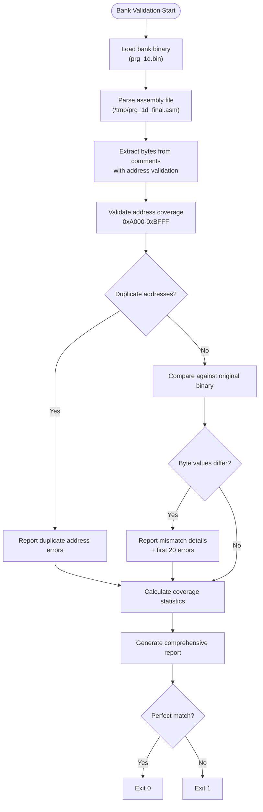

**Diagram sources**
- [verify_1d_bytes.py:20-75](file://tools/verify_1d_bytes.py#L20-L75)

**Section sources**
- [verify_1d_bytes.py:1-75](file://tools/verify_1d_bytes.py#L1-L75)

## Combined Bank Verification
The enhanced verification system now includes sophisticated combined bank verification tools that provide zero mismatch guarantees for paired bank combinations:

### Combined Bank Verification Methodology
The new verification tools (verify_19_1a.py and verify_1b_1c.py) implement advanced isolated compilation and validation:

- **Isolated Compilation**: Compiles combined bank files independently with proper memory layout
- **Automatic Stub Generation**: Creates external reference stubs for cross-bank dependencies
- **Memory Layout Management**: Sets correct .org directives for bank base addresses ($A000, $C000)
- **Zero Mismatch Guarantee**: Requires exact byte-for-byte match with original ROM data
- **External Reference Handling**: Automatically detects and stubs JSR/JMP references to external addresses

### Supported Combined Bank Pairs
- **Banks $19+$1A**: Verified by verify_19_1a.py with zero mismatch guarantee
- **Banks $1B+$1C**: Verified by verify_1b_1c.py with zero mismatch guarantee  
- **Banks $0E+$0F**: Enhanced by verify_0e_0f.py with external RAM global support

### External RAM Global Management
The enhanced verify_0e_0f.py tool manages cross-bank RAM dependencies:

- **Menu Cursor Positioning**: Handles menu_cursor_col ($0424) and menu_cursor_page ($0425)
- **War Scene State**: Manages war_scene_id ($0500) and war_scene_phase ($0501)
- **Cross-Bank Dependencies**: Properly declares external RAM globals for isolated compilation
- **Dependency Resolution**: Ensures proper handling of RAM references between bank pairs

### Key Features
- **Automated Stub Creation**: Generates external code reference stubs automatically
- **Memory Layout Enforcement**: Ensures correct segment organization and addressing
- **Comprehensive Validation**: Compiles and links in isolation against original ROM data
- **Detailed Reporting**: Shows first 30 mismatches with exact addresses and byte values
- **Zero Tolerance**: Requires perfect byte-for-byte match with original ROM

### Usage in Development Workflow
The combined bank verification tools are essential for maintaining accuracy:

- **Incremental Validation**: Verify combined bank pairs without rebuilding entire ROM
- **Dependency Management**: Handle cross-bank code and RAM dependencies automatically
- **Quality Assurance**: Ensure combined bank files maintain byte-exact accuracy
- **Debugging Support**: Quickly identify issues in combined bank relationships
- **Regression Testing**: Verify that changes don't break combined bank functionality

**Section sources**
- [verify_19_1a.py:1-90](file://tools/verify_19_1a.py#L1-L90)
- [verify_1b_1c.py:1-90](file://tools/verify_1b_1c.py#L1-L90)
- [verify_0e_0f.py:1-97](file://tools/verify_0e_0f.py#L1-L97)

## Inline Dispatcher Mechanism Analysis
The new inline dispatcher analysis capability provides specialized verification for the Loc_B517 dispatch mechanism:

### Inline Dispatcher Analysis Methodology
The analyze_b517.py tool implements sophisticated inline dispatcher analysis:

- **Pattern Recognition**: Identifies JSR $B517 calls and their inline .word tables
- **Call Site Analysis**: Examines context around each dispatcher usage
- **Table Structure Validation**: Verifies .word table format and entry counts
- **Target Resolution**: Maps dispatcher indices to actual function addresses
- **Flow Analysis**: Ensures proper call and return flow patterns

### Key Features
- **Caller Identification**: Finds all locations where JSR $B517 is used
- **Table Parsing**: Extracts and validates inline .word table structures
- **Address Validation**: Checks that target addresses are within valid ranges
- **Code Flow Analysis**: Verifies proper RTS return behavior after handler execution
- **Disassembly Recommendations**: Suggests corrections for incorrectly disassembled inline tables

### Usage in Disassembly Workflow
The inline dispatcher analysis is crucial for accurate disassembly:

- **Pattern Detection**: Identifies inline dispatcher usage patterns in code
- **Table Analysis**: Distinguishes between code and inline data tables
- **Validation**: Confirms proper table structure and entry counts
- **Correction Guidance**: Provides specific recommendations for disassembly fixes

### Integration with Existing Tools
The inline dispatcher analysis integrates with the broader verification ecosystem:

- **Complementary to Full ROM Verification**: Provides focused analysis for specific mechanisms
- **Supports Disassembly Accuracy**: Helps identify and correct inline table disassembly errors
- **Build Pipeline Integration**: Can be run as part of automated verification processes
- **Development Workflow Support**: Helps identify issues early in the disassembly process

**Section sources**
- [analyze_b517.py:1-135](file://tools/analyze_b517.py#L1-L135)

## Region-Specific Verification
The enhanced verification system includes specialized tools for verifying specific ROM regions:

### Battle Block Region Verification
The verify_b130_bab2.py tool provides targeted validation for battle result processing:

- **Procedure Extraction**: Automatically extracts BattleResultProcess from source code
- **Test Harness Generation**: Creates standalone test code with necessary stubs
- **Address Forcing**: Converts relative addressing to absolute for ROM compatibility
- **Automated Compilation**: Assembles and links test code automatically
- **Binary Comparison**: Compiles against original ROM with detailed mismatch reporting

### Function Region Verification
The verify_find_region.py tool offers focused validation for specific functions:

- **Function Isolation**: Extracts AiFindNearbyOfficers and related code
- **Symbol Management**: Handles dependencies and filters conflicting symbols
- **Address Conversion**: Forces absolute addressing for $00xx operands
- **Compilation Pipeline**: Automates assembly and linking process
- **Targeted Comparison**: Validates specific address ranges against original ROM

### Key Features
- **Automated Harness Creation**: Generates test code from source procedures
- **Dependency Resolution**: Handles external symbols and stub generation
- **Memory Mapping**: Ensures correct address mapping for ROM compatibility
- **Detailed Reporting**: Provides comprehensive mismatch analysis with addresses and values
- **Integration Ready**: Designed to work with existing build systems and workflows

### Usage in Development Workflow
The region verification tools are essential for incremental validation:

- **Incremental Verification**: Validate specific functions without rebuilding entire ROM
- **Debugging Support**: Quickly identify issues in specific code regions
- **Regression Testing**: Ensure changes don't break existing functionality
- **Quality Assurance**: Maintain byte-exact accuracy for critical game logic

**Section sources**
- [verify_b130_bab2.py:1-62](file://tools/verify_b130_bab2.py#L1-L62)
- [verify_find_region.py:1-55](file://tools/verify_find_region.py#L1-L55)

## Coverage and Disassembly Verification
The verification system includes comprehensive coverage analysis and disassembly verification tools:

### Coverage Analysis
The verify_coverage.py tool ensures complete address range validation:

- **Pattern Matching**: Identifies address comments in disassembly output
- **Coverage Tracking**: Monitors which addresses have been analyzed
- **Gap Detection**: Identifies missing addresses in expected ranges
- **Statistical Reporting**: Provides comprehensive coverage metrics

### Disassembly Verification
The verify_disasm.py tool performs spot-check verification:

- **Known Address Testing**: Validates specific instruction sequences at known addresses
- **Pattern Matching**: Checks for expected byte patterns at critical locations
- **Instruction Verification**: Confirms correct disassembly of known instructions
- **Quick Validation**: Provides fast verification of disassembly accuracy

### Key Features
- **Comprehensive Coverage**: Ensures all expected addresses are analyzed
- **Quick Validation**: Fast verification of specific instruction sequences
- **Statistical Analysis**: Provides metrics on coverage completeness
- **Integration Ready**: Works with existing disassembly workflows

### Usage in Disassembly Workflow
The coverage and verification tools support systematic disassembly:

- **Progress Tracking**: Monitor disassembly progress through coverage metrics
- **Quality Assurance**: Ensure critical instructions are correctly disassembled
- **Gap Identification**: Find areas that need additional attention
- **Validation Automation**: Integrate verification into regular development workflow

**Section sources**
- [verify_coverage.py:1-35](file://tools/verify_coverage.py#L1-L35)
- [verify_disasm.py:1-34](file://tools/verify_disasm.py#L1-L34)

## Gap Detection and Continuity Validation
The check_continuity.py tool provides essential validation for combined bank files:

### Gap Detection Methodology
The continuity validation tool implements systematic gap and overlap detection:

- **Address Tracking**: Monitors address progression across assembly lines
- **Segment Analysis**: Tracks segment changes and maintains address context
- **Gap Calculation**: Measures missing address ranges between consecutive lines
- **Overlap Detection**: Identifies conflicting address assignments
- **Line Number Tracking**: Reports exact line locations for identified issues

### Continuity Validation Features
- **Segment-Aware Processing**: Properly handles .segment directives and maintains context
- **Multi-Format Support**: Handles both .byte directives and inline comment byte formats
- **Comprehensive Reporting**: Provides detailed gap and overlap analysis with context
- **Integration Ready**: Designed to work with the combined bank assembly workflow

### Usage in Combined Bank Workflow
The gap detection tool is crucial for ensuring combined bank integrity:

- **Pre-Assembly Validation**: Identifies continuity issues before assembly attempts
- **Post-Assembly Verification**: Confirms combined bank file integrity
- **Error Prevention**: Prevents assembly failures due to address gaps or overlaps
- **Quality Assurance**: Ensures byte-exact continuity in combined bank files

**Section sources**
- [check_continuity.py:1-79](file://tools/check_continuity.py#L1-L79)

## Assembly Error Correction
The fix_asm_errors.py tool automates the correction of common assembly syntax errors:

### Error Correction Methodology
The assembly error correction tool implements systematic error fixing:

- **Error Line Processing**: Reads and processes specified error locations
- **Byte Directive Conversion**: Transforms illegal addressing modes to valid .byte directives
- **Comment Preservation**: Maintains original byte annotations during corrections
- **Indentation Handling**: Preserves proper indentation in corrected lines

### Error Correction Workflow
The tool follows a structured approach to error correction:

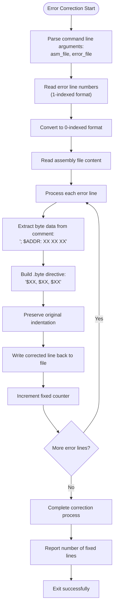

**Diagram sources**
- [fix_asm_errors.py:9-35](file://tools/fix_asm_errors.py#L9-L35)

**Section sources**
- [fix_asm_errors.py:1-35](file://tools/fix_asm_errors.py#L1-L35)

## Dependency Analysis
The verification system depends on the build pipeline and ROM structure:

```mermaid
graph TB
VerifyFull["verify_rom.py"] --> Orig["Original ROM"]
VerifyFull --> Rebuilt["Rebuilt ROM (sango2.nes)"]
VerifyRange["verify_range.py"] --> ASMFile["Annotated Assembly<br/>prg_1f.aligned.asm"]
VerifyRange --> ROMBin["ROM Binary<br/>prg_1f.bin"]
VerifyBank1D["verify_1d_bytes.py"] --> Bank1D["Bank $1D Binary<br/>prg_1d.bin"]
VerifyBank1D --> FinalASM["Final Assembly<br/>(/tmp/prg_1d_final.asm)"]
Verify0A0B["verify_0a_0b.py"] --> OriginalROM["Original ROM"]
Verify0A0B --> TestBin["Test Build<br/>build/prg_0a_0b_test.bin"]
Verify191A["verify_19_1a.py"] --> ASM191A["Combined ASM<br/>prg_19_1a.asm"]
Verify191A --> ROM19["ROM Bank $19<br/>rom/prg/prg_19.bin"]
Verify191A --> ROM1A["ROM Bank $1A<br/>rom/prg/prg_1a.bin"]
Verify1B1C["verify_1b_1c.py"] --> ASM1B1C["Combined ASM<br/>prg_1b_1c.asm"]
Verify1B1C --> ROM1B["ROM Bank $1B<br/>rom/prg/prg_1b.bin"]
Verify1B1C --> ROM1C["ROM Bank $1C<br/>rom/prg/prg_1c.bin"]
Verify0E0F["verify_0e_0f.py"] --> ASM0E0F["Combined ASM<br/>prg_0e_0f.asm"]
Verify0E0F --> ROM0E["ROM Bank $0E<br/>rom/prg/prg_0e.bin"]
Verify0E0F --> ROM0F["ROM Bank $0F<br/>rom/prg/prg_0f.bin"]
AnalyzeDisp["analyze_b517.py"] --> PRG08["PRG Bank 08<br/>rom/prg/prg_08.bin"]
VerifyRegion["verify_b130_bab2.py"] --> SourceASM["Source Assembly<br/>asm/banks/prg_08_09.asm"]
VerifyRegion --> ROMBin08["ROM Binary<br/>rom/prg/prg_08.bin"]
VerifyFunc["verify_find_region.py"] --> SourceASM2["Source Assembly<br/>asm/banks/prg_08_09.asm"]
VerifyFunc --> ROMBin08
VerifyCov["verify_coverage.py"] --> DisasmOut["Disassembly Output<br>/tmp/disasm_1d_final.txt"]
VerifyDisasm["verify_disasm.py"] --> CombinedROM["Combined ROM<br/>rom/prg/prg_17_18_combined.bin"]
CheckCont["check_continuity.py"] --> CombinedASM["Combined Bank<br/>prg_1d_1e.asm"]
FixErr["fix_asm_errors.py"] --> ErrorFile["Error Lines<br/>error_locations.txt"]
FixErr --> ASMFile["Assembly File<br/>prg_1d_1e.asm"]
Assemble1D1E["assemble_prg_1d_1e.py"] --> Bank1D["Bank $1D Content<br/>/tmp/prg_1d_final.asm"]
Assemble1D1E --> Bank1E["Bank $1E Content<br/>rom/prg/prg_1e.bin"]
Rebuilt --> Build["build_nes.py"]
Build --> Linker["linker.cfg"]
Linker --> Segments["Bank segments"]
Segments --> Asm["Assembly sources"]
Asm --> Stubs["generate_bank_stubs.py"]
Stubs --> Banks["Bank stubs"]
Orig --> Split["split_rom.py"]
Split --> Banks
```

**Diagram sources**
- [verify_rom.py:10-73](file://tools/verify_rom.py#L10-L73)
- [verify_range.py:7-9](file://tools/verify_range.py#L7-L9)
- [verify_1d_bytes.py:9-15](file://tools/verify_1d_bytes.py#L9-L15)
- [verify_0a_0b.py:5-12](file://tools/verify_0a_0b.py#L5-L12)
- [verify_19_1a.py:16-21](file://tools/verify_19_1a.py#L16-L21)
- [verify_1b_1c.py:16-21](file://tools/verify_1b_1c.py#L16-L21)
- [verify_0e_0f.py:16-21](file://tools/verify_0e_0f.py#L16-L21)
- [analyze_b517.py:4](file://tools/analyze_b517.py#L4)
- [verify_b130_bab2.py:13-52](file://tools/verify_b130_bab2.py#L13-L52)
- [verify_find_region.py:13-45](file://tools/verify_find_region.py#L13-L45)
- [verify_coverage.py:4-5](file://tools/verify_coverage.py#L4-L5)
- [verify_disasm.py:4-5](file://tools/verify_disasm.py#L4-L5)
- [check_continuity.py:5](file://tools/check_continuity.py#L5)
- [fix_asm_errors.py:6-7](file://tools/fix_asm_errors.py#L6-L7)
- [assemble_prg_1d_1e.py:8-26](file://tools/assemble_prg_1d_1e.py#L8-L26)
- [build_nes.py:10-51](file://tools/build_nes.py#L10-L51)
- [linker.cfg:18-54](file://linker.cfg#L18-L54)
- [generate_bank_stubs.py:12-46](file://tools/generate_bank_stubs.py#L12-L46)
- [split_rom.py:38-122](file://tools/split_rom.py#L38-L122)

**Section sources**
- [Makefile:38-48](file://Makefile#L38-L48)
- [linker.cfg:18-54](file://linker.cfg#L18-L54)

## Performance Considerations
- **Linear scan complexity**: O(n) where n is the minimum ROM size; efficient for typical ROM sizes
- **Memory usage**: Loads entire ROMs into memory; acceptable for standard ROM sizes
- **Output limiting**: Caps displayed mismatches to reduce log verbosity
- **Early exit**: Stops scanning after the shorter ROM length to avoid unnecessary work
- **Range optimization**: Targeted validation reduces processing time for specific memory regions
- **Pattern matching overhead**: Regex processing adds minimal overhead for range validation
- **File I/O efficiency**: All tools use buffered I/O for optimal performance
- **Batch processing**: Multiple validation tools can run in parallel for improved throughput
- **Specialized algorithms**: Byte-level validation uses optimized comparison loops for better performance
- **Paired bank efficiency**: Sequential bank reading minimizes memory overhead for paired validation
- **Combined bank efficiency**: Isolated compilation reduces dependency overhead for combined bank validation
- **Automated compilation**: Region verification tools optimize compilation by focusing on specific code sections
- **Coverage analysis efficiency**: Uses set operations for fast address tracking and gap detection

## Troubleshooting Guide
Common issues and resolutions:

### Full ROM Verification Issues
- File not found errors: verify paths to original and rebuilt ROMs; ensure they exist before running verification
- Size mismatches: check header creation and padding logic; ensure PRG size aligns with expectations
- Excessive mismatches: inspect recent changes to bank segments or disassembly accuracy
- First mismatch instability: indicates linker or disassembly drift; stabilize by fixing segments and re-running verification

### Combined Bank Verification Issues
- Isolated compilation failures: check external reference stub generation and memory layout
- External dependency errors: verify cross-bank code references are properly stubbed
- RAM global declaration issues: ensure external RAM globals are properly declared for combined banks
- Memory layout problems: verify .org directives are correctly set for bank base addresses
- Zero mismatch failures: examine first 30 mismatch details for precise issue location

### Enhanced Region Verification Issues
- External RAM global conflicts: verify RAM global declarations don't conflict with other definitions
- Cross-bank dependency resolution: ensure proper handling of menu cursor and war scene state variables
- Compilation errors: check for missing symbols or incorrect addressing modes in combined banks
- Linking failures: verify custom memory map configuration for combined bank compilation

### Inline Dispatcher Analysis Issues
- Pattern matching failures: ensure JSR $B517 exists in target ROM bank
- Table parsing errors: verify inline .word table format and entry counts
- Address validation failures: check that target addresses are within valid memory ranges
- Flow analysis issues: ensure proper RTS return behavior after handler execution

### Region Verification Issues
- Procedure extraction failures: verify .proc/.endproc syntax in source code
- Compilation errors: check for missing symbols or incorrect addressing modes
- Linking failures: ensure stub generation works correctly for external dependencies
- Binary comparison issues: verify address mapping and memory layout assumptions

### Coverage Analysis Issues
- Pattern matching failures: ensure disassembly output contains proper address comments
- Coverage calculation errors: verify expected address ranges and bank mappings
- Gap detection false positives: check for proper formatting of address comments
- Statistical reporting issues: ensure consistent counting of unique addresses

### Range Verification Issues
- Pattern matching failures: ensure assembly files contain proper byte annotations
- Address range errors: verify address boundaries align with expected memory layout
- Offset calculation issues: check bank base address assumptions in address-to-offset conversion
- Missing binary data: ensure ROM binary files exist and contain expected data for validation
- False positives: verify that annotated bytes represent actual ROM content, not comments or metadata

### Byte-Level Validation Issues
- Missing bytes: indicates incomplete address coverage in assembly comments
- Duplicate addresses: suggests overlapping or repeated address assignments
- Mismatched bytes: requires investigation of assembly comment accuracy
- Coverage gaps: indicates missing validation for certain address ranges

### Paired Bank Validation Issues
- Paired bank extraction errors: verify ROM structure and bank boundaries
- Address mapping issues: check global address calculations for paired banks
- Test build path errors: ensure test build output exists at expected location
- Mismatch interpretation: use reported addresses to locate issues in paired bank source
- Build configuration problems: verify linker configuration for paired bank combinations

### Gap Detection Issues
- False gap reports: check for proper address comment formatting in assembly files
- Missing overlaps: verify segment boundaries and address calculations
- Line number discrepancies: ensure proper line numbering in assembly files
- Segment context errors: verify .segment directive placement and usage

### Assembly Error Correction Issues
- Error file format: ensure error line numbers are in 1-indexed format
- Byte directive conversion: verify proper .byte directive syntax after correction
- Comment preservation: check that original byte annotations remain intact
- Indentation issues: verify proper whitespace handling in corrected lines

### Combined Bank Workflow Issues
- Assembly failures: use gap detection and error correction tools before assembly attempts
- Linker errors: verify combined bank file integrity and proper segment definitions
- Memory mapping issues: ensure address calculations align with combined bank layout
- Validation failures: use specialized bank validation tools for $1D/$1E integration

**Section sources**
- [verify_rom.py:53-73](file://tools/verify_rom.py#L53-L73)
- [verify_19_1a.py:74-90](file://tools/verify_19_1a.py#L74-L90)
- [verify_1b_1c.py:74-90](file://tools/verify_1b_1c.py#L74-L90)
- [verify_0e_0f.py:81-97](file://tools/verify_0e_0f.py#L81-L97)
- [analyze_b517.py:124-135](file://tools/analyze_b517.py#L124-L135)
- [verify_b130_bab2.py:41-48](file://tools/verify_b130_bab2.py#L41-L48)
- [verify_find_region.py:32-41](file://tools/verify_find_region.py#L32-L41)
- [verify_coverage.py:20-35](file://tools/verify_coverage.py#L20-L35)
- [verify_disasm.py:16-34](file://tools/verify_disasm.py#L16-L34)
- [verify_range.py:44-46](file://tools/verify_range.py#L44-L46)
- [verify_1d_bytes.py:41-46](file://tools/verify_1d_bytes.py#L41-L46)
- [verify_0a_0b.py:17-20](file://tools/verify_0a_0b.py#L17-L20)
- [check_continuity.py:69-79](file://tools/check_continuity.py#L69-L79)
- [fix_asm_errors.py:31-35](file://tools/fix_asm_errors.py#L31-L35)
- [build_nes.py:15-20](file://tools/build_nes.py#L15-L20)

## Conclusion
The ROM verification system provides a comprehensive, robust, and deterministic mechanism to validate disassembly correctness through multiple layers of validation approaches. By performing byte-exact comparisons and delivering precise reporting, it anchors the development cycle with reliable quality checks across the entire ROM structure.

The enhanced verification system now includes sophisticated specialized tools that significantly expand its capabilities beyond basic ROM comparison. The addition of combined bank verification tools (verify_19_1a.py and verify_1b_1c.py) with zero mismatch guarantees, enhanced region verification (verify_0e_0f.py) with external RAM global support, inline dispatcher analysis (analyze_b517.py), region-specific verification tools (verify_b130_bab2.py and verify_find_region.py), coverage analysis (verify_coverage.py), and disassembly verification (verify_disasm.py) creates a comprehensive validation ecosystem that addresses the complex needs of modern disassembly projects.

These specialized tools provide targeted validation for different aspects of the ROM structure:
- **Combined bank verification** ensures zero mismatch guarantees for paired bank combinations ($19+$1A, $1B+$1C)
- **Enhanced region verification** handles cross-bank RAM dependencies with proper global declarations
- **Inline dispatcher analysis** ensures correct handling of sophisticated control flow mechanisms
- **Region-specific verification** allows focused validation of critical game logic and data structures
- **Coverage analysis** guarantees comprehensive disassembly completeness
- **Disassembly verification** provides quick spot-checks of known instruction sequences

The multi-layered validation approach provides both broad coverage and targeted precision, enabling developers to quickly identify and resolve issues across different scopes of the ROM structure, from full ROM validation down to individual byte-level accuracy in combined and paired bank files. The integration of gap detection, byte-level validation, paired bank validation, combined bank verification with zero mismatch guarantees, external RAM global management, inline dispatcher analysis, and assembly error correction tools creates a comprehensive validation ecosystem that supports the evolving complexity of modern disassembly projects, particularly those involving sophisticated memory management, inline dispatch mechanisms, and combined bank architectures.

Proper use of this comprehensive verification output, combined with careful linker configuration and accurate disassembly, ensures high-fidelity ROM reconstruction and maintains project quality throughout development. The system's ability to handle complex verification scenarios while providing actionable feedback makes it an essential tool for maintaining accuracy in large-scale disassembly projects like Sangokushi 2.