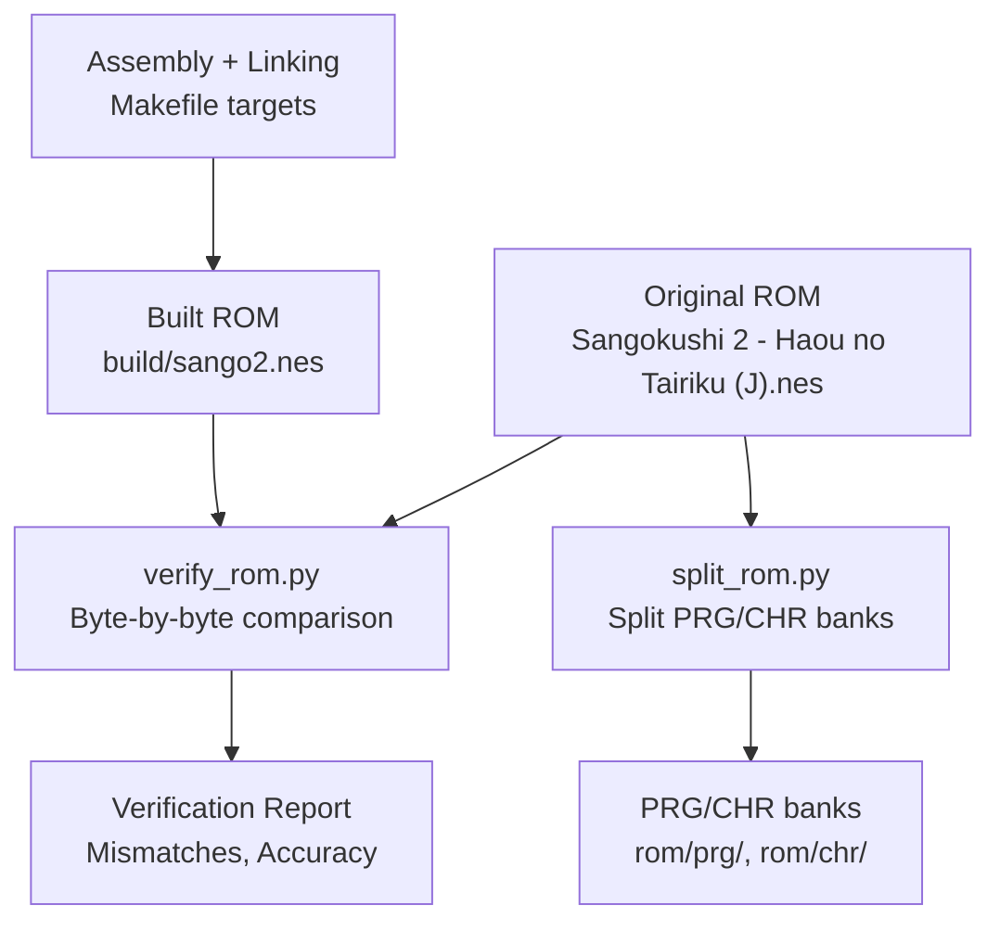
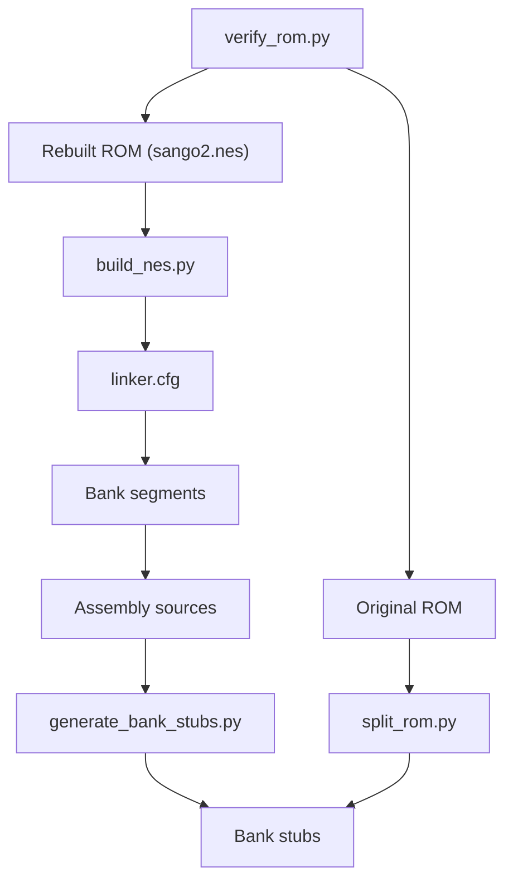

# ROM Verification and Validation

<cite>
**Referenced Files in This Document**
- [verify_rom.py](file://tools/verify_rom.py)
- [Makefile](file://Makefile)
- [build_nes.py](file://tools/build_nes.py)
- [split_rom.py](file://tools/split_rom.py)
- [disasm_6502.py](file://tools/disasm_6502.py)
- [analyze_rom.py](file://tools/analyze_rom.py)
- [generate_bank_stubs.py](file://tools/generate_bank_stubs.py)
- [linker.cfg](file://linker.cfg)
- [PROJECT.md](file://PROJECT.md)
</cite>

## Table of Contents
1. [Introduction](#introduction)
2. [Project Structure](#project-structure)
3. [Core Components](#core-components)
4. [Architecture Overview](#architecture-overview)
5. [Detailed Component Analysis](#detailed-component-analysis)
6. [Dependency Analysis](#dependency-analysis)
7. [Performance Considerations](#performance-considerations)
8. [Troubleshooting Guide](#troubleshooting-guide)
9. [Conclusion](#conclusion)

## Introduction
This document explains the ROM verification system used to ensure byte-exact accuracy between rebuilt ROMs and the original. The verification mechanism performs a deterministic, side-by-side comparison of two ROM files to validate disassembly correctness and maintain project quality throughout the development lifecycle.

The verification workflow integrates with the broader build pipeline: ROM splitting, assembly, linking, and final ROM construction. It reports mismatches with precise byte-level details and calculates accuracy metrics to guide iterative improvements.

## Project Structure
The verification system spans several tools and build targets:

- Verification tool: compares two ROM files byte-by-byte
- Build pipeline: constructs a ROM from assembled binaries
- ROM splitting: extracts PRG/CHR banks from the original ROM
- Disassembly utilities: assist in analyzing and validating code regions
- Linker configuration: defines memory layout and bank segments



**Diagram sources**
- [Makefile:58-61](file://Makefile#L58-L61)
- [split_rom.py:38-122](file://tools/split_rom.py#L38-L122)
- [verify_rom.py:10-51](file://tools/verify_rom.py#L10-L51)

**Section sources**
- [PROJECT.md:14-47](file://PROJECT.md#L14-L47)
- [Makefile:58-61](file://Makefile#L58-L61)

## Core Components
The verification system centers on a single-purpose tool that performs deterministic byte-by-byte comparison:

- Input validation: checks existence of both original and rebuilt ROMs
- Size comparison: warns on differing sizes
- Byte-by-byte scan: identifies mismatches up to a configurable limit
- Reporting: prints total mismatches, first mismatch address, and calculated accuracy

Key behaviors:
- Prints detailed mismatch entries for the first N mismatches
- Calculates accuracy percentage based on matched bytes
- Returns exit code suitable for CI and automation

**Section sources**
- [verify_rom.py:10-51](file://tools/verify_rom.py#L10-L51)

## Architecture Overview
The verification process fits into the broader build and analysis pipeline:

```mermaid
sequenceDiagram
participant Dev as "Developer"
participant Make as "Makefile"
participant Asm as "Assembler (ca65)"
participant Link as "Linker (ld65)"
participant Build as "build_nes.py"
participant Verify as "verify_rom.py"
participant Orig as "Original ROM"
Dev->>Make : make verify
Make->>Asm : assemble main.asm
Asm-->>Make : object file
Make->>Link : link segments
Link-->>Make : prg.bin
Make->>Build : add iNES header + CHR
Build-->>Make : sango2.nes
Make->>Verify : compare original vs rebuilt
Verify->>Orig : read original ROM
Verify->>Verify : compare byte-by-byte
Verify-->>Dev : report mismatches + accuracy
```

**Diagram sources**
- [Makefile:38-48](file://Makefile#L38-L48)
- [Makefile:58-61](file://Makefile#L58-L61)
- [build_nes.py:10-51](file://tools/build_nes.py#L10-L51)
- [verify_rom.py:10-51](file://tools/verify_rom.py#L10-L51)

## Detailed Component Analysis

### Verification Algorithm
The core algorithm performs a deterministic, linear scan of both ROMs:


**Diagram sources**
- [verify_rom.py:10-51](file://tools/verify_rom.py#L10-L51)

**Section sources**
- [verify_rom.py:10-51](file://tools/verify_rom.py#L10-L51)

### Comparison Methodology
- Deterministic order: bytes compared in ascending address order
- Early termination: stops scanning after reaching the shorter ROM length
- First-mismatch tracking: records the first mismatch address for quick navigation
- Limited visibility: displays only the first N mismatches to keep logs readable

This methodology ensures reproducible results and clear actionable feedback for developers.

**Section sources**
- [verify_rom.py:27-51](file://tools/verify_rom.py#L27-L51)

### Reporting Mechanisms
The verifier produces structured output:
- Size comparison summary
- Mismatch details (address, original byte, rebuilt byte)
- Total mismatches and accuracy percentage
- First mismatch address for rapid investigation

Exit codes:
- 0 indicates success (identical ROMs)
- Non-zero indicates failure (mismatches present)

**Section sources**
- [verify_rom.py:18-51](file://tools/verify_rom.py#L18-L51)

### Verification Process Workflow
End-to-end workflow integrating with the build system:

```mermaid
sequenceDiagram
participant Dev as "Developer"
participant Make as "Makefile"
participant Split as "split_rom.py"
participant Gen as "generate_bank_stubs.py"
participant Asm as "Assembler"
participant Link as "Linker"
participant Build as "build_nes.py"
participant Verify as "verify_rom.py"
Dev->>Make : make split
Make->>Split : split original ROM
Split-->>Dev : PRG/CHR banks
Dev->>Make : make banks
Make->>Gen : generate bank stubs
Gen-->>Dev : asm/banks/*.asm
Dev->>Make : make all
Make->>Asm : assemble
Asm-->>Make : object files
Make->>Link : link with linker.cfg
Link-->>Make : prg.bin
Make->>Build : build iNES ROM
Build-->>Make : sango2.nes
Dev->>Make : make verify
Make->>Verify : compare original vs sango2.nes
Verify-->>Dev : verification report
```

**Diagram sources**
- [Makefile:54-61](file://Makefile#L54-L61)
- [split_rom.py:38-122](file://tools/split_rom.py#L38-L122)
- [generate_bank_stubs.py:12-46](file://tools/generate_bank_stubs.py#L12-L46)
- [linker.cfg:18-54](file://linker.cfg#L18-L54)
- [build_nes.py:10-51](file://tools/build_nes.py#L10-L51)
- [verify_rom.py:10-51](file://tools/verify_rom.py#L10-L51)

**Section sources**
- [Makefile:54-61](file://Makefile#L54-L61)
- [PROJECT.md:134-150](file://PROJECT.md#L134-L150)

### Practical Examples of Verification Output Interpretation
Common scenarios and how to interpret results:

- No mismatches and equal sizes: SUCCESS message; ROMs are identical
- Mismatches present: shows total mismatches, accuracy percentage, and first mismatch address
- Size mismatch warning: indicates padding or header differences; investigate build configuration
- First mismatch address: use to locate the problematic area in the disassembly or assembly

These outputs guide targeted fixes and iterative improvements.

**Section sources**
- [verify_rom.py:22-51](file://tools/verify_rom.py#L22-L51)

### Common Verification Scenarios
- Fresh rebuild: expect zero mismatches; any mismatch indicates incorrect assembly or linker configuration
- After editing bank stubs: mismatches often appear near the edited region; use first mismatch address to focus analysis
- After linker updates: mismatches may shift due to segment placement; re-run verification to confirm resolution
- Post-disasm: mismatches indicate incorrect disassembly or missing bank segments in the linker configuration

**Section sources**
- [PROJECT.md:134-150](file://PROJECT.md#L134-L150)
- [linker.cfg:32-54](file://linker.cfg#L32-L54)

### Troubleshooting Approaches for Mismatches
- Confirm ROM sizes: if sizes differ, review the build process and header creation
- Inspect first mismatch address: navigate to the corresponding address in the disassembly and verify correctness
- Validate bank segments: ensure all used banks are included in the linker configuration
- Check bank stubs: ensure stubs are replaced with actual disassembled code and not left as incbins
- Review disassembly accuracy: use the disassembler to cross-check instruction boundaries and operands
- Analyze ROM structure: use the ROM analyzer to identify unexpected patterns or misclassified banks

**Section sources**
- [verify_rom.py:35-51](file://tools/verify_rom.py#L35-L51)
- [linker.cfg:32-54](file://linker.cfg#L32-L54)
- [generate_bank_stubs.py:24-32](file://tools/generate_bank_stubs.py#L24-L32)
- [analyze_rom.py:10-122](file://tools/analyze_rom.py#L10-L122)

## Dependency Analysis
The verification system depends on the build pipeline and ROM structure:



**Diagram sources**
- [verify_rom.py:10-51](file://tools/verify_rom.py#L10-L51)
- [build_nes.py:10-51](file://tools/build_nes.py#L10-L51)
- [linker.cfg:18-54](file://linker.cfg#L18-L54)
- [generate_bank_stubs.py:12-46](file://tools/generate_bank_stubs.py#L12-L46)
- [split_rom.py:38-122](file://tools/split_rom.py#L38-L122)

**Section sources**
- [Makefile:38-48](file://Makefile#L38-L48)
- [linker.cfg:18-54](file://linker.cfg#L18-L54)

## Performance Considerations
- Linear scan complexity: O(n) where n is the minimum ROM size; efficient for typical ROM sizes
- Memory usage: loads entire ROMs into memory; acceptable for standard ROM sizes
- Output limiting: caps displayed mismatches to reduce log verbosity
- Early exit: stops scanning after the shorter ROM length to avoid unnecessary work

[No sources needed since this section provides general guidance]

## Troubleshooting Guide
Common issues and resolutions:

- File not found errors: verify paths to original and rebuilt ROMs; ensure they exist before running verification
- Size mismatches: check header creation and padding logic; ensure PRG size aligns with expectations
- Excessive mismatches: inspect recent changes to bank segments or disassembly accuracy
- First mismatch instability: indicates linker or disassembly drift; stabilize by fixing segments and re-running verification

**Section sources**
- [verify_rom.py:53-69](file://tools/verify_rom.py#L53-L69)
- [build_nes.py:15-20](file://tools/build_nes.py#L15-L20)

## Conclusion
The ROM verification system provides a robust, deterministic mechanism to validate disassembly correctness. By performing byte-exact comparisons and delivering precise reporting, it anchors the development cycle with reliable quality checks. Proper use of verification output, combined with careful linker configuration and accurate disassembly, ensures high-fidelity ROM reconstruction and maintains project quality throughout development.