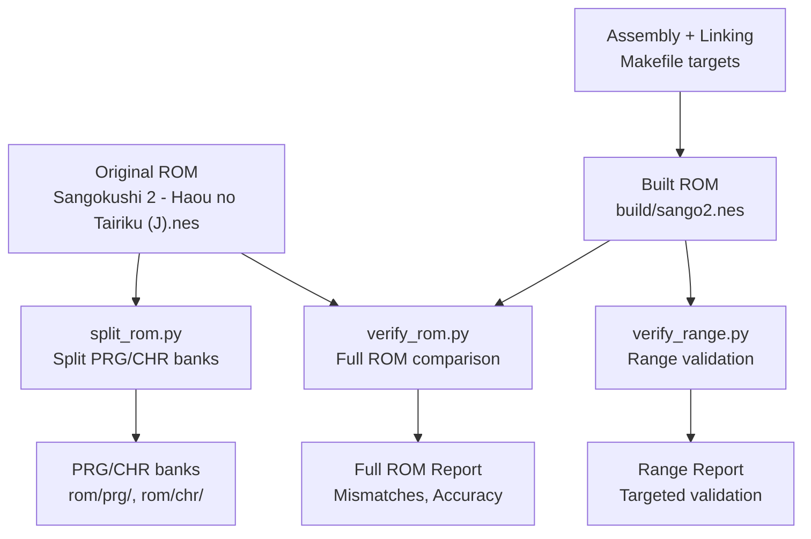
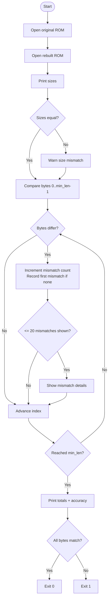
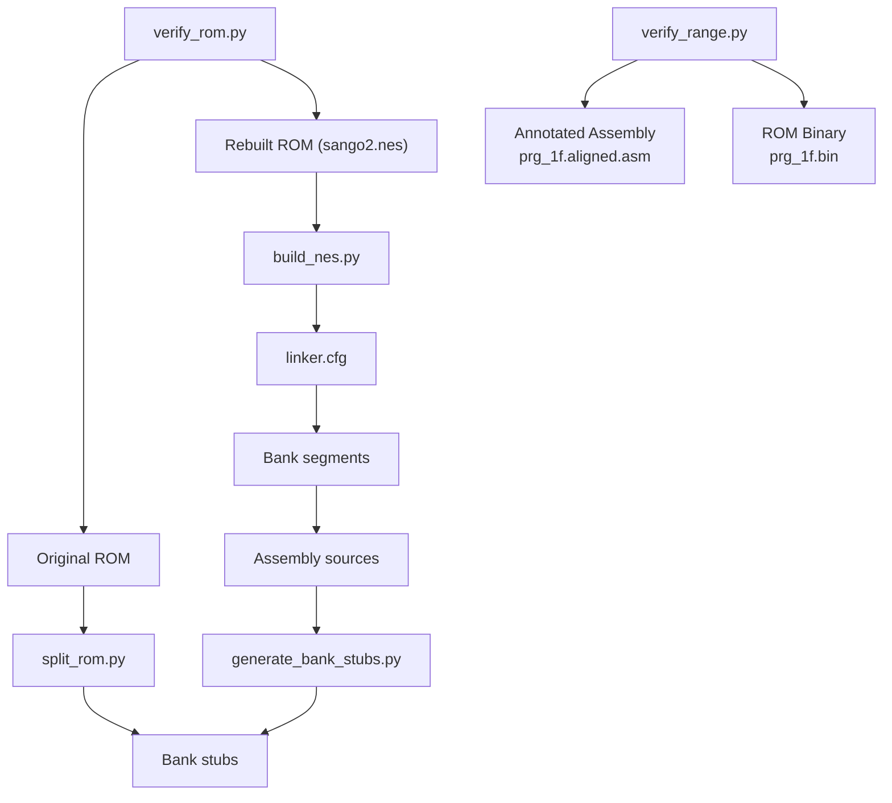

# ROM Verification and Validation

<cite>
**Referenced Files in This Document**
- [verify_range.py](file://tools/verify_range.py)
- [verify_rom.py](file://tools/verify_rom.py)
- [Makefile](file://Makefile)
- [build_nes.py](file://tools/build_nes.py)
- [split_rom.py](file://tools/split_rom.py)
- [disasm_6502.py](file://tools/disasm_6502.py)
- [analyze_rom.py](file://tools/analyze_rom.py)
- [generate_bank_stubs.py](file://tools/generate_bank_stubs.py)
- [linker.cfg](file://linker.cfg)
- [PROJECT.md](file://PROJECT.md)
</cite>

## Update Summary
**Changes Made**
- Added documentation for new verify_range.py tool for validating disassembly ranges
- Enhanced verification process workflow to include range-specific validation
- Updated architecture overview to reflect dual verification approach (full ROM + range validation)
- Expanded troubleshooting guide with range validation scenarios
- Added new section covering range-based verification methodology

## Table of Contents
1. [Introduction](#introduction)
2. [Project Structure](#project-structure)
3. [Core Components](#core-components)
4. [Architecture Overview](#architecture-overview)
5. [Detailed Component Analysis](#detailed-component-analysis)
6. [Enhanced Verification Pipeline](#enhanced-verification-pipeline)
7. [Range-Based Verification](#range-based-verification)
8. [Dependency Analysis](#dependency-analysis)
9. [Performance Considerations](#performance-considerations)
10. [Troubleshooting Guide](#troubleshooting-guide)
11. [Conclusion](#conclusion)

## Introduction
This document explains the ROM verification system used to ensure byte-exact accuracy between rebuilt ROMs and the original. The verification mechanism performs both comprehensive ROM-level validation and targeted range-based validation to validate disassembly correctness and maintain project quality throughout the development lifecycle.

The verification workflow integrates with the broader build pipeline: ROM splitting, assembly, linking, and final ROM construction. It reports mismatches with precise byte-level details and calculates accuracy metrics to guide iterative improvements. The system now includes specialized tools for validating specific memory ranges, particularly useful for targeted bank validation and integrity checking.

## Project Structure
The verification system spans several tools and build targets, now enhanced with range-specific validation capabilities:

- Full ROM verification tool: compares two ROM files byte-by-byte for complete validation
- Range verification tool: validates specific memory ranges within disassembly files
- Build pipeline: constructs a ROM from assembled binaries
- ROM splitting: extracts PRG/CHR banks from the original ROM
- Disassembly utilities: assist in analyzing and validating code regions
- Linker configuration: defines memory layout and bank segments



**Diagram sources**
- [Makefile:58-62](file://Makefile#L58-L62)
- [split_rom.py:38-122](file://tools/split_rom.py#L38-L122)
- [verify_rom.py:10-73](file://tools/verify_rom.py#L10-L73)
- [verify_range.py:1-62](file://tools/verify_range.py#L1-62)

**Section sources**
- [PROJECT.md:14-47](file://PROJECT.md#L14-L47)
- [Makefile:58-62](file://Makefile#L58-L62)

## Core Components
The verification system centers on two complementary tools that perform deterministic validation:

### Full ROM Verification Tool
The primary verification tool performs comprehensive byte-by-byte comparison:

- Input validation: checks existence of both original and rebuilt ROMs
- Size comparison: warns on differing sizes
- Byte-by-byte scan: identifies mismatches up to a configurable limit
- Reporting: prints total mismatches, first mismatch address, and calculated accuracy

### Range Verification Tool
The new range validation tool focuses on specific memory ranges within disassembly files:

- Pattern matching: extracts expected byte sequences from annotated assembly lines
- Range filtering: validates only bytes within specified address ranges
- Binary comparison: compares disassembly annotations against actual ROM binary data
- Targeted reporting: focuses on mismatches within validated ranges

Key behaviors:
- Prints detailed mismatch entries for the first N mismatches
- Calculates accuracy percentage based on matched bytes within range
- Returns exit code suitable for CI and automation
- Validates specific memory ranges (e.g., $E843-$F2AE)

**Section sources**
- [verify_rom.py:10-73](file://tools/verify_rom.py#L10-L73)
- [verify_range.py:1-62](file://tools/verify_range.py#L1-62)

## Architecture Overview
The verification process fits into the broader build and analysis pipeline with enhanced validation capabilities:

```mermaid
sequenceDiagram
participant Dev as "Developer"
participant Make as "Makefile"
participant Asm as "Assembler (ca65)"
participant Link as "Linker (ld65)"
participant Build as "build_nes.py"
participant VerifyFull as "verify_rom.py"
participant VerifyRange as "verify_range.py"
participant Orig as "Original ROM"
Dev->>Make : make verify
Make->>Asm : assemble main.asm
Asm-->>Make : object file
Make->>Link : link segments
Link-->>Make : prg.bin
Make->>Build : add iNES header + CHR
Build-->>Make : sango2.nes
Make->>VerifyFull : compare original vs rebuilt
VerifyFull->>Orig : read original ROM
VerifyFull->>VerifyFull : compare byte-by-byte
VerifyFull-->>Dev : report full ROM mismatches + accuracy
Make->>VerifyRange : validate specific ranges
VerifyRange->>VerifyRange : parse annotated assembly
VerifyRange->>VerifyRange : compare against ROM binary
VerifyRange-->>Dev : report range-specific mismatches
```

**Diagram sources**
- [Makefile:38-48](file://Makefile#L38-L48)
- [Makefile:58-62](file://Makefile#L58-L62)
- [build_nes.py:10-51](file://tools/build_nes.py#L10-L51)
- [verify_rom.py:10-73](file://tools/verify_rom.py#L10-L73)
- [verify_range.py:1-62](file://tools/verify_range.py#L1-62)

## Detailed Component Analysis

### Full ROM Verification Algorithm
The core algorithm performs a deterministic, linear scan of both ROMs:



**Diagram sources**
- [verify_rom.py:10-73](file://tools/verify_rom.py#L10-L73)

**Section sources**
- [verify_rom.py:10-73](file://tools/verify_rom.py#L10-L73)

### Range Verification Algorithm
The range validation tool implements a specialized validation process:


**Diagram sources**
- [verify_range.py:26-55](file://tools/verify_range.py#L26-L55)

**Section sources**
- [verify_range.py:1-62](file://tools/verify_range.py#L1-62)

### Comparison Methodology
Both verification tools employ deterministic methodologies:

#### Full ROM Verification
- Deterministic order: bytes compared in ascending address order
- Early termination: stops scanning after reaching the shorter ROM length
- First-mismatch tracking: records the first mismatch address for quick navigation
- Limited visibility: displays only the first N mismatches to keep logs readable

#### Range Verification
- Pattern-based extraction: uses regex to identify annotated byte sequences
- Range filtering: validates only bytes within specified address boundaries
- Binary alignment: converts addresses to file offsets using bank base addresses
- Targeted comparison: focuses validation efforts on specific memory regions

This methodology ensures reproducible results and clear actionable feedback for developers.

**Section sources**
- [verify_rom.py:27-73](file://tools/verify_rom.py#L27-L73)
- [verify_range.py:19-55](file://tools/verify_range.py#L19-55)

### Reporting Mechanisms
Both verification tools produce structured output:

#### Full ROM Verification
- Size comparison summary
- Mismatch details (address, original byte, rebuilt byte)
- Total mismatches and accuracy percentage
- First mismatch address for rapid investigation

#### Range Verification
- Range validation summary
- Address coverage statistics
- Total bytes checked within range
- Mismatch details with line numbers and context
- Success/failure indication for targeted validation

Exit codes:
- 0 indicates success (no mismatches found)
- Non-zero indicates failure (mismatches present)

**Section sources**
- [verify_rom.py:18-73](file://tools/verify_rom.py#L18-L73)
- [verify_range.py:56-62](file://tools/verify_range.py#L56-L62)

## Enhanced Verification Pipeline
The verification system now supports a multi-layered validation approach:

### Integrated Validation Workflow
End-to-end workflow integrating both verification methods:

```mermaid
sequenceDiagram
participant Dev as "Developer"
participant Make as "Makefile"
participant Split as "split_rom.py"
participant Gen as "generate_bank_stubs.py"
participant Asm as "Assembler"
participant Link as "Linker"
participant Build as "build_nes.py"
participant VerifyFull as "verify_rom.py"
participant VerifyRange as "verify_range.py"
Dev->>Make : make split
Make->>Split : split original ROM
Split-->>Dev : PRG/CHR banks
Dev->>Make : make banks
Make->>Gen : generate bank stubs
Gen-->>Dev : asm/banks/*.asm
Dev->>Make : make all
Make->>Asm : assemble
Asm-->>Make : object files
Make->>Link : link with linker.cfg
Link-->>Make : prg.bin
Make->>Build : build iNES ROM
Build-->>Make : sango2.nes
Dev->>Make : make verify
Make->>VerifyFull : full ROM comparison
VerifyFull-->>Dev : comprehensive report
Make->>VerifyRange : range-specific validation
VerifyRange-->>Dev : targeted validation report
```

**Diagram sources**
- [Makefile:54-62](file://Makefile#L54-L62)
- [split_rom.py:38-122](file://tools/split_rom.py#L38-L122)
- [generate_bank_stubs.py:12-46](file://tools/generate_bank_stubs.py#L12-L46)
- [linker.cfg:18-54](file://linker.cfg#L18-L54)
- [build_nes.py:10-51](file://tools/build_nes.py#L10-L51)
- [verify_rom.py:10-73](file://tools/verify_rom.py#L10-L73)
- [verify_range.py:1-62](file://tools/verify_range.py#L1-62)

**Section sources**
- [Makefile:54-62](file://Makefile#L54-L62)
- [PROJECT.md:134-150](file://PROJECT.md#L134-L150)

### Practical Examples of Verification Output Interpretation
Common scenarios and how to interpret results:

#### Full ROM Verification
- No mismatches and equal sizes: SUCCESS message; ROMs are identical
- Mismatches present: shows total mismatches, accuracy percentage, and first mismatch address
- Size mismatch warning: indicates padding or header differences; investigate build configuration
- First mismatch address: use to locate the problematic area in the disassembly or assembly

#### Range Verification
- Targeted validation success: confirms specific memory ranges are accurate
- Range-specific mismatches: highlights issues within validated address ranges
- Address coverage: shows how many addresses were checked within the specified range
- Context-rich reporting: includes line numbers and assembly context for easy debugging

These outputs guide targeted fixes and iterative improvements across different validation scopes.

**Section sources**
- [verify_rom.py:22-73](file://tools/verify_rom.py#L22-L73)
- [verify_range.py:22-62](file://tools/verify_range.py#L22-L62)

### Common Verification Scenarios
- Fresh rebuild: expect zero mismatches; any mismatch indicates incorrect assembly or linker configuration
- After editing bank stubs: mismatches often appear near the edited region; use first mismatch address to focus analysis
- After linker updates: mismatches may shift due to segment placement; re-run verification to confirm resolution
- Post-disasm: mismatches indicate incorrect disassembly or missing bank segments in the linker configuration
- Range validation failures: indicate specific memory corruption or annotation errors within targeted regions

**Section sources**
- [PROJECT.md:134-150](file://PROJECT.md#L134-L150)
- [linker.cfg:32-54](file://linker.cfg#L32-L54)
- [verify_range.py:30-31](file://tools/verify_range.py#L30-L31)

### Troubleshooting Approaches for Mismatches
- Confirm ROM sizes: if sizes differ, review the build process and header creation
- Inspect first mismatch address: navigate to the corresponding address in the disassembly and verify correctness
- Validate bank segments: ensure all used banks are included in the linker configuration
- Check bank stubs: ensure stubs are replaced with actual disassembled code and not left as incbins
- Review disassembly accuracy: use the disassembler to cross-check instruction boundaries and operands
- Analyze ROM structure: use the ROM analyzer to identify unexpected patterns or misclassified banks
- Validate range annotations: ensure assembly files contain proper byte annotations for range validation
- Check memory mapping: verify that address calculations align with expected bank layouts

**Section sources**
- [verify_rom.py:35-73](file://tools/verify_rom.py#L35-L73)
- [linker.cfg:32-54](file://linker.cfg#L32-L54)
- [generate_bank_stubs.py:24-32](file://tools/generate_bank_stubs.py#L24-L32)
- [analyze_rom.py:10-122](file://tools/analyze_rom.py#L10-L122)
- [verify_range.py:36-39](file://tools/verify_range.py#L36-L39)

## Range-Based Verification
The new range validation capability provides targeted validation for specific memory regions:

### Range Validation Methodology
The range verification tool implements specialized validation for memory regions:

- **Pattern Recognition**: Uses regex to identify lines containing byte annotations in the format `; $XXXX: XX XX XX`
- **Range Filtering**: Validates only bytes within specified address boundaries (e.g., $E843-$F2AE)
- **Address Calculation**: Converts assembly addresses to file offsets using bank base addresses
- **Binary Alignment**: Compares annotated bytes against actual ROM binary data
- **Targeted Reporting**: Focuses on mismatches within validated ranges with detailed context

### Key Features
- **Configurable Ranges**: Easy to modify address ranges for different validation scenarios
- **Assembly Integration**: Leverages existing annotated assembly files for validation
- **Context Preservation**: Maintains line numbers and assembly context for debugging
- **Performance Optimization**: Focuses validation efforts on specific memory regions
- **Complementary Validation**: Works alongside full ROM verification for comprehensive coverage

### Usage Examples
The range validation tool is particularly useful for:
- Validating specific bank regions during development
- Checking memory-mapped hardware registers
- Verifying critical code sections
- Testing interrupt handlers and vectors
- Validating data tables and constants

**Section sources**
- [verify_range.py:1-62](file://tools/verify_range.py#L1-62)

## Dependency Analysis
The verification system depends on the build pipeline and ROM structure:



**Diagram sources**
- [verify_rom.py:10-73](file://tools/verify_rom.py#L10-L73)
- [verify_range.py:7-9](file://tools/verify_range.py#L7-L9)
- [build_nes.py:10-51](file://tools/build_nes.py#L10-L51)
- [linker.cfg:18-54](file://linker.cfg#L18-L54)
- [generate_bank_stubs.py:12-46](file://tools/generate_bank_stubs.py#L12-L46)
- [split_rom.py:38-122](file://tools/split_rom.py#L38-L122)

**Section sources**
- [Makefile:38-48](file://Makefile#L38-L48)
- [linker.cfg:18-54](file://linker.cfg#L18-L54)

## Performance Considerations
- **Linear scan complexity**: O(n) where n is the minimum ROM size; efficient for typical ROM sizes
- **Memory usage**: Loads entire ROMs into memory; acceptable for standard ROM sizes
- **Output limiting**: Caps displayed mismatches to reduce log verbosity
- **Early exit**: Stops scanning after the shorter ROM length to avoid unnecessary work
- **Range optimization**: Targeted validation reduces processing time for specific memory regions
- **Pattern matching overhead**: Regex processing adds minimal overhead for range validation
- **File I/O efficiency**: Both tools use buffered I/O for optimal performance

## Troubleshooting Guide
Common issues and resolutions:

### Full ROM Verification Issues
- File not found errors: verify paths to original and rebuilt ROMs; ensure they exist before running verification
- Size mismatches: check header creation and padding logic; ensure PRG size aligns with expectations
- Excessive mismatches: inspect recent changes to bank segments or disassembly accuracy
- First mismatch instability: indicates linker or disassembly drift; stabilize by fixing segments and re-running verification

### Range Verification Issues
- Pattern matching failures: ensure assembly files contain proper byte annotations
- Address range errors: verify address boundaries align with expected memory layout
- Offset calculation issues: check bank base address assumptions in address-to-offset conversion
- Missing binary data: ensure ROM binary files exist and contain expected data for validation
- False positives: verify that annotated bytes represent actual ROM content, not comments or metadata

**Section sources**
- [verify_rom.py:53-73](file://tools/verify_rom.py#L53-L73)
- [verify_range.py:44-46](file://tools/verify_range.py#L44-L46)
- [build_nes.py:15-20](file://tools/build_nes.py#L15-L20)

## Conclusion
The ROM verification system provides a robust, deterministic mechanism to validate disassembly correctness through both comprehensive and targeted validation approaches. By performing byte-exact comparisons and delivering precise reporting, it anchors the development cycle with reliable quality checks. The addition of range-based validation enhances the system's ability to validate specific memory regions while maintaining the comprehensive coverage of full ROM validation.

Proper use of verification output, combined with careful linker configuration and accurate disassembly, ensures high-fidelity ROM reconstruction and maintains project quality throughout development. The dual-validation approach provides both broad coverage and targeted precision, enabling developers to quickly identify and resolve issues across different scopes of the ROM structure.