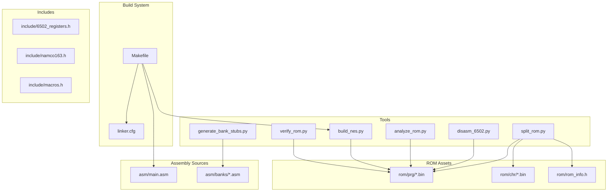
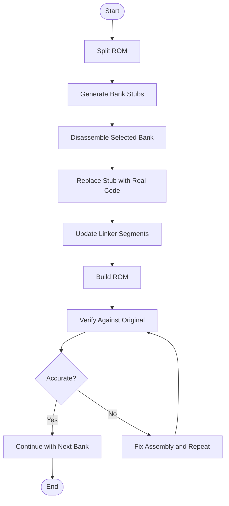
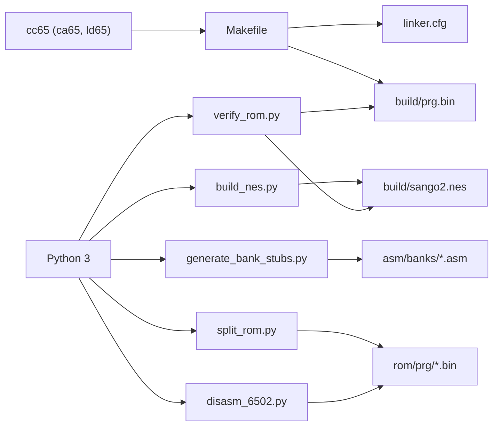

# Contributing Guidelines

<cite>
**Referenced Files in This Document**
- [PROJECT.md](file://PROJECT.md)
- [Makefile](file://Makefile)
- [linker.cfg](file://linker.cfg)
- [include/6502_registers.h](file://include/6502_registers.h)
- [include/namco163.h](file://include/namco163.h)
- [include/macros.h](file://include/macros.h)
- [tools/disasm_6502.py](file://tools/disasm_6502.py)
- [tools/analyze_rom.py](file://tools/analyze_rom.py)
- [tools/generate_bank_stubs.py](file://tools/generate_bank_stubs.py)
- [tools/verify_rom.py](file://tools/verify_rom.py)
- [tools/build_nes.py](file://tools/build_nes.py)
- [tools/split_rom.py](file://tools/split_rom.py)
- [asm/banks/prg_1f.asm](file://asm/banks/prg_1f.asm)
- [code/bank_1f_analysis.md](file://code/bank_1f_analysis.md)
- [code/bank_1f_plan.md](file://code/bank_1f_plan.md)
</cite>

## Table of Contents
1. [Introduction](#introduction)
2. [Project Structure](#project-structure)
3. [Core Components](#core-components)
4. [Architecture Overview](#architecture-overview)
5. [Detailed Component Analysis](#detailed-component-analysis)
6. [Dependency Analysis](#dependency-analysis)
7. [Performance Considerations](#performance-considerations)
8. [Troubleshooting Guide](#troubleshooting-guide)
9. [Conclusion](#conclusion)
10. [Appendices](#appendices)

## Introduction
This document describes the development workflows and quality standards for the sango2dasm project. It explains how to propose new analysis tools, contribute disassembly improvements, submit bug reports, and integrate changes into the main project. It also covers code review expectations, documentation requirements, testing procedures, coding standards for assembly, naming conventions, and organizational principles for new bank files. Guidance is included for maintaining backward compatibility, handling dependencies, coordinating changes across contributors, and managing releases and versioning.

## Project Structure
The repository is organized around a cc65-based disassembly pipeline for the Namco-163 (Mapper 19) game ROM. Key areas:
- Tools: Python scripts for ROM splitting, disassembly, analysis, bank stub generation, verification, and ROM building
- Build system: Makefile and linker configuration for assembling and linking
- Assembly sources: Entry point and bank stubs for 32 PRG banks
- Includes: 6502/PPU/APU/Namco-163 register and macro definitions
- ROM assets: Split PRG/CHR banks and combined binaries
- Code documentation: Markdown analyses and plans for bank 0x1F



**Diagram sources**
- [Makefile:1-102](file://Makefile#L1-L102)
- [linker.cfg:1-55](file://linker.cfg#L1-L55)
- [tools/split_rom.py:1-140](file://tools/split_rom.py#L1-L140)
- [tools/disasm_6502.py:1-363](file://tools/disasm_6502.py#L1-L363)
- [tools/analyze_rom.py:1-135](file://tools/analyze_rom.py#L1-L135)
- [tools/generate_bank_stubs.py:1-53](file://tools/generate_bank_stubs.py#L1-L53)
- [tools/verify_rom.py:1-73](file://tools/verify_rom.py#L1-L73)
- [tools/build_nes.py:1-58](file://tools/build_nes.py#L1-L58)

**Section sources**
- [PROJECT.md:14-47](file://PROJECT.md#L14-L47)
- [Makefile:12-30](file://Makefile#L12-L30)
- [linker.cfg:18-54](file://linker.cfg#L18-L54)

## Core Components
- Build system: Makefile orchestrates assembly, linking, ROM creation, and verification
- Linker configuration: Defines memory map and segments for 4 PRG slots and 32 banks
- Tools: Python utilities for ROM splitting, disassembly, analysis, bank stub generation, verification, and ROM building
- Assembly sources: Entry point and bank stubs; bank stubs are later replaced with real disassembly
- Includes: Register and macro definitions for 6502/PPU/APU/Namco-163
- Documentation: Bank 0x1F analysis and plan documents guide disassembly priorities

**Section sources**
- [PROJECT.md:58-69](file://PROJECT.md#L58-L69)
- [Makefile:37-48](file://Makefile#L37-L48)
- [linker.cfg:18-54](file://linker.cfg#L18-L54)
- [tools/split_rom.py:38-122](file://tools/split_rom.py#L38-L122)
- [tools/disasm_6502.py:336-363](file://tools/disasm_6502.py#L336-L363)
- [tools/analyze_rom.py:10-128](file://tools/analyze_rom.py#L10-L128)
- [tools/generate_bank_stubs.py:12-46](file://tools/generate_bank_stubs.py#L12-L46)
- [tools/verify_rom.py:10-51](file://tools/verify_rom.py#L10-L51)
- [tools/build_nes.py:10-51](file://tools/build_nes.py#L10-L51)

## Architecture Overview
The development workflow centers on a deterministic pipeline:
- Prepare ROM assets via splitting
- Generate bank stubs
- Disassemble and replace stubs with accurate assembly
- Link and build a ROM
- Verify byte-for-byte accuracy against the original
- Iterate with analysis and targeted disassembly

```mermaid
sequenceDiagram
participant Dev as "Developer"
participant Split as "split_rom.py"
participant Stubs as "generate_bank_stubs.py"
participant Disasm as "disasm_6502.py"
participant Assemble as "Makefile"
participant Link as "linker.cfg"
participant Build as "build_nes.py"
participant Verify as "verify_rom.py"
Dev->>Split : "Split original ROM"
Split-->>Dev : "PRG/CHR banks + rom_info.h"
Dev->>Stubs : "Generate bank stubs"
Stubs-->>Dev : "asm/banks/*.asm with .incbin"
Dev->>Disasm : "Disassemble selected banks"
Disasm-->>Dev : "Listing for manual review"
Dev->>Assemble : "make (assemble/link)"
Assemble->>Link : "Apply segments/memory map"
Assemble-->>Dev : "prg.bin"
Dev->>Build : "Add iNES header"
Build-->>Dev : "sango2.nes"
Dev->>Verify : "Compare with original"
Verify-->>Dev : "Mismatches/accuracy report"
```

**Diagram sources**
- [tools/split_rom.py:38-122](file://tools/split_rom.py#L38-L122)
- [tools/generate_bank_stubs.py:12-46](file://tools/generate_bank_stubs.py#L12-L46)
- [tools/disasm_6502.py:286-334](file://tools/disasm_6502.py#L286-L334)
- [Makefile:37-48](file://Makefile#L37-L48)
- [linker.cfg:18-54](file://linker.cfg#L18-L54)
- [tools/build_nes.py:10-51](file://tools/build_nes.py#L10-L51)
- [tools/verify_rom.py:10-51](file://tools/verify_rom.py#L10-L51)

## Detailed Component Analysis

### Development Workflow: How to Contribute Disassembly Improvements
- Start with ROM preparation: run the ROM split to produce 32 PRG banks and 32 CHR banks
- Generate bank stubs to bootstrap assembly
- Disassemble a bank with the disassembler to produce a listing for manual review
- Replace the stub in the corresponding bank file with accurate assembly
- Update linker segments and memory regions as new banks are added
- Build and verify the ROM against the original; iterate until accuracy improves



**Diagram sources**
- [tools/split_rom.py:38-122](file://tools/split_rom.py#L38-L122)
- [tools/generate_bank_stubs.py:12-46](file://tools/generate_bank_stubs.py#L12-L46)
- [tools/disasm_6502.py:286-334](file://tools/disasm_6502.py#L286-L334)
- [Makefile:37-48](file://Makefile#L37-L48)
- [linker.cfg:18-54](file://linker.cfg#L18-L54)
- [tools/verify_rom.py:10-51](file://tools/verify_rom.py#L10-L51)

**Section sources**
- [PROJECT.md:134-181](file://PROJECT.md#L134-L181)
- [tools/split_rom.py:38-122](file://tools/split_rom.py#L38-L122)
- [tools/generate_bank_stubs.py:12-46](file://tools/generate_bank_stubs.py#L12-L46)
- [tools/disasm_6502.py:286-334](file://tools/disasm_6502.py#L286-L334)
- [Makefile:37-48](file://Makefile#L37-L48)
- [linker.cfg:18-54](file://linker.cfg#L18-L54)
- [tools/verify_rom.py:10-51](file://tools/verify_rom.py#L10-L51)

### Proposal Workflow: How to Propose New Analysis Tools
- Open an issue describing the tool’s purpose, inputs, outputs, and how it fits the pipeline
- Provide a minimal prototype script in the tools/ directory with a clear docstring and CLI usage
- Demonstrate correctness with example inputs and expected outputs
- Update the Makefile targets and documentation if the tool becomes part of the standard workflow

**Section sources**
- [PROJECT.md:58-69](file://PROJECT.md#L58-L69)
- [Makefile:63-69](file://Makefile#L63-L69)

### Bug Reports and Testing Procedures
- Reproduce the issue using the Makefile targets and tools
- Capture the exact commands and outputs
- Include the ROM info and build artifacts for context
- Use the verification tool to quantify mismatches and attach the report
- For assembly issues, include the listing and the relevant bank file

**Section sources**
- [tools/verify_rom.py:10-51](file://tools/verify_rom.py#L10-L51)
- [PROJECT.md:165-181](file://PROJECT.md#L165-L181)

### Code Review Expectations and Documentation Requirements
- All assembly contributions must be reviewed for correctness and adherence to project standards
- Documentation must accompany significant functional changes; see bank 0x1F analysis and plan as examples
- Reviewers should verify:
  - Correctness against the original ROM via byte-accurate verification
  - Proper use of register and macro includes
  - Consistent naming and labeling conventions
  - Logical grouping and readability of code blocks

**Section sources**
- [code/bank_1f_analysis.md:1-20](file://code/bank_1f_analysis.md#L1-L20)
- [code/bank_1f_plan.md:1-20](file://code/bank_1f_plan.md#L1-L20)

### Coding Standards for Assembly
- Syntax and conventions
  - Use ca65 syntax with clear labels and comments
  - Prefer named constants and macros for addresses and registers
  - Group related functions and data; use .proc/.endproc for scoping
- Naming patterns
  - Labels: descriptive verbs or nouns (e.g., State_SystemInit, BankSwitch)
  - Variables: global RAM addresses defined near $007A-$00ED; local aliases inside .proc scopes
  - Banked functions: call bank-switched routines via $A0xx addresses as appropriate
- Organization principles for new bank files
  - Replace .incbin stubs with actual code segments
  - Add new segments to linker.cfg as banks are disassembled
  - Keep related code together and document cross-bank calls

**Section sources**
- [asm/banks/prg_1f.asm:15-70](file://asm/banks/prg_1f.asm#L15-L70)
- [linker.cfg:32-54](file://linker.cfg#L32-L54)
- [include/6502_registers.h:1-88](file://include/6502_registers.h#L1-L88)
- [include/namco163.h:1-87](file://include/namco163.h#L1-L87)
- [include/macros.h:1-72](file://include/macros.h#L1-L72)

### Maintaining Backward Compatibility and Handling Dependencies
- Respect the existing Makefile targets and tooling
- Preserve ROM structure and memory map semantics
- Update rom_info.h and linker.cfg when adding new banks or segments
- Ensure bank switching macros and register definitions remain consistent

**Section sources**
- [tools/split_rom.py:99-121](file://tools/split_rom.py#L99-L121)
- [linker.cfg:18-54](file://linker.cfg#L18-L54)
- [include/namco163.h:10-28](file://include/namco163.h#L10-L28)

### Release Process, Version Management, and Integration
- Releases are produced by building the ROM with the build tool and verifying against the original
- Versioning is implicit through commits and tags; maintain a changelog of significant disassembly milestones
- Integration follows standard pull request review and merge practices

**Section sources**
- [tools/build_nes.py:10-51](file://tools/build_nes.py#L10-L51)
- [tools/verify_rom.py:10-51](file://tools/verify_rom.py#L10-L51)

### Community Guidelines and Communication
- Use GitHub issues for proposals, bugs, and coordination
- Provide context: commands executed, outputs, and ROM info
- Reference relevant bank analysis and plan documents for alignment

**Section sources**
- [PROJECT.md:165-181](file://PROJECT.md#L165-L181)

### Templates and Examples
- Bank 0x1F analysis and plan serve as templates for documenting progress and prioritizing work
- Use the bank stubs as a starting point for new bank files and replace them with real code

**Section sources**
- [code/bank_1f_analysis.md:1-20](file://code/bank_1f_analysis.md#L1-L20)
- [code/bank_1f_plan.md:1-20](file://code/bank_1f_plan.md#L1-L20)
- [tools/generate_bank_stubs.py:12-46](file://tools/generate_bank_stubs.py#L12-L46)

## Dependency Analysis
The build and disassembly pipeline depends on:
- cc65 toolchain (ca65, ld65) and Python 3
- ROM splitting and bank stub generation
- Disassembler for initial listings
- Linker configuration for 32 banks across 4 PRG slots
- Verification against the original ROM



**Diagram sources**
- [Makefile:7-10](file://Makefile#L7-L10)
- [tools/split_rom.py:1-140](file://tools/split_rom.py#L1-L140)
- [tools/disasm_6502.py:1-363](file://tools/disasm_6502.py#L1-L363)
- [tools/generate_bank_stubs.py:1-53](file://tools/generate_bank_stubs.py#L1-L53)
- [tools/verify_rom.py:1-73](file://tools/verify_rom.py#L1-L73)
- [tools/build_nes.py:1-58](file://tools/build_nes.py#L1-L58)
- [linker.cfg:18-54](file://linker.cfg#L18-L54)

**Section sources**
- [PROJECT.md:49-69](file://PROJECT.md#L49-L69)
- [Makefile:7-10](file://Makefile#L7-L10)

## Performance Considerations
- Keep disassembly listings concise and readable; avoid unnecessary comments
- Prefer efficient addressing modes and minimize redundant operations
- Use macros for repetitive tasks (PPU/PPU writes, DMA, bank switching)
- Batch operations where safe to reduce overhead

[No sources needed since this section provides general guidance]

## Troubleshooting Guide
Common issues and remedies:
- Build errors due to missing segments: ensure linker.cfg includes new segments for each bank as it is disassembled
- Verification mismatches: carefully review the disassembler’s output and fix incorrect assumptions
- Bank switching problems: confirm correct use of macros and register addresses
- ROM size mismatches: ensure PRG padding and iNES header are generated properly

**Section sources**
- [linker.cfg:32-54](file://linker.cfg#L32-L54)
- [tools/verify_rom.py:10-51](file://tools/verify_rom.py#L10-L51)
- [include/namco163.h:10-28](file://include/namco163.h#L10-L28)
- [tools/build_nes.py:15-51](file://tools/build_nes.py#L15-L51)

## Conclusion
By following the established workflow—splitting the ROM, generating stubs, disassembling with careful review, linking with updated segments, building, and verifying—you can reliably contribute accurate disassembly improvements. Adhering to naming conventions, documentation standards, and review practices ensures maintainability and backward compatibility across the project.

[No sources needed since this section summarizes without analyzing specific files]

## Appendices

### Quick Reference: Makefile Targets and Tools
- make: build ROM from assembly
- make split: split original ROM into PRG/CHR banks
- make banks: generate PRG bank stub files
- make analyze: analyze ROM structure
- make disasm: disassemble a binary with FILE, ADDR, LEN
- make verify: compare built ROM with original
- make clean/distclean: remove build artifacts

**Section sources**
- [PROJECT.md:58-69](file://PROJECT.md#L58-L69)
- [Makefile:58-101](file://Makefile#L58-L101)