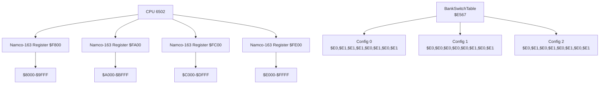
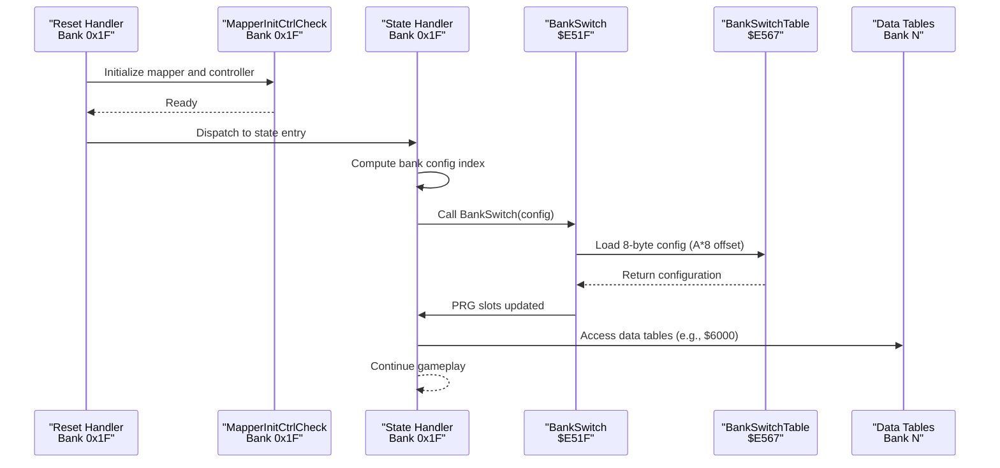
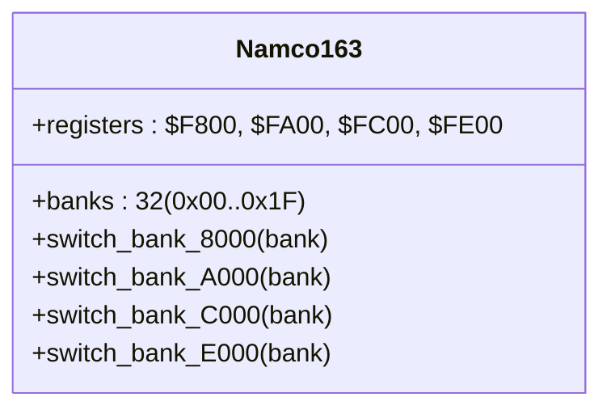
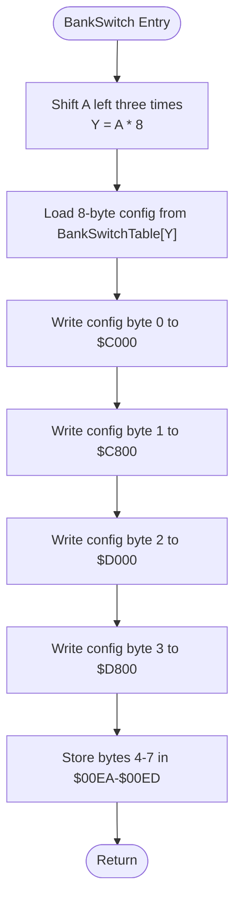
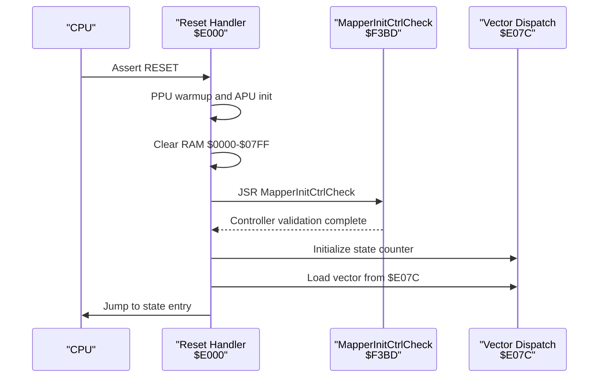
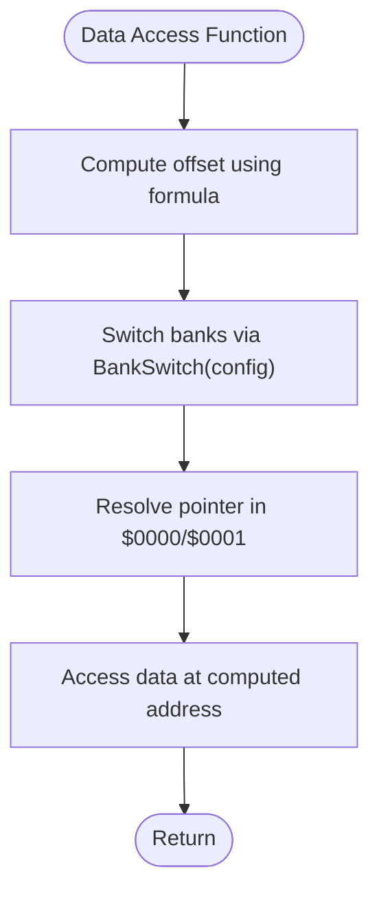
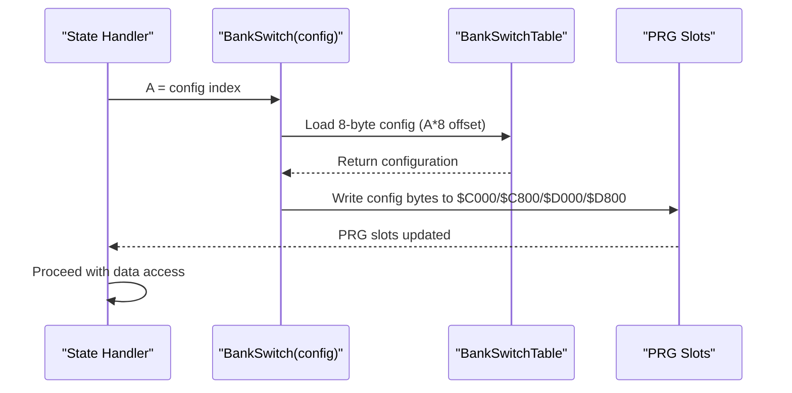
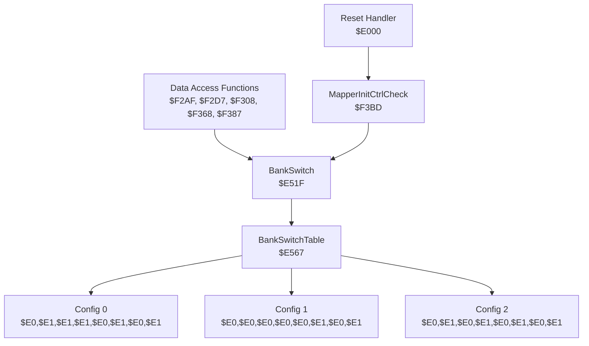

# Bank Switching for Data Access

<cite>
**Referenced Files in This Document**
- [namco163.h](file://include/namco163.h)
- [prg_1f.aligned.asm](file://asm/banks/prg_1f.aligned.asm)
- [main.asm](file://asm/main.asm)
- [PROJECT.md](file://PROJECT.md)
- [bank_1f_analysis.md](file://code/bank_1f_analysis.md)
- [key_functions_analysis.md](file://code/key_functions_analysis.md)
- [bank_1f_function_table.md](file://code/bank_1f_function_table.md)
- [bank_1f_raw.asm](file://code/bank_1f_raw.asm)
</cite>

## Update Summary
**Changes Made**
- Updated BankSwitchTable section to reflect the new three distinct configurations
- Added detailed analysis of Config 0, Config 1, and Config 2 bank switching patterns
- Enhanced practical examples with specific configuration usage scenarios
- Updated bank switching sequences to show the centralized table-driven approach
- Revised performance considerations to account for the new configuration system

## Table of Contents
1. [Introduction](#introduction)
2. [Project Structure](#project-structure)
3. [Core Components](#core-components)
4. [Architecture Overview](#architecture-overview)
5. [Detailed Component Analysis](#detailed-component-analysis)
6. [Dependency Analysis](#dependency-analysis)
7. [Performance Considerations](#performance-considerations)
8. [Troubleshooting Guide](#troubleshooting-guide)
9. [Conclusion](#conclusion)

## Introduction
This document explains the bank switching mechanisms that enable cross-bank data access in the Sangokushi 2 disassembly. It focuses on the Namco-163 mapper implementation (mapper 19) and how the system uses 32 PRG banks of 8 KB each (256 KB total) to organize code and data. The system now employs a centralized table-driven approach with three distinct bank switching configurations that orchestrate PRG slot contents for different operational modes. Special attention is given to how code in bank 0x1F can access data tables located in other banks, particularly around the $6000-$7FFF range, and how the new BankSwitchTable system provides systematic control over memory mapping.

## Project Structure
The project is organized around a 32-bank PRG layout with bank 0x1F containing the reset handler and state dispatch logic. Banks are mapped into four PRG slots with the new centralized BankSwitchTable providing three distinct configuration profiles:
- $8000-$9FFF controlled by register $F800
- $A000-$BFFF controlled by register $FA00
- $C000-$DFFF controlled by register $FC00
- $E000-$FFFF fixed to bank 0x1F

**Diagram sources**
- [namco163.h:10-14](file://include/namco163.h#L10-L14)
- [prg_1f.aligned.asm:811-818](file://asm/banks/prg_1f.aligned.asm#L811-L818)
- [PROJECT.md:70-83](file://PROJECT.md#L70-L83)

**Section sources**
- [PROJECT.md:70-117](file://PROJECT.md#L70-L117)
- [namco163.h:1-87](file://include/namco163.h#L1-L87)
- [prg_1f.aligned.asm:811-818](file://asm/banks/prg_1f.aligned.asm#L811-L818)

## Core Components
- Namco-163 mapper registers and bank indices are defined in the include header.
- Centralized BankSwitchTable with three distinct configurations (Config 0, Config 1, Config 2).
- Bank switching routines in bank 0x1F manage PRG slot contents using the table-driven approach.
- Data access functions compute pointers into bank-switched memory regions.
- The reset handler and mapper initialization establish the proper memory mapping.

Key elements:
- Mapper register addresses and macros for writing bank numbers to PRG slots.
- BankSwitch routine that loads 8-byte configurations from BankSwitchTable and writes them to PRG registers.
- Three distinct configuration profiles for different operational modes.
- Data access functions that calculate addresses for heroes, cities, kata names, kingdoms, and initial hero data.
- Reset handler that initializes PPU/APU, performs mapper/controller checks, and dispatches to state handlers.

**Section sources**
- [namco163.h:10-86](file://include/namco163.h#L10-L86)
- [prg_1f.aligned.asm:780-818](file://asm/banks/prg_1f.aligned.asm#L780-L818)
- [prg_1f.aligned.asm:811-818](file://asm/banks/prg_1f.aligned.asm#L811-L818)
- [bank_1f_analysis.md:499-533](file://code/bank_1f_analysis.md#L499-L533)
- [key_functions_analysis.md:33-100](file://code/key_functions_analysis.md#L33-L100)
- [PROJECT.md:101-117](file://PROJECT.md#L101-L117)

## Architecture Overview
The system uses bank 0x1F as the boot bank and dispatch hub. During runtime, code in bank 0x1F selects from three predefined bank configurations using the centralized BankSwitchTable. Each configuration determines which banks are loaded into each PRG slot for specific operational modes (initialization, gameplay display, data access).

**Diagram sources**
- [prg_1f.aligned.asm:72-148](file://asm/banks/prg_1f.aligned.asm#L72-L148)
- [prg_1f.aligned.asm:131-132](file://asm/banks/prg_1f.aligned.asm#L131-L132)
- [prg_1f.aligned.asm:780-818](file://asm/banks/prg_1f.aligned.asm#L780-L818)
- [prg_1f.aligned.asm:811-818](file://asm/banks/prg_1f.aligned.asm#L811-L818)
- [bank_1f_analysis.md:527-532](file://code/bank_1f_analysis.md#L527-L532)

## Detailed Component Analysis

### Namco-163 Mapper Implementation
The mapper exposes write-only registers that select the 8 KB PRG bank for each slot:
- $F800 controls $8000-$9FFF
- $FA00 controls $A000-$BFFF
- $FC00 controls $C000-$DFFF
- $FE00 controls $E000-$FFFF (fixed to bank 0x1F)

The include header defines convenient macros and constants for switching banks programmatically.

**Diagram sources**
- [namco163.h:10-14](file://include/namco163.h#L10-L14)
- [namco163.h:68-86](file://include/namco163.h#L68-L86)

**Section sources**
- [namco163.h:10-86](file://include/namco163.h#L10-L86)
- [PROJECT.md:84-100](file://PROJECT.md#L84-L100)

### BankSwitchTable and Configuration Profiles
The BankSwitchTable provides a centralized, table-driven approach to bank switching with three distinct configurations:

**Config 0: $E0,$E1,$E1,$E1,$E0,$E1,$E0,$E1**
- Purpose: Initial boot and system initialization
- Usage: Ensures all banks are accessible (0/1) for early boot operations
- Memory mapping: PRG slots 0-3 alternate between banks 0 and 1

**Config 1: $E0,$E0,$E0,$E0,$E0,$E1,$E0,$E1**
- Purpose: Data access operations
- Usage: Loads all banks to 0 for consistent access to data tables at $6000, $63C0, $8000, $901A
- Memory mapping: PRG slots 0-3 all set to bank 0, slot 4 set to bank 1

**Config 2: $E0,$E1,$E0,$E1,$E0,$E1,$E0,$E1**
- Purpose: Game display and rendering
- Usage: Alternates banks 0 and 1 to support display-related functions
- Memory mapping: PRG slots 0-3 alternate between banks 0 and 1

The BankSwitch routine computes an 8-byte configuration offset from the input index (A*8), loads the configuration from the table, and writes the first four bytes to PRG registers $C000/$C800/$D000/$D800. The remaining four bytes are stored in RAM locations $00EA-$00ED for later use.

**Diagram sources**
- [prg_1f.aligned.asm:780-818](file://asm/banks/prg_1f.aligned.asm#L780-L818)
- [prg_1f.aligned.asm:811-818](file://asm/banks/prg_1f.aligned.asm#L811-L818)
- [bank_1f_analysis.md:527-532](file://code/bank_1f_analysis.md#L527-L532)

**Section sources**
- [prg_1f.aligned.asm:780-818](file://asm/banks/prg_1f.aligned.asm#L780-L818)
- [prg_1f.aligned.asm:811-818](file://asm/banks/prg_1f.aligned.asm#L811-L818)
- [bank_1f_analysis.md:527-532](file://code/bank_1f_analysis.md#L527-L532)

### Reset Handler and Mapper Initialization
The reset handler performs PPU/APU initialization, clears RAM, calls the mapper/controller initialization routine, and dispatches to the first state. The mapper initialization routine writes to mapper registers and validates controller input.

**Diagram sources**
- [prg_1f.aligned.asm:72-148](file://asm/banks/prg_1f.aligned.asm#L72-L148)
- [prg_1f.aligned.asm:2488-2506](file://asm/banks/prg_1f.aligned.asm#L2488-L2506)
- [bank_1f_analysis.md:22-51](file://code/bank_1f_analysis.md#L22-L51)

**Section sources**
- [prg_1f.aligned.asm:72-148](file://asm/banks/prg_1f.aligned.asm#L72-L148)
- [prg_1f.aligned.asm:2488-2506](file://asm/banks/prg_1f.aligned.asm#L2488-L2506)
- [bank_1f_analysis.md:22-51](file://code/bank_1f_analysis.md#L22-L51)

### Data Access Functions and Bank Coordination
Data access functions compute pointers into bank-switched memory regions. For example:
- GetHeroAddr: computes hero data pointer using formula `id * 32 + $6000`
- GetCityAddr: computes city data pointer using formula `id * 12 + $63C0`
- GetHeroKataName: computes kata name pointer using formula `id * 10 + $901A`
- GetHeroInitialData: computes initial data pointer using formula `id * 12 + $8000`

These functions rely on the calling code having switched the appropriate banks beforehand so that the computed addresses resolve to valid data in the selected bank. The centralized BankSwitchTable ensures consistent bank configuration across different operational modes.

**Diagram sources**
- [key_functions_analysis.md:33-100](file://code/key_functions_analysis.md#L33-L100)
- [key_functions_analysis.md:159-189](file://code/key_functions_analysis.md#L159-L189)
- [key_functions_analysis.md:192-228](file://code/key_functions_analysis.md#L192-L228)
- [bank_1f_analysis.md:1563-1584](file://code/bank_1f_analysis.md#L1563-L1584)

**Section sources**
- [key_functions_analysis.md:33-100](file://code/key_functions_analysis.md#L33-L100)
- [key_functions_analysis.md:159-189](file://code/key_functions_analysis.md#L159-L189)
- [key_functions_analysis.md:192-228](file://code/key_functions_analysis.md#L192-L228)
- [bank_1f_analysis.md:1563-1584](file://code/bank_1f_analysis.md#L1563-L1584)

### Practical Bank Switching Sequences
The following examples illustrate typical sequences used during gameplay with the new centralized configuration system:

**Initialization State (Config 0)**: Ensures all banks are accessible (0/1) for early boot operations. The configuration `$E0,$E1,$E1,$E1,$E0,$E1,$E0,$E1` provides balanced access across PRG slots 0-3 while maintaining some flexibility for initialization routines.

**Data Access State (Config 1)**: Loads all banks to 0 for consistent access to data tables at $6000, $63C0, $8000, $901A. The configuration `$E0,$E0,$E0,$E0,$E0,$E1,$E0,$E1` ensures predictable memory mapping for data operations.

**Game Display State (Config 2)**: Alternates banks 0 and 1 to support display-related functions. The configuration `$E0,$E1,$E0,$E1,$E0,$E1,$E0,$E1` provides optimal memory access patterns for rendering operations.

**Diagram sources**
- [prg_1f.aligned.asm:780-818](file://asm/banks/prg_1f.aligned.asm#L780-L818)
- [prg_1f.aligned.asm:811-818](file://asm/banks/prg_1f.aligned.asm#L811-L818)
- [bank_1f_analysis.md:527-532](file://code/bank_1f_analysis.md#L527-L532)

**Section sources**
- [prg_1f.aligned.asm:811-818](file://asm/banks/prg_1f.aligned.asm#L811-L818)
- [bank_1f_analysis.md:527-532](file://code/bank_1f_analysis.md#L527-L532)

## Dependency Analysis
The bank switching mechanism depends on several interrelated components:
- BankSwitch routine depends on the centralized BankSwitchTable for configuration selection.
- Data access functions depend on the calling code to set the correct bank configuration prior to access.
- The reset handler and mapper initialization establish the baseline memory mapping and controller validation.
- Three distinct configuration profiles provide systematic control over different operational modes.

**Diagram sources**
- [prg_1f.aligned.asm:780-818](file://asm/banks/prg_1f.aligned.asm#L780-L818)
- [prg_1f.aligned.asm:811-818](file://asm/banks/prg_1f.aligned.asm#L811-L818)
- [key_functions_analysis.md:33-100](file://code/key_functions_analysis.md#L33-L100)
- [prg_1f.aligned.asm:2488-2506](file://asm/banks/prg_1f.aligned.asm#L2488-L2506)

**Section sources**
- [prg_1f.aligned.asm:780-818](file://asm/banks/prg_1f.aligned.asm#L780-L818)
- [prg_1f.aligned.asm:811-818](file://asm/banks/prg_1f.aligned.asm#L811-L818)
- [key_functions_analysis.md:33-100](file://code/key_functions_analysis.md#L33-L100)
- [prg_1f.aligned.asm:2488-2506](file://asm/banks/prg_1f.aligned.asm#L2488-L2506)

## Performance Considerations
- Bank switching involves multiple register writes and RAM storage operations; minimize unnecessary switches to reduce overhead.
- Use the appropriate configuration index to avoid redundant bank changes during a single operation.
- The centralized BankSwitchTable eliminates the need for scattered bank switching logic throughout the codebase.
- Keep data access functions close to their callers to reduce the number of bank switches required across frames.
- The three distinct configuration profiles provide optimized memory mapping for different operational modes, reducing the need for dynamic bank calculations.

## Troubleshooting Guide
Common issues and remedies:
- Incorrect bank configuration leading to invalid data access: verify the configuration index passed to BankSwitch and confirm the resulting register values in $C000/$C800/$D000/$D800 match the intended configuration profile.
- Timing-sensitive accesses: ensure bank switching occurs before any indirect access to banked data.
- Controller validation failures: review the controller check loop in MapperInitCtrlCheck for proper input handling.
- Configuration conflicts: ensure that the calling code selects the appropriate configuration profile for the current operational mode.
- Memory mapping issues: verify that the BankSwitchTable contains the expected configuration values for each profile.

**Section sources**
- [prg_1f.aligned.asm:2488-2506](file://asm/banks/prg_1f.aligned.asm#L2488-L2506)
- [bank_1f_analysis.md:527-532](file://code/bank_1f_analysis.md#L527-L532)

## Conclusion
The bank switching mechanism in this disassembly leverages the Namco-163 mapper to provide flexible access to 256 KB of PRG ROM across 32 banks. The new centralized BankSwitchTable system with three distinct configuration profiles (Config 0, Config 1, Config 2) provides systematic control over memory mapping for different operational modes. Bank 0x1F serves as the boot and dispatch hub, while the BankSwitch routine coordinates PRG slot contents using the table-driven approach. Data access functions compute pointers into bank-switched memory regions, relying on the calling code to properly configure banks before access. The reset handler and mapper initialization establish the baseline memory mapping, ensuring reliable operation across the entire game state machine with improved organization and maintainability compared to the previous primitive bank switching approach.