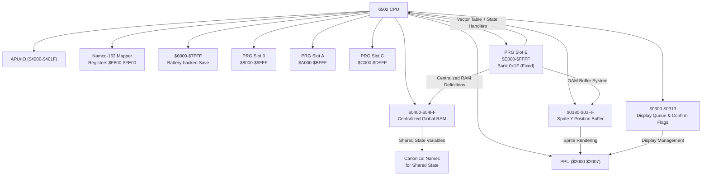
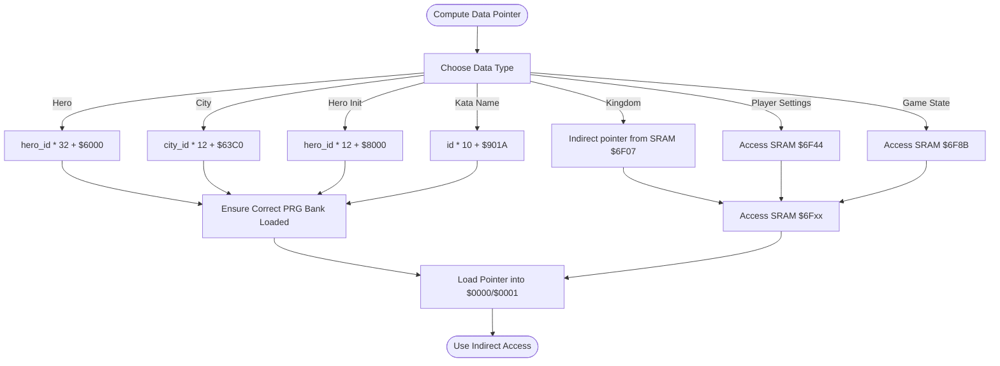
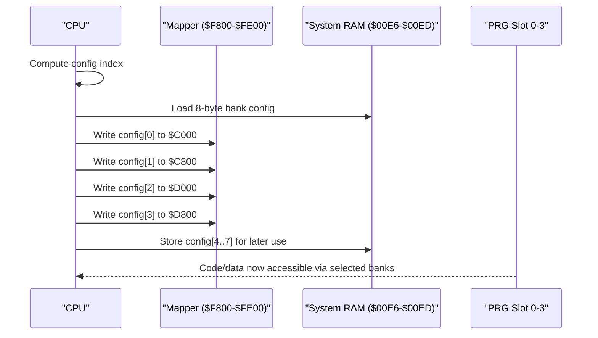
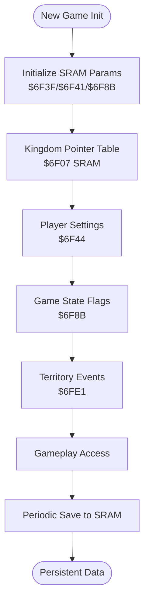
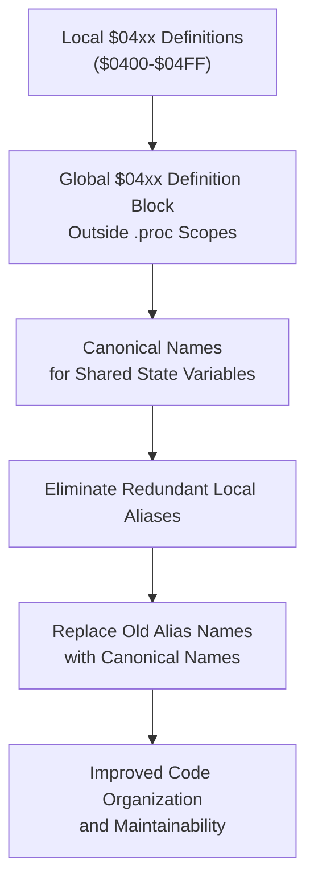
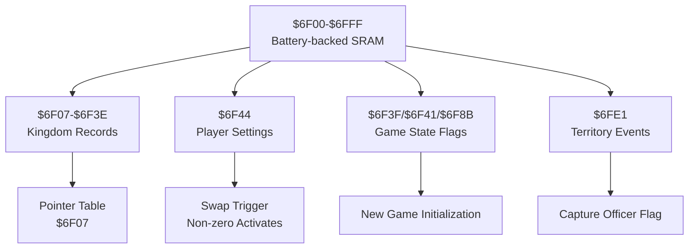
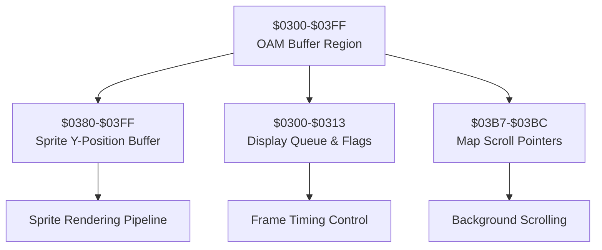
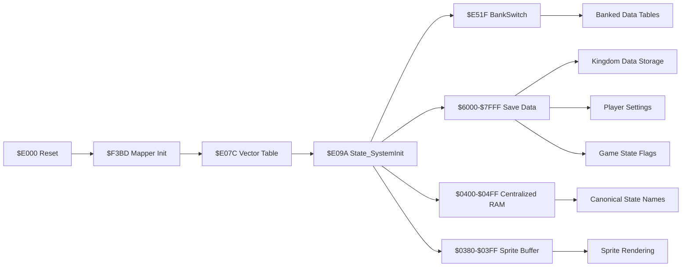

# Data Access and Memory Management

<cite>
**Referenced Files in This Document**
- [PROJECT.md](file://PROJECT.md)
- [linker.cfg](file://linker.cfg)
- [6502_registers.h](file://include/6502_registers.h)
- [namco163.h](file://include/namco163.h)
- [macros.h](file://include/macros.h)
- [functions.h](file://include/functions.h)
- [main.asm](file://asm/main.asm)
- [all_banks.asm](file://asm/banks/all_banks.asm)
- [prg_00.asm](file://asm/banks/prg_00.asm)
- [prg_01.asm](file://asm/banks/prg_01.asm)
- [prg_02.asm](file://asm/banks/prg_02.asm)
- [prg_17_18.asm](file://asm/banks/prg_17_18.asm)
- [prg_1f.asm](file://asm/banks/prg_1f.asm)
- [prg_1f.asm.bak](file://asm/banks/prg_1f.asm.bak)
- [bank_1f_analysis.md](file://code/bank_1f_analysis.md)
- [key_functions_analysis.md](file://code/key_functions_analysis.md)
- [bank_1f_function_table.md](file://code/bank_1f_function_table.md)
- [globalize_04xx.py](file://tools/globalize_04xx.py)
</cite>

## Update Summary
**Changes Made**
- Updated SRAM organization section to reflect expanded persistent storage definitions for kingdom data, player settings, and game state flags
- Enhanced OAM/sprite buffer system documentation with sprite_y_buffer ($0380) as primary OAM shadow buffer
- Added new section documenting the $03xx memory region organization and sprite buffer system reorganization
- Updated memory access patterns to include new SRAM definitions and sprite buffer management
- Revised detailed component analysis to incorporate expanded SRAM usage and OAM buffer system

## Table of Contents
1. [Introduction](#introduction)
2. [Project Structure](#project-structure)
3. [Core Components](#core-components)
4. [Architecture Overview](#architecture-overview)
5. [Detailed Component Analysis](#detailed-component-analysis)
6. [Centralized Global RAM Definition System](#centralized-global-ram-definition-system)
7. [Expanded Battery SRAM Organization](#expanded-battery-sram-organization)
8. [OAM/Sprite Buffer System Reorganization](#oamsprite-buffer-system-reorganization)
9. [Dependency Analysis](#dependency-analysis)
10. [Performance Considerations](#performance-considerations)
11. [Troubleshooting Guide](#troubleshooting-guide)
12. [Conclusion](#conclusion)

## Introduction
This document focuses on the data access and memory management patterns in the Sango2DASM project. It explains how the system organizes memory across the 6502 address space, how data structures are laid out and accessed, and how bank switching enables cross-bank data access via the Namco-163 mapper. The project has recently implemented a centralized global RAM definition system for the $04xx memory region, establishing canonical names for shared state variables across multiple game subsystems. It also documents SRAM usage for save data, RAM layout, and the macro utilities that simplify memory operations. Practical examples demonstrate memory optimization techniques and the relationship between code organization and memory efficiency.

**Updated** Enhanced with expanded SRAM organization for persistent storage and reorganized OAM/sprite buffer system under $03xx memory region.

## Project Structure
The project is organized around a 6502-based NES game using the Namco-163 (mapper 19) with 32 PRG banks of 8 KB each. The linker configuration defines four PRG slots ($8000–$FFFF) that are switchable via mapper registers. Bank 0x1F is fixed at $E000–$FFFF at boot and contains the reset handler and state dispatch logic. The include directory centralizes register and macro definitions, while asm/banks contains stub files for each PRG bank. The $04xx RAM region now features centralized global definitions with canonical names for shared state variables.

```mermaid
graph TB
subgraph "Memory Map"
ZP["$0000-$00FF<br/>Zero Page"]
RAM["$0100-$07FF<br/>System RAM"]
PPU_REGS["$2000-$2007<br/>PPU Registers"]
IO["$4000-$401F<br/>APU/IO"]
EXP["$4020-$5FFF<br/>Expansion ROM (Namco-163)"]
SRAM["$6000-$7FFF<br/>SRAM (Save Data)"]
PRG_SLOTS["$8000-$FFFF<br/>PRG Slots (Switchable)"]
end
subgraph "Boot Bank"
BOOT["$E000-$FFFF<br/>Bank 0x1F (Fixed)"]
end
subgraph "$04xx RAM Region"
GLOBAL_RAM["$0400-$04FF<br/>Centralized Global RAM"]
CANONICAL_NAMES["Canonical Names<br/>for Shared State Variables"]
END
subgraph "$03xx OAM Buffer Region"
OAM_BUFFER["$0380-$03FF<br/>Sprite Y-Position Buffer"]
DISPLAY_QUEUE["$0300-$0313<br/>Display Queue & Confirm Flags"]
MAP_PTRS["$03B7-$03BC<br/>Map Scroll Pointers"]
END
BOOT --- PRG_SLOTS
BOOT --- SRAM
GLOBAL_RAM --- CANONICAL_NAMES
OAM_BUFFER --- DISPLAY_QUEUE
OAM_BUFFER --- MAP_PTRS
```

**Diagram sources**
- [linker.cfg:4-12](file://linker.cfg#L4-L12)
- [PROJECT.md:70-83](file://PROJECT.md#L70-L83)
- [prg_17_18.asm:144-170](file://asm/banks/prg_17_18.asm#L144-L170)

**Section sources**
- [PROJECT.md:70-83](file://PROJECT.md#L70-L83)
- [linker.cfg:18-30](file://linker.cfg#L18-L30)

## Core Components
- Memory map and segmentation: The linker defines ZEROPAGE, RAM, and four PRG slots. Bank 0x1F is mapped to $E000–$FFFF at boot.
- Centralized global RAM definitions: The $04xx memory region now features canonical names for shared state variables across multiple game subsystems.
- Expanded SRAM organization: Battery-backed SRAM now includes dedicated persistent storage for kingdom data, player settings, and game state flags.
- Reorganized OAM buffer system: $03xx memory region provides sprite buffer management with sprite_y_buffer as primary OAM shadow buffer.
- Register and mapper definitions: The 6502 registers and Namco-163 mapper registers are defined centrally for consistent access.
- Macros: Common macros encapsulate PPU operations, DMA, and bank switching to reduce repetitive code and errors.
- Bank stubs: Each PRG bank is represented by a stub file that includes the corresponding 8 KB binary until disassembly is complete.

**Section sources**
- [linker.cfg:18-54](file://linker.cfg#L18-L54)
- [6502_registers.h:1-88](file://include/6502_registers.h#L1-L88)
- [namco163.h:1-87](file://include/namco163.h#L1-L87)
- [macros.h:1-72](file://include/macros.h#L1-L72)
- [all_banks.asm:1-38](file://asm/banks/all_banks.asm#L1-L38)
- [prg_17_18.asm:144-170](file://asm/banks/prg_17_18.asm#L144-L170)

## Architecture Overview
The system uses a banked PRG model with a fixed boot bank (0x1F) and switchable PRG slots. Data tables and save data are located in bank-switched PRG and SRAM respectively. The mapper abstraction exposes simple macros to switch banks and configure registers. The reset handler initializes PPU/APU, clears RAM, and dispatches to state-specific handlers using a vector table in the boot bank. The centralized $04xx RAM system provides canonical names for shared state variables across multiple game subsystems. The expanded SRAM organization provides dedicated persistent storage for game state, while the reorganized OAM buffer system manages sprite rendering efficiently.



**Diagram sources**
- [PROJECT.md:84-99](file://PROJECT.md#L84-L99)
- [namco163.h:10-14](file://include/namco163.h#L10-L14)
- [main.asm:115-121](file://asm/main.asm#L115-L121)
- [prg_17_18.asm:144-170](file://asm/banks/prg_17_18.asm#L144-L170)

**Section sources**
- [PROJECT.md:101-117](file://PROJECT.md#L101-L117)
- [main.asm:115-121](file://asm/main.asm#L115-L121)

## Detailed Component Analysis

### Memory Organization and Segmentation
- Zero Page and System RAM: ZEROPAGE ($0000–$00FF) and BSS ($0100–$07FF) are defined in the linker. The main code reserves zero-page temporaries and a small RAM buffer for runtime use.
- PRG Slots: Four 8 KB PRG slots are defined for banked code. Bank 0x1F is fixed at $E000–$FFFF; other banks are switchable via mapper registers.
- SRAM: The linker and project documentation specify $6000–$7FFF as SRAM for save data. The expanded organization now includes dedicated persistent storage regions.
- Centralized $04xx RAM: The $0400–$04FF region now contains centralized global definitions with canonical names for shared state variables across multiple game subsystems.
- Reorganized $03xx RAM: The $0300–$03FF region provides specialized buffer management for OAM/sprite operations and display queue processing.

Practical implications:
- Use ZEROPAGE for hot-loop variables and temporary pointers to minimize instruction cycles.
- Keep frequently accessed small buffers in $0100–$07FF to avoid page crossings.
- Bank 0x1F is ideal for boot-time initialization and dispatch logic.
- The centralized $04xx RAM system eliminates redundant local memory address aliases and improves code organization.
- The $03xx region provides efficient sprite buffer management with dedicated OAM shadow buffer at $0380.

**Section sources**
- [linker.cfg:18-30](file://linker.cfg#L18-L30)
- [linker.cfg:32-54](file://linker.cfg#L32-L54)
- [PROJECT.md:70-83](file://PROJECT.md#L70-L83)
- [main.asm:13-20](file://asm/main.asm#L13-L20)
- [prg_17_18.asm:144-170](file://asm/banks/prg_17_18.asm#L144-L170)

### Address Calculation Patterns and Data Structure Layouts
The game computes pointers into bank-switched data using efficient 6502 arithmetic patterns. The key functions demonstrate multiply-by-constants using shifts and rotates, and pointer-table lookups for SRAM data.

- Hero data: id*32 + $6000, entry size 32 bytes, base $6000 (bank-switched).
- City data: id*12 + $63C0, entry size 12 bytes, base $63C0 (bank-switched).
- Hero initial data: id*12 + $8000, entry size 12 bytes, base $8000 (bank-switched).
- Kata name: id*10 + $901A, entry size 10 bytes, base $901A (bank-switched).
- Kingdom data: pointer table at $6F07 (SRAM), entry size 8 bytes.
- Expanded SRAM: Dedicated persistent storage regions for kingdom data, player settings, and game state flags.



**Diagram sources**
- [key_functions_analysis.md:33-100](file://code/key_functions_analysis.md#L33-L100)
- [key_functions_analysis.md:159-190](file://code/key_functions_analysis.md#L159-L190)
- [bank_1f_analysis.md:22-45](file://code/bank_1f_analysis.md#L22-L45)
- [prg_17_18.asm:145-149](file://asm/banks/prg_17_18.asm#L145-L149)

**Section sources**
- [key_functions_analysis.md:33-100](file://code/key_functions_analysis.md#L33-L100)
- [key_functions_analysis.md:159-190](file://code/key_functions_analysis.md#L159-L190)
- [bank_1f_analysis.md:22-45](file://code/bank_1f_analysis.md#L22-L45)
- [prg_17_18.asm:145-149](file://asm/banks/prg_17_18.asm#L145-L149)

### Bank Switching and the Mapper Abstraction
The mapper abstraction simplifies cross-bank access by exposing macros to switch PRG banks into four 8 KB slots. The reset handler initializes the mapper and switches to a default bank configuration. Bank switching is also performed dynamically during gameplay to access different data tables.

Key elements:
- Mapper registers: $F800, $FA00, $FC00, $FE00 for slots $8000–$DFFF, with $E000–$FFFF fixed to bank 0x1F.
- Macros: switch_bank_8000, switch_bank_A000, switch_bank_C000, switch_bank_E000.
- Bank configuration table: 8-byte configurations written to mapper registers to select PRG banks.



**Diagram sources**
- [namco163.h:68-86](file://include/namco163.h#L68-L86)
- [bank_1f_analysis.md:499-533](file://code/bank_1f_analysis.md#L499-L533)

**Section sources**
- [namco163.h:10-14](file://include/namco163.h#L10-L14)
- [namco163.h:68-86](file://include/namco163.h#L68-L86)
- [bank_1f_analysis.md:499-533](file://code/bank_1f_analysis.md#L499-L533)

### SRAM Usage for Save Data
SRAM is used for persistent save data, notably kingdom parameters and flags. The reset handler demonstrates SRAM initialization and flag setting during new game initialization. The expanded organization now includes dedicated regions for different types of persistent data.

- SRAM region: $6000–$7FFF (8 KB).
- Kingdom data: $6F07–$6F3E (7 kingdoms × 8 bytes) for persistent kingdom records.
- Player settings: $6F44 for player 2/palette swap trigger.
- Game state flags: $6F8B for game start flag, $6F3F/$6F41 for kingdom initialization parameters.
- Territory events: $6FE1 for territory-related event flags.
- Pointer table for kingdoms stored in SRAM at $6F07, accessed indirectly.



**Diagram sources**
- [bank_1f_analysis.md:146-156](file://code/bank_1f_analysis.md#L146-L156)
- [key_functions_analysis.md:175-189](file://code/key_functions_analysis.md#L175-L189)
- [prg_17_18.asm:145-150](file://asm/banks/prg_17_18.asm#L145-L150)

**Section sources**
- [PROJECT.md:12](file://PROJECT.md#L12)
- [bank_1f_analysis.md:146-156](file://code/bank_1f_analysis.md#L146-L156)
- [key_functions_analysis.md:175-189](file://code/key_functions_analysis.md#L175-L189)
- [prg_17_18.asm:145-150](file://asm/banks/prg_17_18.asm#L145-L150)

### Macro Utilities for Memory Access
The macro library provides reusable constructs for common operations:
- Wait for VBlank
- Set PPU address and write PPU data
- Block copy to PPU with zero-page pointer
- DMA sprite data
- Switch PRG bank for a given slot

These macros reduce boilerplate and improve maintainability.

**Section sources**
- [macros.h:8-72](file://include/macros.h#L8-L72)

### Bank Stub Files and Disassembly Workflow
Each PRG bank is represented by a stub file that includes the corresponding 8 KB binary. The workflow involves replacing stubs with disassembled code and updating linker segments accordingly.

**Section sources**
- [all_banks.asm:1-38](file://asm/banks/all_banks.asm#L1-L38)
- [prg_00.asm:1-13](file://asm/banks/prg_00.asm#L1-L13)
- [prg_01.asm:1-13](file://asm/banks/prg_01.asm#L1-L13)
- [prg_02.asm:1-13](file://asm/banks/prg_02.asm#L1-L13)

## Centralized Global RAM Definition System

### Overview
The project has implemented a centralized global RAM definition system for the $04xx memory region, eliminating redundant local memory address aliases and establishing canonical names for shared state variables. This refactoring improves code organization and maintainability across multiple game subsystems.

### Canonical Naming Conventions
The centralized system establishes consistent naming for shared state variables:

- **Pointer/State ($0400-$0411)**: `domestic_work_ptr_lo`, `domestic_work_ptr_hi`, `scroll_ptr_lo`, `scroll_ptr_hi`, `domestic_cursor_lo`, `domestic_cursor_hi`, `domestic_officer_list_lo`, `domestic_officer_list_hi`
- **Officer/Selection ($0424-$0435)**: `troop_assign_counter_lo`, `troop_assign_counter_hi`, `selected_officer_id`, `battle_result_phase`, `dispatch_timer`, `menu_blink_timer`
- **Map/Scroll pointers ($0470-$0473)**: `anim_ppu_ptr_lo`, `anim_ppu_ptr_hi`, `map_scroll_ptr_lo`, `map_scroll_ptr_hi`
- **Main game state ($04A8-$04C0)**: `game_state`, `sub_state`, `active_player_slot`, `player_flag_0`, `player_officer_id_0`, `player_officer_id_1`, `name_tile_index`, `domestic_action_index`, `player_army_value_0`, `player_army_value_1`, `player_random_offset_0`, `player_action_timer_0`, `anim_timer`, `map_scroll_phase`, `scroll_row_count`, `slide_y_pos`, `cutscene_load_progress`, `display_ptr_lo`, `display_ptr_hi`, `sub_action_type`, `frame_counter`, `player_scene_index`, `event_overlay_flag`, `ui_state`, `name_tile_ptr_lo`, `name_tile_ptr_hi`
- **Extended state ($04C9-$04D5)**: `dispatch_step`, `dispatch_src_ptr_lo`, `dispatch_src_ptr_hi`, `dispatch_dst_ptr_lo`, `dispatch_dst_ptr_hi`, `dispatch_data_ptr_lo`, `dispatch_data_ptr_hi`, `dispatch_offset_ptr_lo`, `dispatch_offset_ptr_hi`

### Implementation Details
The refactoring process involved three key steps:

1. **Insert global $04xx definition block**: A centralized block outside `.proc` scopes containing all canonical names
2. **Remove local $04xx definitions**: Eliminated redundant local memory address aliases within function scopes
3. **Replace old alias names**: Mapped legacy alias names to canonical names throughout instruction lines

### Benefits
- **Improved maintainability**: Single source of truth for shared state variables
- **Reduced code duplication**: Eliminates redundant local definitions across multiple functions
- **Enhanced clarity**: Canonical names provide clear semantic meaning for shared state
- **Better organization**: Logical grouping of related state variables by functional area

### Examples from Codebase
The centralized system is evident throughout the codebase:

- **Bank 17/18 combined bank**: Contains comprehensive $04xx RAM definitions with canonical names for domestic dispatch, officer selection, and game state management
- **Bank 1F aligned bank**: Demonstrates the same canonical naming approach for shared state variables
- **Tool support**: Automated refactoring tool (`globalize_04xx.py`) systematically applies the canonical naming scheme



**Diagram sources**
- [prg_17_18.asm:72-136](file://asm/banks/prg_17_18.asm#L72-L136)
- [prg_1f.asm:56-68](file://asm/banks/prg_1f.asm#L56-L68)
- [globalize_04xx.py:15-77](file://tools/globalize_04xx.py#L15-L77)

**Section sources**
- [prg_17_18.asm:72-136](file://asm/banks/prg_17_18.asm#L72-L136)
- [prg_1f.asm:56-68](file://asm/banks/prg_1f.asm#L56-L68)
- [globalize_04xx.py:1-205](file://tools/globalize_04xx.py#L1-L205)

## Expanded Battery SRAM Organization

### Overview
The SRAM organization has been significantly expanded to provide dedicated persistent storage regions for different aspects of game state. The $6F00–$6FFF battery-backed region now contains structured storage for kingdom data, player settings, and game state flags, enabling efficient access and management of persistent information.

### SRAM Storage Regions

#### Kingdom Data Storage
- **Base Address**: $6F07
- **Structure**: 7 kingdoms × 8 bytes each
- **Range**: $6F07–$6F3E
- **Purpose**: Persistent kingdom records and parameters
- **Access Pattern**: Pointer table lookup followed by indirect access

#### Player Settings
- **Address**: $6F44
- **Purpose**: Player 2/palette swap trigger
- **Usage**: Non-zero value activates player swap functionality
- **Persistence**: Maintained across game sessions

#### Game State Management
- **Addresses**: $6F3F, $6F41, $6F8B
- **$6F3F**: Kingdom initialization parameter 0 (set to $80 on new game)
- **$6F41**: Kingdom initialization parameter 1 (set to $F0 on new game)
- **$6F8B**: Game start flag (set to $FF on new game)
- **Purpose**: Initialize and track game progression state

#### Additional Persistent Data
- **$6F43**: Scroll update pending flag (cleared after copy to domestic work pointer)
- **$6FE1**: Territory event flag (bit 0 = capture officer)
- **Purpose**: Specialized game state tracking for specific mechanics

### Access Patterns and Usage
The expanded SRAM organization enables efficient access patterns:
- **Direct Access**: Simple read/write operations to dedicated addresses
- **Pointer Tables**: Kingdom data accessed via pointer table at $6F07
- **Flag Management**: Boolean flags and state indicators for game progression
- **Initialization**: New game setup writes to specific SRAM locations



**Diagram sources**
- [prg_17_18.asm:145-150](file://asm/banks/prg_17_18.asm#L145-L150)
- [prg_1f.asm:346-351](file://asm/banks/prg_1f.asm#L346-L351)

**Section sources**
- [prg_17_18.asm:145-150](file://asm/banks/prg_17_18.asm#L145-L150)
- [prg_1f.asm:346-351](file://asm/banks/prg_1f.asm#L346-L351)

## OAM/Sprite Buffer System Reorganization

### Overview
The OAM/sprite buffer system has been reorganized under the $03xx memory region, providing dedicated buffer management for sprite rendering operations. The primary component is the sprite_y_buffer at $0380, serving as the main OAM shadow buffer for efficient sprite positioning and rendering.

### $03xx Memory Region Organization

#### Sprite Y-Position Buffer
- **Primary Buffer**: $0380–$03FF
- **Purpose**: Main OAM shadow buffer for sprite Y-position data
- **Size**: 128 bytes (enough for 32 sprites with 4 bytes per sprite)
- **Management**: Used by sprite rendering routines for efficient OAM updates

#### Display Queue Management
- **$0300–$0313**: Dedicated region for display queue and confirm flags
- **$0300**: Confirm check flag 0 (set by display, read by button check)
- **$0304**: Confirm check flag 1 (set by display, read by button check)
- **$0310–$0313**: PPU display queue pointer management
- **Purpose**: Coordinate display operations and input handling

#### Map Scroll Pointers
- **$03B7–$03BC**: Dedicated storage for map scroll PPU pointers
- **$03B7–$03BC**: Separate low/high byte pairs for three map scroll pointers
- **Purpose**: Manage background scrolling and parallax effects

### Sprite Buffer Management
The reorganized system provides several advantages:
- **Dedicated Buffer Space**: $0380–$03FF exclusively for sprite buffer operations
- **Efficient Updates**: Centralized location reduces page crossing overhead
- **Separation of Concerns**: Display queue and sprite data are kept separate
- **Scalable Design**: Room for expansion without affecting other systems

### Integration with Sprite Rendering
The sprite buffer system integrates with the broader sprite rendering pipeline:
- **SpriteOamWriter**: Uses the sprite_y_buffer for efficient OAM updates
- **Display Queue**: Coordinates sprite updates with frame timing
- **Map Scrolling**: Provides stable pointer references for background elements



**Diagram sources**
- [prg_17_18.asm:154-170](file://asm/banks/prg_17_18.asm#L154-L170)

**Section sources**
- [prg_17_18.asm:154-170](file://asm/banks/prg_17_18.asm#L154-L170)

## Dependency Analysis
The boot process depends on the mapper initialization and vector dispatch to reach state-specific handlers. Bank switching is orchestrated by a configuration routine that writes to mapper registers and stores a shadow copy in RAM. Data access functions rely on banked PRG tables and SRAM for persistence. The centralized $04xx RAM system provides canonical names for shared state variables across multiple game subsystems. The expanded SRAM organization provides structured persistent storage, while the reorganized OAM buffer system manages sprite rendering efficiently.



**Diagram sources**
- [main.asm:115-121](file://asm/main.asm#L115-L121)
- [bank_1f_analysis.md:52-77](file://code/bank_1f_analysis.md#L52-L77)
- [bank_1f_analysis.md:499-533](file://code/bank_1f_analysis.md#L499-L533)
- [prg_17_18.asm:144-170](file://asm/banks/prg_17_18.asm#L144-L170)

**Section sources**
- [main.asm:115-121](file://asm/main.asm#L115-L121)
- [bank_1f_analysis.md:52-77](file://code/bank_1f_analysis.md#L52-L77)
- [bank_1f_analysis.md:499-533](file://code/bank_1f_analysis.md#L499-L533)

## Performance Considerations
- Prefer ZEROPAGE for hot-loop variables and temporary pointers to minimize addressing overhead.
- Use shift-and-add patterns for multiplication constants to keep code tight and fast.
- Minimize page crossings by grouping related data within the same 256-byte page when feasible.
- Bank data tables by usage frequency to reduce the number of bank switches during critical paths.
- Leverage macros to avoid repetitive code and potential instruction overhead.
- The centralized $04xx RAM system reduces code size by eliminating redundant local definitions, improving cache efficiency.
- The reorganized $03xx buffer system provides efficient sprite buffer access with minimal page crossing overhead.
- Dedicated SRAM regions enable faster persistent data access compared to banked PRG storage.
- Structured SRAM organization reduces the overhead of pointer table lookups for kingdom data.

## Troubleshooting Guide
Common issues and remedies:
- Incorrect bank mapping: Ensure the correct bank is loaded before accessing banked data. Use the bank switch configuration routine and verify mapper register writes.
- SRAM not persisting: Confirm SRAM is powered and that writes occur within the SRAM region ($6000–$7FFF). Check for accidental writes to other memory areas. Verify SRAM organization follows the established patterns.
- PPU/VRAM corruption: Verify PPU initialization and address setting macros are used consistently. Clear PPU registers early and reinitialize as needed.
- Vector dispatch failures: Validate the vector table index masking and ensure only valid indices are used.
- $04xx RAM access issues: Ensure canonical names are used instead of local aliases. Verify that the centralized RAM definitions are properly included in the compilation unit.
- $03xx buffer issues: Verify sprite_y_buffer is properly initialized and updated. Check that display queue pointers are correctly managed.
- SRAM corruption: Monitor SRAM write operations carefully, especially for persistent data. Ensure proper initialization sequences are followed.
- Sprite rendering problems: Verify OAM buffer management and ensure sprite count is properly tracked.

**Section sources**
- [bank_1f_analysis.md:52-77](file://code/bank_1f_analysis.md#L52-L77)
- [PROJECT.md:12](file://PROJECT.md#L12)
- [macros.h:17-47](file://include/macros.h#L17-L47)
- [prg_17_18.asm:72-136](file://asm/banks/prg_17_18.asm#L72-L136)
- [prg_17_18.asm:154-170](file://asm/banks/prg_17_18.asm#L154-L170)

## Conclusion
The Sango2DASM project employs a disciplined memory organization strategy: a fixed boot bank for control flow, switchable PRG banks for data access, and SRAM for persistent save data. The recent implementation of a centralized global RAM definition system for the $04xx memory region significantly improves code organization and maintainability by establishing canonical names for shared state variables across multiple game subsystems. The expanded SRAM organization provides structured persistent storage for kingdom data, player settings, and game state flags, while the reorganized OAM buffer system under $03xx memory region enables efficient sprite rendering with dedicated buffer management. Efficient 6502 arithmetic patterns and a robust mapper abstraction enable seamless cross-bank access. Macros streamline common operations, improving reliability and readability. The centralized $04xx RAM system eliminates redundant local memory address aliases and provides a single source of truth for shared state variables. The reorganized memory layout optimizes performance for both persistent data access and real-time sprite rendering. Following the outlined practices ensures optimal memory usage and maintainable code organization.