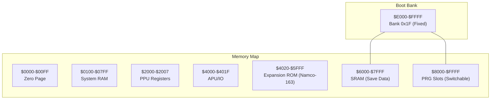
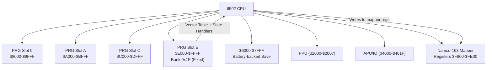
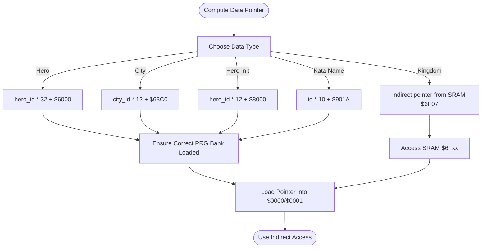
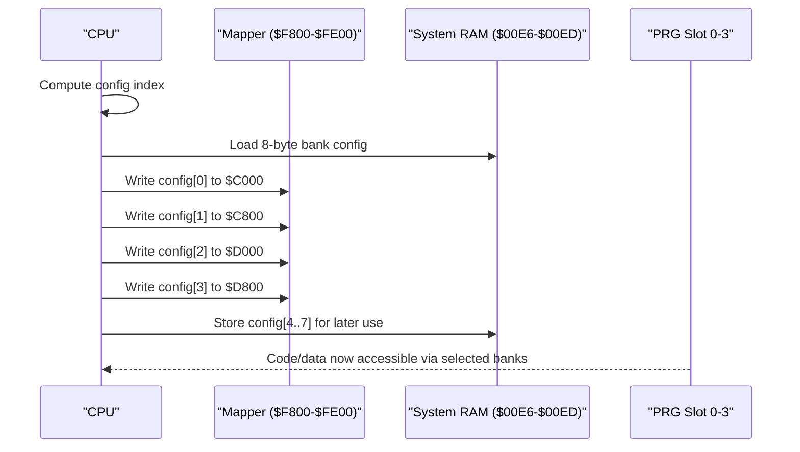
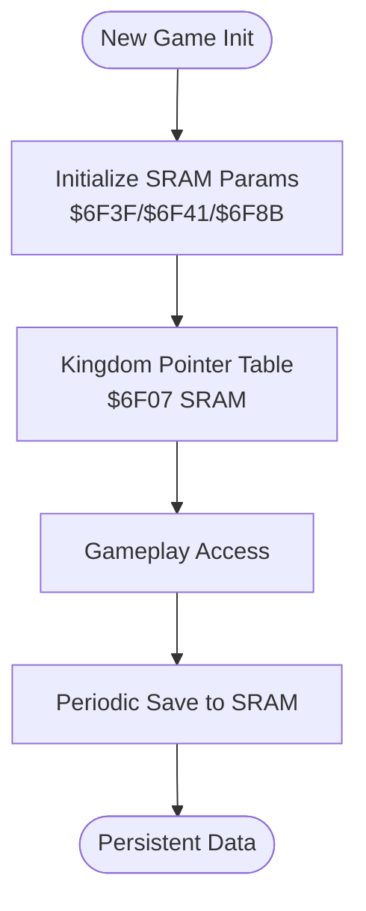
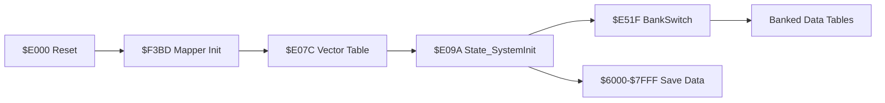

# Data Access and Memory Management

<cite>
**Referenced Files in This Document**
- [PROJECT.md](file://PROJECT.md)
- [linker.cfg](file://linker.cfg)
- [6502_registers.h](file://include/6502_registers.h)
- [namco163.h](file://include/namco163.h)
- [macros.h](file://include/macros.h)
- [main.asm](file://asm/main.asm)
- [all_banks.asm](file://asm/banks/all_banks.asm)
- [prg_00.asm](file://asm/banks/prg_00.asm)
- [prg_01.asm](file://asm/banks/prg_01.asm)
- [prg_02.asm](file://asm/banks/prg_02.asm)
- [bank_1f_analysis.md](file://code/bank_1f_analysis.md)
- [key_functions_analysis.md](file://code/key_functions_analysis.md)
- [bank_1f_function_table.md](file://code/bank_1f_function_table.md)
</cite>

## Table of Contents
1. [Introduction](#introduction)
2. [Project Structure](#project-structure)
3. [Core Components](#core-components)
4. [Architecture Overview](#architecture-overview)
5. [Detailed Component Analysis](#detailed-component-analysis)
6. [Dependency Analysis](#dependency-analysis)
7. [Performance Considerations](#performance-considerations)
8. [Troubleshooting Guide](#troubleshooting-guide)
9. [Conclusion](#conclusion)

## Introduction
This document focuses on the data access and memory management patterns in the Sango2DASM project. It explains how the system organizes memory across the 6502 address space, how data structures are laid out and accessed, and how bank switching enables cross-bank data access via the Namco-163 mapper. It also documents SRAM usage for save data, RAM layout, and the macro utilities that simplify memory operations. Practical examples demonstrate memory optimization techniques and the relationship between code organization and memory efficiency.

## Project Structure
The project is organized around a 6502-based NES game using the Namco-163 (mapper 19) with 32 PRG banks of 8 KB each. The linker configuration defines four PRG slots ($8000–$FFFF) that are switchable via mapper registers. Bank 0x1F is fixed at $E000–$FFFF at boot and contains the reset handler and state dispatch logic. The include directory centralizes register and macro definitions, while asm/banks contains stub files for each PRG bank.

**Diagram sources**
- [linker.cfg:4-12](file://linker.cfg#L4-L12)
- [PROJECT.md:70-83](file://PROJECT.md#L70-L83)

**Section sources**
- [PROJECT.md:70-83](file://PROJECT.md#L70-L83)
- [linker.cfg:18-30](file://linker.cfg#L18-L30)

## Core Components
- Memory map and segmentation: The linker defines ZEROPAGE, RAM, and four PRG slots. Bank 0x1F is mapped to $E000–$FFFF at boot.
- Register and mapper definitions: The 6502 registers and Namco-163 mapper registers are defined centrally for consistent access.
- Macros: Common macros encapsulate PPU operations, DMA, and bank switching to reduce repetitive code and errors.
- Bank stubs: Each PRG bank is represented by a stub file that includes the corresponding 8 KB binary until disassembly is complete.

**Section sources**
- [linker.cfg:18-54](file://linker.cfg#L18-L54)
- [6502_registers.h:1-88](file://include/6502_registers.h#L1-L88)
- [namco163.h:1-87](file://include/namco163.h#L1-L87)
- [macros.h:1-72](file://include/macros.h#L1-L72)
- [all_banks.asm:1-38](file://asm/banks/all_banks.asm#L1-L38)

## Architecture Overview
The system uses a banked PRG model with a fixed boot bank (0x1F) and switchable PRG slots. Data tables and save data are located in bank-switched PRG and SRAM respectively. The mapper abstraction exposes simple macros to switch banks and configure registers. The reset handler initializes PPU/APU, clears RAM, and dispatches to state-specific handlers using a vector table in the boot bank.

**Diagram sources**
- [PROJECT.md:84-99](file://PROJECT.md#L84-L99)
- [namco163.h:10-14](file://include/namco163.h#L10-L14)
- [main.asm:115-121](file://asm/main.asm#L115-L121)

**Section sources**
- [PROJECT.md:101-117](file://PROJECT.md#L101-L117)
- [main.asm:115-121](file://asm/main.asm#L115-L121)

## Detailed Component Analysis

### Memory Organization and Segmentation
- Zero Page and System RAM: ZEROPAGE ($0000–$00FF) and BSS ($0100–$07FF) are defined in the linker. The main code reserves zero-page temporaries and a small RAM buffer for runtime use.
- PRG Slots: Four 8 KB PRG slots are defined for banked code. Bank 0x1F is fixed at $E000–$FFFF; other banks are switchable via mapper registers.
- SRAM: The linker and project documentation specify $6000–$7FFF as SRAM for save data.

Practical implications:
- Use ZEROPAGE for hot-loop variables and temporary pointers to minimize instruction cycles.
- Keep frequently accessed small buffers in $0100–$07FF to avoid page crossings.
- Bank 0x1F is ideal for boot-time initialization and dispatch logic.

**Section sources**
- [linker.cfg:18-30](file://linker.cfg#L18-L30)
- [linker.cfg:32-54](file://linker.cfg#L32-L54)
- [PROJECT.md:70-83](file://PROJECT.md#L70-L83)
- [main.asm:13-20](file://asm/main.asm#L13-L20)

### Address Calculation Patterns and Data Structure Layouts
The game computes pointers into bank-switched data using efficient 6502 arithmetic patterns. The key functions demonstrate multiply-by-constants using shifts and rotates, and pointer-table lookups for SRAM data.

- Hero data: id*32 + $6000, entry size 32 bytes, base $6000 (bank-switched).
- City data: id*12 + $63C0, entry size 12 bytes, base $63C0 (bank-switched).
- Hero initial data: id*12 + $8000, entry size 12 bytes, base $8000 (bank-switched).
- Kata name: id*10 + $901A, entry size 10 bytes, base $901A (bank-switched).
- Kingdom data: pointer table at $6F07 (SRAM), entry size 8 bytes.

**Diagram sources**
- [key_functions_analysis.md:33-100](file://code/key_functions_analysis.md#L33-L100)
- [key_functions_analysis.md:159-190](file://code/key_functions_analysis.md#L159-L190)
- [bank_1f_analysis.md:22-45](file://code/bank_1f_analysis.md#L22-L45)

**Section sources**
- [key_functions_analysis.md:33-100](file://code/key_functions_analysis.md#L33-L100)
- [key_functions_analysis.md:159-190](file://code/key_functions_analysis.md#L159-L190)
- [bank_1f_analysis.md:22-45](file://code/bank_1f_analysis.md#L22-L45)

### Bank Switching and the Mapper Abstraction
The mapper abstraction simplifies cross-bank access by exposing macros to switch PRG banks into four 8 KB slots. The reset handler initializes the mapper and switches to a default bank configuration. Bank switching is also performed dynamically during gameplay to access different data tables.

Key elements:
- Mapper registers: $F800, $FA00, $FC00, $FE00 for slots $8000–$DFFF, with $E000–$FFFF fixed to bank 0x1F.
- Macros: switch_bank_8000, switch_bank_A000, switch_bank_C000, switch_bank_E000.
- Bank configuration table: 8-byte configurations written to mapper registers to select PRG banks.

**Diagram sources**
- [namco163.h:68-86](file://include/namco163.h#L68-L86)
- [bank_1f_analysis.md:499-533](file://code/bank_1f_analysis.md#L499-L533)

**Section sources**
- [namco163.h:10-14](file://include/namco163.h#L10-L14)
- [namco163.h:68-86](file://include/namco163.h#L68-L86)
- [bank_1f_analysis.md:499-533](file://code/bank_1f_analysis.md#L499-L533)

### SRAM Usage for Save Data
SRAM is used for persistent save data, notably kingdom parameters and flags. The reset handler demonstrates SRAM initialization and flag setting during new game initialization.

- SRAM region: $6000–$7FFF (8 KB).
- Example usage: Kingdom parameters initialized at $6F3F/$6F41; SRAM flag written at $6F8B during new game flow.
- Pointer table for kingdoms stored in SRAM at $6F07, accessed indirectly.

**Diagram sources**
- [bank_1f_analysis.md:146-156](file://code/bank_1f_analysis.md#L146-L156)
- [key_functions_analysis.md:175-189](file://code/key_functions_analysis.md#L175-L189)

**Section sources**
- [PROJECT.md:12](file://PROJECT.md#L12)
- [bank_1f_analysis.md:146-156](file://code/bank_1f_analysis.md#L146-L156)
- [key_functions_analysis.md:175-189](file://code/key_functions_analysis.md#L175-L189)

### Macro Utilities for Memory Access
The macro library provides reusable constructs for common operations:
- Wait for VBlank
- Set PPU address and write PPU data
- Block copy to PPU with zero-page pointer
- DMA sprite data
- Switch PRG bank for a given slot

These macros reduce boilerplate and improve maintainability.

**Section sources**
- [macros.h:8-72](file://include/macros.h#L8-L72)

### Bank Stub Files and Disassembly Workflow
Each PRG bank is represented by a stub file that includes the corresponding 8 KB binary. The workflow involves replacing stubs with disassembled code and updating linker segments accordingly.

**Section sources**
- [all_banks.asm:1-38](file://asm/banks/all_banks.asm#L1-L38)
- [prg_00.asm:1-13](file://asm/banks/prg_00.asm#L1-L13)
- [prg_01.asm:1-13](file://asm/banks/prg_01.asm#L1-L13)
- [prg_02.asm:1-13](file://asm/banks/prg_02.asm#L1-L13)

## Dependency Analysis
The boot process depends on the mapper initialization and vector dispatch to reach state-specific handlers. Bank switching is orchestrated by a configuration routine that writes to mapper registers and stores a shadow copy in RAM. Data access functions rely on banked PRG tables and SRAM for persistence.

**Diagram sources**
- [main.asm:115-121](file://asm/main.asm#L115-L121)
- [bank_1f_analysis.md:52-77](file://code/bank_1f_analysis.md#L52-L77)
- [bank_1f_analysis.md:499-533](file://code/bank_1f_analysis.md#L499-L533)

**Section sources**
- [main.asm:115-121](file://asm/main.asm#L115-L121)
- [bank_1f_analysis.md:52-77](file://code/bank_1f_analysis.md#L52-L77)
- [bank_1f_analysis.md:499-533](file://code/bank_1f_analysis.md#L499-L533)

## Performance Considerations
- Prefer ZEROPAGE for hot-loop variables and temporary pointers to minimize addressing overhead.
- Use shift-and-add patterns for multiplication constants to keep code tight and fast.
- Minimize page crossings by grouping related data within the same 256-byte page when feasible.
- Bank data tables by usage frequency to reduce the number of bank switches during critical paths.
- Leverage macros to avoid repetitive code and potential instruction overhead.

## Troubleshooting Guide
Common issues and remedies:
- Incorrect bank mapping: Ensure the correct bank is loaded before accessing banked data. Use the bank switch configuration routine and verify mapper register writes.
- SRAM not persisting: Confirm SRAM is powered and that writes occur within the SRAM region ($6000–$7FFF). Check for accidental writes to other memory areas.
- PPU/VRAM corruption: Verify PPU initialization and address setting macros are used consistently. Clear PPU registers early and reinitialize as needed.
- Vector dispatch failures: Validate the vector table index masking and ensure only valid indices are used.

**Section sources**
- [bank_1f_analysis.md:52-77](file://code/bank_1f_analysis.md#L52-L77)
- [PROJECT.md:12](file://PROJECT.md#L12)
- [macros.h:17-47](file://include/macros.h#L17-L47)

## Conclusion
The Sango2DASM project employs a disciplined memory organization strategy: a fixed boot bank for control flow, switchable PRG banks for data access, and SRAM for persistent save data. Efficient 6502 arithmetic patterns and a robust mapper abstraction enable seamless cross-bank access. Macros streamline common operations, improving reliability and readability. Following the outlined practices ensures optimal memory usage and maintainable code organization.