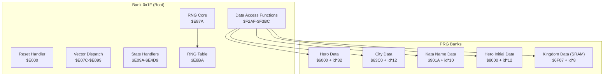
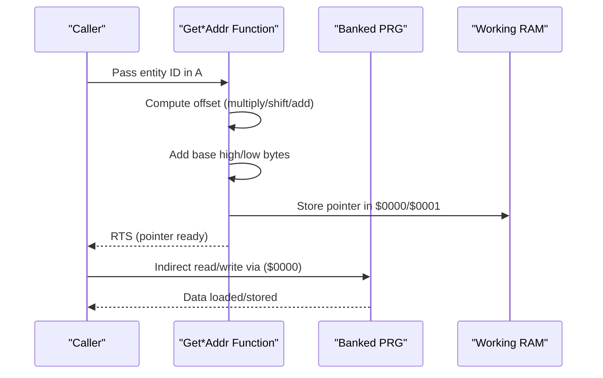
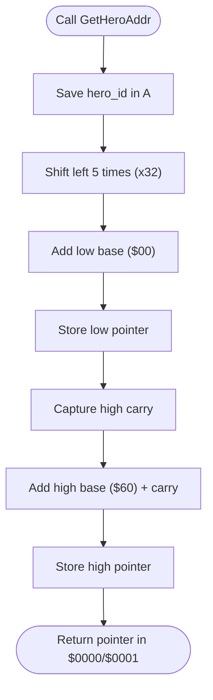
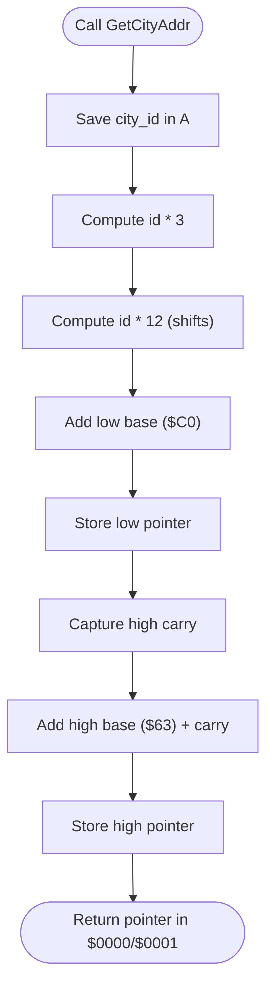
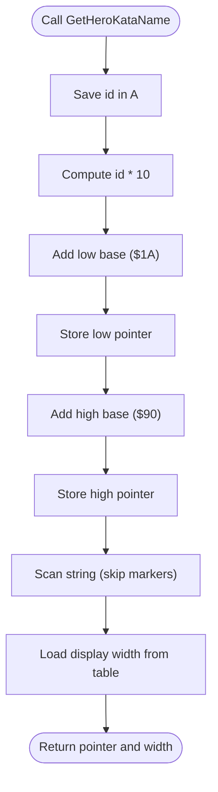
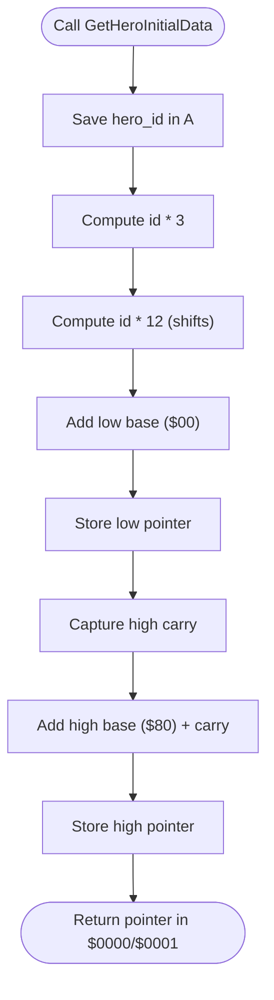
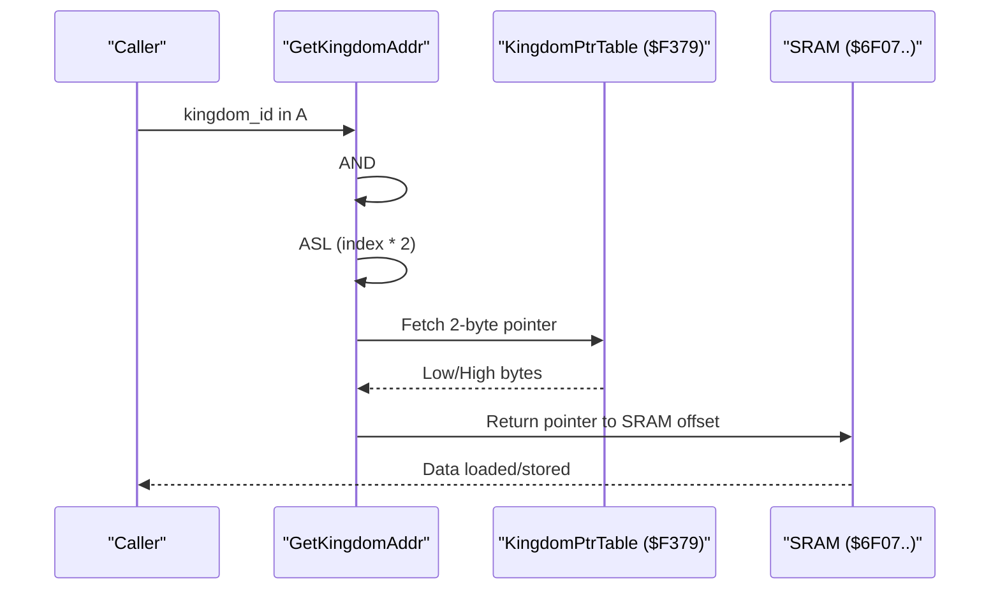
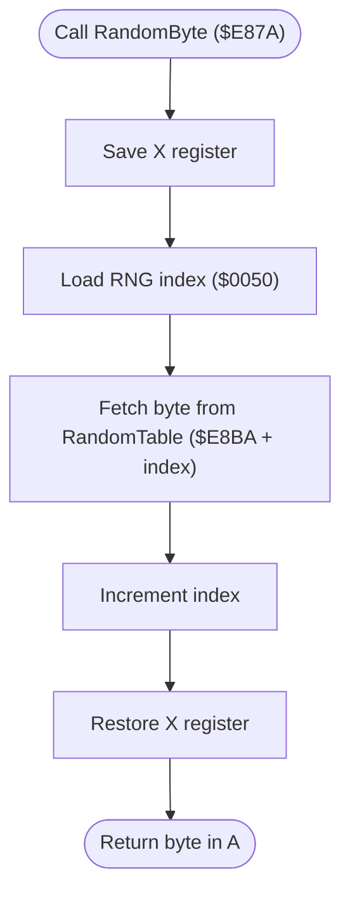
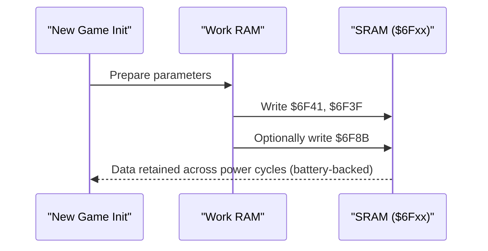
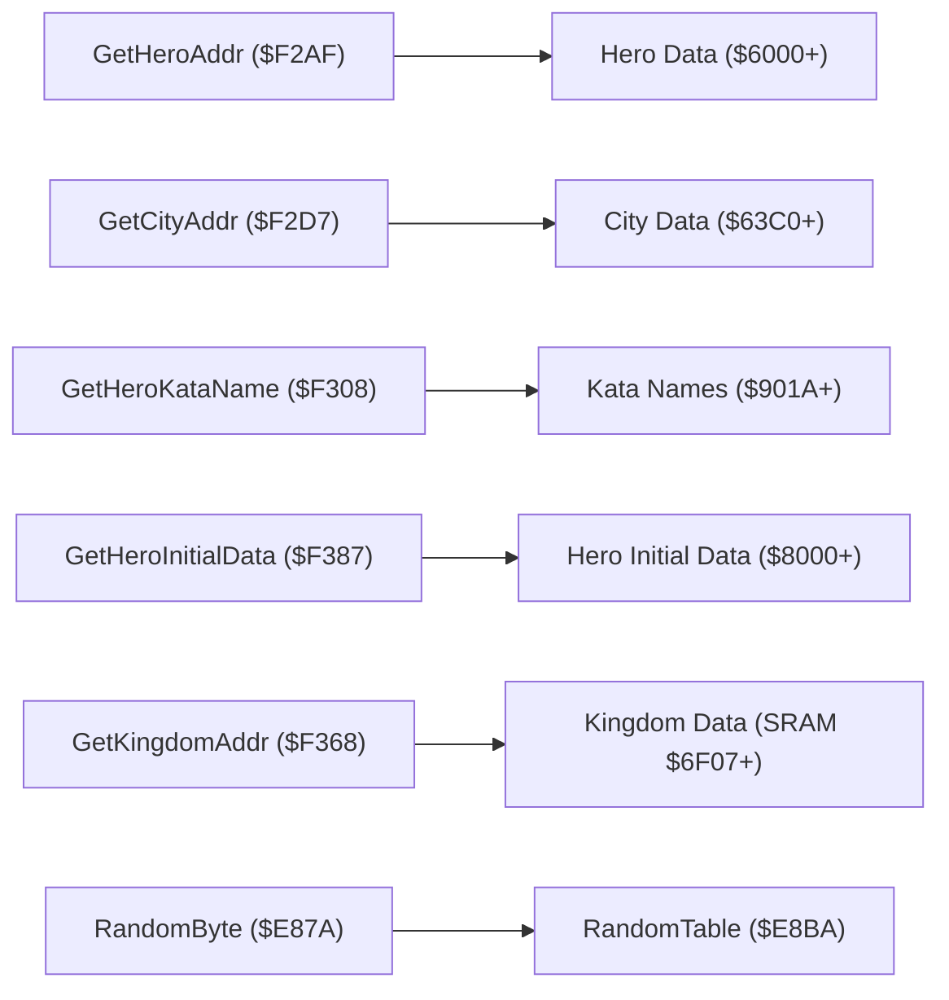

# Data Structure Layouts

<cite>
**Referenced Files in This Document**
- [bank_1f_analysis.md](file://code/bank_1f_analysis.md)
- [key_functions_analysis.md](file://code/key_functions_analysis.md)
- [bank_1f_function_table.md](file://code/bank_1f_function_table.md)
- [prg_1f.asm](file://asm/banks/prg_1f.asm)
- [bank_1f_plan.md](file://code/bank_1f_plan.md)
- [bank_1f_raw.asm](file://code/bank_1f_raw.asm)
</cite>

## Table of Contents
1. [Introduction](#introduction)
2. [Project Structure](#project-structure)
3. [Core Components](#core-components)
4. [Architecture Overview](#architecture-overview)
5. [Detailed Component Analysis](#detailed-component-analysis)
6. [Dependency Analysis](#dependency-analysis)
7. [Performance Considerations](#performance-considerations)
8. [Troubleshooting Guide](#troubleshooting-guide)
9. [Conclusion](#conclusion)

## Introduction
This document describes the data structure layouts discovered in the game’s memory, focusing on how entities are laid out and accessed. It covers:
- Heroes, Cities, Kata Names, Hero Initial Data, and Kingdoms
- The pointer table used for Kingdom data and why it differs from other entities
- The random number table and its sequential access pattern
- SRAM usage for persistent save data and its battery-backed nature
- How these structures are accessed through the data access functions and how entity IDs map to memory offsets

## Project Structure
The relevant analysis and assembly sources are primarily located in:
- Bank 0x1F (boot bank) containing state dispatch, NMI/IRQ handlers, sound engine, and data access functions
- Assembly sources that define the address calculation procedures and data tables
- Function tables and analyses that enumerate and summarize the data access routines

**Diagram sources**
- [bank_1f_analysis.md:12-111](file://code/bank_1f_analysis.md#L12-L111)
- [bank_1f_function_table.md:79-85](file://code/bank_1f_function_table.md#L79-L85)
- [prg_1f.asm:2328-2472](file://asm/banks/prg_1f.asm#L2328-L2472)

**Section sources**
- [bank_1f_analysis.md:12-111](file://code/bank_1f_analysis.md#L12-L111)
- [bank_1f_function_table.md:79-85](file://code/bank_1f_function_table.md#L79-L85)
- [prg_1f.asm:2328-2472](file://asm/banks/prg_1f.asm#L2328-L2472)

## Core Components
This section summarizes the five primary data structures and their access patterns.

- Heroes
  - Entry size: 32 bytes
  - Base address: $6000
  - Access formula: hero_id * 32 + $6000
  - Access function: $F2AF

- Cities
  - Entry size: 12 bytes
  - Base address: $63C0
  - Access formula: city_id * 12 + $63C0
  - Access function: $F2D7

- Kata Names
  - Entry size: 10 bytes
  - Base address: $901A
  - Access formula: id * 10 + $901A
  - Access function: $F308

- Hero Initial Data
  - Entry size: 12 bytes
  - Base address: $8000
  - Access formula: hero_id * 12 + $8000
  - Access function: $F387

- Kingdoms (Persistent Save)
  - Entry size: 8 bytes
  - Base address: $6F07 (SRAM)
  - Access method: Pointer table at $F379 (indirect addressing)
  - Access function: $F368

**Section sources**
- [key_functions_analysis.md:33-284](file://code/key_functions_analysis.md#L33-L284)
- [bank_1f_function_table.md:79-85](file://code/bank_1f_function_table.md#L79-L85)
- [prg_1f.asm:2328-2472](file://asm/banks/prg_1f.asm#L2328-L2472)

## Architecture Overview
The game uses bank-switched PRG memory for most data tables. The data access functions compute a 16-bit pointer into banked memory and return it in $0000/$0001 for subsequent indirect reads/writes. Kingdom data is stored in battery-backed SRAM at $6F07 and accessed via a pointer table rather than a simple multiply-plus-offset scheme.

**Diagram sources**
- [prg_1f.asm:2328-2472](file://asm/banks/prg_1f.asm#L2328-L2472)
- [key_functions_analysis.md:33-284](file://code/key_functions_analysis.md#L33-L284)

## Detailed Component Analysis

### Heroes (32 bytes per entry, $6000 base)
- Access function: $F2AF
- Computation: 5 shifts to multiply by 32, plus base $6000
- Entry size: 32 bytes
- Typical usage: Iterate heroes by ID, read stats and attributes from the computed offset

**Diagram sources**
- [prg_1f.asm:2333-2354](file://asm/banks/prg_1f.asm#L2333-L2354)
- [key_functions_analysis.md:33-63](file://code/key_functions_analysis.md#L33-L63)

**Section sources**
- [prg_1f.asm:2328-2355](file://asm/banks/prg_1f.asm#L2328-L2355)
- [key_functions_analysis.md:33-63](file://code/key_functions_analysis.md#L33-L63)

### Cities (12 bytes per entry, $63C0 base)
- Access function: $F2D7
- Computation: id * 3 = (id * 2 + id), then multiply by 12 using shifts and adds, plus base $63C0
- Entry size: 12 bytes
- Typical usage: Iterate cities, read location and production data

**Diagram sources**
- [prg_1f.asm:2363-2381](file://asm/banks/prg_1f.asm#L2363-L2381)
- [key_functions_analysis.md:66-100](file://code/key_functions_analysis.md#L66-L100)

**Section sources**
- [prg_1f.asm:2358-2382](file://asm/banks/prg_1f.asm#L2358-L2382)
- [key_functions_analysis.md:66-100](file://code/key_functions_analysis.md#L66-L100)

### Kata Names (10 bytes per entry, $901A base)
- Access function: $F308
- Computation: id * 10 = (id * 2) << 2 + id << 1, plus base $901A
- Entry size: 10 bytes
- Additional behavior: Scans string, skipping specific markers, then returns display width from a small width table

**Diagram sources**
- [prg_1f.asm:2390-2414](file://asm/banks/prg_1f.asm#L2390-L2414)
- [key_functions_analysis.md:103-156](file://code/key_functions_analysis.md#L103-L156)

**Section sources**
- [prg_1f.asm:2384-2415](file://asm/banks/prg_1f.asm#L2384-L2415)
- [key_functions_analysis.md:103-156](file://code/key_functions_analysis.md#L103-L156)

### Hero Initial Data (12 bytes per entry, $8000 base)
- Access function: $F387
- Computation: id * 12 (multiply by 3, then by 4), plus base $8000
- Entry size: 12 bytes
- Typical usage: Initialize hero stats and traits at game start

**Diagram sources**
- [prg_1f.asm:2454-2471](file://asm/banks/prg_1f.asm#L2454-L2471)
- [key_functions_analysis.md:192-228](file://code/key_functions_analysis.md#L192-L228)

**Section sources**
- [prg_1f.asm:2450-2472](file://asm/banks/prg_1f.asm#L2450-L2472)
- [key_functions_analysis.md:192-228](file://code/key_functions_analysis.md#L192-L228)

### Kingdoms (8 bytes per entry, SRAM at $6F07, pointer table)
- Access function: $F368
- Pointer table: $F379 contains 7 entries, each 2 bytes, pointing to offsets in SRAM
- Entry size: 8 bytes per kingdom
- SRAM base: $6F07
- Access pattern: AND id to 0-15, ASL for word index, fetch 2-byte pointer from table, return pointer in $0000/$0001

**Diagram sources**
- [prg_1f.asm:2427-2441](file://asm/banks/prg_1f.asm#L2427-L2441)
- [prg_1f.asm:2446-2447](file://asm/banks/prg_1f.asm#L2446-L2447)
- [key_functions_analysis.md:159-189](file://code/key_functions_analysis.md#L159-L189)

**Section sources**
- [prg_1f.asm:2424-2448](file://asm/banks/prg_1f.asm#L2424-L2448)
- [key_functions_analysis.md:159-189](file://code/key_functions_analysis.md#L159-L189)

### Why Kingdoms Use a Pointer Table
- Other entities use a simple formula: id * stride + base address
- Kingdoms use a pointer table because:
  - Data is stored in battery-backed SRAM, not bank-switched PRG ROM
  - The table allows flexible offsets within SRAM without requiring a fixed stride across all entries
  - It supports potential sparse or variable-length entries within SRAM

**Section sources**
- [key_functions_analysis.md:186-189](file://code/key_functions_analysis.md#L186-L189)
- [bank_1f_analysis.md:146-159](file://code/bank_1f_analysis.md#L146-L159)

### Random Number Table and Sequential Access
- RNG core: $E87A performs a table lookup using an index at $0050
- Sequential access pattern: Each call reads the next byte from a pre-computed table at $E8BA and increments the index
- Variants: Separate RNG instances use $0052/$0054/$0055 for independent streams

**Diagram sources**
- [bank_1f_plan.md:65-78](file://code/bank_1f_plan.md#L65-L78)
- [bank_1f_raw.asm:1994-2010](file://code/bank_1f_raw.asm#L1994-L2010)
- [key_functions_analysis.md:9-31](file://code/key_functions_analysis.md#L9-L31)

**Section sources**
- [bank_1f_plan.md:65-78](file://code/bank_1f_plan.md#L65-L78)
- [bank_1f_raw.asm:1994-2010](file://code/bank_1f_raw.asm#L1994-L2010)
- [key_functions_analysis.md:9-31](file://code/key_functions_analysis.md#L9-L31)

### SRAM Usage and Battery-Backed Nature
- Kingdom initialization writes parameters to SRAM locations $6F41 and $6F3F during new game initialization
- SRAM flag is written at $6F8B under certain conditions
- Palette swap logic references SRAM at $6F44 for palette exchange decisions
- These accesses confirm SRAM usage for persistent save data

**Diagram sources**
- [bank_1f_analysis.md:146-159](file://code/bank_1f_analysis.md#L146-L159)
- [prg_1f.asm:245-266](file://asm/banks/prg_1f.asm#L245-L266)

**Section sources**
- [bank_1f_analysis.md:146-159](file://code/bank_1f_analysis.md#L146-L159)
- [prg_1f.asm:245-266](file://asm/banks/prg_1f.asm#L245-L266)

## Dependency Analysis
The data access functions depend on:
- Bank-switched PRG memory for most tables
- Working RAM for intermediate pointer storage
- SRAM for persistent kingdom data
- RNG for procedural generation and events

**Diagram sources**
- [bank_1f_function_table.md:79-85](file://code/bank_1f_function_table.md#L79-L85)
- [prg_1f.asm:2328-2472](file://asm/banks/prg_1f.asm#L2328-L2472)
- [bank_1f_plan.md:65-78](file://code/bank_1f_plan.md#L65-L78)

**Section sources**
- [bank_1f_function_table.md:79-85](file://code/bank_1f_function_table.md#L79-L85)
- [prg_1f.asm:2328-2472](file://asm/banks/prg_1f.asm#L2328-L2472)
- [bank_1f_plan.md:65-78](file://code/bank_1f_plan.md#L65-L78)

## Performance Considerations
- Multiplication by powers of 2 is implemented via 6502 shifts, minimizing overhead
- Sequential RNG avoids expensive arithmetic, trading determinism for speed
- Bank switching is minimized by grouping related operations and reusing bank configurations
- Pointer tables reduce branching and enable fast indirect addressing for SRAM data

## Troubleshooting Guide
- If accessing Kingdom data yields unexpected results:
  - Verify the kingdom_id is masked to 0-15 before indexing the pointer table
  - Ensure SRAM is powered and readable
- If entity data appears offset:
  - Confirm the correct base address and entry size for the entity type
  - Ensure the proper bank is selected before indirect access
- If RNG behavior seems predictable:
  - Confirm the index at $0050 advances as expected
  - Check for separate RNG instances if multiple streams are used

**Section sources**
- [key_functions_analysis.md:159-189](file://code/key_functions_analysis.md#L159-L189)
- [bank_1f_analysis.md:146-159](file://code/bank_1f_analysis.md#L146-L159)

## Conclusion
The game employs a consistent pattern for entity data access: simple multiply-plus-offset formulas for bank-switched PRG tables and a pointer table for SRAM-based persistent data. The RNG uses a pre-computed table for deterministic sequential access. Understanding these patterns enables safe and efficient manipulation of game state across entities and persistence layers.