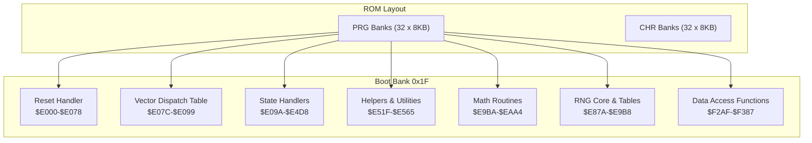
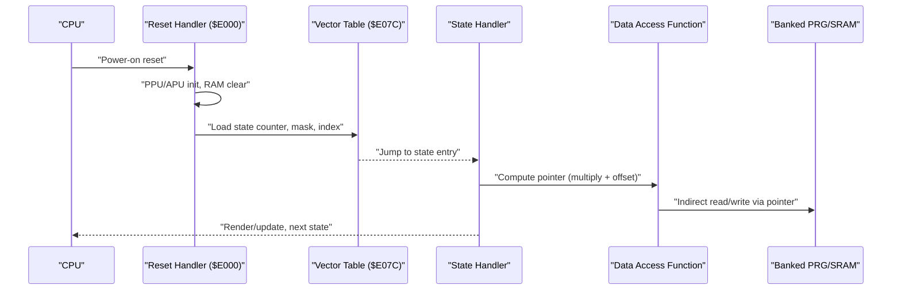
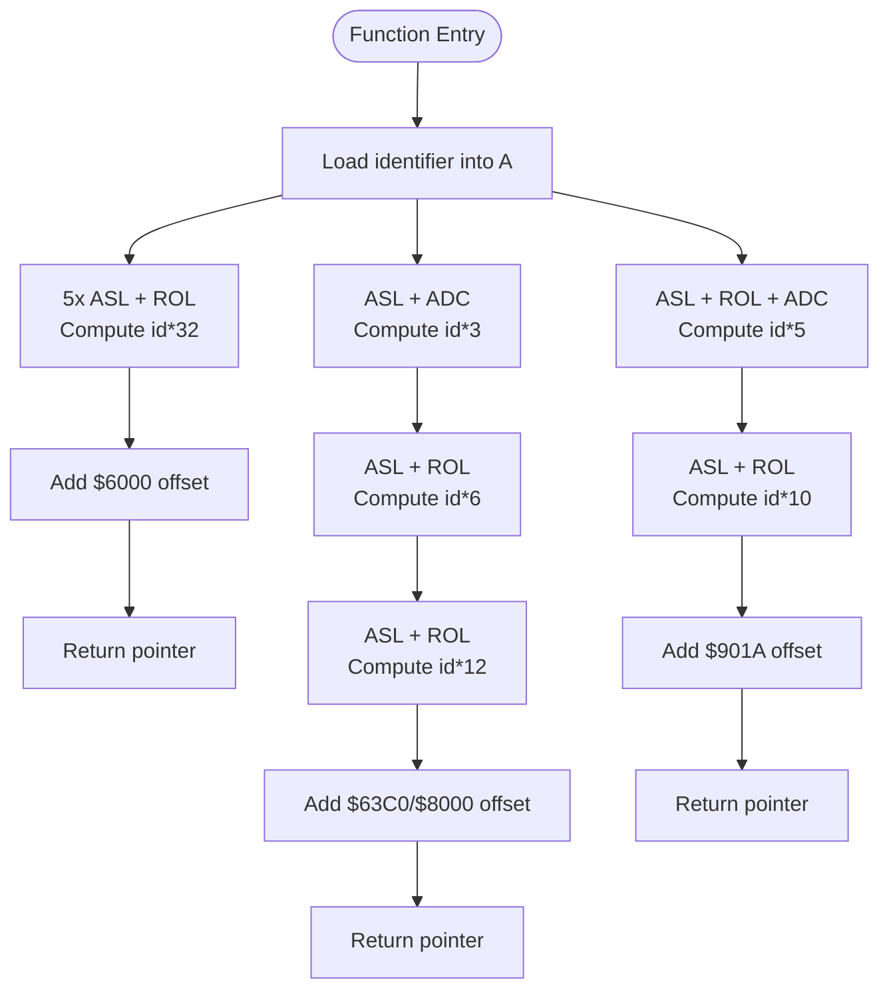
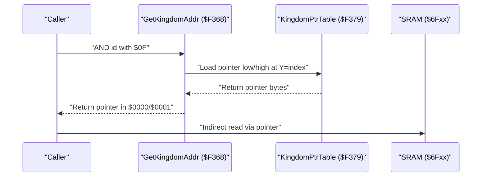
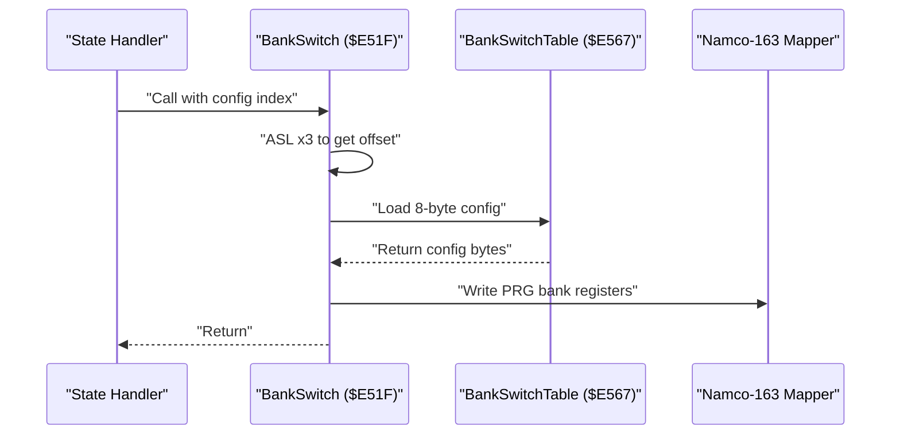
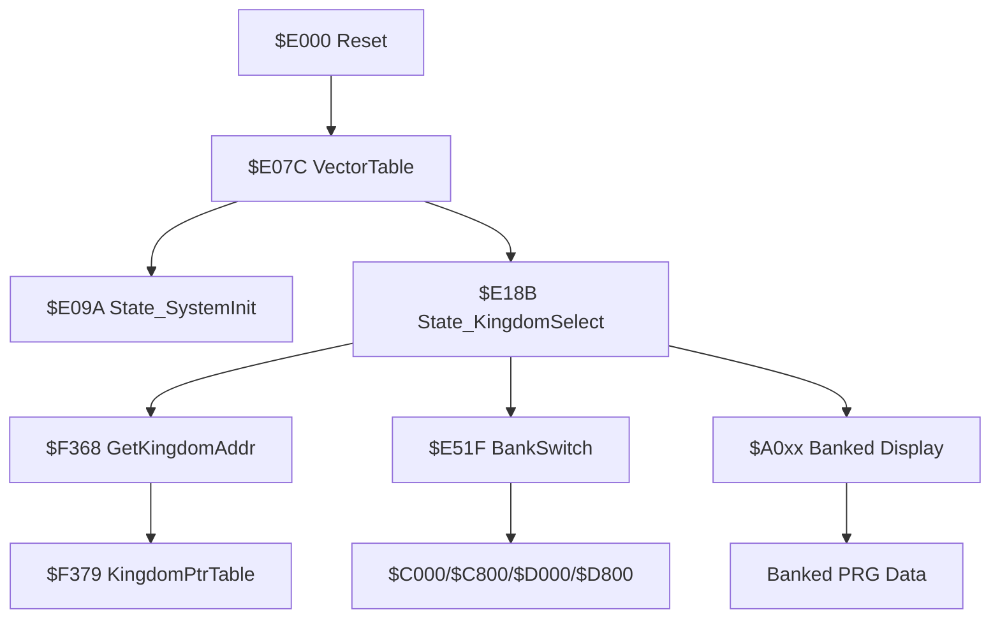

# Memory Access Optimization

<cite>
**Referenced Files in This Document**
- [PROJECT.md](file://PROJECT.md)
- [bank_1f_analysis.md](file://code/bank_1f_analysis.md)
- [key_functions_analysis.md](file://code/key_functions_analysis.md)
- [bank_1f_function_table.md](file://code/bank_1f_function_table.md)
- [prg_1f.asm](file://asm/banks/prg_1f.asm)
- [macros.h](file://include/macros.h)
</cite>

## Table of Contents
1. [Introduction](#introduction)
2. [Project Structure](#project-structure)
3. [Core Components](#core-components)
4. [Architecture Overview](#architecture-overview)
5. [Detailed Component Analysis](#detailed-component-analysis)
6. [Dependency Analysis](#dependency-analysis)
7. [Performance Considerations](#performance-considerations)
8. [Troubleshooting Guide](#troubleshooting-guide)
9. [Conclusion](#conclusion)

## Introduction
This document explains memory access optimization techniques used in the 6502 assembly codebase for Sangokushi 2 - Haou no Tairiku (J). It focuses on how the code replaces expensive multiplication with fast shift-and-add patterns, how pointer tables minimize memory fetches, and how bank switching and indirect addressing reduce runtime overhead. The document also discusses the trade-offs between code size and execution speed in memory-constrained environments typical of the 6502 platform.

## Project Structure
The project is organized around a 32-bank PRG layout with a fixed boot bank (0x1F) mapped to $E000-$FFFF. The boot bank contains the reset handler, state dispatch, PPU/PPU helpers, math routines, sound engine, and data access utilities. The build system uses ca65/linker with a linker configuration that defines PRG slots and segments.

**Diagram sources**
- [PROJECT.md:70-83](file://PROJECT.md#L70-L83)
- [PROJECT.md:118-133](file://PROJECT.md#L118-L133)

**Section sources**
- [PROJECT.md:14-47](file://PROJECT.md#L14-L47)
- [PROJECT.md:70-117](file://PROJECT.md#L70-L117)

## Core Components
This section highlights the memory optimization techniques implemented across the codebase:

- Multiply-by-power-of-two patterns:
  - *32 via five ASL (shift-left) operations chained with ROL for carries
  - *12 via a *3 (ASL + ADC) followed by *4 (two ASL + ROL)
  - *10 via a *5 (two ASL + ROL + ADC) followed by ASL
- Indirect addressing and pointer tables:
  - Pointer tables for SRAM-based data (e.g., Kingdom pointers)
  - Bank-switched PRG tables accessed through computed pointers
- Bank switching:
  - Configurable bank layouts written to mapper registers for efficient data access
- Memory access minimization:
  - Precomputed tables and lookup-driven logic reduce dynamic computation
  - Accumulator shifts and rotate operations avoid explicit multiply instructions

These patterns appear in several key functions and helpers, including data access functions and math utilities.

**Section sources**
- [key_functions_analysis.md:246-284](file://code/key_functions_analysis.md#L246-L284)
- [bank_1f_analysis.md:527-533](file://code/bank_1f_analysis.md#L527-L533)
- [bank_1f_analysis.md:560-579](file://code/bank_1f_analysis.md#L560-L579)

## Architecture Overview
The 6502-based architecture uses a fixed boot bank (0x1F) mapped to $E000-$FFFF. The reset handler initializes PPU/APU, clears RAM, and dispatches to state handlers via a vector table. State handlers often call banked display functions and rely on data access functions to compute pointers into bank-switched PRG or SRAM.

**Diagram sources**
- [prg_1f.asm:74-148](file://asm/banks/prg_1f.asm#L74-L148)
- [prg_1f.asm:153-168](file://asm/banks/prg_1f.asm#L153-L168)
- [prg_1f.asm:740-749](file://asm/banks/prg_1f.asm#L740-L749)

**Section sources**
- [PROJECT.md:101-117](file://PROJECT.md#L101-L117)
- [prg_1f.asm:74-148](file://asm/banks/prg_1f.asm#L74-L148)
- [prg_1f.asm:153-168](file://asm/banks/prg_1f.asm#L153-L168)

## Detailed Component Analysis

### Multiply-by-Power-of-Two Patterns
The code extensively uses shift-and-add patterns to compute array indices and offsets efficiently. These patterns replace slow multiplication with fast bit shifts and rotates.

- *32 (Hero address):
  - Five ASL instructions with ROL propagate carries, forming id*32
  - Combined with an offset to form the final pointer
- *12 (City and Hero Initial Data):
  - Compute id*3 with ASL + ADC
  - Double the result twice (ASL + ROL) to get id*12
- *10 (Hero Kata Name):
  - Compute id*5 with two ASL + ROL + ADC
  - Shift left once (ASL + ROL) to get id*10

**Diagram sources**
- [key_functions_analysis.md:58-95](file://code/key_functions_analysis.md#L58-L95)
- [key_functions_analysis.md:125-155](file://code/key_functions_analysis.md#L125-L155)
- [key_functions_analysis.md:206-223](file://code/key_functions_analysis.md#L206-L223)

**Section sources**
- [key_functions_analysis.md:58-95](file://code/key_functions_analysis.md#L58-L95)
- [key_functions_analysis.md:125-155](file://code/key_functions_analysis.md#L125-L155)
- [key_functions_analysis.md:206-223](file://code/key_functions_analysis.md#L206-L223)

### Accumulator Shifts, Rotates, and Arithmetic Operations
The multiply patterns rely on 6502 accumulator shifts and rotate instructions to efficiently scale values. These operations:
- Use ASL (arithmetic shift left) to multiply by 2
- Use ROL (rotate left through carry) to propagate carries across registers
- Use ADC (add with carry) to combine partial products

This approach avoids explicit multiplication instructions and leverages the CPU’s native bit manipulation capabilities.

**Section sources**
- [key_functions_analysis.md:58-95](file://code/key_functions_analysis.md#L58-L95)
- [key_functions_analysis.md:125-155](file://code/key_functions_analysis.md#L125-L155)
- [key_functions_analysis.md:206-223](file://code/key_functions_analysis.md#L206-L223)

### Indirect Addressing and Pointer Tables
Indirect addressing and pointer tables are used to minimize memory fetches and simplify data access:

- Pointer tables for SRAM-based data:
  - Kingdom pointer table stores entry pointers in SRAM
  - Indexed by a small mask (AND with $0F) to limit range
- Banked PRG tables:
  - Data access functions compute pointers into bank-switched PRG
  - Indirect loads/stores use the computed pointer pair

**Diagram sources**
- [key_functions_analysis.md:164-189](file://code/key_functions_analysis.md#L164-L189)
- [prg_1f.asm:3200-3250](file://asm/banks/prg_1f.asm#L3200-L3250)

**Section sources**
- [key_functions_analysis.md:164-189](file://code/key_functions_analysis.md#L164-L189)
- [bank_1f_function_table.md:83-84](file://code/bank_1f_function_table.md#L83-L84)

### Bank Switching and Data Retrieval
Bank switching is orchestrated by a configuration table and helper routines. The bank switch routine:
- Multiplies the config index by 8 (ASL three times) to index the table
- Writes four 8-byte configurations to mapper registers
- Stores additional values in RAM for later use

**Diagram sources**
- [prg_1f.asm:785-820](file://asm/banks/prg_1f.asm#L785-L820)
- [prg_1f.asm:820-860](file://asm/banks/prg_1f.asm#L820-L860)

**Section sources**
- [prg_1f.asm:785-820](file://asm/banks/prg_1f.asm#L785-L820)
- [prg_1f.asm:820-860](file://asm/banks/prg_1f.asm#L820-L860)
- [bank_1f_analysis.md:527-533](file://code/bank_1f_analysis.md#L527-L533)

### Minimizing Memory Access Overhead
The code minimizes memory access overhead through:
- Precomputed tables (random data, pointer tables) to avoid runtime computation
- Pointer tables for SRAM data to reduce repeated calculations
- Bank switching to keep frequently accessed data in reachable PRG banks
- Indirect addressing to centralize pointer resolution

Examples:
- RNG core reads sequential bytes from a precomputed table
- Data access functions compute pointers once and reuse them for indirect operations
- Banked display functions are invoked after setting up the correct bank configuration

**Section sources**
- [key_functions_analysis.md:23-30](file://code/key_functions_analysis.md#L23-L30)
- [key_functions_analysis.md:164-189](file://code/key_functions_analysis.md#L164-L189)
- [bank_1f_analysis.md:527-533](file://code/bank_1f_analysis.md#L527-L533)

## Dependency Analysis
The following diagram shows key dependencies among components involved in memory access optimization:

**Diagram sources**
- [prg_1f.asm:74-148](file://asm/banks/prg_1f.asm#L74-L148)
- [prg_1f.asm:153-168](file://asm/banks/prg_1f.asm#L153-L168)
- [prg_1f.asm:785-820](file://asm/banks/prg_1f.asm#L785-L820)
- [key_functions_analysis.md:164-189](file://code/key_functions_analysis.md#L164-L189)

**Section sources**
- [prg_1f.asm:74-148](file://asm/banks/prg_1f.asm#L74-L148)
- [prg_1f.asm:153-168](file://asm/banks/prg_1f.asm#L153-L168)
- [prg_1f.asm:785-820](file://asm/banks/prg_1f.asm#L785-L820)
- [key_functions_analysis.md:164-189](file://code/key_functions_analysis.md#L164-L189)

## Performance Considerations
- Code size vs. speed trade-offs:
  - Shift-and-add patterns replace multiplication with short instruction sequences, reducing cycles at the cost of a few extra bytes
  - Pointer tables eliminate repeated arithmetic and reduce runtime branching
- Memory bandwidth:
  - Bank switching reduces the number of memory fetches by keeping hot data in reachable banks
  - Indirect addressing centralizes pointer resolution, minimizing repeated computations
- 6502 constraints:
  - The 6502 lacks a native multiply instruction; shift-and-add is the optimal approach
  - Accumulator-centric operations (ASL, ROL, ADC) are fast and compact

[No sources needed since this section provides general guidance]

## Troubleshooting Guide
Common issues and checks related to memory access optimization:

- Incorrect pointer computation:
  - Verify the multiply pattern matches the intended multiplier (*32, *12, or *10)
  - Ensure carry propagation is handled correctly with ROL during shifts
- Bank switching errors:
  - Confirm the config index is properly scaled by 8 (ASL three times)
  - Verify mapper register writes occur in the correct order
- SRAM pointer table access:
  - Ensure the index is masked to the valid range (e.g., AND with $0F)
  - Validate pointer table entries are correctly ordered and aligned
- Indirect addressing:
  - Confirm the pointer pair ($0000/$0001) is set before indirect operations
  - Check that the target memory region is banked correctly

**Section sources**
- [key_functions_analysis.md:58-95](file://code/key_functions_analysis.md#L58-L95)
- [key_functions_analysis.md:164-189](file://code/key_functions_analysis.md#L164-L189)
- [prg_1f.asm:785-820](file://asm/banks/prg_1f.asm#L785-L820)

## Conclusion
The 6502 assembly codebase employs efficient memory access patterns tailored to the 6502’s strengths and constraints. Multiply-by-power-of-two patterns using accumulator shifts and rotates replace expensive multiplication, while pointer tables and bank switching minimize memory fetches and simplify data retrieval. These optimizations balance code size and execution speed, delivering responsive gameplay within the memory-limited NES environment.