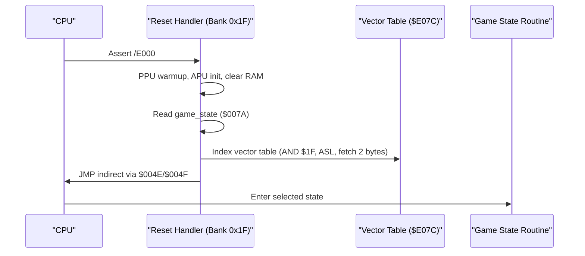
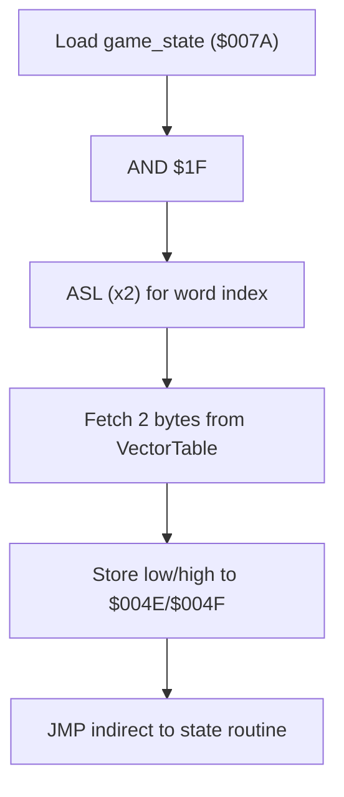
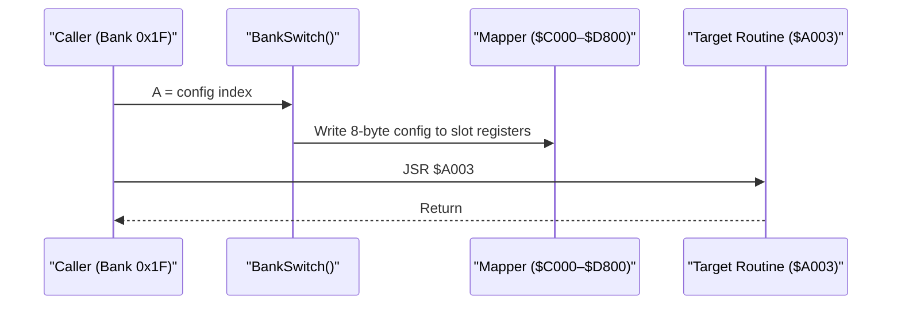
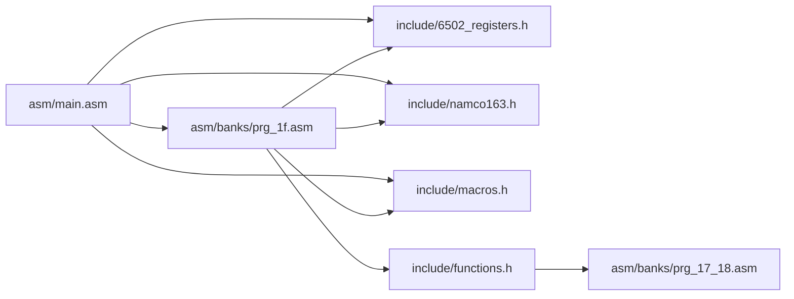

# Memory Organization and Addressing

<cite>
**Referenced Files in This Document**
- [PROJECT.md](file://PROJECT.md)
- [linker.cfg](file://linker.cfg)
- [test_17_18.cfg](file://test_17_18.cfg)
- [include/6502_registers.h](file://include/6502_registers.h)
- [include/namco163.h](file://include/namco163.h)
- [include/macros.h](file://include/macros.h)
- [include/functions.h](file://include/functions.h)
- [asm/main.asm](file://asm/main.asm)
- [asm/banks/prg_1f.asm](file://asm/banks/prg_1f.asm)
- [asm/banks/prg_17_18.asm](file://asm/banks/prg_17_18.asm)
- [asm/banks/prg_1f.aligned.asm](file://asm/banks/prg_1f.aligned.asm)
- [tools/disasm_17_18.py](file://tools/disasm_17_18.py)
- [tools/proc_scope_17_18.py](file://tools/proc_scope_17_18.py)
- [rom/rom_info.h](file://rom/rom_info.h)
- [tools/globalize_04xx.py](file://tools/globalize_04xx.py)
</cite>

## Update Summary
**Changes Made**
- Enhanced documentation for PRG $17/$18 bank system including tile grid buffers ($06xx), battery SRAM ($6Fxx), OAM/sprite buffer ($03xx), and display/button confirm state ($0300-$0313) sections
- Added detailed documentation for tile_index_grid ($0680-$06BF) structure and coordinate arrays (tile_grid_coord_x $0600-$0613, tile_grid_coord_y $0614-$0627)
- Updated memory region organization to reflect combined 16KB bank system at $A000-$DFFF
- Expanded memory addressing patterns documentation with PRG $17/$18 specific sections

## Table of Contents
1. [Introduction](#introduction)
2. [Project Structure](#project-structure)
3. [Core Components](#core-components)
4. [Architecture Overview](#architecture-overview)
5. [Detailed Component Analysis](#detailed-component-analysis)
6. [Enhanced Memory Region Documentation](#enhanced-memory-region-documentation)
7. [Dependency Analysis](#dependency-analysis)
8. [Performance Considerations](#performance-considerations)
9. [Troubleshooting Guide](#troubleshooting-guide)
10. [Conclusion](#conclusion)

## Introduction
This document explains the memory organization and addressing patterns used in the Sangokushi 2 disassembly targeting the NES. It covers how the 6502 accesses 256KB of PRG ROM across 32 banks despite only having 16-bit addresses, details the Namco-163 mapper's bank switching mechanism, and documents the memory map layout. It also describes multiply-by-power-of-two techniques using accumulator shifts to accelerate arithmetic, and how the mapper abstraction enables seamless cross-bank data access while preserving logical addressing.

**Updated** The PRG $17/$18 bank system now operates as a combined 16KB memory region ($A000-$DFFF) with specialized memory regions for tile grid buffers, battery-backed SRAM, OAM/sprite management, and display state coordination.

## Project Structure
The project organizes code around:
- A central entry point and interrupt vectors in bank 0x1F
- 32 PRG banks mapped into four 8KB slots ($8000–$FFFF)
- Mapper and register definitions under include/
- Linker configuration defining memory regions and segments
- Centralized global RAM definitions with canonical naming in key banks
- **Enhanced PRG $17/$18 system**: Combined 16KB bank pair at $A000-$DFFF with specialized memory regions

**Diagram sources**
- [PROJECT.md:70-83](file://PROJECT.md#L70-L83)
- [linker.cfg:4-12](file://linker.cfg#L4-L12)
- [test_17_18.cfg:1-8](file://test_17_18.cfg#L1-L8)

**Section sources**
- [PROJECT.md:14-47](file://PROJECT.md#L14-L47)
- [linker.cfg:18-30](file://linker.cfg#L18-L30)
- [test_17_18.cfg:1-8](file://test_17_18.cfg#L1-L8)

## Core Components
- Memory map and banked PRG layout
  - 2KB RAM at $0000–$07FF
  - PPU registers at $2000–$2007
  - APU/IO registers at $4000–$401F
  - 8KB SRAM at $6000–$7FFF
  - Four 8KB PRG slots at $8000–$FFFF controlled by the mapper
  - **Enhanced PRG $17/$18 combined region**: 16KB contiguous area at $A000–$DFFF for domestic/kingdom display functions
- Mapper and bank switching
  - Namco-163 (mapper 19) exposes write-only registers at $F800–$FE00 to select PRG banks for each slot
  - Macros and constants in include/ facilitate switching
  - **PRG $17/$18 switching**: Specialized bank switching via SwitchBankAC_A/B with Y=$37 for combined 16KB access
- Centralized global RAM definitions
  - Canonical naming system established in key banks (0x1F, 0x17-0x18)
  - Eliminates redundant local $04xx definitions
  - Standardized state variable naming across all banks
- Linker configuration
  - Defines Zeropage, RAM, and four PRG slots; code segments map to specific slots
  - **PRG $17/$18 testing**: Separate memory regions for individual bank testing
- Entry point and dispatch
  - Reset handler resides in bank 0x1F at $E000–$FFFF and uses a vector table to dispatch to game states

**Section sources**
- [PROJECT.md:70-117](file://PROJECT.md#L70-L117)
- [include/namco163.h:10-14](file://include/namco163.h#L10-L14)
- [include/namco163.h:68-86](file://include/namco163.h#L68-L86)
- [linker.cfg:18-54](file://linker.cfg#L18-L54)
- [asm/main.asm:30-60](file://asm/main.asm#L30-L60)
- [asm/banks/prg_1f.asm:153-168](file://asm/banks/prg_1f.asm#L153-L168)
- [tools/globalize_04xx.py:13-77](file://tools/globalize_04xx.py#L13-L77)
- [include/functions.h:315-335](file://include/functions.h#L315-L335)

## Architecture Overview
The system uses a fixed boot bank (0x1F) mapped to PRG slot 3 ($E000–$FFFF) and dynamically switches three lower slots ($8000–$DFFF) via mapper writes. The reset handler initializes hardware, clears RAM, and dispatches to a state routine via an indirect vector table. Bank switching is performed through dedicated routines and macros.

**Updated** The PRG $17/$18 combined system provides specialized memory regions for tile grid management, sprite handling, and display coordination within a unified 16KB address space.

**Diagram sources**
- [PROJECT.md:101-117](file://PROJECT.md#L101-L117)
- [asm/banks/prg_1f.asm:138-147](file://asm/banks/prg_1f.asm#L138-L147)
- [asm/banks/prg_1f.asm:153-168](file://asm/banks/prg_1f.asm#L153-L168)

**Section sources**
- [PROJECT.md:101-117](file://PROJECT.md#L101-L117)
- [asm/banks/prg_1f.asm:74-147](file://asm/banks/prg_1f.asm#L74-L147)

## Detailed Component Analysis

### Memory Map and Regions
- RAM: $0000–$07FF (2KB)
- PPU registers: $2000–$2007
- APU/IO registers: $4000–$401F
- SRAM: $6000–$7FFF (8KB, battery-backed)
- PRG slots:
  - $8000–$9FFF (slot 0)
  - $A000–$BFFF (slot 1, PRG $17/$18 combined region)
  - $C000–$DFFF (slot 2, PRG $17/$18 combined region)
  - $E000–$FFFF (slot 3, fixed to bank 0x1F at boot)
- **Enhanced PRG $17/$18 regions**:
  - $0300–$0313: Display/button confirm state and PPU queue pointers
  - $0380–$03FF: Sprite Y-position buffer (OAM shadow)
  - $0600–$0627: Tile coordinate arrays (20 entries each)
  - $0680–$06BF: Tile index grid (64 bytes for adjacency mapping)
  - $6F07–$6F44: Battery-backed SRAM for kingdom data and parameters

**Updated** The PRG $17/$18 combined region provides specialized memory areas for domestic/kingdom display functionality, including tile grid management, sprite positioning, and persistent storage.

**Section sources**
- [PROJECT.md:70-83](file://PROJECT.md#L70-L83)
- [linker.cfg:4-12](file://linker.cfg#L4-L12)
- [asm/banks/prg_17_18.asm:139-162](file://asm/banks/prg_17_18.asm#L139-L162)
- [tools/globalize_04xx.py:15-77](file://tools/globalize_04xx.py#L15-L77)

### Centralized Global RAM Definition System
**New Section** The project now implements a centralized global RAM definition system that standardizes memory addressing patterns across all banks:

- **Canonical Naming Convention**: Addresses like `$0400`, `$0401`, `$042C`, `$04A8` are consistently named using descriptive canonical names such as `ptr_0400_lo`, `ptr_0400_hi`, `selected_officer_id`, and `game_state`.
- **Elimination of Redundancy**: Local `$04xx` definitions within `.proc` blocks have been removed, reducing code duplication and improving maintainability.
- **Cross-Bank Consistency**: All banks now reference the same canonical addresses, ensuring consistent behavior regardless of which bank is active.
- **Tool-Assisted Migration**: The `globalize_04xx.py` script automatically identifies local aliases and replaces them with canonical names across the codebase.

**Section sources**
- [tools/globalize_04xx.py:1-94](file://tools/globalize_04xx.py#L1-L94)
- [asm/banks/prg_17_18.asm:14-30](file://asm/banks/prg_17_18.asm#L14-L30)
- [asm/banks/prg_1f.aligned.asm:50-68](file://asm/banks/prg_1f.aligned.asm#L50-L68)

### Bank Switching Mechanism (Namco-163)
- Mapper registers:
  - $F800 selects PRG bank for slot 0 ($8000–$9FFF)
  - $FA00 selects PRG bank for slot 1 ($A000–$BFFF)
  - $FC00 selects PRG bank for slot 2 ($C000–$DFFF)
  - $FE00 selects PRG bank for slot 3 ($E000–$FFFF)
- Macros and helpers:
  - switch_bank_8000, switch_bank_A000, switch_bank_C000, switch_bank_E000
  - switch_prg_bank macro supports dynamic selection of slot
  - **PRG $17/$18 switching**: SwitchBankAC_A/B routines handle combined bank loading
- Initialization:
  - Mapper initialization sets up slot 0/1/2 and resets IRQ counter

**Diagram sources**
- [include/namco163.h:10-14](file://include/namco163.h#L10-L14)
- [include/namco163.h:68-86](file://include/namco163.h#L68-L86)
- [include/macros.h:60-71](file://include/macros.h#L60-L71)
- [asm/banks/prg_1f.asm:785-817](file://asm/banks/prg_1f.asm#L785-L817)

**Section sources**
- [include/namco163.h:10-14](file://include/namco163.h#L10-L14)
- [include/namco163.h:68-86](file://include/namco163.h#L68-L86)
- [include/macros.h:58-71](file://include/macros.h#L58-L71)
- [asm/main.asm:115-121](file://asm/main.asm#L115-L121)
- [asm/banks/prg_1f.asm:785-817](file://asm/banks/prg_1f.asm#L785-L817)

### Address Calculation Patterns and Pointer Arithmetic
- Vector table indexing uses AND + ASL to compute a 2-byte word index, then fetches low/high bytes to indirectly jump to a state routine.
- Bank switching routine uses ASL twice then ASL again to scale an index by 8 for a table lookup.
- Pointer arithmetic examples:
  - Setting a 16-bit pointer to $8000 and using it to call banked routines at $A003, $A015, etc.
  - Using Y-indexed window setup routines and banked display functions.
- **Centralized $04xx addressing**: Now uses canonical names like `game_state` and `selected_officer_id` instead of scattered local aliases.
- **PRG $17/$18 addressing**: Specialized addressing for tile grid coordinates and sprite buffers within the combined 16KB region.

**Diagram sources**
- [asm/banks/prg_1f.asm:138-147](file://asm/banks/prg_1f.asm#L138-L147)
- [asm/banks/prg_1f.asm:740-749](file://asm/banks/prg_1f.asm#L740-L749)

**Section sources**
- [asm/banks/prg_1f.asm:138-147](file://asm/banks/prg_1f.asm#L138-L147)
- [asm/banks/prg_1f.asm:740-749](file://asm/banks/prg_1f.asm#L740-L749)
- [tools/globalize_04xx.py:15-77](file://tools/globalize_04xx.py#L15-L77)

### Indirect Addressing and Banked Calls
- Banked functions are invoked by calling addresses within the $A000–$AFFF range, which resolves to the currently loaded bank for that slot.
- Examples:
  - Calling $A003, $A015, $A027, $A006, $A009, $A018, etc., from within bank 0x1F after bank switching.
- **PRG $17/$18 combined access**: Functions in the $A000–$DFFF range can be accessed through either bank $17 or $18 depending on the current bank configuration.
- **Improved memory management**: Centralized canonical names ensure consistent addressing regardless of which bank contains the calling code.

**Diagram sources**
- [asm/banks/prg_1f.asm:785-817](file://asm/banks/prg_1f.asm#L785-L817)
- [asm/banks/prg_1f.asm:236](file://asm/banks/prg_1f.asm#L236)
- [asm/banks/prg_1f.asm:243](file://asm/banks/prg_1f.asm#L243)

**Section sources**
- [asm/banks/prg_1f.asm:785-817](file://asm/banks/prg_1f.asm#L785-L817)
- [asm/banks/prg_1f.asm:236-255](file://asm/banks/prg_1f.asm#L236-L255)

### Fast Multiplication via Accumulator Shifts
The codebase implements efficient multiplication routines using shift-and-add with LSR/ASL and ROL sequences:
- 24x8 Multiply: 8 iterations, LSR multiplier, conditional add, ASL/ROL multiplicand and extension
- 24x16 Multiply: 16 iterations, ROR 16-bit multiplier, conditional add, ASL/ROL multiplicand and extensions
- Divide-by-100: Uses a 24-bit divide routine to produce a 16-bit quotient efficiently

**Diagram sources**
- [asm/banks/prg_1f.asm:1752-1794](file://asm/banks/prg_1f.asm#L1752-L1794)
- [asm/banks/prg_1f.asm:1801-1852](file://asm/banks/prg_1f.asm#L1801-L1852)

**Section sources**
- [asm/banks/prg_1f.asm:1752-1794](file://asm/banks/prg_1f.asm#L1752-L1794)
- [asm/banks/prg_1f.asm:1801-1852](file://asm/banks/prg_1f.asm#L1801-L1852)

### Relationship Between Physical ROM Layout and Logical Addressing
- Physical PRG banks are 8KB each; the mapper writes select which bank appears in each 8KB slot.
- Logical addressing remains consistent within a bank; cross-bank access is achieved by writing to mapper registers before calling banked addresses.
- The linker configuration defines four PRG slots and assigns code segments to them, ensuring correct placement during linking.
- **PRG $17/$18 combined system**: Two physical banks (17 and 18) are mapped to adjacent 8KB windows ($A000-$BFFF and $C000-$DFFF) creating a unified 16KB logical address space.
- **Centralized RAM definitions**: Canonical naming ensures consistent logical addressing across all physical bank locations.

**Section sources**
- [PROJECT.md:84-94](file://PROJECT.md#L84-L94)
- [linker.cfg:25-30](file://linker.cfg#L25-L30)
- [linker.cfg:43-47](file://linker.cfg#L43-L47)
- [include/functions.h:315-335](file://include/functions.h#L315-L335)

## Enhanced Memory Region Documentation

### PRG $17/$18 Combined Memory Regions

**New Section** The PRG $17/$18 bank system provides specialized memory regions within a unified 16KB address space:

#### Display and Button State Management ($0300-$0313)
- **confirm_check_0** ($0300): Confirm check flag 0 (set by display, read by button check)
- **confirm_check_1** ($0304): Confirm check flag 1 (set by display, read by button check)
- **display_queue_ptr_lo** ($0310): PPU display queue pointer low byte (consumed by NMI)
- **display_queue_ptr_hi** ($0311): PPU display queue pointer high byte
- **display_queue_end_lo** ($0312): PPU display queue terminator low byte ($FF)
- **display_queue_end_hi** ($0313): PPU display queue terminator high byte ($FF)

#### Sprite and OAM Management ($0380-$03FF)
- **sprite_y_buffer** ($0380): Sprite Y-position buffer (OAM shadow start)
  - Provides 128 bytes of sprite data storage for immediate OAM updates
  - Supports up to 64 sprites with 4 bytes per sprite (Y, tile, attributes, X)

#### Tile Grid Coordinate System ($0600-$0627)
- **tile_grid_coord_x** ($0600-$0613): X coordinate array (20 entries)
  - 20 tile positions for horizontal coordinate mapping
  - Used in conjunction with tile_grid_coord_y for 2D positioning
- **tile_grid_coord_y** ($0614-$0627): Y coordinate / grid position array (20 entries)
  - 20 tile positions for vertical coordinate mapping
  - Contains both Y-coordinates and grid position indices

#### Tile Index Grid and Adjacency Mapping ($0680-$06BF)
- **tile_index_grid** ($0680-$06BF): Tile index grid (64 bytes)
  - 64-byte grid for storing tile indices in a 8x8 arrangement
  - $FF values indicate empty grid positions
  - Used for adjacency calculations and tile rendering optimization
- **adjacent column references**:
  - Primary layer: left-right neighbor column at $06A0 (tile_index_grid+32)
  - Secondary layer: up-down neighbor column at $06C0 (tile_index_grid+64)

#### Battery-Backed SRAM Storage ($6F07-$6F44)
- **sram_kingdom_data** ($6F07): Kingdom records (7 kingdoms × 8 bytes)
  - Stores persistent data for each of the 7 kingdoms
  - Includes player ownership, resources, and status information
- **sram_kingdom_param_1** ($6F41): Kingdom initialization parameter 1
  - Set to $F0 on new game initialization
- **sram_scroll_pending** ($6F43): Scroll update pending flag
  - Cleared after copying to domestic work pointer
- **sram_player_swap** ($6F44): Player 2/palette swap trigger
  - Non-zero value indicates swap is active

**Section sources**
- [asm/banks/prg_17_18.asm:139-162](file://asm/banks/prg_17_18.asm#L139-L162)
- [asm/banks/prg_17_18.asm:1484-1503](file://asm/banks/prg_17_18.asm#L1484-L1503)
- [tools/proc_scope_17_18.py:34-45](file://tools/proc_scope_17_18.py#L34-L45)

### Tile Grid Processing and Coordinate Systems

**New Section** The PRG $17/$18 system implements sophisticated tile grid processing for domestic/kingdom display:

#### Tile Grid Population Algorithm
The system uses a two-phase algorithm to populate the tile index grid:
1. **Horizontal Population**: Populates grid using tile_grid_coord_x values
2. **Vertical Population**: Populates grid using tile_grid_coord_y values (with coordinate swapping)

#### Adjacency-Based Rendering
- **Primary Layer**: Uses left-right neighbor relationships for tile attribute patching
- **Secondary Layer**: Uses up-down neighbor relationships for vertical adjacency
- **Neighbor Column Mapping**: 
  - Left neighbor: tile_index_grid+32
  - Right neighbor: tile_index_grid+32
  - Up neighbor: tile_index_grid+64  
  - Down neighbor: tile_index_grid+64

#### Sub-tile Override System
- **Override Logic**: Based on bit 0-1 of $0628[Y] values
- **Coordinate Swapping**: Ensures proper X/Y coordinate mapping during grid population
- **Grid Position Calculation**: Uses Y-indexed lookups to determine final grid positions

**Section sources**
- [asm/banks/prg_17_18.asm:1566-1598](file://asm/banks/prg_17_18.asm#L1566-L1598)
- [asm/banks/prg_17_18.asm:2033-2054](file://asm/banks/prg_17_18.asm#L2033-L2054)
- [asm/banks/prg_17_18.asm:2533-2561](file://asm/banks/prg_17_18.asm#L2533-L2561)

## Dependency Analysis
The following diagram shows how the entry point, mapper, and banked code depend on each other and on the mapper definitions.

**Diagram sources**
- [asm/main.asm:6-7](file://asm/main.asm#L6-L7)
- [include/6502_registers.h:40-50](file://include/6502_registers.h#L40-L50)
- [include/namco163.h:10-14](file://include/namco163.h#L10-L14)
- [include/macros.h:58-71](file://include/macros.h#L58-L71)
- [asm/banks/prg_1f.asm:10-11](file://asm/banks/prg_1f.asm#L10-L11)
- [include/functions.h:315-335](file://include/functions.h#L315-L335)

**Section sources**
- [asm/main.asm:6-7](file://asm/main.asm#L6-L7)
- [include/6502_registers.h:40-50](file://include/6502_registers.h#L40-L50)
- [include/namco163.h:10-14](file://include/namco163.h#L10-L14)
- [include/macros.h:58-71](file://include/macros.h#L58-L71)
- [asm/banks/prg_1f.asm:10-11](file://asm/banks/prg_1f.asm#L10-L11)

## Performance Considerations
- Bank switching cost: Each bank switch requires writing to mapper registers; batching multiple switches reduces overhead.
- Fast math: Shift-and-add routines replace slower multiplication routines, trading memory for speed.
- Vector indexing: AND + ASL to compute word indices minimizes overhead in dispatch loops.
- Clearing RAM: Efficient zero-page loops reduce startup time.
- **PRG $17/$18 optimization**: Combined 16KB region eliminates cross-bank addressing overhead for domestic display functions.
- **Centralized RAM system**: Eliminates redundant memory definitions and improves code maintainability without performance impact.

## Troubleshooting Guide
- Incorrect bank mapping
  - Symptom: Garbage code or crashes when calling $A0xx routines
  - Check: BankSwitch routine and mapper register writes at $C000–$D800
  - **PRG $17/$18 specific**: Verify SwitchBankAC_A/B routines and Y=$37 bank selection
- Dispatch failure
  - Symptom: Stuck in idle or wrong state
  - Check: Vector table indexing at $E07C and AND + ASL scaling
- SRAM not persisting
  - Symptom: Save data lost after power-off
  - Check: SRAM region $6000–$7FFF and battery presence
  - **PRG $17/$18 SRAM**: Verify $6Fxx addresses are properly backed by battery
- Linker errors
  - Symptom: Segments not fitting or missing symbols
  - Check: PRG slot assignments and segment definitions in linker.cfg
  - **PRG $17/$18 testing**: Verify separate memory regions in test_17_18.cfg
- **Centralized RAM naming issues**
  - Symptom: Compilation errors for $04xx addresses
  - Check: Ensure all references use canonical names from the centralized definition system
- **PRG $17/$18 memory conflicts**
  - Symptom: Unexpected behavior in domestic/kingdom display
  - Check: Verify proper bank switching to Y=$37 and correct addressing within $A000-$DFFF

**Section sources**
- [asm/banks/prg_1f.asm:785-817](file://asm/banks/prg_1f.asm#L785-L817)
- [asm/banks/prg_1f.asm:138-147](file://asm/banks/prg_1f.asm#L138-L147)
- [PROJECT.md:78](file://PROJECT.md#L78)
- [linker.cfg:43-47](file://linker.cfg#L43-L47)
- [tools/globalize_04xx.py:15-77](file://tools/globalize_04xx.py#L15-L77)
- [test_17_18.cfg:1-8](file://test_17_18.cfg#L1-L8)

## Conclusion
The Sangokushi 2 disassembly employs a robust bank switching strategy via the Namco-163 mapper to access 256KB of PRG ROM from 16-bit addressing. The reset handler and vector table provide a clean dispatch mechanism, while macros and helper routines streamline bank switching and cross-bank calls. Efficient shift-and-add routines demonstrate practical optimizations for arithmetic on the 6502. Together, these patterns enable maintainable, modular code while preserving predictable logical addressing across the full ROM space.

**Updated** The implementation of a centralized global RAM definition system with canonical naming conventions further enhances maintainability by eliminating redundant local definitions and establishing consistent memory addressing patterns across all 32 PRG banks. The enhanced PRG $17/$18 combined system provides specialized memory regions for domestic/kingdom display functionality, including tile grid management, sprite positioning, and persistent storage, demonstrating sophisticated memory organization patterns optimized for the game's specific display requirements. This organizational improvement provides better code clarity and reduces the likelihood of memory-related bugs while maintaining the performance characteristics of the original implementation.