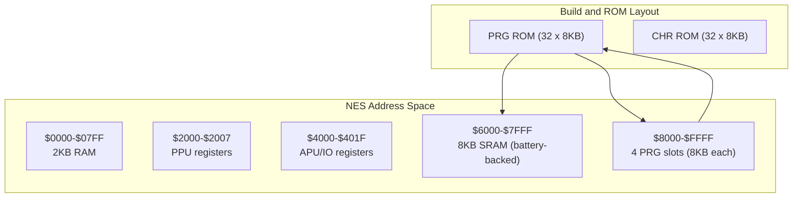
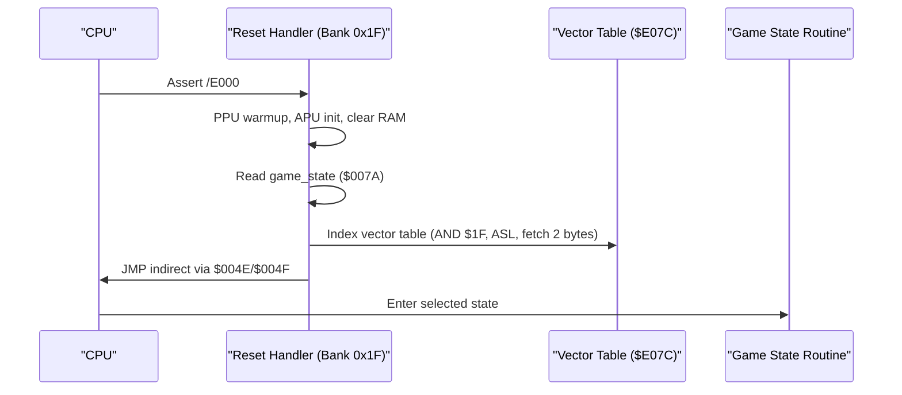
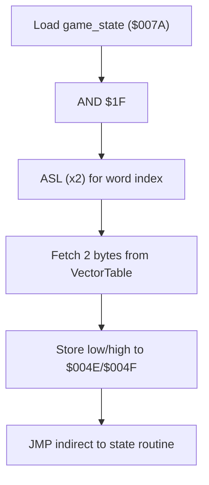
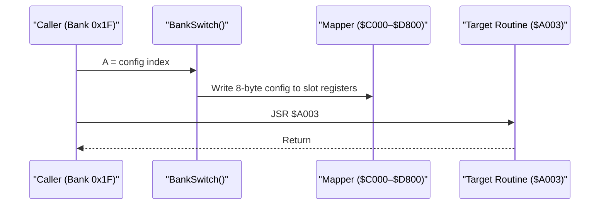
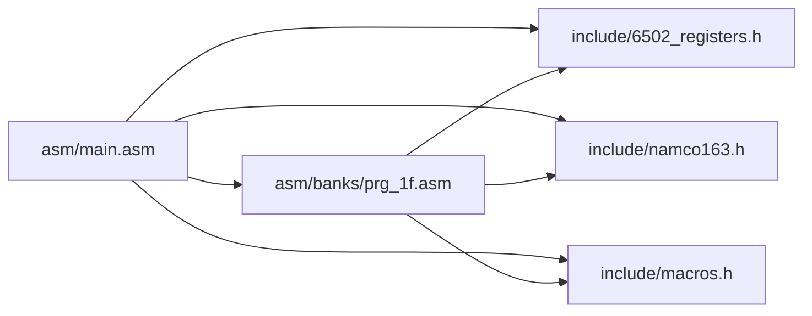

# Memory Organization and Addressing

<cite>
**Referenced Files in This Document**
- [PROJECT.md](file://PROJECT.md)
- [linker.cfg](file://linker.cfg)
- [include/6502_registers.h](file://include/6502_registers.h)
- [include/namco163.h](file://include/namco163.h)
- [include/macros.h](file://include/macros.h)
- [asm/main.asm](file://asm/main.asm)
- [asm/banks/prg_1f.asm](file://asm/banks/prg_1f.asm)
- [rom/rom_info.h](file://rom/rom_info.h)
</cite>

## Table of Contents
1. [Introduction](#introduction)
2. [Project Structure](#project-structure)
3. [Core Components](#core-components)
4. [Architecture Overview](#architecture-overview)
5. [Detailed Component Analysis](#detailed-component-analysis)
6. [Dependency Analysis](#dependency-analysis)
7. [Performance Considerations](#performance-considerations)
8. [Troubleshooting Guide](#troubleshooting-guide)
9. [Conclusion](#conclusion)

## Introduction
This document explains the memory organization and addressing patterns used in the Sangokushi 2 disassembly targeting the NES. It covers how the 6502 accesses 256KB of PRG ROM across 32 banks despite only having 16-bit addresses, details the Namco-163 mapper’s bank switching mechanism, and documents the memory map layout. It also describes multiply-by-power-of-two techniques using accumulator shifts to accelerate arithmetic, and how the mapper abstraction enables seamless cross-bank data access while preserving logical addressing.

## Project Structure
The project organizes code around:
- A central entry point and interrupt vectors in bank 0x1F
- 32 PRG banks mapped into four 8KB slots ($8000–$FFFF)
- Mapper and register definitions under include/
- Linker configuration defining memory regions and segments

**Diagram sources**
- [PROJECT.md:70-83](file://PROJECT.md#L70-L83)
- [linker.cfg:4-12](file://linker.cfg#L4-L12)

**Section sources**
- [PROJECT.md:14-47](file://PROJECT.md#L14-L47)
- [linker.cfg:18-30](file://linker.cfg#L18-L30)

## Core Components
- Memory map and banked PRG layout
  - 2KB RAM at $0000–$07FF
  - PPU registers at $2000–$2007
  - APU/IO registers at $4000–$401F
  - 8KB SRAM at $6000–$7FFF
  - Four 8KB PRG slots at $8000–$FFFF controlled by the mapper
- Mapper and bank switching
  - Namco-163 (mapper 19) exposes write-only registers at $F800–$FE00 to select PRG banks for each slot
  - Macros and constants in include/ facilitate switching
- Linker configuration
  - Defines Zeropage, RAM, and four PRG slots; code segments map to specific slots
- Entry point and dispatch
  - Reset handler resides in bank 0x1F at $E000–$FFFF and uses a vector table to dispatch to game states

**Section sources**
- [PROJECT.md:70-117](file://PROJECT.md#L70-L117)
- [include/namco163.h:10-14](file://include/namco163.h#L10-L14)
- [include/namco163.h:68-86](file://include/namco163.h#L68-L86)
- [linker.cfg:18-54](file://linker.cfg#L18-L54)
- [asm/main.asm:30-60](file://asm/main.asm#L30-L60)
- [asm/banks/prg_1f.asm:153-168](file://asm/banks/prg_1f.asm#L153-L168)

## Architecture Overview
The system uses a fixed boot bank (0x1F) mapped to PRG slot 3 ($E000–$FFFF) and dynamically switches three lower slots ($8000–$DFFF) via mapper writes. The reset handler initializes hardware, clears RAM, and dispatches to a state routine via an indirect vector table. Bank switching is performed through dedicated routines and macros.

**Diagram sources**
- [PROJECT.md:101-117](file://PROJECT.md#L101-L117)
- [asm/banks/prg_1f.asm:138-147](file://asm/banks/prg_1f.asm#L138-L147)
- [asm/banks/prg_1f.asm:153-168](file://asm/banks/prg_1f.asm#L153-L168)

**Section sources**
- [PROJECT.md:101-117](file://PROJECT.md#L101-L117)
- [asm/banks/prg_1f.asm:74-147](file://asm/banks/prg_1f.asm#L74-L147)

## Detailed Component Analysis

### Memory Map and Regions
- RAM: $0000–$07FF (2KB)
- PPU registers: $2000–$2007
- APU/IO registers: $4000–$401F
- SRAM: $6000–$7FFF (8KB, battery-backed)
- PRG slots:
  - $8000–$9FFF (slot 0)
  - $A000–$BFFF (slot 1)
  - $C000–$DFFF (slot 2)
  - $E000–$FFFF (slot 3, fixed to bank 0x1F at boot)

These regions are reflected in both the project documentation and the linker configuration.

**Section sources**
- [PROJECT.md:70-83](file://PROJECT.md#L70-L83)
- [linker.cfg:4-12](file://linker.cfg#L4-L12)

### Bank Switching Mechanism (Namco-163)
- Mapper registers:
  - $F800 selects PRG bank for slot 0 ($8000–$9FFF)
  - $FA00 selects PRG bank for slot 1 ($A000–$BFFF)
  - $FC00 selects PRG bank for slot 2 ($C000–$DFFF)
  - $FE00 selects PRG bank for slot 3 ($E000–$FFFF)
- Macros and helpers:
  - switch_bank_8000, switch_bank_A000, switch_bank_C000, switch_bank_E000
  - switch_prg_bank macro supports dynamic selection of slot
- Initialization:
  - Mapper initialization sets up slot 0/1/2 and resets IRQ counter

**Diagram sources**
- [include/namco163.h:10-14](file://include/namco163.h#L10-L14)
- [include/namco163.h:68-86](file://include/namco163.h#L68-L86)
- [include/macros.h:60-71](file://include/macros.h#L60-L71)
- [asm/banks/prg_1f.asm:785-817](file://asm/banks/prg_1f.asm#L785-L817)

**Section sources**
- [include/namco163.h:10-14](file://include/namco163.h#L10-L14)
- [include/namco163.h:68-86](file://include/namco163.h#L68-L86)
- [include/macros.h:58-71](file://include/macros.h#L58-L71)
- [asm/main.asm:115-121](file://asm/main.asm#L115-L121)
- [asm/banks/prg_1f.asm:785-817](file://asm/banks/prg_1f.asm#L785-L817)

### Address Calculation Patterns and Pointer Arithmetic
- Vector table indexing uses AND + ASL to compute a 2-byte word index, then fetches low/high bytes to indirectly jump to a state routine.
- Bank switching routine uses ASL twice then ASL again to scale an index by 8 for a table lookup.
- Pointer arithmetic examples:
  - Setting a 16-bit pointer to $8000 and using it to call banked routines at $A003, $A015, etc.
  - Using Y-indexed window setup routines and banked display functions.

**Diagram sources**
- [asm/banks/prg_1f.asm:138-147](file://asm/banks/prg_1f.asm#L138-L147)
- [asm/banks/prg_1f.asm:740-749](file://asm/banks/prg_1f.asm#L740-L749)

**Section sources**
- [asm/banks/prg_1f.asm:138-147](file://asm/banks/prg_1f.asm#L138-L147)
- [asm/banks/prg_1f.asm:740-749](file://asm/banks/prg_1f.asm#L740-L749)

### Indirect Addressing and Banked Calls
- Banked functions are invoked by calling addresses within the $A000–$AFFF range, which resolves to the currently loaded bank for that slot.
- Examples:
  - Calling $A003, $A015, $A027, $A006, $A009, $A018, etc., from within bank 0x1F after bank switching.

**Diagram sources**
- [asm/banks/prg_1f.asm:785-817](file://asm/banks/prg_1f.asm#L785-L817)
- [asm/banks/prg_1f.asm:236](file://asm/banks/prg_1f.asm#L236)
- [asm/banks/prg_1f.asm:243](file://asm/banks/prg_1f.asm#L243)

**Section sources**
- [asm/banks/prg_1f.asm:785-817](file://asm/banks/prg_1f.asm#L785-L817)
- [asm/banks/prg_1f.asm:236-255](file://asm/banks/prg_1f.asm#L236-L255)

### Fast Multiplication via Accumulator Shifts
The codebase implements efficient multiplication routines using shift-and-add with LSR/ASL and ROL sequences:
- 24x8 Multiply: 8 iterations, LSR multiplier, conditional add, ASL/ROL multiplicand and extension
- 24x16 Multiply: 16 iterations, ROR 16-bit multiplier, conditional add, ASL/ROL multiplicand and extensions
- Divide-by-100: Uses a 24-bit divide routine to produce a 16-bit quotient efficiently

**Diagram sources**
- [asm/banks/prg_1f.asm:1752-1794](file://asm/banks/prg_1f.asm#L1752-L1794)
- [asm/banks/prg_1f.asm:1801-1852](file://asm/banks/prg_1f.asm#L1801-L1852)

**Section sources**
- [asm/banks/prg_1f.asm:1752-1794](file://asm/banks/prg_1f.asm#L1752-L1794)
- [asm/banks/prg_1f.asm:1801-1852](file://asm/banks/prg_1f.asm#L1801-L1852)

### Relationship Between Physical ROM Layout and Logical Addressing
- Physical PRG banks are 8KB each; the mapper writes select which bank appears in each 8KB slot.
- Logical addressing remains consistent within a bank; cross-bank access is achieved by writing to mapper registers before calling banked addresses.
- The linker configuration defines four PRG slots and assigns code segments to them, ensuring correct placement during linking.

**Section sources**
- [PROJECT.md:84-94](file://PROJECT.md#L84-L94)
- [linker.cfg:25-30](file://linker.cfg#L25-L30)
- [linker.cfg:43-47](file://linker.cfg#L43-L47)

## Dependency Analysis
The following diagram shows how the entry point, mapper, and banked code depend on each other and on the mapper definitions.

**Diagram sources**
- [asm/main.asm:6-7](file://asm/main.asm#L6-L7)
- [include/6502_registers.h:40-50](file://include/6502_registers.h#L40-L50)
- [include/namco163.h:10-14](file://include/namco163.h#L10-L14)
- [include/macros.h:58-71](file://include/macros.h#L58-L71)
- [asm/banks/prg_1f.asm:10-11](file://asm/banks/prg_1f.asm#L10-L11)

**Section sources**
- [asm/main.asm:6-7](file://asm/main.asm#L6-L7)
- [include/6502_registers.h:40-50](file://include/6502_registers.h#L40-L50)
- [include/namco163.h:10-14](file://include/namco163.h#L10-L14)
- [include/macros.h:58-71](file://include/macros.h#L58-L71)
- [asm/banks/prg_1f.asm:10-11](file://asm/banks/prg_1f.asm#L10-L11)

## Performance Considerations
- Bank switching cost: Each bank switch requires writing to mapper registers; batching multiple switches reduces overhead.
- Fast math: Shift-and-add routines replace slower multiplication routines, trading memory for speed.
- Vector indexing: AND + ASL to compute word indices minimizes overhead in dispatch loops.
- Clearing RAM: Efficient zero-page loops reduce startup time.

[No sources needed since this section provides general guidance]

## Troubleshooting Guide
- Incorrect bank mapping
  - Symptom: Garbage code or crashes when calling $A0xx routines
  - Check: BankSwitch routine and mapper register writes at $C000–$D800
- Dispatch failure
  - Symptom: Stuck in idle or wrong state
  - Check: Vector table indexing at $E07C and AND + ASL scaling
- SRAM not persisting
  - Symptom: Save data lost after power-off
  - Check: SRAM region $6000–$7FFF and battery presence
- Linker errors
  - Symptom: Segments not fitting or missing symbols
  - Check: PRG slot assignments and segment definitions in linker.cfg

**Section sources**
- [asm/banks/prg_1f.asm:785-817](file://asm/banks/prg_1f.asm#L785-L817)
- [asm/banks/prg_1f.asm:138-147](file://asm/banks/prg_1f.asm#L138-L147)
- [PROJECT.md:78](file://PROJECT.md#L78)
- [linker.cfg:43-47](file://linker.cfg#L43-L47)

## Conclusion
The Sangokushi 2 disassembly employs a robust bank switching strategy via the Namco-163 mapper to access 256KB of PRG ROM from 16-bit addressing. The reset handler and vector table provide a clean dispatch mechanism, while macros and helper routines streamline bank switching and cross-bank calls. Efficient shift-and-add routines demonstrate practical optimizations for arithmetic on the 6502. Together, these patterns enable maintainable, modular code while preserving predictable logical addressing across the full ROM space.