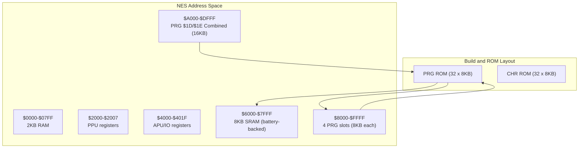
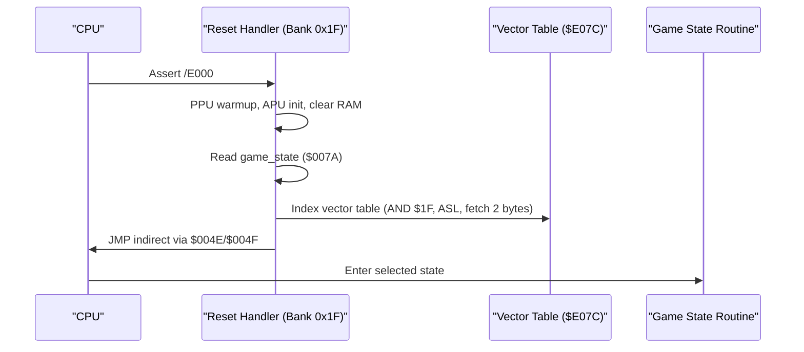
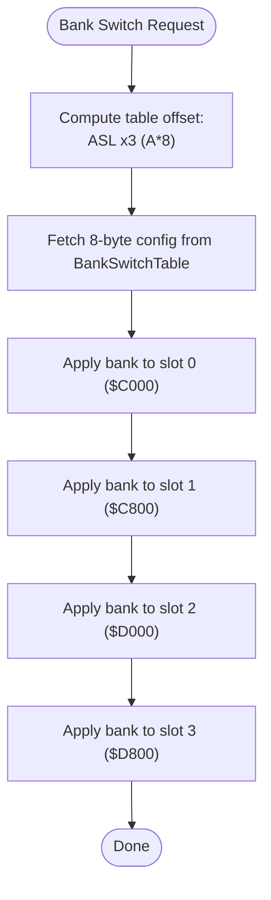
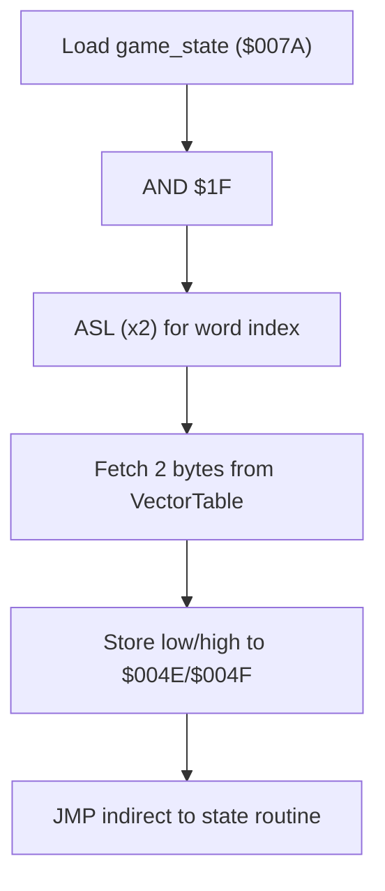
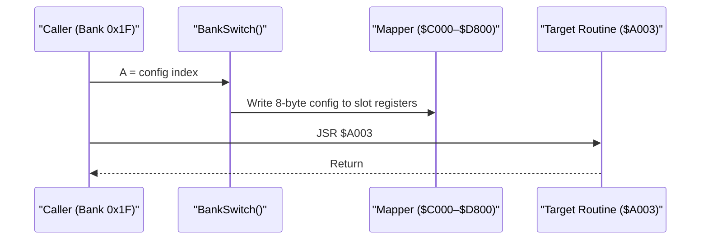
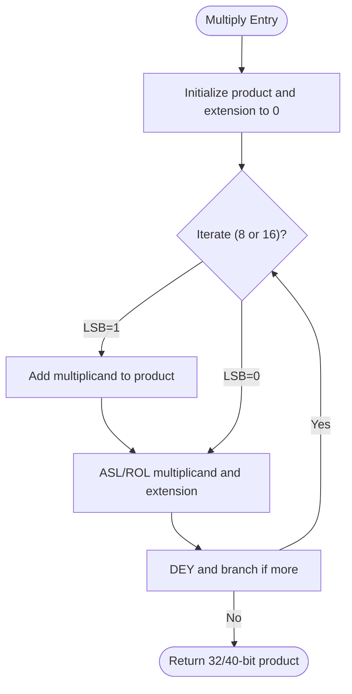
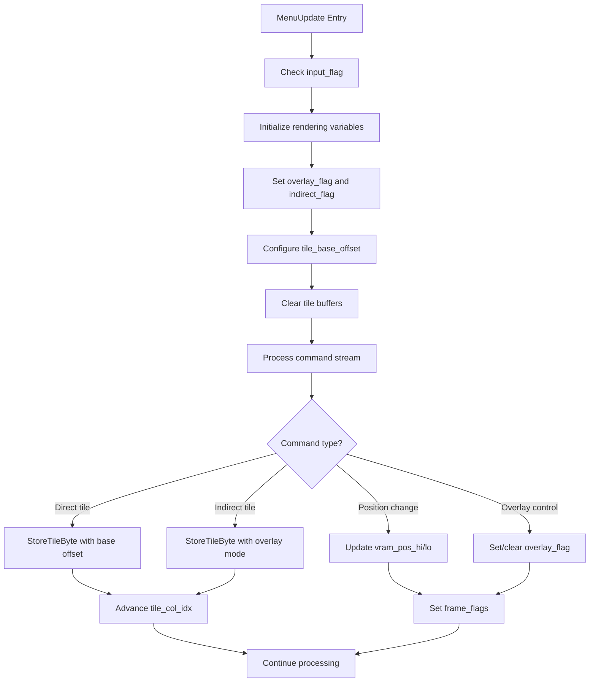
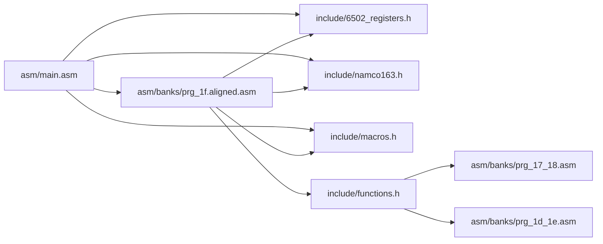

# Memory Organization and Addressing

<cite>
**Referenced Files in This Document**
- [PROJECT.md](file://PROJECT.md)
- [linker.cfg](file://linker.cfg)
- [test_17_18.cfg](file://test_17_18.cfg)
- [include/6502_registers.h](file://include/6502_registers.h)
- [include/namco163.h](file://include/namco163.h)
- [include/macros.h](file://include/macros.h)
- [include/functions.h](file://include/functions.h)
- [asm/main.asm](file://asm/main.asm)
- [asm/banks/prg_1f.aligned.asm](file://asm/banks/prg_1f.aligned.asm)
- [asm/banks/prg_17_18.asm](file://asm/banks/prg_17_18.asm)
- [asm/banks/prg_1d_1e.asm](file://asm/banks/prg_1d_1e.asm)
- [tools/globalize_04xx.py](file://tools/globalize_04xx.py)
</cite>

## Update Summary
**Changes Made**
- Enhanced zero-page workspace definitions with comprehensive documentation for $0000-$001F scratch area
- Added detailed display state variables documentation for $005E-$0074 range including frame counters and scene parameters
- Documented StateHandler workspace ($00AE-$00DC) with VRAM counters and row management
- Expanded page $01-$03 buffer definitions with enhanced organization for display rendering
- Updated PRG $1D/$1E memory region documentation with sophisticated tile rendering capabilities
- Enhanced centralized global RAM definition system documentation with canonical naming conventions

## Table of Contents
1. [Introduction](#introduction)
2. [Project Structure](#project-structure)
3. [Core Components](#core-components)
4. [Architecture Overview](#architecture-overview)
5. [Detailed Component Analysis](#detailed-component-analysis)
6. [Enhanced Zero-Page Workspace Documentation](#enhanced-zero-page-workspace-documentation)
7. [Advanced Display State Management](#advanced-display-state-management)
8. [StateHandler Workspace Architecture](#statehandler-workspace-architecture)
9. [Page Buffer System Organization](#page-buffer-system-organization)
10. [Centralized Global RAM Definition System](#centralized-global-ram-definition-system)
11. [PRG $1D/$1E Combined Memory Regions](#prg-1d1e-combined-memory-regions)
12. [Advanced Tile Rendering System](#advanced-tile-rendering-system)
13. [Dependency Analysis](#dependency-analysis)
14. [Performance Considerations](#performance-considerations)
15. [Troubleshooting Guide](#troubleshooting-guide)
16. [Conclusion](#conclusion)

## Introduction
This document explains the memory organization and addressing patterns used in the Sangokushi 2 disassembly targeting the NES. It covers how the 6502 accesses 256KB of PRG ROM across 32 banks despite only having 16-bit addresses, details the Namco-163 mapper's bank switching mechanism, and documents the memory map layout. It also describes multiply-by-power-of-two techniques using accumulator shifts to accelerate arithmetic, and how the mapper abstraction enables seamless cross-bank data access while preserving logical addressing.

**Updated** The implementation now features an extensively documented RAM variable system with comprehensive zero-page workspace definitions, sophisticated display state management, and a centralized global RAM definition system that provides consistent naming conventions across all 32 PRG banks. The PRG $1D/$1E combined system operates as a unified 16KB memory region ($A000-$DFFF) with specialized memory areas for menu systems, domestic affairs display functions, and integrated parameter processing systems.

## Project Structure
The project organizes code around:
- A central entry point and interrupt vectors in bank 0x1F
- 32 PRG banks mapped into four 8KB slots ($8000–$FFFF)
- Mapper and register definitions under include/
- Linker configuration defining memory regions and segments
- Centralized global RAM definitions with canonical naming in key banks
- **Enhanced PRG $1D/$1E system**: Combined 16KB bank pair at $A000-$DFFF with specialized memory regions for menu systems and domestic affairs

**Diagram sources**
- [PROJECT.md:70-83](file://PROJECT.md#L70-L83)
- [linker.cfg:4-12](file://linker.cfg#L4-L12)
- [test_17_18.cfg:1-8](file://test_17_18.cfg#L1-L8)

**Section sources**
- [PROJECT.md:14-47](file://PROJECT.md#L14-L47)
- [linker.cfg:18-30](file://linker.cfg#L18-L30)
- [test_17_18.cfg:1-8](file://test_17_18.cfg#L1-L8)

## Core Components
- Memory map and banked PRG layout
  - 2KB RAM at $0000–$07FF
  - PPU registers at $2000–$2007
  - APU/IO registers at $4000–$401F
  - 8KB SRAM at $6000–$7FFF
  - Four 8KB PRG slots at $8000–$FFFF controlled by the mapper
  - **Enhanced PRG $1D/$1E combined region**: 16KB contiguous area at $A000–$DFFF for menu systems and domestic affairs display functions
- Mapper and bank switching
  - Namco-163 (mapper 19) exposes write-only registers at $F800–$FE00 to select PRG banks for each slot
  - Macros and constants in include/ facilitate switching
  - **PRG $1D/$1E switching**: Specialized bank switching via SwitchBankAC_A/B with Y=$37 for combined 16KB access
- Centralized global RAM definitions
  - Canonical naming system established in key banks (0x1F, 0x17-0x18, 0x1D-0x1E)
  - Eliminates redundant local $04xx definitions
  - Standardized state variable naming across all banks
- Linker configuration
  - Defines Zeropage, RAM, and four PRG slots; code segments map to specific slots
  - **PRG $1D/$1E testing**: Separate memory regions for individual bank testing
- Entry point and dispatch
  - Reset handler resides in bank 0x1F at $E000–$FFFF and uses a vector table to dispatch to game states

**Section sources**
- [PROJECT.md:70-117](file://PROJECT.md#L70-L117)
- [include/namco163.h:10-14](file://include/namco163.h#L10-L14)
- [include/namco163.h:68-86](file://include/namco163.h#L68-L86)
- [linker.cfg:18-54](file://linker.cfg#L18-L54)
- [asm/main.asm:30-60](file://asm/main.asm#L30-L60)
- [asm/banks/prg_1f.aligned.asm:153-168](file://asm/banks/prg_1f.aligned.asm#L153-L168)
- [tools/globalize_04xx.py:13-77](file://tools/globalize_04xx.py#L13-L77)
- [include/functions.h:315-335](file://include/functions.h#L315-335)

## Architecture Overview
The system uses a fixed boot bank (0x1F) mapped to PRG slot 3 ($E000–$FFFF) and dynamically switches three lower slots ($8000–$DFFF) via mapper writes. The reset handler initializes hardware, clears RAM, and dispatches to a state routine via an indirect vector table. Bank switching is performed through dedicated routines and macros.

**Updated** The PRG $1D/$1E combined system provides specialized memory regions for menu systems, domestic affairs display functionality, and integrated parameter processing within a unified 16KB address space, enhanced with sophisticated tile rendering capabilities and comprehensive RAM variable documentation.

**Diagram sources**
- [PROJECT.md:101-117](file://PROJECT.md#L101-L117)
- [asm/banks/prg_1f.aligned.asm:138-147](file://asm/banks/prg_1f.aligned.asm#L138-L147)
- [asm/banks/prg_1f.aligned.asm:153-168](file://asm/banks/prg_1f.aligned.asm#L153-L168)

**Section sources**
- [PROJECT.md:101-117](file://PROJECT.md#L101-L117)
- [asm/banks/prg_1f.aligned.asm:74-147](file://asm/banks/prg_1f.aligned.asm#L74-L147)

## Detailed Component Analysis

### Memory Map and Regions
- RAM: $0000–$07FF (2KB)
- PPU registers: $2000–$2007
- APU/IO registers: $4000–$401F
- SRAM: $6000–$7FFF (8KB, battery-backed)
- PRG slots:
  - $8000–$9FFF (slot 0)
  - $A000–$BFFF (slot 1, PRG $1D/$1E combined region)
  - $C000–$DFFF (slot 2, PRG $1D/$1E combined region)
  - $E000–$FFFF (slot 3, fixed to bank 0x1F at boot)
- **Enhanced PRG $1D/$1E regions**:
  - $0300–$0313: Display/button confirm state and PPU queue pointers
  - $0380–$03FF: Sprite Y-position buffer (OAM shadow)
  - $0600–$0627: Tile coordinate arrays (20 entries each)
  - $0680–$06BF: Tile index grid (64 bytes for adjacency mapping)
  - $6F07–$6F44: Battery-backed SRAM for kingdom data and parameters

**Updated** The PRG $1D/$1E combined region provides specialized memory areas for menu systems, domestic affairs display functionality, and integrated parameter processing, including tile grid management, sprite positioning, and persistent storage, with enhanced support for sophisticated tile rendering operations and comprehensive RAM variable documentation.

**Section sources**
- [PROJECT.md:70-83](file://PROJECT.md#L70-L83)
- [linker.cfg:4-12](file://linker.cfg#L4-L12)
- [asm/banks/prg_17_18.asm:139-162](file://asm/banks/prg_17_18.asm#L139-L162)
- [tools/globalize_04xx.py:15-77](file://tools/globalize_04xx.py#L15-L77)

### Centralized Global RAM Definition System
**New Section** The project implements a sophisticated centralized global RAM definition system that standardizes memory addressing patterns across all banks:

- **Canonical Naming Convention**: Addresses like `$0400`, `$0401`, `$042C`, `$04A8` are consistently named using descriptive canonical names such as `ptr_0400_lo`, `ptr_0400_hi`, `selected_officer_id`, and `game_state`.
- **Elimination of Redundancy**: Local `$04xx` definitions within `.proc` blocks have been removed, reducing code duplication and improving maintainability.
- **Cross-Bank Consistency**: All banks now reference the same canonical addresses, ensuring consistent behavior regardless of which bank is active.
- **Tool-Assisted Migration**: The `globalize_04xx.py` script automatically identifies local aliases and replaces them with canonical names across the codebase.
- **Comprehensive Coverage**: The system covers critical RAM regions including game state management, pointer handling, officer data, and display coordination.

**Section sources**
- [tools/globalize_04xx.py:1-205](file://tools/globalize_04xx.py#L1-L205)
- [asm/banks/prg_17_18.asm:14-30](file://asm/banks/prg_17_18.asm#L14-L30)
- [asm/banks/prg_1f.aligned.asm:50-68](file://asm/banks/prg_1f.aligned.asm#L50-L68)

### Bank Switching Mechanism (Namco-163)
- Mapper registers:
  - $F800 selects PRG bank for slot 0 ($8000–$9FFF)
  - $FA00 selects PRG bank for slot 1 ($A000–$BFFF)
  - $FC00 selects PRG bank for slot 2 ($C000–$DFFF)
  - $FE00 selects PRG bank for slot 3 ($E000–$FFFF)
- Macros and helpers:
  - switch_bank_8000, switch_bank_A000, switch_bank_C000, switch_bank_E000
  - switch_prg_bank macro supports dynamic selection of slot
  - **PRG $1D/$1E switching**: SwitchBankAC_A/B routines handle combined bank loading
- Initialization:
  - Mapper initialization sets up slot 0/1/2 and resets IRQ counter

**Diagram sources**
- [include/namco163.h:10-14](file://include/namco163.h#L10-L14)
- [include/namco163.h:68-86](file://include/namco163.h#L68-L86)
- [include/macros.h:60-71](file://include/macros.h#L60-L71)
- [asm/banks/prg_1f.aligned.asm:785-817](file://asm/banks/prg_1f.aligned.asm#L785-L817)

**Section sources**
- [include/namco163.h:10-14](file://include/namco163.h#L10-L14)
- [include/namco163.h:68-86](file://include/namco163.h#L68-L86)
- [include/macros.h:58-71](file://include/macros.h#L58-L71)
- [asm/main.asm:115-121](file://asm/main.asm#L115-L121)
- [asm/banks/prg_1f.aligned.asm:785-817](file://asm/banks/prg_1f.aligned.asm#L785-L817)

### Address Calculation Patterns and Pointer Arithmetic
- Vector table indexing uses AND + ASL to compute a 2-byte word index, then fetches low/high bytes to indirectly jump to a state routine.
- Bank switching routine uses ASL twice then ASL again to scale an index by 8 for a table lookup.
- Pointer arithmetic examples:
  - Setting a 16-bit pointer to $8000 and using it to call banked routines at $A003, $A015, etc.
  - Using Y-indexed window setup routines and banked display functions.
- **Centralized $04xx addressing**: Now uses canonical names like `game_state` and `selected_officer_id` instead of scattered local aliases.
- **PRG $1D/$1E addressing**: Specialized addressing for menu systems and domestic affairs within the combined 16KB region.

**Diagram sources**
- [asm/banks/prg_1f.aligned.asm:138-147](file://asm/banks/prg_1f.aligned.asm#L138-L147)
- [asm/banks/prg_1f.aligned.asm:740-749](file://asm/banks/prg_1f.aligned.asm#L740-L749)

**Section sources**
- [asm/banks/prg_1f.aligned.asm:138-147](file://asm/banks/prg_1f.aligned.asm#L138-L147)
- [asm/banks/prg_1f.aligned.asm:740-749](file://asm/banks/prg_1f.aligned.asm#L740-L749)
- [tools/globalize_04xx.py:15-77](file://tools/globalize_04xx.py#L15-L77)

### Indirect Addressing and Banked Calls
- Banked functions are invoked by calling addresses within the $A000–$AFFF range, which resolves to the currently loaded bank for that slot.
- Examples:
  - Calling $A003, $A015, $A027, $A006, $A009, $A018, etc., from within bank 0x1F after bank switching.
- **PRG $1D/$1E combined access**: Functions in the $A000–$DFFF range can be accessed through either bank $1D or $1E depending on the current bank configuration.
- **Improved memory management**: Centralized canonical names ensure consistent addressing regardless of which bank contains the calling code.

**Diagram sources**
- [asm/banks/prg_1f.aligned.asm:785-817](file://asm/banks/prg_1f.aligned.asm#L785-L817)
- [asm/banks/prg_1f.aligned.asm:236](file://asm/banks/prg_1f.aligned.asm#L236)
- [asm/banks/prg_1f.aligned.asm:243](file://asm/banks/prg_1f.aligned.asm#L243)

**Section sources**
- [asm/banks/prg_1f.aligned.asm:785-817](file://asm/banks/prg_1f.aligned.asm#L785-L817)
- [asm/banks/prg_1f.aligned.asm:236-255](file://asm/banks/prg_1f.aligned.asm#L236-L255)

### Fast Multiplication via Accumulator Shifts
The codebase implements efficient multiplication routines using shift-and-add with LSR/ASL and ROL sequences:
- 24x8 Multiply: 8 iterations, LSR multiplier, conditional add, ASL/ROL multiplicand and extension
- 24x16 Multiply: 16 iterations, ROR 16-bit multiplier, conditional add, ASL/ROL multiplicand and extensions
- Divide-by-100: Uses a 24-bit divide routine to produce a 16-bit quotient efficiently

**Diagram sources**
- [asm/banks/prg_1f.aligned.asm:1752-1794](file://asm/banks/prg_1f.aligned.asm#L1752-L1794)
- [asm/banks/prg_1f.aligned.asm:1801-1852](file://asm/banks/prg_1f.aligned.asm#L1801-L1852)

**Section sources**
- [asm/banks/prg_1f.aligned.asm:1752-1794](file://asm/banks/prg_1f.aligned.asm#L1752-L1794)
- [asm/banks/prg_1f.aligned.asm:1801-1852](file://asm/banks/prg_1f.aligned.asm#L1801-L1852)

### Relationship Between Physical ROM Layout and Logical Addressing
- Physical PRG banks are 8KB each; the mapper writes select which bank appears in each 8KB slot.
- Logical addressing remains consistent within a bank; cross-bank access is achieved by writing to mapper registers before calling banked addresses.
- The linker configuration defines four PRG slots and assigns code segments to them, ensuring correct placement during linking.
- **PRG $1D/$1E combined system**: Two physical banks (1D and 1E) are mapped to adjacent 8KB windows ($A000-$BFFF and $C000-$DFFF) creating a unified 16KB logical address space.
- **Centralized RAM definitions**: Canonical naming ensures consistent logical addressing across all physical bank locations.

**Section sources**
- [PROJECT.md:84-94](file://PROJECT.md#L84-L94)
- [linker.cfg:25-30](file://linker.cfg#L25-30)
- [linker.cfg:43-47](file://linker.cfg#L43-L47)
- [include/functions.h:315-335](file://include/functions.h#L315-335)

## Enhanced Zero-Page Workspace Documentation

**New Section** The zero-page workspace ($0000-$001F) provides essential scratch space for the entire system with comprehensive documentation:

### General Purpose Scratch Area ($0000-$001F)
- **zp_ptr_lo/zp_ptr_hi** ($0000-$0001): General-purpose zero-page pointer pair used by 28+ procedures
- **work2_lo/work2_hi** ($0002-$0003): Secondary workspace for OfficerRecCalc, StateHandler operations
- **copy_bank_ctr** ($0004): Bank copy counter for SramInit and StateHandler operations
- **state_tmp** ($0006): StateHandler temporary storage and VerifyChecksum workspace
- **bcd_digit0/digit1/digit2** ($0007-$0009): BCD result bytes for PeriodicOverlayRefresh and YearDisplaySetup
- **banked_work0/work1/work2** ($000A-$000C): BankedDataHandler and DisplayTileData workspace
- **tile_ptr_lo/tile_ptr_hi** ($0010-$0011): Tilemap data pointer pair for DisplayTileData and StateHandler
- **vram_tmp_lo** ($0013): VRAM position temporary for StateHandler and OfficerListHandler
- **prov_data_ptr_lo** ($0017): Province/officer data pointer for StateHandler and OfficerListHandler

### Frame Timing and Scene Parameters ($005E-$0074)
- **frame_tick_ctr** ($005E): Frame tick counter for PPUTileRender and PeriodicOverlayRefresh
- **disp_row_count** ($0061): Display row count and visible rows for OfficerListHandler and SceneRenderer
- **scene_param0-param9** ($0068-$0071): Nine scene parameters for SceneRenderer and OfficerRecLookup operations
- These parameters provide flexible data passing between rendering functions and scene management

**Section sources**
- [asm/banks/prg_1d_1e.asm:23-53](file://asm/banks/prg_1d_1e.asm#L23-L53)
- [asm/banks/prg_1d_1e.asm:55-71](file://asm/banks/prg_1d_1e.asm#L55-L71)

## Advanced Display State Management

**New Section** The display state management system provides sophisticated control over rendering operations:

### Menu and Overlay Control ($0300-$0313)
- **menu_status** ($0300): Menu system status flag ($FF=done/inactive, $00=need init, $01=active)
- **overlay_flag** ($0303): Overlay mode control ($00=direct render, $80=overlay mode)
- **tile_col_idx** ($0304): Current tile column being rendered
- **render_bitmask** ($0305): Bitmask checked against $005E for render skip control
- **vram_pos_hi/vram_pos_lo** ($0306-$0307): VRAM address high/low byte for current tile row
- **input_flag** ($0308): Input pending flag (set when $0081 bit 0 set)
- **saved_pos_hi** ($0309): Saved VRAM position high byte (for push/pop position operations)
- **saved_ptr_lo/saved_ptr_hi** ($030A-$030B): Saved data pointer low/high (for push/pop position operations)
- **indirect_flag** ($030C): Indirect addressing mode ($00=direct tiles, $01=indirect/overlay tiles)
- **tile_base_offset** ($030F): Base offset added to tile values in StoreTileByte function
- **pos_buf_0 through pos_buf_3** ($0310-$0313): Four-entry circular buffer for VRAM positions

### Position Buffer Management
The circular position buffer system provides efficient VRAM address management:
- Automatic buffer rotation during menu termination and position advancement operations
- Support for nested rendering contexts through save/restore mechanisms
- Integration with overlay modes for layered display operations

**Section sources**
- [asm/banks/prg_1d_1e.asm:227-243](file://asm/banks/prg_1d_1e.asm#L227-L243)

## StateHandler Workspace Architecture

**New Section** The StateHandler workspace ($00AE-$00DC) manages complex multi-row display operations:

### State Management Variables
- **officer_param_ofs** ($00AE): Officer param data offset for OfficerParamDisp and StateHandler
- **state_row_ofs1/state_row_ofs2** ($00B2-$00B4): StateHandler row offsets for multi-row processing
- **tile_row_count** ($00B3): Tile row count for StateHandler and SceneRenderer operations

### VRAM Counter Management
- **state_vram_cnt_lo/state_vram_cnt_hi** ($00C1-$00C2): StateHandler VRAM counter pair
- **state_row_cnt1_lo/state_row_cnt1_hi** ($00C3-$00C4): StateHandler row counter 1 pair
- **state_row_cnt2_lo/state_row_cnt2_hi** ($00C9-$00CA): StateHandler row counter 2 pair
- **state_vram_cnt2_lo/state_vram_cnt2_hi** ($00CB-$00CC): StateHandler VRAM counter 2 pair
- **state_row_cnt3_lo/state_row_cnt3_hi** ($00D1-$00D2): StateHandler row counter 3 pair
- **state_row_cnt4_lo/state_row_cnt4_hi** ($00D3-$00D4): StateHandler row counter 4 pair
- **state_row_cnt5_lo/state_row_cnt5_hi** ($00DB-$00DC): StateHandler row counter 5 pair

### Multi-Row Processing Architecture
The StateHandler implements sophisticated multi-row processing with five independent row counters, allowing complex display layouts with different timing and positioning requirements for each row.

**Section sources**
- [asm/banks/prg_1d_1e.asm:74-101](file://asm/banks/prg_1d_1e.asm#L74-L101)

## Page Buffer System Organization

**New Section** Pages $01-$03 provide organized buffer space for display and rendering operations:

### Page $01: State Handler Workspace ($0100-$0190)
- **disp_ptr_table** ($0100): Display pointer table for SetupDisplayPtrs and MenuRenderer_SecondaryDispatch
- **disp_ptr_src_lo/disp_ptr_src_hi** ($0110-$0120): Display pointer source pairs copied by SetupDisplayPtrs
- **tile_buf_base** ($0140): State dispatch control and tile buffer base
- **state_scroll_x** ($0141): Scroll X offset for StateHandler and MapDisplaySetup
- **state_vram_hi/state_vram_pos_lo/state_vram_pos_hi** ($0142-$0144): VRAM address and position management
- **state_disp_lo/state_disp_hi** ($0145-$0146): Display VRAM address pair for StateHandler
- **state_attr_lo/state_attr_hi** ($0147-$0148): Attribute block address pair for StateHandler
- **tilemap_src_lo/tilemap_src_hi** ($0149-$014A): Tilemap source pointer pair for StateHandler
- **state_scroll_y** ($014B): Scroll Y and attribute merge buffer for StateHandler
- **officer_idx_buf** ($0150): State mode flags and officer index buffer
- **officer_list_idx** ($0151): OfficerListHandler index entry
- **state_name_vram_lo/state_name_vram_hi** ($0152-$0153): Name VRAM position pair for StateHandler
- **state_row_limit** ($0154): Row limit and total rows for StateHandler and MapDisplaySetup
- **state_buf_end** ($0160): Tile row buffer start (56 bytes) for StateHandler
- **state_officer_tmp** ($0183): StateHandler and OfficerListHandler shared temporary storage

### Page $02: OAM Sprite Data ($0200-$0203)
- **oam_buf_lo/oam_buf_hi** ($0200-$0201): OAM sprite buffer pair for SceneRenderer, SetupBankedData, StateHandler
- **oam_buf_idx** ($0202): OAM sprite buffer index
- **oam_buf_extra** ($0203): OAM sprite buffer extra data

### Page $03: Display/Render Buffer ($037C-$03C3)
- **sub_state_main/sub_state_prov/sub_state_officer** ($037C-$037E): Sub-state dispatch for StateHandler
- **disp_buf_base** ($0380): Display/render buffer base used by 14+ procedures
- **disp_buf_ofs1 through disp_buf_ofsD** ($0381-$0394): Multiple display buffer offsets for SceneRenderer, YearDisplaySetup, BankedDataHandler

**Section sources**
- [asm/banks/prg_1d_1e.asm:104-167](file://asm/banks/prg_1d_1e.asm#L104-L167)

## Centralized Global RAM Definition System

**New Section** The centralized global RAM definition system provides comprehensive coverage of critical memory regions:

### Game State RAM ($04xx) Organization
The system organizes RAM into functional groups with canonical naming:

#### Pointer/State Group ($0400-$0411)
- **ptr_0400_lo/ptr_0400_hi**: General pointer pair
- **scroll_ptr_lo/scroll_ptr_hi**: Scroll pointer pair
- **ptr_040c_lo/ptr_040c_hi**: Additional pointer pair
- **ptr_040e_lo/ptr_040e_hi**: Extended pointer pair
- **ptr_0410_lo/ptr_0410_hi**: Another pointer pair

#### Officer/Selection Group ($0424-$0435)
- **ptr_0424_lo/ptr_0424_hi**: Selection pointer pair
- **selected_officer_id**: Active/selected officer ID
- **ptr_042c_hi**: Officer data pointer high
- **ptr_042f_lo/ptr_042f_hi**: Officer record pointer pair

#### Main Game State Group ($04A8-$04C0)
- **game_state**: Major game state (0-14), indexes dispatch table
- **sub_state**: Sub-state within each major state
- **active_player_slot**: Current player index (0 or 1)
- **player_flag_0**: Player 0 flag/status byte
- **player_officer_id_0/player_officer_id_1**: Officer IDs for players
- **name_tile_index**: Name tile/scroll tile data index
- **player_army_value_0/player_army_value_1**: Army values for players
- **player_random_offset_0**: Random offset for player 0
- **player_action_timer_0**: Action timer for player 0
- **anim_timer**: Animation/scroll timer
- **scroll_row_count**: Scroll row count/sprite base
- **slide_y_pos**: Slide Y position/state
- **display_ptr_lo/display_ptr_hi**: Display/map pointer pair
- **sub_action_type**: Sub-action type selector
- **frame_counter**: Frame counter

#### Event Overlay System ($04C3-$04C4)
- **event_overlay_flag**: Event overlay/battle formation flag

#### Extended State Group ($04C9-$04D5)
- **ptr_04ca_lo/ptr_04ca_hi**: Extended pointer pair
- **ptr_04cd_lo/ptr_04cd_hi**: Another extended pointer pair
- **ptr_04d2_lo/ptr_04d2_hi**: Officer record source pointer pair
- **ptr_04d4_lo/ptr_04d4_hi**: Officer record destination pointer pair

### Tool-Assisted Migration Process
The `globalize_04xx.py` script automates the migration process:
1. Scans code for local `$04xx` definitions within `.proc` blocks
2. Builds alias maps from existing local definitions
3. Removes redundant local definitions
4. Replaces references with canonical names
5. Generates comprehensive global definition blocks

**Section sources**
- [tools/globalize_04xx.py:13-77](file://tools/globalize_04xx.py#L13-L77)
- [tools/globalize_04xx.py:96-132](file://tools/globalize_04xx.py#L96-L132)
- [tools/globalize_04xx.py:135-205](file://tools/globalize_04xx.py#L135-L205)

## PRG $1D/$1E Combined Memory Regions

**New Section** The PRG $1D/$1E bank system provides specialized memory regions within a unified 16KB address space:

### Jump Table and Function Organization
The system implements a comprehensive jump table structure with 24 specialized entry points:

#### Primary Entry Points ($A000-$A047)
- **Entry00 ($A000)**: PPUTileRender - PPU tile rendering engine
- **Entry01 ($A003)**: MenuUpdate - Menu system update and input processing
- **Entry02 ($A006)**: VRAMBufferWrite - VRAM buffer writing operations
- **Entry03 ($A009)**: StateHandler - General state management
- **Entry04 ($A00C)**: MapDisplaySetup - Map display initialization
- **Entry05 ($A00F)**: OfficerListHandler - Officer list management
- **Entry06 ($A012)**: FlushTileBuffer - Upload 64-byte tile buffer to VRAM
- **Entry07 ($A015)**: LoadScenarioData - Copy 32 bytes from scenario table
- **Entry08 ($A018)**: SramInit - SRAM initialization
- **Entry09 ($A01B)**: OfficerParamDisp - Officer parameter display
- **Entry10 ($A01E)**: YearDisplaySetup - Year display setup
- **Entry11 ($A021)**: SlowPeriodic - Slow periodic overlay refresh
- **Entry12 ($A024)**: ImmediateOverlay - Immediate overlay refresh
- **Entry13 ($A027)**: ProvinceDataHandler - Province data processing
- **Entry14 ($A02A)**: OfficerDisplay_Lookup - Officer display lookup
- **Entry15 ($A02D)**: FastPeriodic - Fast periodic overlay refresh
- **Entry16 ($A030)**: OfficerDisplay_Render - Officer display render
- **Entry17 ($A033)**: OfficerNameDisplay - Officer name display
- **Entry18 ($A036)**: ClearWorkBuffer - Clear work buffer
- **Entry19 ($A039)**: SceneRenderer - Scene renderer
- **Entry20 ($A03C)**: DataFormatter - Data formatter
- **Entry21 ($A03F)**: MenuRenderer - Menu renderer
- **Entry22 ($A042)**: BankedDataHandler - Banked data handler
- **Entry23 ($A045)**: OfficerRecLookup - Officer record lookup

#### Internal Functions ($C000-$DFFF)
- **B1D_1E_CommonReturn** ($C934): Shared return handler for common operations
- **B1D_1E_SetupDisplayPtrs** ($C96D): Display pointer initialization
- **B1D_1E_ResetDispatchState** ($C98A): State reset and cleanup
- **B1D_1E_DisplayTileData** ($C994): Integrated tile data display engine

### Menu Systems and Parameter Processing
The PRG $1D/$1E system implements sophisticated menu and parameter processing capabilities:

#### Menu Update System
The MenuUpdate function provides comprehensive menu management:
- Input processing and button state detection
- Data pointer calculation and validation
- Tile buffer management for display operations
- Callback dispatcher for specialized menu actions

#### Parameter Enhancement System
Integrated parameter processing includes:
- Enhanced data formatting and display capabilities
- Improved numeric display handling with BCD conversion
- Advanced tile data processing with overflow protection
- Unified memory management across menu and domestic systems

#### Display Coordination
- Synchronized display queue management
- Coordinated PPU buffer operations
- Integrated sprite and tile rendering
- Battery-backed parameter persistence

**Section sources**
- [asm/banks/prg_1d_1e.asm:261-335](file://asm/banks/prg_1d_1e.asm#L261-L335)
- [include/functions.h:572-598](file://include/functions.h#L572-L598)

## Advanced Tile Rendering System

**New Section** The enhanced RAM variable definitions support sophisticated tile rendering operations with overlay modes and indirect addressing capabilities:

### Core Rendering Variables
The tile rendering system utilizes several key variables for managing complex display operations:

- **tile_col_idx** ($0304): Tracks the current tile column being processed in the rendering pipeline
- **render_bitmask** ($0305): Controls selective rendering by masking against $005E flags
- **vram_pos_hi/lo** ($0306-$0307): Maintains current VRAM address for tile output positioning
- **overlay_flag** ($0303): Switches between direct rendering ($00) and overlay mode ($80)
- **indirect_flag** ($030C): Enables indirect addressing mode for flexible tile data sources

### Position Buffer Management
The circular position buffer system provides efficient VRAM address management:

- **pos_buf_0 through pos_buf_3** ($0310-$0313): Four-entry circular buffer for VRAM positions
- **saved_pos_hi** ($0309), **saved_ptr_lo/hi** ($030A-$030B): Save/restore mechanism for nested rendering contexts
- Automatic buffer rotation during menu termination and position advancement operations

### Indirect Addressing and Offset Support
Advanced tile data manipulation capabilities:

- **tile_base_offset** ($030F): Base offset applied to tile values during StoreTileByte operations
- **indirect_flag** controls whether tile data comes from direct buffers or indirect overlays
- Command-based system for enabling/disabling indirect mode and setting offsets

### Event Overlay Integration
Integration with the broader event system through shared overlay mechanisms:

- **event_overlay_flag** ($04C3): Cross-bank overlay coordination for battle formations and events
- Synchronization between PRG $1D/$1E overlay system and PRG $17/$18 event overlay system
- Unified approach to layered rendering across different game systems

**Diagram sources**
- [asm/banks/prg_1d_1e.asm:342-397](file://asm/banks/prg_1d_1e.asm#L342-L397)
- [asm/banks/prg_1d_1e.asm:227-243](file://asm/banks/prg_1d_1e.asm#L227-L243)

**Section sources**
- [asm/banks/prg_1d_1e.asm:227-243](file://asm/banks/prg_1d_1e.asm#L227-L243)
- [asm/banks/prg_1d_1e.asm:342-397](file://asm/banks/prg_1d_1e.asm#L342-L397)
- [asm/banks/prg_17_18.asm:122](file://asm/banks/prg_17_18.asm#L122)

## Dependency Analysis
The following diagram shows how the entry point, mapper, and banked code depend on each other and on the mapper definitions.

**Diagram sources**
- [asm/main.asm:6-7](file://asm/main.asm#L6-L7)
- [include/6502_registers.h:40-50](file://include/6502_registers.h#L40-50)
- [include/namco163.h:10-14](file://include/namco163.h#L10-L14)
- [include/macros.h:58-71](file://include/macros.h#L58-L71)
- [asm/banks/prg_1f.aligned.asm:10-11](file://asm/banks/prg_1f.aligned.asm#L10-L11)
- [include/functions.h:570-591](file://include/functions.h#L570-L591)

**Section sources**
- [asm/main.asm:6-7](file://asm/main.asm#L6-L7)
- [include/6502_registers.h:40-50](file://include/6502_registers.h#L40-50)
- [include/namco163.h:10-14](file://include/namco163.h#L10-L14)
- [include/macros.h:58-71](file://include/macros.h#L58-L71)
- [asm/banks/prg_1f.aligned.asm:10-11](file://asm/banks/prg_1f.aligned.asm#L10-L11)

## Performance Considerations
- Bank switching cost: Each bank switch requires writing to mapper registers; batching multiple switches reduces overhead.
- Fast math: Shift-and-add routines replace slower multiplication routines, trading memory for speed.
- Vector indexing: AND + ASL to compute word indices minimizes overhead in dispatch loops.
- Clearing RAM: Efficient zero-page loops reduce startup time.
- **PRG $1D/$1E optimization**: Combined 16KB region eliminates cross-bank addressing overhead for menu and domestic display functions.
- **Centralized RAM system**: Eliminates redundant memory definitions and improves code maintainability without performance impact.
- **Enhanced tile rendering**: Circular position buffer system reduces VRAM address calculation overhead through pre-computed position tracking.
- **Indirect addressing efficiency**: Flag-based mode switching avoids expensive conditional branches in hot rendering paths.
- **Zero-page workspace optimization**: Strategic allocation of frequently-used variables in zero-page region maximizes access speed.
- **Multi-row processing**: StateHandler's five-row architecture enables complex displays while maintaining efficient memory usage.

## Troubleshooting Guide
- Incorrect bank mapping
  - Symptom: Garbage code or crashes when calling $A0xx routines
  - Check: BankSwitch routine and mapper register writes at $C000–$D800
  - **PRG $1D/$1E specific**: Verify SwitchBankAC_A/B routines and Y=$37 bank selection
- Dispatch failure
  - Symptom: Stuck in idle or wrong state
  - Check: Vector table indexing at $E07C and AND + ASL scaling
- SRAM not persisting
  - Symptom: Save data lost after power-off
  - Check: SRAM region $6000–$7FFF and battery presence
  - **PRG $1D/$1E SRAM**: Verify $6Fxx addresses are properly backed by battery
- Linker errors
  - Symptom: Segments not fitting or missing symbols
  - Check: PRG slot assignments and segment definitions in linker.cfg
  - **PRG $1D/$1E testing**: Verify separate memory regions in test_17_18.cfg
- **Centralized RAM naming issues**
  - Symptom: Compilation errors for $04xx addresses
  - Check: Ensure all references use canonical names from the centralized definition system
- **PRG $1D/$1E memory conflicts**
  - Symptom: Unexpected behavior in menu systems or domestic affairs
  - Check: Verify proper bank switching to Y=$37 and correct addressing within $A000-$DFFF
- **Tile rendering issues**
  - Symptom: Incorrect tile display or overlay problems
  - Check: Verify overlay_flag and indirect_flag settings, tile_base_offset values
  - **Circular buffer corruption**: Ensure pos_buf_0 through pos_buf_3 are properly rotated
- **Event overlay synchronization**
  - Symptom: Conflicts between menu overlays and event overlays
  - Check: Verify event_overlay_flag coordination between PRG $1D/$1E and PRG $17/$18 systems
- **Zero-page workspace conflicts**
  - Symptom: Variable corruption or unexpected behavior
  - Check: Verify proper usage of zp_ptr_lo/zp_ptr_hi and work2_lo/work2_hi pairs
  - **Frame timing issues**: Ensure frame_tick_ctr is properly managed across rendering functions
- **StateHandler workspace corruption**
  - Symptom: Multi-row display glitches or incorrect positioning
  - Check: Verify state_vram_cnt and state_row_cnt pairs are properly synchronized
  - **VRAM counter overflow**: Ensure proper handling of 16-bit counter pairs

**Section sources**
- [asm/banks/prg_1f.aligned.asm:785-817](file://asm/banks/prg_1f.aligned.asm#L785-L817)
- [asm/banks/prg_1f.aligned.asm:138-147](file://asm/banks/prg_1f.aligned.asm#L138-L147)
- [PROJECT.md:78](file://PROJECT.md#L78)
- [linker.cfg:43-47](file://linker.cfg#L43-L47)
- [tools/globalize_04xx.py:15-77](file://tools/globalize_04xx.py#L15-L77)
- [test_17_18.cfg:1-8](file://test_17_18.cfg#L1-L8)
- [asm/banks/prg_1d_1e.asm:227-243](file://asm/banks/prg_1d_1e.asm#L227-L243)
- [asm/banks/prg_17_18.asm:122](file://asm/banks/prg_17_18.asm#L122)

## Conclusion
The Sangokushi 2 disassembly employs a robust bank switching strategy via the Namco-163 mapper to access 256KB of PRG ROM from 16-bit addressing. The reset handler and vector table provide a clean dispatch mechanism, while macros and helper routines streamline bank switching and cross-bank calls. Efficient shift-and-add routines demonstrate practical optimizations for arithmetic on the 6502. Together, these patterns enable maintainable, modular code while preserving predictable logical addressing across the full ROM space.

**Updated** The implementation now features a comprehensive RAM variable documentation system with extensive zero-page workspace definitions, sophisticated display state management, and a centralized global RAM definition system that establishes canonical naming conventions across all 32 PRG banks. The enhanced PRG $1D/$1E combined system provides specialized memory regions for menu systems and domestic affairs display functionality, including integrated parameter processing, tile grid management, sprite positioning, and persistent storage.

The newly documented advanced RAM variable definitions introduce sophisticated tile rendering capabilities with overlay modes, indirect addressing, and circular position buffering. These features support complex display operations including layered rendering, flexible tile data sources, and efficient VRAM address management. The integration with the broader event overlay system demonstrates cohesive design patterns across different game systems, providing a foundation for sophisticated visual presentation while maintaining optimal performance characteristics on the NES hardware.

The centralized global RAM definition system significantly improves code maintainability by eliminating redundant local definitions and establishing consistent memory addressing patterns. The tool-assisted migration process ensures backward compatibility while providing better code clarity and reducing the likelihood of memory-related bugs. This organizational improvement maintains the performance characteristics of the original implementation while providing developers with comprehensive documentation and standardized naming conventions for future development and maintenance.