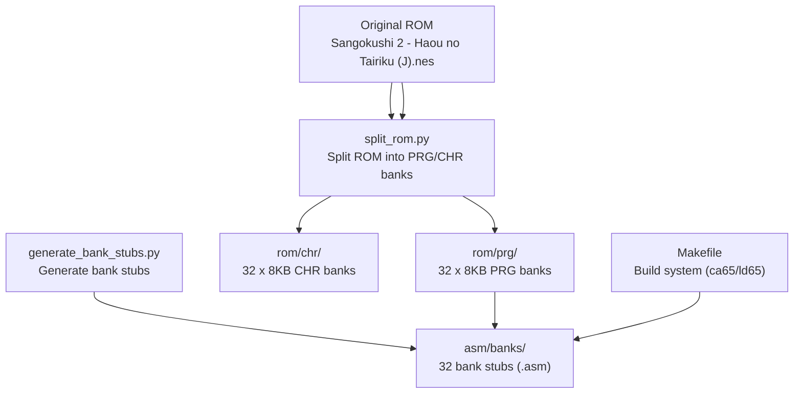
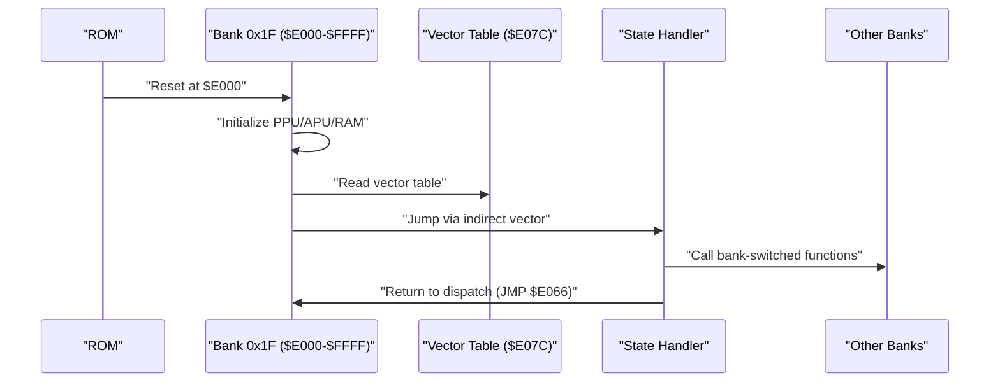
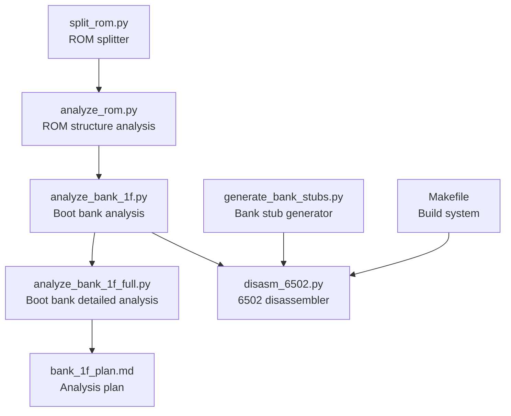

# Bank Prioritization Strategy

<cite>
**Referenced Files in This Document**
- [PROJECT.md](file://PROJECT.md)
- [Makefile](file://Makefile)
- [tools/analyze_rom.py](file://tools/analyze_rom.py)
- [tools/analyze_bank_1f.py](file://tools/analyze_bank_1f.py)
- [tools/analyze_bank_1f_full.py](file://tools/analyze_bank_1f_full.py)
- [tools/disasm_6502.py](file://tools/disasm_6502.py)
- [tools/generate_bank_stubs.py](file://tools/generate_bank_stubs.py)
- [tools/split_rom.py](file://tools/split_rom.py)
- [code/bank_1f_analysis.md](file://code/bank_1f_analysis.md)
- [code/bank_1f_plan.md](file://code/bank_1f_plan.md)
- [code/bank_1f_function_table.md](file://code/bank_1f_function_table.md)
- [code/key_functions_analysis.md](file://code/key_functions_analysis.md)
</cite>

## Table of Contents
1. [Introduction](#introduction)
2. [Project Structure](#project-structure)
3. [Core Components](#core-components)
4. [Architecture Overview](#architecture-overview)
5. [Detailed Component Analysis](#detailed-component-analysis)
6. [Dependency Analysis](#dependency-analysis)
7. [Performance Considerations](#performance-considerations)
8. [Troubleshooting Guide](#troubleshooting-guide)
9. [Conclusion](#conclusion)
10. [Appendices](#appendices)

## Introduction
This document presents a systematic bank prioritization strategy for disassembling the Namco-163 (Mapper 19) ROM of Sangokushi 2 - Haou no Tairiku (J). The approach focuses on execution flow importance, interrupt vectors, and code pattern recognition to determine which ROM banks to disassemble first. The methodology emphasizes the boot bank (0x1F) as the primary starting point due to its role as the fixed boot bank at reset and its dispatch table that controls game state transitions. The strategy also covers how to iteratively prioritize subsequent banks based on observed call frequencies, interrupt handlers, and shared infrastructure functions.

**Current Progress**: The following bank groups have been fully disassembled:
- Bank $1F (boot bank, $E000-$FFFF) — reset handler, state dispatch, sound engine, math, RNG
- Banks $0A+$0B (combined 16KB, $A000-$DFFF) — AI turn processing, province evaluation
- Banks $0C+$0D (combined 16KB, $A000-$DFFF) — officer exchange, strategic command
- Banks $17+$18 (combined 16KB, $A000-$DFFF) — display and battle systems
- Banks $1D+$1E (combined 16KB, $A000-$DFFF) — domestic affairs, scene renderer

Remaining stub banks awaiting disassembly: $00–$09, $0E–$16, $19–$1C.

## Project Structure
The repository organizes the ROM into 32 PRG banks (8KB each) and 32 CHR banks, with tools to split the ROM, generate bank stubs, and analyze structure. The build system integrates with cc65 to assemble and link the project.

**Diagram sources**
- [tools/split_rom.py:38-122](file://tools/split_rom.py#L38-L122)
- [tools/generate_bank_stubs.py:12-52](file://tools/generate_bank_stubs.py#L12-L52)
- [Makefile:50-56](file://Makefile#L50-L56)

**Section sources**
- [PROJECT.md:14-47](file://PROJECT.md#L14-L47)
- [Makefile:50-56](file://Makefile#L50-L56)

## Core Components
- ROM splitting and analysis: Tools to parse the iNES header, split PRG/CHR banks, and analyze ROM characteristics.
- Bank stub generation: Creates assembly stubs for each PRG bank to facilitate incremental disassembly.
- Bank analysis: Scripts that analyze bank 0x1F comprehensively and provide insights into function boundaries, internal JSR targets, bank switching patterns, and data tables.
- Disassembler: A basic 6502 disassembler for quick listings and targeted analysis.
- Build system: Makefile targets to orchestrate splitting, stub generation, disassembly, and verification.

Key priorities:
- Start with bank 0x1F due to its reset handler and vector dispatch table.
- Use ROM analysis to identify heavily used banks (high JSR/RTI counts).
- Apply pattern recognition to locate bank switching and interrupt handlers.

**Section sources**
- [tools/split_rom.py:11-36](file://tools/split_rom.py#L11-L36)
- [tools/analyze_rom.py:10-134](file://tools/analyze_rom.py#L10-L134)
- [tools/generate_bank_stubs.py:12-52](file://tools/generate_bank_stubs.py#L12-L52)
- [tools/disasm_6502.py:286-362](file://tools/disasm_6502.py#L286-L362)
- [PROJECT.md:118-133](file://PROJECT.md#L118-L133)

## Architecture Overview
The prioritization strategy is grounded in the Namco-163 mapper’s fixed boot bank (0x1F) and its dispatch mechanism. The reset handler initializes hardware, clears RAM, and uses a vector table to jump into the appropriate game state. This establishes the execution flow that drives bank prioritization.

**Diagram sources**
- [PROJECT.md:101-117](file://PROJECT.md#L101-L117)
- [code/bank_1f_analysis.md:22-51](file://code/bank_1f_analysis.md#L22-L51)

**Section sources**
- [PROJECT.md:101-117](file://PROJECT.md#L101-L117)
- [code/bank_1f_analysis.md:22-51](file://code/bank_1f_analysis.md#L22-L51)

## Detailed Component Analysis

### Methodology for Determining Priority Banks
- Execution flow importance:
  - Bank 0x1F is the fixed boot bank and contains the reset handler and vector dispatch table. It is the primary entry point for all game states.
  - Follow the dispatch targets from the vector table to identify which banks are invoked during normal gameplay.
- Interrupt vectors:
  - The NMI and IRQ handlers are critical for per-frame logic and raster effects. Their presence indicates important runtime infrastructure.
- Code pattern recognition:
  - Identify high JSR/RTI counts to locate heavily used banks.
  - Detect bank switching patterns (STA $F800/$FA00/$FC00/$FE00) to locate bank switching routines.
  - Recognize common utility patterns (RNG, math routines, table lookups) to prioritize shared infrastructure.

Practical steps:
- Use ROM analysis to generate a list of banks ordered by JSR/RTI counts and vector presence.
- Prioritize bank 0x1F first, then follow dispatch targets and bank switching routines.
- For ambiguous cases, prioritize banks that contain interrupt handlers, shared utilities, or frequently called subroutines.

**Section sources**
- [tools/analyze_rom.py:49-112](file://tools/analyze_rom.py#L49-L112)
- [tools/analyze_bank_1f.py:44-68](file://tools/analyze_bank_1f.py#L44-L68)
- [tools/analyze_bank_1f_full.py:62-86](file://tools/analyze_bank_1f_full.py#L62-L86)

### Bank 0x1F: The Critical Starting Point
- Role: Fixed boot bank at reset; contains reset handler, vector dispatch table, state handlers, PPU/Sound utilities, RNG, and data access functions.
- Execution flow: The reset handler initializes hardware, clears RAM, and dispatches to state handlers via the vector table. State handlers frequently call bank-switched functions in other banks.
- Shared infrastructure: PPU setup, palette uploads, sprite buffer initialization, sound engine, and controller I/O are called by state handlers and thus drive the need to disassemble other banks.

Practical implications:
- Disassemble bank 0x1F first to understand the dispatch mechanism and state transitions.
- Use the vector table to identify which banks are used for each state.
- Follow bank switching patterns to discover which banks are loaded into PRG slots.

**Section sources**
- [code/bank_1f_analysis.md:1-10](file://code/bank_1f_analysis.md#L1-L10)
- [code/bank_1f_plan.md:213-223](file://code/bank_1f_plan.md#L213-L223)
- [code/bank_1f_function_table.md:5-6](file://code/bank_1f_function_table.md#L5-L6)

### Using Analysis Tools to Generate Priority Lists
- ROM analysis:
  - Script parses the iNES header and prints PRG bank statistics (JSR/RTS/RTI counts, non-zero/0xFF byte counts).
  - Identifies potential reset candidates and interrupt vector clusters.
  - Outputs a ranked list of banks by code density and interrupt presence.
- Bank 0x1F analysis:
  - Script identifies bank switching operations and internal JSR targets.
  - Locates utility patterns (RNG, math routines) and data tables.
  - Provides a comprehensive view of function boundaries and call sites within bank 0x1F.
- Bank 0x1F full analysis:
  - Script enumerates function boundaries, internal JSR targets, bank switching operations, and external JSR targets.
  - Helps prioritize which banks to disassemble next by identifying frequently called external functions.

How to use:
- Run ROM analysis to generate a preliminary bank ranking.
- Focus on bank 0x1F first, then follow the dispatch targets and bank switching patterns.
- Use bank 0x1F analysis scripts to identify frequently called subroutines and shared utilities.

**Section sources**
- [tools/analyze_rom.py:10-134](file://tools/analyze_rom.py#L10-L134)
- [tools/analyze_bank_1f.py:4-157](file://tools/analyze_bank_1f.py#L4-L157)
- [tools/analyze_bank_1f_full.py:4-154](file://tools/analyze_bank_1f_full.py#L4-L154)

### Practical Examples of Prioritization
- Start with bank 0x1F:
  - Disassemble the reset handler and vector table.
  - Identify state handlers and their call sites.
- Follow dispatch targets:
  - Use the vector table to determine which banks are invoked for each state.
  - Prioritize banks that contain frequently called state handlers.
- Bank switching discovery:
  - Locate bank switching routines (STA $F800/$FA00/$FC00/$FE00).
  - Identify which banks are loaded into PRG slots for each state.
- Shared infrastructure:
  - Prioritize banks containing PPU/Sound utilities, RNG, and data access functions.
  - These are likely called by multiple state handlers and thus appear frequently in JSR targets.

Iterative prioritization:
- After disassembling bank 0x1F, analyze the external JSR targets to identify the next set of banks to disassemble.
- Continue this process, updating the priority list as more banks are analyzed and call relationships become clearer.

**Section sources**
- [code/bank_1f_analysis.md:54-77](file://code/bank_1f_analysis.md#L54-L77)
- [tools/analyze_bank_1f_full.py:134-150](file://tools/analyze_bank_1f_full.py#L134-L150)

### Handling Ambiguous Cases
Ambiguity arises when multiple banks appear equally important based on JSR/RTI counts or vector presence. Guidelines:
- Prefer banks containing interrupt handlers (NMI/IRQ) as they are central to runtime behavior.
- Choose banks with shared utilities (PPU/Sound/RNG/data access) since they are likely called by many state handlers.
- Use bank switching patterns to infer which banks are loaded into PRG slots for critical states.
- Cross-reference with the vector table to confirm dispatch targets.

Iterative refinement:
- As more banks are disassembled, update the call graph and adjust priorities accordingly.
- Re-run ROM analysis periodically to reflect new insights.

**Section sources**
- [tools/analyze_rom.py:68-112](file://tools/analyze_rom.py#L68-L112)
- [tools/analyze_bank_1f.py:112-154](file://tools/analyze_bank_1f.py#L112-L154)

### Bank Switching and PRG Slots
- Bank 0x1F is fixed at $E000-$FFFF at boot.
- Bank switching occurs via writes to $F800-$FFFF, loading banks into PRG slots $8000-$9FFF, $A000-$BFFF, $C000-$DFFF, and $E000-$FFFF.
- Understanding bank switching helps prioritize which banks to disassemble next, as it reveals which banks are active during each state.

**Section sources**
- [PROJECT.md:84-99](file://PROJECT.md#L84-L99)
- [tools/analyze_bank_1f.py:44-68](file://tools/analyze_bank_1f.py#L44-L68)

## Dependency Analysis
The prioritization strategy relies on several interdependent components:

**Diagram sources**
- [tools/analyze_rom.py:10-134](file://tools/analyze_rom.py#L10-L134)
- [tools/analyze_bank_1f.py:4-157](file://tools/analyze_bank_1f.py#L4-L157)
- [tools/analyze_bank_1f_full.py:4-154](file://tools/analyze_bank_1f_full.py#L4-L154)
- [tools/disasm_6502.py:286-362](file://tools/disasm_6502.py#L286-L362)
- [tools/generate_bank_stubs.py:12-52](file://tools/generate_bank_stubs.py#L12-L52)
- [tools/split_rom.py:38-122](file://tools/split_rom.py#L38-L122)
- [code/bank_1f_plan.md:213-223](file://code/bank_1f_plan.md#L213-L223)
- [Makefile:67-69](file://Makefile#L67-L69)

**Section sources**
- [tools/analyze_rom.py:10-134](file://tools/analyze_rom.py#L10-L134)
- [tools/analyze_bank_1f.py:4-157](file://tools/analyze_bank_1f.py#L4-L157)
- [tools/analyze_bank_1f_full.py:4-154](file://tools/analyze_bank_1f_full.py#L4-L154)
- [tools/disasm_6502.py:286-362](file://tools/disasm_6502.py#L286-L362)
- [tools/generate_bank_stubs.py:12-52](file://tools/generate_bank_stubs.py#L12-L52)
- [tools/split_rom.py:38-122](file://tools/split_rom.py#L38-L122)
- [code/bank_1f_plan.md:213-223](file://code/bank_1f_plan.md#L213-L223)
- [Makefile:67-69](file://Makefile#L67-L69)

## Performance Considerations
- ROM analysis is efficient and provides a quick ranking of banks by code density and interrupt presence.
- Bank 0x1F analysis scripts focus on specific patterns (bank switching, internal JSR targets, RNG/math patterns) to quickly identify priorities.
- Iterative prioritization reduces redundant analysis by leveraging previously discovered call relationships.

## Troubleshooting Guide
Common issues and resolutions:
- Incorrect file offsets in disassembler:
  - The disassembler supports a base address parameter to correctly map CPU addresses to file offsets. Use this to avoid misalignment errors.
- Missing opcodes:
  - Ensure the opcode table includes all relevant opcodes for accurate disassembly.
- ROM verification:
  - Use the verify target to compare the built ROM with the original and catch discrepancies early.

**Section sources**
- [tools/disasm_6502.py:286-362](file://tools/disasm_6502.py#L286-L362)
- [Makefile:58-61](file://Makefile#L58-L61)

## Conclusion
The bank prioritization strategy centers on the fixed boot bank (0x1F) and its dispatch mechanism, complemented by ROM analysis and pattern recognition to identify high-priority banks. By starting with bank 0x1F, following dispatch targets and bank switching patterns, and iteratively refining priorities as more banks are analyzed, the project can systematically uncover the game’s execution flow and shared infrastructure. This approach ensures that critical runtime components (interrupt handlers, PPU/Sound utilities, RNG, and data access functions) are prioritized, enabling a coherent and efficient disassembly process.

## Appendices

### Appendix A: Bank Prioritization Checklist
- Confirm bank 0x1F is the fixed boot bank. ✔ Done
- Analyze the reset handler and vector table. ✔ Done
- Identify state handlers and their call sites. ✔ Done
- Locate bank switching routines and PRG slot mappings. ✔ Done
- Prioritize interrupt handlers (NMI/IRQ). ✔ Done
- Focus on shared utilities (PPU/Sound/RNG/data access). ✔ Done
- Disassemble high-priority bank pairs ($0A/$0B, $0C/$0D, $17/$18, $1D/$1E). ✔ Done
- Iterate and refine priorities for remaining stub banks ($00–$09, $0E–$16, $19–$1C).

**Section sources**
- [PROJECT.md:101-117](file://PROJECT.md#L101-L117)
- [tools/analyze_bank_1f.py:44-68](file://tools/analyze_bank_1f.py#L44-L68)
- [tools/analyze_bank_1f_full.py:134-150](file://tools/analyze_bank_1f_full.py#L134-L150)