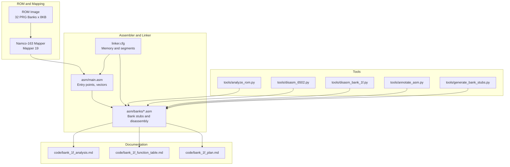
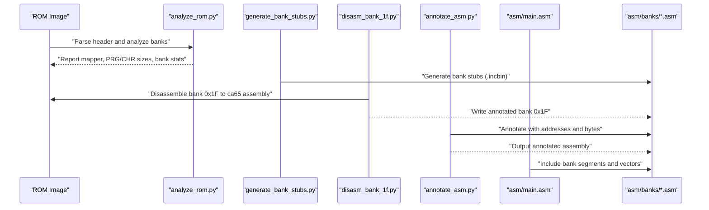
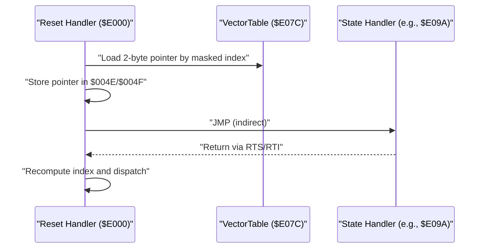
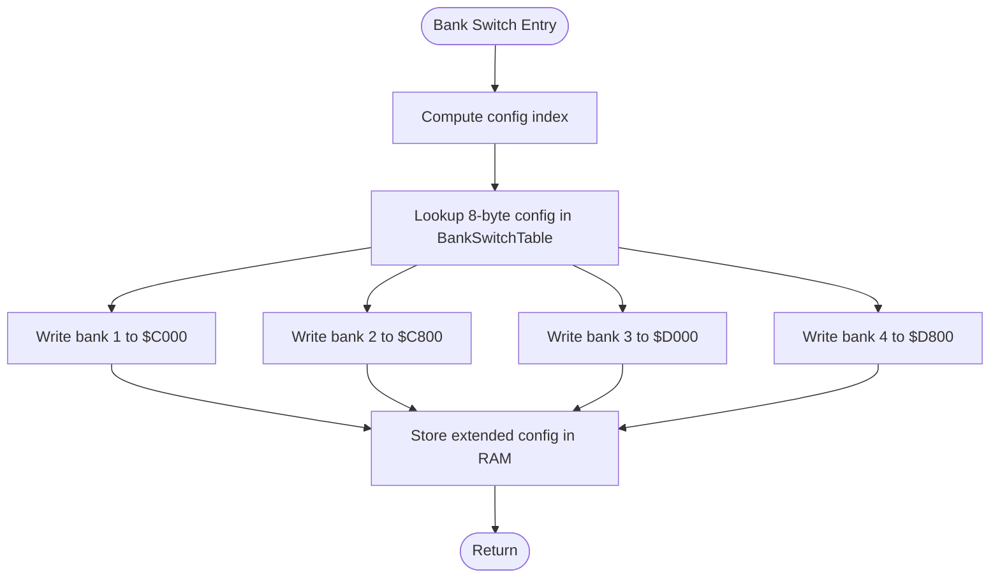
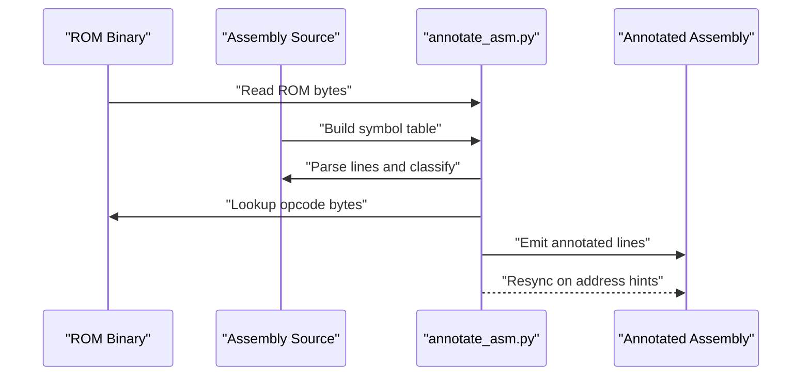
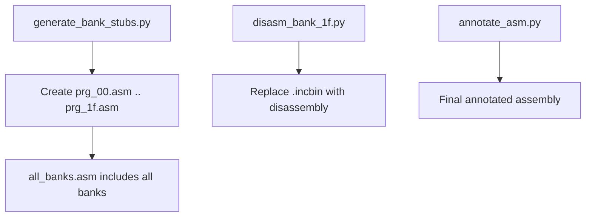
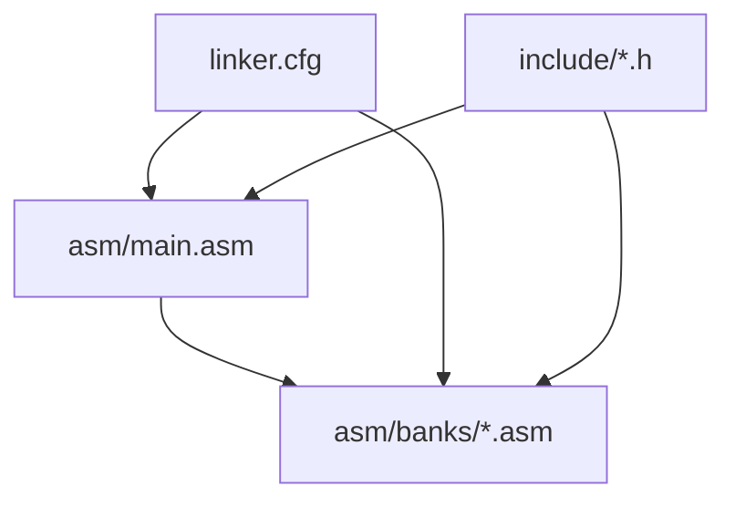

# Cross-Reference Management

<cite>
**Referenced Files in This Document**
- [PROJECT.md](file://PROJECT.md)
- [linker.cfg](file://linker.cfg)
- [asm/main.asm](file://asm/main.asm)
- [asm/banks/all_banks.asm](file://asm/banks/all_banks.asm)
- [asm/banks/prg_1f.asm](file://asm/banks/prg_1f.asm)
- [asm/banks/prg_00.asm](file://asm/banks/prg_00.asm)
- [include/namco163.h](file://include/namco163.h)
- [include/macros.h](file://include/macros.h)
- [tools/analyze_rom.py](file://tools/analyze_rom.py)
- [tools/disasm_6502.py](file://tools/disasm_6502.py)
- [tools/disasm_bank_1f.py](file://tools/disasm_bank_1f.py)
- [tools/annotate_asm.py](file://tools/annotate_asm.py)
- [tools/generate_bank_stubs.py](file://tools/generate_bank_stubs.py)
- [code/bank_1f_analysis.md](file://code/bank_1f_analysis.md)
- [code/bank_1f_function_table.md](file://code/bank_1f_function_table.md)
- [code/bank_1f_plan.md](file://code/bank_1f_plan.md)
</cite>

## Table of Contents
1. [Introduction](#introduction)
2. [Project Structure](#project-structure)
3. [Core Components](#core-components)
4. [Architecture Overview](#architecture-overview)
5. [Detailed Component Analysis](#detailed-component-analysis)
6. [Dependency Analysis](#dependency-analysis)
7. [Performance Considerations](#performance-considerations)
8. [Troubleshooting Guide](#troubleshooting-guide)
9. [Conclusion](#conclusion)
10. [Appendices](#appendices)

## Introduction
This document provides comprehensive guidance for cross-reference (xref) management across multiple ROM banks in the Sango2Dasm project. It explains how to identify and document relationships between subroutines, data structures, and interrupt handlers that span different banks, focusing on the Namco-163 mapper (Mapper 19) with 32 PRG banks of 8 KB each. It covers annotation techniques, tools for generating cross-reference maps, tracking subroutine calls across bank boundaries, and maintaining accurate reference documentation. Practical examples demonstrate annotating assembly code, handling indirect jumps and calls, and managing shared resources between banks. Strategies for resolving circular references, handling dynamic code generation, and keeping references accurate during incremental disassembly are included.

## Project Structure
The project organizes code by bank and provides tooling for ROM analysis, disassembly, and annotation. Key elements:
- Bank organization: Each PRG bank is represented by a separate .asm file under asm/banks/, with a generated stub for each of 32 banks.
- Entry points: The main entry point and interrupt vectors are defined in asm/main.asm, with the reset handler located in bank 0x1F.
- Tools: Python scripts support ROM analysis, 6502 disassembly, bank-specific disassembly, annotation, and bank stub generation.
- Documentation: Markdown files track analysis progress and function tables for bank 0x1F.

**Diagram sources**
- [PROJECT.md](file://PROJECT.md)
- [linker.cfg](file://linker.cfg)
- [asm/main.asm](file://asm/main.asm)
- [asm/banks/all_banks.asm](file://asm/banks/all_banks.asm)
- [tools/analyze_rom.py](file://tools/analyze_rom.py)
- [tools/disasm_6502.py](file://tools/disasm_6502.py)
- [tools/disasm_bank_1f.py](file://tools/disasm_bank_1f.py)
- [tools/annotate_asm.py](file://tools/annotate_asm.py)
- [tools/generate_bank_stubs.py](file://tools/generate_bank_stubs.py)
- [code/bank_1f_analysis.md](file://code/bank_1f_analysis.md)
- [code/bank_1f_function_table.md](file://code/bank_1f_function_table.md)
- [code/bank_1f_plan.md](file://code/bank_1f_plan.md)

**Section sources**
- [PROJECT.md](file://PROJECT.md)
- [linker.cfg](file://linker.cfg)
- [asm/main.asm](file://asm/main.asm)
- [asm/banks/all_banks.asm](file://asm/banks/all_banks.asm)

## Core Components
This section outlines the essential building blocks for cross-reference management in a multi-bank environment.

- Bank stubs and disassembly: Each bank is represented by a .asm file. Bank 0x1F contains the reset handler and dispatch logic, while others contain either stubbed binary data or disassembled code. Bank stubs are generated by tools and later replaced with annotated disassembly.
- Entry points and vectors: The reset handler and interrupt vectors are defined in asm/main.asm and bank 0x1F. The reset handler reads a vector table and performs an indirect jump to dispatch to state handlers.
- Bank switching: The Namco-163 mapper allows switching PRG banks at runtime via write-only registers. Macros and include files define register addresses and convenience macros for switching banks.
- Linker configuration: The linker.cfg defines memory regions and segments for PRG slots and code/data segments, enabling proper linking across banks.
- Tools for analysis and annotation: Python scripts analyze ROM structure, disassemble binaries, generate bank-specific disassembly, and annotate assembly with addresses and opcode bytes.

Practical implications for cross-reference management:
- Track indirect jumps and calls across bank boundaries using the vector table and bank switching routines.
- Maintain symbol tables and address hints to reconcile assembly with ROM bytes.
- Document shared RAM locations and hardware registers accessed by multiple banks.

**Section sources**
- [asm/banks/prg_1f.asm](file://asm/banks/prg_1f.asm)
- [asm/banks/prg_00.asm](file://asm/banks/prg_00.asm)
- [include/namco163.h](file://include/namco163.h)
- [include/macros.h](file://include/macros.h)
- [linker.cfg](file://linker.cfg)
- [tools/analyze_rom.py](file://tools/analyze_rom.py)
- [tools/disasm_6502.py](file://tools/disasm_6502.py)
- [tools/disasm_bank_1f.py](file://tools/disasm_bank_1f.py)
- [tools/annotate_asm.py](file://tools/annotate_asm.py)
- [tools/generate_bank_stubs.py](file://tools/generate_bank_stubs.py)

## Architecture Overview
The system architecture integrates ROM analysis, disassembly, annotation, and documentation to manage cross-references across banks.

**Diagram sources**
- [tools/analyze_rom.py](file://tools/analyze_rom.py)
- [tools/generate_bank_stubs.py](file://tools/generate_bank_stubs.py)
- [tools/disasm_bank_1f.py](file://tools/disasm_bank_1f.py)
- [tools/annotate_asm.py](file://tools/annotate_asm.py)
- [asm/main.asm](file://asm/main.asm)
- [asm/banks/all_banks.asm](file://asm/banks/all_banks.asm)

**Section sources**
- [PROJECT.md](file://PROJECT.md)
- [tools/analyze_rom.py](file://tools/analyze_rom.py)
- [tools/generate_bank_stubs.py](file://tools/generate_bank_stubs.py)
- [tools/disasm_bank_1f.py](file://tools/disasm_bank_1f.py)
- [tools/annotate_asm.py](file://tools/annotate_asm.py)
- [asm/main.asm](file://asm/main.asm)
- [asm/banks/all_banks.asm](file://asm/banks/all_banks.asm)

## Detailed Component Analysis

### Cross-Reference Tracking Fundamentals
Cross-reference management requires:
- Identifying all call sites and targets across banks.
- Recording indirect jumps and calls (e.g., vector table dispatch).
- Tracking bank switching and its effects on reachable code.
- Maintaining symbol tables and address hints for accurate annotation.

Recommended practices:
- Use consistent naming for functions and data structures across banks.
- Annotate all JSR/JMP instructions with ROM addresses and bytes.
- Document bank switching routines and their effects on program flow.
- Maintain a central reference log (e.g., markdown) for cross-references.

**Section sources**
- [tools/annotate_asm.py](file://tools/annotate_asm.py)
- [code/bank_1f_analysis.md](file://code/bank_1f_analysis.md)

### Vector Table Dispatch and Indirect Calls
The reset handler reads a vector table and performs an indirect jump to dispatch to state handlers. This creates primary cross-references between the vector table and each state handler.

Implications for cross-references:
- Document each vector entry and its target handler.
- Track the index calculation and masking behavior.
- Record indirect call sites and their targets.

**Diagram sources**
- [asm/banks/prg_1f.asm](file://asm/banks/prg_1f.asm)
- [code/bank_1f_analysis.md](file://code/bank_1f_analysis.md)

**Section sources**
- [asm/banks/prg_1f.asm](file://asm/banks/prg_1f.asm)
- [code/bank_1f_analysis.md](file://code/bank_1f_analysis.md)

### Bank Switching and Cross-Bank Calls
Bank switching enables accessing code/data in different banks. The project uses macros and register addresses to switch PRG banks at runtime.

Implications for cross-references:
- Document each bank switch routine and its configuration table.
- Track which banks are active at specific points in execution.
- Record banked function calls and their expected bank contexts.

**Diagram sources**
- [asm/banks/prg_1f.asm](file://asm/banks/prg_1f.asm)
- [include/namco163.h](file://include/namco163.h)
- [include/macros.h](file://include/macros.h)

**Section sources**
- [asm/banks/prg_1f.asm](file://asm/banks/prg_1f.asm)
- [include/namco163.h](file://include/namco163.h)
- [include/macros.h](file://include/macros.h)

### Annotation and Address Tracking
The annotate_asm.py tool reads ROM bytes and assembly, estimates instruction sizes, and annotates lines with ROM addresses and opcode bytes. It supports address hints to resynchronize when drift occurs.

Best practices:
- Use address hints to mark known ROM addresses in assembly comments.
- Keep symbol tables updated with new definitions.
- Verify assembly after annotation using ca65.

**Diagram sources**
- [tools/annotate_asm.py](file://tools/annotate_asm.py)

**Section sources**
- [tools/annotate_asm.py](file://tools/annotate_asm.py)

### Bank Stub Generation and Replacement
Bank stubs are generated for all 32 PRG banks. After disassembly, stubs are replaced with annotated assembly.

Implications:
- Maintain a consistent naming scheme for bank files.
- Update include files when adding new banks.
- Preserve segment directives and symbol definitions.

**Diagram sources**
- [tools/generate_bank_stubs.py](file://tools/generate_bank_stubs.py)
- [asm/banks/all_banks.asm](file://asm/banks/all_banks.asm)

**Section sources**
- [tools/generate_bank_stubs.py](file://tools/generate_bank_stubs.py)
- [asm/banks/all_banks.asm](file://asm/banks/all_banks.asm)

### Interrupt Handlers and Shared Resources
Interrupt handlers (NMI/IRQ) are located in bank 0x1F and share RAM and hardware registers with other banks. Cross-references include:
- Interrupt vector entries pointing to handlers.
- Shared RAM locations used by multiple routines.
- Hardware register accesses via macros.

Recommendations:
- Document interrupt vector entries and handler responsibilities.
- Track shared RAM usage and synchronization points.
- Record hardware register addresses and macro usage.

**Section sources**
- [asm/banks/prg_1f.asm](file://asm/banks/prg_1f.asm)
- [include/namco163.h](file://include/namco163.h)
- [include/macros.h](file://include/macros.h)

## Dependency Analysis
This section examines dependencies among components and how they influence cross-reference management.

Key observations:
- Bank stubs depend on linker segments defined in linker.cfg.
- Include files provide register addresses and macros used across banks.
- Main entry points depend on bank stubs for proper linking.

**Diagram sources**
- [linker.cfg](file://linker.cfg)
- [asm/main.asm](file://asm/main.asm)
- [asm/banks/all_banks.asm](file://asm/banks/all_banks.asm)
- [include/namco163.h](file://include/namco163.h)
- [include/macros.h](file://include/macros.h)

**Section sources**
- [linker.cfg](file://linker.cfg)
- [asm/main.asm](file://asm/main.asm)
- [asm/banks/all_banks.asm](file://asm/banks/all_banks.asm)
- [include/namco163.h](file://include/namco163.h)
- [include/macros.h](file://include/macros.h)

## Performance Considerations
- Minimize redundant analysis: Use ROM analysis to prioritize high-value banks (e.g., those with high JSR/RTI counts).
- Efficient annotation: Estimate instruction sizes heuristically and verify with ROM bytes to reduce false positives.
- Incremental updates: Replace stubs with annotated disassembly incrementally to avoid rebuilding the entire project.
- Symbol resolution: Maintain a robust symbol table to speed up operand resolution and cross-reference identification.

## Troubleshooting Guide
Common issues and resolutions:
- Drift in instruction alignment: Use address hints in assembly comments to resynchronize the annotation process.
- Incorrect instruction sizing: Review operand parsing and symbol resolution; adjust heuristics as needed.
- Bank switching confusion: Document each bank switch routine and its configuration table; verify register writes and RAM copies.
- Interrupt vector mismatches: Confirm vector table entries and handler addresses; ensure correct segment assignments.

Validation steps:
- Run ca65 verification after annotation to catch assembly errors.
- Cross-check vector table entries against ROM bytes.
- Validate bank switching configurations by tracing register writes.

**Section sources**
- [tools/annotate_asm.py](file://tools/annotate_asm.py)
- [code/bank_1f_analysis.md](file://code/bank_1f_analysis.md)

## Conclusion
Cross-reference management across multiple ROM banks requires a structured approach combining ROM analysis, precise annotation, and careful documentation. By leveraging tools like analyze_rom.py, disasm_bank_1f.py, annotate_asm.py, and generate_bank_stubs.py, and by maintaining consistent naming, symbol tables, and address hints, teams can accurately track relationships between subroutines, data structures, and interrupt handlers across bank boundaries. Regular verification and incremental updates ensure reference accuracy as new code is added to the disassembly.

## Appendices

### Practical Examples

- Annotating assembly with cross-references:
  - Use address hints to mark known ROM addresses in comments.
  - Annotate JSR/JMP instructions with ROM addresses and bytes.
  - Maintain symbol definitions for shared RAM and hardware registers.

- Handling indirect jumps and calls:
  - Document vector table entries and their targets.
  - Track bank switching routines and their effects on reachable code.
  - Record banked function calls and expected bank contexts.

- Managing shared resources:
  - Document shared RAM locations and their usage across banks.
  - Record hardware register addresses and macro usage.
  - Synchronize access to shared resources using documented protocols.

**Section sources**
- [tools/annotate_asm.py](file://tools/annotate_asm.py)
- [asm/banks/prg_1f.asm](file://asm/banks/prg_1f.asm)
- [include/namco163.h](file://include/namco163.h)
- [include/macros.h](file://include/macros.h)
- [code/bank_1f_analysis.md](file://code/bank_1f_analysis.md)