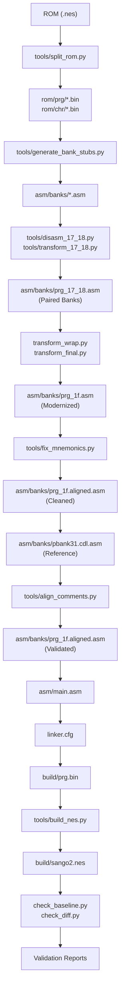
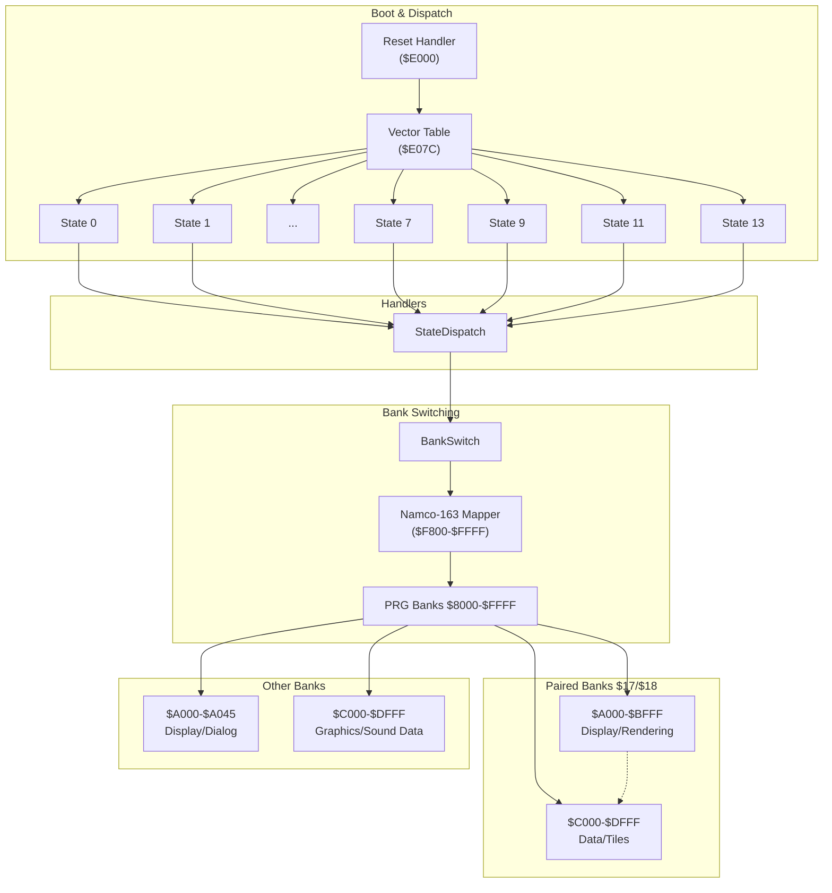
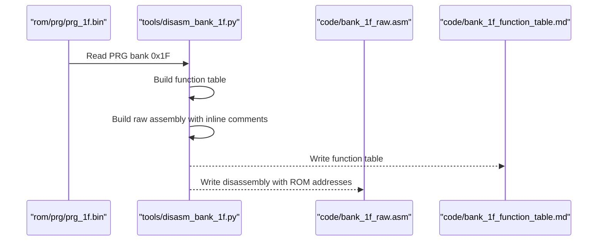
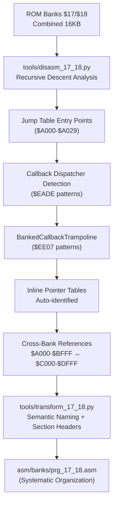
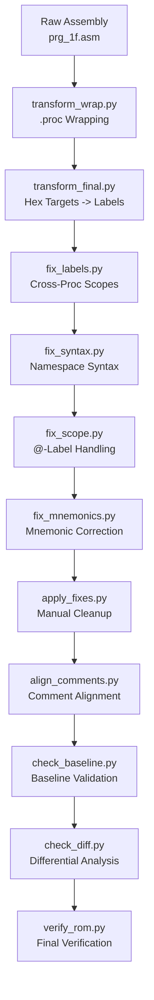
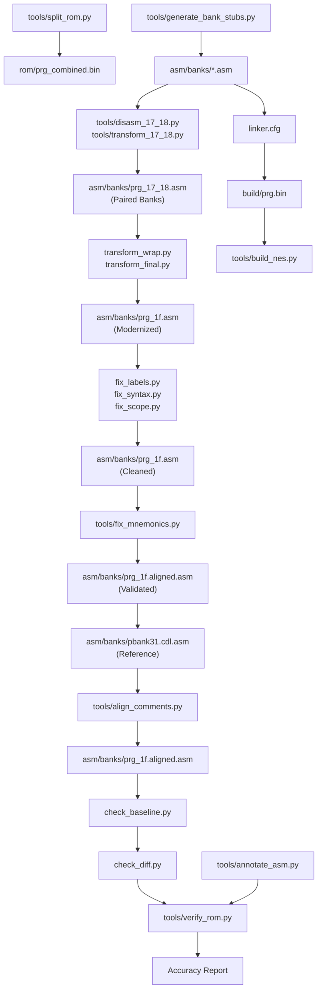

# Disassembly Workflow

<cite>
**Referenced Files in This Document**
- [PROJECT.md](file://PROJECT.md)
- [Makefile](file://Makefile)
- [linker.cfg](file://linker.cfg)
- [test_17_18.cfg](file://test_17_18.cfg)
- [test_linker.cfg](file://test_linker.cfg)
- [tools/disasm_6502.py](file://tools/disasm_6502.py)
- [tools/disasm_bank_1f.py](file://tools/disasm_bank_1f.py)
- [tools/disasm_17_18.py](file://tools/disasm_17_18.py)
- [tools/generate_bank_stubs.py](file://tools/generate_bank_stubs.py)
- [tools/analyze_rom.py](file://tools/analyze_rom.py)
- [tools/analyze_bank_1f.py](file://tools/analyze_bank_1f.py)
- [tools/analyze_17_18.py](file://tools/analyze_17_18.py)
- [tools/annotate_asm.py](file://tools/annotate_asm.py)
- [tools/split_rom.py](file://tools/split_rom.py)
- [tools/verify_rom.py](file://tools/verify_rom.py)
- [tools/build_nes.py](file://tools/build_nes.py)
- [tools/align_comments.py](file://tools/align_comments.py)
- [tools/fix_mnemonics.py](file://tools/fix_mnemonics.py)
- [tools/transform_17_18.py](file://tools/transform_17_18.py)
- [asm/main.asm](file://asm/main.asm)
- [asm/banks/prg_1f.asm](file://asm/banks/prg_1f.asm)
- [asm/banks/prg_17_18.asm](file://asm/banks/prg_17_18.asm)
- [asm/banks/prg_1f_annotated.asm](file://asm/banks/prg_1f_annotated.asm)
- [asm/banks/pbank31.cdl.asm](file://asm/banks/pbank31.cdl.asm)
- [asm/test_1f.asm](file://asm/test_1f.asm)
- [include/namco163.h](file://include/namco163.h)
- [include/macros.h](file://include/macros.h)
- [code/bank_1f_plan.md](file://code/bank_1f_plan.md)
- [code/key_functions_analysis.md](file://code/key_functions_analysis.md)
- [code/bank_1f_analysis.md](file://code/bank_1f_analysis.md)
- [transform_wrap.py](file://transform_wrap.py)
- [transform_final.py](file://transform_final.py)
- [fix_labels.py](file://fix_labels.py)
- [fix_syntax.py](file://fix_syntax.py)
- [fix_scope.py](file://fix_scope.py)
- [fix_forward.py](file://fix_forward.py)
- [fix_gaps.py](file://fix_gaps.py)
- [check_baseline.py](file://check_baseline.py)
- [apply_fixes.py](file://apply_fixes.py)
- [check_diff.py](file://check_diff.py)
</cite>

## Update Summary
**Changes Made**
- Enhanced PRG bank 17/18 disassembly process with new transformation pipeline tools
- Added systematic section headers and semantic naming conventions for improved code organization
- Integrated comprehensive automated tooling for paired bank disassembly and validation
- Updated workflow to include 11-stage transformation pipeline for Bank $1F assembly modernization
- Added enhanced disassembly tools with improved output formats and inline machine code documentation
- Integrated new verification utilities for baseline validation and differential analysis

## Table of Contents
1. [Introduction](#introduction)
2. [Project Structure](#project-structure)
3. [Core Components](#core-components)
4. [Architecture Overview](#architecture-overview)
5. [Detailed Component Analysis](#detailed-component-analysis)
6. [Dependency Analysis](#dependency-analysis)
7. [Performance Considerations](#performance-considerations)
8. [Troubleshooting Guide](#troubleshooting-guide)
9. [Conclusion](#conclusion)
10. [Appendices](#appendices)

## Introduction
This document describes a systematic disassembly workflow for the Namco-163 (Mapper 19) ROM of Sangokushi 2 - Haou no Tairiku (J). It focuses on extracting and documenting game code from the PRG banks, starting with Bank 0x1F that contains the reset handler and vector dispatch table. The guide covers bank prioritization, stub replacement, modular organization, cross-references, label management, incremental development, and verification.

**Updated** Enhanced with comprehensive transformation pipeline featuring automated assembly code cleaning, modernization, and validation steps using the new pbank31.cdl.asm reference format. The pipeline now includes an 11-stage process for Bank $1F assembly code modernization with systematic code organization, mnemonic correction, and validation utilities.

## Project Structure
The repository organizes assets around a cc65 toolchain and a modular bank structure with advanced transformation capabilities:
- ROM splitting and analysis tools
- Bank stub generation and per-bank assembly
- Comprehensive transformation pipeline for code modernization
- Reference CDL format for automated validation
- Linker configuration for 4 PRG slots
- Include files for hardware and macros
- Planning and analysis documents for Bank 0x1F
- Automated comment alignment for consistent formatting
- Enhanced verification utilities for baseline validation and differential analysis
- **New** Paired bank disassembly tools for PRG banks $17/$18 with systematic section headers and semantic naming



**Diagram sources**
- [tools/split_rom.py:38-122](file://tools/split_rom.py#L38-L122)
- [tools/generate_bank_stubs.py:12-52](file://tools/generate_bank_stubs.py#L12-L52)
- [tools/disasm_17_18.py:567-710](file://tools/disasm_17_18.py#L567-L710)
- [tools/transform_17_18.py:171-348](file://tools/transform_17_18.py#L171-L348)
- [transform_wrap.py:1-303](file://transform_wrap.py#L1-L303)
- [transform_final.py:1-235](file://transform_final.py#L1-L235)
- [tools/fix_mnemonics.py:1-312](file://tools/fix_mnemonics.py#L1-L312)
- [tools/align_comments.py:1-48](file://tools/align_comments.py#L1-L48)
- [Makefile:38-48](file://Makefile#L38-L48)
- [linker.cfg:18-54](file://linker.cfg#L18-L54)
- [tools/build_nes.py:10-57](file://tools/build_nes.py#L10-L57)
- [check_baseline.py:1-104](file://check_baseline.py#L1-L104)
- [check_diff.py:1-35](file://check_diff.py#L1-L35)

**Section sources**
- [PROJECT.md:14-47](file://PROJECT.md#L14-L47)
- [Makefile:1-102](file://Makefile#L1-102)
- [linker.cfg:1-55](file://linker.cfg#L1-L55)

## Core Components
- ROM splitting and analysis: Separate PRG/CHR banks and detect code patterns and vectors.
- Bank stub generation: Create per-bank assembly files with .incbin placeholders.
- **New** Paired bank disassembly: Systematic disassembly of PRG banks $17/$18 with recursive descent analysis and cross-bank reference handling.
- **New** Semantic naming transformation: Automated renaming of labels to B17_18_ prefixed semantic names with systematic section headers.
- Transformation pipeline: Comprehensive code modernization including .proc wrapping, branch conversion, and validation.
- Reference format validation: Use pbank31.cdl.asm for automated mnemonic correction and opcode validation.
- Disassemblers: Quick listing disassembler and comprehensive Bank 0x1F disassembler with enhanced inline comments.
- **New** Advanced disassemblers: Recursive descent disassembler for paired banks with callback dispatcher detection and inline table analysis.
- Linker configuration: Define 4 PRG slots and segments for banked code.
- Annotation and verification: Annotate assembly with ROM addresses and verify byte-for-byte accuracy.
- Comment alignment: Automatically align inline comments for consistent formatting.
- Build pipeline: Assemble, link, package into an iNES ROM.
- **New** Baseline validation: Systematic verification of address alignment and continuity using check_baseline.py.
- **New** Differential analysis: Byte-by-byte comparison for transformation pipeline effectiveness using check_diff.py.
- **New** 11-stage transformation pipeline: Complete modernization workflow for Bank $1F assembly code.

**Updated** Enhanced transformation pipeline now includes automated assembly code cleaning, modernization, and validation using the pbank31.cdl.asm reference format for comprehensive error detection and correction. The pipeline now consists of 11 systematic stages for complete code modernization.

**Section sources**
- [tools/split_rom.py:38-122](file://tools/split_rom.py#L38-L122)
- [tools/generate_bank_stubs.py:12-52](file://tools/generate_bank_stubs.py#L12-L52)
- [tools/disasm_17_18.py:123-710](file://tools/disasm_17_18.py#L123-L710)
- [tools/transform_17_18.py:171-348](file://tools/transform_17_18.py#L171-L348)
- [transform_wrap.py:1-303](file://transform_wrap.py#L1-L303)
- [transform_final.py:1-235](file://transform_final.py#L1-L235)
- [tools/fix_mnemonics.py:1-312](file://tools/fix_mnemonics.py#L1-L312)
- [tools/disasm_6502.py:336-362](file://tools/disasm_6502.py#L336-L362)
- [tools/disasm_bank_1f.py:545-561](file://tools/disasm_bank_1f.py#L545-L561)
- [tools/align_comments.py:1-48](file://tools/align_comments.py#L1-L48)
- [linker.cfg:18-54](file://linker.cfg#L18-L54)
- [tools/annotate_asm.py:315-481](file://tools/annotate_asm.py#L315-L481)
- [tools/verify_rom.py:10-72](file://tools/verify_rom.py#L10-L72)
- [tools/build_nes.py:10-57](file://tools/build_nes.py#L10-L57)
- [check_baseline.py:1-104](file://check_baseline.py#L1-L104)
- [check_diff.py:1-35](file://check_diff.py#L1-L35)

## Architecture Overview
The disassembly architecture centers on Bank 0x1F as the boot bank. At startup, the reset handler initializes PPU/APU, clears RAM, and dispatches to a state handler via an indirect vector table. Bank 0x1F also contains NMI/IRQ handlers, sound engine, PPU utilities, math routines, and data access functions. Other banks are accessed via bank switching controlled by the Namco-163 mapper.

**Updated** Enhanced with paired bank architecture for PRG banks $17/$18, which work together as a 16KB unit ($A000-$DFFF) with shared cross-bank references and coordinated loading via SwitchBankAC_A/B macros.



**Diagram sources**
- [PROJECT.md:101-117](file://PROJECT.md#L101-L117)
- [asm/banks/prg_1f.asm:74-148](file://asm/banks/prg_1f.asm#L74-L148)
- [asm/banks/prg_1f.asm:153-169](file://asm/banks/prg_1f.asm#L153-L169)
- [asm/banks/prg_1f.asm:740-749](file://asm/banks/prg_1f.asm#L740-L749)
- [include/namco163.h:10-14](file://include/namco163.h#L10-L14)

**Section sources**
- [PROJECT.md:101-117](file://PROJECT.md#L101-L117)
- [asm/banks/prg_1f.asm:74-148](file://asm/banks/prg_1f.asm#L74-L148)
- [asm/banks/prg_1f.asm:153-169](file://asm/banks/prg_1f.asm#L153-L169)
- [asm/banks/prg_1f.asm:740-749](file://asm/banks/prg_1f.asm#L740-L749)
- [include/namco163.h:10-14](file://include/namco163.h#L10-L14)

## Detailed Component Analysis

### Step 1: Prepare ROM and Bank Stubs
- Split the original ROM into PRG/CHR banks and generate a combined PRG binary for analysis.
- Generate per-bank stub files that include .incbin directives for the original binary data.

Practical steps:
- Split ROM: make split
- Generate bank stubs: make banks

What you get:
- rom/prg/prg_00.bin through rom/prg/prg_1f.bin
- asm/banks/prg_00.asm through asm/banks/prg_1f.asm with .incbin placeholders
- rom_info.h with mapper and bank counts

**Section sources**
- [tools/split_rom.py:38-122](file://tools/split_rom.py#L38-L122)
- [tools/generate_bank_stubs.py:12-52](file://tools/generate_bank_stubs.py#L12-L52)
- [Makefile:51-75](file://Makefile#L51-L75)

### Step 2: Analyze ROM Structure and Prioritize Banks
- Run ROM analysis to identify code-heavy banks and potential interrupt vectors.
- Prioritize Bank 0x1F (reset handler and dispatch) first, followed by banks with high JSR/RTI counts and heavy I/O.

Typical output highlights:
- Bank 0x1F: high JSR count, reset marker, likely main dispatch
- Banks 0x14–0x16: heavy code
- Banks 0x10, 0x1E: IRQ/data heavy
- Empty bank 0x07 (all 0xFF)

**Section sources**
- [tools/analyze_rom.py:10-135](file://tools/analyze_rom.py#L10-L135)
- [PROJECT.md:120-133](file://PROJECT.md#L120-L133)

### Step 3: Disassemble Bank 0x1F (Reset Handler and Dispatch)
- Use the comprehensive Bank 0x1F disassembler to produce a ca65-compatible .asm file with labeled functions and tables.
- Alternatively, use the quick listing disassembler to explore specific ranges (e.g., $E000–$E100 for reset handler).

**Updated** Enhanced disassembly now includes detailed inline comments showing ROM addresses and raw machine code bytes for each instruction, improving traceability and debugging.

Workflow:
- Generate function table and raw disassembly for Bank 0x1F
- Review the vector table and state handlers
- Identify bank switching routines and helper functions



**Diagram sources**
- [tools/disasm_bank_1f.py:545-561](file://tools/disasm_bank_1f.py#L545-L561)

**Section sources**
- [tools/disasm_bank_1f.py:136-324](file://tools/disasm_bank_1f.py#L136-L324)
- [tools/disasm_bank_1f.py:545-561](file://tools/disasm_bank_1f.py#L545-L561)
- [tools/disasm_6502.py:336-362](file://tools/disasm_6502.py#L336-L362)

### Step 4: Disassemble Paired Banks $17/$18 (New Pipeline)
- Use the advanced recursive descent disassembler to analyze PRG banks $17 and $18 as a paired 16KB unit.
- The disassembler traces code from jump table entries, callback dispatcher patterns, and banked callback trampolines.
- Identifies inline pointer tables and cross-bank references automatically.

**New** Enhanced paired bank disassembly with systematic approach:

**Stage 1: tools/disasm_17_18.py** - Recursive descent analysis with callback dispatcher detection
**Stage 2: tools/analyze_17_18.py** - Function boundary analysis and cross-reference mapping  
**Stage 3: tools/transform_17_18.py** - Semantic naming transformation with systematic section headers



**Diagram sources**
- [tools/disasm_17_18.py:123-710](file://tools/disasm_17_18.py#L123-L710)
- [tools/analyze_17_18.py:8-118](file://tools/analyze_17_18.py#L8-L118)
- [tools/transform_17_18.py:171-348](file://tools/transform_17_18.py#L171-L348)

**Section sources**
- [tools/disasm_17_18.py:123-710](file://tools/disasm_17_18.py#L123-L710)
- [tools/analyze_17_18.py:8-118](file://tools/analyze_17_18.py#L8-L118)
- [tools/transform_17_18.py:171-348](file://tools/transform_17_18.py#L171-L348)

### Step 5: Transform Assembly Code (New Pipeline)
- Apply comprehensive .proc wrapping to organize code into logical functions
- Convert branch targets from hex addresses to meaningful labels
- Insert gap bytes between functions with proper labeling
- Modernize code structure and improve readability

**Updated** Enhanced 11-stage transformation pipeline for complete Bank $1F assembly code modernization:

**Stage 1: transform_wrap.py** - Wraps functions in .proc blocks, converts sub-labels to @labels
**Stage 2: transform_final.py** - Fixes remaining hex targets, inserts gap bytes, balances .proc/.endproc  
**Stage 3: fix_labels.py** - Resolves cross-proc label scope issues
**Stage 4: fix_syntax.py** - Converts :: syntax to proper namespace syntax
**Stage 5: fix_scope.py** - Handles cross-proc scoping for @-labels
**Stage 6: tools/fix_mnemonics.py** - Parses CDL reference and fixes mnemonic-opcode mismatches
**Stage 7: apply_fixes.py** - Applies all manual fixes and cleanup operations
**Stage 8: tools/align_comments.py** - Aligns inline comments to column 48 for consistent formatting
**Stage 9: check_baseline.py** - Removes gap byte insertions and verifies baseline alignment
**Stage 10: check_diff.py** - Compares ROM and assembled output byte-by-byte for validation
**Stage 11: tools/verify_rom.py** - Performs final byte-for-byte comparison with original ROM



**Diagram sources**
- [transform_wrap.py:1-303](file://transform_wrap.py#L1-L303)
- [transform_final.py:1-235](file://transform_final.py#L1-L235)
- [fix_labels.py:1-68](file://fix_labels.py#L1-L68)
- [fix_syntax.py:1-72](file://fix_syntax.py#L1-L72)
- [fix_scope.py:1-149](file://fix_scope.py#L1-L149)
- [tools/fix_mnemonics.py:1-312](file://tools/fix_mnemonics.py#L1-L312)
- [apply_fixes.py:1-115](file://apply_fixes.py#L1-L115)
- [tools/align_comments.py:1-48](file://tools/align_comments.py#L1-L48)
- [check_baseline.py:1-104](file://check_baseline.py#L1-L104)
- [check_diff.py:1-35](file://check_diff.py#L1-L35)
- [tools/verify_rom.py:10-72](file://tools/verify_rom.py#L10-L72)

**Section sources**
- [transform_wrap.py:1-303](file://transform_wrap.py#L1-L303)
- [transform_final.py:1-235](file://transform_final.py#L1-L235)
- [fix_labels.py:1-68](file://fix_labels.py#L1-L68)
- [fix_syntax.py:1-72](file://fix_syntax.py#L1-L72)
- [fix_scope.py:1-149](file://fix_scope.py#L1-L149)
- [tools/fix_mnemonics.py:1-312](file://tools/fix_mnemonics.py#L1-L312)
- [apply_fixes.py:1-115](file://apply_fixes.py#L1-L115)
- [tools/align_comments.py:1-48](file://tools/align_comments.py#L1-L48)
- [check_baseline.py:1-104](file://check_baseline.py#L1-L104)
- [check_diff.py:1-35](file://check_diff.py#L1-L35)

### Step 6: Validate Against Reference Format
- Use pbank31.cdl.asm as authoritative reference for correct mnemonics and opcodes
- Apply automated mnemonic correction to fix mismatches
- Validate instruction boundaries and operand correctness
- Ensure all hex branch targets are properly converted to labels

Validation workflow:
- tools/fix_mnemonics.py: Parses CDL reference and fixes mnemonic-opcode mismatches
- Compares aligned assembly against reference format
- Adds opcode bytes to comments for traceability
- Maintains consistent formatting across corrections

**New Section** Added to implement automated validation against reference CDL format.

**Section sources**
- [tools/fix_mnemonics.py:1-312](file://tools/fix_mnemonics.py#L1-L312)
- [asm/banks/pbank31.cdl.asm:1-800](file://asm/banks/pbank31.cdl.asm#L1-L800)

### Step 7: Apply Manual Fixes and Final Touches
- Apply comprehensive manual fixes to prg_1f.asm after transformation
- Add global aliases for cross-bank function targets
- Insert missing labels and clean up orphaned directives
- Finalize code structure and prepare for assembly

Finalization steps:
- apply_fixes.py: Applies all manual fixes and cleanup operations
- Adds global aliases before .segment directive
- Inserts dispatch_loop and other missing labels
- Cleans up orphan .endproc and spurious .byte directives
- Replaces physical labels with semantic references

**New Section** Added to implement final manual cleanup and validation.

**Section sources**
- [apply_fixes.py:1-115](file://apply_fixes.py#L1-L115)

### Step 8: Replace Stubs with Real Disassembly
- Edit asm/banks/prg_XX.asm to replace .incbin with actual disassembled code.
- Use proper .segment directives for each bank as you add code.
- Keep the bank's logical address in mind (e.g., Bank 0x1F maps to $E000–$FFFF).

Guidance:
- Start with Bank 0x1F and progressively move to other banks based on dispatch targets and analysis results.
- Update linker.cfg to add new MEMORY regions and SEGMENTS for each bank as you disassemble.

**Section sources**
- [PROJECT.md:134-151](file://PROJECT.md#L134-L151)
- [linker.cfg:18-54](file://linker.cfg#L18-L54)

### Step 9: Organize Code Within Modular Bank Structure
- Use .segment directives to group code by bank and purpose.
- Maintain consistent label naming and scope within .proc blocks.
- Reference include files for hardware registers and macros.

Examples:
- Bank 0x1F segment: .segment "CODE_BANK1F"
- **New** Paired bank segments: .segment "CODE_BANK17", .segment "CODE_BANK18"
- Include files: 6502_registers.h, namco163.h, macros.h

**Section sources**
- [asm/banks/prg_1f.asm:13-11](file://asm/banks/prg_1f.asm#L13-L11)
- [asm/banks/prg_17_18.asm:72](file://asm/banks/prg_17_18.asm#L72)
- [include/namco163.h:1-87](file://include/namco163.h#L1-L87)
- [include/macros.h:1-72](file://include/macros.h#L1-L72)

### Step 10: Cross-Reference Handling and Label Management
- Track cross-bank calls and data references.
- Use banked call patterns (e.g., JSR to $A000–$A045) and bank switching macros.
- Maintain a plan document to track which regions are analyzed and planned.

**Updated** Enhanced cross-reference handling for paired banks $17/$18 with automatic detection of cross-bank references and semantic naming.

Cross-references in Bank 0x1F:
- Calls to bank-switched display routines at $A000–$A045
- Bank switching macros from namco163.h

Cross-references in paired banks $17/$18:
- Automatic detection of cross-bank label references
- Semantic naming convention: B17_18_ prefix for all functions
- Systematic section headers for organized code structure

**Section sources**
- [code/bank_1f_plan.md:224-245](file://code/bank_1f_plan.md#L224-L245)
- [include/namco163.h:68-86](file://include/namco163.h#L68-L86)
- [tools/disasm_17_18.py:387-405](file://tools/disasm_17_18.py#L387-L405)

### Step 11: Incremental Development and Progress Tracking
- Assemble and link after adding each bank's code.
- Use make verify to compare the rebuilt ROM with the original byte-by-byte.
- Iterate: disassemble → annotate → assemble → verify → refine.

**Updated** Enhanced verification now includes detailed inline machine code documentation to aid in debugging and cross-referencing.

Verification:
- Byte-for-byte comparison with original ROM
- Accuracy percentage and first mismatch reporting

**Section sources**
- [Makefile:58-61](file://Makefile#L58-L61)
- [tools/verify_rom.py:10-72](file://tools/verify_rom.py#L10-L72)

### Step 12: Interpreting Disassembly Output and Annotation
- Use the annotation tool to overlay ROM addresses and opcode bytes onto assembly.
- The tool resolves symbols from include files and estimates instruction sizes to align comments with actual ROM bytes.
- Use address hints (comments like "; $XXXX:") to resync and correct drift.

**Updated** Enhanced disassembly output now includes automatic comment alignment to ensure consistent formatting of inline machine code documentation.

Annotation workflow:
- Build symbol table from includes and assembly
- Estimate instruction sizes from operand text
- Compare mnemonic and size against ROM bytes
- Output annotated assembly with address and bytes

**Section sources**
- [tools/annotate_asm.py:315-481](file://tools/annotate_asm.py#L315-L481)

### Step 13: Handling Complex Code Patterns and Data Discovery
- Recognize common 6502 patterns: shift-and-subtract division, table-driven RNG, pointer tables, multiply-by-constants via ASL/ADC chains.
- Identify data tables and string tables used by display and menu systems.
- Use analysis tools to locate vectors, bank switches, and repeated utility patterns.

**Updated** Enhanced analysis documentation now includes detailed examples with inline machine code comments showing ROM addresses and raw bytes for better understanding of code patterns.

**Updated** Enhanced paired bank analysis with systematic function boundary detection and cross-reference mapping.

Examples:
- RNG core at $E87A reads from a precomputed table
- Address calculation patterns for heroes, cities, kingdoms, kata names
- pointer table for kingdom addresses
- **New** Callback dispatcher patterns at $EADE with inline pointer tables
- **New** Banked callback trampoline patterns at $EE07 with 2-byte targets

**Section sources**
- [tools/analyze_bank_1f.py:1-157](file://tools/analyze_bank_1f.py#L1-L157)
- [tools/analyze_17_18.py:74-115](file://tools/analyze_17_18.py#L74-L115)
- [code/key_functions_analysis.md:9-31](file://code/key_functions_analysis.md#L9-L31)
- [code/key_functions_analysis.md:66-100](file://code/key_functions_analysis.md#L66-L100)
- [code/key_functions_analysis.md:159-189](file://code/key_functions_analysis.md#L159-L189)

### Step 14: Bank Prioritization Strategy
Prioritize by:
- Execution flow importance (reset handler and dispatch)
- Frequency of calls (high JSR/RTI banks)
- I/O and subsystems (PPU, sound, controller)
- Complexity and impact (NMI/IRQ handlers)
- **New** Paired bank coordination (banks $17/$18 work together)

**Updated** Analysis plan now includes detailed documentation with enhanced inline comments and machine code examples for better understanding of each bank's role and dependencies.

Plan document outlines sessions and dependencies for Bank 0x1F.

**Section sources**
- [PROJECT.md:120-133](file://PROJECT.md#L120-L133)
- [code/bank_1f_plan.md:213-223](file://code/bank_1f_plan.md#L213-L223)

### Step 15: Enhanced Comment Alignment and Formatting
- Use the align_comments.py tool to automatically align inline comments to column 48.
- Ensures consistent formatting across the entire disassembly output.
- Improves readability and makes it easier to correlate assembly with ROM addresses.

**New Section** Added to improve code readability and maintainability.

Comment alignment workflow:
- Read prg_1f.asm file
- Calculate current column position of inline comments
- Adjust spacing to align comments to column 48
- Write prg_1f.aligned.asm with consistent formatting

**Section sources**
- [tools/align_comments.py:1-48](file://tools/align_comments.py#L1-L48)

### Step 16: Baseline Verification and Validation
- Use check_baseline.py to remove gap byte insertions and verify baseline alignment
- Parse addresses and check for gaps/overlaps in cleaned source
- Ensure proper address continuity and instruction/data byte alignment
- Validate total instruction/data bytes match expected ROM size

**New Section** Added to implement systematic baseline verification.

Baseline verification workflow:
- Remove all gap byte insertions from previous sessions
- Verify address alignment in cleaned source
- Check for gaps and overlaps between instructions
- Validate total byte count matches expected ROM size

**Section sources**
- [check_baseline.py:1-104](file://check_baseline.py#L1-L104)

### Step 17: Differential Analysis and Comparison
- Use check_diff.py to compare ROM and assembled output byte-by-byte
- Identify first differences and analyze mismatch patterns
- Check assembly output characteristics and address alignment
- Validate transformation pipeline effectiveness

**New Section** Added to implement differential analysis for validation.

Differential analysis workflow:
- Compare ROM and assembled output byte-by-byte
- Identify first differences and analyze patterns
- Check assembly output characteristics and alignment
- Validate transformation pipeline effectiveness

**Section sources**
- [check_diff.py:1-35](file://check_diff.py#L1-L35)

### Step 18: Paired Bank Coordination and Loading (New)
- Banks $17 and $18 work together as a 16KB unit ($A000-$DFFF)
- Loaded simultaneously via SwitchBankAC_A/B macros with Y=$37
- Share cross-bank references and coordinated functionality
- Use test_17_18.cfg for standalone linking and testing

**New Section** Added to handle the unique architecture of paired PRG banks.

Paired bank coordination:
- Shared memory space: $A000-$DFFF (16KB)
- Cross-bank function calls and data references
- Coordinated loading via SwitchBankAC macros
- Systematic semantic naming for clarity

**Section sources**
- [tools/disasm_17_18.py:632-679](file://tools/disasm_17_18.py#L632-L679)
- [test_17_18.cfg:1-9](file://test_17_18.cfg#L1-9)

## Dependency Analysis
The disassembly pipeline depends on:
- ROM splitting and combined PRG for analysis
- Bank stubs for modular assembly
- **New** Paired bank disassembly tools for systematic analysis of banks $17/$18
- Transformation pipeline for code modernization
- Reference CDL format for validation
- Linker configuration for PRG slots
- Include files for hardware and macros
- Annotation and verification tools for accuracy
- Comment alignment tool for consistent formatting
- **New** Baseline validation tools for systematic verification
- **New** Differential analysis tools for transformation pipeline validation



**Diagram sources**
- [tools/split_rom.py:112-122](file://tools/split_rom.py#L112-L122)
- [tools/generate_bank_stubs.py:36-46](file://tools/generate_bank_stubs.py#L36-L46)
- [tools/disasm_17_18.py:567-710](file://tools/disasm_17_18.py#L567-L710)
- [tools/transform_17_18.py:320-348](file://tools/transform_17_18.py#L320-L348)
- [transform_wrap.py:286-303](file://transform_wrap.py#L286-L303)
- [transform_final.py:222-235](file://transform_final.py#L222-L235)
- [fix_labels.py:13-68](file://fix_labels.py#L13-L68)
- [fix_syntax.py:11-72](file://fix_syntax.py#L11-L72)
- [fix_scope.py:13-149](file://fix_scope.py#L13-L149)
- [tools/fix_mnemonics.py:284-312](file://tools/fix_mnemonics.py#L284-L312)
- [tools/align_comments.py:44-48](file://tools/align_comments.py#L44-L48)
- [linker.cfg:18-54](file://linker.cfg#L18-L54)
- [tools/build_nes.py:10-57](file://tools/build_nes.py#L10-L57)
- [tools/annotate_asm.py:315-481](file://tools/annotate_asm.py#L315-L481)
- [tools/verify_rom.py:10-72](file://tools/verify_rom.py#L10-L72)
- [check_baseline.py:1-104](file://check_baseline.py#L1-L104)
- [check_diff.py:1-35](file://check_diff.py#L1-L35)

**Section sources**
- [Makefile:38-61](file://Makefile#L38-L61)
- [linker.cfg:18-54](file://linker.cfg#L18-L54)

## Performance Considerations
- Keep disassembly sessions focused on contiguous regions to minimize re-linking.
- Prefer incremental assembly and targeted verification to catch errors early.
- Use the annotation tool to quickly validate instruction boundaries and operand sizes.
- **Updated** Leverage enhanced inline comments for faster debugging and cross-referencing.
- **Updated** Utilize transformation pipeline for systematic code modernization and validation.
- **Updated** The 11-stage transformation pipeline provides systematic validation at each stage, reducing cumulative errors and improving overall code quality.
- **New** Paired bank disassembly benefits from recursive descent analysis that efficiently traces code paths and identifies cross-references automatically.

## Troubleshooting Guide
Common issues and remedies:
- Mismatched instruction sizes: Use the annotation tool to align assembly with ROM bytes.
- Missing or incorrect opcodes: Ensure the disassembler includes all opcodes and modes.
- Symbol resolution failures: Verify include paths and symbol definitions.
- Bank switching confusion: Confirm mapper register addresses and bank indices from namco163.h.
- Linker errors: Add new MEMORY regions and SEGMENTS for each disassembled bank in linker.cfg.
- **Updated** Comment formatting issues: Use align_comments.py to fix inconsistent inline comment alignment.
- **Updated** Mnemonic mismatches: Use tools/fix_mnemonics.py to correct against pbank31.cdl.asm reference.
- **Updated** Scope issues: Use fix_scope.py and fix_labels.py to resolve cross-proc label problems.
- **Updated** Hex target issues: Use transform_final.py to convert remaining hex branch targets to labels.
- **New** Paired bank analysis failures: Use tools/analyze_17_18.py to verify function boundaries and cross-references.
- **New** Semantic naming conflicts: Use tools/transform_17_18.py with --dry-run to preview label renames.
- **New** Baseline validation failures: Use check_baseline.py to identify and fix address alignment issues.
- **New** Differential analysis errors: Use check_diff.py to pinpoint transformation pipeline problems.
- **New** Pipeline stage failures: Each of the 11 transformation stages provides specific error points for targeted debugging.

**Section sources**
- [tools/annotate_asm.py:315-481](file://tools/annotate_asm.py#L315-L481)
- [tools/disasm_6502.py:11-237](file://tools/disasm_6502.py#L11-L237)
- [include/namco163.h:10-86](file://include/namco163.h#L10-L86)
- [linker.cfg:18-54](file://linker.cfg#L18-L54)
- [tools/align_comments.py:1-48](file://tools/align_comments.py#L1-L48)
- [tools/fix_mnemonics.py:148-282](file://tools/fix_mnemonics.py#L148-L282)
- [fix_scope.py:13-149](file://fix_scope.py#L13-L149)
- [fix_labels.py:13-68](file://fix_labels.py#L13-L68)
- [transform_final.py:57-235](file://transform_final.py#L57-L235)
- [tools/analyze_17_18.py:116-118](file://tools/analyze_17_18.py#L116-L118)
- [tools/transform_17_18.py:320-348](file://tools/transform_17_18.py#L320-L348)
- [check_baseline.py:1-104](file://check_baseline.py#L1-L104)
- [check_diff.py:1-35](file://check_diff.py#L1-L35)

## Conclusion
This workflow establishes a repeatable, incremental approach to disassembling Sangokushi 2's PRG banks with comprehensive transformation capabilities. Starting with Bank 0x1F ensures you understand the reset handler and dispatch mechanism, after which you can systematically replace stubs with real disassembly, manage cross-references, and verify accuracy through byte-exact comparisons. The modular bank structure, transformation pipeline, and reference format validation support continuous refinement and expansion while ensuring code quality and consistency.

**Updated** Enhanced transformation pipeline with automated assembly code cleaning, modernization, and validation using the pbank31.cdl.asm reference format significantly improves code quality, traceability, and maintainability for this complex 6502 project. The new 11-stage pipeline provides systematic validation and error detection at each phase, ensuring reliable and accurate disassembly results. The addition of paired bank disassembly tools for PRG banks $17/$18 further enhances the workflow with systematic section headers, semantic naming conventions, and automated cross-reference handling.

## Appendices

### Practical Examples
- Disassemble Bank 0x1F reset handler:
  - make disasm FILE=rom/prg/prg_1f.bin ADDR=E000 LEN=1024
- Generate bank stubs:
  - make banks
- Analyze ROM structure:
  - make analyze
- Verify ROM:
  - make verify
- **Updated** Disassemble paired banks $17/$18:
  - python3 tools/disasm_17_18.py
  - python3 tools/analyze_17_18.py
  - python3 tools/transform_17_18.py
- **Updated** Apply transformation pipeline:
  - python3 transform_wrap.py
  - python3 transform_final.py
  - python3 fix_labels.py
  - python3 fix_syntax.py
  - python3 fix_scope.py
  - python3 tools/fix_mnemonics.py
  - python3 apply_fixes.py
  - python3 tools/align_comments.py
  - python3 check_baseline.py
  - python3 check_diff.py
  - python3 tools/verify_rom.py
- **Updated** Align comments for consistent formatting:
  - python3 tools/align_comments.py

**Section sources**
- [Makefile:64-69](file://Makefile#L64-L69)
- [PROJECT.md:136-150](file://PROJECT.md#L136-L150)
- [tools/align_comments.py:1-48](file://tools/align_comments.py#L1-L48)
- [tools/disasm_17_18.py:567-710](file://tools/disasm_17_18.py#L567-L710)
- [tools/analyze_17_18.py:8-118](file://tools/analyze_17_18.py#L8-L118)
- [tools/transform_17_18.py:171-348](file://tools/transform_17_18.py#L171-L348)
- [transform_wrap.py:134-303](file://transform_wrap.py#L134-L303)
- [transform_final.py:8-235](file://transform_final.py#L8-L235)
- [fix_labels.py:1-68](file://fix_labels.py#L1-L68)
- [fix_syntax.py:1-72](file://fix_syntax.py#L1-L72)
- [fix_scope.py:1-149](file://fix_scope.py#L1-L149)
- [tools/fix_mnemonics.py:148-312](file://tools/fix_mnemonics.py#L148-L312)
- [apply_fixes.py:1-115](file://apply_fixes.py#L1-L115)
- [tools/align_comments.py:1-48](file://tools/align_comments.py#L1-L48)
- [check_baseline.py:1-104](file://check_baseline.py#L1-L104)
- [check_diff.py:1-35](file://check_diff.py#L1-L35)
- [tools/verify_rom.py:10-72](file://tools/verify_rom.py#L10-L72)

### Enhanced Disassembly Features
**New Section** Highlighting the improvements to PRG bank 1F and paired bank disassembly processes.

Key enhancements:
- **Comprehensive Transformation Pipeline**: End-to-end automation for code modernization and validation across 11 systematic stages
- **Reference Format Validation**: Automated correction against pbank31.cdl.asm for accuracy
- **.proc Wrapping**: Logical function organization with proper scope management
- **Label Conversion**: Hex branch targets to meaningful semantic labels
- **Gap Byte Management**: Proper insertion and labeling of inter-function gaps
- **Cross-Proc Scope Resolution**: Automated handling of @-labels and namespace syntax
- **Mnemonic Correction**: Automated fixing of instruction opcodes and addressing modes
- **Baseline Verification**: Systematic validation of address alignment and continuity
- **Differential Analysis**: Byte-by-byte comparison for transformation pipeline effectiveness
- **Enhanced Inline Comments**: Detailed ROM address and machine code documentation for improved traceability
- **Automated Quality Assurance**: Multi-stage validation pipeline ensuring code quality at each transformation stage
- **Paired Bank Analysis**: Recursive descent disassembly with cross-bank reference detection
- **Semantic Naming**: B17_18_ prefixed labels for systematic code organization
- **Systematic Section Headers**: Organized code structure with clear functional boundaries

Example of enhanced paired bank output format:
```asm
;===============================================================================
; $A000: B17_18_JumpTable
; Jump Table - Public entry points ($A000-$A029)
;===============================================================================
B17_18_Entry00:
  JMP B17_18_PpuWriteRle                                           ; $A000: 4C 87 A0
B17_18_Entry01:
  JMP B17_18_PpuCopyRaw                                           ; $A003: 4C 12 A2
```

**Section sources**
- [tools/disasm_bank_1f.py:329-442](file://tools/disasm_bank_1f.py#L329-L442)
- [tools/disasm_17_18.py:322-405](file://tools/disasm_17_18.py#L322-L405)
- [tools/align_comments.py:1-48](file://tools/align_comments.py#L1-L48)
- [code/bank_1f_analysis.md:1-800](file://code/bank_1f_analysis.md#L1-L800)
- [tools/transform_17_18.py:206-223](file://tools/transform_17_18.py#L206-L223)
- [transform_wrap.py:11-100](file://transform_wrap.py#L11-L100)
- [transform_final.py:25-164](file://transform_final.py#L25-L164)
- [tools/fix_mnemonics.py:65-146](file://tools/fix_mnemonics.py#L65-L146)
- [check_baseline.py:15-104](file://check_baseline.py#L15-L104)
- [check_diff.py:1-35](file://check_diff.py#L1-L35)