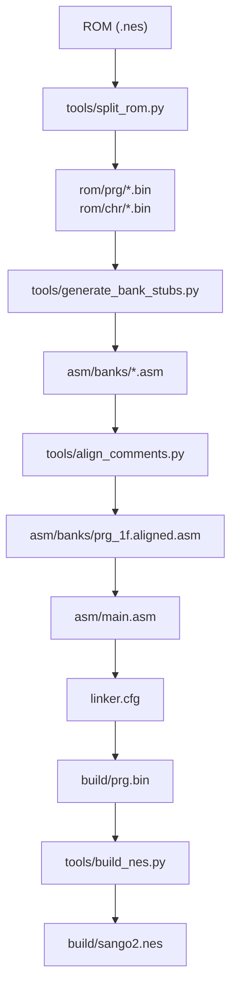
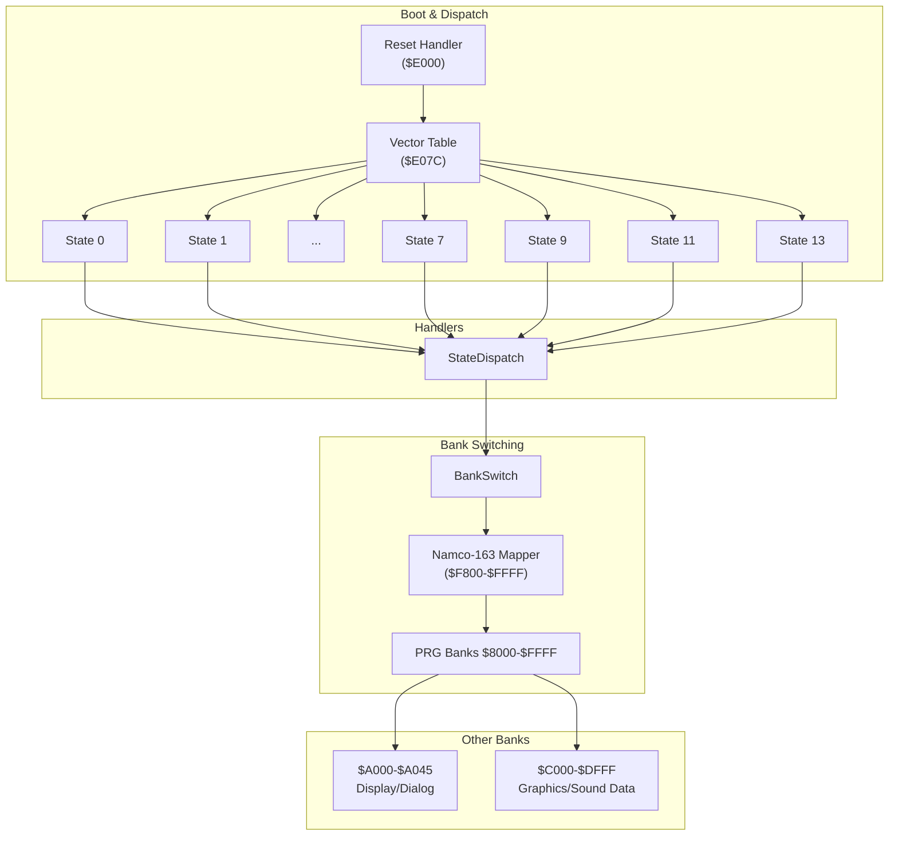
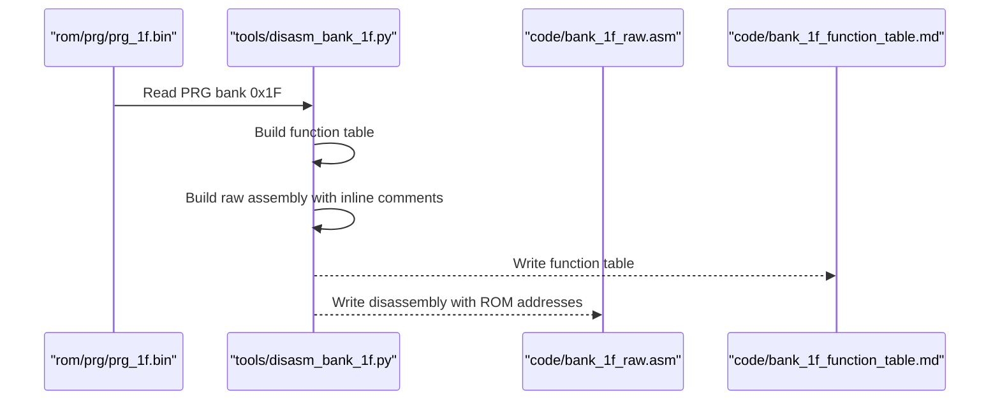
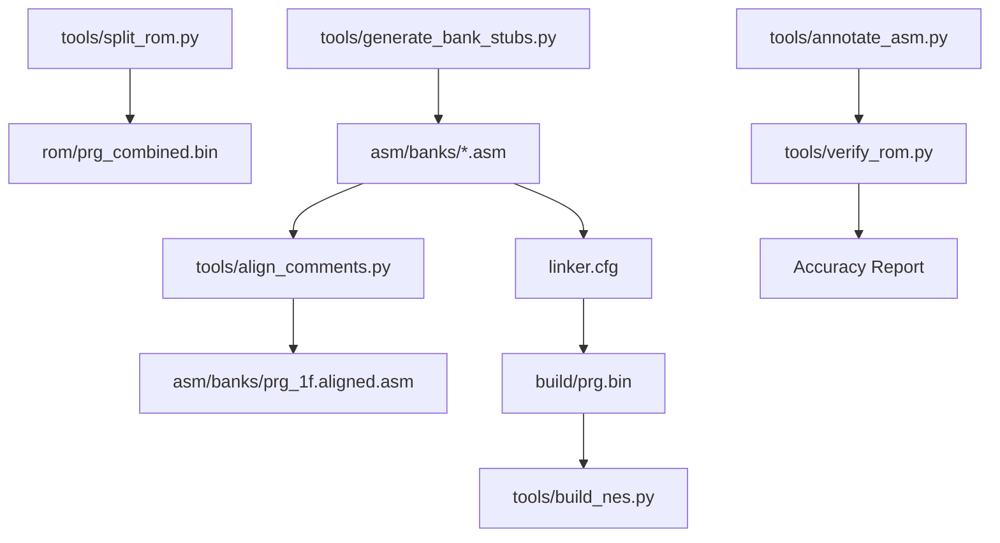

# Disassembly Workflow

<cite>
**Referenced Files in This Document**
- [PROJECT.md](file://PROJECT.md)
- [Makefile](file://Makefile)
- [linker.cfg](file://linker.cfg)
- [tools/disasm_6502.py](file://tools/disasm_6502.py)
- [tools/disasm_bank_1f.py](file://tools/disasm_bank_1f.py)
- [tools/generate_bank_stubs.py](file://tools/generate_bank_stubs.py)
- [tools/analyze_rom.py](file://tools/analyze_rom.py)
- [tools/analyze_bank_1f.py](file://tools/analyze_bank_1f.py)
- [tools/annotate_asm.py](file://tools/annotate_asm.py)
- [tools/split_rom.py](file://tools/split_rom.py)
- [tools/verify_rom.py](file://tools/verify_rom.py)
- [tools/build_nes.py](file://tools/build_nes.py)
- [tools/align_comments.py](file://tools/align_comments.py)
- [asm/main.asm](file://asm/main.asm)
- [asm/banks/prg_1f.asm](file://asm/banks/prg_1f.asm)
- [asm/banks/prg_1f_annotated.asm](file://asm/banks/prg_1f_annotated.asm)
- [include/namco163.h](file://include/namco163.h)
- [include/macros.h](file://include/macros.h)
- [code/bank_1f_plan.md](file://code/bank_1f_plan.md)
- [code/key_functions_analysis.md](file://code/key_functions_analysis.md)
- [code/bank_1f_analysis.md](file://code/bank_1f_analysis.md)
</cite>

## Update Summary
**Changes Made**
- Enhanced PRG bank 1F disassembly output with improved binary code comments and inline machine code documentation
- Added automated comment alignment tool for consistent formatting
- Expanded analysis documentation with detailed examples and explanations
- Improved cross-referencing and label management documentation

## Table of Contents
1. [Introduction](#introduction)
2. [Project Structure](#project-structure)
3. [Core Components](#core-components)
4. [Architecture Overview](#architecture-overview)
5. [Detailed Component Analysis](#detailed-component-analysis)
6. [Dependency Analysis](#dependency-analysis)
7. [Performance Considerations](#performance-considerations)
8. [Troubleshooting Guide](#troubleshooting-guide)
9. [Conclusion](#conclusion)
10. [Appendices](#appendices)

## Introduction
This document describes a systematic disassembly workflow for the Namco-163 (Mapper 19) ROM of Sangokushi 2 - Haou no Tairiku (J). It focuses on extracting and documenting game code from the PRG banks, starting with Bank 0x1F that contains the reset handler and vector dispatch table. The guide covers bank prioritization, stub replacement, modular organization, cross-references, label management, incremental development, and verification.

**Updated** Enhanced with improved binary code comments and inline machine code documentation for better traceability and debugging capabilities.

## Project Structure
The repository organizes assets around a cc65 toolchain and a modular bank structure:
- ROM splitting and analysis tools
- Bank stub generation and per-bank assembly
- Linker configuration for 4 PRG slots
- Include files for hardware and macros
- Planning and analysis documents for Bank 0x1F
- Automated comment alignment for consistent formatting



**Diagram sources**
- [tools/split_rom.py:38-122](file://tools/split_rom.py#L38-L122)
- [tools/generate_bank_stubs.py:12-52](file://tools/generate_bank_stubs.py#L12-L52)
- [tools/align_comments.py:1-48](file://tools/align_comments.py#L1-L48)
- [Makefile:38-48](file://Makefile#L38-L48)
- [linker.cfg:18-54](file://linker.cfg#L18-L54)
- [tools/build_nes.py:10-57](file://tools/build_nes.py#L10-L57)

**Section sources**
- [PROJECT.md:14-47](file://PROJECT.md#L14-L47)
- [Makefile:1-102](file://Makefile#L1-102)
- [linker.cfg:1-55](file://linker.cfg#L1-L55)

## Core Components
- ROM splitting and analysis: Separate PRG/CHR banks and detect code patterns and vectors.
- Bank stub generation: Create per-bank assembly files with .incbin placeholders.
- Disassemblers: Quick listing disassembler and comprehensive Bank 0x1F disassembler with enhanced inline comments.
- Linker configuration: Define 4 PRG slots and segments for banked code.
- Annotation and verification: Annotate assembly with ROM addresses and verify byte-for-byte accuracy.
- Comment alignment: Automatically align inline comments for consistent formatting.
- Build pipeline: Assemble, link, package into an iNES ROM.

**Updated** Enhanced disassembler now provides detailed inline machine code documentation with ROM addresses and raw bytes for each instruction.

**Section sources**
- [tools/split_rom.py:38-122](file://tools/split_rom.py#L38-L122)
- [tools/generate_bank_stubs.py:12-52](file://tools/generate_bank_stubs.py#L12-L52)
- [tools/disasm_6502.py:336-362](file://tools/disasm_6502.py#L336-L362)
- [tools/disasm_bank_1f.py:545-561](file://tools/disasm_bank_1f.py#L545-L561)
- [tools/align_comments.py:1-48](file://tools/align_comments.py#L1-L48)
- [linker.cfg:18-54](file://linker.cfg#L18-L54)
- [tools/annotate_asm.py:315-481](file://tools/annotate_asm.py#L315-L481)
- [tools/verify_rom.py:10-72](file://tools/verify_rom.py#L10-L72)
- [tools/build_nes.py:10-57](file://tools/build_nes.py#L10-L57)

## Architecture Overview
The disassembly architecture centers on Bank 0x1F as the boot bank. At startup, the reset handler initializes PPU/APU, clears RAM, and dispatches to a state handler via an indirect vector table. Bank 0x1F also contains NMI/IRQ handlers, sound engine, PPU utilities, math routines, and data access functions. Other banks are accessed via bank switching controlled by the Namco-163 mapper.



**Diagram sources**
- [PROJECT.md:101-117](file://PROJECT.md#L101-L117)
- [asm/banks/prg_1f.asm:74-148](file://asm/banks/prg_1f.asm#L74-L148)
- [asm/banks/prg_1f.asm:153-169](file://asm/banks/prg_1f.asm#L153-L169)
- [asm/banks/prg_1f.asm:740-749](file://asm/banks/prg_1f.asm#L740-L749)
- [include/namco163.h:10-14](file://include/namco163.h#L10-L14)

**Section sources**
- [PROJECT.md:101-117](file://PROJECT.md#L101-L117)
- [asm/banks/prg_1f.asm:74-148](file://asm/banks/prg_1f.asm#L74-L148)
- [asm/banks/prg_1f.asm:153-169](file://asm/banks/prg_1f.asm#L153-L169)
- [asm/banks/prg_1f.asm:740-749](file://asm/banks/prg_1f.asm#L740-L749)
- [include/namco163.h:10-14](file://include/namco163.h#L10-L14)

## Detailed Component Analysis

### Step 1: Prepare ROM and Bank Stubs
- Split the original ROM into PRG/CHR banks and generate a combined PRG binary for analysis.
- Generate per-bank stub files that include .incbin directives for the original binary data.

Practical steps:
- Split ROM: make split
- Generate bank stubs: make banks

What you get:
- rom/prg/prg_00.bin through rom/prg/prg_1f.bin
- asm/banks/prg_00.asm through asm/banks/prg_1f.asm with .incbin placeholders
- rom_info.h with mapper and bank counts

**Section sources**
- [tools/split_rom.py:38-122](file://tools/split_rom.py#L38-L122)
- [tools/generate_bank_stubs.py:12-52](file://tools/generate_bank_stubs.py#L12-L52)
- [Makefile:51-75](file://Makefile#L51-L75)

### Step 2: Analyze ROM Structure and Prioritize Banks
- Run ROM analysis to identify code-heavy banks and potential interrupt vectors.
- Prioritize Bank 0x1F (reset handler and dispatch) first, followed by banks with high JSR/RTI counts and heavy I/O.

Typical output highlights:
- Bank 0x1F: high JSR count, reset marker, likely main dispatch
- Banks 0x14–0x16: heavy code
- Banks 0x10, 0x1E: IRQ/data heavy
- Empty bank 0x07 (all 0xFF)

**Section sources**
- [tools/analyze_rom.py:10-135](file://tools/analyze_rom.py#L10-L135)
- [PROJECT.md:120-133](file://PROJECT.md#L120-L133)

### Step 3: Disassemble Bank 0x1F (Reset Handler and Dispatch)
- Use the comprehensive Bank 0x1F disassembler to produce a ca65-compatible .asm file with labeled functions and tables.
- Alternatively, use the quick listing disassembler to explore specific ranges (e.g., $E000–$E100 for reset handler).

**Updated** Enhanced disassembly now includes detailed inline comments showing ROM addresses and raw machine code bytes for each instruction, improving traceability and debugging.

Workflow:
- Generate function table and raw disassembly for Bank 0x1F
- Review the vector table and state handlers
- Identify bank switching routines and helper functions



**Diagram sources**
- [tools/disasm_bank_1f.py:545-561](file://tools/disasm_bank_1f.py#L545-L561)

**Section sources**
- [tools/disasm_bank_1f.py:136-324](file://tools/disasm_bank_1f.py#L136-L324)
- [tools/disasm_bank_1f.py:545-561](file://tools/disasm_bank_1f.py#L545-L561)
- [tools/disasm_6502.py:336-362](file://tools/disasm_6502.py#L336-L362)

### Step 4: Replace Stubs with Real Disassembly
- Edit asm/banks/prg_XX.asm to replace .incbin with actual disassembled code.
- Use proper .segment directives for each bank as you add code.
- Keep the bank's logical address in mind (e.g., Bank 0x1F maps to $E000–$FFFF).

Guidance:
- Start with Bank 0x1F and progressively move to other banks based on dispatch targets and analysis results.
- Update linker.cfg to add new MEMORY regions and SEGMENTS for each bank as you disassemble.

**Section sources**
- [PROJECT.md:134-151](file://PROJECT.md#L134-L151)
- [linker.cfg:18-54](file://linker.cfg#L18-L54)

### Step 5: Organize Code Within Modular Bank Structure
- Use .segment directives to group code by bank and purpose.
- Maintain consistent label naming and scope within .proc blocks.
- Reference include files for hardware registers and macros.

Examples:
- Bank 0x1F segment: .segment "CODE_BANK1F"
- Include files: 6502_registers.h, namco163.h, macros.h

**Section sources**
- [asm/banks/prg_1f.asm:13-11](file://asm/banks/prg_1f.asm#L13-L11)
- [include/namco163.h:1-87](file://include/namco163.h#L1-L87)
- [include/macros.h:1-72](file://include/macros.h#L1-L72)

### Step 6: Cross-Reference Handling and Label Management
- Track cross-bank calls and data references.
- Use banked call patterns (e.g., JSR to $A000–$A045) and bank switching macros.
- Maintain a plan document to track which regions are analyzed and planned.

Cross-references in Bank 0x1F:
- Calls to bank-switched display routines at $A000–$A045
- Bank switching macros from namco163.h

**Section sources**
- [code/bank_1f_plan.md:224-245](file://code/bank_1f_plan.md#L224-L245)
- [include/namco163.h:68-86](file://include/namco163.h#L68-L86)

### Step 7: Incremental Development and Progress Tracking
- Assemble and link after adding each bank's code.
- Use make verify to compare the rebuilt ROM with the original byte-by-byte.
- Iterate: disassemble → annotate → assemble → verify → refine.

**Updated** Enhanced verification now includes detailed inline machine code documentation to aid in debugging and cross-referencing.

Verification:
- Byte-for-byte comparison with original ROM
- Accuracy percentage and first mismatch reporting

**Section sources**
- [Makefile:58-61](file://Makefile#L58-L61)
- [tools/verify_rom.py:10-72](file://tools/verify_rom.py#L10-L72)

### Step 8: Interpreting Disassembly Output and Annotation
- Use the annotation tool to overlay ROM addresses and opcode bytes onto assembly.
- The tool resolves symbols from include files and estimates instruction sizes to align comments with actual ROM bytes.
- Use address hints (comments like "; $XXXX:") to resync and correct drift.

**Updated** Enhanced disassembly output now includes automatic comment alignment to ensure consistent formatting of inline machine code documentation.

Annotation workflow:
- Build symbol table from includes and assembly
- Estimate instruction sizes from operand text
- Compare mnemonic and size against ROM bytes
- Output annotated assembly with address and bytes

**Section sources**
- [tools/annotate_asm.py:315-481](file://tools/annotate_asm.py#L315-L481)

### Step 9: Handling Complex Code Patterns and Data Discovery
- Recognize common 6502 patterns: shift-and-subtract division, table-driven RNG, pointer tables, multiply-by-constants via ASL/ADC chains.
- Identify data tables and string tables used by display and menu systems.
- Use analysis tools to locate vectors, bank switches, and repeated utility patterns.

**Updated** Enhanced analysis documentation now includes detailed examples with inline machine code comments showing ROM addresses and raw bytes for better understanding of code patterns.

Examples:
- RNG core at $E87A reads from a precomputed table
- Address calculation patterns for heroes, cities, kingdoms, kata names
- Pointer table for kingdom addresses

**Section sources**
- [tools/analyze_bank_1f.py:1-157](file://tools/analyze_bank_1f.py#L1-L157)
- [code/key_functions_analysis.md:9-31](file://code/key_functions_analysis.md#L9-L31)
- [code/key_functions_analysis.md:66-100](file://code/key_functions_analysis.md#L66-L100)
- [code/key_functions_analysis.md:159-189](file://code/key_functions_analysis.md#L159-L189)

### Step 10: Bank Prioritization Strategy
Prioritize by:
- Execution flow importance (reset handler and dispatch)
- Frequency of calls (high JSR/RTI banks)
- I/O and subsystems (PPU, sound, controller)
- Complexity and impact (NMI/IRQ handlers)

**Updated** Analysis plan now includes detailed documentation with enhanced inline comments and machine code examples for better understanding of each bank's role and dependencies.

Plan document outlines sessions and dependencies for Bank 0x1F.

**Section sources**
- [PROJECT.md:120-133](file://PROJECT.md#L120-L133)
- [code/bank_1f_plan.md:213-223](file://code/bank_1f_plan.md#L213-L223)

### Step 11: Enhanced Comment Alignment and Formatting
- Use the align_comments.py tool to automatically align inline comments to column 48.
- Ensures consistent formatting across the entire disassembly output.
- Improves readability and makes it easier to correlate assembly with ROM addresses.

**New Section** Added to improve code readability and maintainability.

Comment alignment workflow:
- Read prg_1f.asm file
- Calculate current column position of inline comments
- Adjust spacing to align comments to column 48
- Write prg_1f.aligned.asm with consistent formatting

**Section sources**
- [tools/align_comments.py:1-48](file://tools/align_comments.py#L1-L48)

## Dependency Analysis
The disassembly pipeline depends on:
- ROM splitting and combined PRG for analysis
- Bank stubs for modular assembly
- Linker configuration for PRG slots
- Include files for hardware and macros
- Annotation and verification tools for accuracy
- Comment alignment tool for consistent formatting



**Diagram sources**
- [tools/split_rom.py:112-122](file://tools/split_rom.py#L112-L122)
- [tools/generate_bank_stubs.py:36-46](file://tools/generate_bank_stubs.py#L36-L46)
- [tools/align_comments.py:44-48](file://tools/align_comments.py#L44-L48)
- [linker.cfg:18-54](file://linker.cfg#L18-L54)
- [tools/build_nes.py:10-57](file://tools/build_nes.py#L10-L57)
- [tools/annotate_asm.py:315-481](file://tools/annotate_asm.py#L315-L481)
- [tools/verify_rom.py:10-72](file://tools/verify_rom.py#L10-L72)

**Section sources**
- [Makefile:38-61](file://Makefile#L38-L61)
- [linker.cfg:18-54](file://linker.cfg#L18-L54)

## Performance Considerations
- Keep disassembly sessions focused on contiguous regions to minimize re-linking.
- Prefer incremental assembly and targeted verification to catch errors early.
- Use the annotation tool to quickly validate instruction boundaries and operand sizes.
- **Updated** Leverage enhanced inline comments for faster debugging and cross-referencing.

## Troubleshooting Guide
Common issues and remedies:
- Mismatched instruction sizes: Use the annotation tool to align assembly with ROM bytes.
- Missing or incorrect opcodes: Ensure the disassembler includes all opcodes and modes.
- Symbol resolution failures: Verify include paths and symbol definitions.
- Bank switching confusion: Confirm mapper register addresses and bank indices from namco163.h.
- Linker errors: Add new MEMORY regions and SEGMENTS for each disassembled bank in linker.cfg.
- **Updated** Comment formatting issues: Use align_comments.py to fix inconsistent inline comment alignment.

**Section sources**
- [tools/annotate_asm.py:315-481](file://tools/annotate_asm.py#L315-L481)
- [tools/disasm_6502.py:11-237](file://tools/disasm_6502.py#L11-L237)
- [include/namco163.h:10-86](file://include/namco163.h#L10-L86)
- [linker.cfg:18-54](file://linker.cfg#L18-L54)
- [tools/align_comments.py:1-48](file://tools/align_comments.py#L1-L48)

## Conclusion
This workflow establishes a repeatable, incremental approach to disassembling Sangokushi 2's PRG banks. Starting with Bank 0x1F ensures you understand the reset handler and dispatch mechanism, after which you can systematically replace stubs with real disassembly, manage cross-references, and verify accuracy through byte-exact comparisons. The modular bank structure and toolchain support continuous refinement and expansion.

**Updated** Enhanced disassembly output with improved binary code comments and inline machine code documentation significantly improves traceability, debugging capabilities, and overall code quality for this complex 6502 project.

## Appendices

### Practical Examples
- Disassemble Bank 0x1F reset handler:
  - make disasm FILE=rom/prg/prg_1f.bin ADDR=E000 LEN=1024
- Generate bank stubs:
  - make banks
- Analyze ROM structure:
  - make analyze
- Verify ROM:
  - make verify
- **Updated** Align comments for consistent formatting:
  - python3 tools/align_comments.py

**Section sources**
- [Makefile:64-69](file://Makefile#L64-L69)
- [PROJECT.md:136-150](file://PROJECT.md#L136-L150)
- [tools/align_comments.py:1-48](file://tools/align_comments.py#L1-L48)

### Enhanced Disassembly Features
**New Section** Highlighting the improvements to PRG bank 1F disassembly output.

Key enhancements:
- **Inline Machine Code Comments**: Each instruction now includes detailed comments showing ROM address and raw bytes
- **Consistent Formatting**: Automatic comment alignment to column 48 for improved readability
- **Enhanced Traceability**: Easy correlation between assembly and original ROM bytes
- **Debugging Support**: Better tooling for identifying instruction boundaries and operand sizes

Example of enhanced output format:
```asm
$E000: SEI              ; $E000: 78  Disable interrupts
$E001: CLD              ; $E001: D8  Clear decimal mode
$E002-$E018: PPU warmup ; $E002: A9 00 ... Wait for 3 VBlanks ($2002 polling)
```

**Section sources**
- [tools/disasm_bank_1f.py:329-442](file://tools/disasm_bank_1f.py#L329-L442)
- [tools/align_comments.py:1-48](file://tools/align_comments.py#L1-L48)
- [code/bank_1f_analysis.md:1-800](file://code/bank_1f_analysis.md#L1-L800)