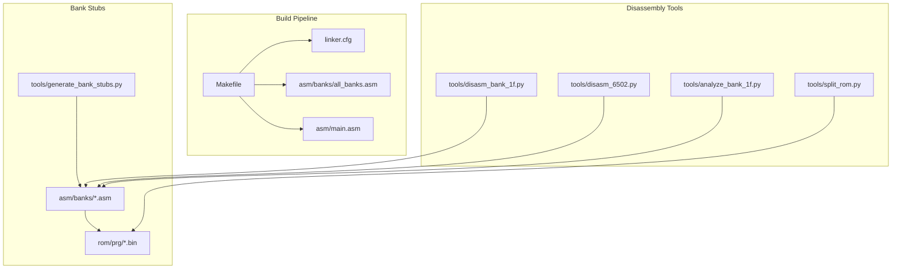
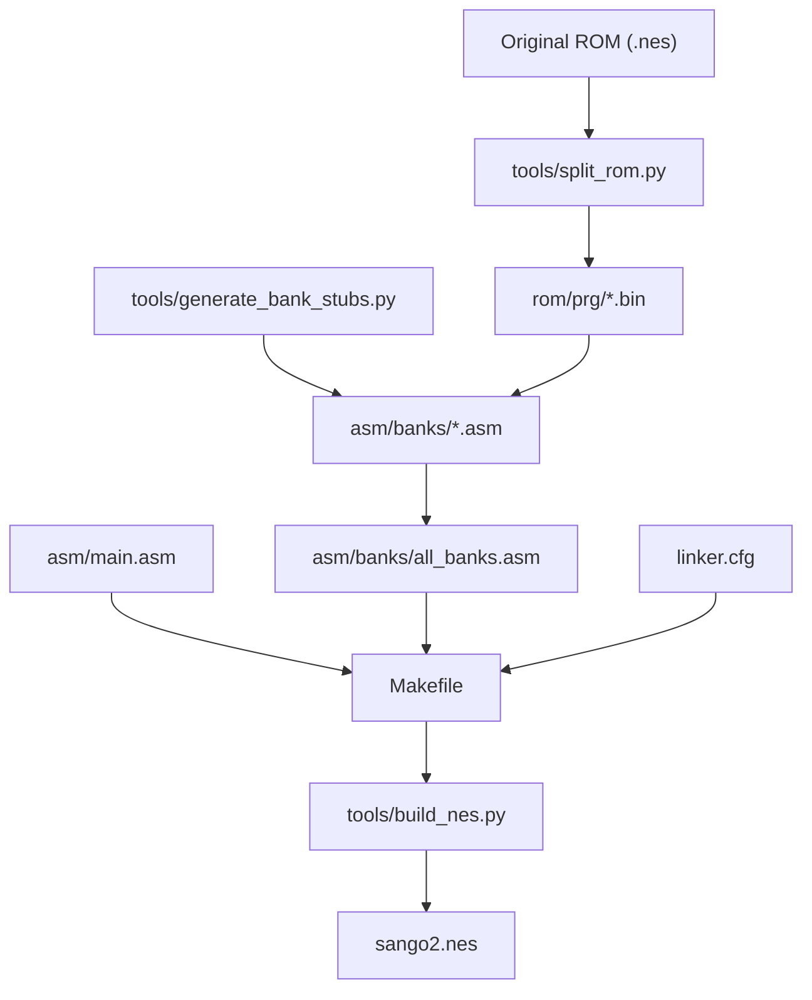
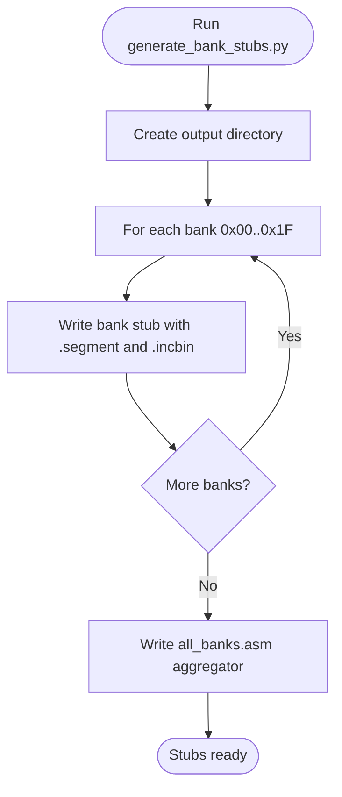
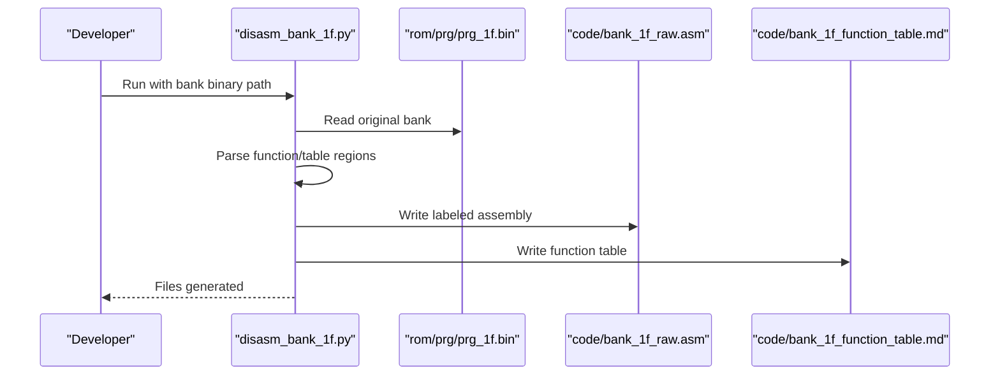
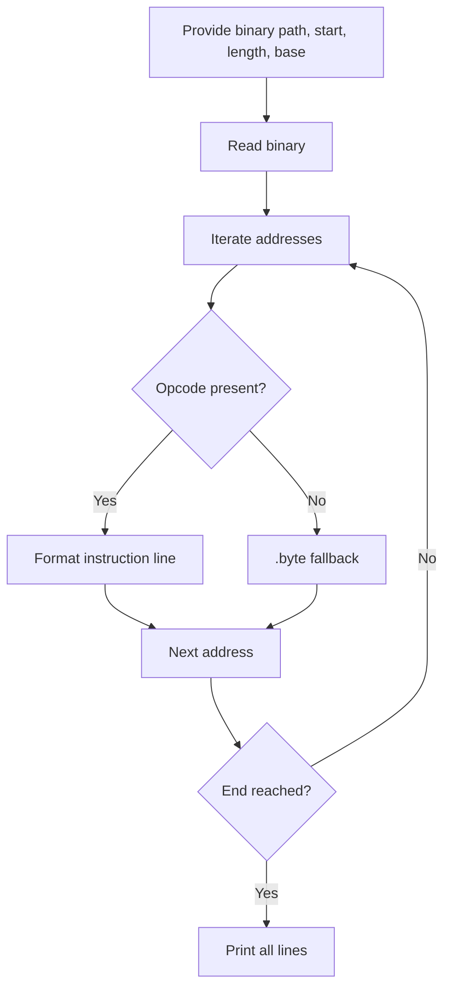
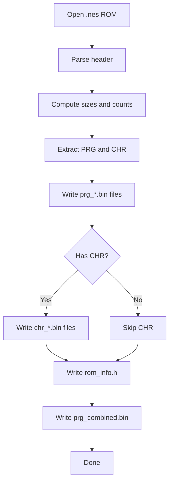
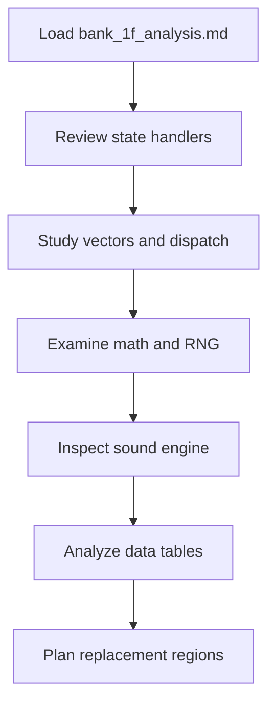
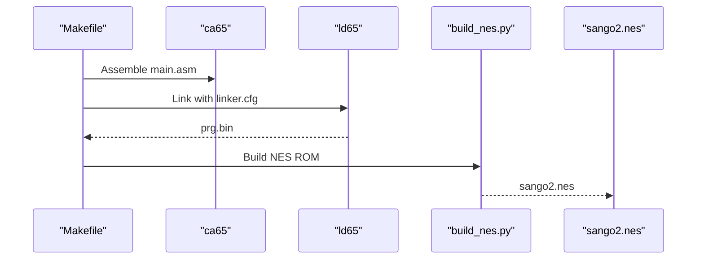
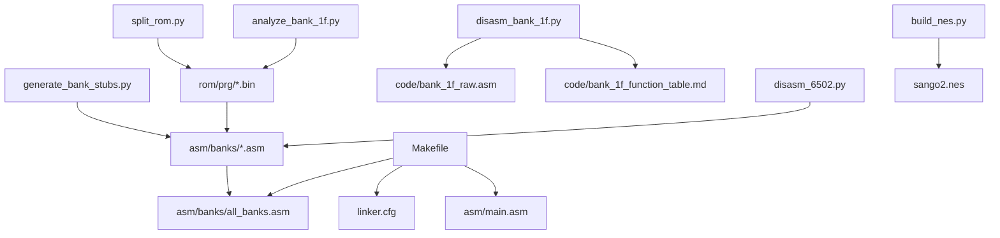

# Stub Replacement Methodology

<cite>
**Referenced Files in This Document**
- [generate_bank_stubs.py](file://tools/generate_bank_stubs.py)
- [disasm_bank_1f.py](file://tools/disasm_bank_1f.py)
- [disasm_6502.py](file://tools/disasm_6502.py)
- [analyze_bank_1f.py](file://tools/analyze_bank_1f.py)
- [split_rom.py](file://tools/split_rom.py)
- [build_nes.py](file://tools/build_nes.py)
- [Makefile](file://Makefile)
- [linker.cfg](file://linker.cfg)
- [all_banks.asm](file://asm/banks/all_banks.asm)
- [prg_1f.asm](file://asm/banks/prg_1f.asm)
- [prg_1f.asm.bak](file://asm/banks/prg_1f.asm.bak)
- [main.asm](file://asm/main.asm)
- [namco163.h](file://include/namco163.h)
- [macros.h](file://include/macros.h)
- [bank_1f_analysis.md](file://code/bank_1f_analysis.md)
</cite>

## Table of Contents
1. [Introduction](#introduction)
2. [Project Structure](#project-structure)
3. [Core Components](#core-components)
4. [Architecture Overview](#architecture-overview)
5. [Detailed Component Analysis](#detailed-component-analysis)
6. [Dependency Analysis](#dependency-analysis)
7. [Performance Considerations](#performance-considerations)
8. [Troubleshooting Guide](#troubleshooting-guide)
9. [Conclusion](#conclusion)
10. [Appendices](#appendices)

## Introduction
This document describes a robust, incremental stub replacement methodology for replacing placeholder bank stubs with actual disassembled content. The approach leverages .incbin directives to embed original ROM binaries into assembly stubs, enabling immediate linking and verification while preserving the ability to gradually replace stubbed regions with hand-crafted, labeled, and cross-referenced assembly code. The methodology emphasizes:
- Systematic identification of stub locations and corresponding ROM segments
- Extraction of accurate assembly segments using targeted disassemblers
- Integration into appropriate bank files with consistent naming and labeling
- Cross-bank reference handling, shared subroutines, and mixed data/code regions
- Maintaining code organization and continuity during replacement

## Project Structure
The repository organizes the disassembly pipeline around three pillars:
- Bank stubs and inclusion: Assembly stubs per PRG bank with .incbin placeholders
- Disassembly tools: Bank-specific and generic 6502 disassemblers
- Build and integration: Makefile-driven assembly, linking, and ROM creation

**Diagram sources**
- [Makefile:1-102](file://Makefile#L1-L102)
- [linker.cfg:1-55](file://linker.cfg#L1-L55)
- [all_banks.asm:1-38](file://asm/banks/all_banks.asm#L1-L38)
- [generate_bank_stubs.py:1-53](file://tools/generate_bank_stubs.py#L1-L53)
- [disasm_bank_1f.py:1-561](file://tools/disasm_bank_1f.py#L1-L561)
- [disasm_6502.py:1-363](file://tools/disasm_6502.py#L1-L363)
- [analyze_bank_1f.py:1-157](file://tools/analyze_bank_1f.py#L1-L157)
- [split_rom.py:1-140](file://tools/split_rom.py#L1-L140)

**Section sources**
- [Makefile:1-102](file://Makefile#L1-L102)
- [linker.cfg:1-55](file://linker.cfg#L1-L55)
- [all_banks.asm:1-38](file://asm/banks/all_banks.asm#L1-L38)
- [generate_bank_stubs.py:1-53](file://tools/generate_bank_stubs.py#L1-L53)

## Core Components
- Bank stub generator: Creates per-bank assembly stubs with .incbin directives pointing to original ROM banks. See [generate_bank_stubs.py:12-46](file://tools/generate_bank_stubs.py#L12-L46).
- Bank inclusion aggregator: Includes all bank stubs into a single assembly file for unified assembly. See [all_banks.asm:5-36](file://asm/banks/all_banks.asm#L5-L36).
- Bank-specific disassembler: Produces ca65-compatible assembly for a specific boot bank with labeled functions and tables. See [disasm_bank_1f.py:361-433](file://tools/disasm_bank_1f.py#L361-L433).
- Generic 6502 disassembler: Provides quick, basic disassembly for arbitrary regions. See [disasm_6502.py:286-334](file://tools/disasm_6502.py#L286-L334).
- ROM splitter: Splits an iNES ROM into individual PRG/CHR banks and generates a combined PRG for cross-bank analysis. See [split_rom.py:38-122](file://tools/split_rom.py#L38-L122).
- Build pipeline: Assembles and links to produce a PRG and NES ROM. See [Makefile:38-48](file://Makefile#L38-L48) and [build_nes.py:10-51](file://tools/build_nes.py#L10-L51).
- Bank 1F analysis: Comprehensive analysis and annotated disassembly for the boot bank. See [bank_1f_analysis.md:1-800](file://code/bank_1f_analysis.md#L1-L800).

**Section sources**
- [generate_bank_stubs.py:12-46](file://tools/generate_bank_stubs.py#L12-L46)
- [all_banks.asm:5-36](file://asm/banks/all_banks.asm#L5-L36)
- [disasm_bank_1f.py:361-433](file://tools/disasm_bank_1f.py#L361-L433)
- [disasm_6502.py:286-334](file://tools/disasm_6502.py#L286-L334)
- [split_rom.py:38-122](file://tools/split_rom.py#L38-L122)
- [Makefile:38-48](file://Makefile#L38-L48)
- [build_nes.py:10-51](file://tools/build_nes.py#L10-L51)
- [bank_1f_analysis.md:1-800](file://code/bank_1f_analysis.md#L1-L800)

## Architecture Overview
The stub replacement architecture centers on bank stubs that embed original ROM data while allowing labeled assembly regions to supersede those areas. The linker configuration defines memory slots and segments, and the build pipeline produces a complete ROM.

**Diagram sources**
- [split_rom.py:38-122](file://tools/split_rom.py#L38-L122)
- [generate_bank_stubs.py:12-46](file://tools/generate_bank_stubs.py#L12-L46)
- [all_banks.asm:5-36](file://asm/banks/all_banks.asm#L5-L36)
- [linker.cfg:18-54](file://linker.cfg#L18-L54)
- [Makefile:38-48](file://Makefile#L38-L48)
- [build_nes.py:10-51](file://tools/build_nes.py#L10-L51)

## Detailed Component Analysis

### Bank Stub Generation and .incbin Placeholders
- Purpose: Provide a baseline assembly structure per bank with embedded original binary data.
- Behavior: Generates one .asm stub per PRG bank and an aggregator include file. Each stub uses a .segment directive and includes an .incbin line pointing to the corresponding rom/prg/prg_xx.bin.
- Integration: The aggregator include file (.include "prg_*.asm") ensures all banks are assembled together.

**Diagram sources**
- [generate_bank_stubs.py:12-46](file://tools/generate_bank_stubs.py#L12-L46)

**Section sources**
- [generate_bank_stubs.py:12-46](file://tools/generate_bank_stubs.py#L12-L46)
- [all_banks.asm:5-36](file://asm/banks/all_banks.asm#L5-L36)

### Bank-Specific Disassembly for Replacement Targets
- Purpose: Produce accurate, labeled assembly for specific banks (e.g., boot bank 0x1F) to guide replacement.
- Behavior: Reads the original bank binary, identifies function and table regions, and emits ca65 assembly with labels and comments. It also writes a function table for cross-reference.
- Usage: The emitted assembly serves as the authoritative source for replacing stubbed regions in the corresponding bank file.

**Diagram sources**
- [disasm_bank_1f.py:545-561](file://tools/disasm_bank_1f.py#L545-L561)

**Section sources**
- [disasm_bank_1f.py:139-324](file://tools/disasm_bank_1f.py#L139-L324)
- [disasm_bank_1f.py:361-433](file://tools/disasm_bank_1f.py#L361-L433)
- [disasm_bank_1f.py:545-561](file://tools/disasm_bank_1f.py#L545-L561)

### Generic 6502 Disassembler for Quick Analysis
- Purpose: Quickly disassemble arbitrary regions of a binary for initial exploration.
- Behavior: Accepts start address, length, and base address; emits formatted lines with addresses, bytes, and mnemonics.

**Diagram sources**
- [disasm_6502.py:286-334](file://tools/disasm_6502.py#L286-L334)

**Section sources**
- [disasm_6502.py:286-334](file://tools/disasm_6502.py#L286-L334)

### ROM Splitting and Combined PRG for Cross-Bank Analysis
- Purpose: Decompose an iNES ROM into per-bank PRG/CHR files and a combined PRG for cross-referencing.
- Behavior: Parses the iNES header, splits PRG into 8KB banks, optionally splits CHR, and writes rom_info.h and prg_combined.bin.

**Diagram sources**
- [split_rom.py:38-122](file://tools/split_rom.py#L38-L122)

**Section sources**
- [split_rom.py:38-122](file://tools/split_rom.py#L38-L122)

### Bank 1F Analysis and Replacement Guidance
- Purpose: Provide a detailed, annotated analysis of the boot bank to guide replacement decisions and verify correctness.
- Content: Describes state handlers, vectors, math routines, RNG, sound engine, and data tables with addresses, sizes, and roles.

**Diagram sources**
- [bank_1f_analysis.md:1-800](file://code/bank_1f_analysis.md#L1-L800)

**Section sources**
- [bank_1f_analysis.md:1-800](file://code/bank_1f_analysis.md#L1-L800)

### Build Pipeline and ROM Creation
- Purpose: Assemble, link, and package the final ROM with proper headers and padding.
- Behavior: Assembles main.asm, links with linker.cfg, creates PRG, and wraps it into an iNES ROM with build_nes.py.

**Diagram sources**
- [Makefile:38-48](file://Makefile#L38-L48)
- [build_nes.py:10-51](file://tools/build_nes.py#L10-L51)

**Section sources**
- [Makefile:38-48](file://Makefile#L38-L48)
- [build_nes.py:10-51](file://tools/build_nes.py#L10-L51)

## Dependency Analysis
The stub replacement workflow depends on several interrelated components. The following diagram highlights key dependencies and data flows.

**Diagram sources**
- [generate_bank_stubs.py:12-46](file://tools/generate_bank_stubs.py#L12-L46)
- [all_banks.asm:5-36](file://asm/banks/all_banks.asm#L5-L36)
- [split_rom.py:38-122](file://tools/split_rom.py#L38-L122)
- [disasm_bank_1f.py:545-561](file://tools/disasm_bank_1f.py#L545-L561)
- [disasm_6502.py:286-334](file://tools/disasm_6502.py#L286-L334)
- [analyze_bank_1f.py:1-157](file://tools/analyze_bank_1f.py#L1-L157)
- [Makefile:38-48](file://Makefile#L38-L48)
- [linker.cfg:18-54](file://linker.cfg#L18-L54)
- [build_nes.py:10-51](file://tools/build_nes.py#L10-L51)

**Section sources**
- [Makefile:38-48](file://Makefile#L38-L48)
- [linker.cfg:18-54](file://linker.cfg#L18-L54)

## Performance Considerations
- Incremental replacement minimizes rebuild time by focusing on specific banks and regions.
- Using .incbin allows immediate linking and ROM generation while stubbed regions remain intact.
- Disassembler outputs are cached (e.g., bank_1f_raw.asm, bank_1f_function_table.md) to avoid repeated computation.
- Keep disassembly targets small and precise to reduce parsing overhead.

## Troubleshooting Guide
Common issues and resolutions during stub replacement:
- Incorrect bank mapping: Verify linker.cfg memory slots and segments align with the target hardware. See [linker.cfg:18-54](file://linker.cfg#L18-L54).
- Missing ROM banks: Ensure rom/prg/*.bin exists and matches the ROM structure. Use [split_rom.py:38-122](file://tools/split_rom.py#L38-L122) to regenerate.
- Build failures after replacement: Confirm labels and addresses match the original ROM layout; use [disasm_6502.py:286-334](file://tools/disasm_6502.py#L286-L334) to validate instruction boundaries.
- Cross-bank references: Use the combined PRG (rom/prg_combined.bin) to locate external references; see [analyze_bank_1f.py:1-157](file://tools/analyze_bank_1f.py#L1-L157).
- ROM mismatch: Compare the built ROM against the original using [build_nes.py:10-51](file://tools/build_nes.py#L10-L51) and [Makefile:58-61](file://Makefile#L58-L61).

**Section sources**
- [linker.cfg:18-54](file://linker.cfg#L18-L54)
- [split_rom.py:38-122](file://tools/split_rom.py#L38-L122)
- [disasm_6502.py:286-334](file://tools/disasm_6502.py#L286-L334)
- [analyze_bank_1f.py:1-157](file://tools/analyze_bank_1f.py#L1-L157)
- [build_nes.py:10-51](file://tools/build_nes.py#L10-L51)
- [Makefile:58-61](file://Makefile#L58-L61)

## Conclusion
The stub replacement methodology provides a structured, incremental path from placeholder .incbin stubs to fully labeled, cross-referenced assembly. By leveraging bank-specific disassemblers, ROM splitting, and a disciplined build pipeline, developers can maintain continuity, manage complexity, and ensure accuracy as they replace stubbed regions with precise, documented code.

## Appendices

### Practical Workflow: From Stubs to Integrated Code
1. Prepare ROM banks
   - Split the original ROM into per-bank PRG/CHR and a combined PRG. See [split_rom.py:38-122](file://tools/split_rom.py#L38-L122).
2. Generate bank stubs
   - Create per-bank stubs with .incbin placeholders. See [generate_bank_stubs.py:12-46](file://tools/generate_bank_stubs.py#L12-L46).
3. Assemble and link
   - Build the project to include all stubs. See [Makefile:38-48](file://Makefile#L38-L48).
4. Analyze target bank
   - Use bank-specific disassembler to produce labeled assembly and function tables. See [disasm_bank_1f.py:545-561](file://tools/disasm_bank_1f.py#L545-L561).
5. Plan replacement regions
   - Review the annotated analysis and function table to identify regions to replace. See [bank_1f_analysis.md:1-800](file://code/bank_1f_analysis.md#L1-L800).
6. Replace stubs incrementally
   - Edit the corresponding bank file (e.g., [prg_1f.asm](file://asm/banks/prg_1f.asm)) to replace .incbin regions with labeled assembly blocks.
   - Maintain consistent naming and labels; preserve cross-references to external symbols.
7. Validate and iterate
   - Rebuild and compare against the original ROM as needed. See [build_nes.py:10-51](file://tools/build_nes.py#L10-L51) and [Makefile:58-61](file://Makefile#L58-L61).

**Section sources**
- [split_rom.py:38-122](file://tools/split_rom.py#L38-L122)
- [generate_bank_stubs.py:12-46](file://tools/generate_bank_stubs.py#L12-L46)
- [Makefile:38-48](file://Makefile#L38-L48)
- [disasm_bank_1f.py:545-561](file://tools/disasm_bank_1f.py#L545-L561)
- [bank_1f_analysis.md:1-800](file://code/bank_1f_analysis.md#L1-L800)
- [build_nes.py:10-51](file://tools/build_nes.py#L10-L51)
- [Makefile:58-61](file://Makefile#L58-L61)

### Naming Conventions and Label Management
- Bank files: Use lowercase with leading zeros (e.g., prg_00.asm, prg_1f.asm). See [all_banks.asm:5-36](file://asm/banks/all_banks.asm#L5-L36).
- Segment naming: Use descriptive segment names aligned with bank roles (e.g., CODE_BANK1F). See [prg_1f.asm:13](file://asm/banks/prg_1f.asm#L13).
- Labels: Prefix global RAM addresses with meaningful names (e.g., addr_game_state). See [prg_1f.asm:22-70](file://asm/banks/prg_1f.asm#L22-L70).
- Procedures: Enclose functions in .proc/.endproc blocks with clear names. See [prg_1f.asm:74-148](file://asm/banks/prg_1f.asm#L74-L148).
- Cross-references: Use .addr and direct calls to maintain linkage across banks. See [prg_1f.asm:153-168](file://asm/banks/prg_1f.asm#L153-L168).

**Section sources**
- [all_banks.asm:5-36](file://asm/banks/all_banks.asm#L5-L36)
- [prg_1f.asm:13](file://asm/banks/prg_1f.asm#L13)
- [prg_1f.asm:22-70](file://asm/banks/prg_1f.asm#L22-L70)
- [prg_1f.asm:74-148](file://asm/banks/prg_1f.asm#L74-L148)
- [prg_1f.asm:153-168](file://asm/banks/prg_1f.asm#L153-L168)

### Handling Complex Scenarios
- Cross-bank references: Use the combined PRG to locate external symbols and ensure correct addressing. See [analyze_bank_1f.py:1-157](file://tools/analyze_bank_1f.py#L1-L157).
- Shared subroutines: Define common routines in a shared bank or use banked calls with proper parameter passing. See [prg_1f_analysis.md:548-555](file://code/bank_1f_analysis.md#L548-L555).
- Data/code mixing: Separate data and code regions clearly; use .byte directives for data and .addr for pointers. See [prg_1f_analysis.md:527-533](file://code/bank_1f_analysis.md#L527-L533).
- Bank switching: Leverage macros and register definitions for consistent bank switching. See [namco163.h:68-86](file://include/namco163.h#L68-L86) and [macros.h:60-71](file://include/macros.h#L60-L71).

**Section sources**
- [analyze_bank_1f.py:1-157](file://tools/analyze_bank_1f.py#L1-L157)
- [prg_1f_analysis.md:527-555](file://code/bank_1f_analysis.md#L527-L555)
- [namco163.h:68-86](file://include/namco163.h#L68-L86)
- [macros.h:60-71](file://include/macros.h#L60-L71)