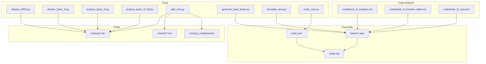
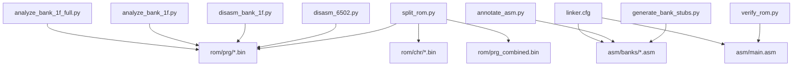

# Targeted Disassembly Process

<cite>
**Referenced Files in This Document**
- [PROJECT.md](file://PROJECT.md)
- [Makefile](file://Makefile)
- [tools/disasm_6502.py](file://tools/disasm_6502.py)
- [tools/disasm_bank_1f.py](file://tools/disasm_bank_1f.py)
- [tools/analyze_bank_1f.py](file://tools/analyze_bank_1f.py)
- [tools/analyze_bank_1f_full.py](file://tools/analyze_bank_1f_full.py)
- [tools/split_rom.py](file://tools/split_rom.py)
- [tools/generate_bank_stubs.py](file://tools/generate_bank_stubs.py)
- [tools/annotate_asm.py](file://tools/annotate_asm.py)
- [tools/verify_rom.py](file://tools/verify_rom.py)
- [asm/main.asm](file://asm/main.asm)
- [linker.cfg](file://linker.cfg)
- [include/namco163.h](file://include/namco163.h)
- [include/macros.h](file://include/macros.h)
- [code/bank_1f_analysis.md](file://code/bank_1f_analysis.md)
- [code/bank_1f_function_table.md](file://code/bank_1f_function_table.md)
- [code/bank_1f_raw.asm](file://code/bank_1f_raw.asm)
</cite>

## Table of Contents
1. [Introduction](#introduction)
2. [Project Structure](#project-structure)
3. [Core Components](#core-components)
4. [Architecture Overview](#architecture-overview)
5. [Detailed Component Analysis](#detailed-component-analysis)
6. [Dependency Analysis](#dependency-analysis)
7. [Performance Considerations](#performance-considerations)
8. [Troubleshooting Guide](#troubleshooting-guide)
9. [Conclusion](#conclusion)
10. [Appendices](#appendices)

## Introduction
This document describes a targeted disassembly process for extracting code from specific ROM banks, focusing on the boot bank 0x1F. It explains how to use the 6502 disassembler tools to convert binary ROM data into readable assembly format, covering command-line usage, address ranges, memory mapping, and output formatting. It also details how to identify and disassemble critical sections such as interrupt vectors, subroutine entry points, and jump tables, and provides practical examples for handling different addressing modes and interpreting disassembly output. Finally, it addresses common challenges like unknown opcodes, truncated instructions, and self-modifying code patterns, and offers guidance on organizing disassembly output for integration into the assembly codebase.

## Project Structure
The repository is organized around a complete disassembly pipeline for the Namco-163 (Mapper 19) ROM. Key directories and files include:
- Tools for ROM splitting, disassembly, analysis, annotation, and verification
- Assembly entry points and bank stubs
- Linker configuration for 4 PRG slots
- Bank-specific analysis and function tables



**Diagram sources**
- [tools/split_rom.py:38-122](file://tools/split_rom.py#L38-L122)
- [tools/disasm_6502.py:336-362](file://tools/disasm_6502.py#L336-L362)
- [tools/disasm_bank_1f.py:545-561](file://tools/disasm_bank_1f.py#L545-L561)
- [tools/analyze_bank_1f.py:1-157](file://tools/analyze_bank_1f.py#L1-L157)
- [tools/analyze_bank_1f_full.py:1-154](file://tools/analyze_bank_1f_full.py#L1-L154)
- [tools/generate_bank_stubs.py:12-52](file://tools/generate_bank_stubs.py#L12-L52)
- [tools/annotate_asm.py:315-481](file://tools/annotate_asm.py#L315-L481)
- [tools/verify_rom.py:10-73](file://tools/verify_rom.py#L10-L73)
- [asm/main.asm:1-141](file://asm/main.asm#L1-L141)
- [linker.cfg:18-54](file://linker.cfg#L18-L54)
- [code/bank_1f_analysis.md:1-20](file://code/bank_1f_analysis.md#L1-L20)
- [code/bank_1f_function_table.md:1-20](file://code/bank_1f_function_table.md#L1-L20)
- [code/bank_1f_raw.asm:1-20](file://code/bank_1f_raw.asm#L1-L20)

**Section sources**
- [PROJECT.md:14-47](file://PROJECT.md#L14-L47)
- [Makefile:1-102](file://Makefile#L1-L102)

## Core Components
This section outlines the essential tools and files used in the targeted disassembly process:

- ROM splitting and preparation
  - Split the original ROM into PRG/CHR banks and generate a combined PRG binary for cross-referencing
  - Generate bank stubs to include binary data initially and replace with disassembled code later

- Disassembly tools
  - Generic 6502 disassembler for listing format with configurable start address, length, and base address
  - Comprehensive bank 0x1F disassembler that produces ca65-compatible assembly with named functions and tables

- Analysis and annotation
  - Bank analysis scripts to identify function boundaries, internal JSR targets, bank switching patterns, and table references
  - Assembly annotation tool to add ROM addresses and opcode bytes to annotated assembly

- Build and verification
  - Linker configuration for 4 PRG slots and interrupt vectors
  - ROM verification script to compare rebuilt ROM with the original

**Section sources**
- [tools/split_rom.py:38-122](file://tools/split_rom.py#L38-L122)
- [tools/generate_bank_stubs.py:12-52](file://tools/generate_bank_stubs.py#L12-L52)
- [tools/disasm_6502.py:336-362](file://tools/disasm_6502.py#L336-L362)
- [tools/disasm_bank_1f.py:545-561](file://tools/disasm_bank_1f.py#L545-L561)
- [tools/analyze_bank_1f.py:4-157](file://tools/analyze_bank_1f.py#L4-L157)
- [tools/analyze_bank_1f_full.py:4-154](file://tools/analyze_bank_1f_full.py#L4-L154)
- [tools/annotate_asm.py:315-481](file://tools/annotate_asm.py#L315-L481)
- [linker.cfg:18-54](file://linker.cfg#L18-L54)
- [tools/verify_rom.py:10-73](file://tools/verify_rom.py#L10-L73)

## Architecture Overview
The disassembly workflow centers on the boot bank 0x1F, which contains the reset handler, state dispatch logic, interrupt vectors, and supporting utilities. The process proceeds as follows:

- Prepare ROM
  - Split the original ROM into 32 PRG banks (8KB each) and 32 CHR banks (8KB each)
  - Generate a combined PRG binary for cross-referencing addresses across the ROM

- Disassemble boot bank 0x1F
  - Use the comprehensive bank 0x1F disassembler to produce a ca65-compatible assembly file with named functions and tables
  - Alternatively, use the generic 6502 disassembler for quick listings with configurable address ranges

- Analyze and annotate
  - Analyze the boot bank to identify function boundaries, internal JSR targets, bank switching patterns, and table references
  - Annotate the resulting assembly with ROM addresses and opcode bytes for verification

- Integrate into assembly codebase
  - Replace bank stubs with disassembled code
  - Update linker configuration to include new segments and memory regions
  - Verify byte-exact match with the original ROM

```mermaid
sequenceDiagram
participant Dev as "Developer"
participant Split as "split_rom.py"
participant Stub as "generate_bank_stubs.py"
participant Disasm as "disasm_bank_1f.py"
participant Analyze as "analyze_bank_1f.py"
participant Annot as "annotate_asm.py"
participant Link as "linker.cfg"
participant Verify as "verify_rom.py"
Dev->>Split : Split original ROM
Split-->>Dev : PRG/CHR banks + combined PRG
Dev->>Stub : Generate bank stubs
Stub-->>Dev : Bank stub files (.incbin)
Dev->>Disasm : Disassemble bank 0x1F
Disasm-->>Dev : ca65 assembly with functions/tables
Dev->>Analyze : Analyze boot bank
Analyze-->>Dev : Function boundaries, JSR targets, tables
Dev->>Annot : Annotate assembly with addresses/bytes
Annot-->>Dev : Annotated assembly
Dev->>Link : Update linker configuration
Link-->>Dev : Segments/mapping updated
Dev->>Verify : Compare rebuilt ROM with original
Verify-->>Dev : Byte-exact match status
```

**Diagram sources**
- [tools/split_rom.py:38-122](file://tools/split_rom.py#L38-L122)
- [tools/generate_bank_stubs.py:12-52](file://tools/generate_bank_stubs.py#L12-L52)
- [tools/disasm_bank_1f.py:545-561](file://tools/disasm_bank_1f.py#L545-L561)
- [tools/analyze_bank_1f.py:4-157](file://tools/analyze_bank_1f.py#L4-L157)
- [tools/annotate_asm.py:315-481](file://tools/annotate_asm.py#L315-L481)
- [linker.cfg:18-54](file://linker.cfg#L18-L54)
- [tools/verify_rom.py:10-73](file://tools/verify_rom.py#L10-L73)

**Section sources**
- [PROJECT.md:134-151](file://PROJECT.md#L134-L151)
- [Makefile:50-75](file://Makefile#L50-L75)

## Detailed Component Analysis

### Command-Line Disassembler Usage
The generic 6502 disassembler supports flexible command-line usage for disassembling arbitrary address ranges within a binary:

- Basic usage
  - Arguments: binary file path, start address, length, base address
  - Start address defaults to $8000
  - Length defaults to the entire file
  - Base address defaults to start address (mapping CPU addresses to file offsets)

- Practical example for bank 0x1F
  - Disassemble a 1KB range starting at $E000 from bank 0x1F binary
  - Use base address $E000 to map CPU addresses directly to file offsets

- Handling truncated instructions
  - The disassembler detects truncated instructions and marks them with a comment indicating truncation

- Unknown opcodes
  - Unknown opcodes are emitted as .byte directives with the opcode value

**Section sources**
- [tools/disasm_6502.py:336-362](file://tools/disasm_6502.py#L336-L362)
- [tools/disasm_6502.py:286-334](file://tools/disasm_6502.py#L286-L334)

### Comprehensive Bank 0x1F Disassembler
The comprehensive bank 0x1F disassembler produces a complete ca65-compatible assembly file with:
- Named functions and tables
- Proper segment directives
- Interrupt vectors at $FFFA-$FFFF
- Function table and raw disassembly outputs

- Function table generation
  - Defines function regions with start/end addresses, names, types, sizes, and descriptions
  - Useful for tracking progress and understanding code organization

- Raw disassembly output
  - Disassembles all bytes within the bank into labeled assembly blocks
  - Formats data regions as .byte directives
  - Adds padding directives for unused areas

- Interrupt vectors
  - Emits vectors for NMI, RESET, and IRQ at $FFFA-$FFFF
  - Uses .addr directives to reference handler labels

**Section sources**
- [tools/disasm_bank_1f.py:435-544](file://tools/disasm_bank_1f.py#L435-L544)
- [tools/disasm_bank_1f.py:361-433](file://tools/disasm_bank_1f.py#L361-L433)
- [tools/disasm_bank_1f.py:545-561](file://tools/disasm_bank_1f.py#L545-L561)

### ROM Splitting and Bank Preparation
The ROM splitting tool:
- Parses the iNES header to determine mapper, PRG/CHR sizes, mirroring, and battery presence
- Splits PRG ROM into 32 banks (8KB each) and CHR ROM into 32 banks (8KB each)
- Generates a combined PRG binary for cross-referencing ROM addresses
- Creates a rom_info.h header with mapper and bank counts

- Combined PRG binary
  - Enables analysis across the entire ROM without loading multiple files
  - Useful for vector table analysis and cross-bank references

**Section sources**
- [tools/split_rom.py:11-122](file://tools/split_rom.py#L11-L122)

### Bank Stub Generation
The bank stub generator:
- Creates 32 bank stub files, each mapped to a specific PRG slot
- Includes .segment directives and .incbin statements pointing to the corresponding PRG bank binary
- Generates an all_banks.asm include file aggregating all stubs

- Integration with linker
  - The linker configuration defines 4 PRG slots and optional segments for additional banks
  - As you disassemble more banks, add new MEMORY regions and SEGMENTS accordingly

**Section sources**
- [tools/generate_bank_stubs.py:12-52](file://tools/generate_bank_stubs.py#L12-L52)
- [linker.cfg:18-54](file://linker.cfg#L18-L54)

### Bank Analysis Tools
Two analysis scripts assist in understanding the boot bank structure:

- analyze_bank_1f.py
  - Identifies the vector dispatch table at $E07C
  - Analyzes the reset handler and bank switching patterns
  - Finds internal JSR targets and utility patterns (RNG, math)
  - Lists table lookup addresses and external JSR targets

- analyze_bank_1f_full.py
  - Locates function boundaries using RTS/RTI as end markers
  - Identifies internal JSR targets and bank switching operations
  - Finds main loop dispatch patterns and table references
  - Lists external JSR targets with bank context

**Section sources**
- [tools/analyze_bank_1f.py:4-157](file://tools/analyze_bank_1f.py#L4-L157)
- [tools/analyze_bank_1f_full.py:4-154](file://tools/analyze_bank_1f_full.py#L4-L154)

### Assembly Annotation
The annotation tool:
- Builds a symbol table from include files and assembly definitions
- Estimates instruction sizes from operand text and resolves symbols
- Walks the assembly file, annotating each instruction with ROM address and opcode bytes
- Handles data directives (.byte, .addr/.word, .res, .incbin) and advances address accordingly
- Provides warnings for resync events and final address mismatches
- Optionally verifies the annotated assembly with ca65

- Address hint resync
  - Uses section header comments containing ROM addresses to resynchronize drift
  - Ensures accurate annotation even when assembly deviates from ROM layout

**Section sources**
- [tools/annotate_asm.py:91-139](file://tools/annotate_asm.py#L91-L139)
- [tools/annotate_asm.py:141-189](file://tools/annotate_asm.py#L141-L189)
- [tools/annotate_asm.py:281-481](file://tools/annotate_asm.py#L281-L481)

### Linker Configuration and Interrupt Vectors
The linker configuration defines:
- Zero page and uninitialized RAM segments
- Four PRG slots ($8000-$FFFF) with fill values
- Optional code segments for additional banks
- Interrupt vectors segment starting at $9FFA

- Interrupt vectors
  - NMI: $F800
  - RESET: $E000
  - IRQ: $FB2D

- Memory mapping considerations
  - Bank 0x1F is mapped to $E000-$FFFF (PRG slot 3) at boot
  - Bank switching registers for $8000-$DFFF are handled by the mapper

**Section sources**
- [linker.cfg:18-54](file://linker.cfg#L18-L54)
- [PROJECT.md:101-117](file://PROJECT.md#L101-L117)
- [include/namco163.h:10-26](file://include/namco163.h#L10-L26)

### ROM Verification
The verification script:
- Compares the rebuilt ROM with the original byte-by-byte
- Reports total mismatches, accuracy percentage, and first mismatch location
- Useful for tracking disassembly accuracy and validating changes

**Section sources**
- [tools/verify_rom.py:10-73](file://tools/verify_rom.py#L10-L73)

### Practical Examples and Workflows

#### Example 1: Disassemble Bank 0x1F with Generic Disassembler
- Command
  - make disasm FILE=rom/prg/prg_1f.bin ADDR=E000 LEN=1024
- Output interpretation
  - Each line shows CPU address, raw bytes, and disassembled instruction
  - Relative branches are resolved to target addresses
  - Absolute and indexed addressing modes are formatted appropriately

**Section sources**
- [PROJECT.md:136-139](file://PROJECT.md#L136-L139)
- [tools/disasm_6502.py:336-362](file://tools/disasm_6502.py#L336-L362)

#### Example 2: Disassemble Bank 0x1F with Comprehensive Disassembler
- Command
  - python3 tools/disasm_bank_1f.py rom/prg/prg_1f.bin
- Outputs
  - code/bank_1f_function_table.md: Function table with addresses, sizes, and descriptions
  - code/bank_1f_raw.asm: Complete assembly with labeled functions and tables

**Section sources**
- [tools/disasm_bank_1f.py:545-561](file://tools/disasm_bank_1f.py#L545-L561)

#### Example 3: Analyze Bank 0x1F Patterns
- Command
  - python3 tools/analyze_bank_1f.py
- Output highlights
  - Vector dispatch table entries and targets
  - Reset handler steps and bank switching operations
  - Internal JSR targets and utility patterns

**Section sources**
- [tools/analyze_bank_1f.py:16-157](file://tools/analyze_bank_1f.py#L16-L157)

#### Example 4: Annotate Assembly with ROM Addresses
- Command
  - python3 tools/annotate_asm.py [--in-place] [--verify]
- Output
  - Assembly annotated with ROM addresses and opcode bytes
  - Warnings for resync events and final address mismatches
  - Optional ca65 verification pass

**Section sources**
- [tools/annotate_asm.py:315-481](file://tools/annotate_asm.py#L315-L481)

#### Example 5: Integrate Disassembly into Assembly Codebase
- Steps
  - Replace .incbin stubs in asm/banks/prg_1f.asm with disassembled code
  - Update linker.cfg to include new segments and memory regions
  - Build ROM and verify against original
- Verification
  - make verify

**Section sources**
- [PROJECT.md:143-151](file://PROJECT.md#L143-L151)
- [Makefile:58-62](file://Makefile#L58-L62)

### Handling Critical Sections

#### Interrupt Vectors
- Location
  - $FFFA-$FFFF in bank 0x1F
- Content
  - NMI: $F800
  - RESET: $E000
  - IRQ: $FB2D
- Disassembly
  - Use the comprehensive disassembler to emit .addr directives for each vector
  - Ensure vectors are placed in the VECTORS segment at the correct linker start address

**Section sources**
- [tools/disasm_bank_1f.py:422-433](file://tools/disasm_bank_1f.py#L422-L433)
- [linker.cfg:40-41](file://linker.cfg#L40-L41)

#### Subroutine Entry Points
- Identification
  - Use analyze_bank_1f.py to find internal JSR targets
  - Use analyze_bank_1f_full.py for detailed function boundary analysis
- Naming
  - Apply meaningful labels from the function table (e.g., State_SystemInit, BankSwitch)
  - Group related functions under shared labels

**Section sources**
- [tools/analyze_bank_1f.py:94-111](file://tools/analyze_bank_1f.py#L94-L111)
- [tools/analyze_bank_1f_full.py:46-61](file://tools/analyze_bank_1f_full.py#L46-L61)
- [code/bank_1f_function_table.md:438-543](file://code/bank_1f_function_table.md#L438-L543)

#### Jump Tables
- Vector dispatch table
  - $E07C-$E099: 15 entries, each 2 bytes (little-endian)
  - Indexed by $007A AND #$1F
- Data tables
  - Use analyze_bank_1f.py to locate LDA addr,Y patterns
  - Format as .byte directives in the raw disassembly

**Section sources**
- [tools/analyze_bank_1f.py:16-27](file://tools/analyze_bank_1f.py#L16-L27)
- [tools/disasm_bank_1f.py:405-414](file://tools/disasm_bank_1f.py#L405-L414)

### Addressing Modes and Instruction Handling
- Immediate, zero page, absolute, indexed, indirect, and relative addressing modes are supported
- Relative branches are resolved to target addresses
- Absolute and indexed addressing modes are formatted with proper suffixes (,X or ,Y)
- Indirect addressing modes are formatted with parentheses
- Unknown opcodes are emitted as .byte directives
- Truncated instructions are detected and marked with a comment

**Section sources**
- [tools/disasm_6502.py:239-284](file://tools/disasm_6502.py#L239-L284)
- [tools/disasm_6502.py:311-323](file://tools/disasm_6502.py#L311-L323)

### Self-Modifying Code Patterns
- Bank switching patches
  - Look for STA $F800/$FA00/$FC00/$FE00 followed by LDA #imm
  - Use analyze_bank_1f.py to identify these patterns
- RAM patches
  - Look for JMP opcode patches in RAM (e.g., $00A5)
  - Use annotate_asm.py to verify opcode bytes align with ROM

**Section sources**
- [tools/analyze_bank_1f.py:44-68](file://tools/analyze_bank_1f.py#L44-L68)
- [tools/annotate_asm.py:370-405](file://tools/annotate_asm.py#L370-L405)

### Organizing Disassembly Output
- Use the comprehensive disassembler to generate labeled functions and tables
- Maintain a function table markdown for progress tracking
- Keep raw disassembly for cross-referencing and detailed analysis
- Annotate assembly with ROM addresses and opcode bytes for verification
- Replace bank stubs with disassembled code and update linker configuration

**Section sources**
- [tools/disasm_bank_1f.py:435-544](file://tools/disasm_bank_1f.py#L435-L544)
- [tools/annotate_asm.py:315-481](file://tools/annotate_asm.py#L315-L481)
- [code/bank_1f_analysis.md:1-20](file://code/bank_1f_analysis.md#L1-L20)

## Dependency Analysis
The disassembly pipeline exhibits clear module separation and well-defined dependencies:



**Diagram sources**
- [tools/split_rom.py:38-122](file://tools/split_rom.py#L38-L122)
- [tools/generate_bank_stubs.py:12-52](file://tools/generate_bank_stubs.py#L12-L52)
- [tools/disasm_6502.py:336-362](file://tools/disasm_6502.py#L336-L362)
- [tools/disasm_bank_1f.py:545-561](file://tools/disasm_bank_1f.py#L545-L561)
- [tools/analyze_bank_1f.py:4-157](file://tools/analyze_bank_1f.py#L4-L157)
- [tools/analyze_bank_1f_full.py:4-154](file://tools/analyze_bank_1f_full.py#L4-L154)
- [tools/annotate_asm.py:315-481](file://tools/annotate_asm.py#L315-L481)
- [tools/verify_rom.py:10-73](file://tools/verify_rom.py#L10-L73)
- [asm/main.asm:1-141](file://asm/main.asm#L1-L141)
- [linker.cfg:18-54](file://linker.cfg#L18-L54)

**Section sources**
- [PROJECT.md:134-151](file://PROJECT.md#L134-L151)
- [Makefile:50-75](file://Makefile#L50-L75)

## Performance Considerations
- Disassembly speed
  - The generic disassembler processes bytes sequentially and is efficient for small ranges
  - The comprehensive disassembler performs additional formatting and table generation; expect longer runtime for full bank disassembly
- Memory usage
  - Loading entire PRG banks into memory is feasible given typical bank sizes (8KB)
  - Consider streaming or chunked processing for very large binaries
- Analysis accuracy
  - Use combined PRG for cross-referencing to avoid repeated file loads
  - Prefer ca65-compatible assembly output to minimize post-processing overhead

## Troubleshooting Guide
Common issues and resolutions:

- Unknown opcodes
  - Detected as .byte directives; verify ROM correctness or adjust opcode table
  - Check for self-modifying code or custom opcodes

- Truncated instructions
  - Identified with a comment indicating truncation; verify file boundaries and intended length
  - Adjust length parameter in disassembler invocation

- Address drift during annotation
  - Use address hints in assembly comments to resynchronize
  - Review warnings for resync events and final address mismatches

- Bank switching confusion
  - Confirm mapper register addresses and bank numbers
  - Verify bank switching patterns and RAM patches

- Interrupt vector mismatches
  - Ensure vectors are emitted at $FFFA-$FFFF with correct labels
  - Verify linker configuration places vectors at the correct start address

**Section sources**
- [tools/disasm_6502.py:311-323](file://tools/disasm_6502.py#L311-L323)
- [tools/annotate_asm.py:357-405](file://tools/annotate_asm.py#L357-L405)
- [include/namco163.h:10-26](file://include/namco163.h#L10-L26)
- [linker.cfg:40-41](file://linker.cfg#L40-L41)

## Conclusion
The targeted disassembly process for ROM bank 0x1F leverages a suite of specialized tools to convert binary data into structured, ca65-compatible assembly. By splitting the ROM, generating bank stubs, disassembling with either the generic or comprehensive disassembler, analyzing patterns, annotating assembly, and integrating into the build system, developers can achieve accurate, maintainable disassembly. The process emphasizes verification against the original ROM and careful handling of critical sections like interrupt vectors and bank switching patterns.

## Appendices

### Appendix A: Memory Map and Bank Switching
- Memory map
  - $0000-$07FF: RAM (2KB)
  - $2000-$2007: PPU registers
  - $4000-$401F: APU/IO registers
  - $6000-$7FFF: SRAM (8KB, battery-backed)
  - $8000-$FFFF: PRG ROM (switchable 8KB banks)
- Bank switching registers
  - $F800: $8000-$9FFF
  - $FA00: $A000-$BFFF
  - $FC00: $C000-$DFFF
  - $FE00: $E000-$FFFF (fixed boot bank)

**Section sources**
- [PROJECT.md:70-94](file://PROJECT.md#L70-L94)
- [include/namco163.h:10-14](file://include/namco163.h#L10-L14)

### Appendix B: Build Targets and Commands
- make split: Split original ROM into PRG/CHR banks
- make banks: Generate PRG bank stub files
- make disasm FILE=rom/prg/prg_1f.bin ADDR=8000 LEN=256: Disassemble a binary with configurable parameters
- make analyze: Analyze ROM structure
- make verify: Compare built ROM with original
- make clean/distclean: Remove build artifacts

**Section sources**
- [Makefile:54-100](file://Makefile#L54-L100)