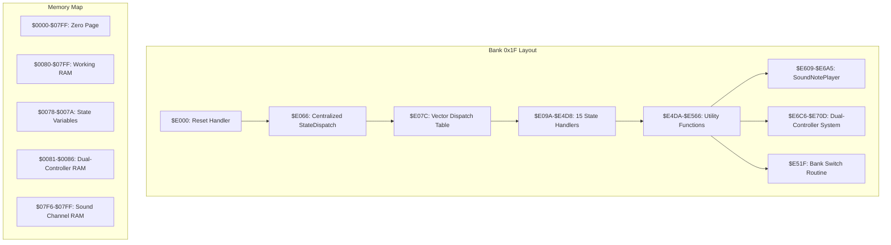
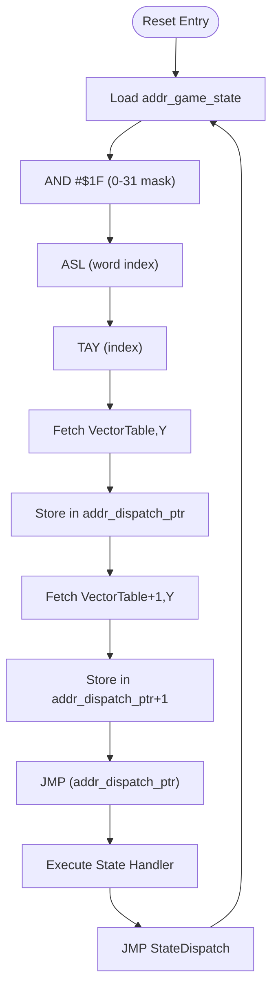
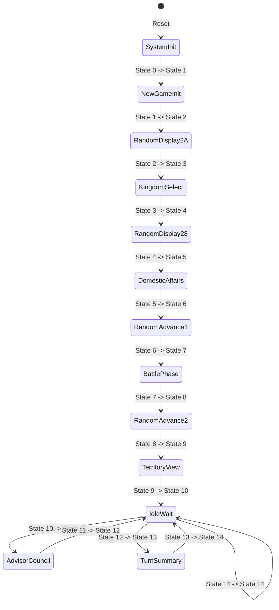
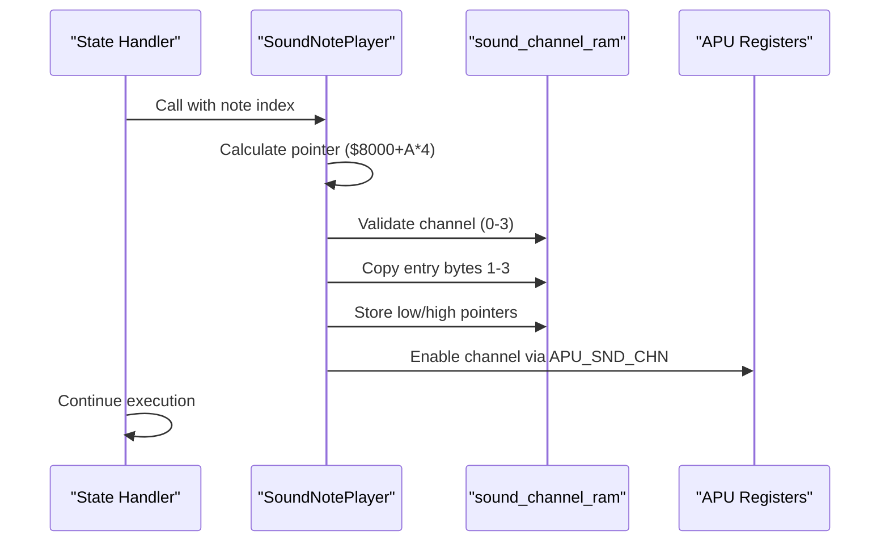
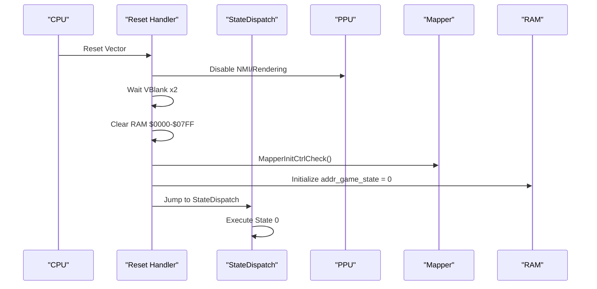
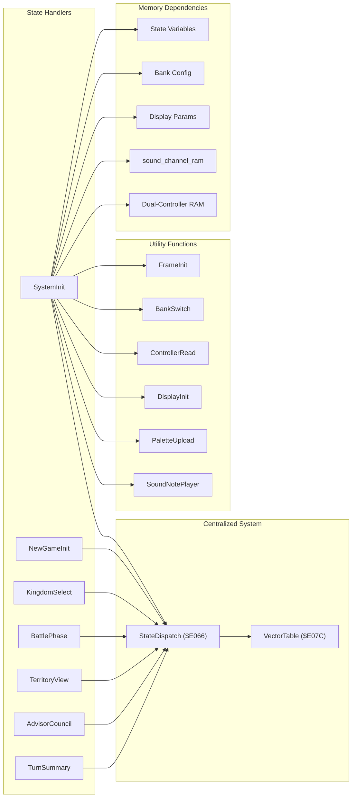
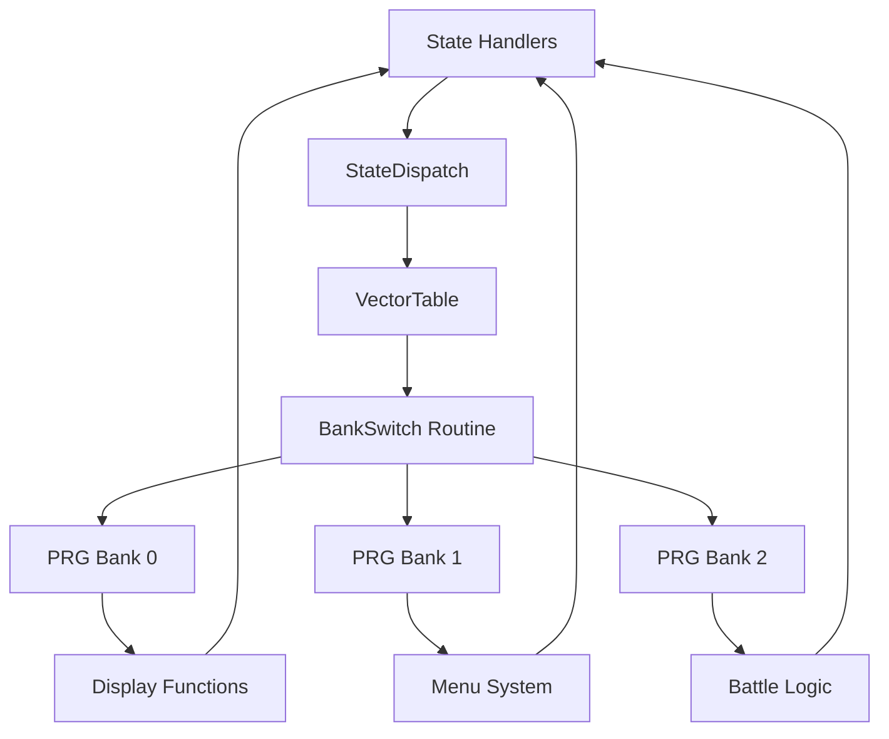

# Game State Management

<cite>
**Referenced Files in This Document**
- [prg_1f.aligned.asm](file://asm/banks/prg_1f.aligned.asm)
- [bank_1f_function_table.md](file://code/bank_1f_function_table.md)
- [key_functions_analysis.md](file://code/key_functions_analysis.md)
- [namco163.h](file://include/namco163.h)
</cite>

## Update Summary
**Changes Made**
- Updated centralized state dispatch architecture from inline dispatch logic to new StateDispatch procedure
- Migrated from old dual-controller system (addr_pad1_*) to new dual-controller architecture (addr_pad2_*)
- Replaced direct sound register manipulation with new SoundNotePlayer routine using sound_channel_ram
- Updated state transition patterns and controller input handling throughout state handlers

## Table of Contents
1. [Introduction](#introduction)
2. [Project Structure](#project-structure)
3. [Core Components](#core-components)
4. [Architecture Overview](#architecture-overview)
5. [Detailed Component Analysis](#detailed-component-analysis)
6. [Dependency Analysis](#dependency-analysis)
7. [Performance Considerations](#performance-considerations)
8. [Troubleshooting Guide](#troubleshooting-guide)
9. [Conclusion](#conclusion)

## Introduction
This document provides comprehensive analysis of the game state management system in the Sango2DASM project, focusing on the 15-game state system implemented through a centralized vector dispatch table at $E07C. The system orchestrates different game phases including title screen, gameplay, battle sequences, and menu systems, with careful coordination of memory bank switching and execution flow control. The architecture has been modernized with a centralized StateDispatch procedure replacing previous inline dispatch logic, dual-controller input handling, and a new sound system utilizing SoundNotePlayer.

## Project Structure
The state management system is implemented entirely within Bank 0x1F ($E000-$FFFF), which serves as the boot bank containing the reset handler, centralized state dispatch mechanism, and all state-specific implementations. The system utilizes the Namco-163 mapper for dynamic bank switching across the 32 available PRG banks.

**Diagram sources**
- [prg_1f.aligned.asm:74-147](file://asm/banks/prg_1f.aligned.asm#L74-L147)
- [prg_1f.aligned.asm:142-176](file://asm/banks/prg_1f.aligned.asm#L142-L176)
- [prg_1f.aligned.asm:925-1085](file://asm/banks/prg_1f.aligned.asm#L925-L1085)

**Section sources**
- [prg_1f.aligned.asm:1-800](file://asm/banks/prg_1f.aligned.asm#L1-L800)
- [bank_1f_function_table.md:1-98](file://code/bank_1f_function_table.md#L1-L98)

## Core Components

### Centralized State Dispatch Architecture
The system now employs a centralized StateDispatch procedure at $E066 that replaces previous inline dispatch logic within each state handler. This provides consistent state entry points and improved maintainability.

**Updated** The StateDispatch procedure handles state selection through a 30-byte vector table containing 15 state entry points, with each state handler now ending its execution by jumping to StateDispatch instead of implementing inline dispatch logic.

### Dual-Controller Input System
The controller system has been completely redesigned with a dual-controller architecture:

**Updated** Controller addresses now use the addr_pad2_* naming convention:
- **addr_pad2_edge** ($0082): Newly pressed buttons for controller 2
- **addr_pad2_raw** ($0085): Raw button state for controller 2  
- **addr_pad2_prev** ($0086): Previous frame state for controller 2

The old addr_pad1_* addresses (addr_pad1_edge, addr_pad1_raw, addr_pad1_prev) are no longer used in the current implementation.

### Enhanced Sound System
The sound system has been modernized with the SoundNotePlayer routine:

**Updated** The new SoundNotePlayer routine at $E609 provides centralized sound processing using sound_channel_ram ($07F6) for channel management, replacing previous direct register manipulation approaches.

### State Variable Architecture
The system maintains two primary state variables in RAM:
- **addr_game_state ($007A)**: Main state counter (0-14) indexing the vector table
- **addr_sub_state ($0078)**: Sub-state within each major state, enabling fine-grained control

**Section sources**
- [prg_1f.aligned.asm:142-176](file://asm/banks/prg_1f.aligned.asm#L142-L176)
- [prg_1f.aligned.asm:36-42](file://asm/banks/prg_1f.aligned.asm#L36-L42)
- [prg_1f.aligned.asm:925-977](file://asm/banks/prg_1f.aligned.asm#L925-L977)

## Architecture Overview

### Centralized State Dispatch Mechanism
The new centralized dispatch system operates through a streamlined StateDispatch procedure:

**Diagram sources**
- [prg_1f.aligned.asm:142-156](file://asm/banks/prg_1f.aligned.asm#L142-L156)
- [prg_1f.aligned.asm:158-176](file://asm/banks/prg_1f.aligned.asm#L158-L176)

### State Machine Design
The system implements a classic finite state machine with 15 distinct states, each representing a specific game phase:

**Diagram sources**
- [prg_1f.aligned.asm:158-176](file://asm/banks/prg_1f.aligned.asm#L158-L176)

### Enhanced Sound Processing Pipeline
The new sound system provides centralized audio processing:

**Diagram sources**
- [prg_1f.aligned.asm:925-977](file://asm/banks/prg_1f.aligned.asm#L925-L977)
- [prg_1f.aligned.asm:997-1038](file://asm/banks/prg_1f.aligned.asm#L997-L1038)

**Section sources**
- [prg_1f.aligned.asm:142-156](file://asm/banks/prg_1f.aligned.asm#L142-L156)
- [prg_1f.aligned.asm:158-176](file://asm/banks/prg_1f.aligned.asm#L158-L176)
- [prg_1f.aligned.asm:925-977](file://asm/banks/prg_1f.aligned.asm#L925-L977)

## Detailed Component Analysis

### Reset Handler and Modernized Initialization
The reset handler performs critical initialization sequence with enhanced setup:

1. **PPU Warmup**: Two-stage VBlank synchronization for stable PPU initialization
2. **APU Initialization**: Silence all sound channels and configure frame sequencer
3. **RAM Clear**: Full zero-page and working RAM initialization
4. **Mapper Setup**: Namco-163 configuration and controller validation
5. **State Initialization**: Set initial state to 0 and dispatch through centralized StateDispatch

**Updated** The reset handler now calls the centralized StateDispatch procedure instead of inline dispatch logic, ensuring consistent state entry points across all state handlers.

**Diagram sources**
- [prg_1f.aligned.asm:74-147](file://asm/banks/prg_1f.aligned.asm#L74-L147)
- [prg_1f.aligned.asm:142-156](file://asm/banks/prg_1f.aligned.asm#L142-L156)

**Section sources**
- [prg_1f.aligned.asm:74-147](file://asm/banks/prg_1f.aligned.asm#L74-L147)
- [prg_1f.aligned.asm:142-156](file://asm/banks/prg_1f.aligned.asm#L142-L156)

### State-Specific Implementation Patterns

#### System Initialization (State 0)
The system initialization state establishes the foundation for all subsequent states:

- PPU initialization and palette setup
- Bank switching for display functions
- Transition to territory view state

#### New Game Initialization (State 1)
Handles new game setup with controller input processing and SRAM initialization.

#### Kingdom Selection (State 3)
Manages kingdom selection with scenario mode detection and coordinate data handling.

#### Battle Phase (State 7)
Coordinates army status checks and sprite clearing based on combat outcomes.

#### Territory View (State 9)
Provides map interface with scrolling calculations and palette management.

#### Advisor Council (State 11)
Handles advisor dialogue system with menu cursor management.

#### Turn Summary (State 13)
Displays turn results with victory condition checking and appropriate music selection.

**Updated** All state handlers now consistently end with `JMP StateDispatch` instead of inline dispatch logic, providing uniform execution flow and improved maintainability.

**Section sources**
- [prg_1f.aligned.asm:179-210](file://asm/banks/prg_1f.aligned.asm#L179-L210)
- [prg_1f.aligned.asm:213-284](file://asm/banks/prg_1f.aligned.asm#L213-L284)
- [prg_1f.aligned.asm:287-373](file://asm/banks/prg_1f.aligned.asm#L287-L373)
- [prg_1f.aligned.asm:497-559](file://asm/banks/prg_1f.aligned.asm#L497-L559)
- [prg_1f.aligned.asm:569-627](file://asm/banks/prg_1f.aligned.asm#L569-L627)
- [prg_1f.aligned.asm:635-686](file://asm/banks/prg_1f.aligned.asm#L635-L686)
- [prg_1f.aligned.asm:688-740](file://asm/banks/prg_1f.aligned.asm#L688-L740)

### Enhanced Data Structure Management

#### State Variables
Each state maintains its own working data structures in RAM:
- **Display parameters**: $0098-$009B for scroll and rendering
- **Dual-controller input**: $0082/$0085/$0086 for edge-triggered and raw input (updated)
- **Palette buffers**: $0100-$011F for color data
- **Menu systems**: $0424/$0425 for cursor positioning

#### Sound Channel Management
**Updated** The new sound system uses centralized channel management:
- **sound_channel_ram ($07F6)**: RAM copy of Namco sound channel state
- **SoundChannelTable ($E667)**: Maps logical channels to hardware channels
- **Sound wrapper functions**: Seven variants (SoundWrapperA-F) for different audio effects

#### Bank Configuration Storage
State handlers store bank configuration in dedicated RAM locations:
- **addr_bank_e6-$00ED**: 8-byte bank configuration array
- **addr_bank_ea/$00EB**: Extended bank configuration
- **addr_trampoline_*$:** Temporary storage for bank switching operations

**Section sources**
- [prg_1f.aligned.asm:21-73](file://asm/banks/prg_1f.aligned.asm#L21-L73)
- [prg_1f.aligned.asm:925-977](file://asm/banks/prg_1f.aligned.asm#L925-L977)
- [prg_1f.aligned.asm:983-984](file://asm/banks/prg_1f.aligned.asm#L983-L984)
- [prg_1f.aligned.asm:815-818](file://asm/banks/prg_1f.aligned.asm#L815-L818)

### Modernized Inter-State Communication Mechanisms

#### Centralized State Transition Protocol
**Updated** States communicate through the centralized StateDispatch mechanism:
1. **Explicit transitions**: Direct increment of addr_game_state followed by StateDispatch
2. **Conditional transitions**: Based on game conditions (victory, defeat)
3. **Shared data**: Persistent RAM variables for cross-state information

#### Enhanced Shared Resource Access
**Updated** Common resources are accessed through centralized utility functions:
- **Frame initialization**: Consistent per-frame setup across all states via FrameInit
- **Display management**: Unified window and palette systems
- **Dual-controller input**: Standardized controller reading and edge detection
- **Sound processing**: Centralized SoundNotePlayer routine for audio effects

**Section sources**
- [prg_1f.aligned.asm:742-770](file://asm/banks/prg_1f.aligned.asm#L742-L770)
- [prg_1f.aligned.asm:1050-1085](file://asm/banks/prg_1f.aligned.asm#L1050-L1085)
- [prg_1f.aligned.asm:925-977](file://asm/banks/prg_1f.aligned.asm#L925-L977)

## Dependency Analysis

### Modernized State Handler Dependencies
**Updated** Each state handler now depends on the centralized StateDispatch system:

**Diagram sources**
- [prg_1f.aligned.asm:142-176](file://asm/banks/prg_1f.aligned.asm#L142-L176)
- [prg_1f.aligned.asm:742-770](file://asm/banks/prg_1f.aligned.asm#L742-L770)
- [prg_1f.aligned.asm:925-977](file://asm/banks/prg_1f.aligned.asm#L925-L977)
- [prg_1f.aligned.asm:1050-1085](file://asm/banks/prg_1f.aligned.asm#L1050-L1085)

### Enhanced Bank Switching Dependencies
**Updated** The bank switching system creates dependencies between states and memory banks:

**Diagram sources**
- [prg_1f.aligned.asm:142-176](file://asm/banks/prg_1f.aligned.asm#L142-L176)
- [prg_1f.aligned.asm:772-809](file://asm/banks/prg_1f.aligned.asm#L772-L809)

**Section sources**
- [prg_1f.aligned.asm:142-176](file://asm/banks/prg_1f.aligned.asm#L142-L176)
- [prg_1f.aligned.asm:772-809](file://asm/banks/prg_1f.aligned.asm#L772-L809)

## Performance Considerations

### Streamlined Execution Flow Optimization
**Updated** The centralized StateDispatch system provides several optimization benefits:

1. **Reduced code duplication**: Single dispatch mechanism eliminates redundant inline dispatch logic
2. **Consistent frame timing**: Centralized frame initialization ensures predictable timing
3. **Minimal state switching cost**: Direct RAM variable updates avoid expensive operations
4. **Bank switching efficiency**: Centralized bank configuration reduces repeated setup
5. **Unified sound processing**: SoundNotePlayer provides optimized audio pipeline

### Enhanced Memory Usage Patterns
**Updated** The system maintains strict memory optimization through:
- **Zero-page optimization**: Critical variables ($0078-$007A) placed in zero-page for fast access
- **Working RAM organization**: Structured layout enables efficient state data management
- **Bank memory sharing**: Multiple states share common bank configurations to reduce memory footprint
- **Centralized sound RAM**: sound_channel_ram ($07F6) provides efficient channel state management

### Improved Timing Considerations
**Updated** The system maintains strict timing through:
- **VBlank synchronization**: Consistent frame boundaries across all states
- **NMI sub-dispatch**: Fine-grained control over rendering operations
- **Interrupt-driven updates**: Dual-controller input processed during interrupts
- **Centralized sound scheduling**: SoundNotePlayer provides consistent audio timing

## Troubleshooting Guide

### Common State Management Issues

#### State Variable Corruption
**Symptoms**: Unpredictable state transitions or handlers executing incorrectly
**Causes**: 
- Direct modification of addr_game_state outside state handlers
- Memory corruption in zero-page variables
- Improper bank switching affecting RAM contents

**Solutions**:
- Use only state handlers to modify addr_game_state
- Verify bank switching restores correct RAM contents
- Implement memory integrity checks

#### Centralized Dispatch Problems
**Updated** **Symptoms**: States not executing or jumping to wrong handlers
**Causes**:
- Incorrect VectorTable entries
- Modified StateDispatch procedure
- Invalid state indices (exceeding 14)

**Solutions**:
- Verify VectorTable contains valid addresses for states 0-14
- Check StateDispatch logic for proper masking and indexing
- Ensure addr_game_state stays within 0-14 range

#### Dual-Controller Input Issues
**Updated** **Symptoms**: Controller input not detected or incorrect edge triggering
**Causes**:
- Using old addr_pad1_* addresses instead of addr_pad2_*
- Incorrect controller strobe timing
- Memory corruption in controller RAM

**Solutions**:
- Use addr_pad2_edge, addr_pad2_raw, addr_pad2_prev addresses
- Verify ControllerRead routine executes correctly
- Check controller RAM integrity

#### Sound System Problems
**Updated** **Symptoms**: Audio not playing or incorrect channel assignment
**Causes**:
- Invalid sound channel indices (≥ 4)
- Incorrect sound_channel_ram state
- Missing sound initialization

**Solutions**:
- Verify sound_channel_ram contains valid channel data
- Use SoundNotePlayer instead of direct register manipulation
- Ensure SoundInit routine executes during reset

**Section sources**
- [prg_1f.aligned.asm:142-156](file://asm/banks/prg_1f.aligned.asm#L142-L156)
- [prg_1f.aligned.asm:1050-1085](file://asm/banks/prg_1f.aligned.asm#L1050-L1085)
- [prg_1f.aligned.asm:925-977](file://asm/banks/prg_1f.aligned.asm#L925-L977)

## Conclusion

The Sango2DASM state management system demonstrates sophisticated design patterns for NES game development. The centralized StateDispatch architecture provides clean separation of concerns while maintaining efficient execution flow. The integration with the Namco-163 mapper enables flexible memory management across 32 PRG banks, allowing each state to access specialized resources.

**Updated Key improvements in the current system:**
- **Centralized dispatch**: Single StateDispatch procedure eliminates code duplication
- **Dual-controller support**: Modernized input handling with addr_pad2_* addresses
- **Enhanced sound system**: SoundNotePlayer provides optimized audio processing
- **Improved maintainability**: Consistent state handler patterns across all 15 states

Key strengths of the system include:
- **Predictable timing**: Centralized frame management ensures consistent execution
- **Memory efficiency**: Optimized RAM usage with zero-page prioritization
- **Bank flexibility**: Dynamic bank switching enables modular resource organization
- **Extensibility**: Well-defined patterns support easy addition of new states

The system's architecture provides a solid foundation for extending the game with additional states, menus, or gameplay mechanics while maintaining the established patterns and performance characteristics. The centralized approach ensures that future modifications can be made efficiently while preserving the system's reliability and performance.