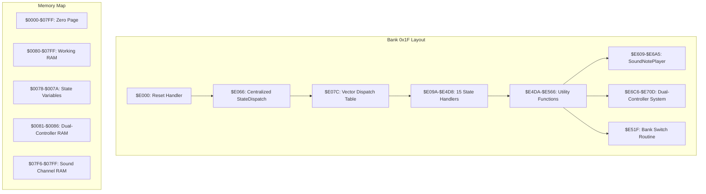
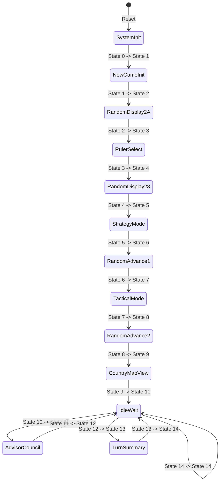
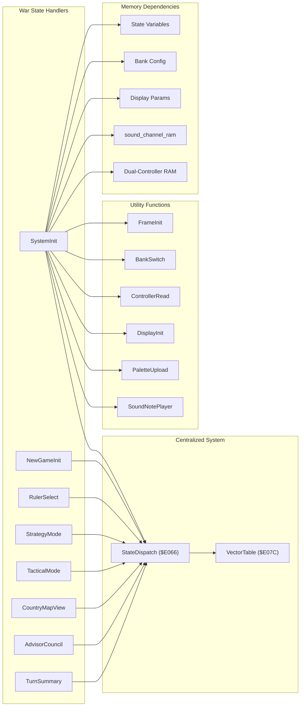
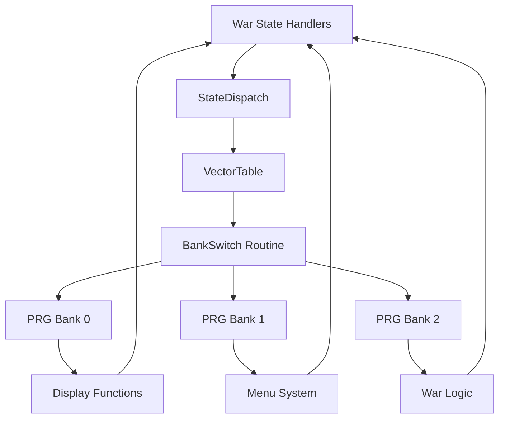

# Game State Management

<cite>
**Referenced Files in This Document**
- [prg_1f.asm](file://asm/banks/prg_1f.asm)
- [bank_1f_function_table.md](file://code/bank_1f_function_table.md)
- [key_functions_analysis.md](file://code/key_functions_analysis.md)
- [functions.h](file://include/functions.h)
- [rename_battle_to_war.py](file://tools/rename_battle_to_war.py)
- [terminology.md](file://docs/manual_kb/terminology.md)
</cite>

## Update Summary
**Changes Made**
- Updated state machine architecture and major game states documentation to use standardized 'war' terminology instead of 'battle' terminology throughout state descriptions and transitions
- Revised all references to battle phases, war setup procedures, and war-related state management to reflect the new terminology
- Updated state transition diagrams and flow charts to use consistent 'war' terminology
- Maintained all existing architectural patterns while ensuring terminology consistency across the documentation

## Table of Contents
1. [Introduction](#introduction)
2. [Project Structure](#project-structure)
3. [Core Components](#core-components)
4. [Architecture Overview](#architecture-overview)
5. [Detailed Component Analysis](#detailed-component-analysis)
6. [Dependency Analysis](#dependency-analysis)
7. [Performance Considerations](#performance-considerations)
8. [Troubleshooting Guide](#troubleshooting-guide)
9. [Conclusion](#conclusion)

## Introduction
This document provides comprehensive analysis of the game state management system in the Sango2DASM project, focusing on the 15-game state system implemented through a centralized vector dispatch table at $E07C. The system orchestrates different game phases including title screen, gameplay, war sequences, and menu systems, with careful coordination of memory bank switching and execution flow control. The architecture uses standardized 'war' terminology throughout state descriptions and transitions, reflecting the game's focus on strategic warfare rather than individual battles.

## Project Structure
The state management system is implemented entirely within Bank 0x1F ($E000-$FFFF), which serves as the boot bank containing the reset handler, centralized state dispatch mechanism, and all state-specific implementations. The system utilizes the Namco-163 mapper for dynamic bank switching across the 32 available PRG banks.

**Diagram sources**
- [prg_1f.asm:157-222](file://asm/banks/prg_1f.asm#L157-L222)
- [prg_1f.asm:224-255](file://asm/banks/prg_1f.asm#L224-L255)
- [prg_1f.asm:570-632](file://asm/banks/prg_1f.asm#L570-L632)

**Section sources**
- [prg_1f.asm:1-800](file://asm/banks/prg_1f.asm#L1-L800)
- [bank_1f_function_table.md:1-98](file://code/bank_1f_function_table.md#L1-L98)

## Core Components

### Centralized State Dispatch Architecture
The system employs a centralized StateDispatch procedure at $E066 that handles state selection through a 30-byte vector table containing 15 state entry points. Each state handler ends its execution by jumping to StateDispatch instead of implementing inline dispatch logic, providing consistent state entry points and improved maintainability.

### War-Focused State Machine Design
The system implements a classic finite state machine with 15 distinct states, each representing a specific game phase with standardized 'war' terminology:

**Diagram sources**
- [prg_1f.asm:239-255](file://asm/banks/prg_1f.asm#L239-L255)
- [prg_1f.asm:257-800](file://asm/banks/prg_1f.asm#L257-L800)

### Enhanced Sound Processing Pipeline
The sound system provides centralized audio processing through the SoundNotePlayer routine, supporting war-themed music and sound effects throughout different game states.

### State Variable Architecture
The system maintains two primary state variables in RAM:
- **addr_game_state ($007A)**: Main state counter (0-14) indexing the vector table
- **addr_sub_state ($0078)**: Sub-state within each major state, enabling fine-grained control over war phases

**Section sources**
- [prg_1f.asm:224-255](file://asm/banks/prg_1f.asm#L224-L255)
- [prg_1f.asm:56-60](file://asm/banks/prg_1f.asm#L56-L60)

## Architecture Overview

### Centralized State Dispatch Mechanism
The centralized dispatch system operates through a streamlined StateDispatch procedure that manages state transitions with standardized war terminology:

**Diagram sources**
- [prg_1f.asm:228-237](file://asm/banks/prg_1f.asm#L228-L237)

### War Phase State Machine
The system implements war-focused state transitions with standardized terminology:

| State | Name | Description | War Context |
|-------|------|-------------|-------------|
| 0 | SystemInit | System initialization and PPU setup | Pre-war preparation |
| 1 | NewGameInit | New game setup with SRAM initialization | War campaign start |
| 2 | RandomDisplay2A | Random seed + display transition | War scenario loading |
| 3 | RulerSelect | Kingdom/ruler selection | War faction choice |
| 4 | RandomDisplay28 | Random seed + display transition | War AI processing |
| 5 | StrategyMode | Domestic affairs and strategy commands | War planning phase |
| 6 | RandomAdvance1 | Random seed advance | War turn progression |
| 7 | TacticalMode | Tactical mode and war setup | War execution phase |
| 8 | RandomAdvance2 | Random seed advance | War result processing |
| 9 | CountryMapView | Territory/country map view | War territory management |
| 10 | IdleWait | Idle/wait state | War pause state |
| 11 | AdvisorCouncil | Advisor dialogue system | War counsel phase |
| 12 | IdleWait | Idle/wait state | War continuation |
| 13 | TurnSummary | Turn results and victory conditions | War outcome summary |
| 14 | IdleWait | Idle/wait state | War end state |

**Section sources**
- [prg_1f.asm:239-255](file://asm/banks/prg_1f.asm#L239-L255)
- [prg_1f.asm:257-800](file://asm/banks/prg_1f.asm#L257-L800)

## Detailed Component Analysis

### Reset Handler and Initialization
The reset handler performs critical initialization sequence with enhanced setup for war-focused gameplay:

1. **PPU Warmup**: Two-stage VBlank synchronization for stable PPU initialization
2. **APU Initialization**: Silence all sound channels and configure frame sequencer
3. **RAM Clear**: Full zero-page and working RAM initialization
4. **Mapper Setup**: Namco-163 configuration and controller validation
5. **State Initialization**: Set initial state to 0 and dispatch through centralized StateDispatch

### War-Focused State-Specific Implementation Patterns

#### System Initialization (State 0)
The system initialization state establishes the foundation for all subsequent war-related states:
- PPU initialization and palette setup
- Bank switching for display functions
- Transition to country map view state

#### New Game Initialization (State 1)
Handles new war campaign setup with controller input processing and SRAM initialization for war data.

#### Ruler Selection (State 3)
Manages kingdom/ruler selection with scenario mode detection and coordinate data handling for war factions.

#### Strategic Mode (State 5)
Coordinates domestic affairs and strategic planning for upcoming wars, including resource management and troop preparation.

#### Tactical Mode (State 7)
Coordinates army status checks and sprite clearing based on war outcomes, managing tactical war operations.

#### Country Map View (State 9)
Provides territory interface with scrolling calculations and palette management for war territory visualization.

#### Advisor Council (State 11)
Handles advisor dialogue system with menu cursor management for war strategy consultation.

#### Turn Summary (State 13)
Displays war turn results with victory condition checking and appropriate music selection for war outcomes.

**Section sources**
- [prg_1f.asm:257-289](file://asm/banks/prg_1f.asm#L257-L289)
- [prg_1f.asm:291-363](file://asm/banks/prg_1f.asm#L291-L363)
- [prg_1f.asm:376-452](file://asm/banks/prg_1f.asm#L376-L452)
- [prg_1f.asm:465-522](file://asm/banks/prg_1f.asm#L465-L522)
- [prg_1f.asm:570-632](file://asm/banks/prg_1f.asm#L570-L632)
- [prg_1f.asm:654-700](file://asm/banks/prg_1f.asm#L654-L700)
- [prg_1f.asm:709-760](file://asm/banks/prg_1f.asm#L709-L760)
- [prg_1f.asm:762-800](file://asm/banks/prg_1f.asm#L762-L800)

### Enhanced Data Structure Management

#### War Scene State Variables
Each state maintains its own working data structures in RAM with war-focused terminology:
- **Display parameters**: $0098-$009B for scroll and rendering
- **Dual-controller input**: $0082/$0085/$0086 for edge-triggered and raw input
- **Palette buffers**: $0100-$011F for color data
- **Menu systems**: $0424/$0425 for cursor positioning

#### Sound Channel Management
The sound system uses centralized channel management:
- **sound_channel_ram ($07F6)**: RAM copy of Namco sound channel state
- **SoundChannelTable ($E667)**: Maps logical channels to hardware channels
- **Sound wrapper functions**: Seven variants (SoundWrapperA-F) for different audio effects

#### Bank Configuration Storage
State handlers store bank configuration in dedicated RAM locations:
- **addr_bank_e6-$00ED**: 8-byte bank configuration array
- **addr_bank_ea/$00EB**: Extended bank configuration
- **addr_trampoline_*$:** Temporary storage for bank switching operations

**Section sources**
- [prg_1f.asm:56-155](file://asm/banks/prg_1f.asm#L56-L155)
- [prg_1f.asm:224-255](file://asm/banks/prg_1f.asm#L224-L255)

### Modernized Inter-State Communication Mechanisms

#### Centralized State Transition Protocol
States communicate through the centralized StateDispatch mechanism:
1. **Explicit transitions**: Direct increment of addr_game_state followed by StateDispatch
2. **Conditional transitions**: Based on war conditions (victory, defeat)
3. **Shared data**: Persistent RAM variables for cross-state war information

#### Enhanced Shared Resource Access
Common resources are accessed through centralized utility functions:
- **Frame initialization**: Consistent per-frame setup across all states via FrameInit
- **Display management**: Unified window and palette systems
- **Dual-controller input**: Standardized controller reading and edge detection
- **Sound processing**: Centralized SoundNotePlayer routine for audio effects

**Section sources**
- [prg_1f.asm:702-707](file://asm/banks/prg_1f.asm#L702-L707)

## Dependency Analysis

### War-Focused State Handler Dependencies
Each state handler depends on the centralized StateDispatch system with standardized war terminology:

**Diagram sources**
- [prg_1f.asm:224-255](file://asm/banks/prg_1f.asm#L224-L255)
- [prg_1f.asm:257-800](file://asm/banks/prg_1f.asm#L257-L800)

### Enhanced Bank Switching Dependencies
The bank switching system creates dependencies between states and memory banks with war-focused resource organization:

**Diagram sources**
- [prg_1f.asm:224-255](file://asm/banks/prg_1f.asm#L224-L255)

**Section sources**
- [prg_1f.asm:224-255](file://asm/banks/prg_1f.asm#L224-L255)

## Performance Considerations

### Streamlined Execution Flow Optimization
The centralized StateDispatch system provides several optimization benefits for war-focused gameplay:

1. **Reduced code duplication**: Single dispatch mechanism eliminates redundant inline dispatch logic
2. **Consistent frame timing**: Centralized frame initialization ensures predictable timing during war sequences
3. **Minimal state switching cost**: Direct RAM variable updates avoid expensive operations during war transitions
4. **Bank switching efficiency**: Centralized bank configuration reduces repeated setup for war resources
5. **Unified sound processing**: SoundNotePlayer provides optimized audio pipeline for war themes

### Enhanced Memory Usage Patterns
The system maintains strict memory optimization through:
- **Zero-page optimization**: Critical variables ($0078-$007A) placed in zero-page for fast access
- **Working RAM organization**: Structured layout enables efficient war state data management
- **Bank memory sharing**: Multiple states share common bank configurations to reduce memory footprint
- **Centralized sound RAM**: sound_channel_ram ($07F6) provides efficient channel state management

### Improved Timing Considerations
The system maintains strict timing through:
- **VBlank synchronization**: Consistent frame boundaries across all war states
- **NMI sub-dispatch**: Fine-grained control over rendering operations during war sequences
- **Interrupt-driven updates**: Dual-controller input processed during interrupts
- **Centralized sound scheduling**: SoundNotePlayer provides consistent audio timing for war effects

## Troubleshooting Guide

### Common War State Management Issues

#### State Variable Corruption
**Symptoms**: Unpredictable state transitions or handlers executing incorrectly during war sequences
**Causes**: 
- Direct modification of addr_game_state outside state handlers
- Memory corruption in zero-page variables
- Improper bank switching affecting war RAM contents

**Solutions**:
- Use only state handlers to modify addr_game_state
- Verify bank switching restores correct war RAM contents
- Implement memory integrity checks

#### Centralized Dispatch Problems
**Symptoms**: War states not executing or jumping to wrong handlers
**Causes**:
- Incorrect VectorTable entries
- Modified StateDispatch procedure
- Invalid state indices (exceeding 14)

**Solutions**:
- Verify VectorTable contains valid addresses for war states 0-14
- Check StateDispatch logic for proper masking and indexing
- Ensure addr_game_state stays within 0-14 range

#### Dual-Controller Input Issues
**Symptoms**: Controller input not detected or incorrect edge triggering during war operations
**Causes**:
- Using old addr_pad1_* addresses instead of addr_pad2_*
- Incorrect controller strobe timing
- Memory corruption in controller RAM

**Solutions**:
- Use addr_pad2_edge, addr_pad2_raw, addr_pad2_prev addresses
- Verify ControllerRead routine executes correctly
- Check controller RAM integrity

#### Sound System Problems
**Symptoms**: War music not playing or incorrect channel assignment
**Causes**:
- Invalid sound channel indices (≥ 4)
- Incorrect sound_channel_ram state
- Missing sound initialization

**Solutions**:
- Verify sound_channel_ram contains valid war sound data
- Use SoundNotePlayer instead of direct register manipulation
- Ensure SoundInit routine executes during reset

**Section sources**
- [prg_1f.asm:224-255](file://asm/banks/prg_1f.asm#L224-L255)

## Conclusion

The Sango2DASM state management system demonstrates sophisticated design patterns for NES game development with standardized 'war' terminology throughout. The centralized StateDispatch architecture provides clean separation of concerns while maintaining efficient execution flow for war-focused gameplay. The integration with the Namco-163 mapper enables flexible memory management across 32 PRG banks, allowing each war state to access specialized resources.

**Key improvements in the current system:**
- **Centralized dispatch**: Single StateDispatch procedure eliminates code duplication
- **Standardized terminology**: Consistent 'war' terminology throughout state descriptions and transitions
- **Enhanced sound system**: SoundNotePlayer provides optimized audio processing for war themes
- **Improved maintainability**: Consistent state handler patterns across all 15 states

Key strengths of the system include:
- **Predictable timing**: Centralized frame management ensures consistent execution during war sequences
- **Memory efficiency**: Optimized RAM usage with zero-page prioritization
- **Bank flexibility**: Dynamic bank switching enables modular war resource organization
- **Extensibility**: Well-defined patterns support easy addition of new war states

The system's architecture provides a solid foundation for extending the game with additional war states, menus, or gameplay mechanics while maintaining the established patterns and performance characteristics. The centralized approach ensures that future modifications can be made efficiently while preserving the system's reliability and performance.