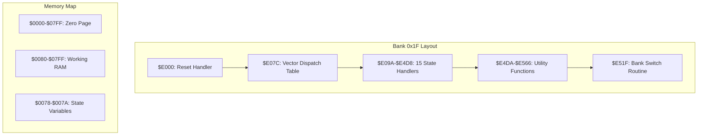
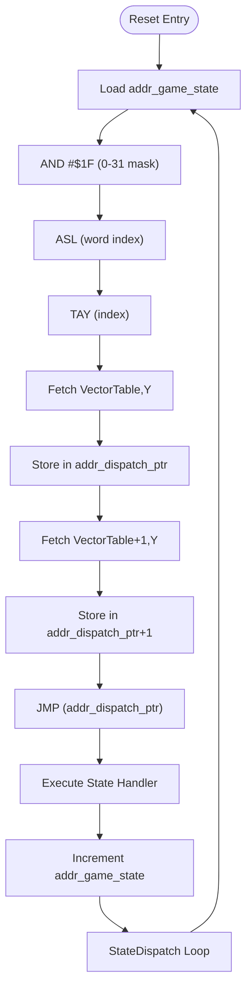
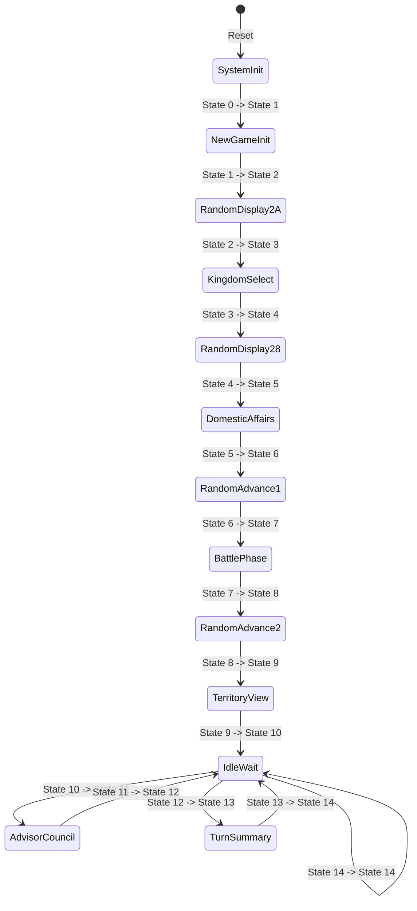
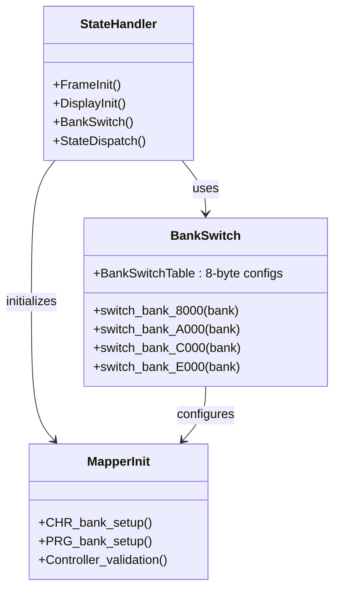
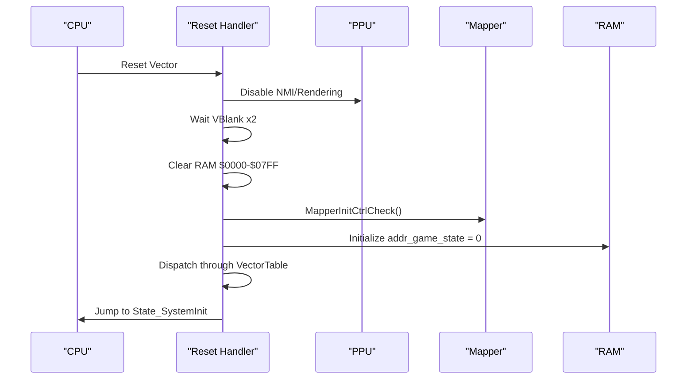
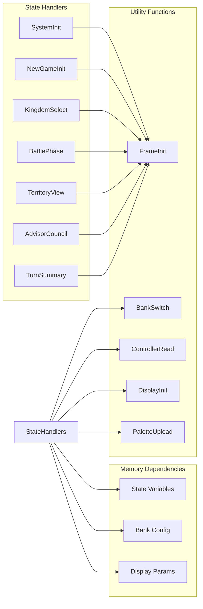
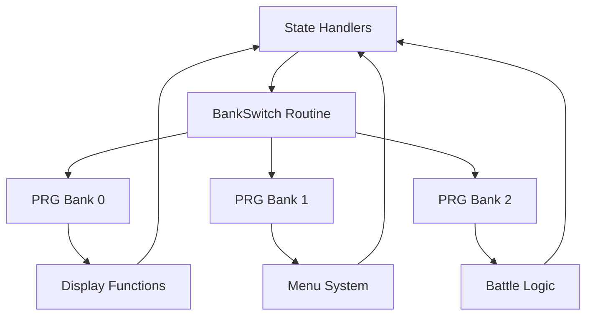

# Game State Management

<cite>
**Referenced Files in This Document**
- [prg_1f.asm](file://asm/banks/prg_1f.asm)
- [bank_1f_function_table.md](file://code/bank_1f_function_table.md)
- [key_functions_analysis.md](file://code/key_functions_analysis.md)
- [namco163.h](file://include/namco163.h)
</cite>

## Table of Contents
1. [Introduction](#introduction)
2. [Project Structure](#project-structure)
3. [Core Components](#core-components)
4. [Architecture Overview](#architecture-overview)
5. [Detailed Component Analysis](#detailed-component-analysis)
6. [Dependency Analysis](#dependency-analysis)
7. [Performance Considerations](#performance-considerations)
8. [Troubleshooting Guide](#troubleshooting-guide)
9. [Conclusion](#conclusion)

## Introduction
This document provides comprehensive analysis of the game state management system in the Sango2DASM project, focusing on the 15-game state system implemented through a vector dispatch table at $E07C. The system orchestrates different game phases including title screen, gameplay, battle sequences, and menu systems, with careful coordination of memory bank switching and execution flow control.

## Project Structure
The state management system is implemented entirely within Bank 0x1F ($E000-$FFFF), which serves as the boot bank containing the reset handler, state dispatch mechanism, and all state-specific implementations. The system utilizes the Namco-163 mapper for dynamic bank switching across the 32 available PRG banks.

**Diagram sources**
- [prg_1f.asm:72-148](file://asm/banks/prg_1f.asm#L72-L148)
- [prg_1f.asm:151-168](file://asm/banks/prg_1f.asm#L151-L168)
- [prg_1f.asm:738-749](file://asm/banks/prg_1f.asm#L738-L749)

**Section sources**
- [prg_1f.asm:1-800](file://asm/banks/prg_1f.asm#L1-L800)
- [bank_1f_function_table.md:1-98](file://code/bank_1f_function_table.md#L1-L98)

## Core Components

### State Variable Architecture
The system maintains two primary state variables in RAM:
- **addr_game_state ($007A)**: Main state counter (0-14) indexing the vector table
- **addr_sub_state ($0078)**: Sub-state within each major state, enabling fine-grained control

### Vector Dispatch Mechanism
The central dispatch system operates through a 30-byte vector table containing 15 state entry points:

**Diagram sources**
- [prg_1f.asm:138-147](file://asm/banks/prg_1f.asm#L138-L147)
- [prg_1f.asm:740-749](file://asm/banks/prg_1f.asm#L740-L749)

**Section sources**
- [prg_1f.asm:21-26](file://asm/banks/prg_1f.asm#L21-L26)
- [prg_1f.asm:151-168](file://asm/banks/prg_1f.asm#L151-L168)
- [prg_1f.asm:738-749](file://asm/banks/prg_1f.asm#L738-L749)

## Architecture Overview

### State Machine Design
The system implements a classic finite state machine with 15 distinct states, each representing a specific game phase:

**Diagram sources**
- [prg_1f.asm:153-168](file://asm/banks/prg_1f.asm#L153-L168)

### Memory Bank Management
The system utilizes the Namco-163 mapper for dynamic bank switching across 32 PRG banks. Each state can access different memory banks through the centralized bank switching mechanism:

**Diagram sources**
- [prg_1f.asm:785-817](file://asm/banks/prg_1f.asm#L785-L817)
- [prg_1f.asm:2477-2505](file://asm/banks/prg_1f.asm#L2477-L2505)

**Section sources**
- [prg_1f.asm:781-818](file://asm/banks/prg_1f.asm#L781-L818)
- [prg_1f.asm:2475-2506](file://asm/banks/prg_1f.asm#L2475-L2506)
- [namco163.h:10-14](file://include/namco163.h#L10-L14)

## Detailed Component Analysis

### Reset Handler and Initial State Setup
The reset handler performs critical initialization sequence:

1. **PPU Warmup**: Two-stage VBlank synchronization for stable PPU initialization
2. **APU Initialization**: Silence all sound channels and configure frame sequencer
3. **RAM Clear**: Full zero-page and working RAM initialization
4. **Mapper Setup**: Namco-163 configuration and controller validation
5. **State Initialization**: Set initial state to 0 and dispatch

**Diagram sources**
- [prg_1f.asm:74-147](file://asm/banks/prg_1f.asm#L74-L147)

**Section sources**
- [prg_1f.asm:74-147](file://asm/banks/prg_1f.asm#L74-L147)

### State-Specific Implementation Patterns

#### System Initialization (State 0)
The system initialization state establishes the foundation for all subsequent states:

- PPU initialization and palette setup
- Bank switching for display functions
- Transition to territory view state

#### New Game Initialization (State 1)
Handles new game setup with controller input processing and SRAM initialization.

#### Kingdom Selection (State 3)
Manages kingdom selection with scenario mode detection and coordinate data handling.

#### Battle Phase (State 7)
Coordinates army status checks and sprite clearing based on combat outcomes.

#### Territory View (State 9)
Provides map interface with scrolling calculations and palette management.

#### Advisor Council (State 11)
Handles advisor dialogue system with menu cursor management.

#### Turn Summary (State 13)
Displays turn results with victory condition checking and appropriate music selection.

**Section sources**
- [prg_1f.asm:174-202](file://asm/banks/prg_1f.asm#L174-L202)
- [prg_1f.asm:210-276](file://asm/banks/prg_1f.asm#L210-L276)
- [prg_1f.asm:295-365](file://asm/banks/prg_1f.asm#L295-L365)
- [prg_1f.asm:493-550](file://asm/banks/prg_1f.asm#L493-L550)
- [prg_1f.asm:575-619](file://asm/banks/prg_1f.asm#L575-L619)
- [prg_1f.asm:630-680](file://asm/banks/prg_1f.asm#L630-L680)
- [prg_1f.asm:686-735](file://asm/banks/prg_1f.asm#L686-L735)

### Data Structure Management

#### State Variables
Each state maintains its own working data structures in RAM:
- **Display parameters**: $0098-$009B for scroll and rendering
- **Controller input**: $0081/$0083/$0084 for edge-triggered and raw input
- **Palette buffers**: $0100-$011F for color data
- **Menu systems**: $0424/$0425 for cursor positioning

#### Bank Configuration Storage
State handlers store bank configuration in dedicated RAM locations:
- **addr_bank_e6-$00ED**: 8-byte bank configuration array
- **addr_bank_ea/$00EB**: Extended bank configuration
- **addr_trampoline_*$:** Temporary storage for bank switching operations

**Section sources**
- [prg_1f.asm:27-69](file://asm/banks/prg_1f.asm#L27-L69)
- [prg_1f.asm:824-827](file://asm/banks/prg_1f.asm#L824-L827)

### Inter-State Communication Mechanisms

#### State Transition Protocol
States communicate primarily through the global state counter:
1. **Explicit transitions**: Direct increment of addr_game_state
2. **Conditional transitions**: Based on game conditions (victory, defeat)
3. **Shared data**: Persistent RAM variables for cross-state information

#### Shared Resource Access
Common resources are accessed through centralized utility functions:
- **Frame initialization**: Consistent per-frame setup across all states
- **Display management**: Unified window and palette systems
- **Input handling**: Standardized controller reading and edge detection

**Section sources**
- [prg_1f.asm:755-779](file://asm/banks/prg_1f.asm#L755-L779)
- [prg_1f.asm:1040-1065](file://asm/banks/prg_1f.asm#L1040-L1065)

## Dependency Analysis

### State Handler Dependencies
Each state handler depends on specific utility functions and memory layouts:

**Diagram sources**
- [prg_1f.asm:755-779](file://asm/banks/prg_1f.asm#L755-L779)
- [prg_1f.asm:785-817](file://asm/banks/prg_1f.asm#L785-L817)
- [prg_1f.asm:1040-1065](file://asm/banks/prg_1f.asm#L1040-L1065)

### Bank Switching Dependencies
The bank switching system creates dependencies between states and memory banks:

**Diagram sources**
- [prg_1f.asm:785-817](file://asm/banks/prg_1f.asm#L785-L817)
- [prg_1f.asm:824-827](file://asm/banks/prg_1f.asm#L824-L827)

**Section sources**
- [prg_1f.asm:785-817](file://asm/banks/prg_1f.asm#L785-L817)
- [prg_1f.asm:824-827](file://asm/banks/prg_1f.asm#L824-L827)

## Performance Considerations

### Execution Flow Optimization
The state management system employs several optimization strategies:

1. **Vector dispatch**: Direct function pointer resolution eliminates branching overhead
2. **Consistent frame timing**: Centralized frame initialization ensures predictable timing
3. **Minimal state switching cost**: Direct RAM variable updates avoid expensive operations
4. **Bank switching efficiency**: Centralized bank configuration reduces repeated setup

### Memory Usage Patterns
- **Zero-page optimization**: Critical variables ($0078-$007A) placed in zero-page for fast access
- **Working RAM organization**: Structured layout enables efficient state data management
- **Bank memory sharing**: Multiple states share common bank configurations to reduce memory footprint

### Timing Considerations
The system maintains strict timing through:
- **VBlank synchronization**: Consistent frame boundaries across all states
- **NMI sub-dispatch**: Fine-grained control over rendering operations
- **Interrupt-driven updates**: Controller input processed during interrupts

## Troubleshooting Guide

### Common State Management Issues

#### State Variable Corruption
**Symptoms**: Unpredictable state transitions or handlers executing incorrectly
**Causes**: 
- Direct modification of addr_game_state outside state handlers
- Memory corruption in zero-page variables
- Improper bank switching affecting RAM contents

**Solutions**:
- Use only state handlers to modify addr_game_state
- Verify bank switching restores correct RAM contents
- Implement memory integrity checks

#### Bank Switching Problems
**Symptoms**: Incorrect graphics, missing data, or crashes during state transitions
**Causes**:
- Improper bank configuration in BankSwitchTable
- Missing bank restoration in interrupt handlers
- Conflicting bank assignments between states

**Solutions**:
- Verify BankSwitchTable entries match intended bank configurations
- Ensure NMI handler restores bank registers before processing
- Use centralized bank switching routine for consistency

#### Display Issues
**Symptoms**: Incorrect graphics, palette problems, or rendering artifacts
**Causes**:
- Inconsistent display parameter setup
- Missing palette uploads
- Incorrect CHR bank switching

**Solutions**:
- Use DisplayInit helper for consistent setup
- Verify palette uploads after bank switches
- Check CHR bank configuration matches graphics data

**Section sources**
- [prg_1f.asm:2559-2659](file://asm/banks/prg_1f.asm#L2559-L2659)
- [prg_1f.asm:785-817](file://asm/banks/prg_1f.asm#L785-L817)
- [prg_1f.asm:1071-1084](file://asm/banks/prg_1f.asm#L1071-L1084)

## Conclusion

The Sango2DASM state management system demonstrates sophisticated design patterns for NES game development. The 15-state vector dispatch architecture provides clean separation of concerns while maintaining efficient execution flow. The integration with the Namco-163 mapper enables flexible memory management across 32 PRG banks, allowing each state to access specialized resources.

Key strengths of the system include:
- **Predictable timing**: Centralized frame management ensures consistent execution
- **Memory efficiency**: Optimized RAM usage with zero-page prioritization
- **Bank flexibility**: Dynamic bank switching enables modular resource organization
- **Extensibility**: Well-defined patterns support easy addition of new states

The system's architecture provides a solid foundation for extending the game with additional states, menus, or gameplay mechanics while maintaining the established patterns and performance characteristics.